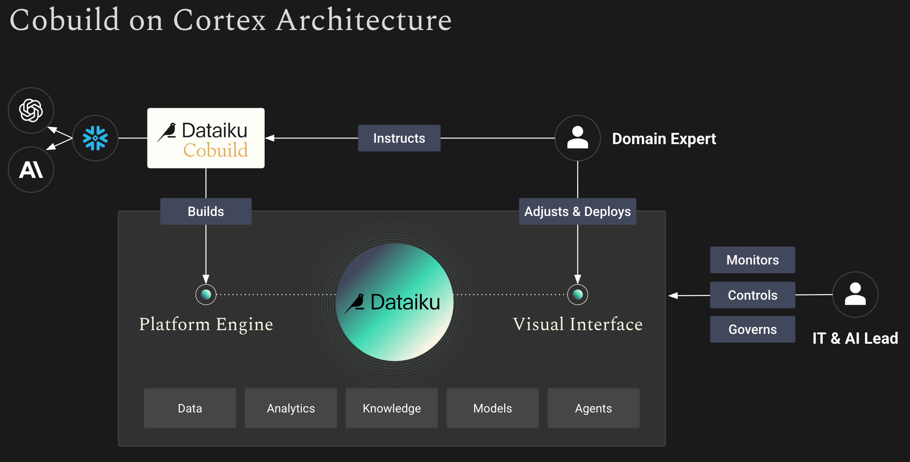
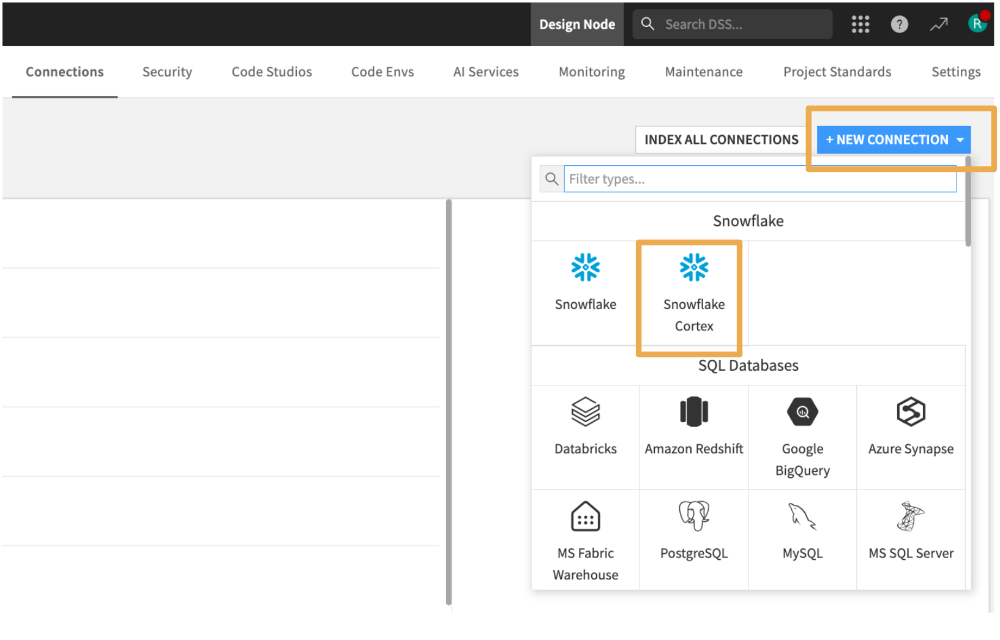
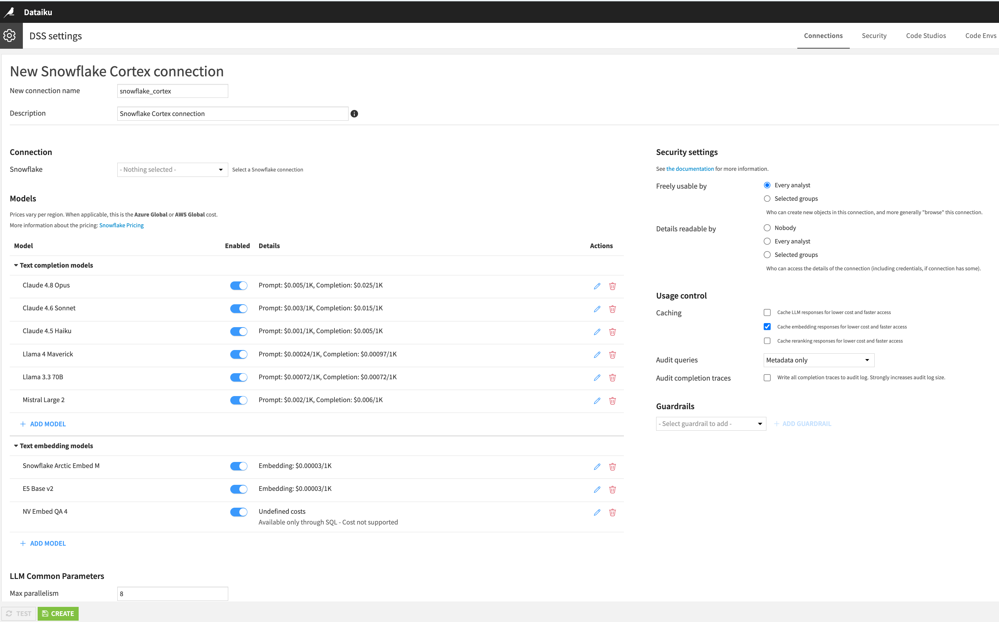
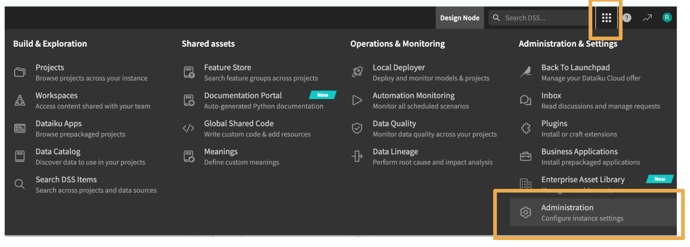
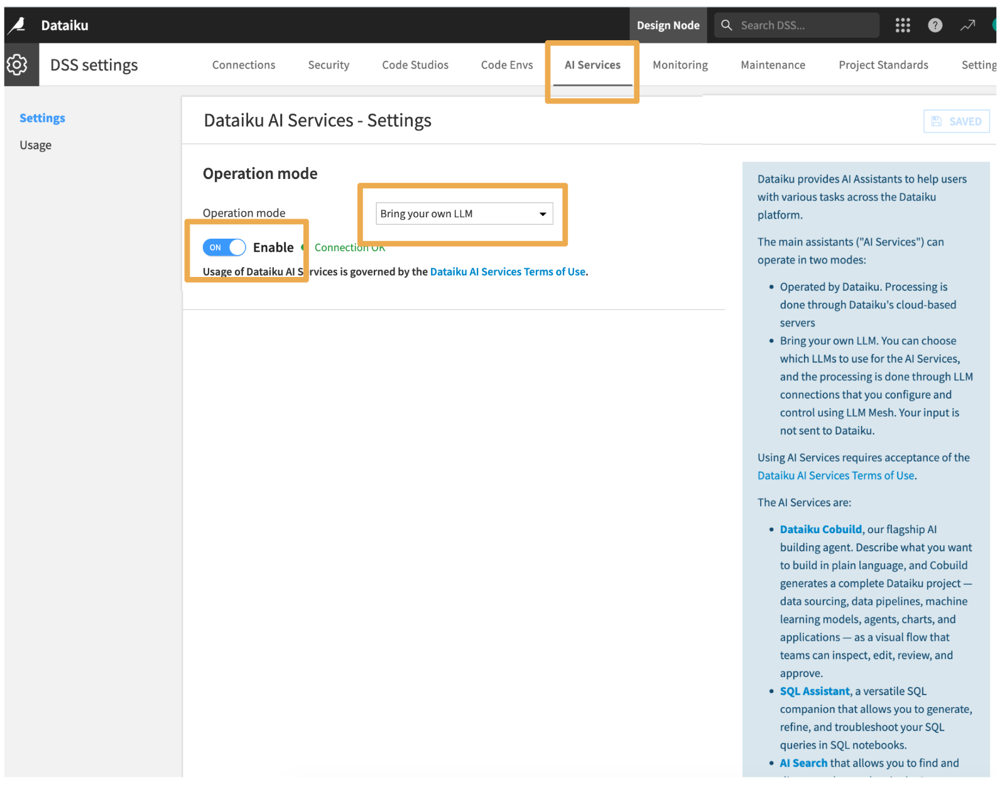
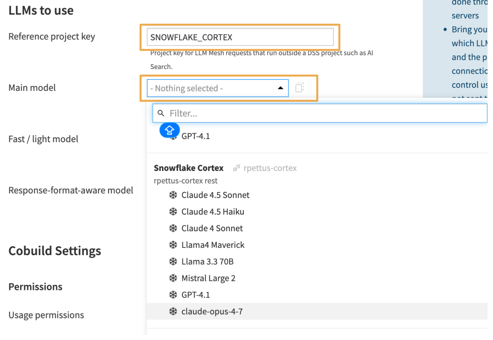
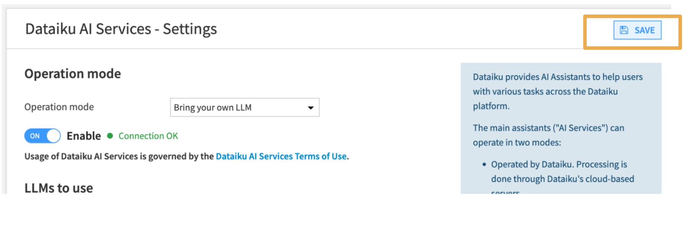
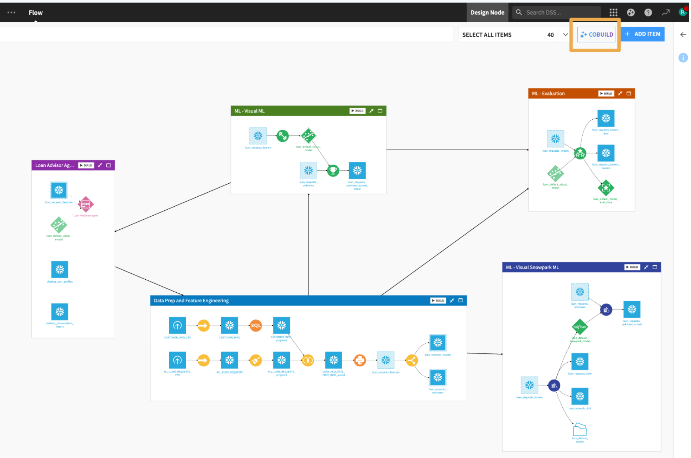
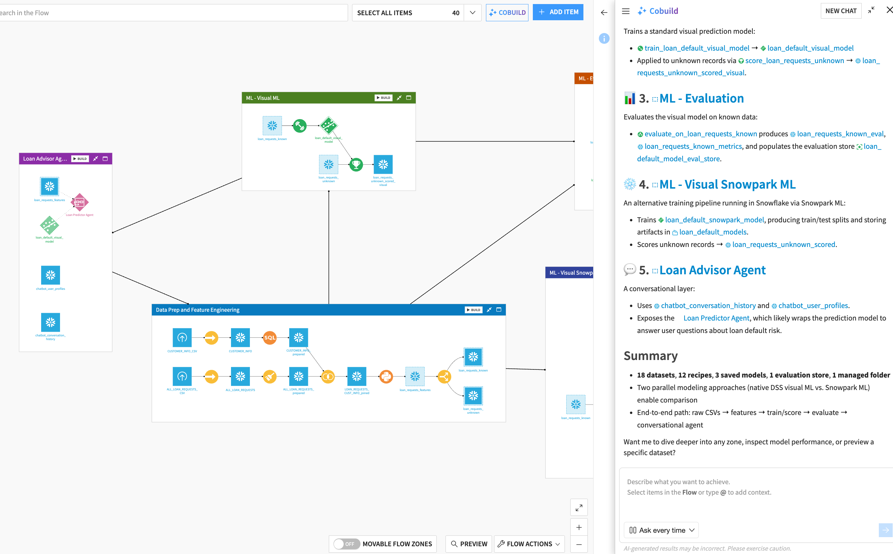

author: Randy Pettus
id: build-production-ai-with-dataiku-cobuild-on-snowflake
summary: Learn how to set up Dataiku Cobuild with Snowflake Cortex to build production-grade AI, data, and ML pipelines using natural language.
categories: snowflake-site:taxonomy/solution-center/certification/quickstart, snowflake-site:taxonomy/solution-center/certification/partner-solution, snowflake-site:taxonomy/product/ai, snowflake-site:taxonomy/snowflake-feature/model-development, snowflake-site:taxonomy/snowflake-feature/applied-analytics
environments: web
status: Published
language: en
feedback link: https://github.com/Snowflake-Labs/sfguides/issues

# Build Production AI via Natural Language with Dataiku Cobuild on Snowflake
<!-- ------------------------ -->

## Overview
Duration: 3

[Dataiku Cobuild on Snowflake](https://www.dataiku.com/product/cobuild-on-snowflake) is an AI agent that turns natural-language requests into production-ready AI workflows, agents, and applications running on Snowflake. Powered by Snowflake Cortex, Cobuild lets teams describe a goal in plain language and get back an inspectable visual workflow they can review and govern before it reaches production, putting AI building within reach of analysts, operations teams, and business users.

This guide walks through how to set up Dataiku Cobuild with Snowflake Cortex to give your team model flexibility and AI governance while building production-grade data and ML pipelines. Cobuild is particularly useful for:

- **Building new data and AI projects from scratch:** describe your goal in plain language and Cobuild generates a complete, visual flow ready for review and deployment
- **Refactoring existing workflows:** point Cobuild at an existing project and ask it to optimize, restructure, or extend what's already there
- **Writing documentation:** ask Cobuild to explain any project or pipeline in plain language and write detailed documentation, making it easier for teams to understand and hand off work



### Prerequisites

This guide is designed for users who already have a Dataiku instance connected to Snowflake. If you are new to Dataiku and Snowflake, visit the [Snowflake Developers Guides](https://www.snowflake.com/en/developers/guides/) and search for Dataiku to find guides that cover the initial setup and integration.

- A Snowflake account with access to Cortex LLM features
- A Dataiku instance connected to Snowflake

### What You'll Learn

- How to prepare your Snowflake environment for Cobuild
- How to connect Snowflake Cortex to Dataiku
- How to use Dataiku Cobuild to build and deploy production AI pipelines via natural language

### What You'll Need

- ACCOUNTADMIN or equivalent privileges in Snowflake to configure role grants and account-level settings
- An active Dataiku instance with an existing Snowflake connection and administrative access

### What You'll Build

- A production AI pipeline built through natural language prompts in Dataiku Cobuild, governed and deployed on Snowflake

<!-- ------------------------ -->

## Snowflake Setup Steps
Duration: 2

### Cortex Role Grants

Dataiku calls Snowflake Cortex via the REST API, which requires the user's default role to have either `SNOWFLAKE.CORTEX_USER` (all Cortex features, granted to PUBLIC by default) or `SNOWFLAKE.CORTEX_REST_API_USER` (REST API only). In most accounts no action is needed. If access has been revoked, run as ACCOUNTADMIN:

```sql
-- Option 1: Full Cortex access
GRANT DATABASE ROLE SNOWFLAKE.CORTEX_USER TO ROLE <your_dataiku_role>;

-- Option 2: REST API access only
GRANT DATABASE ROLE SNOWFLAKE.CORTEX_REST_API_USER TO ROLE <your_dataiku_role>;
```

Also confirm the Dataiku service user's default role is set correctly:

```sql
ALTER USER <dataiku_service_user> SET DEFAULT_ROLE = <your_dataiku_role>;
```

See the [Snowflake Cortex REST API documentation](https://docs.snowflake.com/en/user-guide/snowflake-cortex/cortex-rest-api) for more detail.

### Enable Cortex Cross-Region Inference

Enabling cross-region inference gives Dataiku access to a broader set of foundation models and increases rate limits by routing requests to available inference capacity across regions.

Run the following as ACCOUNTADMIN:

```sql
ALTER ACCOUNT SET CORTEX_ENABLED_CROSS_REGION = 'ANY_REGION';
```

<!-- ------------------------ -->

## Connecting Cortex to Dataiku
Duration: 5

### Create a New Snowflake Cortex Connection

In Dataiku, navigate to **Administration > Connections**, click **+ New Connection**, and select **Snowflake Cortex** from the connection type list.



### Configure the Connection

Select your existing Snowflake connection and configure your model options. From this screen you can control which models are available to your team. Under **Usage Control**, you can enable **Prompt Caching** to reduce redundant token usage and lower inference costs.



Once saved, this connection is available across LLM Mesh, Agents, LLM recipes, and Cobuild.

### Enable AI Services for Cobuild

With the Cortex connection in place, you need to point Dataiku's AI Services at it so Cobuild can use it. From the grid menu in the top navigation, go to **Administration**.



Click the **AI Services** tab, set the Operation mode to **Bring your own LLM**, and click **Enable**. You will be prompted to accept Dataiku's AI Services Terms of Use before proceeding.



### Configure Cobuild LLMs

Under **LLMs to use**, enter your **Reference project key** (this is used for LLM Mesh requests that run outside a DSS project, such as AI Search). Then select a **Main model** from your Snowflake Cortex connection. You can also optionally assign a **Fast / light model** and a **Response-format-aware model** for different task types.



Fill in any additional usage permissions or global custom instructions, then click **Save**. Your Cortex configuration is now active and ready for Cobuild.



<!-- ------------------------ -->

## Using Dataiku Cobuild
Duration: 5

### Start with an Existing Project

Open any existing Dataiku project and click **Cobuild** from the project view.



Cobuild will inspect your flow automatically. You can also select specific items directly in the flow to give Cobuild more targeted context, or type `@` in the prompt to reference a specific dataset, recipe, or model by name.

Before running any actions, you can choose how Cobuild executes: either prompt you to **approve each action** before it runs, or set it to **automatic execution** so Cobuild applies changes without waiting for confirmation.

To get started with Cobuild, type:

```
Explain my project
```

Cobuild will analyze your project and return a plain-language summary of what it contains, how it's structured, and what it does. Here's an example of what that looks like:



This is a good starting point to verify your Cortex connection is working and to get oriented before building or refactoring.

### Build a Pipeline from Scratch

Once you're comfortable with how Cobuild reads your project, try starting fresh with a new dataset connected to Snowflake. Connect your data and then ask Cobuild to do the heavy lifting:

```
Build a full end-to-end pipeline using this data. Prepare the features, train a model, and score it on unseen data.
```

Cobuild will generate the complete flow as a visual, inspectable pipeline that your team can review and refine before anything runs in production.

<!-- ------------------------ -->

## Conclusion And Resources
Duration: 2

You now have Dataiku Cobuild connected to Snowflake Cortex and a production AI pipeline built entirely through natural language. From here you can apply the same workflow to new projects, refactor existing Dataiku flows, or use Cobuild to generate documentation for pipelines your team already owns.

### What You Learned

- How to configure Snowflake for use with Dataiku Cobuild
- How to connect Snowflake Cortex to a Dataiku instance
- How to build and deploy a production AI pipeline using natural language in Cobuild

### Related Resources

- [Dataiku Cobuild on Snowflake](https://www.dataiku.com/product/cobuild-on-snowflake)
- [Dataiku Cobuild Knowledge Base](https://knowledge.dataiku.com/latest/ui/cobuild/concept-cobuild.html)
- [Dataiku Documentation](https://doc.dataiku.com)
- [Snowflake Cortex REST API](https://docs.snowflake.com/en/user-guide/snowflake-cortex/cortex-rest-api)
- [Snowflake Cortex AI Documentation](https://docs.snowflake.com/en/guides-overview-ai-features)
- [Dataiku on Snowflake Marketplace](https://app.snowflake.com/marketplace/listing/GZTSZNUFX99I/dataiku-dataiku-for-enterprise-ai)
