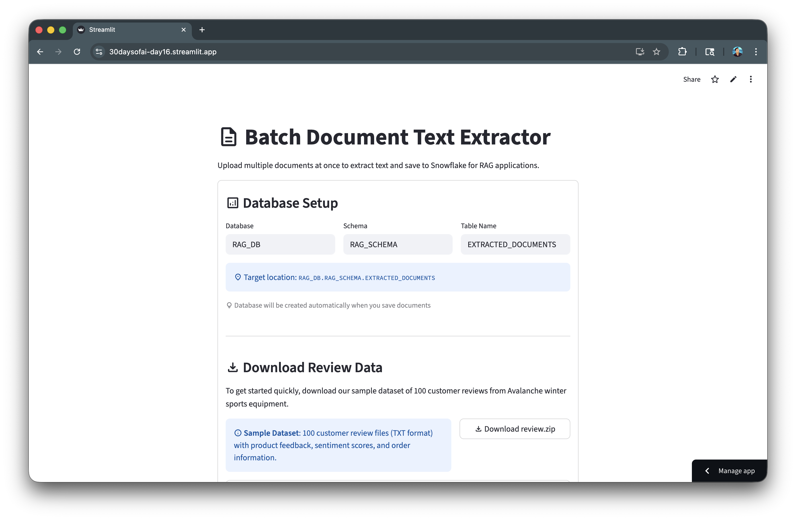
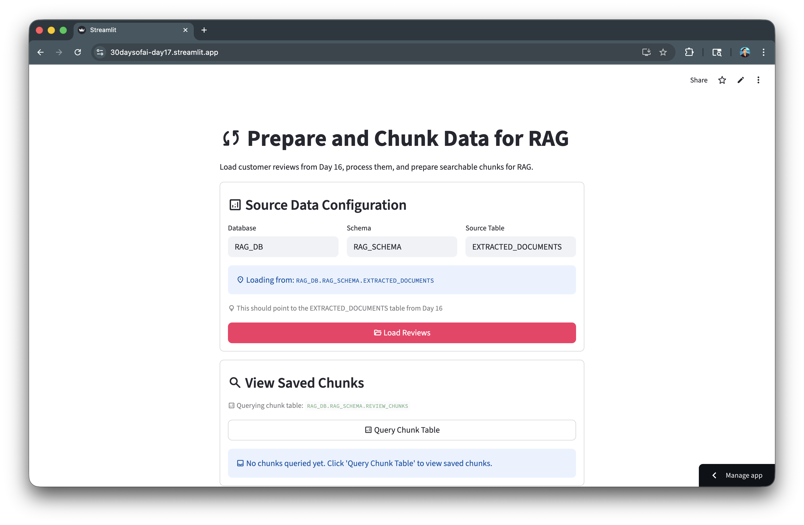
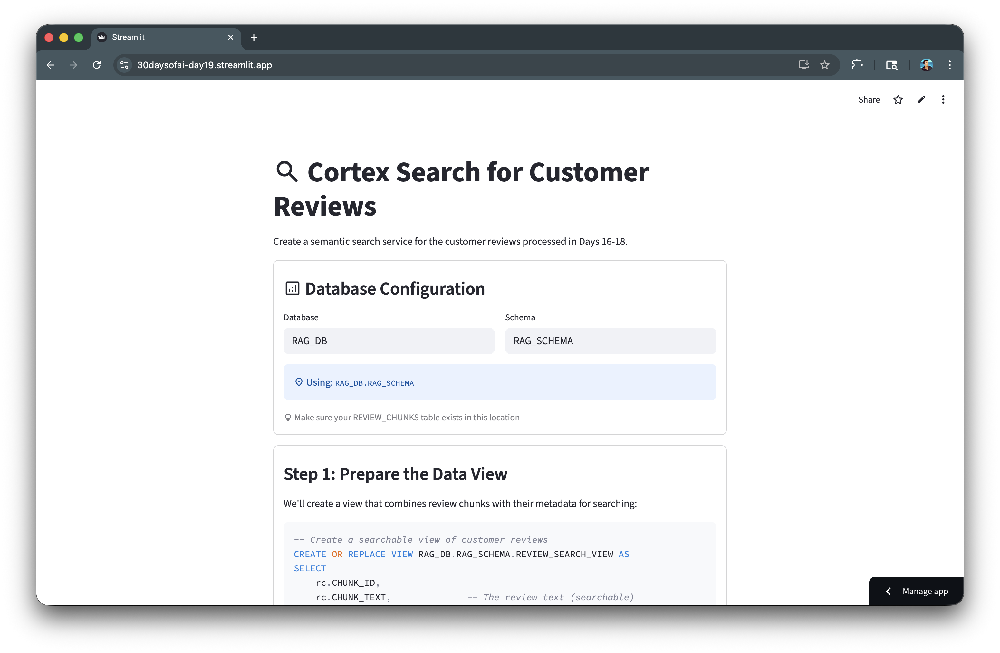
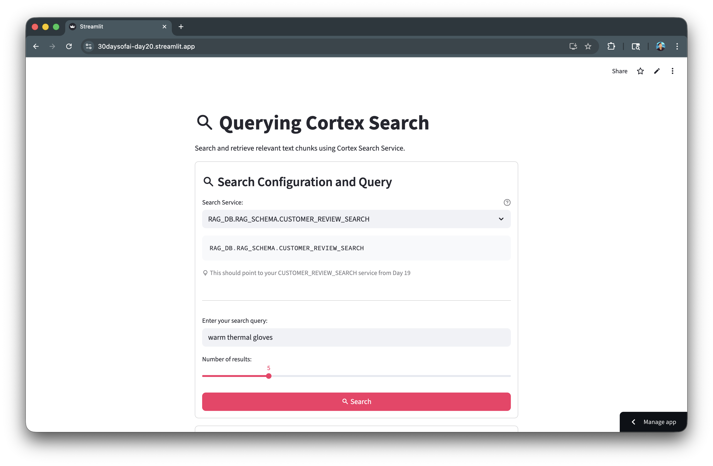
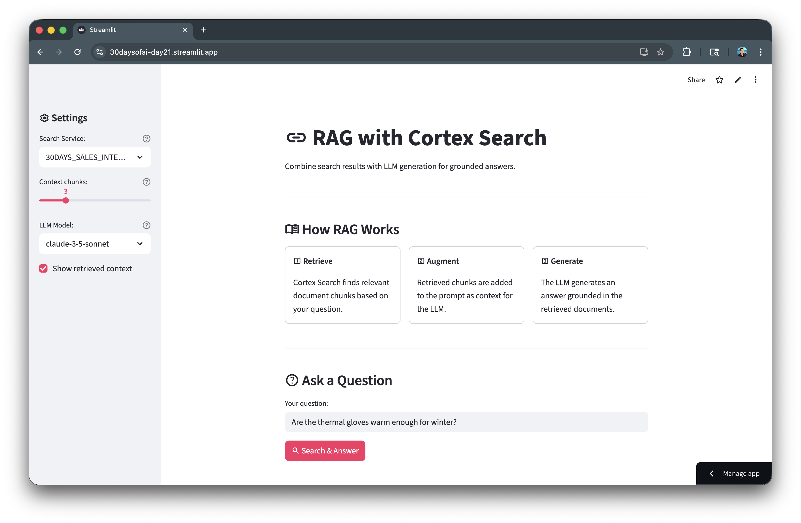
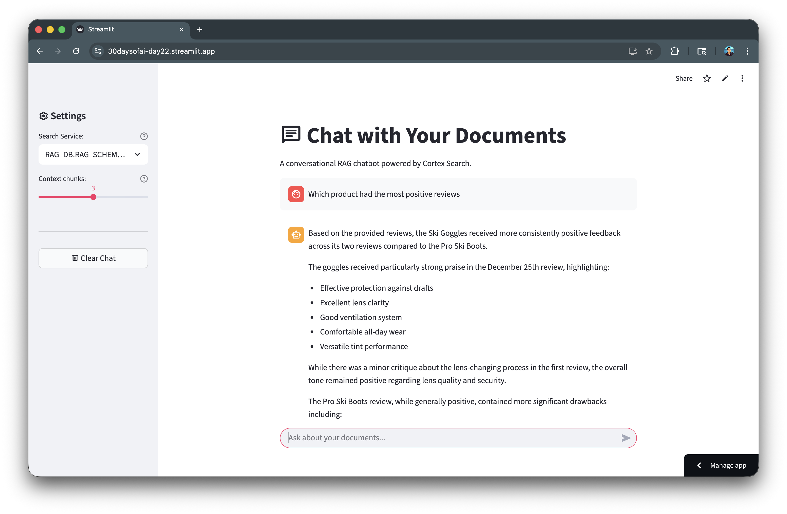
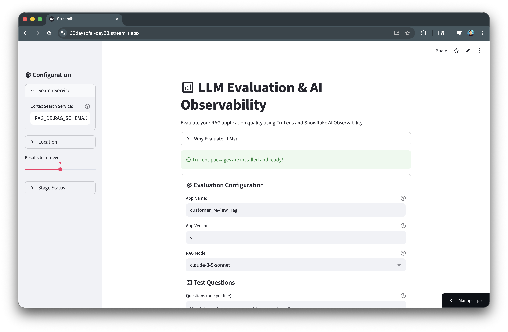

author: Chanin Nantasenamat
id: build-rag-app-with-streamlit-and-snowflake-cortex
summary: Build a complete RAG pipeline with Snowflake Cortex Search, from data preparation and chunking to creating a conversational chatbot with TruLens evaluation.
categories: snowflake-site:taxonomy/solution-center/certification/quickstart,snowflake-site:taxonomy/product/ai
language: en
environments: web
status: Published
feedback link: https://github.com/Snowflake-Labs/sfguides/issues
tags: Streamlit, Cortex Search, RAG, Vector Embeddings, TruLens, AI Observability

# Build a RAG App with Streamlit and Snowflake Cortex
<!-- ------------------------ -->
## Overview

Retrieval-Augmented Generation (RAG) enhances LLM responses by grounding them in your own data. Instead of relying solely on a model's training knowledge, RAG retrieves relevant documents and uses them as context thereby reducing hallucinations and enabling accurate, domain-specific answers.

In this quickstart, you'll build a complete RAG pipeline using Snowflake Cortex Search. Starting from raw documents, you'll learn data preparation, text chunking, creating a search service, building a conversational RAG chatbot, and evaluating quality with TruLens. 

This tutorial distills key lessons from the [#30DaysOfAI](https://30daysofai.streamlit.app/) learning challenge into a hands-on guide.

### What You'll Learn
- How to prepare and chunk documents for RAG (Days 16-17)
- How to generate embeddings for semantic search (Day 18)
- How to create and configure a Cortex Search service (Day 19)
- How to query Cortex Search for semantic retrieval (Day 20)
- How to build a RAG chatbot with grounded responses (Day 21)
- How to add guardrails to keep responses on-topic (Day 22)
- How to evaluate RAG quality with TruLens and AI Observability (Day 23)

### What You'll Build
A complete RAG system including a Cortex Search service for customer reviews and a conversational chatbot that answers questions grounded in retrieved documents, with TruLens evaluation for quality metrics.

### Prerequisites
- Access to a [Snowflake account](https://signup.snowflake.com/?utm_source=snowflake-devrel&utm_medium=developer-guides&utm_cta=developer-guides)
- Basic knowledge of Python and Streamlit
- A Snowflake warehouse with Cortex Search and LLM access

<!-- ------------------------ -->
## Getting Started

Clone or download the code from the [30daysofai](https://github.com/streamlit/30daysofai) GitHub repository:

```bash
git clone https://github.com/streamlit/30DaysOfAI.git
cd 30DaysOfAI/app
```

The app code for this quickstart:
- [Day 16: Document Extraction](https://github.com/streamlit/30DaysOfAI/blob/main/app/day16.py)
- [Day 17: Data Preparation & Chunking](https://github.com/streamlit/30DaysOfAI/blob/main/app/day17.py)
- [Day 18: Generate Embeddings](https://github.com/streamlit/30DaysOfAI/blob/main/app/day18.py)
- [Day 19: Create Search Service](https://github.com/streamlit/30DaysOfAI/blob/main/app/day19.py)
- [Day 20: Query Cortex Search](https://github.com/streamlit/30DaysOfAI/blob/main/app/day20.py)
- [Day 21: RAG Chatbot](https://github.com/streamlit/30DaysOfAI/blob/main/app/day21.py)
- [Day 22: Chat with Guardrails](https://github.com/streamlit/30DaysOfAI/blob/main/app/day22.py)
- [Day 23: TruLens Evaluation](https://github.com/streamlit/30DaysOfAI/blob/main/app/day23.py)

### Requirements

Save the appropriate requirements content to `requirements.txt` in your project directory, or add them to your Streamlit in Snowflake app's package configuration.

**Days 16-22** share the same core dependencies:

```txt
streamlit
snowflake-snowpark-python>=1.18.0,<2.0
snowflake>=1.0.0
pypdf
pandas
```

**Day 23 (TruLens Evaluation)** requires additional packages:

```txt
streamlit
snowflake-snowpark-python>=1.18.0,<2.0
snowflake>=1.0.0
pypdf
pandas
trulens-core
trulens-providers-cortex
trulens-connectors-snowflake>=2.5.0
setuptools<81
```

<!-- ------------------------ -->
## Extract and Upload Documents

The foundation of any RAG system is well-prepared data. In this section, you'll upload documents, extract their text content, and save to Snowflake.

> Note: This section is repurposed from Day 16 of the [#30DaysOfAI learning challenge](https://30daysofai.streamlit.app/?day=16).

### Snowflake Connection

The app establishes a Snowflake connection that works both in Streamlit in Snowflake (SiS) and locally. In SiS, it uses the active session; locally, it reads credentials from `st.secrets`:

```python
try:
    from snowflake.snowpark.context import get_active_session
    session = get_active_session()
except:
    from snowflake.snowpark import Session
    session = Session.builder.configs(st.secrets["connections"]["snowflake"]).create()
```

### Database Configuration

Users configure the target database, schema, and table name through text inputs. Session state persists these values across reruns:

```python
if 'database' not in st.session_state:
    st.session_state.database = "RAG_DB"
if 'schema' not in st.session_state:
    st.session_state.schema = "RAG_SCHEMA"
if 'table_name' not in st.session_state:
    st.session_state.table_name = "EXTRACTED_DOCUMENTS"
```

### File Upload and Text Extraction

The file uploader accepts TXT, Markdown, and PDF files. For PDFs, `pypdf.PdfReader` extracts text from each page. A progress bar shows extraction status for batch uploads:

```python
uploaded_files = st.file_uploader(
    "Choose file(s)",
    type=["txt", "md", "pdf"],
    accept_multiple_files=True
)
```

### Replace vs Append Mode

A checkbox lets users choose between replacing existing data or appending to it. The default is based on whether the table already contains records:

```python
replace_mode = st.checkbox(
    f":material/sync: Replace Table Mode for `{st.session_state.table_name}`",
    value=table_exists
)
```

### Save to Snowflake

The app creates the database, schema, and table if they don't exist, then inserts each document with metadata including word count and character count.

### Full Code

```python
import streamlit as st
from pypdf import PdfReader
import io
import pandas as pd
from datetime import datetime

try:
    from snowflake.snowpark.context import get_active_session
    session = get_active_session()
except:
    from snowflake.snowpark import Session
    session = Session.builder.configs(st.secrets["connections"]["snowflake"]).create()

st.title(":material/description: Batch Document Text Extractor")
st.write("Upload multiple documents at once to extract text and save to Snowflake for RAG applications.")

if 'database' not in st.session_state:
    st.session_state.database = "RAG_DB"
if 'schema' not in st.session_state:
    st.session_state.schema = "RAG_SCHEMA"
if 'table_name' not in st.session_state:
    st.session_state.table_name = "EXTRACTED_DOCUMENTS"

with st.container(border=True):
    st.subheader(":material/analytics: Database Setup")

    col1, col2, col3 = st.columns(3)
    with col1:
        st.session_state.database = st.text_input("Database", value=st.session_state.database, key="db_input")
    with col2:
        st.session_state.schema = st.text_input("Schema", value=st.session_state.schema, key="schema_input")
    with col3:
        st.session_state.table_name = st.text_input("Table Name", value=st.session_state.table_name, key="table_input")
    
    st.info(f":material/location_on: Target location: `{st.session_state.database}.{st.session_state.schema}.{st.session_state.table_name}`")
    st.caption(":material/lightbulb: Database will be created automatically when you save documents")
    
    st.divider()
    
    st.subheader(":material/download: Download Review Data")
    st.write("To get started quickly, download our sample dataset of 100 customer reviews from Avalanche winter sports equipment.")
    
    col1, col2 = st.columns([2, 1])
    with col1:
        st.info(":material/info: **Sample Dataset**: 100 customer review files (TXT format) with product feedback, sentiment scores, and order information.")
    with col2:
        st.link_button(
            ":material/download: Download review.zip",
            "https://github.com/streamlit/30DaysOfAI/raw/refs/heads/main/assets/review.zip",
            use_container_width=True
        )
    
    with st.expander(":material/help: How to use the sample data"):
        st.markdown("""
        **Steps:**
        1. Click the **Download review.zip** button above
        2. Unzip the downloaded file on your computer
        3. Use the **Upload Documents** section below to select all 100 review files
        4. Click **Extract Text** to process and save to Snowflake
        
        **What's included:**
        - 100 customer review files (`review-001.txt` to `review-100.txt`)
        - Each review contains: product name, date, review summary, sentiment score, and order ID
        - Perfect for testing batch processing and building RAG applications
        
        **Tip:** You can upload all 100 files at once for optimal batch processing!
        """)
    
    st.divider()
    
    st.subheader(":material/upload: Upload Documents")
    uploaded_files = st.file_uploader(
        "Choose file(s)",
        type=["txt", "md", "pdf"],
        accept_multiple_files=True,
        help="Supported formats: TXT, MD, PDF. Upload multiple files at once!"
    )

    table_exists = False
    try:
        check_result = session.sql(f"""
            SELECT COUNT(*) as CNT FROM {st.session_state.database}.{st.session_state.schema}.{st.session_state.table_name}
        """).collect()
        table_exists = True
    except:
        table_exists = False
    
    replace_mode = st.checkbox(
        f":material/sync: Replace Table Mode for `{st.session_state.table_name}`",
        value=table_exists,
        help=f"When enabled, clears all existing data in {st.session_state.database}.{st.session_state.schema}.{st.session_state.table_name} before saving new documents"
    )
    
    if replace_mode:
        st.warning(f":material/warning: **Replace Mode Enabled** - All existing documents in `{st.session_state.table_name}` will be deleted before saving new ones.")
    else:
        st.info(f":material/add: **Append Mode** - New documents will be added to `{st.session_state.table_name}`.")

database = st.session_state.database
schema = st.session_state.schema
table_name = st.session_state.table_name

if uploaded_files:
    with st.container(border=True):
        st.subheader(":material/upload: Uploaded Documents")
        st.success(f":material/folder: {len(uploaded_files)} file(s) uploaded")
        
        with st.expander(":material/assignment: View Selected Files", expanded=False):
            file_list_df = pd.DataFrame([
                {
                    "File Name": f.name,
                    "Size": f"{f.size:,} bytes",
                    "Type": "TXT" if f.name.lower().endswith('.txt') 
                           else "Markdown" if f.name.lower().endswith('.md')
                           else "PDF" if f.name.lower().endswith('.pdf')
                           else "Unknown"
                }
                for f in uploaded_files
            ])
            st.dataframe(file_list_df, use_container_width=True)
        
        process_button = st.button(
            f":material/sync: Extract Text from {len(uploaded_files)} File(s)",
            type="primary",
            use_container_width=True
        )
    
    if process_button:
        success_count = 0
        error_count = 0
        extracted_data = []
        
        progress_bar = st.progress(0, text="Starting extraction...")
        status_container = st.empty()
        
        for idx, uploaded_file in enumerate(uploaded_files):
            progress_pct = (idx + 1) / len(uploaded_files)
            progress_bar.progress(progress_pct, text=f"Processing {idx+1}/{len(uploaded_files)}: {uploaded_file.name}")
            
            try:
                if uploaded_file.name.lower().endswith('.txt'):
                    file_type = "TXT"
                elif uploaded_file.name.lower().endswith('.md'):
                    file_type = "Markdown"
                elif uploaded_file.name.lower().endswith('.pdf'):
                    file_type = "PDF"
                else:
                    file_type = "Unknown"
                
                uploaded_file.seek(0)
                extracted_text = ""
                
                if uploaded_file.name.lower().endswith(('.txt', '.md')):
                    extracted_text = uploaded_file.read().decode("utf-8")
                elif uploaded_file.name.lower().endswith('.pdf'):
                    pdf_reader = PdfReader(io.BytesIO(uploaded_file.read()))
                    for page in pdf_reader.pages:
                        page_text = page.extract_text()
                        if page_text:
                            extracted_text += page_text + "\n\n"
                
                if extracted_text and extracted_text.strip():
                    word_count = len(extracted_text.split())
                    char_count = len(extracted_text)
                    
                    extracted_data.append({
                        'file_name': uploaded_file.name,
                        'file_type': file_type,
                        'file_size': uploaded_file.size,
                        'extracted_text': extracted_text,
                        'word_count': word_count,
                        'char_count': char_count
                    })
                    success_count += 1
                else:
                    error_count += 1
                    status_container.warning(f":material/warning: No text extracted from: {uploaded_file.name}")
                    
            except Exception as e:
                error_count += 1
                status_container.error(f":material/cancel: Error processing {uploaded_file.name}: {str(e)}")
        
        progress_bar.empty()
        status_container.empty()
        
        with st.container(border=True):
            st.subheader(":material/analytics: Documents Written to a Database Table")
            
            col1, col2, col3 = st.columns(3)
            with col1:
                st.metric(":material/check_circle: Successful", success_count)
            with col2:
                st.metric(":material/cancel: Failed", error_count)
            with col3:
                st.metric(":material/analytics: Total Words", f"{sum(d['word_count'] for d in extracted_data):,}")
            
            if extracted_data:
                st.session_state.extracted_data = extracted_data
                st.success(f":material/check_circle: Successfully extracted text from {success_count} file(s)!")
                
                with st.expander(":material/visibility: Preview First 3 Files"):
                    for data in extracted_data[:3]:
                        with st.container(border=True):
                            st.markdown(f"**{data['file_name']}**")
                            st.caption(f"{data['word_count']:,} words")
                            preview_text = data['extracted_text'][:200]
                            if len(data['extracted_text']) > 200:
                                preview_text += "..."
                            st.text(preview_text)
                    
                    if len(extracted_data) > 3:
                        st.caption(f"... and {len(extracted_data) - 3} more")
                
                with st.status("Saving to Snowflake...", expanded=True) as status:
                    try:
                        st.write(":material/looks_one: Setting up database structure...")
                        session.sql(f"CREATE DATABASE IF NOT EXISTS {database}").collect()
                        session.sql(f"CREATE SCHEMA IF NOT EXISTS {database}.{schema}").collect()
                        
                        st.write(":material/looks_two: Creating table if needed...")
                        create_table_sql = f"""
                        CREATE TABLE IF NOT EXISTS {database}.{schema}.{table_name} (
                            DOC_ID NUMBER AUTOINCREMENT,
                            FILE_NAME VARCHAR,
                            FILE_TYPE VARCHAR,
                            FILE_SIZE NUMBER,
                            EXTRACTED_TEXT VARCHAR,
                            UPLOAD_TIMESTAMP TIMESTAMP_NTZ DEFAULT CURRENT_TIMESTAMP(),
                            WORD_COUNT NUMBER,
                            CHAR_COUNT NUMBER
                        )
                        """
                        session.sql(create_table_sql).collect()
                        
                        if replace_mode:
                            st.write(":material/sync: Replace mode: Clearing existing data...")
                            try:
                                session.sql(f"TRUNCATE TABLE {database}.{schema}.{table_name}").collect()
                                st.write("   :material/check_circle: Existing data cleared")
                            except Exception as e:
                                st.write(f"   :material/warning: No existing data to clear")
                        
                        st.write(f":material/looks_3: Inserting {len(extracted_data)} document(s)...")
                        
                        for idx, data in enumerate(extracted_data, 1):
                            st.caption(f"Saving {idx}/{len(extracted_data)}: {data['file_name']}")
                            safe_text = data['extracted_text'].replace("'", "''")
                            insert_sql = f"""
                            INSERT INTO {database}.{schema}.{table_name}
                            (FILE_NAME, FILE_TYPE, FILE_SIZE, EXTRACTED_TEXT, WORD_COUNT, CHAR_COUNT)
                            VALUES ('{data['file_name']}', '{data['file_type']}', {data['file_size']}, 
                                    '{safe_text}', {data['word_count']}, {data['char_count']})
                            """
                            session.sql(insert_sql).collect()
                        
                        status.update(label=":material/check_circle: All documents saved!", state="complete", expanded=False)
                        
                        mode_msg = "replaced in" if replace_mode else "saved to"
                        st.success(f":material/check_circle: Successfully {mode_msg} `{database}.{schema}.{table_name}`\n\n:material/description: {len(extracted_data)} document(s) now in table")
                        
                        st.session_state.rag_source_table = f"{database}.{schema}.{table_name}"
                        st.session_state.rag_source_database = database
                        st.session_state.rag_source_schema = schema
                        
                        st.balloons()
                    
                    except Exception as e:
                        st.error(f"Error saving to Snowflake: {str(e)}")
            else:
                st.warning("No text was successfully extracted from any file.")

st.divider()

with st.container(border=True):
    st.subheader(":material/search: View Saved Documents")
    
    try:
        count_result = session.sql(f"""
            SELECT COUNT(*) as CNT FROM {database}.{schema}.{table_name}
        """).collect()
        
        if count_result:
            record_count = count_result[0]['CNT']
            if record_count > 0:
                st.warning(f":material/warning: **{record_count} record(s)** currently in table `{database}.{schema}.{table_name}`")
            else:
                st.info(":material/inbox: **Table is empty** - No documents uploaded yet.")
    except:
        st.info(":material/inbox: **Table doesn't exist yet** - Upload and save documents to create it.")
    
    query_button = st.button("Query Table", type="secondary", use_container_width=True)
    
    if query_button:
        try:
            full_table_name = f"{database}.{schema}.{table_name}"
            
            query_sql = f"""
            SELECT DOC_ID, FILE_NAME, FILE_TYPE, FILE_SIZE, UPLOAD_TIMESTAMP, WORD_COUNT, CHAR_COUNT
            FROM {full_table_name}
            ORDER BY UPLOAD_TIMESTAMP DESC
            """
            df = session.sql(query_sql).to_pandas()
        
            st.session_state.queried_docs = df
            st.session_state.full_table_name = full_table_name
            st.rerun()
                
        except Exception as e:
            st.error(f"Error: {str(e)}")
            st.info(":material/lightbulb: Table may not exist yet. Upload and save documents first!")
    
    if 'queried_docs' in st.session_state and 'full_table_name' in st.session_state:
        current_full_table_name = f"{st.session_state.database}.{st.session_state.schema}.{st.session_state.table_name}"
        
        if st.session_state.full_table_name == current_full_table_name:
            df = st.session_state.queried_docs
            
            if len(df) > 0:
                st.code(f"{current_full_table_name}", language="sql")
                
                col1, col2, col3 = st.columns(3)
                with col1:
                    st.metric("Documents", len(df))
                with col2:
                    st.metric("Words", f"{df['WORD_COUNT'].sum():,}")
                with col3:
                    st.metric("Characters", f"{df['CHAR_COUNT'].sum():,}")
                
                st.divider()
                
                st.dataframe(
                    df[['DOC_ID', 'FILE_NAME', 'FILE_TYPE', 'WORD_COUNT', 'UPLOAD_TIMESTAMP']],
                    use_container_width=True
                )
                
                with st.expander(":material/menu_book: View Full Document Text"):
                    doc_id = st.selectbox(
                        "Select Document ID:",
                        options=df['DOC_ID'].tolist(),
                        format_func=lambda x: f"Doc #{x} - {df[df['DOC_ID']==x]['FILE_NAME'].values[0]}"
                    )
                    
                    if st.button("Load Text"):
                        text_sql = f"SELECT EXTRACTED_TEXT, FILE_NAME FROM {current_full_table_name} WHERE DOC_ID = {doc_id}"
                        text_result = session.sql(text_sql).to_pandas()
                        if len(text_result) > 0:
                            doc = text_result.iloc[0]
                            st.session_state.loaded_doc_text = doc['EXTRACTED_TEXT']
                            st.session_state.loaded_doc_name = doc['FILE_NAME']
                    
                    if 'loaded_doc_text' in st.session_state:
                        st.text_area(
                            st.session_state.loaded_doc_name,
                            value=st.session_state.loaded_doc_text,
                            height=400
                        )
            else:
                st.info(":material/inbox: Table is empty. Upload files above!")
        else:
            st.info(f":material/sync: Showing results for a different table. Click 'Query Table' to refresh.")
    else:
        st.info(":material/inbox: No documents queried yet. Click 'Query Table' to view saved documents.")

st.divider()
st.caption("Day 16: Batch Document Text Extractor for RAG | 30 Days of AI")
```

Here's the document extraction app in action:



<!-- ------------------------ -->
## Prepare and Chunk Documents

Text chunking is crucial for effective retrieval. In this section, you'll load the extracted documents from Day 16 and process them into searchable chunks.

> Note: This section is repurposed from Day 17 of the [#30DaysOfAI learning challenge](https://30daysofai.streamlit.app/?day=17).

### Session State Initialization

The app checks if database configuration was passed from Day 16 via session state. If available, it inherits those values; otherwise, it uses defaults:

```python
if 'day17_database' not in st.session_state:
    if 'rag_source_database' in st.session_state:
        st.session_state.day17_database = st.session_state.rag_source_database
        st.session_state.day17_schema = st.session_state.rag_source_schema
        st.session_state.day17_table_name = "EXTRACTED_DOCUMENTS"
    else:
        st.session_state.day17_database = "RAG_DB"
        st.session_state.day17_schema = "RAG_SCHEMA"
        st.session_state.day17_table_name = "EXTRACTED_DOCUMENTS"
```

### Loading Documents

Documents are loaded from Snowflake with a status indicator showing progress. The `st.rerun()` call ensures the UI updates after loading:

```python
if st.button(":material/folder_open: Load Reviews", type="primary", use_container_width=True):
    with st.status("Loading reviews from Snowflake...", expanded=True) as status:
        query = f"""SELECT DOC_ID, FILE_NAME, EXTRACTED_TEXT, WORD_COUNT
                    FROM {st.session_state.day17_database}.{st.session_state.day17_schema}.{st.session_state.day17_table_name}"""
        df = session.sql(query).to_pandas()
        st.session_state.loaded_data = df
        st.rerun()
```

### Processing Strategy

Users choose between keeping each review as a single chunk (recommended for short reviews) or splitting longer reviews with configurable chunk size and overlap:

```python
processing_option = st.radio(
    "Select processing strategy:",
    ["Keep each review as a single chunk (Recommended)", 
     "Chunk reviews longer than threshold"]
)
```

### Chunking Logic

For chunking, the app uses a sliding window approach with overlap to maintain context between chunks:

```python
for i in range(0, len(words), chunk_size - overlap):
    chunk_words = words[i:i + chunk_size]
    chunk_text = ' '.join(chunk_words)
```

### Bulk Insert with write_pandas

The `session.write_pandas()` method efficiently inserts all chunks in a single operation, with options for replace or append mode.

### Full Code

```python
import streamlit as st
import pandas as pd
import re

try:
    from snowflake.snowpark.context import get_active_session
    session = get_active_session()
except:
    from snowflake.snowpark import Session
    session = Session.builder.configs(st.secrets["connections"]["snowflake"]).create()

st.title(":material/sync: Prepare and Chunk Data for RAG")
st.write("Load customer reviews from Day 16, process them, and prepare searchable chunks for RAG.")

if 'day17_database' not in st.session_state:
    if 'rag_source_database' in st.session_state:
        st.session_state.day17_database = st.session_state.rag_source_database
        st.session_state.day17_schema = st.session_state.rag_source_schema
        st.session_state.day17_table_name = "EXTRACTED_DOCUMENTS"
    else:
        st.session_state.day17_database = "RAG_DB"
        st.session_state.day17_schema = "RAG_SCHEMA"
        st.session_state.day17_table_name = "EXTRACTED_DOCUMENTS"

if 'day17_chunk_table' not in st.session_state:
    st.session_state.day17_chunk_table = "REVIEW_CHUNKS"

with st.container(border=True):
    st.subheader(":material/analytics: Source Data Configuration")
    
    col1, col2, col3 = st.columns(3)
    with col1:
        st.session_state.day17_database = st.text_input(
            "Database", 
            value=st.session_state.day17_database, 
            key="day17_db_input"
        )
    with col2:
        st.session_state.day17_schema = st.text_input(
            "Schema", 
            value=st.session_state.day17_schema, 
            key="day17_schema_input"
        )
    with col3:
        st.session_state.day17_table_name = st.text_input(
            "Source Table", 
            value=st.session_state.day17_table_name, 
            key="day17_table_input"
        )
    
    st.info(f":material/location_on: Loading from: `{st.session_state.day17_database}.{st.session_state.day17_schema}.{st.session_state.day17_table_name}`")
    st.caption(":material/lightbulb: This should point to the EXTRACTED_DOCUMENTS table from Day 16")
    
    if 'loaded_data' in st.session_state:
        st.success(f":material/check_circle: **{len(st.session_state.loaded_data)} document(s)** already loaded")

    if st.button(":material/folder_open: Load Reviews", type="primary", use_container_width=True):
        try:
            with st.status("Loading reviews from Snowflake...", expanded=True) as status:
                st.write(":material/wifi: Querying database...")
                
                query = f"""
                SELECT 
                    DOC_ID,
                    FILE_NAME,
                    FILE_TYPE,
                    EXTRACTED_TEXT,
                    UPLOAD_TIMESTAMP,
                    WORD_COUNT,
                    CHAR_COUNT
                FROM {st.session_state.day17_database}.{st.session_state.day17_schema}.{st.session_state.day17_table_name}
                ORDER BY FILE_NAME
                """
                df = session.sql(query).to_pandas()
                
                st.write(f":material/check_circle: Loaded {len(df)} review(s)")
                status.update(label="Reviews loaded successfully!", state="complete", expanded=False)
                
                st.session_state.loaded_data = df
                st.session_state.source_table = f"{st.session_state.day17_database}.{st.session_state.day17_schema}.{st.session_state.day17_table_name}"
                st.rerun()
                
        except Exception as e:
            st.error(f"Error loading reviews: {str(e)}")
            st.info(":material/lightbulb: Make sure you've uploaded review files in Day 16 first!")

if 'loaded_data' in st.session_state:
    with st.container(border=True):
        st.subheader(":material/looks_one: Review Summary")
        
        df = st.session_state.loaded_data
                
        col1, col2, col3 = st.columns(3)
        with col1:
            st.metric("Total Reviews", len(df))
        with col2:
            st.metric("Total Words", f"{df['WORD_COUNT'].sum():,}")
        with col3:
            st.metric("Avg Words/Review", f"{df['WORD_COUNT'].mean():.0f}")
            
        st.dataframe(df[['DOC_ID', 'FILE_NAME', 'FILE_TYPE', 'UPLOAD_TIMESTAMP', 'WORD_COUNT']], 
                    use_container_width=True)
                
    with st.container(border=True):
        st.subheader(":material/looks_two: Choose Processing Strategy")
        
        st.info("""
        **Customer Review Processing Options:**
        
        Since customer reviews are typically short (~150 words each), you have two options:
        - **Option 1**: Use each review as-is (Recommended for reviews)
        - **Option 2**: Chunk longer reviews (For reviews >200 words)
        """)
        
        processing_option = st.radio(
            "Select processing strategy:",
            ["Keep each review as a single chunk (Recommended)", 
             "Chunk reviews longer than threshold"],
            index=0
        )
        
        if "Chunk reviews" in processing_option:
            col1, col2 = st.columns(2)
            with col1:
                chunk_size = st.slider(
                    "Chunk Size (words):",
                    min_value=50,
                    max_value=500,
                    value=200,
                    step=50,
                    help="Maximum number of words per chunk"
                )
            with col2:
                overlap = st.slider(
                    "Overlap (words):",
                    min_value=0,
                    max_value=100,
                    value=50,
                    step=10,
                    help="Number of overlapping words between chunks"
                )
            st.caption(f"Reviews with >{chunk_size} words will be split into chunks of {chunk_size} words with {overlap} word overlap")
        else:
            chunk_size = 200
            overlap = 50
        
        if st.button(":material/flash_on: Process Reviews", type="primary", use_container_width=True):
            chunks = []
            
            with st.status("Processing reviews...", expanded=True) as status:
                if "Keep each review" in processing_option:
                    st.write(":material/edit_note: Creating one chunk per review...")
                    
                    for idx, row in df.iterrows():
                        chunks.append({
                            'doc_id': row['DOC_ID'],
                            'file_name': row['FILE_NAME'],
                            'chunk_id': idx + 1,
                            'chunk_text': row['EXTRACTED_TEXT'],
                            'chunk_size': row['WORD_COUNT'],
                            'chunk_type': 'full_review'
                        })
                    
                    st.write(f":material/check_circle: Created {len(chunks)} chunks (1 per review)")
                    
                else:
                    st.write(f":material/edit_note: Chunking reviews longer than {chunk_size} words...")
                    chunk_id = 1
                    
                    for idx, row in df.iterrows():
                        text = row['EXTRACTED_TEXT']
                        words = text.split()
                        
                        if len(words) <= chunk_size:
                            chunks.append({
                                'doc_id': row['DOC_ID'],
                                'file_name': row['FILE_NAME'],
                                'chunk_id': chunk_id,
                                'chunk_text': text,
                                'chunk_size': len(words),
                                'chunk_type': 'full_review'
                            })
                            chunk_id += 1
                        else:
                            for i in range(0, len(words), chunk_size - overlap):
                                chunk_words = words[i:i + chunk_size]
                                chunk_text = ' '.join(chunk_words)
                                
                                chunks.append({
                                    'doc_id': row['DOC_ID'],
                                    'file_name': row['FILE_NAME'],
                                    'chunk_id': chunk_id,
                                    'chunk_text': chunk_text,
                                    'chunk_size': len(chunk_words),
                                    'chunk_type': 'chunked_review'
                                })
                                chunk_id += 1
                    
                    st.write(f":material/check_circle: Created {len(chunks)} chunks from {len(df)} reviews")
                
                status.update(label="Processing complete!", state="complete", expanded=False)
                    
            st.session_state.review_chunks = chunks
            st.session_state.processing_option = processing_option
            
            st.success(f":material/check_circle: Processed {len(df)} reviews into {len(chunks)} searchable chunks!")
    
    if 'review_chunks' in st.session_state:
        with st.container(border=True):
            st.subheader(":material/looks_3: Processed Review Chunks")
            
            chunks = st.session_state.review_chunks
            
            col1, col2, col3 = st.columns(3)
            with col1:
                st.metric("Total Chunks", len(chunks))
            with col2:
                full_reviews = len([c for c in chunks if c['chunk_type'] == 'full_review'])
                st.metric("Full Reviews", full_reviews)
            with col3:
                split_reviews = len([c for c in chunks if c['chunk_type'] == 'chunked_review'])
                st.metric("Split Reviews", split_reviews)
            
            with st.expander(":material/description: View Chunks"):
                chunks_df = pd.DataFrame(chunks)
                st.dataframe(chunks_df[['chunk_id', 'file_name', 'chunk_size', 'chunk_type', 'chunk_text']], 
                            use_container_width=True)
        
        with st.container(border=True):
            st.subheader(":material/looks_4: Save Chunks to Snowflake")
            
            chunks = st.session_state.review_chunks
            
            col1, col2 = st.columns([2, 1])
            with col1:
                st.session_state.day17_chunk_table = st.text_input(
                    "Chunk Table Name",
                    value=st.session_state.day17_chunk_table,
                    help="Table name for storing review chunks",
                    key="day17_chunk_table_input"
                )
            
            full_chunk_table = f"{st.session_state.day17_database}.{st.session_state.day17_schema}.{st.session_state.day17_chunk_table}"
            st.code(full_chunk_table, language="sql")
            
            chunk_table_exists = False
            try:
                count_result = session.sql(f"""
                    SELECT COUNT(*) as CNT FROM {full_chunk_table}
                """).collect()
                
                if count_result:
                    record_count = count_result[0]['CNT']
                    if record_count > 0:
                        st.warning(f":material/warning: **{record_count} chunk(s)** currently in table `{full_chunk_table}`")
                        chunk_table_exists = True
                    else:
                        st.info(":material/inbox: **Chunk table is empty** - No chunks saved yet.")
                        chunk_table_exists = False
            except:
                st.info(":material/inbox: **Chunk table doesn't exist yet** - Will be created when you save chunks.")
                chunk_table_exists = False
            
            if 'day17_replace_mode' not in st.session_state:
                st.session_state.day17_replace_mode = chunk_table_exists
            else:
                if 'day17_last_chunk_table' not in st.session_state or st.session_state.day17_last_chunk_table != full_chunk_table:
                    st.session_state.day17_replace_mode = chunk_table_exists
                    st.session_state.day17_last_chunk_table = full_chunk_table
            
            replace_mode = st.checkbox(
                f":material/sync: Replace Table Mode for `{st.session_state.day17_chunk_table}`",
                help=f"When enabled, clears all existing data in {full_chunk_table} before saving new chunks",
                key="day17_replace_mode"
            )
            
            if replace_mode:
                st.warning("**Replace Mode Active**: Existing chunks will be deleted before saving new ones.")
            else:
                st.success("**Append Mode Active**: New chunks will be added to existing data.")
            
            if st.button(":material/save: Save Chunks to Snowflake", type="primary", use_container_width=True):
                try:
                    with st.status("Saving chunks to Snowflake...", expanded=True) as status:
                        st.write(":material/looks_one: Checking table...")
                        create_table_sql = f"""
                        CREATE TABLE IF NOT EXISTS {full_chunk_table} (
                            CHUNK_ID NUMBER,
                            DOC_ID NUMBER,
                            FILE_NAME VARCHAR,
                            CHUNK_TEXT VARCHAR,
                            CHUNK_SIZE NUMBER,
                            CHUNK_TYPE VARCHAR,
                            CREATED_TIMESTAMP TIMESTAMP_NTZ DEFAULT CURRENT_TIMESTAMP()
                        )
                        """
                        session.sql(create_table_sql).collect()
                        
                        if replace_mode:
                            st.write(":material/sync: Replace mode: Clearing existing chunks...")
                            try:
                                session.sql(f"TRUNCATE TABLE {full_chunk_table}").collect()
                                st.write("   :material/check_circle: Existing chunks cleared")
                            except Exception as e:
                                st.write(f"   :material/warning: No existing chunks to clear")
                        
                        st.write(f":material/looks_3: Inserting {len(chunks)} chunk(s)...")
                        chunks_df = pd.DataFrame(chunks)
                        
                        chunks_df_upper = chunks_df[['chunk_id', 'doc_id', 'file_name', 'chunk_text', 
                                                      'chunk_size', 'chunk_type']].copy()
                        chunks_df_upper.columns = ['CHUNK_ID', 'DOC_ID', 'FILE_NAME', 'CHUNK_TEXT', 
                                                   'CHUNK_SIZE', 'CHUNK_TYPE']
                        
                        if replace_mode:
                            session.write_pandas(chunks_df_upper,
                                               table_name=st.session_state.day17_chunk_table,
                                               database=st.session_state.day17_database,
                                               schema=st.session_state.day17_schema,
                                               overwrite=True)
                        else:
                            session.write_pandas(chunks_df_upper,
                                               table_name=st.session_state.day17_chunk_table,
                                               database=st.session_state.day17_database,
                                               schema=st.session_state.day17_schema,
                                               overwrite=False)
                        
                        status.update(label=":material/check_circle: Chunks saved!", state="complete", expanded=False)
                    
                    mode_msg = "replaced in" if replace_mode else "saved to"
                    st.success(f":material/check_circle: Successfully {mode_msg} `{full_chunk_table}`\n\n:material/description: {len(chunks)} chunk(s) now in table")
                    
                    st.session_state.chunks_table = full_chunk_table
                    st.session_state.chunks_database = st.session_state.day17_database
                    st.session_state.chunks_schema = st.session_state.day17_schema
                    st.session_state.chunk_table_saved = True
                    
                    st.balloons()
                    
                except Exception as e:
                    st.error(f"Error saving chunks: {str(e)}")

with st.container(border=True):
    st.subheader(":material/search: View Saved Chunks")
    
    full_chunk_table = f"{st.session_state.day17_database}.{st.session_state.day17_schema}.{st.session_state.day17_chunk_table}"
    st.caption(f":material/analytics: Querying chunk table: `{full_chunk_table}`")
    
    query_button = st.button(":material/analytics: Query Chunk Table", type="secondary", use_container_width=True)
    
    if query_button:
        try:
            query_sql = f"""
            SELECT 
                CHUNK_ID,
                FILE_NAME,
                CHUNK_SIZE,
                CHUNK_TYPE,
                LEFT(CHUNK_TEXT, 100) AS TEXT_PREVIEW,
                CREATED_TIMESTAMP
            FROM {full_chunk_table}
            ORDER BY CHUNK_ID
            """
            chunks_df = session.sql(query_sql).to_pandas()
            
            st.session_state.queried_chunks = chunks_df
            st.session_state.queried_chunks_table = full_chunk_table
            st.rerun()
                
        except Exception as e:
            st.error(f"Error querying chunks: {str(e)}")
    
    if 'queried_chunks' in st.session_state and st.session_state.get('queried_chunks_table') == full_chunk_table:
        chunks_df = st.session_state.queried_chunks
        
        if len(chunks_df) > 0:
            st.code(full_chunk_table, language="sql")
            
            col1, col2, col3 = st.columns(3)
            with col1:
                st.metric("Total Chunks", len(chunks_df))
            with col2:
                full_count = len(chunks_df[chunks_df['CHUNK_TYPE'] == 'full_review'])
                st.metric("Full Reviews", full_count)
            with col3:
                split_count = len(chunks_df[chunks_df['CHUNK_TYPE'] == 'chunked_review'])
                st.metric("Split Reviews", split_count)
            
            st.dataframe(
                chunks_df[['CHUNK_ID', 'FILE_NAME', 'CHUNK_SIZE', 'CHUNK_TYPE', 'TEXT_PREVIEW']],
                use_container_width=True
            )
            
            with st.expander(":material/menu_book: View Full Chunk Text"):
                chunk_id = st.selectbox(
                    "Select Chunk ID:",
                    options=chunks_df['CHUNK_ID'].tolist(),
                    format_func=lambda x: f"Chunk #{x} - {chunks_df[chunks_df['CHUNK_ID']==x]['FILE_NAME'].values[0]}",
                    key="chunk_text_selector"
                )
                
                if st.button("Load Chunk Text", key="load_chunk_text_btn"):
                    st.session_state.selected_chunk_id = chunk_id
                    st.session_state.load_chunk_text = True
                    st.rerun()
                
                if st.session_state.get('load_chunk_text') and st.session_state.get('selected_chunk_id'):
                    text_sql = f"SELECT CHUNK_TEXT, FILE_NAME FROM {full_chunk_table} WHERE CHUNK_ID = {st.session_state.selected_chunk_id}"
                    text_result = session.sql(text_sql).to_pandas()
                    if len(text_result) > 0:
                        chunk = text_result.iloc[0]
                        st.text_area(
                            chunk['FILE_NAME'],
                            value=chunk['CHUNK_TEXT'],
                            height=300,
                            key=f"chunk_text_display_{st.session_state.selected_chunk_id}"
                        )
        else:
            st.info(":material/inbox: No chunks found in table.")
    else:
        st.info(":material/inbox: No chunks queried yet. Click 'Query Chunk Table' to view saved chunks.")

st.divider()
st.caption("Day 17: Loading and Transforming Customer Reviews for RAG | 30 Days of AI")
```

Here's the chunking process in action:



<!-- ------------------------ -->
## Generate Embeddings

Embeddings convert text into numerical vectors that capture semantic meaning, enabling similarity-based search. In this section, you'll generate 768-dimensional embeddings for your chunked reviews using Snowflake Cortex.

> Note: This section is repurposed from Day 18 of the [#30DaysOfAI learning challenge](https://30daysofai.streamlit.app/?day=18).

### Understanding Embeddings

Embeddings transform text into dense numerical vectors where similar meanings produce similar vectors. The `embed_text_768` function from Snowflake Cortex generates 768-dimensional vectors using the `snowflake-arctic-embed-m` model.

```python
from snowflake.cortex import embed_text_768

emb = embed_text_768(model='snowflake-arctic-embed-m', text=row['CHUNK_TEXT'])
```

### Storing Embeddings with VECTOR Type

Snowflake's native `VECTOR(FLOAT, 768)` data type efficiently stores embedding vectors:

```python
create_table_sql = f"""
CREATE OR REPLACE TABLE {full_embedding_table} (
    CHUNK_ID NUMBER,
    EMBEDDING VECTOR(FLOAT, 768),
    CREATED_TIMESTAMP TIMESTAMP_NTZ DEFAULT CURRENT_TIMESTAMP()
)
"""
session.sql(create_table_sql).collect()
```

### Batch Processing with Progress Tracking

Processing embeddings in batches prevents timeouts and provides user feedback:

```python
for i in range(0, total_chunks, batch_size):
    batch_end = min(i + batch_size, total_chunks)
    st.write(f"Processing chunks {i+1} to {batch_end} of {total_chunks}...")
    
    for idx, row in df.iloc[i:batch_end].iterrows():
        emb = embed_text_768(model='snowflake-arctic-embed-m', text=row['CHUNK_TEXT'])
        embeddings.append({'chunk_id': row['CHUNK_ID'], 'embedding': emb})
    
    progress_bar.progress(batch_end / total_chunks)
```

### Inserting Vector Data

Convert embeddings to Snowflake's vector format for storage:

```python
emb_array = "[" + ",".join([str(float(x)) for x in emb_list]) + "]"

insert_sql = f"""
INSERT INTO {full_embedding_table} (CHUNK_ID, EMBEDDING)
SELECT {emb_data['chunk_id']}, {emb_array}::VECTOR(FLOAT, 768)
"""
session.sql(insert_sql).collect()
```

### Full Code

Copy and paste this code into `day18.py`:

```python
# Day 18
# Generating Embeddings for Customer Reviews

import streamlit as st
from snowflake.cortex import embed_text_768
import pandas as pd
import numpy as np

st.title(":material/calculate: Embeddings Generator for Customer Reviews")
st.write("Generate embeddings for review chunks from Day 17 to enable semantic search.")

# Connect to Snowflake
try:
    # Works in Streamlit in Snowflake
    from snowflake.snowpark.context import get_active_session
    session = get_active_session()
except:
    # Works locally and on Streamlit Community Cloud
    from snowflake.snowpark import Session
    session = Session.builder.configs(st.secrets["connections"]["snowflake"]).create()

# Initialize session state for database configuration
if 'day18_database' not in st.session_state:
    # Check if we have chunks from Day 17
    if 'chunks_database' in st.session_state:
        st.session_state.day18_database = st.session_state.chunks_database
        st.session_state.day18_schema = st.session_state.chunks_schema
        st.session_state.day18_chunk_table = "REVIEW_CHUNKS"
    else:
        st.session_state.day18_database = "RAG_DB"
        st.session_state.day18_schema = "RAG_SCHEMA"
        st.session_state.day18_chunk_table = "REVIEW_CHUNKS"

if 'day18_embedding_table' not in st.session_state:
    st.session_state.day18_embedding_table = "REVIEW_EMBEDDINGS"

# Explanation
with st.expander(":material/library_books: What are embeddings?", expanded=True):
    st.markdown("""
    **Embeddings** convert text into numbers (vectors) that capture meaning:
    
    - Similar texts → Similar vectors
    - Different texts → Different vectors
    - Enables "search by meaning" (semantic search)
    
    The model outputs **768 numbers** for any text input.
    
    **In RAG for Customer Reviews**: Each review (or chunk) gets its own embedding, 
    allowing semantic search to find relevant customer feedback!
    
    **Example**: Search for "warm gloves" will find reviews mentioning "provides good warmth", 
    "kept hands toasty", even without exact keywords!
    """)

# Source Data Configuration and Load Section
with st.container(border=True):
    st.subheader(":material/analytics: Source Data Configuration")
    
    # Database configuration
    col1, col2, col3 = st.columns(3)
    with col1:
        st.session_state.day18_database = st.text_input(
            "Database", 
            value=st.session_state.day18_database, 
            key="day18_db_input"
        )
    with col2:
        st.session_state.day18_schema = st.text_input(
            "Schema", 
            value=st.session_state.day18_schema, 
            key="day18_schema_input"
        )
    with col3:
        st.session_state.day18_chunk_table = st.text_input(
            "Chunks Table", 
            value=st.session_state.day18_chunk_table, 
            key="day18_chunk_table_input"
        )
    
    st.info(f":material/location_on: Loading from: `{st.session_state.day18_database}.{st.session_state.day18_schema}.{st.session_state.day18_chunk_table}`")
    st.caption(":material/lightbulb: This should point to the REVIEW_CHUNKS table from Day 17")
    
    # Check for existing loaded data
    if 'chunks_data' in st.session_state:
        st.success(f":material/check_circle: **{len(st.session_state.chunks_data)} chunk(s)** already loaded")
    
    # Load chunks button
    if st.button(":material/folder_open: Load Chunks", type="primary", use_container_width=True):
        try:
            with st.status("Loading chunks...", expanded=True) as status:
                st.write(":material/wifi: Querying database...")
                
                query = f"""
                SELECT 
                    CHUNK_ID,
                    DOC_ID,
                    FILE_NAME,
                    CHUNK_TEXT,
                    CHUNK_SIZE,
                    CHUNK_TYPE
                FROM {st.session_state.day18_database}.{st.session_state.day18_schema}.{st.session_state.day18_chunk_table}
                ORDER BY CHUNK_ID
                """
                df = session.sql(query).to_pandas()
                
                st.write(f":material/check_circle: Loaded {len(df)} chunks")
                status.update(label="Chunks loaded successfully!", state="complete", expanded=False)
                
                # Store in session state
                st.session_state.chunks_data = df
                st.rerun()
                
        except Exception as e:
            st.error(f"Error loading chunks: {str(e)}")
            st.info(":material/lightbulb: Make sure you've processed reviews in Day 17 first!")

# Main content - Chunk Summary
if 'chunks_data' in st.session_state:
    with st.container(border=True):
        st.subheader(":material/looks_one: Chunk Summary")
        
        df = st.session_state.chunks_data
        
        col1, col2, col3 = st.columns(3)
        with col1:
            st.metric("Total Chunks", len(df))
        with col2:
            st.metric("Unique Reviews", df['FILE_NAME'].nunique())
        with col3:
            st.metric("Avg Chunk Size", f"{df['CHUNK_SIZE'].mean():.0f} words")
        
        # Show chunk type distribution
        if 'CHUNK_TYPE' in df.columns:
            st.write("**Chunk Type Distribution:**")
            chunk_type_counts = df['CHUNK_TYPE'].value_counts()
            col1, col2 = st.columns(2)
            with col1:
                st.metric("Full Reviews", chunk_type_counts.get('full_review', 0))
            with col2:
                st.metric("Split Reviews", chunk_type_counts.get('chunked_review', 0))
        
        with st.expander(":material/description: Preview Chunks"):
            st.dataframe(df.head(10), use_container_width=True)
    
    # Generate embeddings
    with st.container(border=True):
        st.subheader(":material/looks_two: Generate Embeddings")
        
        st.info("""
        **What happens here:**
        - Each review chunk is converted to a 768-dimensional vector
        - Embeddings are stored in Snowflake for semantic search
        - Enables finding relevant reviews based on meaning, not just keywords
        
        **For Customer Reviews**: This allows your RAG system to:
        - Find reviews about "durability" even if they mention "long-lasting" or "fell apart"
        - Search for "warm" products and find "toasty", "cold hands", "insulation"
        - Group similar feedback together semantically
        """)
        
        # Batch size selection
        batch_size = st.selectbox("Batch Size", [10, 25, 50, 100], index=1,
                                  help="Number of chunks to process at once")

        if st.button(":material/calculate: Generate Embeddings", type="primary", use_container_width=True):
            try:
                with st.status("Generating embeddings...", expanded=True) as status:
                    embeddings = []
                    total_chunks = len(df)
                    progress_bar = st.progress(0)
                    
                    for i in range(0, total_chunks, batch_size):
                        batch_end = min(i + batch_size, total_chunks)
                        st.write(f"Processing chunks {i+1} to {batch_end} of {total_chunks}...")
                        
                        for idx, row in df.iloc[i:batch_end].iterrows():
                            # Generate embedding using the correct function signature
                            emb = embed_text_768(model='snowflake-arctic-embed-m', text=row['CHUNK_TEXT'])
                            embeddings.append({
                                'chunk_id': row['CHUNK_ID'],
                                'embedding': emb
                            })
                        
                        # Update progress
                        progress = batch_end / total_chunks
                        progress_bar.progress(progress)
                    
                    status.update(label="Embeddings generated!", state="complete", expanded=False)
                    
                    # Store in session state
                    st.session_state.embeddings_data = embeddings
                    
                    st.success(f":material/check_circle: Generated {len(embeddings)} embeddings for {len(df)} review chunks!")
                    
            except Exception as e:
                st.error(f"Error generating embeddings: {str(e)}")
    
    # View embeddings
    if 'embeddings_data' in st.session_state:
        with st.container(border=True):
            st.subheader(":material/looks_3: View Embeddings")
            
            embeddings = st.session_state.embeddings_data
            
            col1, col2 = st.columns(2)
            with col1:
                st.metric("Embeddings Generated", len(embeddings))
            with col2:
                st.metric("Dimensions per Embedding", 768)
            
            # Show sample embedding
            with st.expander(":material/search: View Sample Embedding"):
                sample_emb = embeddings[0]['embedding']
                st.write("**First 10 values:**")
                st.write(sample_emb[:10])
        
        # Save embeddings to Snowflake
        with st.container(border=True):
            st.subheader(":material/looks_4: Save Embeddings to Snowflake")
            
            embeddings = st.session_state.embeddings_data
            
            # Embedding table name
            col1, col2 = st.columns([2, 1])
            with col1:
                st.session_state.day18_embedding_table = st.text_input(
                    "Embeddings Table Name",
                    value=st.session_state.day18_embedding_table,
                    help="Table name for storing embeddings",
                    key="day18_embedding_table_input"
                )
            
            full_embedding_table = f"{st.session_state.day18_database}.{st.session_state.day18_schema}.{st.session_state.day18_embedding_table}"
            st.code(full_embedding_table, language="sql")
            
            # Check if embeddings table exists and show status
            try:
                check_query = f"""
                SELECT COUNT(*) as count
                FROM {full_embedding_table}
                """
                result = session.sql(check_query).collect()
                current_count = result[0]['COUNT']
                
                if current_count > 0:
                    st.warning(f":material/warning: **{current_count:,} embedding(s)** currently in table `{full_embedding_table}`")
                    embedding_table_exists = True
                else:
                    st.info(":material/inbox: **Embedding table is empty** - No embeddings saved yet.")
                    embedding_table_exists = False
            except:
                st.info(":material/inbox: **Embedding table doesn't exist yet** - Will be created when you save embeddings.")
                embedding_table_exists = False
            
            # Initialize or update checkbox state based on table status
            if 'day18_replace_mode' not in st.session_state:
                st.session_state.day18_replace_mode = embedding_table_exists
            else:
                if 'day18_last_embedding_table' not in st.session_state or st.session_state.day18_last_embedding_table != full_embedding_table:
                    st.session_state.day18_replace_mode = embedding_table_exists
                    st.session_state.day18_last_embedding_table = full_embedding_table
            
            # Replace mode checkbox
            replace_mode = st.checkbox(
                f":material/sync: Replace Table Mode for `{st.session_state.day18_embedding_table}`",
                help=f"When enabled, replaces all existing embeddings in {full_embedding_table}",
                key="day18_replace_mode"
            )
            
            if replace_mode:
                st.warning("**Replace Mode Active**: Existing embeddings will be deleted before saving new ones.")
            else:
                st.success("**Append Mode Active**: New embeddings will be added to existing data.")
            
            if st.button(":material/save: Save Embeddings to Snowflake", type="primary", use_container_width=True):
                try:
                    with st.status("Saving embeddings...", expanded=True) as status:
                        # Step 1: Create or truncate embeddings table
                        st.write(":material/looks_one: Preparing table...")
                        
                        if replace_mode:
                            # Replace existing data
                            create_table_sql = f"""
                            CREATE OR REPLACE TABLE {full_embedding_table} (
                                CHUNK_ID NUMBER,
                                EMBEDDING VECTOR(FLOAT, 768),
                                CREATED_TIMESTAMP TIMESTAMP_NTZ DEFAULT CURRENT_TIMESTAMP()
                            )
                            """
                            session.sql(create_table_sql).collect()
                            st.write(":material/check_circle: Replaced existing table")
                        else:
                            # Create if doesn't exist
                            create_table_sql = f"""
                            CREATE TABLE IF NOT EXISTS {full_embedding_table} (
                                CHUNK_ID NUMBER,
                                EMBEDDING VECTOR(FLOAT, 768),
                                CREATED_TIMESTAMP TIMESTAMP_NTZ DEFAULT CURRENT_TIMESTAMP()
                            )
                            """
                            session.sql(create_table_sql).collect()
                            st.write(":material/check_circle: Table ready")
                        
                        # Step 2: Insert embeddings
                        st.write(f":material/looks_two: Inserting {len(embeddings)} embeddings...")
                        
                        for i, emb_data in enumerate(embeddings):
                            # Get embedding list
                            if isinstance(emb_data['embedding'], list):
                                emb_list = emb_data['embedding']
                            else:
                                emb_list = list(emb_data['embedding'])
                            
                            # Convert to proper array format for Snowflake
                            emb_array = "[" + ",".join([str(float(x)) for x in emb_list]) + "]"
                            
                            insert_sql = f"""
                            INSERT INTO {full_embedding_table} (CHUNK_ID, EMBEDDING)
                            SELECT {emb_data['chunk_id']}, {emb_array}::VECTOR(FLOAT, 768)
                            """
                            session.sql(insert_sql).collect()
                            
                            if (i + 1) % 10 == 0:
                                st.write(f"Saved {i + 1} of {len(embeddings)} embeddings...")
                        
                        status.update(label="Embeddings saved!", state="complete", expanded=False)
                    
                    mode_msg = "replaced in" if replace_mode else "saved to"
                    st.success(f":material/check_circle: Successfully {mode_msg} `{full_embedding_table}`\n\n:material/calculate: {len(embeddings)} embedding(s) now in table")
                    
                    # Store for Day 19
                    st.session_state.embeddings_table = full_embedding_table
                    st.session_state.embeddings_database = st.session_state.day18_database
                    st.session_state.embeddings_schema = st.session_state.day18_schema
                    
                    st.balloons()
                    
                except Exception as e:
                    st.error(f"Error saving embeddings: {str(e)}")

# View Saved Embeddings Section
with st.container(border=True):
    st.subheader(":material/search: View Saved Embeddings")
    
    # Check if embeddings table exists and show record count
    full_embedding_table = f"{st.session_state.day18_database}.{st.session_state.day18_schema}.{st.session_state.day18_embedding_table}"
    
    try:
        count_result = session.sql(f"""
            SELECT COUNT(*) as CNT FROM {full_embedding_table}
        """).collect()
        
        if count_result:
            record_count = count_result[0]['CNT']
            if record_count > 0:
                st.warning(f":material/warning: **{record_count:,} embedding(s)** currently in table `{full_embedding_table}`")
            else:
                st.info(":material/inbox: **Embedding table is empty** - Generate and save embeddings above.")
    except:
        st.info(":material/inbox: **Embedding table doesn't exist yet** - Generate and save embeddings to create it.")
    
    query_button = st.button(":material/analytics: Query Embedding Table", type="secondary", use_container_width=True)
    
    if query_button:
        try:
            query = f"""
            SELECT 
                CHUNK_ID,
                EMBEDDING,
                CREATED_TIMESTAMP,
                VECTOR_L2_DISTANCE(EMBEDDING, EMBEDDING) as SELF_DISTANCE
            FROM {full_embedding_table}
            ORDER BY CHUNK_ID
            """
            result_df = session.sql(query).to_pandas()
            
            # Store in session state
            st.session_state.queried_embeddings = result_df
            st.session_state.queried_embeddings_table = full_embedding_table
            st.rerun()
            
        except Exception as e:
            st.error(f"Error querying embeddings: {str(e)}")
    
    # Display results if available in session state
    if 'queried_embeddings' in st.session_state and st.session_state.get('queried_embeddings_table') == full_embedding_table:
        emb_df = st.session_state.queried_embeddings
        
        if len(emb_df) > 0:
            st.code(full_embedding_table, language="sql")
            
            # Summary metrics
            col1, col2 = st.columns(2)
            with col1:
                st.metric("Total Embeddings", len(emb_df))
            with col2:
                st.metric("Dimensions", "768")
            
            # Display table without the EMBEDDING column for readability
            # Check which columns exist (case-insensitive)
            embedding_col = None
            for col in emb_df.columns:
                if col.upper() == 'EMBEDDING':
                    embedding_col = col
                    break
            
            if embedding_col:
                display_df = emb_df.drop(columns=[embedding_col])
            else:
                display_df = emb_df
            
            st.dataframe(display_df, use_container_width=True)
            
            st.info(":material/lightbulb: Self-distance should be 0, confirming embeddings are stored correctly")
            
            # View individual embedding vectors (only if EMBEDDING column exists)
            if embedding_col:
                with st.expander(":material/search: View Individual Embedding Vectors"):
                    st.write("Select a CHUNK_ID to view its full 768-dimensional embedding vector:")
                    
                    # Find CHUNK_ID column (case-insensitive)
                    chunk_id_col = None
                    for col in emb_df.columns:
                        if col.upper() == 'CHUNK_ID':
                            chunk_id_col = col
                            break
                    
                    chunk_ids = emb_df[chunk_id_col].tolist()
                    selected_chunk = st.selectbox("Select CHUNK_ID", chunk_ids, key="view_embedding_chunk")
                    
                    if st.button(":material/analytics: Load Embedding Vector", key="load_embedding_btn"):
                        # Get the embedding for selected chunk
                        selected_emb = emb_df[emb_df[chunk_id_col] == selected_chunk][embedding_col].iloc[0]
                        
                        # Store in session state
                        st.session_state.loaded_embedding = selected_emb
                        st.session_state.loaded_embedding_chunk = selected_chunk
                        st.rerun()
                    
                    # Display loaded embedding
                    if 'loaded_embedding' in st.session_state:
                        st.write(f"**Embedding Vector for CHUNK_ID {st.session_state.loaded_embedding_chunk}:**")
                        
                        # Convert to list if needed
                        emb_vector = st.session_state.loaded_embedding
                        if isinstance(emb_vector, str):
                            # If it's a string representation, parse it
                            import json
                            emb_vector = json.loads(emb_vector)
                        elif hasattr(emb_vector, 'tolist'):
                            emb_vector = emb_vector.tolist()
                        elif not isinstance(emb_vector, list):
                            emb_vector = list(emb_vector)
                        
                        st.caption(f"Vector length: {len(emb_vector)} dimensions")
                        
                        # Display the full embedding vector as code
                        st.code(emb_vector, language="python")
        else:
            st.info(":material/inbox: No embeddings found in table.")
    else:
        st.info(":material/inbox: No embeddings queried yet. Click 'Query Embedding Table' to view saved embeddings.")

st.divider()
st.caption("Day 18: Generating Embeddings for Customer Reviews | 30 Days of AI")
```

Here's the embedding generator in action:


<!-- ------------------------ -->
## Create Cortex Search Service

Cortex Search provides semantic search over your chunked data. In this section, you'll create a search service that indexes your chunks for fast retrieval.

> Note: This section is repurposed from Day 19 of the [#30DaysOfAI learning challenge](https://30daysofai.streamlit.app/?day=19).

### Service Configuration

The `CREATE CORTEX SEARCH SERVICE` statement defines how your data is indexed:

- **ON**: Specifies the text column to search (`CHUNK_TEXT`)
- **ATTRIBUTES**: Additional columns returned with results (`FILE_NAME`, `CHUNK_TYPE`, `CHUNK_ID`)
- **TARGET_LAG**: How often the index refreshes (1 hour keeps it reasonably fresh)
- **WAREHOUSE**: The compute resource used for indexing

### Key Configuration Options

| Parameter | Description |
|-----------|-------------|
| `ON` | The text column to search |
| `ATTRIBUTES` | Metadata columns to return |
| `TARGET_LAG` | How often to refresh the index |
| `WAREHOUSE` | Compute resource for indexing |

### Full Code

```sql
CREATE OR REPLACE CORTEX SEARCH SERVICE RAG_DB.RAG_SCHEMA.CUSTOMER_REVIEW_SEARCH
    ON CHUNK_TEXT
    ATTRIBUTES FILE_NAME, CHUNK_TYPE, CHUNK_ID
    WAREHOUSE = COMPUTE_WH
    TARGET_LAG = '1 hour'
    AS (
        SELECT 
            CHUNK_ID,
            FILE_NAME,
            CHUNK_TYPE,
            CHUNK_TEXT
        FROM RAG_DB.RAG_SCHEMA.REVIEW_CHUNKS
    );
```

Verify your service was created:

```sql
SHOW CORTEX SEARCH SERVICES IN SCHEMA RAG_DB.RAG_SCHEMA;
```

Here's the Cortex Search service creation:



<!-- ------------------------ -->
## Query Cortex Search

Use the Python SDK to search your documents semantically. This section builds an interactive search interface.

> Note: This section is repurposed from Day 20 of the [#30DaysOfAI learning challenge](https://30daysofai.streamlit.app/?day=20).

### Cortex Search Python SDK

The `snowflake.core.Root` API provides programmatic access to Cortex Search. Navigate the object hierarchy using database, schema, and service name:

```python
from snowflake.core import Root

root = Root(session)
parts = service_path.split(".")
svc = root.databases[parts[0]].schemas[parts[1]].cortex_search_services[parts[2]]
```

### Search Method

The `search()` method accepts a natural language query and returns relevant chunks ranked by semantic similarity:

```python
results = svc.search(
    query="warm thermal gloves",
    columns=["CHUNK_TEXT", "FILE_NAME", "CHUNK_TYPE", "CHUNK_ID"],
    limit=5
)
```

### Displaying Results

Each result is displayed in a bordered container with file metadata and chunk text for easy scanning.

### Full Code

Copy and paste this code into `day20.py`:

```python
import streamlit as st
from snowflake.core import Root

try:
    from snowflake.snowpark.context import get_active_session
    session = get_active_session()
except:
    from snowflake.snowpark import Session
    session = Session.builder.configs(st.secrets["connections"]["snowflake"]).create()

st.title(":material/search: Querying Cortex Search")

search_service = st.text_input(
    "Search Service:",
    value="RAG_DB.RAG_SCHEMA.CUSTOMER_REVIEW_SEARCH"
)

query = st.text_input("Enter your search query:", value="warm thermal gloves")
num_results = st.slider("Number of results:", 1, 20, 5)

if st.button(":material/search: Search", type="primary"):
    if query and search_service:
        root = Root(session)
        parts = search_service.split(".")
        
        svc = root.databases[parts[0]].schemas[parts[1]].cortex_search_services[parts[2]]
        
        with st.spinner("Searching..."):
            results = svc.search(
                query=query,
                columns=["CHUNK_TEXT", "FILE_NAME", "CHUNK_TYPE", "CHUNK_ID"],
                limit=num_results
            )
        
        st.success(f":material/check_circle: Found {len(results.results)} result(s)!")
        
        for i, item in enumerate(results.results, 1):
            with st.container(border=True):
                st.markdown(f"**Result {i}** - {item.get('FILE_NAME', 'N/A')}")
                st.write(item.get("CHUNK_TEXT", "No text found"))
```

Here's the search interface in action:



<!-- ------------------------ -->
## Build RAG Application

Combine retrieval with LLM generation for grounded answers. The RAG pattern retrieves relevant context, then generates responses based on that context.

> Note: This section is repurposed from Day 21 of the [#30DaysOfAI learning challenge](https://30daysofai.streamlit.app/?day=21).

### RAG Architecture

1. **Retrieve**: Search Cortex Search for relevant chunks
2. **Augment**: Add retrieved chunks to the prompt as context
3. **Generate**: LLM creates an answer grounded in the context

### Building the Context

Retrieved chunks are joined with separators to create a context string that's passed to the LLM:

```python
context_chunks = [item.get("CHUNK_TEXT", "") for item in search_results.results]
context = "\n\n---\n\n".join(context_chunks)
```

### Prompt Engineering

The prompt explicitly instructs the model to only use provided context, reducing hallucinations:

```python
rag_prompt = f"""You are a helpful assistant. Answer the user's question based ONLY on the provided context.
If the context doesn't contain enough information, say "I don't have enough information..."

CONTEXT FROM DOCUMENTS:
{context}

USER QUESTION: {question}
"""
```

### LLM Completion

Use `SNOWFLAKE.CORTEX.COMPLETE()` to call the LLM with your context-aware prompt:

```python
response_sql = f"""
SELECT SNOWFLAKE.CORTEX.COMPLETE(
    'claude-3-5-sonnet',
    '{rag_prompt.replace("'", "''")}'
) as response
"""
response = session.sql(response_sql).collect()[0][0]
```

### Full Code

```python
import streamlit as st
from snowflake.core import Root

try:
    from snowflake.snowpark.context import get_active_session
    session = get_active_session()
except:
    from snowflake.snowpark import Session
    session = Session.builder.configs(st.secrets["connections"]["snowflake"]).create()

def rag_query(question: str, search_service: str, num_chunks: int = 3, model: str = "claude-3-5-sonnet"):
    root = Root(session)
    parts = search_service.split(".")
    
    svc = root.databases[parts[0]].schemas[parts[1]].cortex_search_services[parts[2]]
    
    search_results = svc.search(
        query=question,
        columns=["CHUNK_TEXT", "FILE_NAME"],
        limit=num_chunks
    )
    
    context_chunks = [item.get("CHUNK_TEXT", "") for item in search_results.results]
    sources = [item.get("FILE_NAME", "Unknown") for item in search_results.results]
    context = "\n\n---\n\n".join(context_chunks)
    
    rag_prompt = f"""You are a helpful assistant. Answer the user's question based ONLY on the provided context.
If the context doesn't contain enough information to answer, say "I don't have enough information to answer that based on the available documents."

CONTEXT FROM DOCUMENTS:
{context}

USER QUESTION: {question}

Provide a clear, accurate answer based on the context."""
    
    response_sql = f"""
    SELECT SNOWFLAKE.CORTEX.COMPLETE(
        '{model}',
        '{rag_prompt.replace("'", "''")}'
    ) as response
    """
    
    response = session.sql(response_sql).collect()[0][0]
    
    return response, context_chunks, sources
```

Here's the RAG application architecture:



<!-- ------------------------ -->
## Build RAG Chatbot

Create a conversational interface for your RAG system with chat history and source citations.

> Note: This section is repurposed from Day 21 of the [#30DaysOfAI learning challenge](https://30daysofai.streamlit.app/?day=21).

### Chat History

Conversation history is stored in session state as a list of message dictionaries. Each message has a `role` (user/assistant) and `content`:

```python
if "doc_messages" not in st.session_state:
    st.session_state.doc_messages = []
```

### Sidebar Configuration

The sidebar provides controls for the search service path, number of context chunks, and a clear chat button:

```python
with st.sidebar:
    search_service = st.text_input("Cortex Search Service:", value="RAG_DB.RAG_SCHEMA.CUSTOMER_REVIEW_SEARCH")
    num_chunks = st.slider("Context chunks:", 1, 5, 3)
```

### Source Citations

An expander shows the source chunks used for each answer, providing transparency into retrieval:

```python
with st.expander(f":material/library_books: Sources ({len(chunks)} used)"):
    for i, (chunk, source) in enumerate(zip(chunks, sources), 1):
        st.caption(f"**[{i}] {source}**")
        st.write(chunk[:200] + "...")
```

### Full Code

```python
import streamlit as st
from snowflake.core import Root

try:
    from snowflake.snowpark.context import get_active_session
    session = get_active_session()
except:
    from snowflake.snowpark import Session
    session = Session.builder.configs(st.secrets["connections"]["snowflake"]).create()

st.title(":material/chat: Chat with Your Documents")

if "doc_messages" not in st.session_state:
    st.session_state.doc_messages = []

with st.sidebar:
    st.header(":material/settings: Settings")
    search_service = st.text_input(
        "Cortex Search Service:",
        value="RAG_DB.RAG_SCHEMA.CUSTOMER_REVIEW_SEARCH"
    )
    num_chunks = st.slider("Context chunks:", 1, 5, 3)
    
    if st.button(":material/delete: Clear Chat"):
        st.session_state.doc_messages = []
        st.rerun()

def rag_query(question: str, search_service: str, num_chunks: int = 3):
    root = Root(session)
    parts = search_service.split(".")
    svc = root.databases[parts[0]].schemas[parts[1]].cortex_search_services[parts[2]]
    
    results = svc.search(query=question, columns=["CHUNK_TEXT", "FILE_NAME"], limit=num_chunks)
    
    context_chunks = [item.get("CHUNK_TEXT", "") for item in results.results]
    sources = [item.get("FILE_NAME", "Unknown") for item in results.results]
    context = "\n\n---\n\n".join(context_chunks)
    
    rag_prompt = f"""You are a helpful assistant. Answer based ONLY on the provided context.

CONTEXT:
{context}

QUESTION: {question}

Answer:"""
    
    sql = f"SELECT SNOWFLAKE.CORTEX.COMPLETE('claude-3-5-sonnet', '{rag_prompt.replace(chr(39), chr(39)+chr(39))}')"
    response = session.sql(sql).collect()[0][0]
    
    return response, context_chunks, sources

for msg in st.session_state.doc_messages:
    with st.chat_message(msg["role"]):
        st.markdown(msg["content"])

if prompt := st.chat_input("Ask about your documents..."):
    st.session_state.doc_messages.append({"role": "user", "content": prompt})
    
    with st.chat_message("user"):
        st.markdown(prompt)
    
    with st.chat_message("assistant"):
        with st.spinner("Searching and thinking..."):
            response, chunks, sources = rag_query(prompt, search_service, num_chunks)
        
        st.markdown(response)
        
        with st.expander(f":material/library_books: Sources ({len(chunks)} used)"):
            for i, (chunk, source) in enumerate(zip(chunks, sources), 1):
                st.caption(f"**[{i}] {source}**")
                st.write(chunk[:200] + "..." if len(chunk) > 200 else chunk)
        
        st.session_state.doc_messages.append({"role": "assistant", "content": response})
```

Here's the RAG chatbot with sources:


<!-- ------------------------ -->
## Add Guardrails

Keep your RAG chatbot focused on its domain by adding explicit constraints to the system prompt.

> Note: This section is repurposed from Day 22 of the [#30DaysOfAI learning challenge](https://30daysofai.streamlit.app/?day=22).

### Why Guardrails?

Without guardrails, users can ask about any topic and the LLM may attempt to answer using its general knowledge. Guardrails keep the assistant focused on the intended domain (customer reviews).

### Numbered Guidelines

Explicit numbered instructions tell the LLM exactly what topics to address and how to handle off-topic questions:

```python
STRICT GUIDELINES:
1. ONLY use information from the provided customer review context
2. If asked about unrelated topics, respond: "I can only answer questions about customer reviews..."
3. If context lacks information, say: "I don't have enough information..."
4. Stay focused on: product features, satisfaction, complaints, quality, pricing
5. Do NOT make up information or use outside knowledge
```

### Off-Topic Handling

The guardrails detect off-topic requests and politely redirect the user back to the intended domain.

### Full Code

```python
import streamlit as st
from snowflake.core import Root

try:
    from snowflake.snowpark.context import get_active_session
    session = get_active_session()
except:
    from snowflake.snowpark import Session
    session = Session.builder.configs(st.secrets["connections"]["snowflake"]).create()

def rag_query_with_guardrails(question: str, search_service: str, num_chunks: int = 3):
    root = Root(session)
    parts = search_service.split(".")
    svc = root.databases[parts[0]].schemas[parts[1]].cortex_search_services[parts[2]]
    
    results = svc.search(query=question, columns=["CHUNK_TEXT", "FILE_NAME"], limit=num_chunks)
    
    context = "\n\n---\n\n".join([item.get("CHUNK_TEXT", "") for item in results.results])
    
    rag_prompt = f"""You are a customer review analysis assistant. Your role is to ONLY answer questions about customer reviews and feedback.

STRICT GUIDELINES:
1. ONLY use information from the provided customer review context below
2. If asked about topics unrelated to customer reviews (e.g., general knowledge, coding, math, news), respond: "I can only answer questions about customer reviews. Please ask about product feedback, customer experiences, or review insights."
3. If the context doesn't contain relevant information, say: "I don't have enough information in the customer reviews to answer that."
4. Stay focused on: product features, customer satisfaction, complaints, praise, quality, pricing, shipping, or customer service mentioned in reviews
5. Do NOT make up information or use knowledge outside the provided reviews

CONTEXT FROM CUSTOMER REVIEWS:
{context}

USER QUESTION: {question}

Provide a clear, helpful answer based ONLY on the customer reviews above."""
    
    sql = f"SELECT SNOWFLAKE.CORTEX.COMPLETE('claude-3-5-sonnet', '{rag_prompt.replace(chr(39), chr(39)+chr(39))}')"
    response = session.sql(sql).collect()[0][0]
    
    return response
```

Here's the guardrails keeping responses on-topic:



<!-- ------------------------ -->
## Evaluate with TruLens

TruLens provides automated evaluation of RAG quality using the RAG Triad metrics. This helps you measure and improve retrieval and generation quality.

> Note: This section is repurposed from Day 23 of the [#30DaysOfAI learning challenge](https://30daysofai.streamlit.app/?day=23).

### RAG Triad Metrics

| Metric | Description |
|--------|-------------|
| Context Relevance | Did we retrieve the right documents? |
| Groundedness | Is the answer based on context (no hallucinations)? |
| Answer Relevance | Does the answer address the question? |

### Instrumented RAG Class

The `@instrument()` decorator marks methods for automatic tracing, capturing inputs, outputs, and timing for each step:

```python
from trulens.core.otel.instrument import instrument

class CustomerReviewRAG:
    @instrument()
    def retrieve_context(self, query: str) -> str:
        # Cortex Search retrieval
        
    @instrument()
    def generate_completion(self, query: str, context: str) -> str:
        # LLM generation
        
    @instrument()
    def query(self, query: str) -> str:
        # Full RAG pipeline
```

### TruLens Session

Initialize TruLens with a Snowflake connector to store evaluation results in your account:

```python
from trulens.connectors.snowflake import SnowflakeConnector
from trulens.core import TruSession

tru_connector = SnowflakeConnector(snowpark_session=session)
tru_session = TruSession(connector=tru_connector)
```

### Running Evaluations

Register your app and run evaluation against test questions. TruLens automatically computes the RAG Triad metrics:

```python
run.compute_metrics([
    "answer_relevance",
    "context_relevance",
    "groundedness",
])
```

### Full Code

```python
from trulens.connectors.snowflake import SnowflakeConnector
from trulens.core.run import Run, RunConfig
from trulens.core import TruSession
from trulens.core.otel.instrument import instrument
from snowflake.core import Root

class CustomerReviewRAG:
    def __init__(self, snowpark_session):
        self.session = snowpark_session
        self.search_service = "RAG_DB.RAG_SCHEMA.CUSTOMER_REVIEW_SEARCH"
        self.model = "claude-3-5-sonnet"
    
    @instrument()
    def retrieve_context(self, query: str) -> str:
        root = Root(self.session)
        parts = self.search_service.split(".")
        svc = root.databases[parts[0]].schemas[parts[1]].cortex_search_services[parts[2]]
        results = svc.search(query=query, columns=["CHUNK_TEXT"], limit=3)
        context = "\n\n".join([r["CHUNK_TEXT"] for r in results.results])
        return context
    
    @instrument()
    def generate_completion(self, query: str, context: str) -> str:
        prompt = f"""Based on this context:

{context}

Question: {query}

Provide a helpful answer:"""
        
        prompt_escaped = prompt.replace("'", "''")
        response = self.session.sql(
            f"SELECT SNOWFLAKE.CORTEX.COMPLETE('{self.model}', '{prompt_escaped}')"
        ).collect()[0][0]
        return response.strip()
    
    @instrument()
    def query(self, query: str) -> str:
        context = self.retrieve_context(query)
        answer = self.generate_completion(query, context)
        return answer

tru_connector = SnowflakeConnector(snowpark_session=session)
tru_session = TruSession(connector=tru_connector)

rag_app = CustomerReviewRAG(session)

tru_rag = tru_session.App(
    rag_app,
    app_name="customer_review_rag",
    app_version="v1",
    main_method=rag_app.query
)

test_questions = [
    "What do customers say about thermal gloves?",
    "Are there any durability complaints?",
    "Which products get the best reviews?"
]

run_config = RunConfig(
    run_name="eval_run_1",
    dataset_name="test_questions",
    description="Customer review RAG evaluation"
)

run = tru_rag.add_run(run_config=run_config)
run.start()

run.compute_metrics([
    "answer_relevance",
    "context_relevance",
    "groundedness",
])
```

Here's the TruLens evaluation results:



### View Results in Snowsight

Navigate to **AI & ML → Evaluations → customer_review_rag** to see:
- RAG Triad scores per question
- Aggregate metrics across runs
- Trend analysis over time

### Deploy the App

Save the complete code above as `streamlit_app.py` and deploy to your preferred environment:

- **Local**: Run `streamlit run streamlit_app.py` in your terminal
- **Streamlit Community Cloud**: [Deploy your app](https://docs.streamlit.io/deploy/streamlit-community-cloud/deploy-your-app/deploy) from a GitHub repository
- **Streamlit in Snowflake (SiS)**: [Create a Streamlit app](https://docs.snowflake.com/en/developer-guide/streamlit/getting-started/create-streamlit-ui) directly in Snowsight

<!-- ------------------------ -->
## Conclusion And Resources

Congratulations! You've successfully built a complete RAG pipeline with Snowflake Cortex Search. You learned data preparation, chunking strategies, search service creation, building a conversational RAG chatbot with guardrails, and evaluating quality with TruLens.

### What You Learned
- Preparing and chunking documents for RAG (Days 16-17)
- Generating embeddings for semantic search (Day 18)
- Creating and configuring Cortex Search services (Day 19)
- Querying Cortex Search for semantic retrieval (Day 20)
- Building RAG applications with grounded responses (Day 21)
- Adding guardrails to keep responses on-topic (Day 22)
- Evaluating RAG quality with TruLens and AI Observability (Day 23)

### Related Resources

Documentation:
- [Cortex Search Overview](https://docs.snowflake.com/en/user-guide/snowflake-cortex/cortex-search/cortex-search-overview)
- [Snowflake AI Observability](https://docs.snowflake.com/en/user-guide/snowflake-cortex/ai-observability)
- [TruLens Documentation](https://www.trulens.org/)

Additional Reading:
- [Building RAG Applications](https://docs.snowflake.com/en/user-guide/snowflake-cortex/cortex-search/overview-tutorials)

### Source Material

This quickstart was adapted from **Days 16-23** of the 30 Days of AI challenge:
- Day 16: Document extraction and upload
- Day 17: Data preparation and chunking
- Day 18: Generating embeddings
- Day 19: Creating Cortex Search service
- Day 20: Querying Cortex Search
- Day 21: RAG chatbot
- Day 22: Guardrails for RAG
- Day 23: RAG evaluation with TruLens

Learn more:
- [30 Days of AI Challenge](https://30daysofai.streamlit.app/)
- [GitHub Repository](https://github.com/streamlit/30daysofai)
