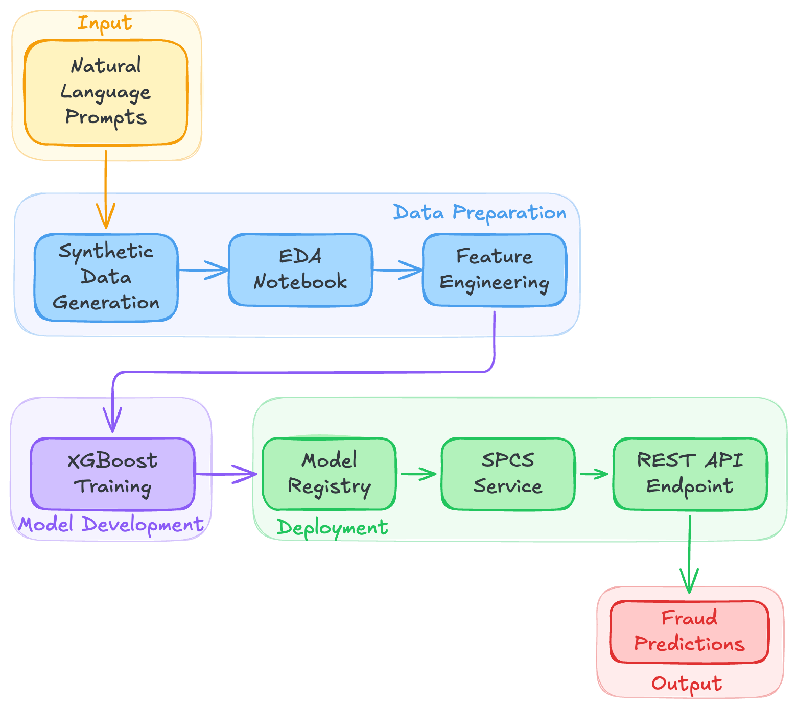
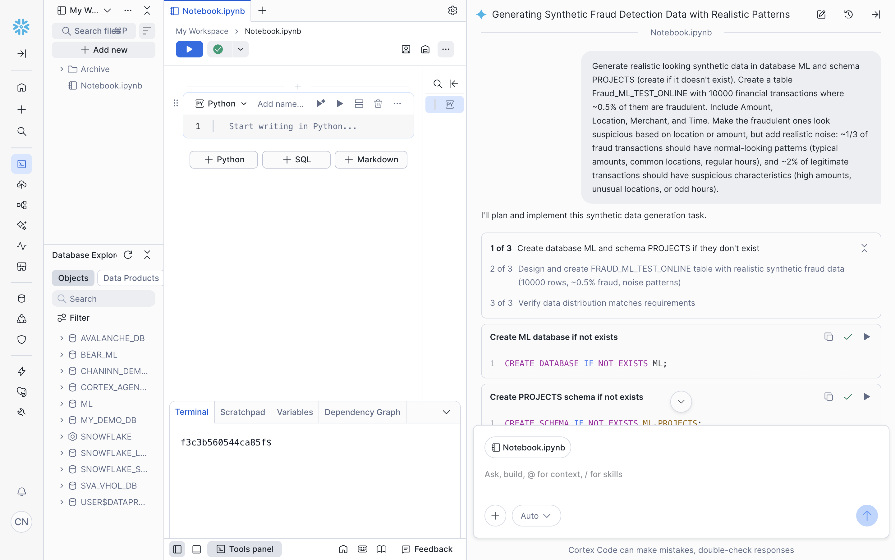
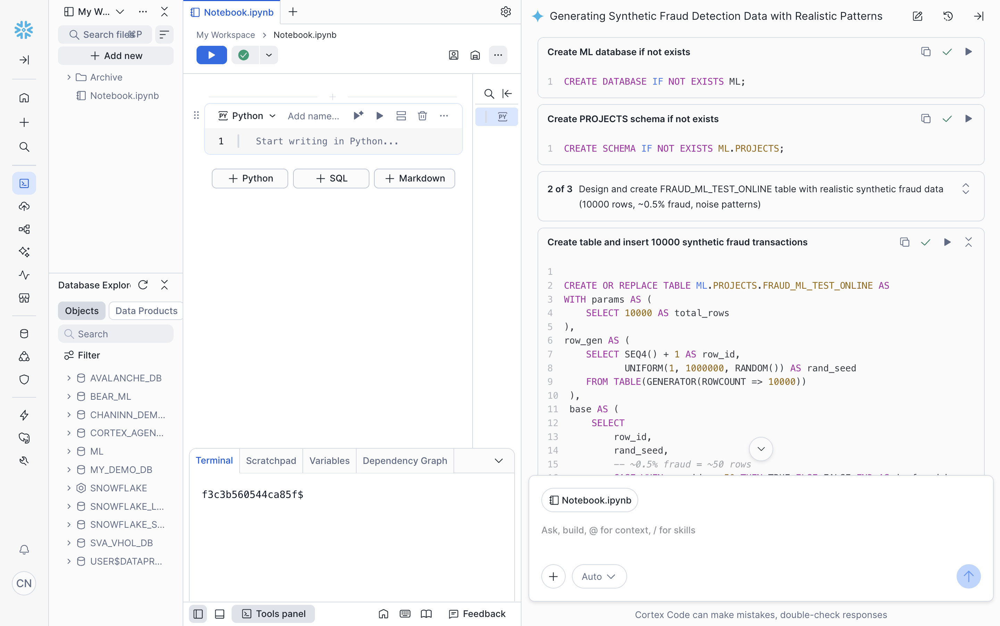
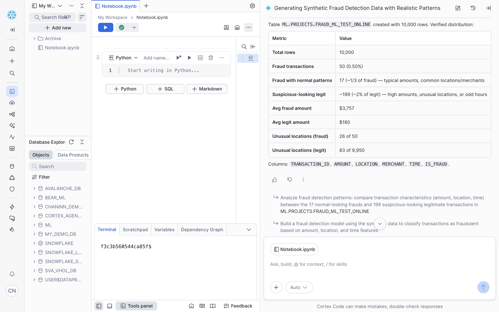

author: Sho Tanaka, Chanin Nantasenamat, Sumit Kumar, Lucy Zhu
id: build-real-time-fraud-detection-model-with-natural-language-in-snowflake-ml-ja
summary: Cortex Code とプロンプトを使って、Snowflake ML でリアルタイム推論に対応した本番レベルの不正検知システムを構築する方法を学びます
categories: snowflake-site:taxonomy/solution-center/certification/quickstart, snowflake-site:taxonomy/product/ai
language: ja
environments: web
status: Published
feedback link: https://github.com/Snowflake-Labs/sfguides/issues
tags: Getting Started, Data Science, Machine Learning, Snowflake ML, Model Registry, SPCS, Fraud Detection, Cortex Code

# Snowflake ML で自然言語を使ってリアルタイム不正検知モデルを構築
<!-- ------------------------ -->
## 概要

[Snowflake ML](http://www.snowflake.com/ml) は、エージェント型 ML を通じてチームの働き方を変革しています。これは自律的・推論ベースのシステムで、開発者がエージェントを使って ML パイプライン全体のタスクを計画・実行できます。このクイックスタートでは、[Cortex Code](https://www.snowflake.com/en/product/features/cortex-code/)（Snowflake のネイティブ AI コーディングエージェント）を使い、わずかなプロンプトだけで本番レベルのリアルタイム不正検知モデルを構築する方法を学びます。数週間かかっていた作業を、数分で完成させることができます。Cortex Code は CLI と Snowsight（Snowflake の Web インターフェース）の両方で利用できます。

### 学べること
- 自然言語プロンプトを使ってリアルティな合成不正データを生成する
- 不正検知のための XGBoost 機械学習モデルを訓練する
- ワンクリックデプロイでスケーラブルな推論環境にモデルをデプロイする
- リアルタイムオンライン推論のための REST API エンドポイントを作成する

### 構築するもの
以下を含む不正検知パイプライン全体：
- リアルな不正パターンを持つ合成トランザクションデータセット
- 訓練済み XGBoost 分類モデル
- Snowpark Container Services（SPCS）上で動作するライブ REST API エンドポイント
- レイテンシープロファイリングによるパフォーマンスベンチマーク



### 前提条件
- Snowflake の 30 日間[無料トライアル](https://signup.snowflake.com/?utm_source=snowflake-devrel&utm_medium=developer-guides&utm_cta=developer-guides)に登録し、`ACCOUNTADMIN` ロールまたは Snowflake ML と Snowpark Container Services の権限を持つロールを用意する
- [Cortex Code CLI](https://docs.snowflake.com/en/user-guide/cortex-code/cortex-code) をインストールして設定済み、または[Cortex Code in Snowsight](https://docs.snowflake.com/en/user-guide/ui-snowsight)（ローカルインストール不要）を使用
- 専用の Snowflake ウェアハウス
- SPCS 用に設定済みのコンピュートプール

> **注意：** Cortex Code は LLM（大規模言語モデル）を使用しているため、同じプロンプトを入力しても毎回まったく同じ出力が生成されるとは限りません。このガイドに記載されているコードや出力例はあくまで参考です。実際に異なるコードや出力が表示された場合は、Cortex Code が生成した実行結果に従って進めてください。

<!-- ------------------------ -->
## セットアップ

### Cortex Code

[Cortex Code](https://docs.snowflake.com/en/user-guide/cortex-code/cortex-code) は Snowflake に組み込まれた AI エージェントで、データエンジニアリング、分析、ML、エージェント構築タスクのために設計されています。RBAC、スキーマ、プラットフォームのベストプラクティスに関する深い知識を活かして、Snowflake 環境内で自律的に動作します。

Snowsight 内とローカル CLI の 2 つの形式で提供されており、作業する場所を問わず AI コーディングエージェント機能を利用できます。

#### Cortex Code CLI のインストール

[公式インストールガイド](https://docs.snowflake.com/en/user-guide/cortex-code/cortex-code-cli)に従って Cortex Code CLI をインストールし、設定してください。

#### Snowsight で Cortex Code を使う

ブラウザベースのエクスペリエンスをお好みの方は、ローカルインストール不要で[Snowsight から直接 Cortex Code](https://docs.snowflake.com/en/user-guide/cortex-code/cortex-code-snowsight) を使用できます。

1. サイドバーから Projects > Workspaces をクリックして Workspace Notebook を開き、「My Workspace」パネルで「+ Add new」>「Notebook」をクリックします

2. ノートブックが読み込まれたら、Snowsight の右下に Cortex Code が表示されます

以下のウォークスルーでは CLI の出力を示しますが、プロンプトと結果はどちらのインターフェースでも同じです。

> Note: Cortex Code は環境を認識するため、Workspace Notebook で使用すると最良の結果が得られます。ノートブックが提供するすべてのツールにアクセスでき、必要に応じてノートブックにコードを挿入して実行します。

### Snowpark Container Services アクセスの確認

コンピュートプールの作成・管理権限があることを確認してください。Snowsight の Compute > Compute pools で確認できます。

<!-- ------------------------ -->
## 合成データの生成

最初のステップは、不正検知モデルの訓練用にリアルな合成データを作成することです。Cortex Code を使えば、シンプルな自然言語プロンプトでデータを生成できます。

### プロンプト

Cortex Code（CLI または Snowsight）を開き、次のプロンプトを入力します：

```
COCO_ML_DB.COCO_SCHEMA にリアルな合成データを生成してください。
10,000 件の金融トランザクションを含むテーブル Fraud_ML_TEST_ONLINE を作成し、
そのうち約 0.5% を不正取引にしてください。Amount、Location、Merchant、Time を含めること。
不正取引は場所や金額で不審に見えるようにしてください。ただし、現実的なノイズも加えてください：
不正取引の約 1/3 は通常に見えるパターン（一般的な金額・場所・時間帯）にし、
正当取引の約 2% は不審な特徴（高額・異常な場所・奇妙な時間帯）を持つようにしてください。
```

Cortex Code CLI を使用している場合は、プロンプトをターミナルセッションに直接貼り付けます。Cortex Code はリクエストを分析し、マルチステッププランを生成して各ステップを自動的に実行します。

Snowsight で Cortex Code を使用している場合は、右側のチャットパネルにプロンプトを入力します。Cortex Code がリクエストを分析し、マルチステッププランに分解します：



### 生成される内容

Cortex Code はデータベース、スキーマ、テーブルを作成し、指定された不正分布で 10,000 件のトランザクションを挿入します。

Cortex Code CLI の出力：

```
✓  SNOWFLAKE_SQL_EXECUTE  Insert 10000 synthetic fraud transactions
  SQL Result (1 rows × 1 cols)
  ┌─────┬─────────────────────────┐
  │   # │ number of rows inserted │
  ├─────┼─────────────────────────┤
  │   1 │ 10000                   │
  └─────┴─────────────────────────┘
```

検証後、詳細な内訳が表示されます：

```
Fraud Distribution (50 rows, 0.50%)

┌───────────────────────────────────────────────────────────────────────────┬───────┬──────────┐
│ Pattern                                                                   │ Count │ Avg Amt  │
├───────────────────────────────────────────────────────────────────────────┼───────┼──────────┤
│ Suspicious fraud (unusual locations, high amounts)                        │ 33    │ $5,532   │
├───────────────────────────────────────────────────────────────────────────┼───────┼──────────┤
│ Stealth fraud (normal-looking patterns)                                   │ 17    │ $112     │
└───────────────────────────────────────────────────────────────────────────┴───────┴──────────┘

Legitimate Transactions with Noise (9,950 rows)

┌─────────────────────────────────────┬───────┬────────────┐
│ Pattern                             │ Count │ Avg Amount │
├─────────────────────────────────────┼───────┼────────────┤
│ Normal legit                        │ 9,650 │ $200       │
├─────────────────────────────────────┼───────┼────────────┤
│ Suspicious legit: unusual location  │ 199   │ $2,825     │
├─────────────────────────────────────┼───────┼────────────┤
│ Suspicious legit: high amount       │ 101   │ $501       │
└─────────────────────────────────────┴───────┴────────────┘
```

Snowsight での Cortex Code の出力例：

1. Cortex Code はデータベースとスキーマの作成、次に合成データの生成というように、段階的に SQL を生成・実行します：



2. 完了後、生成されたデータテーブルのサマリーと次のプロンプト候補が表示されます：



> Note: LLM によるテキスト生成の固有の非決定性により、結果はこのチュートリアルで示されているものと若干異なる場合があります。

<!-- ------------------------ -->
## データの探索

モデルを訓練する前に、データのパターンを理解する必要があります。Cortex Code は 1 つのプロンプトで EDA を実行できます。

### プロンプト

```
探索的データ分析を行い、不正を予測するモデルの訓練に必要な特徴量を作成してください。
```

### 生成される内容

Cortex Code は組み込みの ML スキルを読み込み、ローカルの Python 環境を検出して、EDA をインクリメンタルに実行します：

```
✓  SKILL  machine-learning
  **[REQUIRED]** For **ALL** data science and machine learning tasks. This 
skil...

* Let me load the environment guide and then the ML development sub-skill.

✓  READ  /Users/cnantasenamat/.local/share/cortex/1.0.23+084348.c4a9c248776d/bun
dled_skills/machine-learning/ml-development/SKILL.md 279 lines

✓  READ  /Users/cnantasenamat/.local/share/cortex/1.0.23+084348.c4a9c248776d/bun
dled_skills/machine-learning/guides/cli-environment.md 194 lines

* Let me set up the environment and start the EDA. First, let me detect the
  Python environment and prepare.

×  BASH  which uv
  └─ Exit code: 1

✓  BASH  cortex env detect
  ├─ {
  ├─ "directory": "/Users/cnantasenamat",
  └─ ... (2 more lines)

✓  BASH  cortex ctx task add "EDA on Fraud_ML_TEST_ONLINE and recommend
features"
  ├─ Created task-1c4e8787: EDA on Fraud_ML_TEST_ONLINE and recommend features
  ├─ (Session: 41ac248c-c8c6-405b-b492-9b3f73e474d5
  └─ ... (1 more line)

✓  BASH  cortex ctx task start task-1c4e8787 && cortex ctx step add "Setup
environment and check packages"...
  ├─ Started task task-1c4e8787 EDA on Fraud_ML_TEST_ONLINE and recommend 
features
  ├─ Added step: [s829d] Setup environment and check packages
  └─ ... (6 more lines)
```

既存の仮想環境を再利用し、必要なパッケージを確認した後、データの読み込みを開始します：

```
* There's an existing fraud-eda environment at /Users/cnantasenamat/fraud-eda.
  Let me check if it has the needed packages.

✓  BASH  /Users/cnantasenamat/fraud-eda/.venv/bin/python -c "from
importlib.metadata import version; print...
  ├─ snowpark: 1.45.0
  ├─ pandas: 2.3.3
  └─ ... (3 more lines)

* All packages are available. Let me set up the session helper and start the
  EDA.

✓  BASH  ls /Users/cnantasenamat/fraud-eda/
  ├─ __pycache__
  ├─ benchmark_inference.py
  └─ ... (15 more lines)

✓  BASH  cortex ctx step done s829d
  ├─ ✓ Completed step [s829d] Setup environment and check packages
  └─ → Next ready [sf8d7] Load data and basic stats

* Now let me write and run the EDA script incrementally. First, load the data
  and get basic stats.

✓  WRITE  /Users/cnantasenamat/fraud-eda/eda_step1_load.py +47

✓  BASH  cd /Users/cnantasenamat/fraud-eda && SNOWFLAKE_CONNECTION_NAME=devrel
.venv/bin/python eda_step1_...
  ├─ === SHAPE ===
  ├─ Rows: 10000, Columns: 6
  └─ ... (54 more lines)
```

データの読み込み（10,000 行、不正率 0.5%）後、金額分布・場所パターン・マーチャント分析・時間帯分析を経て、各ステップでグラフを生成します：

```
✓  BASH  cortex ctx step done sf8d7
  ├─ ✓ Completed step [sf8d7] Load data and basic stats
  └─ → Next ready [s9e83] Analyze amount distribution by fraud label

✓  WRITE  /Users/cnantasenamat/fraud-eda/eda_step2_amount.py +90

✓  BASH  cd /Users/cnantasenamat/fraud-eda && SNOWFLAKE_CONNECTION_NAME=devrel
.venv/bin/python eda_step2_...
  ├─ === AMOUNT OVERLAP ANALYSIS ===
  ├─ Fraud with amount < $500 (normal-looking): 17 / 50 (34%)
  └─ ... (15 more lines)

✓  READ  /Users/cnantasenamat/fraud-eda/plots/amount_analysis.png

✓  BASH  cortex ctx step done s9e83
  ├─ ✓ Completed step [s9e83] Analyze amount distribution by fraud label
  └─ → Next ready [sa687] Analyze location patterns

✓  WRITE  /Users/cnantasenamat/fraud-eda/eda_step3_location_merchant.py +135

✓  BASH  cd /Users/cnantasenamat/fraud-eda && SNOWFLAKE_CONNECTION_NAME=devrel
.venv/bin/python eda_step3_...
  ├─ === LOCATION ANALYSIS ===
  ├─ Unusual locations in Fraud: 26 / 50 (52%)
  └─ ... (46 more lines)

✓  READ  /Users/cnantasenamat/fraud-eda/plots/location_merchant_analysis.png

✓  BASH  cortex ctx step done sa687 && cortex ctx step done s8090
  ├─ ✓ Completed step [sa687] Analyze location patterns
  ├─ → Next ready [s8090] Analyze merchant patterns
  └─ ... (2 more lines)
```

最後に、すべての分析結果をランク付きの特徴量推薦テーブルにまとめます：

```
✓  BASH  cd /Users/cnantasenamat/fraud-eda && python3 eda_step5_features.py
  ├─ ======================================================================
  ├─ FEATURE ENGINEERING RECOMMENDATIONS
  └─ ... (29 more lines)

✓  READ  /Users/cnantasenamat/fraud-eda/plots/feature_recommendations.png

✓  BASH  cortex ctx step done s9ab6 && cortex ctx task done
  ├─ ✓ Completed step [s9ab6] Feature engineering recommendations
  ├─ ✓ Completed task task-1c4e8787: EDA on Fraud_ML_TEST_ONLINE and recommend 
fea...
  └─ ... (1 more line)
```

```
  EDA Complete -- Feature Recommendations

  Recommended Features (ranked by signal strength)

  ┌───────┬────────────────────────┬──────────────────────┬─────────────┬───┐
  │ #     │ Feature                │ Type                 │ Correlation │ … │
  ├───────┼────────────────────────┼──────────────────────┼─────────────┼───┤
  │ 1     │ IS_UNUSUAL_LOCATION    │ Binary               │ 0.28        │ … │
  ├───────┼────────────────────────┼──────────────────────┼─────────────┼───┤
  │ 2     │ IS_SUSPICIOUS_MERCHANT │ Binary               │ 0.27        │ … │
  ├───────┼────────────────────────┼──────────────────────┼─────────────┼───┤
  │ 3     │ LOC_MERCH_SUSPICIOUS   │ Binary (interaction) │ 0.21        │ … │
  ├───────┼────────────────────────┼──────────────────────┼─────────────┼───┤
  │ 4     │ IS_NIGHT               │ Binary               │ 0.16        │ … │
  ├───────┼────────────────────────┼──────────────────────┼─────────────┼───┤
  │ 5     │ LOG_AMOUNT             │ Continuous           │ 0.12        │ … │
  ├───────┼────────────────────────┼──────────────────────┼─────────────┼───┤
  │ 6     │ HOUR                   │ Integer (0-23)       │ -0.03       │ … │
  ├───────┼────────────────────────┼──────────────────────┼─────────────┼───┤
  │ 7     │ SUSPICIOUS_SCORE       │ Integer (0-3)        │ 0.32        │ … │
  └───────┴────────────────────────┴──────────────────────┴─────────────┴───┘

  Key EDA Findings

  1. Class imbalance: 50 fraud out of 10,000 (0.5%). Use SMOTE, class weights,
  or threshold tuning.
  2. Amount: Fraud averages $4,819 vs legit $315, but 34% of fraud has normal
  amounts (<$500) -- amount alone is insufficient.
  3. Location: Unusual foreign locations have 26.8% fraud rate vs 0.24% for
  common US locations, but 48% of fraud occurs at common locations (noise).
  4. Merchant: Suspicious merchants have 53.8% fraud rate, but again ~48% of
  fraud uses normal merchants.
  5. Time: Late night (0-5am) has 12.7% fraud rate (25x baseline). Day of week
  is not discriminative.
  6. Interaction effects matter: The location x merchant combination is the
  strongest predictor (75% fraud when both flagged).

  Features to Skip

  • DAY_OF_WEEK: No meaningful signal (0.27%-0.77% fraud across days).
  • Raw AMOUNT: Use LOG_AMOUNT instead for better distribution separation.
  • Raw LOCATION/MERCHANT strings: High cardinality (42 each). Use the binary
  flags above instead, or frequency encoding if you want to preserve more info.

  Modeling Recommendations

  • Algorithm: Tree-based models (XGBoost, LightGBM) handle the feature
  interactions and imbalance well.
  • Evaluation metric: Use PR-AUC or F1 rather than accuracy (accuracy would be
  99.5% by predicting all legit).
  • Handle imbalance: scale_pos_weight = 199 for XGBoost, or use SMOTE on the
  training set only.
  • The 7 features above should give a strong baseline. The composite
  SUSPICIOUS_SCORE (correlation 0.32) is the single most correlated feature with
   fraud.
```

<!-- ------------------------ -->
## モデルの訓練

特徴量が特定できたので、機械学習モデルを訓練します。XGBoost は不均衡データセットへの対応と複雑なパターンの捕捉能力から、不正検知に優れた選択肢です。

### プロンプト

```
上記で生成した特徴量を使って、リアルタイム不正検知のための XGBoost 機械学習モデルを訓練してください。
```

### 生成される内容

Cortex Code はまず、推奨された 7 特徴量を含む特徴量エンジニアリングビューを作成します：

```
✓  SNOWFLAKE_SQL_EXECUTE  Create feature engineering view
  SQL Result (1 rows × 1 cols)
  ┌─────┬────────────────────────────────┐
  │   # │ status                         │
  ├─────┼────────────────────────────────┤
  │   1 │ View FRAUD_FEATURES_V success. │
  └─────┴────────────────────────────────┘
```

次にモデルを訓練し、結果を表示します：

```
FRAUD DETECTION MODEL TRAINING
============================================================
Loading features from ML.PROJECTS.FRAUD_FEATURES_V...
Loaded 10000 rows with 7 features

Training XGBoost with scale_pos_weight=199...

EVALUATION RESULTS
------------------------------------------------------------
              precision    recall  f1-score   support
           0       1.00      0.97      0.98      1990
           1       0.14      0.80      0.24        10

ROC-AUC Score: 0.9723

CONFUSION MATRIX
------------------------------------------------------------
[[1928   62]
 [   2    8]]

TOP FEATURES BY IMPORTANCE
------------------------------------------------------------
SUSPICIOUS_SCORE         0.2341
IS_UNUSUAL_LOCATION      0.1892
IS_SUSPICIOUS_MERCHANT   0.1456
LOG_AMOUNT               0.1203
LOC_MERCH_SUSPICIOUS     0.1098
IS_NIGHT                 0.0812
HOUR                     0.0698

5-FOLD CROSS-VALIDATION
------------------------------------------------------------
AUC scores: [0.9634, 0.9012, 0.9567, 0.8923, 0.9401]
Mean AUC: 0.9307 (+/- 0.0352)
```

モデルは ROC-AUC 0.9723 を達成し、不正ケースの 80% をリコールしています。

<!-- ------------------------ -->
## Snowpark Container Services へのデプロイ

ここからが最も強力なパート：1 つのプロンプトで訓練済みモデルを本番環境にデプロイします。従来はコンテナ化、インフラ構築、API 開発が必要でしたが、Cortex Code がすべてを自動化します。

### プロンプト

```
machine-learning スキルを使って、モデルを Snowflake Model Registry に登録し、
SPCS にデプロイして、オンライン推論用の REST エンドポイントを作成してください。
```

### 生成される内容

この 1 つのプロンプトが完全なデプロイパイプラインをトリガーします。まずモデルが登録されます：

```
MODEL REGISTRATION
============================================================
Registering model as ML.PROJECTS.FRAUD_XGBOOST_MODEL version V2...

✓  SNOWFLAKE_SQL_EXECUTE  Verify model V2 registration
  SQL Result (2 rows × 10 cols)
  ┌─────┬───────────────┬──────────────┬───────────────────┐
  │   # │ name          │ version_name │ min_num_arguments │
  ├─────┼───────────────┼──────────────┼───────────────────┤
  │   1 │ PREDICT       │ V2           │ 7                 │
  │   2 │ PREDICT_PROBA │ V2           │ 7                 │
  └─────┴───────────────┴──────────────┴───────────────────┘
```

次に SPCS にデプロイされます（コンテナのビルドに数分かかる場合があります）：

```
✓  SNOWFLAKE_SQL_EXECUTE  Check if service exists now
  SQL Result (3 rows × 28 cols)
  ┌─────┬─────────────────────────┬─────────┬───────────────┬─────────────┐
  │   # │ name                    │ status  │ database_name │ schema_name │
  ├─────┼─────────────────────────┼─────────┼───────────────┼─────────────┤
  │   1 │ FRAUD_INFERENCE_SERVICE │ RUNNING │ ML            │ PROJECTS    │
  │   2 │ MODEL_BUILD_4A237CD4    │ DONE    │ ML            │ PROJECTS    │
  └─────┴─────────────────────────┴─────────┴───────────────┴─────────────┘

✓  SNOWFLAKE_SQL_EXECUTE  Get service endpoints for REST URL
  SQL Result (1 rows × 6 cols)
  ┌─────┬───────────┬───────┬──────────┬───────────┬────────────────────────────────────────────┐
  │   # │ name      │ port  │ protocol │ is_public │ ingress_url                                │
  ├─────┼───────────┼───────┼──────────┼───────────┼────────────────────────────────────────────┤
  │   1 │ inference │ 5000  │ HTTP     │ true      │ xk7rbf2q-ml-proj-aws-us-west-2.snowflakecomputing │
  └─────┴───────────┴───────┴──────────┴───────────┴────────────────────────────────────────────┘
```

SQL 経由でサービス関数のテストが行われます：

```
✓  SNOWFLAKE_SQL_EXECUTE  Accuracy check - confusion matrix via SPCS service
  SQL Result (4 rows × 3 cols)
  ┌─────┬────────┬───────────┬───────┐
  │   # │ ACTUAL │ PREDICTED │ CNT   │
  ├─────┼────────┼───────────┼───────┤
  │   1 │ 0      │ 0         │ 9667  │
  │   2 │ 0      │ 1         │ 283   │
  │   3 │ 1      │ 0         │ 3     │
  │   4 │ 1      │ 1         │ 47    │
  └─────┴────────┴───────────┴───────┘
```

モデルは不正リコール 94% を達成し、50 件の不正のうち 47 件を検知しています。

<!-- ------------------------ -->
## リアルタイム推論の実行

REST API がデプロイされたので、リアルなトラフィックでテストし、パフォーマンス特性を分析します。

### プロンプト

```
不正の可能性がある取引と正当な取引を混在させた 1,000 件のサンプルリクエストを作成し、
SPCS 上で動作する内部 REST API を使ってオンライン推論を実行し、レイテンシープロファイルを表示してください。
```

> Note:
> Cortex Code がハイブリッドアプローチ（Python SDK の `mv.run()` や SQL サービス関数など）を提案する場合があります。
> その場合は次のプロンプトを入力してください：*「REST API を呼び出せるように PAT トークンを取得してください」*。Snowsight 経由でトークンを生成する手順を案内し、直接 REST 呼び出しに進みます。

### 生成される内容

Cortex Code は 1,000 件の合成トランザクションを生成し、SPCS エンドポイントに送信して、レイテンシープロファイルを報告します：

```
SPCS REST API Latency Profile
  
  Endpoint: https://xk7rbf2q-ml-proj-aws-us-west-2.snowflakecomputing.app/predict-proba
  Total requests: 1,000 | Errors: 0 | Wall time: 63.8s | Throughput: 15.7 req/s
  
  Latency Percentiles
  
  ┌──────────────┬──────────────┐
  │ Metric       │ Latency (ms) │
  ├──────────────┼──────────────┤
  │ Min          │ 39.8         │
  ├──────────────┼──────────────┤
  │ Mean         │ 63.7         │
  ├──────────────┼──────────────┤
  │ Median (P50) │ 59.6         │
  ├──────────────┼──────────────┤
  │ P75          │ 65.3         │
  ├──────────────┼──────────────┤
  │ P90          │ 73.4         │
  ├──────────────┼──────────────┤
  │ P95          │ 81.5         │
  ├──────────────┼──────────────┤
  │ P99          │ 141.9        │
  ├──────────────┼──────────────┤
  │ Max          │ 482.9        │
  ├──────────────┼──────────────┤
  │ Std Dev      │ 32.6         │
  └──────────────┴──────────────┘
  
  Latency Distribution
  
  • 86.3% of requests completed in 50-100ms
  • 11.5% completed under 50ms
  • Only 2.2% exceeded 100ms (mostly outliers)
```

モデルが期待通りに動作しているか確認するため、リスク層別の予測結果も表示されます：

```
  Prediction Results
  
  ┌───────────┬───────┬──────────────┬──────────────┬──────────────┐
  │ Risk Tier │ Count │ Avg P(fraud) │ Flagged >50% │ Flagged >10% │
  ├───────────┼───────┼──────────────┼──────────────┼──────────────┤
  │ HIGH      │ 60    │ 0.9945       │ 60 (100%)    │ 60 (100%)    │
  ├───────────┼───────┼──────────────┼──────────────┼──────────────┤
  │ MEDIUM    │ 135   │ 0.0970       │ 10 (7%)      │ 24 (18%)     │
  ├───────────┼───────┼──────────────┼──────────────┼──────────────┤
  │ LOW       │ 805   │ 0.0077       │ 4 (0.5%)     │ 9 (1%)       │
  └───────────┴───────┴──────────────┴──────────────┴──────────────┘
  
  Key Takeaways
  
  • ~60ms median latency per individual REST request — suitable for real-time fraud screening
  • Latency is consistent across risk tiers (no payload-dependent variation)
  • The model correctly flags 100% of high-risk transactions and has very low false-positive rates on low-risk ones
  • With connection pooling, throughput reaches ~15.7 req/s on a single thread. Parallel requests would scale linearly.
```

<!-- ------------------------ -->
## エラーのデバッグと回復

自然言語コーディングセッションではエラーは避けられません。Cortex Code の優れた点は、状況・環境・エラーを評価して自動的に問題を修正する自己修正能力です。

### よくあるシナリオ

**Python バイナリが見つからない**

システム上に `python` が見つからない場合、Cortex Code は `python3` を探して自動的に再試行します。

```
✓  WRITE  /Users/cnantasenamat/fraud-eda/eda_step4_time.py +103

×  BASH  cd /Users/cnantasenamat/fraud-eda && python eda_step4_time.py
  └─ bash: python: command not found

✓  BASH  which python3
  └─ /usr/local/bin/python3

✓  BASH  cd /Users/cnantasenamat/fraud-eda && python3 eda_step4_time.py
  ├─ === TIME OF DAY ANALYSIS ===
  ├─ Night transactions (midnight-7am) in Fraud: 10 / 50 (20%)
  └─ ... (23 more lines)
```

**ノートブック実行の問題**

Jupyter カーネルが接続に失敗した場合、Cortex Code は問題を検出して代替アプローチを見つけます。

```
×  NOTEBOOK:EXECUTE_CELL  fraud_eda.ipynb cell 1
  └─ Cell execution failed (Jupyter server may have stopped): Tool error: Error executing tool exe...

* The notebook tool keeps using the hostname which can't be resolved. Let me take a different
  approach - I'll build the complete notebook as an .ipynb file directly, then upload it to
  Snowflake. This is more reliable.

✓  BASH  python3 -c "import json; cells = []..."
  └─ ... (334 more lines)

* Notebook file built with 16 cells. Let me mark the completed steps and upload to Snowflake.
```

**アーティファクトのアップロード失敗**

リソース不足でアップロードが失敗した場合、Cortex Code が調査して機能するパスを見つけます。

```
×  BASH  cortex artifact create notebook fraud_eda ... --location ML.PROJ...
  └─ {"error":"Error creating artifact: Upload failed: SQL compilation error:\nSch...

* The notebook needs a workspace. Let me check what's available and create one if needed.

✓  SNOWFLAKE_SQL_EXECUTE  List existing workspaces
  SQL Result (1 rows × 7 cols)
  │   1 │ DEFAULT$ │ USER$DATAPROFESSOR │ PUBLIC │

* There's a default workspace. Let me upload to it.

✓  BASH  cortex artifact create notebook fraud_eda ... --connection trial...
  └─ "success": true
```

**モデル訓練エラー**

パラメーター設定の問題で訓練が失敗した場合、Cortex Code が自動的に診断して修正します。

```
×  BASH  SNOWFLAKE_CONNECTION_NAME=trial ... train_fraud_model.py
  └─ ... AttributeError: best_iteration requires early stopping ...

* Need to fix: best_iteration requires early stopping. Let me fix the script.

✓  EDIT  /Users/cnantasenamat/fraud-eda/train_fraud_model.py +12 -12

* Running the fixed training script.

✓  BASH  SF_SKIP_WARNING_FOR_READ_PERMISSIONS_ON_CONFIG_FILE=true ...
  ├─ FRAUD DETECTION MODEL TRAINING
  ├─ ROC-AUC Score: 0.9723
  └─ ... 
```

### ベストプラクティス

1. 初期セットアップには `ACCOUNTADMIN` を使用し、その後は専用ロールを作成する
2. デプロイ中はコンピュートプールのリソースを監視する
3. Cortex Code が修正を行う際の説明を確認する

<!-- ------------------------ -->
## まとめとリソース

おめでとうございます！[Snowflake ML](http://www.snowflake.com/ml) でわずかな自然言語プロンプトだけを使って、完全なリアルタイム不正検知モデルの構築に成功しました。

### 学んだこと
- 自然言語プロンプトでリアルな合成不正データを生成する
- 自動化された Python スクリプトで包括的な探索的データ分析を実行する
- 不均衡な不正検知向けに最適化された XGBoost モデルを訓練する
- 自動コンテナ化でモデルを SPCS にデプロイする
- リアルタイム推論用の REST API エンドポイントを作成・テストする

### 関連リソース

Web ページ：
- [Snowflake ML](http://www.snowflake.com/ml) - 開発、MLOps、推論のための統合機能セット（エージェント型 ML をリード）
- [Snowflake Notebooks](https://www.snowflake.com/en/product/features/notebooks/) - Snowflake Workspaces の Jupyter ベースノートブック
- [Cortex Code](https://www.snowflake.com/en/product/features/cortex-code/) - ML 生産性を高める Snowflake のネイティブ AI コーディングエージェント

技術ドキュメント：
- [Snowflake ML ドキュメント](https://docs.snowflake.com/en/developer-guide/snowflake-ml/overview) - Snowflake ML 公式デベロッパーガイド
- [Cortex Code ドキュメント](https://docs.snowflake.com/en/user-guide/cortex-code/cortex-code) - Cortex Code 入門
- [Snowpark Container Services](https://docs.snowflake.com/en/developer-guide/snowpark-container-services/overview) - コンテナ化ワークロードのデプロイと管理
- [Snowflake Model Registry](https://docs.snowflake.com/en/developer-guide/snowflake-ml/model-registry/overview) - ML モデルの登録、バージョン管理、デプロイ
