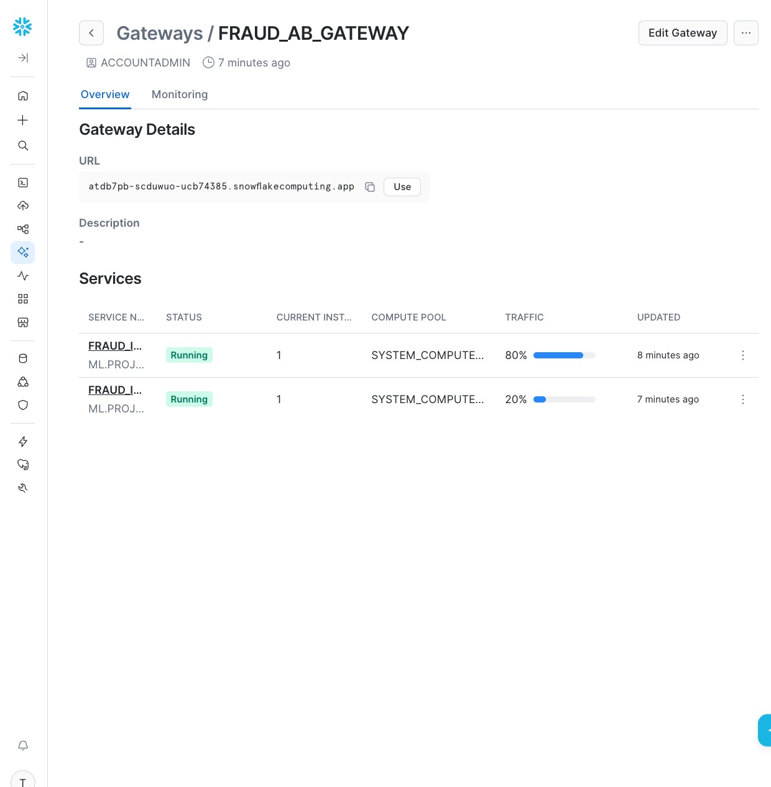

author: Chanin Nantasenamat, Sho Tanaka, Sumit Kumar, Lucy Zhu
id: build-real-time-fraud-detection-model-with-natural-language-in-snowflake-ml
summary: Learn how to build a production-ready fraud detection system with real-time inference using CoCo and natural language prompts in Snowflake ML
categories: snowflake-site:taxonomy/solution-center/certification/quickstart, snowflake-site:taxonomy/product/ai, snowflake-site:taxonomy/industry/public-sector
language: en
environments: web
status: Published
feedback link: https://github.com/Snowflake-Labs/sfguides/issues
tags: Getting Started, Data Science, Machine Learning, Snowflake ML, Model Registry, SPCS, Fraud Detection, CoCo, Gateway

# Build a Real-Time Fraud Detection Model with Natural Language in Snowflake ML
<!-- ------------------------ -->
## Overview

[Snowflake ML](http://www.snowflake.com/ml) is changing how teams work with agentic ML, an autonomous, reasoning-based system that enables developers to use agents to plan and execute tasks across the entire ML pipeline. In this quickstart, learn how to build and run a real-time fraud detection model with only a handful of prompts so that you can go from raw idea to production-grade REST API in minutes, not weeks, with [CoCo](https://www.snowflake.com/en/product/features/cortex-code/), Snowflake’s AI native coding agent. CoCo is available both as a CLI and directly in Snowsight, Snowflake's web interface.

### What You'll Learn
- Generate realistic synthetic fraud data with natural language prompts
- Train an XGBoost machine learning model for fraud detection
- Deploy models for scalable inference with one-click deployment
- Create REST API endpoints for real-time online inference
- Set up A/B testing between model versions using Gateways for traffic splitting

### What You'll Build
A complete fraud detection pipeline featuring:
- Synthetic transaction dataset with realistic fraud patterns
- Trained XGBoost classification model
- Live REST API endpoint running on Snowpark Container Services (SPCS)
- Performance benchmarking with latency profiling
- Gateway for A/B testing across model versions with traffic splitting


### Prerequisites
- Sign up for the 30-day [free trial](https://signup.snowflake.com/?utm_source=snowflake-devrel&utm_medium=developer-guides&utm_cta=developer-guides) of Snowflake. Have `ACCOUNTADMIN` role or a role with permissions for Snowflake ML and Snowpark Container Services
- [CoCo CLI](https://docs.snowflake.com/en/user-guide/cortex-code/cortex-code) installed and configured OR [CoCo in Snowsight](https://docs.snowflake.com/en/user-guide/ui-snowsight) (no local installation required)
- A dedicated Snowflake warehouse
- A compute pool configured for SPCS

<!-- ------------------------ -->
## Setup

### CoCo

[CoCo](https://docs.snowflake.com/en/user-guide/cortex-code/cortex-code) is an AI agent built into Snowflake, designed for data engineering, analytics, ML, and agent-building tasks. It operates autonomously within your Snowflake environment, leveraging deep knowledge of RBAC, schemas, and platform best practices.

It is available in two forms: within Snowsight and as a local CLI, bringing AI-assisted capabilities to wherever you work.

#### Install CoCo CLI

Follow the [official installation guide](https://docs.snowflake.com/en/user-guide/cortex-code/cortex-code-cli) to install and configure CoCo CLI.

#### Use CoCo in Snowsight

Prefer a browser-based experience? You can also use [CoCo directly in Snowsight](https://docs.snowflake.com/en/user-guide/cortex-code/cortex-code-snowsight) with no local installation. 

1. Open Workspace Notebook by going to the sidebar and click on Projects > Workspaces; then in the "My Workspace" panel, click on "+ Add new" > Notebook

2. Once the notebook loads, look for CoCo in the lower-right corner of Snowsight.

The walkthrough below shows CLI output, but the prompts and results are the same in both interfaces. 

> Note: CoCo is environment aware so using it in a Workspace Notebook will give the best results as it will have access to all the tools provided by the notebook. When relevant, generated code will be inserted into the notebook and run on your behalf.

### Verify Snowpark Container Services Access

Ensure you have access to create and manage compute pools. You can verify this in Snowsight under Compute > Compute pools.

<!-- ------------------------ -->
## Generate Synthetic Data

The first step is creating realistic synthetic data for training our fraud detection model. Using CoCo, we can generate this data with a simple natural language prompt.

### Prompt

Open CoCo (CLI or Snowsight) and enter the following prompt:

```
Generate realistic looking synthetic data in database ML and schema PROJECTS 
(create if it doesn't exist). Create a table Fraud_ML_TEST_ONLINE with 10000 
financial transactions where ~0.5% of them are fraudulent. Include Amount, 
Location, Merchant, and Time. Make the fraudulent ones look suspicious based 
on location or amount, but add realistic noise: ~1/3 of fraud transactions 
should have normal-looking patterns (typical amounts, common locations, 
regular hours), and ~2% of legitimate transactions should have suspicious 
characteristics (high amounts, unusual locations, or odd hours).
```

If running CoCo CLI, paste the prompt directly into the terminal session. CoCo will analyze the request, generate a multi-step plan, and execute each step automatically.

If running CoCo on Snowsight, go ahead and enter the prompt in the chat panel on the right. CoCo analyzes the request and breaks it into a multi-step plan:


### What Gets Generated

CoCo will create the database, schema, and table, then insert 10,000 transactions with the specified fraud distribution. 

The CoCo CLI output shows:

```
✓  SNOWFLAKE_SQL_EXECUTE  Insert 10000 synthetic fraud transactions
  SQL Result (1 rows × 1 cols)
  ┌─────┬─────────────────────────┐
  │   # │ number of rows inserted │
  ├─────┼─────────────────────────┤
  │   1 │ 10000                   │
  └─────┴─────────────────────────┘
```

After verification, you will see a detailed breakdown:

```
Fraud Distribution (50 rows, 0.50%)

┌───────────────────────────────────────────────────────────────────────────┬───────┬──────────┐
│ Pattern                                                                   │ Count │ Avg Amt  │
├───────────────────────────────────────────────────────────────────────────┼───────┼──────────┤
│ Suspicious fraud (unusual locations, high amounts)                        │ 33    │ $5,532   │
├───────────────────────────────────────────────────────────────────────────┼───────┼──────────┤
│ Stealth fraud (normal-looking patterns)                                   │ 17    │ $112     │
└───────────────────────────────────────────────────────────────────────────┴───────┴──────────┘

Legitimate Transactions with Noise (9,950 rows)

┌─────────────────────────────────────┬───────┬────────────┐
│ Pattern                             │ Count │ Avg Amount │
├─────────────────────────────────────┼───────┼────────────┤
│ Normal legit                        │ 9,650 │ $200       │
├─────────────────────────────────────┼───────┼────────────┤
│ Suspicious legit: unusual location  │ 199   │ $2,825     │
├─────────────────────────────────────┼───────┼────────────┤
│ Suspicious legit: high amount       │ 101   │ $501       │
└─────────────────────────────────────┴───────┴────────────┘
```

Here's the generated output from CoCo on Snowsight:

1. CoCo generates and executes SQL in a stepwise manner; first creating the database and schema, then building the synthetic data:


2. Once complete, CoCo displays a summary of the generated data table along with suggested next prompts:


> Note: Due to the inherent randomness in how LLMs generate text, your results may vary slightly from what is shown in this tutorial.

<!-- ------------------------ -->
## Explore the Data

Before training a model, we need to understand our data patterns. CoCo can run a complete EDA with a single prompt.

### Prompt

```
Do exploratory data analysis and recommend the features needed to train a model that can predict fraud.
```

### What Gets Generated

CoCo reads its built-in ML skill, detects the local Python environment, and runs the EDA in incremental steps:

```
✓  SKILL  machine-learning
  **[REQUIRED]** For **ALL** data science and machine learning tasks. This 
skil...

* Let me load the environment guide and then the ML development sub-skill.

✓  READ  /Users/cnantasenamat/.local/share/cortex/1.0.23+084348.c4a9c248776d/bun
dled_skills/machine-learning/ml-development/SKILL.md 279 lines

✓  READ  /Users/cnantasenamat/.local/share/cortex/1.0.23+084348.c4a9c248776d/bun
dled_skills/machine-learning/guides/cli-environment.md 194 lines

* Let me set up the environment and start the EDA. First, let me detect the
  Python environment and prepare.

×  BASH  which uv
  └─ Exit code: 1

✓  BASH  cortex env detect
  ├─ {
  ├─ "directory": "/Users/cnantasenamat",
  └─ ... (2 more lines)

✓  BASH  cortex ctx task add "EDA on Fraud_ML_TEST_ONLINE and recommend
features"
  ├─ Created task-1c4e8787: EDA on Fraud_ML_TEST_ONLINE and recommend features
  ├─ (Session: 41ac248c-c8c6-405b-b492-9b3f73e474d5
  └─ ... (1 more line)

✓  BASH  cortex ctx task start task-1c4e8787 && cortex ctx step add "Setup
environment and check packages"...
  ├─ Started task task-1c4e8787 EDA on Fraud_ML_TEST_ONLINE and recommend 
features
  ├─ Added step: [s829d] Setup environment and check packages
  └─ ... (6 more lines)
```

It then reuses an existing virtual environment, verifies the required packages, and begins loading data:

```
* There's an existing fraud-eda environment at /Users/cnantasenamat/fraud-eda.
  Let me check if it has the needed packages.

✓  BASH  /Users/cnantasenamat/fraud-eda/.venv/bin/python -c "from
importlib.metadata import version; print...
  ├─ snowpark: 1.45.0
  ├─ pandas: 2.3.3
  └─ ... (3 more lines)

* All packages are available. Let me set up the session helper and start the
  EDA.

✓  BASH  ls /Users/cnantasenamat/fraud-eda/
  ├─ __pycache__
  ├─ benchmark_inference.py
  └─ ... (15 more lines)

✓  BASH  cortex ctx step done s829d
  ├─ ✓ Completed step [s829d] Setup environment and check packages
  └─ → Next ready [sf8d7] Load data and basic stats

* Now let me write and run the EDA script incrementally. First, load the data
  and get basic stats.

✓  WRITE  /Users/cnantasenamat/fraud-eda/eda_step1_load.py +47

✓  BASH  cd /Users/cnantasenamat/fraud-eda && SNOWFLAKE_CONNECTION_NAME=devrel
.venv/bin/python eda_step1_...
  ├─ === SHAPE ===
  ├─ Rows: 10000, Columns: 6
  └─ ... (54 more lines)
```

With the data loaded (10K rows, 0.5% fraud rate), it proceeds through amount distribution, location patterns, merchant analysis, and time-of-day analysis — generating plots at each step:

```
✓  BASH  cortex ctx step done sf8d7
  ├─ ✓ Completed step [sf8d7] Load data and basic stats
  └─ → Next ready [s9e83] Analyze amount distribution by fraud label

✓  WRITE  /Users/cnantasenamat/fraud-eda/eda_step2_amount.py +90

✓  BASH  cd /Users/cnantasenamat/fraud-eda && SNOWFLAKE_CONNECTION_NAME=devrel
.venv/bin/python eda_step2_...
  ├─ === AMOUNT OVERLAP ANALYSIS ===
  ├─ Fraud with amount < $500 (normal-looking): 17 / 50 (34%)
  └─ ... (15 more lines)

✓  READ  /Users/cnantasenamat/fraud-eda/plots/amount_analysis.png

✓  BASH  cortex ctx step done s9e83
  ├─ ✓ Completed step [s9e83] Analyze amount distribution by fraud label
  └─ → Next ready [sa687] Analyze location patterns

✓  WRITE  /Users/cnantasenamat/fraud-eda/eda_step3_location_merchant.py +135

✓  BASH  cd /Users/cnantasenamat/fraud-eda && SNOWFLAKE_CONNECTION_NAME=devrel
.venv/bin/python eda_step3_...
  ├─ === LOCATION ANALYSIS ===
  ├─ Unusual locations in Fraud: 26 / 50 (52%)
  └─ ... (46 more lines)

✓  READ  /Users/cnantasenamat/fraud-eda/plots/location_merchant_analysis.png

✓  BASH  cortex ctx step done sa687 && cortex ctx step done s8090
  ├─ ✓ Completed step [sa687] Analyze location patterns
  ├─ → Next ready [s8090] Analyze merchant patterns
  └─ ... (2 more lines)
```

Finally, it compiles all findings into a ranked feature recommendation table:

```
✓  BASH  cd /Users/cnantasenamat/fraud-eda && python3 eda_step5_features.py
  ├─ ======================================================================
  ├─ FEATURE ENGINEERING RECOMMENDATIONS
  └─ ... (29 more lines)

✓  READ  /Users/cnantasenamat/fraud-eda/plots/feature_recommendations.png

✓  BASH  cortex ctx step done s9ab6 && cortex ctx task done
  ├─ ✓ Completed step [s9ab6] Feature engineering recommendations
  ├─ ✓ Completed task task-1c4e8787: EDA on Fraud_ML_TEST_ONLINE and recommend 
fea...
  └─ ... (1 more line)
```

```
  EDA Complete -- Feature Recommendations

  Recommended Features (ranked by signal strength)

  ┌───────┬────────────────────────┬──────────────────────┬─────────────┬───┐
  │ #     │ Feature                │ Type                 │ Correlation │ … │
  ├───────┼────────────────────────┼──────────────────────┼─────────────┼───┤
  │ 1     │ IS_UNUSUAL_LOCATION    │ Binary               │ 0.28        │ … │
  ├───────┼────────────────────────┼──────────────────────┼─────────────┼───┤
  │ 2     │ IS_SUSPICIOUS_MERCHANT │ Binary               │ 0.27        │ … │
  ├───────┼────────────────────────┼──────────────────────┼─────────────┼───┤
  │ 3     │ LOC_MERCH_SUSPICIOUS   │ Binary (interaction) │ 0.21        │ … │
  ├───────┼────────────────────────┼──────────────────────┼─────────────┼───┤
  │ 4     │ IS_NIGHT               │ Binary               │ 0.16        │ … │
  ├───────┼────────────────────────┼──────────────────────┼─────────────┼───┤
  │ 5     │ LOG_AMOUNT             │ Continuous           │ 0.12        │ … │
  ├───────┼────────────────────────┼──────────────────────┼─────────────┼───┤
  │ 6     │ HOUR                   │ Integer (0-23)       │ -0.03       │ … │
  ├───────┼────────────────────────┼──────────────────────┼─────────────┼───┤
  │ 7     │ SUSPICIOUS_SCORE       │ Integer (0-3)        │ 0.32        │ … │
  └───────┴────────────────────────┴──────────────────────┴─────────────┴───┘

  Key EDA Findings

  1. Class imbalance: 50 fraud out of 10,000 (0.5%). Use SMOTE, class weights,
  or threshold tuning.
  2. Amount: Fraud averages $4,819 vs legit $315, but 34% of fraud has normal
  amounts (<$500) -- amount alone is insufficient.
  3. Location: Unusual foreign locations have 26.8% fraud rate vs 0.24% for
  common US locations, but 48% of fraud occurs at common locations (noise).
  4. Merchant: Suspicious merchants have 53.8% fraud rate, but again ~48% of
  fraud uses normal merchants.
  5. Time: Late night (0-5am) has 12.7% fraud rate (25x baseline). Day of week
  is not discriminative.
  6. Interaction effects matter: The location x merchant combination is the
  strongest predictor (75% fraud when both flagged).

  Features to Skip

  • DAY_OF_WEEK: No meaningful signal (0.27%-0.77% fraud across days).
  • Raw AMOUNT: Use LOG_AMOUNT instead for better distribution separation.
  • Raw LOCATION/MERCHANT strings: High cardinality (42 each). Use the binary
  flags above instead, or frequency encoding if you want to preserve more info.

  Modeling Recommendations

  • Algorithm: Tree-based models (XGBoost, LightGBM) handle the feature
  interactions and imbalance well.
  • Evaluation metric: Use PR-AUC or F1 rather than accuracy (accuracy would be
  99.5% by predicting all legit).
  • Handle imbalance: scale_pos_weight = 199 for XGBoost, or use SMOTE on the
  training set only.
  • The 7 features above should give a strong baseline. The composite
  SUSPICIOUS_SCORE (correlation 0.32) is the single most correlated feature with
   fraud.
```

<!-- ------------------------ -->
## Train the Model

With our features identified, we can now train a machine learning model. XGBoost is an excellent choice for fraud detection due to its ability to handle imbalanced datasets and capture complex patterns.

### Prompt

```
Use features generated above to train a XGBoost machine learning model for 
real-time fraud detection.
```

### What Gets Generated

CoCo will first create a feature engineering view with the 7 recommended features:

```
✓  SNOWFLAKE_SQL_EXECUTE  Create feature engineering view
  SQL Result (1 rows × 1 cols)
  ┌─────┬────────────────────────────────┐
  │   # │ status                         │
  ├─────┼────────────────────────────────┤
  │   1 │ View FRAUD_FEATURES_V success. │
  └─────┴────────────────────────────────┘
```

Then train the model and display results:

```
FRAUD DETECTION MODEL TRAINING
============================================================
Loading features from ML.PROJECTS.FRAUD_FEATURES_V...
Loaded 10000 rows with 7 features

Training XGBoost with scale_pos_weight=199...

EVALUATION RESULTS
------------------------------------------------------------
              precision    recall  f1-score   support
           0       1.00      0.97      0.98      1990
           1       0.14      0.80      0.24        10

ROC-AUC Score: 0.9723

CONFUSION MATRIX
------------------------------------------------------------
[[1928   62]
 [   2    8]]

TOP FEATURES BY IMPORTANCE
------------------------------------------------------------
SUSPICIOUS_SCORE         0.2341
IS_UNUSUAL_LOCATION      0.1892
IS_SUSPICIOUS_MERCHANT   0.1456
LOG_AMOUNT               0.1203
LOC_MERCH_SUSPICIOUS     0.1098
IS_NIGHT                 0.0812
HOUR                     0.0698

5-FOLD CROSS-VALIDATION
------------------------------------------------------------
AUC scores: [0.9634, 0.9012, 0.9567, 0.8923, 0.9401]
Mean AUC: 0.9307 (+/- 0.0352)
```

The model achieves a ROC-AUC of 0.9723 with 80% recall on fraud cases.

<!-- ------------------------ -->
## Deploy to Snowpark Container Services

Now comes the powerful part: deploying our trained model to production with a single prompt. This would traditionally require containerization, infrastructure setup, and API development.

### Prompt

```
Use machine-learning skill to log the model into Snowflake Model Registry, 
deploy the model to SPCS and create a REST endpoint for online inference.
```

### What Gets Generated

This single prompt triggers a complete deployment pipeline. First, the model is registered:

```
MODEL REGISTRATION
============================================================
Registering model as ML.PROJECTS.FRAUD_XGBOOST_MODEL version V1...

✓  SNOWFLAKE_SQL_EXECUTE  Verify model V1 registration
  SQL Result (2 rows × 10 cols)
  ┌─────┬───────────────┬──────────────┬───────────────────┐
  │   # │ name          │ version_name │ min_num_arguments │
  ├─────┼───────────────┼──────────────┼───────────────────┤
  │   1 │ PREDICT       │ V1           │ 7                 │
  │   2 │ PREDICT_PROBA │ V1           │ 7                 │
  └─────┴───────────────┴──────────────┴───────────────────┘
```

Then deployed to SPCS (this can take a few minutes as it builds the container):

```
✓  SNOWFLAKE_SQL_EXECUTE  Check if service exists now
  SQL Result (3 rows × 28 cols)
  ┌─────┬─────────────────────────┬─────────┬───────────────┬─────────────┐
  │   # │ name                    │ status  │ database_name │ schema_name │
  ├─────┼─────────────────────────┼─────────┼───────────────┼─────────────┤
  │   1 │ FRAUD_INFERENCE_SERVICE_V1 │ RUNNING │ ML            │ PROJECTS    │
  │   2 │ MODEL_BUILD_4A237CD4    │ DONE    │ ML            │ PROJECTS    │
  └─────┴─────────────────────────┴─────────┴───────────────┴─────────────┘

✓  SNOWFLAKE_SQL_EXECUTE  Get service endpoints for REST URL
  SQL Result (1 rows × 6 cols)
  ┌─────┬───────────┬───────┬──────────┬───────────┬────────────────────────────────────────────┐
  │   # │ name      │ port  │ protocol │ is_public │ ingress_url                                │
  ├─────┼───────────┼───────┼──────────┼───────────┼────────────────────────────────────────────┤
  │   1 │ inference │ 5000  │ HTTP     │ true      │ xk7rbf2q-ml-proj-aws-us-west-2.snowflakecomputing │
  └─────┴───────────┴───────┴──────────┴───────────┴────────────────────────────────────────────┘
```

The service functions are tested via SQL:

```
✓  SNOWFLAKE_SQL_EXECUTE  Accuracy check - confusion matrix via SPCS service
  SQL Result (4 rows × 3 cols)
  ┌─────┬────────┬───────────┬───────┐
  │   # │ ACTUAL │ PREDICTED │ CNT   │
  ├─────┼────────┼───────────┼───────┤
  │   1 │ 0      │ 0         │ 9667  │
  │   2 │ 0      │ 1         │ 283   │
  │   3 │ 1      │ 0         │ 3     │
  │   4 │ 1      │ 1         │ 47    │
  └─────┴────────┴───────────┴───────┘
```

The model achieves 94% fraud recall, catching 47 out of 50 fraud cases.

<!-- ------------------------ -->
## Run Real-Time Inference

With our REST API deployed, let's test it with realistic traffic and analyze the performance characteristics.

### Prompt

```
Create 1000 sample requests with a mix of potential fraud and legit 
transactions and run the predictions using the internal REST API for online 
Inference running on SPCS and show the latency profile.
```

> Note: 
> CoCo may suggest a hybrid approach instead (e.g., using the Python SDK `mv.run()` or SQL service functions).
> If that happens, prompt it with: *"Ask for the PAT token so that you can call the REST API"*. It will then guide you through generating one via Snowsight and proceed with direct REST calls.

### What Gets Generated

CoCo will generate 1,000 synthetic transactions, send them to the SPCS endpoint, and report a latency profile:

```
SPCS REST API Latency Profile
  
  Endpoint: https://xk7rbf2q-ml-proj-aws-us-west-2.snowflakecomputing.app/predict-proba
  Total requests: 1,000 | Errors: 0 | Wall time: 63.8s | Throughput: 15.7 req/s
  
  Latency Percentiles
  
  ┌──────────────┬──────────────┐
  │ Metric       │ Latency (ms) │
  ├──────────────┼──────────────┤
  │ Min          │ 39.8         │
  ├──────────────┼──────────────┤
  │ Mean         │ 63.7         │
  ├──────────────┼──────────────┤
  │ Median (P50) │ 59.6         │
  ├──────────────┼──────────────┤
  │ P75          │ 65.3         │
  ├──────────────┼──────────────┤
  │ P90          │ 73.4         │
  ├──────────────┼──────────────┤
  │ P95          │ 81.5         │
  ├──────────────┼──────────────┤
  │ P99          │ 141.9        │
  ├──────────────┼──────────────┤
  │ Max          │ 482.9        │
  ├──────────────┼──────────────┤
  │ Std Dev      │ 32.6         │
  └──────────────┴──────────────┘
  
  Latency Distribution
  
  • 86.3% of requests completed in 50-100ms
  • 11.5% completed under 50ms
  • Only 2.2% exceeded 100ms (mostly outliers)
```

It also breaks down the predictions by risk tier so you can verify the model behaves as expected:

```
  Prediction Results
  
  ┌───────────┬───────┬──────────────┬──────────────┬──────────────┐
  │ Risk Tier │ Count │ Avg P(fraud) │ Flagged >50% │ Flagged >10% │
  ├───────────┼───────┼──────────────┼──────────────┼──────────────┤
  │ HIGH      │ 60    │ 0.9945       │ 60 (100%)    │ 60 (100%)    │
  ├───────────┼───────┼──────────────┼──────────────┼──────────────┤
  │ MEDIUM    │ 135   │ 0.0970       │ 10 (7%)      │ 24 (18%)     │
  ├───────────┼───────┼──────────────┼──────────────┼──────────────┤
  │ LOW       │ 805   │ 0.0077       │ 4 (0.5%)     │ 9 (1%)       │
  └───────────┴───────┴──────────────┴──────────────┴──────────────┘
  
  Key Takeaways
  
  • ~60ms median latency per individual REST request — suitable for real-time fraud screening
  • Latency is consistent across risk tiers (no payload-dependent variation)
  • The model correctly flags 100% of high-risk transactions and has very low false-positive rates on low-risk ones
  • With connection pooling, throughput reaches ~15.7 req/s on a single thread. Parallel requests would scale linearly.
```

<!-- ------------------------ -->
## A/B Test with Gateways

In production, you rarely swap a model overnight. Instead, you route a fraction of live traffic to the new version and compare results before committing. [SPCS Gateways](https://docs.snowflake.com/en/developer-guide/snowpark-container-services/gateway) make this simple: a single stable hostname splits ingress requests across multiple service endpoints by percentage, so you can A/B test model versions without changing any client URLs.

In this step we will deploy an improved V2 model as a second SPCS service, create a gateway that sends 80% of traffic to the proven V1 service and 20% to V2, then verify the split. Once the new version proves itself, we shift the gateway to 100% V2 with a single `ALTER GATEWAY` statement.

### Prompt

```
Train an improved V2 fraud model (try a lower learning rate and more estimators), log it to the Model Registry.

Before deploying, suspend the existing FRAUD_INFERENCE_SERVICE_V1 to free up compute pool resources. Then deploy the V2 model as a second SPCS service called FRAUD_INFERENCE_SERVICE_V2 with autocapture=True (required for gateway monitoring). Once V2 is RUNNING, drop and recreate FRAUD_INFERENCE_SERVICE_V1 with autocapture=True as well (autocapture is immutable and cannot be added to existing services), then resume it.

Use the CREATE GATEWAY SQL statement to create an SPCS Gateway called FRAUD_AB_GATEWAY that routes 80% of traffic to FRAUD_INFERENCE_SERVICE_V1 and 20% to FRAUD_INFERENCE_SERVICE_V2.

After the gateway is created, create a gateway model monitor using CREATE MODEL MONITOR with GATEWAY = FRAUD_AB_GATEWAY, FUNCTION = 'PREDICT', REFRESH_INTERVAL = '1 minute', and AGGREGATION_WINDOW = '1 hour' so that monitoring results appear in Snowsight under AI & ML > Models > Gateways.

Send sample inference requests through both services to populate autocaptured logs, then verify the monitor is ACTIVE and metrics are being aggregated.
```

### What Gets Generated

CoCe trains the updated model, registers it, and deploys a second service:

```
Complete Setup — All Steps Done

  Step 1-2: V2 Model Trained & Registered

  ┌─────────┬───────────────┬────────────┬───────────┬────────┬────────┐
  │ Version │ Learning Rate │ Estimators │ Max Depth │ PR-AUC │ F1     │
  ├─────────┼───────────────┼────────────┼───────────┼────────┼────────┤
  │ V1      │ 0.10          │ 200        │ 6         │ 0.9008 │ 0.9474 │
  ├─────────┼───────────────┼────────────┼───────────┼────────┼────────┤
  │ V2      │ 0.01          │ 500        │ 5         │ 0.9005 │ 0.9474 │
  └─────────┴───────────────┴────────────┴───────────┴────────┴────────┘

  Step 3-5: Services Deployed (both RUNNING)

  ┌────────────────────────────┬───────┬─────────────────────────┬─────────┐
  │ Service                    │ Model │ Compute Pool            │ Status  │
  ├────────────────────────────┼───────┼─────────────────────────┼─────────┤
  │ FRAUD_INFERENCE_SERVICE_V1 │ v1    │ SYSTEM_COMPUTE_POOL_CPU │ RUNNING │
  ├────────────────────────────┼───────┼─────────────────────────┼─────────┤
  │ FRAUD_INFERENCE_SERVICE_V2 │ v2    │ SYSTEM_COMPUTE_POOL_CPU │ RUNNING │
  └────────────────────────────┴───────┴─────────────────────────┴─────────┘

  Step 6: Gateway Created via CREATE GATEWAY

    CREATE GATEWAY ML.PROJECTS.FRAUD_AB_GATEWAY
      FROM SPECIFICATION $$
        spec:
          type: traffic_split
          split_type: custom
          targets:
            - type: endpoint
              value: ML.PROJECTS.FRAUD_INFERENCE_SERVICE_V1!inference
              weight: 80
            - type: endpoint
              value: ML.PROJECTS.FRAUD_INFERENCE_SERVICE_V2!inference
              weight: 20
      $$;

  Step 7: Services Tested via SQL

  ┌───────────────────────────────────────────────────────────────────┬───────────┬───────────┐
  │ Test                                                              │ V1        │ V2        │
  ├───────────────────────────────────────────────────────────────────┼───────────┼───────────┤
  │ Fraud transaction ($5000, international, 3am, high-risk merchant) │ 1 (fraud) │ 1 (fraud) │
  ├───────────────────────────────────────────────────────────────────┼───────────┼───────────┤
  │ Legit transaction ($45.99, domestic, 2pm, normal merchant)        │ 0 (legit) │ 0 (legit) │
  └───────────────────────────────────────────────────────────────────┴───────────┴───────────┘

  Gateway REST Endpoint

  The endpoint URL is being provisioned. Once ready, call it with a PAT:

    curl -X POST "https://<gateway-endpoint>/predict" \
      -H 'Authorization: Snowflake Token="<YOUR_PAT>"' \
      -H 'Content-Type: application/json' \
      -d '{"data": [[0, 5000.0, 8.52, 1, 3, 1, 1, 2, 0, 1, 1, 10.85, 0.001, 0.001]]}'

  The gateway is visible in Snowsight at AI & ML > Models > Gateways. The 80/20 traffic split routes external REST requests automatically between V1 and V2.
```

The services behind the gateway automatically capture inference logs (via Auto-Capture enabled at deployment). The gateway model monitor reads those logs and computes aggregated drift metrics at the configured aggregation window (e.g., every hour), refreshing as frequently as the configured refresh interval (e.g., every minute). Ground truth labels can arrive late — if you configure a GROUND_TRUTH table and ID_COLUMNS when creating the monitor, Snowflake joins late-arriving labels to autocaptured predictions on the specified ID columns as they become available.

The dashboard shows:
- **Gateway Details** — The stable gateway URL and description
- **Services** — Status, compute pool, and traffic split percentage for each service
- **Traffic split** — Visual bar showing the 80/20 routing between V1 and V2



Use **Edit Gateway** to adjust the traffic split as the test progresses.


<!-- ------------------------ -->
## Debug and Recover from Errors

During any natural language coding session, errors are inevitable. The great thing about CoCo is its ability to self-correct by assessing the situation, environment, and error to fix issues automatically.

### Common Scenarios

**Missing Python Binary**

When `python` isn't found on the system, CoCo locates `python3` and retries automatically.

```
✓  WRITE  /Users/cnantasenamat/fraud-eda/eda_step4_time.py +103

×  BASH  cd /Users/cnantasenamat/fraud-eda && python eda_step4_time.py
  └─ bash: python: command not found

✓  BASH  which python3
  └─ /usr/local/bin/python3

✓  BASH  cd /Users/cnantasenamat/fraud-eda && python3 eda_step4_time.py
  ├─ === TIME OF DAY ANALYSIS ===
  ├─ Night transactions (midnight-7am) in Fraud: 10 / 50 (20%)
  └─ ... (23 more lines)
```

**Notebook Execution Issues**

When a Jupyter kernel fails to connect, CoCo detects the issue and finds an alternative approach.

```
×  NOTEBOOK:EXECUTE_CELL  fraud_eda.ipynb cell 1
  └─ Cell execution failed (Jupyter server may have stopped): Tool error: Error executing tool exe...

* The notebook tool keeps using the hostname which can't be resolved. Let me take a different
  approach - I'll build the complete notebook as an .ipynb file directly, then upload it to
  Snowflake. This is more reliable.

✓  BASH  python3 -c "import json; cells = []..."
  └─ ... (334 more lines)

* Notebook file built with 16 cells. Let me mark the completed steps and upload to Snowflake.
```

**Artifact Upload Failures**

If an upload fails due to missing resources, CoCo investigates and finds a working path.

```
×  BASH  cortex artifact create notebook fraud_eda ... --location ML.PROJ...
  └─ {"error":"Error creating artifact: Upload failed: SQL compilation error:\nSch...

* The notebook needs a workspace. Let me check what's available and create one if needed.

✓  SNOWFLAKE_SQL_EXECUTE  List existing workspaces
  SQL Result (1 rows × 7 cols)
  │   1 │ DEFAULT$ │ USER$DATAPROFESSOR │ PUBLIC │

* There's a default workspace. Let me upload to it.

✓  BASH  cortex artifact create notebook fraud_eda ... --connection trial...
  └─ "success": true
```

**Model Training Errors**

When training fails due to parameter issues, CoCo diagnoses and fixes the problem automatically.

```
×  BASH  SNOWFLAKE_CONNECTION_NAME=trial ... train_fraud_model.py
  └─ ... AttributeError: best_iteration requires early stopping ...

* Need to fix: best_iteration requires early stopping. Let me fix the script.

✓  EDIT  /Users/cnantasenamat/fraud-eda/train_fraud_model.py +12 -12

* Running the fixed training script.

✓  BASH  SF_SKIP_WARNING_FOR_READ_PERMISSIONS_ON_CONFIG_FILE=true ...
  ├─ FRAUD DETECTION MODEL TRAINING
  ├─ ROC-AUC Score: 0.9723
  └─ ... 
```

### Best Practices

1. Start with `ACCOUNTADMIN` for initial setup, then create dedicated roles
2. Monitor compute pool resources during deployment
3. Review CoCo's explanations when it makes corrections

<!-- ------------------------ -->
## Conclusion And Resources

Congratulations! You've successfully built a complete real-time fraud detection model using only a handful of natural language prompts in [Snowflake ML](http://www.snowflake.com/ml).

### What You Learned
- Generate realistic synthetic fraud data with natural language prompts
- Perform comprehensive exploratory data analysis with automated Python scripts
- Train an XGBoost model optimized for imbalanced fraud detection
- Deploy models to SPCS with automatic containerization
- Create and test REST API endpoints for real-time inference
- Use Gateways to A/B test model versions with traffic splitting behind a stable URL

### Related Resources

Web pages:
- [Snowflake ML](http://www.snowflake.com/ml) - Integrated set of capabilities for development, MLOps and inference leading with agentic ML
- [Snowflake Notebooks](https://www.snowflake.com/en/product/features/notebooks/) - Jupyter-based notebooks in Snowflake Workspaces 
- [CoCo](https://www.snowflake.com/en/product/features/cortex-code/) - Snowflake’s AI native coding agent that boosts ML productivity 

Technical Documentation:
- [Snowflake ML Documentation](https://docs.snowflake.com/en/developer-guide/snowflake-ml/overview) - Official Snowflake ML developer guide
- [CoCo Documentation](https://docs.snowflake.com/en/user-guide/cortex-code/cortex-code) - Getting started with CoCo
- [Snowpark Container Services](https://docs.snowflake.com/en/developer-guide/snowpark-container-services/overview) - Deploy and manage containerized workloads
- [Snowflake Model Registry](https://docs.snowflake.com/en/developer-guide/snowflake-ml/model-registry/overview) - Register, version, and deploy ML models
- [SPCS Gateways](https://docs.snowflake.com/en/developer-guide/snowpark-container-services/gateway) - Route ingress traffic to multiple service endpoints
- [CREATE GATEWAY](https://docs.snowflake.com/en/sql-reference/sql/create-gateway) - SQL reference for creating and configuring gateways