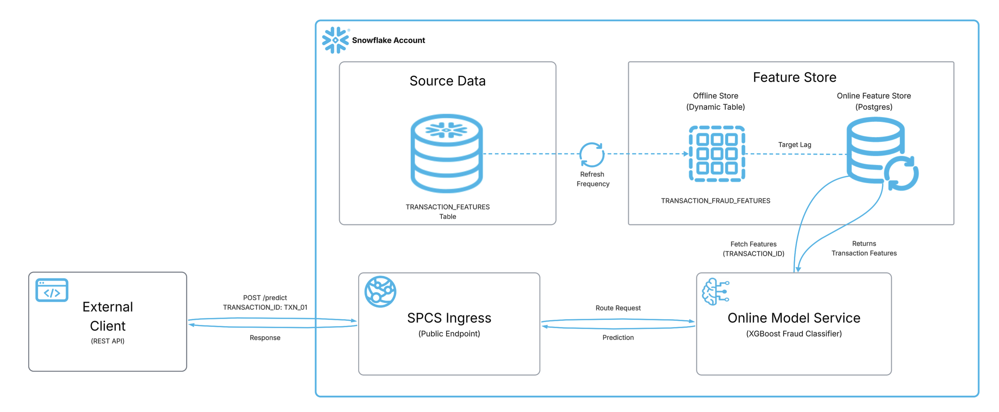

author: Trace Smith
id: build-real-time-ml-inference-with-feature-store
language: en
summary: Build a real-time ML inference service with Snowflake's Postgres-backed Feature Store to eliminate training-serving skew and serve predictions at low latency.
categories: snowflake-site:taxonomy/solution-center/partners/data-science-ml/featured,snowflake-site:taxonomy/solution-center/certification/quickstart
environments: web
status: Published
feedback link: https://github.com/Snowflake-Labs/sfguides/issues

# Build Real-Time ML Inference with Feature Store
<!-- ------------------------ -->
## Overview

In production ML systems, one of the hardest problems is **training-serving skew** — when features used at inference time differ from those used during training due to separate code paths and data sources. Snowflake's **Feature Store + ML Inference Service** integration solves this by providing a single source of truth for features across training and serving.

In this quickstart, you will build an end-to-end real-time fraud detection system that uses Snowflake's Postgres-backed Online Feature Store integrated with an ML Inference Service deployed on Snowpark Container Services (SPCS).

### Architecture



The diagram above illustrates the end-to-end inference flow. Source data in the `TRANSACTION_FEATURES` table is automatically synced — via a configurable refresh frequency and target lag — into the Postgres-backed Online Feature Store. When an external client sends a `POST /predict` request containing only a `TRANSACTION_ID`, the SPCS Ingress endpoint routes the request to the Online Model Service, which fetches the corresponding features from the Online Feature Store, runs the XGBoost fraud classifier, and returns the prediction back through the ingress to the caller - all in one step.

### Prerequisites
- A Snowflake account with **ACCOUNTADMIN** access
- Familiarity with Python and basic ML concepts
- Understanding of Snowflake notebooks

### What You'll Learn
- How to set up a Postgres-backed Online Feature Store in Snowflake
- How to register entities and feature views with online serving enabled
- How to train and register an ML model in the Snowflake Model Registry
- How to deploy a real-time inference service on SPCS with automatic feature lookup
- How to invoke the service from external clients using a REST API

### What You'll Need
- A [Snowflake Account](https://signup.snowflake.com/) (Enterprise edition or higher recommended)
- A Snowflake Notebook with **Container Runtime** enabled (CPU)
- `snowflake-ml-python >= 1.44.0`

### What You'll Build
- A **Postgres-backed Feature Store** with online serving enabled (10-second target lag)
- An **XGBoost fraud detection model** trained on synthetic transaction data and registered in the Model Registry
- A **real-time inference service** (SPCS) that automatically fetches features from the online store when callers send only a `TRANSACTION_ID`

<!-- ------------------------ -->
## Part I: Environment Setup

This section prepares your notebook, installs dependencies, and loads sample data into Snowflake.

### Open a Snowflake Notebook

Navigate to **Snowsight > Notebooks** and create a new notebook with the following settings:

- **Runtime**: Container Runtime (CPU)
- **Warehouse**: Any X-Small or larger warehouse

### Install Dependencies

In the first cell of your notebook, install the required package:

```python
pip install snowflake-ml-python -U
```

### Set Configuration

Create a configuration cell with centralized version and naming config. Update these values if you need to re-run the notebook with different versions:

```python
# === VERSION CONFIG ===
FEATURE_VIEW_VERSION = "V2"
MODEL_NAME = "FRAUD_XGBOOST"
MODEL_VERSION = "V1"
SERVICE_NAME = "FRAUD_DETECTION_SVC"
COMPUTE_POOL_NAME = "ML_ONLINE_CPU_POOL"

# === Roles ===
PRODUCER_ROLE = "ACCOUNTADMIN"
CONSUMER_ROLE = "ACCOUNTADMIN"
```

### Create Database and Schema

Create the database and schema that will house the feature store, model, and inference service:

```sql
USE ROLE ACCOUNTADMIN;
CREATE DATABASE IF NOT EXISTS ML_DEMO_INF_FS_LOOKUP;
CREATE SCHEMA IF NOT EXISTS ML_DEMO_INF_FS_LOOKUP.FRAUD_ML_SERVICE_FS;
USE DATABASE ML_DEMO_INF_FS_LOOKUP;
USE SCHEMA FRAUD_ML_SERVICE_FS;
```

### Generate Synthetic Data

Create 200 synthetic transaction records with features for fraud detection. In production, this would be your actual transaction data pipeline:

```python
import pandas as pd
import numpy as np

np.random.seed(42)
n_transactions = 200

data = pd.DataFrame({
    "TRANSACTION_ID": [f"TXN_{i:04d}" for i in range(n_transactions)],
    "TRANSACTION_AMOUNT": np.round(np.random.uniform(5, 5000, n_transactions), 2),
    "MERCHANT_CATEGORY": np.random.choice([0, 1, 2, 3, 4], n_transactions),
    "DISTANCE_FROM_HOME": np.round(np.random.uniform(0, 500, n_transactions), 2),
    "TIME_SINCE_LAST_TXN": np.round(np.random.uniform(0.1, 72, n_transactions), 2),
    "DAILY_TXN_COUNT": np.random.randint(1, 20, n_transactions),
    "IS_FRAUD": np.random.choice([0, 1], n_transactions, p=[0.92, 0.08]),
})

print(f"Dataset shape: {data.shape}")
data.head()
```

The features include:
| Feature | Description |
|---------|-------------|
| `TRANSACTION_AMOUNT` | Dollar amount of the transaction |
| `MERCHANT_CATEGORY` | Category code (0=retail, 1=online, 2=travel, 3=grocery, 4=entertainment) |
| `DISTANCE_FROM_HOME` | Miles from cardholder's home address |
| `TIME_SINCE_LAST_TXN` | Hours since the previous transaction |
| `DAILY_TXN_COUNT` | Number of transactions today |
| `IS_FRAUD` | Binary target (0=legitimate, 1=fraudulent) |

### Load Data into Snowflake

Write the synthetic DataFrame to a Snowflake table that will serve as the source for the Feature View:

```python
from snowflake.snowpark.context import get_active_session
from snowflake.ml.feature_store import FeatureStore, FeatureView, Entity

session = get_active_session()
session.use_database("ML_DEMO_INF_FS_LOOKUP")
session.use_schema("FRAUD_ML_SERVICE_FS")

session.create_dataframe(data).write.save_as_table("TRANSACTION_FEATURES", mode="overwrite")
print("Table TRANSACTION_FEATURES created with", session.table("TRANSACTION_FEATURES").count(), "rows")
```

<!-- ------------------------ -->
## Part II: Feature Store with Online Serving

This section creates the Postgres-backed online Feature Store, registers entities and feature views, and verifies low-latency feature retrieval.

### Initialize Feature Store and Register Entity

Initialize the Feature Store connection and register the `TRANSACTION` entity with `TRANSACTION_ID` as the join key. The entity defines the primary key that links feature rows to inference requests:

```python
from snowflake.ml.feature_store import FeatureStore, FeatureView, Entity, CreationMode
from snowflake.ml.feature_store import OnlineConfig, OnlineStoreType

fs = FeatureStore(
    session=session,
    database="ML_DEMO_INF_FS_LOOKUP",
    name="FRAUD_ML_SERVICE_FS",
    default_warehouse="COMPUTE_WH",
    creation_mode=CreationMode.CREATE_IF_NOT_EXIST
)

transaction_entity = Entity(name="TRANSACTION", join_keys=["TRANSACTION_ID"])
fs.register_entity(transaction_entity)
print("Entity registered:", transaction_entity.name)
```

### Create the Online Service

Provision the Postgres-backed online serving infrastructure. This spins up a managed Postgres instance that will serve features at low latency for real-time inference:

```python
import time

try:
    result = fs.create_online_service(
        producer_role=PRODUCER_ROLE,
        consumer_role=CONSUMER_ROLE
    )
    print(f"Create online service: {result}")
except Exception as e:
    print(f"Online service already exists or error: {e}")

# Poll until RUNNING
for i in range(60):
    status = fs.get_online_service_status()
    current_status = status.status if hasattr(status, 'status') else str(status)
    print(f"[{i+1}] Online service status: {current_status}")
    if current_status == "RUNNING":
        print("Online service is ready!")
        break
    time.sleep(10)
else:
    raise TimeoutError("Service did not reach RUNNING within 10 min.")
```

> aside positive
> The online service may take a few minutes to reach `RUNNING` state on first creation. Subsequent runs will be faster.

### Register Feature View with Postgres Online Store

Define and register the `TRANSACTION_FRAUD_FEATURES` Feature View. The `online_config` enables Postgres-backed serving with a **10-second target lag** — features sync from the source table to the online store within 10 seconds of any update:

```python
source_df = session.table("ML_DEMO_INF_FS_LOOKUP.FRAUD_ML_SERVICE_FS.TRANSACTION_FEATURES").select(
    "TRANSACTION_ID", "TRANSACTION_AMOUNT", "MERCHANT_CATEGORY",
    "DISTANCE_FROM_HOME", "TIME_SINCE_LAST_TXN", "DAILY_TXN_COUNT"
)

txn_fv = FeatureView(
    name="TRANSACTION_FRAUD_FEATURES",
    entities=[transaction_entity],
    feature_df=source_df,
    desc="Transaction fraud detection features",
    refresh_freq="1 minute",
    online_config=OnlineConfig(
        enable=True,
        target_lag="10s",
        store_type=OnlineStoreType.POSTGRES,
    ),
)

txn_fv = fs.register_feature_view(feature_view=txn_fv, version=FEATURE_VIEW_VERSION, overwrite=True)
print(f"Feature View registered: {txn_fv.name} version {txn_fv.version}")
print(f"Online store type: POSTGRES")
```

### Authenticate to the Online Feature Store

The Online Feature Store client authenticates via a **Programmatic Access Token (PAT)**. Without a valid token set in the environment, calls to `fs.read_feature_view()` with `StoreType.ONLINE` will fail with a connection or auth error.

You can extract the current session token directly:

```python
import os

os.environ['SNOWFLAKE_PAT'] = session.connection.rest.token
```

> aside negative
> The session token above is short-lived and suitable for development/testing. For production workloads, generate a dedicated PAT via **Snowsight → User Menu → My Profile → Authentication → Personal Access Tokens → + Generate** and store it securely (e.g., as a Snowflake secret).

### Verify Online Feature Retrieval

With authentication configured, confirm the online store is synced and serving features at low latency:

```python
from snowflake.ml.feature_store.feature_view import StoreType

os.environ['SNOWFLAKE_PAT'] = session.connection.rest.token

txn_fv = fs.get_feature_view("TRANSACTION_FRAUD_FEATURES", FEATURE_VIEW_VERSION)
print(f"Store type: {txn_fv.online_config.store_type}")
print(f"Target lag: {txn_fv.online_config.target_lag}")

test_keys = [["TXN_0001"], ["TXN_0010"], ["TXN_0050"]]

online_result = fs.read_feature_view(
    txn_fv,
    keys=test_keys,
    store_type=StoreType.ONLINE
)
print("\nOnline (Postgres) feature retrieval successful!")
online_result
```

You should see the feature values returned from the Postgres online store for each transaction ID. If you receive a connection or authentication error, verify that `SNOWFLAKE_PAT` is set correctly in your environment.

<!-- ------------------------ -->
## Part III: Train, Register, and Deploy Model

This section trains an XGBoost fraud detection model, registers it in the Snowflake Model Registry, and deploys it as a real-time inference service on SPCS with automatic feature lookup from the online store.

### Train XGBoost Model

Train an XGBoost binary classifier on the synthetic fraud data:

```python
import xgboost as xgb
from sklearn.model_selection import train_test_split
from sklearn.metrics import accuracy_score, roc_auc_score

FEATURES = ["TRANSACTION_AMOUNT", "MERCHANT_CATEGORY", "DISTANCE_FROM_HOME", 
    "TIME_SINCE_LAST_TXN", "DAILY_TXN_COUNT"]
TARGET = "IS_FRAUD"

X = data[FEATURES]
y = data[TARGET]

X_train, X_test, y_train, y_test = train_test_split(X, y, test_size=0.2, random_state=42)

model = xgb.XGBClassifier(
    n_estimators=50,
    max_depth=4,
    learning_rate=0.1,
    use_label_encoder=False,
    eval_metric="logloss",
    random_state=42
)
model.fit(X_train, y_train)

y_pred = model.predict(X_test)
y_proba = model.predict_proba(X_test)[:, 1]
print(f"Accuracy: {accuracy_score(y_test, y_pred):.3f}")
print(f"ROC AUC:  {roc_auc_score(y_test, y_proba):.3f}")
```

### Register Model in Snowflake Model Registry

Log the trained model to the Snowflake Model Registry with its input signature. This lets the inference service know which features the model expects:

```python
from snowflake.ml.registry import Registry

reg = Registry(session=session, database_name="ML_DEMO_INF_FS_LOOKUP", schema_name="FRAUD_ML_SERVICE_FS")

try:
    mv = reg.get_model(MODEL_NAME).version(MODEL_VERSION)
    print(f"Using existing model: {MODEL_NAME}/{MODEL_VERSION}")
except Exception:
    sample_input = X_train.head(5)
    mv = reg.log_model(
        model_name=MODEL_NAME,
        version_name=MODEL_VERSION,
        model=model,
        sample_input_data=sample_input,
        conda_dependencies=["xgboost"],
    )
    print(f"Model registered: {MODEL_NAME} version {MODEL_VERSION}")

funcs = mv.show_functions()
print(f"Functions: {[f['name'] if isinstance(f, dict) else str(f) for f in funcs]}")
```

### Create Compute Pool

Create a compute pool for online inference. The pool provisions nodes that will host the containerized model service:

```sql
CREATE COMPUTE POOL IF NOT EXISTS ML_ONLINE_CPU_POOL
  MIN_NODES = 1
  MAX_NODES = 3
  INSTANCE_FAMILY = CPU_X64_S
  AUTO_RESUME = TRUE
  AUTO_SUSPEND_SECS = 300
  COMMENT = 'Compute pool for fraud detection inference service';

DESCRIBE COMPUTE POOL ML_ONLINE_CPU_POOL;
```

### Deploy Inference Service with Feature Store Lookup

Deploy the model as a real-time HTTP service on SPCS. The key parameter is `feature_sources_per_function` — it maps the `predict` method to the Postgres-backed Feature View so the service **automatically fetches features** when callers send only `TRANSACTION_ID`:

```python
txn_fv = fs.get_feature_view("TRANSACTION_FRAUD_FEATURES", FEATURE_VIEW_VERSION)

mv.create_service(
    service_name=SERVICE_NAME,
    service_compute_pool=COMPUTE_POOL_NAME,
    ingress_enabled=True,
    feature_sources_per_function={"predict": [txn_fv]},
)
print(f"Service deployment initiated: {SERVICE_NAME}")
print(f"The service will auto-lookup features from TRANSACTION_FRAUD_FEATURES/{FEATURE_VIEW_VERSION} (Postgres online store)")
```

Verify the service is running:

```python
services_df = mv.list_services()
print("Active services:")
print(services_df.to_string())
```

> aside negative
> The service may take a few minutes to start. If it shows as `PENDING`, wait and re-run the verification cell.

<!-- ------------------------ -->
## Part IV: Test the Inference Endpoint

In this section, you'll test the inference service by calling its **public REST endpoint from outside Snowflake** — simulating how a production client (web app, microservice, Postman, or curl) would invoke it. This is not done from within the Snowsight UI; instead, you'll authenticate with a Programmatic Access Token (PAT) and make HTTP requests directly to the SPCS ingress endpoint.

### How It Works

The `feature_sources_per_function` parameter enables the inference service to **automatically look up features** from the online Postgres Feature Store. Here's what happens under the hood:

1. You send only `TRANSACTION_ID` values to the REST endpoint
2. The Snowflake ingress gateway intercepts the request
3. It fetches `TRANSACTION_AMOUNT`, `MERCHANT_CATEGORY`, `DISTANCE_FROM_HOME`, `TIME_SINCE_LAST_TXN`, `DAILY_TXN_COUNT` from the Postgres online store
4. The enriched payload is forwarded to the XGBoost model container
5. Fraud predictions are returned

### Set Up Authentication

To invoke the service from outside Snowflake, you need a PAT:

1. In Snowsight, click your username (top-left) > **My Profile** > **Authentication** > **Personal Access Tokens** > **+ Generate**
2. Grant the delegated authorization:

```sql
ALTER USER <your_user> ADD DELEGATED AUTHORIZATION
  OF ROLE ACCOUNTADMIN TO SECURITY INTEGRATION SNOWSERVICES_INGRESS_OAUTH;
```

3. **(If applicable) Whitelist your external IP in the account's network policy.** If your Snowflake account has an active [network policy](https://docs.snowflake.com/en/user-guide/network-policies), external requests to the SPCS ingress endpoint will be blocked unless the caller's IP is in the allowed list. Create a network rule and add it to your policy:

```sql
CREATE NETWORK RULE IF NOT EXISTS allow_external_inference
  TYPE = IPV4
  MODE = INGRESS
  VALUE_LIST = ('<YOUR_PUBLIC_IP>/32');

ALTER NETWORK POLICY <your_policy_name>
  ADD ALLOWED_NETWORK_RULE_LIST = ('allow_external_inference');
```

> aside positive
> You can find your public IP by running `curl ifconfig.me` from your terminal. If no network policy is active on the account, this step can be skipped — Snowflake allows access from all IPs by default.

### Call the Service

First, retrieve the ingress endpoint URL for your service:

```sql
SHOW ENDPOINTS IN SERVICE ML_DEMO_INF_FS_LOOKUP.FRAUD_ML_SERVICE_FS.FRAUD_DETECTION_SVC;
```

Copy the `ingress_url` value from the result — this is your `<ENDPOINT_URL>`.

From any external client (curl, Python requests, web app), invoke the service by sending only entity keys:

```bash
curl -X POST "https://<ENDPOINT_URL>/predict" \
  -H 'Authorization: Snowflake Token="<PAT_TOKEN>"' \
  -H 'Content-Type: application/json' \
  -d '{"dataframe_split": {"index": [0, 1, 2], "columns": ["TRANSACTION_ID"], "data": [["TXN_0001"], ["TXN_0010"], ["TXN_0050"]]}}'
```

Replace `<ENDPOINT_URL>` with the `ingress_url` from the query above and `<PAT_TOKEN>` with the PAT you generated.

The response will contain fraud predictions for each transaction — all without the caller needing to know which features exist or how they're computed.

> aside positive
> **Important:** The Python SDK (`mv.run()`) and SQL service functions do not trigger this feature enrichment — they bypass the gateway. This feature is designed for external real-time inference clients (web apps, microservices, mobile backends) that call the REST endpoint.

<!-- ------------------------ -->
## Cleanup

When you're done experimenting, clean up the resources:

```sql
DROP SERVICE IF EXISTS ML_DEMO_INF_FS_LOOKUP.FRAUD_ML_SERVICE_FS.FRAUD_DETECTION_SVC;
DROP MODEL IF EXISTS ML_DEMO_INF_FS_LOOKUP.FRAUD_ML_SERVICE_FS.FRAUD_XGBOOST;
DROP COMPUTE POOL IF EXISTS ML_ONLINE_CPU_POOL;
DROP DATABASE IF EXISTS ML_DEMO_INF_FS_LOOKUP;
```

<!-- ------------------------ -->
## Conclusion and Resources

Congratulations! You've built a complete real-time ML inference pipeline that eliminates training-serving skew by using Snowflake's Feature Store as a single source of truth.

### What You Learned
- How Snowflake's Postgres-backed Online Feature Store provides millisecond-level feature retrieval
- How to register entities and feature views with configurable online serving lag
- How to train and register models in the Snowflake Model Registry
- How to deploy inference services with `feature_sources_per_function` for automatic feature enrichment
- How external clients can get predictions by sending only entity keys

### Key Takeaways
- **No training-serving skew**: The same Feature View serves both training and inference
- **Decoupled clients**: API consumers send only an entity key — no need to know which features exist or how they're computed
- **Low-latency**: Postgres online store provides millisecond-level feature retrieval
- **Auto-fresh**: Features sync with configurable target lag (10s in this demo)
- **Simplified contracts**: Adding or modifying features doesn't require API changes

### Related Resources
- [Snowflake ML Inference Service Documentation](https://docs.snowflake.com/en/developer-guide/snowflake-ml/inference/real-time-inference-rest-api)
- [Snowflake Feature Store Documentation](https://docs.snowflake.com/en/developer-guide/snowflake-ml/feature-store/overview)
- [Snowflake Model Registry Documentation](https://docs.snowflake.com/en/developer-guide/snowflake-ml/model-registry/overview)
