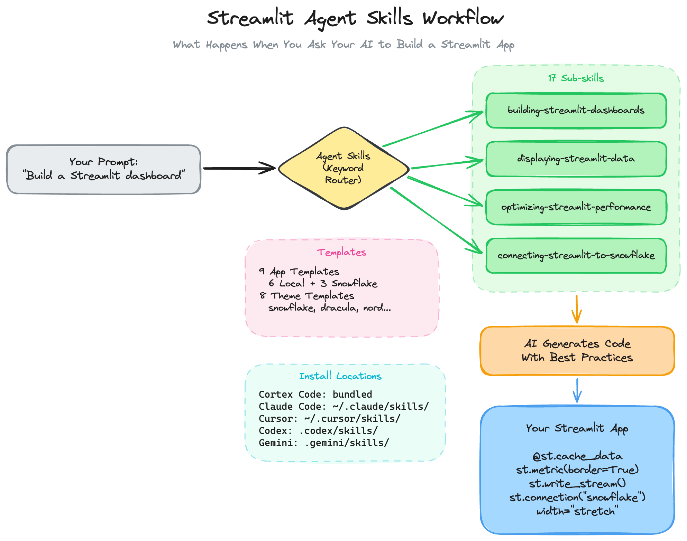
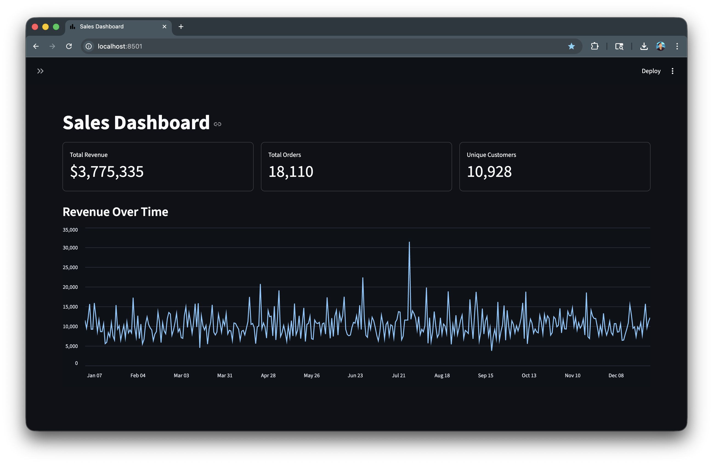
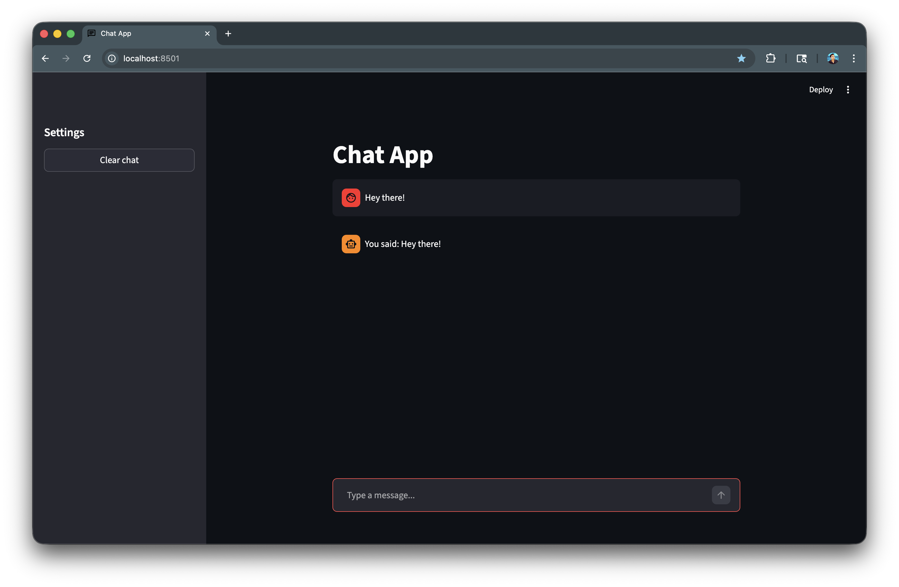

author: Chanin Nantasenamat
id: build-streamlit-apps-with-agent-skills
categories: snowflake-site:taxonomy/solution-center/certification/quickstart,snowflake-site:taxonomy/product/ai
language: en
summary: Use agent skills from the streamlit/agent-skills repository to teach your AI coding assistant how to build Streamlit apps that follow current best practices — with proper caching, modern APIs, and polished design out of the box.
environments: web
status: Published
feedback link: https://github.com/Snowflake-Labs/sfguides/issues


# Build Streamlit Apps with Agent Skills
<!-- ------------------------ -->
## Overview

When you ask an AI coding assistant to "build a Streamlit dashboard," it does its best. But the assistant is working from general knowledge that may be months or years out of date. 

Here's what that looks like in practice:

```python
# What an unaided AI often generates:
st.dataframe(df, use_container_width=True)  # deprecated parameter
if "messages" not in st.session_state:      # verbose initialization
    st.session_state.messages = []

# What you actually want:
st.dataframe(df, width="stretch")           # current API
st.session_state.setdefault("messages", []) # concise one-liner
```

Beyond deprecated APIs, the AI might skip caching entirely — meaning your app re-runs expensive queries every time a user clicks a filter instead of reusing results it already fetched. Or it might initialize session state with verbose `if/else` blocks instead of the one-liner `setdefault()` pattern.

**Agent skills** fix this by giving your AI assistant specialized, up-to-date knowledge about Streamlit development. Think of them as reference guides that your AI reads before writing code. Instead of guessing how to build a chat interface or configure a theme, the AI loads a skill that contains the exact patterns, code examples, and guidelines for that task.

The [streamlit/agent-skills](https://github.com/streamlit/agent-skills) repository is an open-source collection of 17 specialized skills for Streamlit development. They cover everything from building dashboards and chat UIs to connecting to Snowflake and creating custom components. The skills work with any AI coding assistant that supports the agent skills format — including Claude Code, Cursor, and Cortex Code (where they come pre-installed).

This guide walks you through installing the skills, understanding what each one does, and using them to build real apps. No prior experience with agent skills is required.

Here's a schematic summary of the Streamlit app creation process using the agent skills:

<!-- Diagram: https://excalidraw.com/#json=U51O43YAwXyA-pFGyDIRX,cBQiyuTWzTpt9-yB8xWISA -->


### What You'll Learn
- What agent skills are and how they help your AI assistant write better Streamlit code
- How to install the skills for your specific AI coding assistant
- How the 17 sub-skills are organized and when each one activates
- How to build a dashboard and a chatbot using the skills
- How to apply themes and use ready-made app templates
- How to connect your app to Snowflake

### What You'll Build
Two working Streamlit apps — a dashboard with KPI metrics and charts, and a chatbot with streaming responses — built with the help of agent skills.

### Prerequisites
- An AI coding assistant (any of: [Cortex Code](https://signup.snowflake.com/cortex-code?utm_source=snowflake-devrel&utm_medium=developer-guides&utm_cta=developer-guides), [Claude Code](https://docs.anthropic.com/en/docs/claude-code), [Cursor](https://cursor.com))
- Python 3 installed on your machine
- Streamlit installed (`pip install streamlit`)
- Basic familiarity with Python (you don't need to be an expert, know enough to make edits when necessary)

<!-- ------------------------ -->
## What Are Agent Skills?

Before we dive in, let's understand what agent skills actually are and why they matter.

### The Problem

AI coding assistants are trained on massive amounts of code, but their knowledge has a cutoff date. When you ask your AI to build a Streamlit app, it might generate code based on patterns that were correct a year ago but are outdated today.

The deprecated API in the Overview is just one example. Here are other common issues with unaided AI-generated Streamlit code:
- Missing `@st.cache_data` on data-loading functions, so the app re-fetches data on every user interaction instead of reusing cached results
- Verbose session state initialization (`if "key" not in st.session_state: ...`) instead of the one-liner `setdefault()` pattern
- Outdated navigation patterns instead of the current `st.navigation` and `st.Page` API

### The Solution: Agent Skills

An agent skill is a folder containing a `SKILL.md` file and optional supporting resources:

```
developing-with-streamlit/
├── SKILL.md              # Instructions the AI reads
├── skills/               # 17 specialized sub-skills
│   ├── building-streamlit-chat-ui/
│   ├── building-streamlit-dashboards/
│   ├── optimizing-streamlit-performance/
│   └── ...
└── templates/            # Ready-to-use app and theme templates
    ├── apps/             # 9 app templates
    └── themes/           # 8 theme templates
```

When you ask your AI to build a Streamlit app, it reads the relevant `SKILL.md` file and follows the instructions inside. This means the AI uses current APIs, proper caching patterns, and Streamlit-specific best practices — because the skill told it exactly what to do.

### How Routing Works

You don't need to tell the AI which skill to use. The parent skill (`developing-with-streamlit`) acts as a router that matches keywords in your prompt to the right sub-skill. The diagram below shows this flow end-to-end: your prompt enters on the left, the parent skill identifies relevant keywords and fans out to one or more sub-skills, and the AI uses those skills to generate code that follows current best practices.


Here's how it works in practice:

| Your Prompt | Matched Keywords | Sub-skill Loaded |
|---|---|---|
| "add a sidebar with filters" | sidebar, filters | `using-streamlit-layouts` |
| "build a chatbot" | chatbot | `building-streamlit-chat-ui` |
| "it's slow, add caching" | slow, caching | `optimizing-streamlit-performance` |
| "connect to Snowflake" | Snowflake | `connecting-streamlit-to-snowflake` |

If your prompt touches multiple areas — like "build a dashboard with a sidebar and charts" — the parent skill loads multiple sub-skills at once so the AI has all the code examples and guidelines it needs.

<!-- ------------------------ -->
## Install the Skills

Installation depends on which AI coding assistant you use. Pick your tool below.

### Cortex Code (Snowflake)

Good news — the skills are already bundled with Cortex Code under the name `developing-with-streamlit`. No installation needed. You can verify that they're available by running:

```bash
cortex skill list
```

Look for `developing-with-streamlit` under `[BUNDLED]`.

### Claude Code

Copy the skill folder to your [Claude Code skills directory](https://docs.anthropic.com/en/docs/claude-code/skills):

```bash
git clone https://github.com/streamlit/agent-skills.git
cp -r agent-skills/developing-with-streamlit ~/.claude/skills/
```

### Cursor

Copy the skill folder to your [Cursor skills directory](https://cursor.com/docs/context/skills):

```bash
git clone https://github.com/streamlit/agent-skills.git
cp -r agent-skills/developing-with-streamlit ~/.cursor/skills/
```

### Other AI Assistants

| Agent | Skills Folder | Documentation |
|-------|---------------|---------------|
| OpenAI Codex | `.codex/skills/` | [Codex Skills Docs](https://developers.openai.com/codex/skills/) |
| Gemini CLI | `.gemini/skills/` | [Gemini CLI Skills Docs](https://geminicli.com/docs/cli/skills/) |

The same `developing-with-streamlit` folder works with any assistant that supports the [agent skills format](https://agentskills.io/specification).

<!-- ------------------------ -->
## The Skill Map

The `developing-with-streamlit` skill contains 17 specialized sub-skills. Here's what each one does and when it activates.

### UI & Layout Skills

| Skill | What It Does | Activates When You Say... |
|-------|-------------|--------------------------|
| `building-streamlit-chat-ui` | Chat interfaces, chatbots, AI assistants | "build a chatbot," "add chat interface" |
| `building-streamlit-dashboards` | KPI cards, metrics, dashboard layouts | "create a dashboard," "show metrics" |
| `building-streamlit-multipage-apps` | Multi-page app structure with `st.navigation` | "multipage app," "add navigation" |
| `using-streamlit-layouts` | Sidebar, columns, containers, dialogs | "add a sidebar," "two-column layout" |
| `choosing-streamlit-selection-widgets` | Picking the right widget (selectbox, radio, etc.) | "dropdown menu," "let users pick" |

### Data & Display Skills

| Skill | What It Does | Activates When You Say... |
|-------|-------------|--------------------------|
| `displaying-streamlit-data` | DataFrames, column config, charts | "show a table," "add a chart" |
| `connecting-streamlit-to-snowflake` | `st.connection("snowflake")` setup | "connect to Snowflake," "query my data" |

### Style & Design Skills

| Skill | What It Does | Activates When You Say... |
|-------|-------------|--------------------------|
| `creating-streamlit-themes` | Theme configuration, colors, fonts, light/dark modes | "change the theme," "dark mode" |
| `improving-streamlit-design` | Icons, badges, spacing, text styling | "make it look better," "add icons" |
| `using-streamlit-markdown` | Colored text, badges, LaTeX, markdown features | "colored text," "add a badge" |

### Performance & Code Skills

| Skill | What It Does | Activates When You Say... |
|-------|-------------|--------------------------|
| `optimizing-streamlit-performance` | Caching, fragments, forms, performance tuning | "it's slow," "add caching" |
| `organizing-streamlit-code` | Separating UI from logic, clean modules | "organize the code," "refactor" |
| `using-streamlit-session-state` | Session state, widget keys, callbacks | "remember user input," "persist state" |

### Components & Tooling Skills

| Skill | What It Does | Activates When You Say... |
|-------|-------------|--------------------------|
| `building-streamlit-custom-components-v2` | Custom components with HTML/JS/CSS (v2 API) | "custom component," "embed JavaScript" |
| `using-streamlit-custom-components` | Third-party components from the community | "is there a component for...," "community widget" |
| `using-streamlit-cli` | CLI commands, running and configuring apps | "how to run," "streamlit config" |
| `setting-up-streamlit-environment` | Python environment setup | "set up my environment," "install streamlit" |

You don't need to memorize this table. Just describe what you want, and the parent skill routes to the right sub-skill automatically.

<!-- ------------------------ -->
## Build a Dashboard

Let's put the skills to work. We'll ask our AI assistant to build a dashboard and see how the skills improve the output.

### The Prompt

Open your AI coding assistant and type:

```
Build a Streamlit dashboard that shows sales metrics. Include KPI cards
at the top, a line chart for trends over time, and sidebar filters for
date range. Use sample data so I can run it immediately.
```

### What the Skills Do Behind the Scenes

When the AI receives this prompt, the parent skill routes to three sub-skills:

1. **`building-streamlit-dashboards`** — Provides the KPI card pattern using `st.metric(border=True)` and `st.columns`
2. **`displaying-streamlit-data`** — Provides chart patterns using `st.line_chart` with proper data formatting
3. **`optimizing-streamlit-performance`** — Ensures `@st.cache_data` is added to the data loading function

### What You Get

The AI generates something like this:

```python
import streamlit as st
import pandas as pd
import numpy as np
import datetime

st.set_page_config(
    page_title="Sales Dashboard",
    page_icon=":material/bar_chart:",
    layout="wide"
)

# --- Sample Data ---
@st.cache_data
def load_data():
    dates = pd.date_range("2024-01-01", periods=365, freq="D")
    np.random.seed(42)
    return pd.DataFrame({
        "date": dates,
        "revenue": np.random.lognormal(9.2, 0.3, len(dates)),
        "orders": np.random.poisson(50, len(dates)),
        "customers": np.random.poisson(30, len(dates)),
    })

df = load_data()

# --- Sidebar Filters ---
with st.sidebar:
    st.header("Filters")
    date_range = st.date_input(
        "Date range",
        value=(df["date"].min(), df["date"].max()),
        min_value=df["date"].min(),
        max_value=df["date"].max(),
    )

# Apply filter
if len(date_range) == 2:
    mask = (df["date"] >= pd.Timestamp(date_range[0])) & (
        df["date"] <= pd.Timestamp(date_range[1])
    )
    filtered = df[mask]
else:
    filtered = df

# --- KPI Cards ---
st.title("Sales Dashboard")

cols = st.columns(3)
cols[0].metric("Total Revenue", f"${filtered['revenue'].sum():,.0f}", border=True)
cols[1].metric("Total Orders", f"{filtered['orders'].sum():,}", border=True)
cols[2].metric("Unique Customers", f"{filtered['customers'].sum():,}", border=True)

# --- Trend Chart ---
st.subheader("Revenue Over Time")
st.line_chart(filtered.set_index("date")["revenue"])
```

### What the Skills Added

Here's what changed compared to what an unaided AI would generate. Each comparison below shows the "without skills" version first, followed by the "with skills" version:

**Data loading — without vs. with skills:**

Caching tells Streamlit to store the result of a function so it doesn't re-run every time the page refreshes. The `@st.cache_data` line below is a Python decorator — a one-line annotation you place above a function to change its behavior.

```python
# WITHOUT skills: no caching, data reloads on every widget click
def load_data():
    dates = pd.date_range("2024-01-01", periods=365, freq="D")
    return pd.DataFrame({...})

# WITH skills: cached, loads once and stays in memory
@st.cache_data
def load_data():
    dates = pd.date_range("2024-01-01", periods=365, freq="D")
    return pd.DataFrame({...})
```

**Page config — without vs. with skills:**
```python
# WITHOUT skills: missing entirely, or minimal
st.title("Dashboard")

# WITH skills: full config with wide layout and material icons
st.set_page_config(
    page_title="Sales Dashboard",
    page_icon=":material/bar_chart:",
    layout="wide"
)
```

**Date filter — without vs. with skills:**
```python
# WITHOUT skills: unbounded, users can pick impossible dates
date_range = st.date_input("Date range")

# WITH skills: bounded to actual data range
date_range = st.date_input(
    "Date range",
    value=(df["date"].min(), df["date"].max()),
    min_value=df["date"].min(),
    max_value=df["date"].max(),
)
```

Each change is small on its own, but they compound fast. An app without caching feels sluggish. An app without bounded date inputs breaks when a user selects a date in the future like December 2030. An app without `layout="wide"` wastes half the screen on a dashboard. The skills prevent all of these issues because the AI follows proven patterns instead of improvising.

### Run It

Save the code as `app.py` and run:

```bash
streamlit run app.py
```

You should see Streamlit start up in your terminal:

```
  You can now view your Streamlit app in your browser.

  Local URL: http://localhost:8501
  Network URL: http://192.168.1.100:8501
```

Open `http://localhost:8501` in your browser. You should see a dashboard with three KPI cards, a line chart, and a sidebar date filter — all working out of the box.



<!-- ------------------------ -->
## Build a Chat App

Now let's build something completely different — a chatbot with streaming responses.

### The Prompt

```
Create a Streamlit chat app with streaming responses. Use a simple
echo bot for now (repeat back what the user types, word by word, to
show the streaming effect). Include a sidebar with a clear-chat button.
```

### What the Skills Do

The parent skill routes to:

1. **`building-streamlit-chat-ui`** — Provides the `st.chat_message` + `st.chat_input` pattern with message history
2. **`using-streamlit-session-state`** — Ensures proper initialization with `st.session_state.setdefault()`

### What You Get

```python
import streamlit as st
import time

st.set_page_config(
    page_title="Chat App",
    page_icon=":material/chat:",
    layout="centered"
)

# --- Sidebar ---
with st.sidebar:
    st.header("Settings")
    if st.button("Clear chat", width="stretch"):
        st.session_state.messages = []
        st.rerun()

# --- Initialize State ---
st.session_state.setdefault("messages", [])

st.title("Chat App")

# --- Display History ---
for msg in st.session_state.messages:
    st.chat_message(msg["role"]).write(msg["content"])

# --- Chat Input ---
if prompt := st.chat_input("Type a message..."):
    # Add user message
    st.session_state.messages.append({"role": "user", "content": prompt})
    st.chat_message("user").write(prompt)

    # Stream the response word by word
    def response_stream():
        for word in f"You said: {prompt}".split():
            yield word + " "
            time.sleep(0.05)

    with st.chat_message("assistant"):
        full_response = st.write_stream(response_stream())

    st.session_state.messages.append(
        {"role": "assistant", "content": full_response}
    )
```

### Key Patterns the Skills Taught the AI

Let's look at the specific patterns the skills provided:

**Session state initialization:**
```python
# The skills teach this pattern:
st.session_state.setdefault("messages", [])

# Instead of this older pattern:
if "messages" not in st.session_state:
    st.session_state.messages = []
```

Both work, but `setdefault` is more concise and is the pattern the skills teach.

**Streaming with `st.write_stream`:**
```python
# The skills teach this clean pattern:
full_response = st.write_stream(response_stream())

# Instead of manually building the response:
placeholder = st.empty()
full_response = ""
for chunk in response_stream():
    full_response += chunk
    placeholder.markdown(full_response)
```

The `st.write_stream` function handles all the complexity of displaying streaming text. It replaces several lines of manual placeholder logic with a single call.

**Chat message pattern:**
```python
# Walrus operator for clean flow:
if prompt := st.chat_input("Type a message..."):
```

This assigns the input to `prompt` and checks if it's non-empty in one line.

### Run It

```bash
streamlit run app.py
```

Type a message and watch it stream back word by word. Click "Clear chat" in the sidebar to reset the conversation.



<!-- ------------------------ -->
## Apply a Theme

Every Streamlit app starts with the default theme, but the skills include 8 ready-made theme templates you can apply instantly.

### Available Themes

The `creating-streamlit-themes` skill provides these templates:

| Theme | Style | Best For |
|-------|-------|----------|
| `snowflake` | Blue and white, professional | Snowflake-branded apps |
| `dracula` | Dark purple with green/pink accents | Developer tools |
| `nord` | Cool blue-gray, muted palette | Clean, minimal apps |
| `stripe` | Crisp white with purple accents | Financial, business apps |
| `solarized-light` | Warm light with teal accents | Reading-heavy apps |
| `spotify` | Dark with bright green | Media, entertainment apps |
| `github` | Light, high contrast | Documentation, code tools |
| `minimal` | Pure black and white | Content-first apps |

### Apply a Theme

To apply a theme, ask your AI assistant:

```
Apply the dracula theme to my app
```

The `creating-streamlit-themes` skill activates and the AI creates a `.streamlit/config.toml` file:

```toml
[theme]
primaryColor = "#bd93f9"
backgroundColor = "#282a36"
secondaryBackgroundColor = "#44475a"
textColor = "#f8f8f2"
font = "sans serif"
```

That's it. Restart your app and the theme is applied. No CSS, no custom components — just a config file.

Streamlit reads `config.toml` on startup and applies these five settings (four colors and a font) to every widget, chart, and layout element. This means a single file controls the look of your entire app — buttons, sliders, DataFrames, charts, sidebar, and text all inherit from these settings automatically.

### Light and Dark Mode

Streamlit supports both light and dark modes. The theme in `config.toml` sets the default, but users can toggle between modes from the app menu (the "**⋮**" icon in the top right corner, then **Settings**).

If you want to force a specific mode, add:

```toml
[theme]
base = "dark"   # or "light"
```

### Using Google Fonts

The theme templates also include Google Font configurations for a more polished look. Ask your AI:

```
Apply the stripe theme with the Inter font
```

The skill knows to configure the font in the theme settings for a clean, professional appearance.

<!-- ------------------------ -->
## Use the App Templates

Sometimes you don't want to start from scratch. The skills include 9 ready-to-use app templates that give you a working starting point.

### Available Templates

**Local Templates (6):**

| Template | What It Includes |
|----------|-----------------|
| Basic Dashboard | KPIs, line chart, sidebar filters, sample data |
| Advanced Dashboard | Multiple chart types, data tables, export |
| Chat App | Chat UI with message history, streaming |
| Data Explorer | File upload, data profiling, column stats |
| Multipage App | Navigation, multiple pages, shared state |
| Form App | Input forms, validation, submission handling |

**Snowflake Templates (3):**

| Template | What It Includes |
|----------|-----------------|
| Snowflake Dashboard | `st.connection`, KPIs from live queries |
| Snowflake Chat | Cortex AI-powered chatbot |
| Snowflake Explorer | Browse tables, run queries, view results |

### Use a Template

Ask your AI assistant:

```
Start a new app from the basic dashboard template
```

The AI reads the template from the skills directory and creates your project files. Templates include sample data so you can run them immediately without setting up a database.

### When to Use Templates vs. Prompting

- **Use a template** when you want a quick starting point and plan to customize from there
- **Use a prompt** when you have a specific vision that doesn't match any template
- **Combine both** — start from a template, then ask the AI to modify it ("change this dashboard to show inventory data instead of sales")

<!-- ------------------------ -->
## Connect to Snowflake

If your data lives in Snowflake, the `connecting-streamlit-to-snowflake` skill teaches the AI how to set up the connection properly.

### The Prompt

```
Connect my dashboard to Snowflake and load data from the ORDERS table
```

### What the Skill Provides

The AI creates two files:

**`.streamlit/secrets.toml.example`** (rename to `secrets.toml` and fill in your credentials):

```toml
[connections.snowflake]
account = "myorg-myaccount"
user = "myuser"
password = "mypassword"
warehouse = "COMPUTE_WH"
database = "MY_DB"
schema = "PUBLIC"
role = "MY_ROLE"
```

**`app.py`** with a Snowflake connection:

```python
import streamlit as st

st.set_page_config(page_title="Snowflake Dashboard", layout="wide")

# Connect to Snowflake
conn = st.connection("snowflake")

# Load data with caching
@st.cache_data(ttl=600)
def load_orders():
    return conn.query("SELECT * FROM orders LIMIT 1000")

df = load_orders()

# Display
st.title("Orders Dashboard")
st.dataframe(df, width="stretch")
```

### Key Things the Skill Ensures

1. **`st.connection("snowflake")`** — The modern way to connect. The skill prevents the AI from using older patterns like `snowflake.connector.connect()` directly, which requires more boilerplate code and doesn't integrate with Streamlit's caching or secrets management.

2. **`@st.cache_data(ttl=600)`** — Caches query results for 10 minutes. Without this, every widget interaction would re-run the query.

3. **Parameterized queries** — When user input is involved, the skill teaches the AI to use parameterized queries instead of f-strings, which prevents SQL injection:

```python
# UNSAFE — f-string opens you to SQL injection:
df = conn.query(f"SELECT * FROM orders WHERE status = '{user_input}'")

# SAFE — parameterized query the skill teaches:
df = conn.query(
    "SELECT * FROM orders WHERE status = :status",
    params={"status": user_input},
)
```

4. **Secrets in `.streamlit/secrets.toml`** — Credentials stay out of your code. The skill also creates a `.example` file so you know what to fill in.

### Important: Snowflake Returns Uppercase Column Names

One gotcha the skill handles: when you query Snowflake, pandas DataFrames come back with UPPERCASE column names. So `SELECT order_id FROM orders` returns a column named `ORDER_ID`, not `order_id`. The skill ensures the AI references columns in uppercase.

<!-- ------------------------ -->
## Conclusion And Resources

You've learned how agent skills transform your AI coding assistant from a general-purpose code generator into a Streamlit specialist. By loading domain-specific knowledge about current APIs, caching patterns, and design best practices, the skills ensure your AI writes Streamlit code that works correctly from the start.

### What You Learned
- Agent skills are instruction sets that give AI assistants specialized, up-to-date knowledge
- The `developing-with-streamlit` skill collection contains 17 sub-skills that cover the full Streamlit development workflow
- Skills activate automatically based on your prompt — you describe what you want and the right skill loads
- The skills ensure modern patterns: `@st.cache_data`, `st.write_stream`, `width="stretch"`, `st.session_state.setdefault()`
- Ready-made templates (9 apps, 8 themes) give you polished starting points
- Snowflake connections use `st.connection("snowflake")` with proper caching and parameterized queries

### Next Steps

Now that you have the skills installed, here are concrete things to try:

1. **Swap in real data** — Take the dashboard you built and replace the sample data with a live Snowflake query using `st.connection("snowflake")`
2. **Combine apps** — Ask the AI to "add a chat sidebar to my dashboard" and watch the routing load both `building-streamlit-chat-ui` and `building-streamlit-dashboards` simultaneously
3. **Contribute a skill** — The [streamlit/agent-skills](https://github.com/streamlit/agent-skills) repository accepts pull requests. If you find a pattern the skills don't cover, add it

### Related Resources

Documentation:
- [streamlit/agent-skills on GitHub](https://github.com/streamlit/agent-skills) — The full skill collection
- [Agent Skills Specification](https://agentskills.io/specification) — How skills are structured
- [Streamlit Documentation](https://docs.streamlit.io) — Official Streamlit docs
- [Streamlit LLM Docs](https://docs.streamlit.io/llms.txt) — Docs in LLM-optimized format

AI Coding Assistants:
- [Cortex Code](https://docs.snowflake.com/en/user-guide/cortex-code/cortex-code) — Snowflake's AI coding CLI (skills pre-installed)
- [Claude Code](https://docs.anthropic.com/en/docs/claude-code) — Anthropic's terminal coding tool
- [Cursor](https://cursor.com) — AI-native code editor
