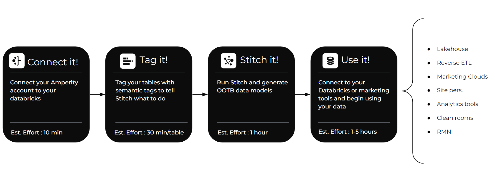
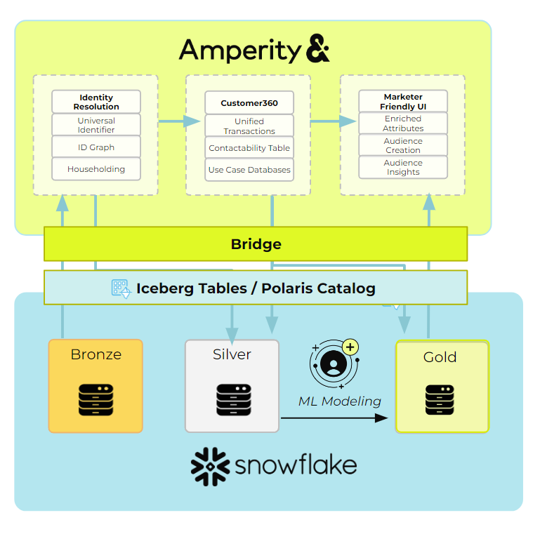
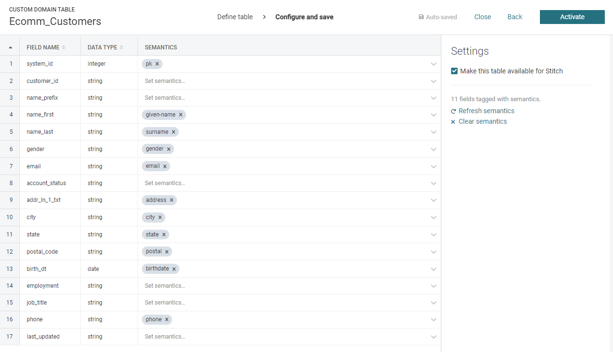
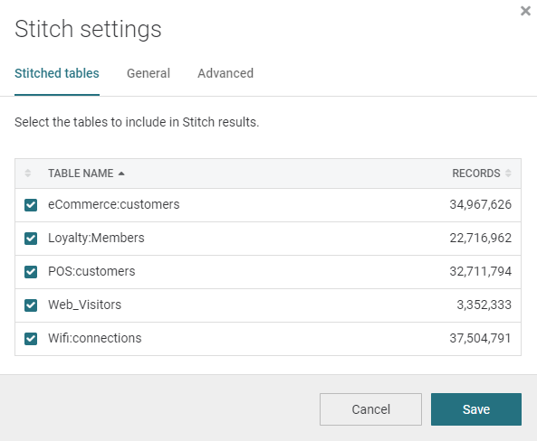
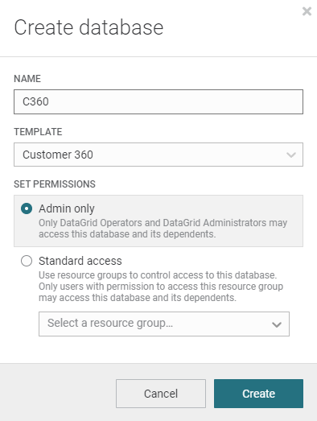

author: Daniel Perlovsky
id: build-unified-customer-360-using-amperity
categories: snowflake-site:taxonomy/solution-center/certification/quickstart, snowflake-site:taxonomy/solution-center/certification/partner-solution, snowflake-site:taxonomy/solution-center/includes/architecture, snowflake-site:taxonomy/product/data-engineering, snowflake-site:taxonomy/snowflake-feature/transformation, snowflake-site:taxonomy/snowflake-feature/dynamic-tables
language: en
summary: Build unified Customer 360 profiles with Amperity and Snowflake for identity resolution and personalization at scale.
environments: web
status: Published 
feedback link: https://github.com/Snowflake-Labs/sfguides/issues

# Build a Unified Customer 360 Database using Amperity and Snowflake
<!-- ------------------------ -->
## Overview 

Every company gets data from their customers from a constantly growing and evolving collection of sources. Ecommerce, loyalty, point-of-sale, web visits, marketing response data, etc. That data is complex and stored in many different formats, which creates a massive burden for data engineering teams.

Amperity is the world’s first dedicated platform for turning that raw data into the best possible unified data model, commonly referred to as a Customer 360, and making that data available anywhere your teams need it.

Gone are the days of developing, maintaining and managing hundreds of custom data modeling jobs, collections of tools, workflows, dev environments, etc. 

The Amperity platform plugs into your Snowflake via secure data sharing and data engineers can turn raw data into unified data with low-code and zero copies thanks to Snowflake Iceberg Tables.

In this quickstart we will walk through the basic steps to turn raw data into a world class Customer 360 collection of tables in hours instead of months.

### Prerequisites

- Access to a Snowflake account with the ability to set up secure data sharing. If you do not have a Snowflake account, you can register for a [free trial account](https://signup.snowflake.com/?utm_source=snowflake-devrel&utm_medium=developer-guides&utm_cta=developer-guides).
- Access to an Amperity account
- Basic experience with Snowflake

### What You’ll Learn

- How to connect Amperity to your Snowflake account
- How to tag your raw data with semantic tags
- How to configure AI identity resolution
- How to generate an enriched Customer 360

### What You’ll Build

- A collection of unified tables with standardized data and the best quality identity

<!-- ------------------------ -->
## Connect

Your Amperity account connects to Snowflake via secure data sharing powered by an Amperity platform feature called Bridge. This allows for a zero copy architecture and lets you use data in your Snowflake with the easy UI and data management platform you get from Amperity.

### Create Bridge in Amperity

1. Log into your Amperity account
2. Navigate to your Sources tab
3. Scroll down or click to find “Inbound Shares” and click “Add Bridge”

4. Select Snowflake
5. Enter the name for your bridge and, optionally, a description. Populate your account name, organization and region of your Snowflake environment.

6. Click Save. 

### Create the Share in Snowflake

1. Log into Snowflake.
2. Using the [Snowflake documentation](https://docs.snowflake.com/en/user-guide/data-sharing-provider#creating-a-share), create a Secure Data Share of the tables you wish to use in Amperity. 

### Validate the Share in Amperity

1. Return to your Amperity UI.
2. Enter your Secure Share Identifier and click “Test connection” to validate the connection is successful. Click “Select tables”.
3. You should see the tables in the Snowflake database that you shared. Select which ones you will want to run through your Amperity platform to use in your unified data model. 
    - Recommended: Any profile or identity data, data with PII, transactions, opt and preferences, loyalty data
4. Click “Save & Sync”

You are ready to go. Time to set up your tags.

<!-- ------------------------ -->
## Tag

Amperity does have a schema or require you to do a bunch of data modeling to create your Customer 360.

Instead you apply tags to the raw data which informs the Amperity algorithms. Stitch uses these tags to create standardized tables as well as run identity resolution to generate your ID graph.

For each table you want to include, you will be verifying and adding tags to each field.

Amperity has a constantly growing library of tags for common data models:

* Profiles
* Product Catalogs
* Itemized Transactions
* Compliance Requests
* Loyalty Profiles and Events
* Email Events and Engagement
* Opt and Preferences
* Fiscal Calendars

For each type of data, identify the tables that contain data relevant to the models you want to see in your Customer 360.

### Tag Your Tables

Log into Amperity and navigate to the Sources tab. For each table, do the following:

1. Click “Add Custom Domain Table”. Name it and click “Save.
2. Select your table on the right hand list of domain tables.
3. From the 3-dot menu next to the table name, click “Copy Table SQL” and paste it into the query window.
    - Alternatively you can just write a “select * from” query in the SQL window.
    - You also are free to add any filters, joins or other logic.
4. Click “Next”
5. The tagging UI will look at the first 10,000 populated rows of the data and attempt to guess the semantic tags relevant to the data. Review any existing tags and validate that it matches your understanding of what data is in the field. 
6. Review fields that did not receive a predicted semantic tag and add any missing tags with the dropdown.
7. Make sure to add a pk tag to the primary key field.
8. If this table contains Profile semantics.
9. Click “Activate”

Now you should be ready to kick off Stitch and let it do the heavy lifting!
<!-- ------------------------ -->
## Stitch

Amperity’s Stitch is the world’s first AI identity resolution algorithm. Historically data teams have been stuck using simple, rules-based algorithms that are complex to configure and result in inaccurate identity. 

Amperity uses up to 45 different machine learning algorithms on your Snowflake data to produce the most transparent and accurate identity graph available. 

Stitch also does several other things:

1. Creates a standardized, unified table for each semantic tag domain used. 
    1. For example, Profile semantics create a library of identity tables. Itemized Transaction semantics create a library of transaction and lifecycle attribute tables, opt and preference semantics create a unified customer contactibility table.
2. Standardizes the PII in the Profile semantic tagged tables to optimize the matching results.
3. Runs up to 45 machine learning algorithms to produce a library of identity tables.
4. Generates a stable Amperity ID for each person in your data.
5. Propagates that new unified ID to all of the tables you have tagged so that every table now has a single join key.

### Configure Stitch

Configuring Stitch is as simple as selecting which tables you want to generate identity data for.

1. Log into Amperity, navigate to the Stitch tab
2. Click “Stitch Settings” in the upper right.
3. Check the box on all tables you want to run through ID resolution

4. Click “Save”
5. Click “Run” in the upper right.

That’s it!

Stitch will access your raw data via Snowflake secure data sharing and generate a large library of unified tables, ready for use.

<!-- ------------------------ -->
## Use

Now that you have run Stitch, your Amperity tenant will have a whole new list of domain tables. Most of these are named with the prefix “Unified” and correspond to the library of tags that were used.

You are now ready to start using your data.

Here are a list of things you could go do:

* Share your new Iceberg tables into any of your Snowflake accounts to provide zero copy access to your new tenant data
    * Analytics data
    * Compliance data
    * Identity keyring
* [Build custom real-time APIs for site personalization or marketing personalization at the point of send.](https://docs.amperity.com/datagrid/api_profile.html)
* [Configure the Segments and Campaigns interface to provide marketers direct access to build audiences and deploy them](https://docs.amperity.com/datagrid/add_ampiq.html)
* [Connect Amperity to your activation systems and use Amperity to keep your activation applications full of robust data](https://docs.amperity.com/datagrid/destination_salesforce_marketing_cloud.html)
* [Connect Amperity to your paid media channels and use Amperity as an onboarder to replace expensive third party contracts](https://docs.amperity.com/datagrid/destination_the_trade_desk.html)

### Recommended: Make your Customer 360

Stitch outputs a large library of standardized tables. Commonly the next goal is to take that data and model it into a Customer 360.

A Customer 360 is a collection of tables that are cleaned up, merged, and represent the best possible profile view of each customer, as well as all of their behaviors and interactions with your brand.

Amperity has been building Customer 360 models for the world’s biggest brands for a decade and has a constantly growing library of out-of-the-box models that cover a wide variety of use cases and have time tested, proven models. You shouldn’t have to design or start from scratch.

To generate these models do the following:

1. Log into Amperity, navigate to the Customer 360 tab.
2. Click “Create Database”
3. Give your Database a name and choose “Customer 360” from the template dropdown.

4. Click create.

This will use the available data to generate as many of the out-of-the-box models as possible.

You can then begin to explore these models or go into the new database and begin adding your own fields or customizing the out-of-the-box rules.

<!-- ------------------------ -->
## Conclusion And Resources

Now that you have built your customer 360, you are ready to start connecting it to your marketing tools or share it back to Snowflake for your data teams to start building workflows on it.

### What You Learned
- How to connect Amperity to your Snowflake account
- How to tag your raw data with semantic tags
- How to configure AI identity resolution
- How to generate an enriched Customer 360

### Related Resources
- [Amperity Documentation](https://docs.amperity.com/)
- [Download Reference Architecture](/content/dam/snowflake-site/developers/2024/10/MMDS-Snowflake-Reference-Architecture.pdf)
- [Read the blog](https://medium.com/snowflake/amperity-snowflake-quickstart-a154611e0160)
- [Watch the Demo](https://youtu.be/_IQjSSROkJM?list=TLGGtApyaWG82HQyMjA5MjAyNQ)
  
