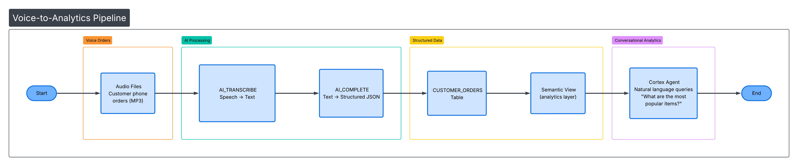

id: build-voice-ai-analytics-pipeline-snowflake-cortex
summary: Build an end-to-end voice order processing pipeline using Snowflake AI — from audio generation to transcription, structured extraction, semantic views, and conversational analytics with Cortex Agents.
categories: snowflake-site:taxonomy/solution-center/certification/quickstart,snowflake-site:taxonomy/product/ai,snowflake-site:taxonomy/snowflake-feature/cortex-llm-functions,snowflake-site:taxonomy/snowflake-feature/cortex-analyst,snowflake-site:taxonomy/snowflake-feature/conversational-assistants,snowflake-site:taxonomy/snowflake-feature/unstructured-data-analysis
environments: web
status: Published
feedback link: https://github.com/Snowflake-Labs/sfguides/issues
tags: AI, Cortex, AI_TRANSCRIBE, AI_COMPLETE, Cortex Agents, Cortex Analyst, Semantic Views, External Access Integration, Notebooks
authors: Moutasem Akkad
language: en

# Voice Order Processing with Snowflake AI

## Overview

**TastyBytes**, a fictional food truck network, is modernizing their phone ordering system. In this guide, you'll build an end-to-end voice order processing pipeline that goes from raw audio recordings to structured order data to conversational analytics — all within Snowflake.

You'll use Snowflake's built-in AI functions to transcribe audio, extract structured data with an LLM, build a Semantic View for analytics, and create a Cortex Agent for natural language queries.

### Architecture



### Prerequisites

- A Snowflake account with **ACCOUNTADMIN** role access
- Basic familiarity with SQL and Python

### What You'll Learn

- How to generate synthetic audio using the Google Translate TTS API from a Snowflake Notebook
- How to transcribe audio files with **AI_TRANSCRIBE**
- How to extract structured order data using **AI_COMPLETE** with JSON schema enforcement
- How to build a **Semantic View** for natural language analytics
- How to create a **Cortex Agent** that answers conversational queries about order data
- How to analyze order patterns with SQL

### What You'll Need

- A [Snowflake account](https://signup.snowflake.com/) (trial accounts work)
- ACCOUNTADMIN role access
- A warehouse (the setup script creates one for you)

### What You'll Build

An automated voice-to-order processing system that:

1. Takes audio recordings of food orders
2. Transcribes them to text using AI_TRANSCRIBE
3. Extracts structured data (item name, quantity, size, special instructions) using AI_COMPLETE
4. Stores orders in a queryable table
5. Provides analytics via a Semantic View
6. Enables natural language queries through a Cortex Agent

## Run the Setup Script

Open a SQL worksheet in Snowsight and paste the contents of [setup.sql](https://github.com/Snowflake-Labs/sfquickstarts/blob/master/site/sfguides/src/build-voice-ai-analytics-pipeline-snowflake-cortex/assets/setup.sql). Run the entire script. This creates:

- **Warehouse:** `TASTY_AUDIO_WH`
- **Database/Schema:** `TASTY_AUDIO_DB.ORDERS`
- **Stage:** `AUDIO_STAGE` (internal, with directory table enabled)
- **Tables:** `CUSTOMER_ORDERS`, `ORDER_PHRASES` (75 seed phrases across 9 categories)
- **External Access Integration:** `GOOGLE_TTS_INTEGRATION` (allows outbound HTTPS to `translate.google.com`)

## Import and Configure the Notebook

1. In Snowsight, go to **Projects > Notebooks**
2. Click the **down arrow** next to **+ Notebook** and select **Import .ipynb file**
3. Download and upload [voice_order_processing.ipynb](https://github.com/Snowflake-Labs/sfquickstarts/blob/master/site/sfguides/src/build-voice-ai-analytics-pipeline-snowflake-cortex/assets/voice_order_processing.ipynb)
4. Select database `TASTY_AUDIO_DB` and schema `ORDERS`
5. Select warehouse `TASTY_AUDIO_WH`
6. Go to **Settings > External access** and add `GOOGLE_TTS_INTEGRATION`
7. **Restart the notebook session** (required for the External Access Integration to take effect)

## Generate Audio Files

The first code cell in the notebook sets the database context and verifies the seed data:

```sql
USE DATABASE tasty_audio_db;
USE SCHEMA orders;
SELECT COUNT(*) AS phrase_count FROM ORDER_PHRASES;
```

Then the following Python cell generates 75 MP3 audio files by calling the Google Translate TTS API for each order phrase and uploading the result to the `@AUDIO_STAGE` stage:

```python
import requests
import io
import urllib.parse
from snowflake.snowpark.context import get_active_session

session = get_active_session()

phrases_df = session.sql("SELECT phrase_id, order_text FROM ORDER_PHRASES").collect()

for row in phrases_df:
    phrase_id = row['PHRASE_ID']
    text = row['ORDER_TEXT']
    filename = f"order_{str(phrase_id).zfill(2)}.mp3"

    encoded_text = urllib.parse.quote(text)
    url = f"https://translate.google.com/translate_tts?ie=UTF-8&client=tw-ob&tl=en&q={encoded_text}"
    response = requests.get(url)

    audio_buffer = io.BytesIO(response.content)
    session.file.put_stream(
        audio_buffer,
        f"@AUDIO_STAGE/{filename}",
        auto_compress=False,
        overwrite=True
    )
    print(f"Generated: {filename}")

print(f"\nGenerated {len(phrases_df)} audio files!")
```

After generation, refresh the stage directory table and list all files:

```sql
ALTER STAGE AUDIO_STAGE REFRESH;
LIST @AUDIO_STAGE;
```

> **Note:** Snowflake Notebooks do not support `pip install`. The `requests` library is available by default — use it for any HTTP API calls.

## Test Transcription

Before processing all 75 files, test `AI_TRANSCRIBE` on a single file to validate the audio was generated correctly:

```sql
SELECT AI_TRANSCRIBE(TO_FILE('@AUDIO_STAGE', 'order_01.mp3')) AS transcription;
```

This returns JSON with the transcribed text, language, and duration. Verify the transcription matches the original phrase before proceeding.

## Run the Full AI Pipeline

This single SQL statement chains three CTEs to transcribe all 75 audio files, extract structured order data with an LLM, and insert the results into the `CUSTOMER_ORDERS` table:

```sql
INSERT INTO CUSTOMER_ORDERS (
    audio_file, 
    raw_transcript, 
    item_name, 
    quantity, 
    size, 
    special_instructions
)

WITH staged_files AS (
    SELECT RELATIVE_PATH AS filename
    FROM DIRECTORY(@AUDIO_STAGE)
    WHERE RELATIVE_PATH LIKE '%.mp3'
),

transcriptions AS (
    SELECT 
        filename,
        AI_TRANSCRIBE(TO_FILE('@AUDIO_STAGE', filename)) AS transcript
    FROM staged_files
),

extracted AS (
    SELECT 
        filename,
        transcript:text::VARCHAR AS transcript_text,
        AI_COMPLETE(
            model => 'mistral-large2',
            prompt => 'Extract order details from: ' || transcript:text::VARCHAR,
            response_format => {
                'type': 'json',
                'schema': {
                    'type': 'object',
                    'properties': {
                        'order_items': {
                            'type': 'array',
                            'items': {
                                'type': 'object',
                                'properties': {
                                    'item_name': {'type': 'string'},
                                    'quantity': {'type': 'integer'},
                                    'size': {'type': 'string'},
                                    'special_instructions': {'type': 'string'}
                                },
                                'required': ['item_name', 'quantity']
                            }
                        }
                    },
                    'required': ['order_items']
                }
            }
        ) AS extracted_json
    FROM transcriptions
)

SELECT 
    filename,
    transcript_text,
    f.value:item_name::STRING,
    f.value:quantity::INTEGER,
    COALESCE(f.value:size::STRING, ''),
    COALESCE(f.value:special_instructions::STRING, '')
FROM extracted,
LATERAL FLATTEN(input => PARSE_JSON(extracted_json):order_items) f;
```

**What each CTE does:**

| CTE | Function Used | Purpose |
|-----|---------------|---------|
| `staged_files` | `DIRECTORY()` | Lists all MP3 files from the stage |
| `transcriptions` | `AI_TRANSCRIBE` | Converts each audio file to text |
| `extracted` | `AI_COMPLETE` | Extracts structured JSON (item, qty, size, instructions) using `mistral-large2` |
| `Final SELECT` | `LATERAL FLATTEN` | Expands the `order_items` array into individual rows |

Verify the results:

```sql
SELECT * FROM CUSTOMER_ORDERS ORDER BY order_id;
```

## Create a Semantic View

Create a Semantic View over `CUSTOMER_ORDERS` that defines business dimensions and metrics for natural language analytics:

```sql
CREATE OR REPLACE SEMANTIC VIEW customer_orders_semantic
  TABLES (
    orders AS tasty_audio_db.orders.CUSTOMER_ORDERS
      PRIMARY KEY (order_id)
  )
  DIMENSIONS (
    orders.item_name AS item_name,
    orders.size AS size,
    orders.order_status AS order_status,
    orders.order_timestamp AS order_timestamp,
    orders.special_instructions AS special_instructions
  )
  METRICS (
    orders.total_quantity AS SUM(quantity),
    orders.order_count AS COUNT(DISTINCT order_id)
  );
```

This enables Cortex Analyst to generate SQL from natural language questions like "What are the most popular items?" or "How many large pizzas were ordered?"

## Run Analytics Queries

Run aggregation queries to validate the AI pipeline correctly extracted items, quantities, and sizes from all 75 audio files:

```sql
SELECT item_name, COUNT(*) AS order_count, SUM(quantity) AS total_qty
FROM CUSTOMER_ORDERS 
GROUP BY item_name 
ORDER BY order_count DESC;
```

## Create a Cortex Agent

Now that you have structured order data and a Semantic View, create a **Cortex Agent** that lets users ask natural language questions about orders.

### Create the Agent

1. Sign in to [Snowsight](https://app.snowflake.com)
2. In the navigation menu, select **AI & ML > Agents**
3. Click **Create agent**
4. Configure the agent:
   - **Agent object name**: `tasty_orders_agent`
   - **Display name**: `TastyBytes Order Assistant`
5. Click **Create agent**

### Add Description and Sample Questions

1. After creating the agent, click **Edit**
2. For **Description**, enter:
   ```
   This agent helps analyze voice order data for TastyBytes food trucks.
   Ask questions about popular items, order quantities, sizes, and special instructions.
   ```
3. Add sample questions:
   - "What are the most popular items?"
   - "How many pizzas were ordered?"
   - "Show me orders with special instructions"
   - "What's the breakdown by size?"

### Add Cortex Analyst as a Tool

1. Select the **Tools** tab
2. Find **Cortex Analyst** and click **+ Add**
3. Configure:
   - **Name**: `order_analytics`
   - **Semantic view**: Select `TASTY_AUDIO_DB.ORDERS.CUSTOMER_ORDERS_SEMANTIC`
   - **Warehouse**: Select `TASTY_AUDIO_WH`
   - **Query timeout (seconds)**: `30`
   - **Description**: `Analyzes customer order data including items, quantities, sizes, and special instructions`
4. Click **Add**

### Configure Orchestration

1. Select the **Orchestration** tab
2. Choose an **Orchestration model** (e.g., `claude-3-5-sonnet` or `mistral-large2`)
3. For **Planning instructions**, enter:
   ```
   Use the order_analytics tool for all questions about orders, items, quantities,
   sizes, or customer preferences. Always provide specific numbers when available.
   ```
4. For **Response instructions**, enter:
   ```
   Be concise and friendly. When showing data, use bullet points or tables for clarity.
   Always mention the data source is from TastyBytes voice orders.
   ```
5. Click **Save**

### Set Up Access

1. Select the **Access** tab
2. Click **Add role**
3. Select the roles that should have access to the agent
4. Click **Save**

Alternatively, grant access via SQL:

```sql
GRANT USAGE ON AGENT tasty_audio_db.orders.tasty_orders_agent TO ROLE <role_name>;
```

### Test the Agent

In the agent details page, open the **Agent Playground**. Try asking:

- "What are the top 5 most ordered items?"
- "How many orders included special instructions?"
- "What's the most popular pizza?"
- "Show me beverage orders by size"
- "What percentage of orders are for burgers?"

**Example interaction:**

```
User: What are the most popular items?

Agent: Based on the TastyBytes voice order data, here are the most popular items:

- Hamburger - 15 orders (23 total quantity)
- Pepperoni Pizza - 12 orders (18 total quantity)
- Cheeseburger - 10 orders (14 total quantity)
- Fries - 9 orders (16 total quantity)
- Chocolate Milkshake - 7 orders (11 total quantity)

Hamburgers are the clear favorite, accounting for nearly 20% of all orders!
```

### Using the Agent via REST API

```bash
curl -X POST "$SNOWFLAKE_ACCOUNT_URL/api/v2/cortex/threads" \
  --header "Authorization: Bearer $PAT" \
  --header "Content-Type: application/json" \
  --data '{"origin_application": "tasty_orders_app"}'

curl -X POST "$SNOWFLAKE_ACCOUNT_URL/api/v2/databases/TASTY_AUDIO_DB/schemas/ORDERS/agents/TASTY_ORDERS_AGENT:run" \
  --header "Authorization: Bearer $PAT" \
  --header "Content-Type: application/json" \
  --data '{
    "thread_id": "<thread_id>",
    "parent_message_id": "0",
    "messages": [{
      "role": "user",
      "content": [{"type": "text", "text": "What are the most popular items?"}]
    }]
  }'
```

## Conclusion and Resources

### What You Learned

- How to generate synthetic audio and upload it to a Snowflake stage
- How to use **AI_TRANSCRIBE** to convert speech to text
- How to use **AI_COMPLETE** with JSON schema enforcement for structured data extraction
- How to chain AI functions in a single SQL pipeline with **LATERAL FLATTEN**
- How to create a **Semantic View** for natural language analytics
- How to create and configure a **Cortex Agent** with Cortex Analyst
- How to test the agent in the playground and call it via REST API

### Key Concepts

| Concept | Description |
|---------|-------------|
| **AI_TRANSCRIBE** | Built-in speech-to-text. Converts audio files to text, returns JSON with transcription. |
| **AI_COMPLETE** | LLM inference with structured output. `response_format` enforces JSON schema for consistent extraction. |
| **LATERAL FLATTEN** | Expands JSON arrays into rows. Essential for multi-item orders. |
| **Semantic Views** | Metadata layer defining business meaning for tables. Enables natural language queries via Cortex Analyst. |
| **Cortex Agents** | AI assistants that orchestrate across tools (Cortex Analyst, Cortex Search) to answer complex questions. |
| **External Access Integration** | Allows Snowflake to make outbound HTTPS calls to approved endpoints. |

### Cleanup

```sql
DROP AGENT IF EXISTS tasty_audio_db.orders.tasty_orders_agent;
DROP DATABASE IF EXISTS tasty_audio_db;
DROP INTEGRATION IF EXISTS google_tts_integration;
DROP DATABASE IF EXISTS policy_db;
```

### Related Resources

- [AI_TRANSCRIBE Documentation](https://docs.snowflake.com/en/sql-reference/functions/ai_transcribe)
- [AI_COMPLETE Documentation](https://docs.snowflake.com/en/sql-reference/functions/ai_complete)
- [Cortex Agents](https://docs.snowflake.com/en/user-guide/snowflake-cortex/cortex-agents)
- [Semantic Views](https://docs.snowflake.com/en/user-guide/semantic-views)
- [External Access Integration](https://docs.snowflake.com/en/developer-guide/external-network-access/external-network-access-overview)
- [LATERAL FLATTEN](https://docs.snowflake.com/en/sql-reference/functions/flatten)
- [Snowflake Notebooks](https://docs.snowflake.com/en/user-guide/ui-snowsight/notebooks)
