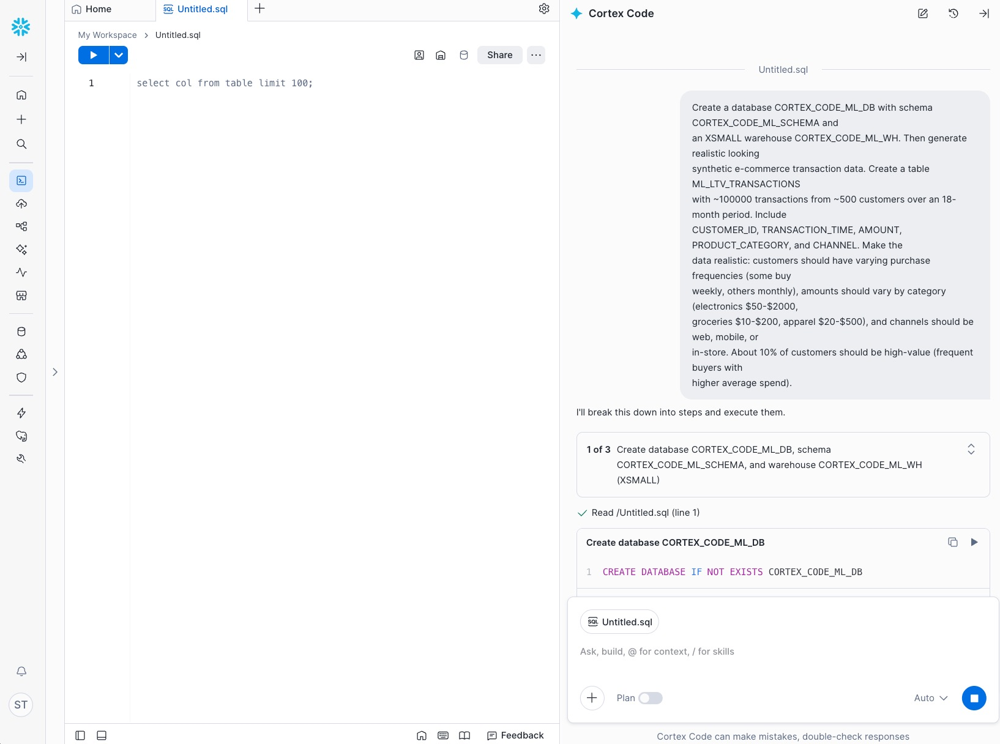
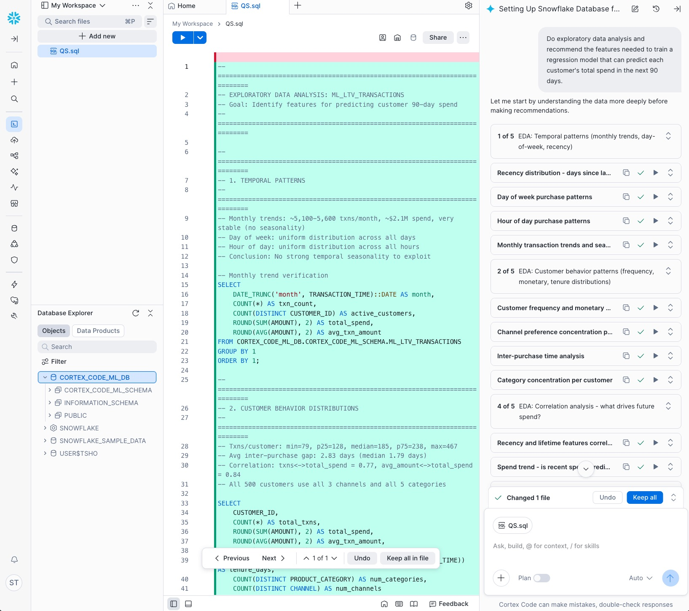
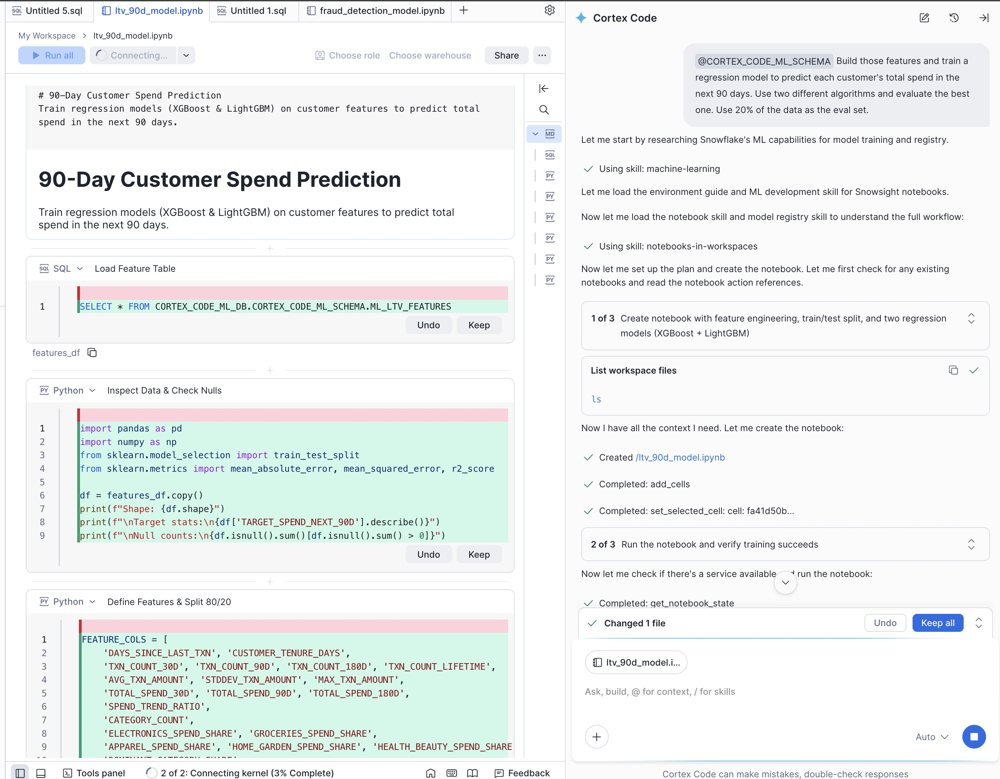
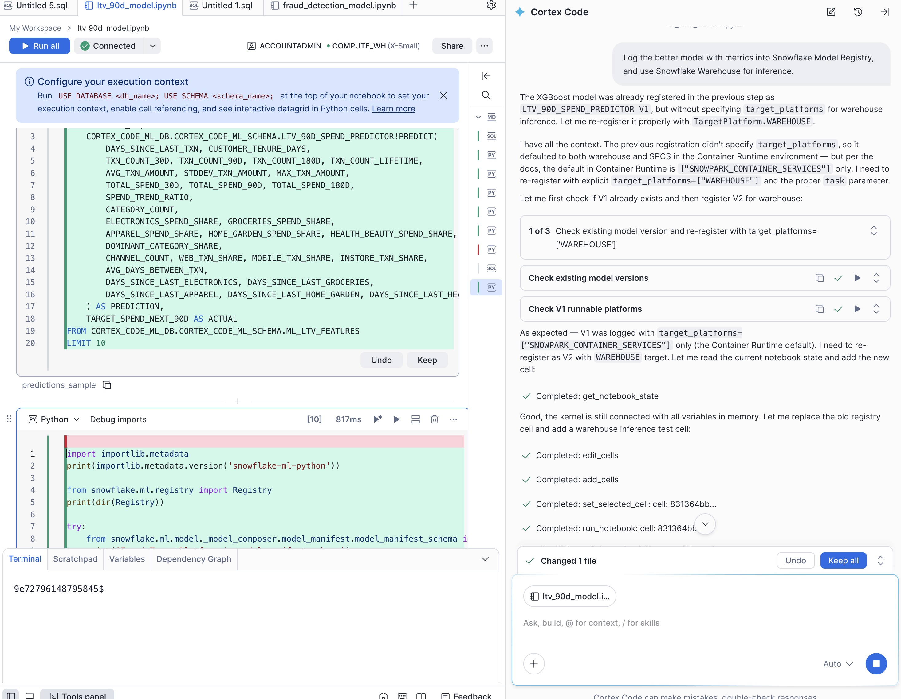
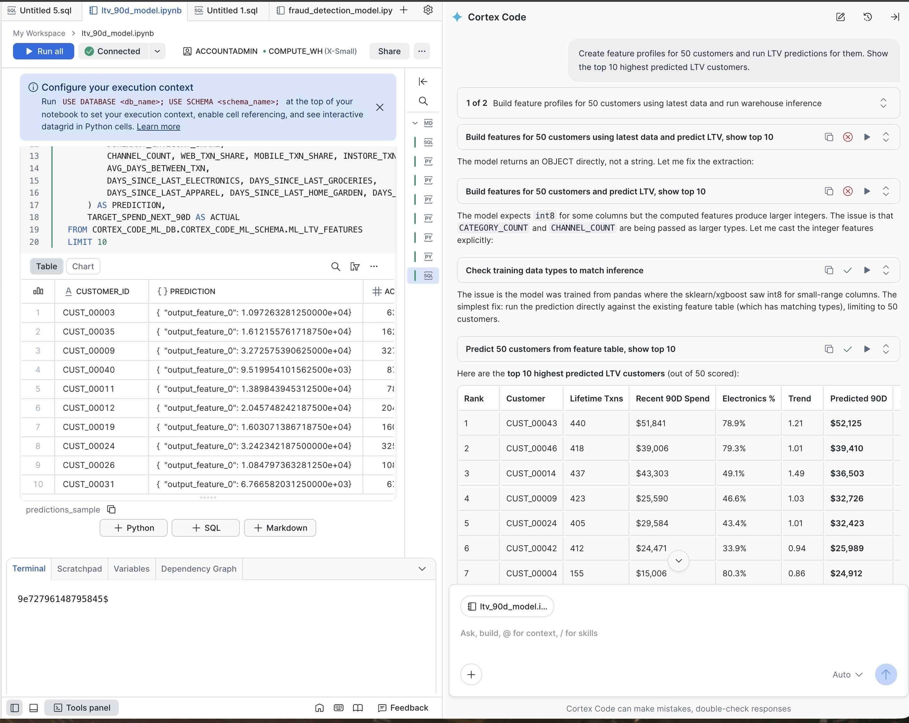

author: Yusuke Shibui, Sho Tanaka, Caleb Baechtold, Lucy Zhu
id: build-your-first-ml-model-in-snowflake-with-agentic-ml-ja
summary: Learn how to build an end-to-end customer LTV prediction model — from EDA to batch or real-time inference — using CoCo and natural language prompts in Snowflake ML
categories: snowflake-site:taxonomy/solution-center/certification/quickstart, snowflake-site:taxonomy/product/ai
language: ja
environments: web
status: Published 
feedback link: https://github.com/Snowflake-Labs/sfguides/issues
tags: Getting Started, Data Science, Machine Learning, Snowflake ML, Model Registry, SPCS, CoCo, LTV, Regression

# SnowflakeのAgentic MLで始める機械学習モデル開発
<!-- ------------------------ -->
> 🎥 **ガイド付きウォークスルーをご希望ですか？** [バーチャルハンズオンラボ](https://www.snowflake.com/en/webinars/virtual-hands-on-lab/build-your-first-agentic-ml-pipeline-with-natural-language-2026-05-28/) でご確認ください。

## 1. 概要

[Snowflake ML](http://www.snowflake.com/ml) は、Agentic ML の開発方法を変革しています。Agentic ML とは、自律的・推論ベースのシステムであり、開発者が ML パイプライン全体にわたるタスクの計画・実行にエージェントを活用できるようにするものです。このクイックスタートでは、Snowflake の AI ネイティブコーディングエージェントである [CoCo](https://www.snowflake.com/en/product/snowflake-coco/) （旧称Cortex Code）を使用し、数回のプロンプトだけで顧客生涯価値 (LTV) 予測モデルを構築・実行する方法を学びます。生データから本番予測まで、数週間ではなく数分で到達できます。CoCo は CLI として、また Snowflake の Web インターフェースである Snowsight から直接ご利用いただけます。

> **重要:** CoCo は LLM を基盤としており、非決定論的です。生成されるコードはこのガイドに示されているものと異なる場合があります。次のステップに進む前に、必ず出力を確認し、結果が期待通りであることをご確認ください。

### 学習内容
- 自然言語プロンプトを使用した現実的な合成 EC データの生成
- 会話形式での探索的データ分析とフィーチャーエンジニアリングの実施
- Snowflake 内での複数の回帰モデルのトレーニングと比較
- Snowflake Model Registry へのメトリクス付きモデルのログ
- Snowflake Warehouse でのバッチ推論の実行
- （オプション）リアルタイム推論のための Snowpark Container Services (SPCS) への REST API としてのモデルデプロイ

### 構築するもの
顧客 LTV 予測の完全なパイプライン：
- 合成 EC トランザクションデータセット（約 500 顧客、18 ヶ月間で約 100,000 件のトランザクション）
- 顧客の今後 90 日間の総支出を予測する訓練済み回帰モデル
- 評価メトリクス付きで Snowflake Model Registry に登録されたモデル
- Snowflake Warehouse 経由のバッチ推論予測
- （オプション）レイテンシプロファイリング付きの SPCS 上のリアルタイム推論 REST エンドポイント

### 前提条件
- Snowflake の 30 日間[無料トライアル](https://signup.snowflake.com/?utm_source=snowflake-devrel&utm_medium=developer-guides&utm_cta=developer-guides)へのサインアップ。`ACCOUNTADMIN` ロール、またはデータベース・スキーマ・テーブル・モデルの作成権限を持つロール
- [CoCo in Snowsight](https://docs.snowflake.com/en/user-guide/cortex-code/cortex-code-snowsight)（ローカルインストール不要）
- 専用の Snowflake Warehouse
- （SPCS 利用時、オプション）Snowpark Container Services 用に設定されたコンピュートプール — [公式セットアップガイド](https://docs.snowflake.com/en/developer-guide/snowpark-container-services/tutorials/common-setup)をご参照ください
- 基本的な ML の概念（トレーニング、評価、推論）に関する知識

> **CoCo CLI をご利用ですか？** 同じプロンプトはどちらのインターフェースでも動作します。CLI 固有のセットアップとターミナル出力の例については、[CoCo CLI ウォークスルー](#cortex-code-cli-walkthrough)をご参照ください。

<!-- ------------------------ -->
## 2. セットアップ

### CoCo in Snowsight

[CoCo](https://docs.snowflake.com/en/user-guide/cortex-code/cortex-code) は Snowflake に組み込まれた AI エージェントであり、データエンジニアリング・アナリティクス・ML・エージェント構築タスク向けに設計されています。Snowflake 環境内で自律的に動作し、RBAC・スキーマ・プラットフォームのベストプラクティスに関する深い知識を活用します。

1. サイドバーから「Projects」>「Workspaces」をクリックして Workspace Notebook を開き、「My Workspace」パネルで「+ Add new」>「Notebook」をクリックします。

2. ノートブックが読み込まれたら、Snowsight の右下隅にある CoCo を確認します。

> 注意: CoCo は環境を認識しており、Workspace Notebook で使用すると、ノートブックが提供するすべてのツールにアクセスできるため、最良の結果が得られます。関連する場合、生成されたコードはノートブックに挿入され、自動的に実行されます。


これで、CoCo にプロンプトを入力して ML パイプラインの構築を開始する準備が整いました。

<!-- ------------------------ -->
## 3. 合成データの生成

まず、CoCo を使用してデータベースオブジェクトを作成し、合成 EC トランザクションデータを生成します。

### プロンプト

```
Generate realistic looking synthetic data in database COCO_DB and schema COCO_SCHEMA 
(create if it doesn't exist). Create a table ML_LTV_TRANSACTIONS
with ~100000 transactions from ~500 customers over an 18-month period. Include
CUSTOMER_ID, TRANSACTION_TIME, AMOUNT, PRODUCT_CATEGORY, and CHANNEL. Make the
data realistic: customers should have varying purchase frequencies (some buy
weekly, others monthly), amounts should vary by category (electronics $50-$2000,
groceries $10-$200, apparel $20-$500), and channels should be web, mobile, or
in-store. About 10% of customers should be high-value (frequent buyers with
higher average spend).
```

### 生成される内容

CoCo のチャットパネルにプロンプトを入力します。CoCo はリクエストを分析し、複数ステップのプランに分解します。



CoCo はデータベースオブジェクトの作成とテーブルへのデータ投入のための SQL または Python コードを生成し、自動的に実行します。新しい Notebook セルにコードと結果が表示されます。


> 注意: LLM によるテキスト生成の固有のランダム性により、結果はこのチュートリアルに示されているものと若干異なる場合があります。

データが正しく生成されたことを確認するには、Snowsight ワークシートで以下の SQL を実行してください。

> 注意: `COCO_DB.COCO_SCHEMA` はデータベースとスキーマの例です。ご利用の環境で CoCo が別のデータベースまたはスキーマにデータを保存した場合は、クエリを実行する前にこれらの値を更新してください。

```sql
SELECT * FROM COCO_DB.COCO_SCHEMA.ML_LTV_TRANSACTIONS LIMIT 10;
```

`CUSTOMER_ID`、`TRANSACTION_TIME`、`AMOUNT`、`PRODUCT_CATEGORY`、`CHANNEL` などのカラムを持つ 10 行が表示されるはずです。

> **代替手段:** 合成データを生成する代わりに事前構築済みのデータセットを読み込む場合は、このガイドの末尾にある[付録 A — S3 からの事前構築済みデータセットの読み込み](#appendix-a-load-pre-built-dataset-from-s3)をご参照ください。

<!-- ------------------------ -->
## 4. データの探索 (EDA)

モデルをトレーニングする前に、顧客生涯価値を予測するための適切なフィーチャーを特定するためにパターンを分析します。

### プロンプト

```
Do exploratory data analysis and recommend the features needed to train a regression model that can predict each customer's total spend in the next 90 days.
```

### 生成される内容

CoCo はまずテーブルを確認してサマリー（行数・顧客数・日付範囲・カテゴリ内訳）を表示し、その後、購買頻度・支出分布・最新性パターン・カテゴリ嗜好などについて複数のステップにわたって詳細な分析を実施し、推奨フィーチャーとともに主要な所見をまとめます。

テーブルが空（または存在しない）場合は、[付録 A](#appendix-a-load-pre-built-dataset-from-s3) を参照して事前構築済みデータセットを読み込み、再試行してください。



この例では、CoCo は購買頻度トレンド・顧客セグメント別の平均注文額・最終購入からの経過日数・好みの商品カテゴリなどのシグナルを特定します。これらのインサイトは、total_transactions・avg_amount・days_since_last_purchase・favorite_category・channel_distribution などのフィーチャーに変換されます。

EDA ステップでは通常、以下のようなパターンが明らかになります。
- 高価値顧客はより頻繁に購入し、平均注文額が高い
- 最終購入からの経過日数は将来の支出の強力な予測因子である
- 特定の商品カテゴリは高い生涯価値と相関している
- チャネル嗜好（web vs. モバイル vs. 店舗）は顧客セグメントによって異なる

<!-- ------------------------ -->
## 5. モデルのトレーニング

フィーチャーが特定できたので、回帰モデルをトレーニングできます。XGBoost と Random Forest は、このような表形式の予測タスクに優れた選択肢です。

### プロンプト

```
Build those features and train a regression model to predict each customer's total spend in the next 90 days. Use two different algorithms, XGBoost and Random Forest, and evaluate the best one. Use 20% of the data as the eval set.
```

### 生成される内容

CoCo は通常、Notebook を作成し、フィーチャーエンジニアリングのステップを生成し、2 つのモデルをトレーニングして、最良のパフォーマンスを選択できるよう評価メトリクスをレポートします。



この例では、CoCo はフィーチャーエンジニアリング（トランザクション履歴からの顧客ごとのメトリクスの集計）用の Python を生成し、トレーニング・評価ステップを実行し、最良のモデルを選択できるよう比較セクション（RMSE・MAE・R-squared などのメトリクス）を生成します。

CoCo は以下を実行します。
1. EDA の推奨内容に基づいてフィーチャーをエンジニアリングする（トレーニングウィンドウでの顧客ごとの集計）
2. データをトレーニング（80%）と評価（20%）のセットに分割する
3. 2 つの異なる回帰アルゴリズム（XGBoost と Random Forest）をトレーニングする
4. RMSE・MAE・R-squared などのメトリクスを使用してパフォーマンスを比較する
5. パフォーマンスの優れたモデルを推奨する

次のステップに進む前に、評価メトリクスを確認してモデルが要件を満たしていることをご確認ください。

<!-- ------------------------ -->
## 6. Model Registry へのログと推論の実行

より良いモデルを Snowflake Model Registry に登録し、バッチ推論を実行します。

### プロンプト

```
Log the better model with metrics into Snowflake Model Registry, and use Snowflake Warehouse for inference.
```

CoCo は、モデルメトリクス・スキーマ推論用のサンプル入力・ターゲットプラットフォームを `WAREHOUSE` に設定した適切なパラメータで `log_model()` の呼び出しを処理します。



続いて予測を生成します。

### プロンプト

```
Create feature profiles for 50 customers and run LTV predictions for them. Show the top 10 highest predicted LTV customers.
```

CoCo は顧客のフィーチャープロファイルを生成し、Snowflake Warehouse 経由で推論を実行し、各顧客の予測 90 日間支出（予測 LTV が高い順）を表示します。



> **オプション:** 代わりにモデルを SPCS のリアルタイム REST エンドポイントとしてデプロイする場合は、このガイドの末尾にある付録 B — SPCS でのリアルタイム推論をご参照ください。

<!-- ------------------------ -->
## 7. エラーのデバッグと回復

自然言語コーディングセッション中にエラーは避けられません。CoCo の優れた点は、状況・環境・エラーを評価して問題を自動的に修正する自己訂正能力です。

### よくあるシナリオ

**モデル登録エラー**

`log_model()` がパラメータの問題（ターゲットプラットフォームの不一致など）により失敗した場合、CoCo はエラーを診断し、修正されたパラメータで自動的にモデルを再登録します。

**Notebook 実行の問題**

インポートの欠落やデータ型の不一致によってセルが失敗した場合、CoCo は問題を検出し、コードを調整して再実行します。

**フィーチャーエンジニアリングのエラー**

フィーチャーカラムが欠落しているか SQL ビューが失敗した場合、CoCo はスキーマを調査し、根本原因を特定して、フィーチャーエンジニアリングのステップを再生成します。

### ベストプラクティス

1. 初期セットアップには `ACCOUNTADMIN` を使用し、その後専用ロールを作成する
2. SPCS デプロイ中はコンピュートプールのリソースを監視する
3. CoCo が修正を行う際の説明を確認する
4. ビジュアライゼーションを含むインタラクティブな体験には Snowsight Notebook 環境を使用する


<!-- ------------------------ -->
## 8. まとめとリソース

おめでとうございます！[Snowflake ML](http://www.snowflake.com/ml) での数回の自然言語プロンプトだけを使用して、顧客 LTV 予測モデルを完全に構築することができました。

### 構築したもの


### 学習したこと
- 自然言語プロンプトを使用した現実的な合成 EC データの生成
- 自動フィーチャー推奨による包括的な探索的データ分析の実施
- LTV 予測のための複数の回帰モデルのトレーニングと比較
- Snowflake Model Registry へのメトリクス付きモデルのログ
- Snowflake Warehouse でのバッチ推論の実行

### 関連リソース

Web ページ：
- [Snowflake ML](http://www.snowflake.com/ml) - Agentic ML を先導とする、開発・MLOps・推論のための統合機能セット
- [Snowflake Notebooks](https://www.snowflake.com/en/product/features/notebooks/) - Snowflake Workspaces の Jupyter ベースのノートブック
- [CoCo](https://www.snowflake.com/en/product/snowflake-coco/) - ML の生産性を向上させる Snowflake の AI ネイティブコーディングエージェント

技術ドキュメント：
- [Snowflake ML Documentation](https://docs.snowflake.com/en/developer-guide/snowflake-ml/overview) - Snowflake ML 公式開発者ガイド
- [Snowflake ML Quickstart](https://docs.snowflake.com/en/developer-guide/snowflake-ml/quickstart) - Snowflake ML を始めるためのハンズオンガイド
- [CoCo Documentation](https://docs.snowflake.com/en/user-guide/cortex-code/cortex-code) - CoCo 入門
- [CoCo in Snowsight](https://docs.snowflake.com/en/user-guide/cortex-code/cortex-code-snowsight) - ブラウザベースの体験
- [CoCo CLI](https://docs.snowflake.com/en/user-guide/cortex-code/cortex-code-cli) - コマンドラインの体験
- [Snowflake Model Registry](https://docs.snowflake.com/en/developer-guide/snowflake-ml/model-registry/overview) - ML モデルの登録・バージョン管理・デプロイ
- [Snowpark Container Services](https://docs.snowflake.com/en/developer-guide/snowpark-container-services/overview) - コンテナ化されたワークロードのデプロイと管理

<!-- ------------------------ -->
## オプション A - クリーンアップ

Snowflake のクレジット消費を避けるために、このガイドで作成したリソースをクリーンアップできます。**CoCo プロンプト**と**手動 SQL** の 2 つのアプローチがあります。

このクイックスタートを 1 回のセッションで完了し、ご利用の環境に他のデータが含まれていない場合は、「A-1 CoCo」プロンプトを使用してすばやくクリーンアップできます。

このクイックスタートを複数日にわたって実施した場合、またはご利用の環境にこのガイドとは無関係なリソースが含まれている場合は、意図したオブジェクトのみを削除するために「A-2 手動 SQL」アプローチを使用してください。

### A-1. CoCo

> 注意: このプロンプトは、データベースやモデルなどのオブジェクトが作成された同じ CoCo セッション内で最も効果的です。前のセッション（例：別の日）のリソースをクリーンアップする場合、またはご利用の環境にこのクイックスタートとは無関係なオブジェクトが含まれている場合は、より正確な制御のために下記の手動 SQL アプローチを使用してください。


```
Drop Database and model that we created earlier in this session
```

CoCo は各リソースに対応する DROP ステートメントを生成して実行します。

### A-2. 手動 SQL

手動でクリーンアップを実行する場合：

> 注意: `COCO_DB.COCO_SCHEMA` はデータベースとスキーマの例であり、`COCO_WH` はウェアハウス名の例です。ご利用の環境で CoCo が別のデータベースにデータを保存したか、別のウェアハウスを作成した場合は、クエリを実行する前にこれらの値を更新してください。


```sql
-- データベースとその中のすべてのオブジェクト（テーブル、スキーマ、ステージなど）を削除する
DROP DATABASE IF EXISTS COCO_DB;

-- Model Registry からモデルを削除する
DROP MODEL IF EXISTS COCO_DB.COCO_SCHEMA.ML_LTV_PREDICTOR;

-- ウェアハウスを削除する
DROP WAREHOUSE IF EXISTS COCO_WH;
```

> 注意: `DROP DATABASE` はその中のすべてのスキーマ・テーブル・ステージを削除します。このコマンドを実行する前に、データが不要であることをご確認ください。


<!-- ------------------------ -->
## オプション B - CoCo CLI ウォークスルー

このガイドで使用しているプロンプトはすべて、CoCo CLI でも同様に動作します。このセクションでは、CLI 固有のセットアップとターミナル出力のサンプルを示し、ターミナルセッションで期待される内容を比較できます。

### セットアップ

CLI をインストールします。

```bash
curl -LsS https://ai.snowflake.com/static/cc-scripts/install.sh | sh
```

インストール後、`cortex` を実行してセットアップウィザードに従い、Snowflake アカウントに接続します。詳細な手順については、[CoCo CLI ドキュメント](https://docs.snowflake.com/en/user-guide/cortex-code/cortex-code-cli)をご参照ください。

接続を確認します。

```
What role am I using and what databases can I access?
```

> **ヒント:** 生成されたファイルを並べて表示するには、VS Code または Cursor のターミナル内で CoCo CLI を実行してください。

> **ヒント:** テーブル名に `#` プレフィックスを付けることで（例：`#COCO_DB.COCO_SCHEMA.ML_LTV_TRANSACTIONS`）、会話を特定のオブジェクトに紐付けることができます。

### 合成データの生成 — CLI 出力

合成データ生成のプロンプトを入力すると、CoCo CLI は次のようなサマリーを表示します。

```
  Summary Statistics

  ┌───────────┬──────────┐
  │ Metric    │ Value    │
  ├───────────┼──────────┤
  │ Customers │ 500      │
  ├───────────┼──────────┤
  │ Min LTV   │ $12,930  │
  ├───────────┼──────────┤
  │ P25       │ $36,745  │
  ├───────────┼──────────┤
  │ Median    │ $54,617  │
  ├───────────┼──────────┤
  │ Mean      │ $76,769  │
  ├───────────┼──────────┤
  │ P75       │ $86,724  │
  ├───────────┼──────────┤
  │ Max       │ $495,857 │
  ├───────────┼──────────┤
  │ Std Dev   │ $67,972  │
  └───────────┴──────────┘

  Distribution (Histogram)

    LTV Range           Customers
    $12,930 - $36,868   126  █████████████████████████████████████
    $37,086 - $61,126   170  ██████████████████████████████████████████████████
    $61,382 - $84,439    74  ██████████████████████
    $85,925 - $109,095   35  ██████████
    $110,606 - $133,179  26  ████████
    $134,850 - $157,594  18  █████
    $158,039 - $181,760  19  ██████
    $182,181 - $206,059   7  ██
    $209,265 - $241,987  10  ███
    $257,600 - $283,419   5  █
    $345,815 - $387,939   7  ██
    $410,296 - $495,857   3  █
```

### データの探索 (EDA) — CLI 出力

CoCo CLI は組み込みの ML スキルを読み込み、ローカルの Python 環境を検出し、段階的に EDA を実行します。

```
> Do exploratory data analysis and recommend the features needed to train a regression model that can predict each customer's total spend in the next 90 days.

✓  SKILL  machine-learning

✓  READ  cli-environment.md 194 lines

✓  READ  ml-development/SKILL.md 279 lines

* Let me set up the environment and build a comprehensive EDA script.

✓  BASH  which uv
  └─ /Users/shtanaka/.local/bin/uv

✓  BASH  cortex env detect
  └─ {"directory": "/Users/shtanaka/project/sfquickstarts", ...}

✓  BASH  uv venv /Users/shtanaka/project/sfquickstarts/.venv --python 3.10 2>&1
  └─ Creating virtual environment at: .venv

✓  BASH  uv pip install snowflake-ml-python xgboost 

✓  BASH  python session_helper.py  (connectivity check)
  └─ ✅ Connected successfully!

✓  WRITE  /Users/shtanaka/project/sfquickstarts/eda_ltv.py +330

✓  BASH  python eda_ltv.py
  └─ ... (99 more lines)

✓  READ  eda_output/09_feature_importance_rf.png
✓  READ  eda_output/04_correlation_with_target.png
✓  READ  eda_output/01_target_distribution.png
```

EDA 結果のサマリー：

```
  EDA Results and Feature Recommendations

  Dataset Overview
  • 96,264 transactions, 500 customers, 18 months (2024-07-01 to 2025-12-30)
  • Zero nulls across all 5 columns
  • Feature/label split: 80,491 rows for features (before Oct 1, 2025),
    15,773 rows for the 90-day target window

  Key EDA Findings

  Target variable (90-day spend):
  • Right-skewed: median $8,767 vs mean $12,595
  • Range: $1,265 to $85,492

  Correlation analysis reveals two dominant signal families:
  1. Monetary features (r = 0.73–0.93): TOTAL_SPEND, SPEND_90D, STDDEV_TXN_AMOUNT, AVG_TXN_AMOUNT
  2. Frequency features (r = 0.58–0.72): TXN_COUNT, TXN_COUNT_90D, TXN_COUNT_30D

  Random Forest baseline: 5-fold CV R² = 0.646

  Recommended Features — Tier 1 (Strongest Predictors)

  ┌───────────────────┬─────────────┬───────────────┐
  │ Feature           │ Correlation │ RF Importance │
  ├───────────────────┼─────────────┼───────────────┤
  │ TOTAL_SPEND       │ 0.93        │ 0.741         │
  ├───────────────────┼─────────────┼───────────────┤
  │ SPEND_90D         │ 0.88        │ 0.041         │
  ├───────────────────┼─────────────┼───────────────┤
  │ STDDEV_TXN_AMOUNT │ 0.81        │ 0.054         │
  ├───────────────────┼─────────────┼───────────────┤
  │ AVG_TXN_AMOUNT    │ 0.79        │ 0.021         │
  ├───────────────────┼─────────────┼───────────────┤
  │ SPEND_30D         │ 0.78        │ 0.004         │
  └───────────────────┴─────────────┴───────────────┘
```

### モデルのトレーニング — CLI 出力

```
> Build those features and train a regression model to predict each customer's
  total spend in the next 90 days. Use two different algorithms, XGBoost and
  Random Forest, and evaluate the best one. Use 20% of the data as the eval set.

✓  READ  experiment-tracking/SKILL.md 456 lines

✓  WRITE  /Users/shtanaka/project/sfquickstarts/train_ltv_model.py +358

* Script details:
  • Features: 28 features from EDA (RFM, spend windows, category/channel shares, trends)
  • Split: 80% train / 20% eval (random_state=42)
  • Model 1 — XGBoost: 500 trees, lr=0.05, early stopping at 30 rounds
  • Model 2 — Random Forest: 500 trees, max_depth=15
  • Experiment tracking: Both runs logged to LTV_90D_SPEND_PREDICTION

✓  BASH  python train_ltv_model.py
  └─ ... training complete

✓  READ  eda_output/10_actual_vs_predicted.png
✓  READ  eda_output/11_residual_distributions.png
✓  READ  eda_output/12_feature_importance_comparison.png

  Model Comparison (20% Eval Set — 100 customers)

  ┌────────┬─────────┬───────────────┬──────────────────────────┐
  │ Metric │ XGBoost │ Random Forest │ Winner                   │
  ├────────┼─────────┼───────────────┼──────────────────────────┤
  │ R²     │ 0.8088  │ 0.7872        │ XGBoost                  │
  ├────────┼─────────┼───────────────┼──────────────────────────┤
  │ RMSE   │ $3,782  │ $3,989        │ XGBoost                  │
  ├────────┼─────────┼───────────────┼──────────────────────────┤
  │ MAE    │ $2,791  │ $2,787        │ Random Forest (marginal) │
  ├────────┼─────────┼───────────────┼──────────────────────────┤
  │ MAPE   │ 37.86%  │ 32.86%        │ Random Forest            │
  └────────┴─────────┴───────────────┴──────────────────────────┘

  Best Model: XGBoost (by R²)
```

<!-- ------------------------ -->
## 付録 A — S3 からの事前構築済みデータセットの読み込み

CoCo で合成データを生成する代わりに事前構築済みのデータセットを読み込む場合は、[Snowsight SQL ワークシート](https://docs.snowflake.com/en/user-guide/ui-snowsight-worksheets-gs#create-worksheets-from-a-sql-file)で以下の SQL を実行するか、CoCo CLI にプロンプトとして貼り付けてください。[setup.sql](https://github.com/Snowflake-Labs/cortex-code-samples/blob/main/data-science-ml/setup.sql) をダウンロードすることもできます。

```sql
USE ROLE ACCOUNTADMIN;

CREATE DATABASE IF NOT EXISTS COCO_DB;
CREATE SCHEMA IF NOT EXISTS COCO_DB.COCO_SCHEMA;
CREATE WAREHOUSE IF NOT EXISTS COCO_WH
  WAREHOUSE_SIZE = 'XSMALL'
  AUTO_SUSPEND = 60
  AUTO_RESUME = TRUE;

USE DATABASE COCO_DB;
USE SCHEMA COCO_SCHEMA;
USE WAREHOUSE COCO_WH;

CREATE OR REPLACE FILE FORMAT ml_csvformat
  SKIP_HEADER = 1
  FIELD_OPTIONALLY_ENCLOSED_BY = '"'
  TYPE = 'CSV';

CREATE OR REPLACE STAGE ml_ltv_data_stage
  FILE_FORMAT = ml_csvformat
  URL = 's3://sfquickstarts/sfguide_getting_started_with_cortex_code_for_ds_ml/ltv_transactions/';

CREATE OR REPLACE TABLE ML_LTV_TRANSACTIONS (
  CUSTOMER_ID VARCHAR(16777216),
  TRANSACTION_TIME TIMESTAMP_NTZ(9),
  AMOUNT NUMBER(12,2),
  PRODUCT_CATEGORY VARCHAR(15),
  CHANNEL VARCHAR(8)
);

COPY INTO ML_LTV_TRANSACTIONS
  FROM @ml_ltv_data_stage;

SELECT 'Setup complete — ML_LTV_TRANSACTIONS loaded.' AS STATUS;
```

SQL を実行した後、[データの探索](#explore-the-data-eda)ステップに戻ってください。

<!-- ------------------------ -->
## 付録 B — SPCS でのリアルタイム推論

Snowflake Warehouse でのバッチ推論の代替として、Snowpark Container Services (SPCS) 上の REST エンドポイントとしてモデルをデプロイし、リアルタイム推論を行うことができます。

> **前提条件:** Snowpark Container Services 用に設定されたコンピュートプール。

### プロンプト

```
Log the better model with metrics into Snowflake Model Registry, and use SPCS to create a REST endpoint for online inference.
```

CoCo は `log_model()` の呼び出しをターゲットプラットフォームを `SNOWPARK_CONTAINER_SERVICES` に設定して処理し、リアルタイム推論のための SPCS サービスとエンドポイントを作成します。

続いてレイテンシプロファイリングでエンドポイントをテストします。

### プロンプト

```
Create feature profiles for 50 customers and run LTV predictions using the REST API for online inference running on SPCS. Show the top 10 highest predicted LTV customers and a latency profile (p50, p95, p99).
```

CoCo は SPCS REST エンドポイントに HTTP リクエストを送信し、以下を含む結果を表示します。
- 各顧客プロファイルの予測 90 日間支出
- リクエストごとのレイテンシ測定値
- デプロイメントのリアルタイムパフォーマンス特性を理解するためのレイテンシプロファイルのサマリー（p50・p95・p99）
