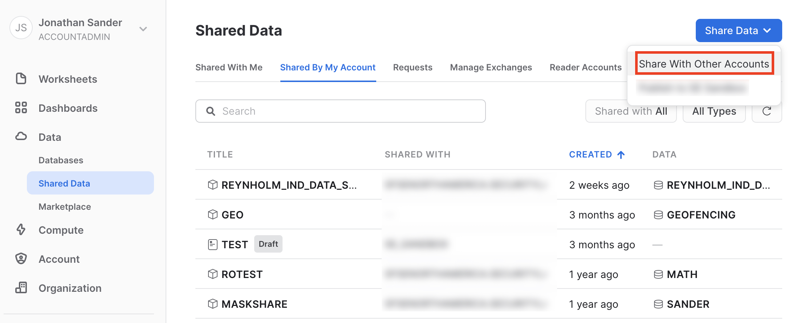
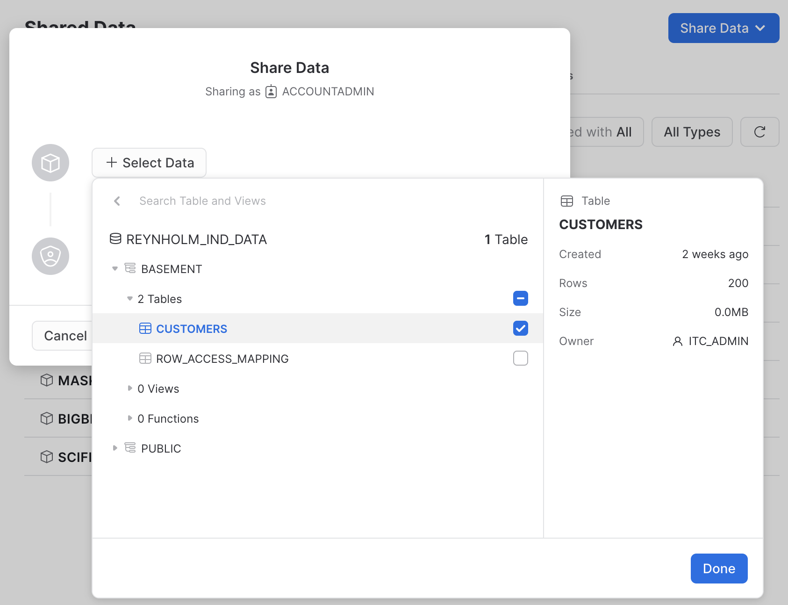
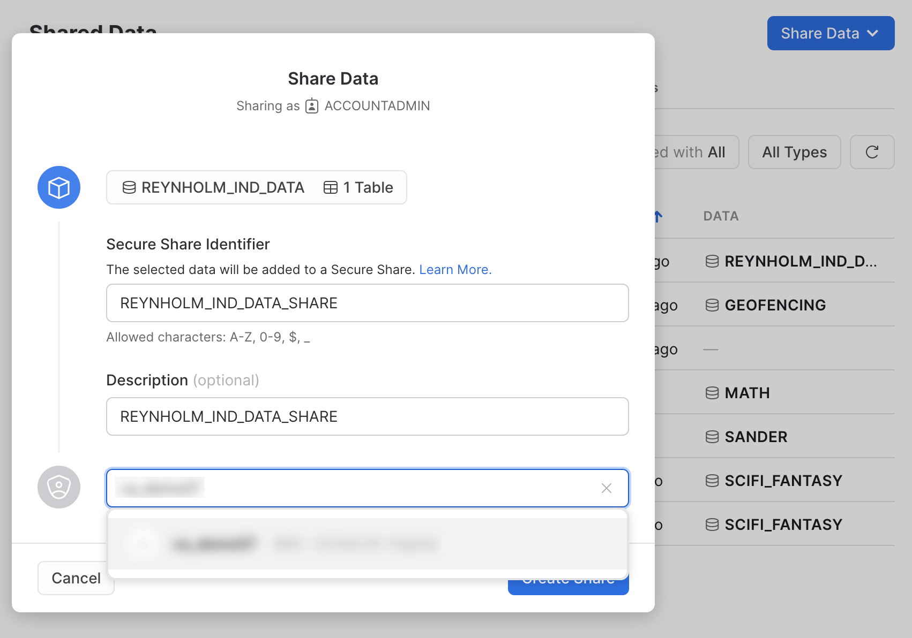
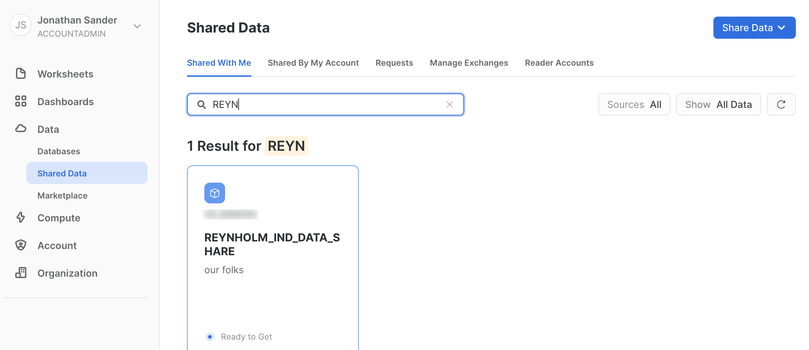
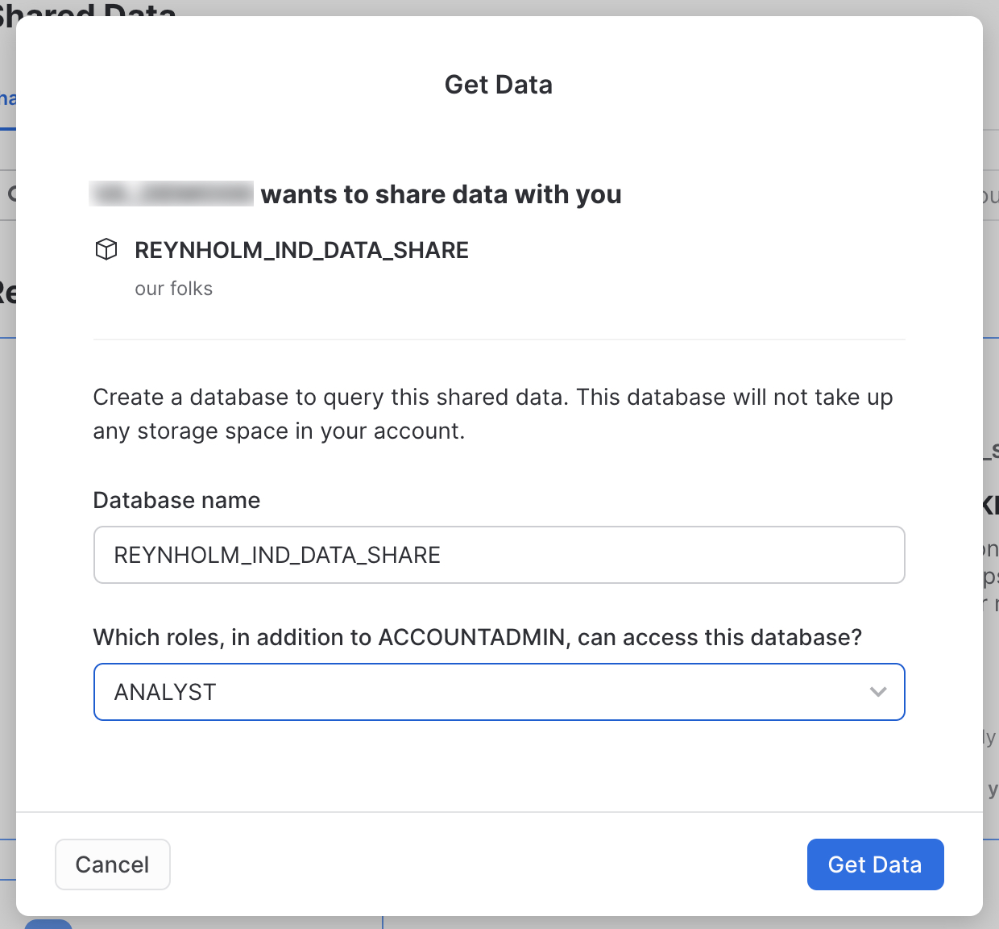

author: sanderiam
id: build_2021_journey_to_processing_pii
summary: This is the code accompanying the "Journey to Processing PII in the Data Cloud" session at BUILD 2021
categories: Data Governance, Security, Compliance, Getting Started
environments: web
status: Draft
feedback link: https://github.com/Snowflake-Labs/sfguides/issues
tags: Getting Started, Data Governance, Security, Compliance, PII, Sensitive Data, Masking, Row Level Security

# BUILD 2021 - The Journey to Processing PII in the Data Cloud
<!-- ------------------------ -->
## Overview 
Duration: 1

This is the code companion to the "Journey to Processing PII in the Data Cloud" session from [Snowflake BUILD 2021](https://www.snowflake.com/build/). That session was itself a companion to [a blog post by the same name](https://www.snowflake.com/blog/the-journey-to-processing-pii-in-the-data-cloud/) which had a business concept focus. As promised in the BUILD session, this code walkthrough is meant to show you how the features Snowflake offers can help you achieve your governance, security, and compliance goals for protecting PII and other sensitive information while leveraging the power of the Data Cloud.

### Prerequisites
- Basic SQL Knowledge

### What You'll Need 
- A Snowflake Account with at least Enterprise Edition features
- Access to the Snowflake out of the box sample data
- A second Enterprise Edition Snowflake Account if you wish to follow along with the policy enforcement through Data Sharing example
- At the time of this publication two of the features discussed were in preview mode, and you will need to have these activated in both your Snowflake Accounts if you wish to see those working live

### What You'll Learn
- How to use Snowflake [RBAC and DAC](https://docs.snowflake.com/en/user-guide/security-access-control-overview.html)
- How to use Snowflake [Column Level Security](https://docs.snowflake.com/en/user-guide/security-column.html)
- How to use Snowflake [Row Access Policy](https://docs.snowflake.com/en/user-guide/security-row.html)
- How policies apply across [Data Sharing](https://docs.snowflake.com/en/user-guide/data-sharing-intro.html)
- A few bonus facts about Snowflake's [JSON processing](https://docs.snowflake.com/en/user-guide/json-basics-tutorial.html)

### What You'll Build
- A table derived from sample data containing fake (but realistic) PII
- RBAC protections for that table
- [Dynamic Data Masking](https://docs.snowflake.com/en/user-guide/security-column-ddm.html) policies to protect the PII table
- Row Access Policies to protect the PII table


<!-- ------------------------ -->
## Create your users and roles
Duration: 5

First we'll create a set of users and roles to use for the rest of the demo. 

Negative
: You MUST change the passwords assigned to each user. DO NOT use the samples given here. If you wish, you can remove the `password='usesomethinggoodthiswontwork' must_change_password = true` part of these SQL statements and skip to the key pair instructions below.

```sql
-- create users are roles for the demo
use role useradmin;
create role itc_admin;
create role marketing;
create role it;
create role infosec;
create role executive;

create user "roy@itcrowd"
    default_warehouse=demo_wh default_role=it        password='usesomethinggoodthiswontwork' must_change_password = true;
create user "moss@itcrowd"
    default_warehouse=demo_wh default_role=infosec   password='usesomethinggoodthiswontwork' must_change_password = true;
create user "jen@itcrowd"
    default_warehouse=demo_wh default_role=it        password='usesomethinggoodthiswontwork' must_change_password = true;
create user "denholm@itcrowd"
    default_warehouse=demo_wh default_role=executive password='usesomethinggoodthiswontwork' must_change_password = true;
create user "douglas@itcrowd"
    default_warehouse=demo_wh default_role=marketing password='usesomethinggoodthiswontwork' must_change_password = true;
create user "richmond@itcrowd"
    default_warehouse=demo_wh default_role=itc_admin password='usesomethinggoodthiswontwork' must_change_password = true;

-- ONLY USING PASSWORDS AT ALL SINCE THIS IS A DEMO WITH DUMMY DATA!!
```

During the demo you will see these users authenticated using Key Pair Authentication using the SnowSQL CLI. You can [follow the documentation to create those key pairs](https://docs.snowflake.com/en/user-guide/key-pair-auth.html) and then associate the public keys to each user like so:

```sql
-- OPTIONAL KEY PAIR STEP
alter user "roy@itcrowd" set rsa_public_key='MIIB...';
alter user "moss@itcrowd" set rsa_public_key='MIIB...';
alter user "jen@itcrowd" set rsa_public_key='MIIB...';
alter user "denholm@itcrowd" set rsa_public_key='MIIB...';
alter user "douglas@itcrowd" set rsa_public_key='MIIB...';
alter user "richmond@itcrowd" set rsa_public_key='MIIB...';
```

Take a few minutes to make sure you can authenticate as these users before moving on to the next step.

<!-- ------------------------ -->
## Grants roles and create database
Duration: 3

Here we finish the set up by granting roles to the users we've created, access to a warehouse to those roles, and creating a database which we then hand over ownership to the admin for this fictional organization.

```sql
use role useradmin;
grant role itc_admin to user "richmond@itcrowd";
grant role marketing to user "douglas@itcrowd";
grant role it to user "roy@itcrowd";
grant role it to user "moss@itcrowd";
grant role infosec to user "moss@itcrowd";
grant role it to user "jen@itcrowd";
grant role executive to user "denholm@itcrowd";

use role <ROLE_THAT_OWNS_THE_WAREHOUSE>;
grant usage on warehouse <WAREHOUSE_YOU_WILL_USE> to role itc_admin;
grant usage on warehouse <WAREHOUSE_YOU_WILL_USE> to role marketing;
grant usage on warehouse <WAREHOUSE_YOU_WILL_USE> to role it;
grant usage on warehouse <WAREHOUSE_YOU_WILL_USE> to role executive;
grant usage on warehouse <WAREHOUSE_YOU_WILL_USE> to role infosec;

-- create objects to use as the demo objects
use role sysadmin;
create database REYNHOLM_IND_DATA;
grant ownership on database REYNHOLM_IND_DATA to role itc_admin;
```

NOTE: If for some reason you're unable to create the users at all, then in this step grant these roles to your user and when the demo switches between users you will do `use <ROLE>;` statements instead to switch to the correct role. The code blocks will indicate the roles as we go through.

<!-- ------------------------ -->
## Create table with fake but realistic PII and grant rights to it
Duration: 3

Here we grab 200 rows of fake but realistic PII from the sample data in the TPCDS testing set to use for our walkthrough. Also note that the `C_BIRTH_COUNTRY` and `OPTIN` columns will be populated at random with one of three values.

```sql
-- start doing this as richmond@itcrowd or another user with itc_admin role
use role itc_admin;
create schema REYNHOLM_IND_DATA.BASEMENT WITH MANAGED ACCESS;
create table CUSTOMERS as (
    SELECT 
        a.C_SALUTATION,
        a.C_FIRST_NAME,
        a.C_LAST_NAME,
        CASE UNIFORM(1,3,RANDOM()) WHEN 1 THEN 'UK' WHEN 2 THEN 'US' ELSE 'FRANCE' END AS C_BIRTH_COUNTRY,
        a.C_EMAIL_ADDRESS,
        b.CD_GENDER,
        b.CD_CREDIT_RATING,
        CASE UNIFORM(1,3,RANDOM()) WHEN 1 THEN 'YES' WHEN 2 THEN 'NO' ELSE NULL END AS OPTIN
    FROM 
        SNOWFLAKE_SAMPLE_DATA.TPCDS_SF100TCL.CUSTOMER a,
        SNOWFLAKE_SAMPLE_DATA.TPCDS_SF100TCL.CUSTOMER_DEMOGRAPHICS b
    WHERE
        a.C_CUSTOMER_SK = b.CD_DEMO_SK and 
        a.C_SALUTATION is not null and
        a.C_FIRST_NAME is not null and
        a.C_LAST_NAME is not null and
        a.C_BIRTH_COUNTRY is not null and
        a.C_EMAIL_ADDRESS is not null and 
        b.CD_GENDER is not null and
        b.CD_CREDIT_RATING is not null
    LIMIT 200 )
;

-- grant rights to roles for the demo objects
grant usage on database REYNHOLM_IND_DATA to role itc_admin;
grant usage on database REYNHOLM_IND_DATA to role marketing;
grant usage on database REYNHOLM_IND_DATA to role it;
grant usage on database REYNHOLM_IND_DATA to role executive;
grant usage on database REYNHOLM_IND_DATA to role infosec;
grant usage on schema REYNHOLM_IND_DATA.BASEMENT to role itc_admin;
grant usage on schema REYNHOLM_IND_DATA.BASEMENT to role marketing;
grant usage on schema REYNHOLM_IND_DATA.BASEMENT to role it;
grant usage on schema REYNHOLM_IND_DATA.BASEMENT to role executive;
grant usage on schema REYNHOLM_IND_DATA.BASEMENT to role infosec;
grant select on table REYNHOLM_IND_DATA.BASEMENT.CUSTOMERS to role marketing;
grant select on table REYNHOLM_IND_DATA.BASEMENT.CUSTOMERS to role it;
grant select on table REYNHOLM_IND_DATA.BASEMENT.CUSTOMERS to role executive;

-- show that the current role can currently see the data
select * from REYNHOLM_IND_DATA.BASEMENT.CUSTOMERS limit 50;
```

<!-- ------------------------ -->
## Put policy framework in place and explore Managed Access Schema
Duration: 5

Now we start putting controls in place on the data itself. To do this, we need to give the rights to create and apply policies. Since these rights can be granted on their own to encourage separation of duties, we will have the admin who owns the data objects grant policy control to the fictional infosec group. 

```sql
-- start doing this as richmond@itcrowd or another user with itc_admin role

-- lock down the objects with column and row level security
grant CREATE ROW ACCESS POLICY on schema REYNHOLM_IND_DATA.BASEMENT to role infosec;
create table REYNHOLM_IND_DATA.BASEMENT.ROW_ACCESS_MAPPING (
  role_name varchar,
  national_letter varchar,
  allowed varchar
);
grant ownership on table REYNHOLM_IND_DATA.BASEMENT.ROW_ACCESS_MAPPING to role infosec;
grant create masking policy on schema REYNHOLM_IND_DATA.BASEMENT to role infosec;
```

Since we protected the schema itself with managed access, we will need to grant rights to that table using elevated rights. In the demo, we first try to grant the `OWNERSHIP` right, but that is blocked. For completeness, this is the code to see that block happen.

```sql
-- this is done with your user with elevated rights
use role securityadmin;
grant ownership on table REYNHOLM_IND_DATA.BASEMENT.ROW_ACCESS_MAPPING to role infosec;
-- NOPE, blocked by Managed Access Schema
```

Instead of granting `OWNERSHIP` rights, we will instead grant `SELECT` and `INSERT` which are all that is needed. Forcing inly the grants of the required rights is the main point of using these managed access schemas.

```sql
grant select on table REYNHOLM_IND_DATA.BASEMENT.ROW_ACCESS_MAPPING to role infosec;
grant insert on table REYNHOLM_IND_DATA.BASEMENT.ROW_ACCESS_MAPPING to role infosec;
```

<!-- ------------------------ -->
## Build and apply row access policy 
Duration: 5

The first control will apply is a row access policy to ensure only authorized people get any information at all. The most common form this policy takes is a policy that reads from a table where the rules are maintained - a mapping table. 

```sql
-- start doing this as moss@itcrowd or another user with infosec role
use role infosec;
insert into REYNHOLM_IND_DATA.BASEMENT.ROW_ACCESS_MAPPING
  values
  ('ACCOUTADMIN','','FALSE'),
  ('ITC_ADMIN','','FALSE'),
  ('MARKETING','UK','TRUE'),
  ('IT','US','TRUE'),
  ('INFOSEC','','FALSE'),
  ('EXECUTIVE','FRANCE','TRUE');

use role infosec;
create or replace row access policy REYNHOLM_IND_DATA.BASEMENT.makes_no_sense as (C_BIRTH_COUNTRY varchar) returns boolean ->
  case
      -- check for full read access
      when exists ( 
            select 1 from REYNHOLM_IND_DATA.BASEMENT.ROW_ACCESS_MAPPING
              where role_name = current_role()
                and C_BIRTH_COUNTRY like national_letter
                and allowed = 'TRUE'
          ) then true
      -- control for the share
      when (
          invoker_share() in ('REYNHOLM_IND_DATA_SHARE')
          and C_BIRTH_COUNTRY='UK'
          ) then true
      -- always default deny
      else false
  end
;

-- granting apply rights won't work with managed access schema
--grant apply on row access policy REYNHOLM_IND_DATA.BASEMENT.makes_no_sense to role itc_admin;
```

Now we grant the rights to apply this policy to the admin for the data set. It's normal for the security and governance folks to maintain the policy logic, while the people closer to the data apply the policies since they are aware of in which tables the data which needs protecting lives. Of course, this is even better when automated through governance and security solutions that takes the human element out entirely.

```sql
use role securityadmin;
grant apply on row access policy REYNHOLM_IND_DATA.BASEMENT.makes_no_sense to role itc_admin;
```

The admin now applies the policy to the table.

```sql
-- start doing this as richmond@itcrowd or another user with itc_admin role
use role ITC_ADMIN;
alter table REYNHOLM_IND_DATA.BASEMENT.CUSTOMERS add row access policy REYNHOLM_IND_DATA.BASEMENT.makes_no_sense on (C_BIRTH_COUNTRY);
--alter table REYNHOLM_IND_DATA.BASEMENT.CUSTOMERS drop row access policy REYNHOLM_IND_DATA.BASEMENT.makes_no_sense;
```

Finally, we use a marketing persona to check if the policy has the desired effects. 

```sql
-- start doing this as douglas@itcrowd or another user with marketing role
use role marketing;
select * from REYNHOLM_IND_DATA.BASEMENT.CUSTOMERS limit 50;
-- study the results returned to see the effects of the row access policy
```

<!-- ------------------------ -->
## Build and apply column level security to achieve dynamic data masking
Duration: 5

Now we will lock down things at the column level. In this step, we will use conditional masking which is a preview feature at the time of this writing. If this feature is not activated in your Snowflake account, you can use the alternate version of this policy which masks the column values completely. 

```sql
-- start doing this as moss@itcrowd or another user with infosec role
use role infosec;

-- conditional masking version
create masking policy REYNHOLM_IND_DATA.BASEMENT.hide_optouts as
(col_value varchar, optin string) returns varchar ->
  case
    when optin = 'YES' then col_value
    else '***MASKED***'
  end;
  
-- full column masking version, always masks
create masking policy REYNHOLM_IND_DATA.BASEMENT.hide_column_values as
(col_value varchar) returns varchar ->
  case
    when 1=1 then '***MASKED***'
    else '***MASKED***'
  end;
```

Grant the rights to apply the policy (replace this with the alternate policy if that's what you've used).

```sql
use role securityadmin;
grant apply on masking policy REYNHOLM_IND_DATA.BASEMENT.hide_optouts to role itc_admin;
```

Apply the policy to the table.

```sql
-- start doing this as richmond@itcrowd or another user with itc_admin role
use role ITC_ADMIN;
alter table REYNHOLM_IND_DATA.BASEMENT.CUSTOMERS modify column C_EMAIL_ADDRESS
    set masking policy REYNHOLM_IND_DATA.BASEMENT.hide_optouts using (C_EMAIL_ADDRESS, OPTIN);
```

Check to see that this has the desired effects.

```sql
-- start doing this as douglas@itcrowd or another user with marketing role
use role marketing;
select * from REYNHOLM_IND_DATA.BASEMENT.CUSTOMERS limit 50;
```

<!-- ------------------------ -->
## See policy enforcement through a secure data share
Duration: 7

Now we will create a share from the Snowflake Account you've been using up to this point to a second account and observe how the policies are enforced. When you created the row access policy, part of it made reference to the `REYNHOLM_IND_DATA_SHARE`. You will need that string now. So copy it and be ready to paste it. 

Go back to the home screen in the UI, expand Data, and click on Shared Data. There you will see a "Share Data" button in the upper right hand corner. Click that, and then select "Share With Other Accounts" from the menu.


Click "Select Data" to expand the selection dialog, and navigate to the `CUSTOMERS` table we've been using to do all the other steps.


A value will be populated into the the "Secure Share Identifier," but we want to override that value. Paste in the `REYNHOLM_IND_DATA_SHARE` you copied from the row access policy. This ensures the policy and the share will match. You can put in whatever you see fit for a description, and then specify your second Snowflake Account in the last text box which will say "Add accounts in your region by name or URL" until you start typing into it.


Now switch to the second account where you have shared the data to - the consumer account. Go to the home screen in the UI, expand Data, and click on Shared Data. On the "Shared With Me" tab, search for the share you just created and click on it once you locate it.



A value will be populated into the the "Database name," but we want to override that value. Paste in the `REYNHOLM_IND_DATA_SHARE` you copied from the row access policy. This ensures the policy and the share will match. Select any roles you wish from the menu for access, and then click "Get Data" to create the share. 


Finally, we will select some data from this new share to see how the policy will effect it. 
```sql
use role ACCOUNTADMIN; -- or use the role you granted access in the Get Data screen
select * from REYNHOLM_IND_DATA_SHARE.BASEMENT.CUSTOMERS;
```

At this point, go back to the first Snowflake Account where we built the table and shared it to the consuming account.

<!-- ------------------------ -->
## Tag the information
Duration: 5

Now we will use another preview feature (at the time of this writing), [Object Tagging](https://docs.snowflake.com/en/user-guide/object-tagging.html). This allows you to apply important metadata right at the level where the information is stored. Remember, you should now be working in the first Snowflake Account where you did all the steps prior to the sharing work in the last step.

First we need to grant the rights to use the tagging feature to our users' roles.
```sql
-- tag the objects 
use role securityadmin;
grant create tag on schema REYNHOLM_IND_DATA.BASEMENT to role infosec;
use role accountadmin;
grant apply tag on account to role itc_admin;
```

The infosec role will create the tags which can be applied. Tags themselves are best managed centrally to avoid namespace explosion. 
```sql
-- start doing this as moss@itcrowd or another user with infosec role
use role infosec;
create tag REYNHOLM_IND_DATA.BASEMENT.peter;
create tag REYNHOLM_IND_DATA.BASEMENT.calendar;
```

Like the policies, the tag values will be applied to specific information by the admins who are closer to the actual data. Here we apply the tags and set their values for these objects. 
```sql
-- start doing this as richmond@itcrowd or another user with itc_admin role
use role itc_admin;
alter table REYNHOLM_IND_DATA.BASEMENT.CUSTOMERS set tag 
    REYNHOLM_IND_DATA.BASEMENT.PETER = 'file', 
    REYNHOLM_IND_DATA.BASEMENT.CALENDAR = 'geeks';

select system$get_tag('REYNHOLM_IND_DATA.BASEMENT.calendar', 'REYNHOLM_IND_DATA.BASEMENT.CUSTOMERS', 'table') as CALENDAR;
```

<!-- ------------------------ -->
## Classify the information
Duration: 3

Now we will use another preview feature (at the time of this writing), Classification. This will examine the information's contents and attempt to use out of the box intelligence to classify the information into categories. 

Run the classification function on the table we've been using.
```sql
-- start doing this as jen@itcrowd or another user with it role
use role it;
select extract_semantic_categories('REYNHOLM_IND_DATA.BASEMENT.CUSTOMERS');
```

The JSON output can be complex for a human to read; so let's use the JSON parsing built into SNowflake to look at only a subset of the data.
```sql
select VALUE from TABLE(FLATTEN(EXTRACT_SEMANTIC_CATEGORIES('REYNHOLM_IND_DATA.BASEMENT.CUSTOMERS')::VARIANT:CD_GENDER)) AS f;
```

We can further parse that JSON to give us a simple tabular view of what the outcome of classification is. 
```sql
select 
    f.value:"privacy_category"::varchar as privacy_category,  
    f.value:"semantic_category"::varchar as semantic_category,
    f.value:"extra_info":"probability"::number(10,2) as probability
from 
    TABLE(
        FLATTEN(EXTRACT_SEMANTIC_CATEGORIES('REYNHOLM_IND_DATA.BASEMENT.CUSTOMERS')::VARIANT)
    ) AS f 
where f.key='CD_GENDER';
```

<!-- ------------------------ -->
## Clean up and Conclusion
Duration: 3

To undo everything we've done, start in the consumer account (the account where you did the "Get Data" to create the share) and drop the shared database. Then in the Snowflake Account where you did all the other steps, run this SQL.
```sql
-- UNDO IT ALL
use role accountadmin;
drop share REYNHOLM_IND_DATA_SHARE;
use role itc_admin;
drop database REYNHOLM_IND_DATA;

use role useradmin;
drop user "roy@itcrowd";
drop user "moss@itcrowd";
drop user "jen@itcrowd";
drop user "denholm@itcrowd";
drop user "douglas@itcrowd";
drop user "richmond@itcrowd";
drop role itc_admin;
drop role marketing;
drop role it;
drop role infosec;
drop role executive;
```

If you missed the session this guide is based on, checkout the official [Snowflake BUILD 2021 site](https://www.snowflake.com/build/) to watch the replay. And you can also read the [blog post by the same name](https://www.snowflake.com/blog/the-journey-to-processing-pii-in-the-data-cloud/).

### What we've covered
- How to use Snowflake [RBAC and DAC](https://docs.snowflake.com/en/user-guide/security-access-control-overview.html)
- How to use Snowflake [Column Level Security](https://docs.snowflake.com/en/user-guide/security-column.html)
- How to use Snowflake [Dynamic Data Masking](https://docs.snowflake.com/en/user-guide/security-column-ddm.html) 
- How to use Snowflake [Row Access Policy](https://docs.snowflake.com/en/user-guide/security-row.html)
- How policies apply across [Data Sharing](https://docs.snowflake.com/en/user-guide/data-sharing-intro.html)
- Preview features called Conditional Masking, Object Tagging, and Classification
- A few bonus facts about Snowflake's [JSON processing](https://docs.snowflake.com/en/user-guide/json-basics-tutorial.html)
