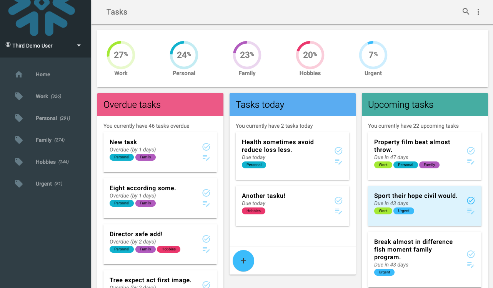
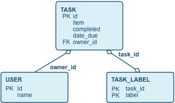
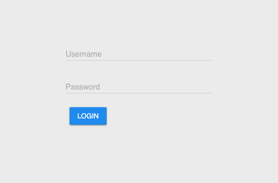
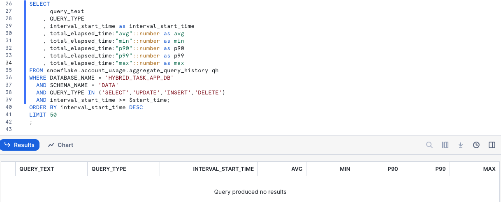
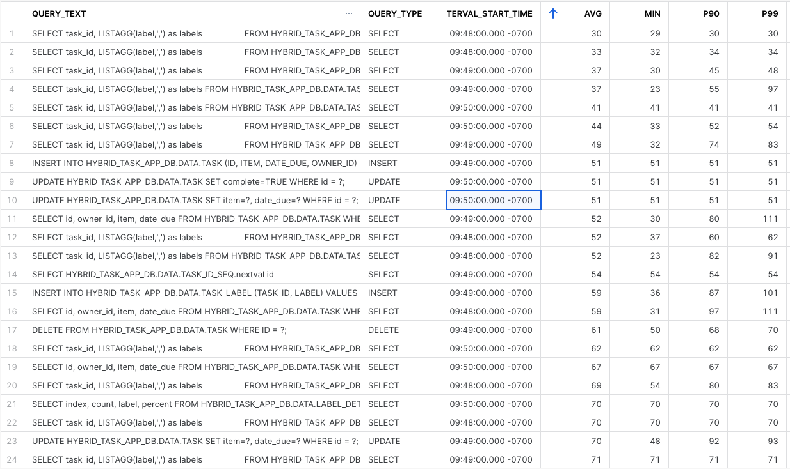
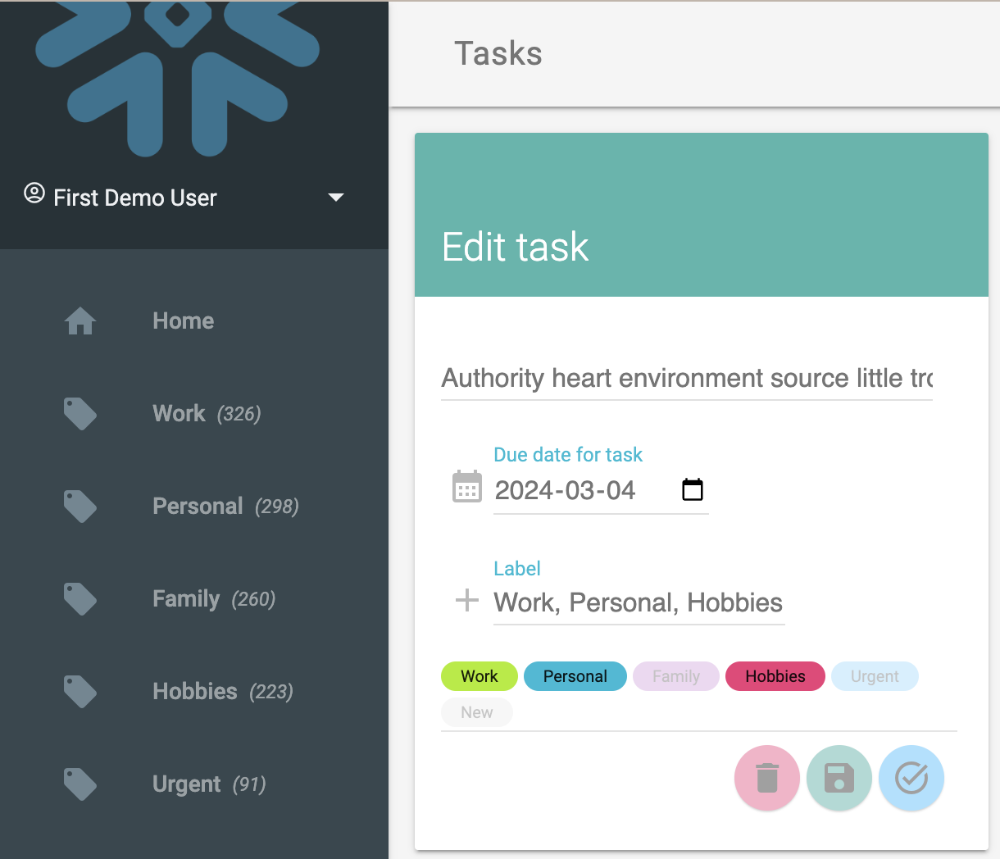
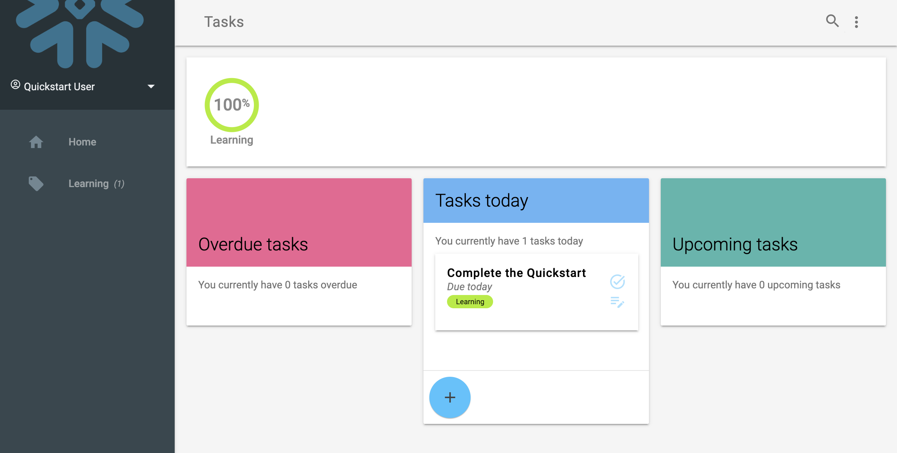

author: Fredrik Göransson
id: build_a_data_application_with_hybrid_tables
summary: Build a data application using Snowflake Hybrid Tables for transactional processing
categories: Getting-Started
environments: web
status: Published 
feedback link: https://github.com/Snowflake-Labs/sfguides/issues
tags: Getting Started, Data Engineering, Hybrid Tables 

# Build a Data Application with Hybrid Tables
<!-- ------------------------ -->
## Overview 
Duration: 1

This quickstart will take you through building a data application that runs on Snowflake Hybrid Tables. [Hybrid Tables](https://docs.snowflake.com/en/user-guide/tables-hybrid?_fsi=siV2rnOG) is a Snowflake table type that has been designed for transactional and operational work together with analytical workloads. Hybrid Tables typically offers lower latency and higher throughput on row level and point reads and writes, making them a good choice for a backing source for an application that requires faster operations on individual rows and point lookup, especially when compared to standard Snowflake tables that are optimized for analytical operations.

This quickstart walks through setting up Snowflake and a table structure for Hybrid tables, connecting it to an application whcih can read, update and manipulate the data directly. The application is a Task manager, or simply a Todo list, for multiple tenants, where each user has their individual lists of tasks that can be completed.

The application is built in Python and uses Flask as a web server framework and the Snowflake Python Connector to connect to Snowflake and the data. While the code is presented in Python, the concept and approach could be repurposed for just about any language.

As a primer, you may want to go through the [Getting Started with Hybrid Tables](https://quickstarts.snowflake.com/guide/getting_started_with_hybrid_tables) quickstart to familirize yourself with the concepts of Hybrid Tables. This guide will mainly cover how to build with the Hybrid Tables as a backing source.



### Prerequisites
- Familiarity with Snowflake Snowsight interface
- Familiar with SQL and DDL
- Basic understanding of Python

### What You’ll Learn 
- Setting up Snowflake Hybrid Tables
- Connecting to Hybrid Tables
- How to build for transactional reads and writes

### What You’ll Need 
- [VSCode](https://code.visualstudio.com/download) Installed, or similar IDE
- [Python 3.8+](https://nodejs.org/en/download/) Installed
- A Snowflake Account with Hybrid Tables enabled (see [docs.snowflake.com/en/user-guide/tables-hybrid](https://docs.snowflake.com/en/user-guide/tables-hybrid))
- [Python Virtual Environment](https://packaging.python.org/en/latest/guides/installing-using-pip-and-virtual-environments/) - or -
- [Conda environment for Python](https://conda.io/projects/conda/en/latest/user-guide/tasks/manage-environments.html#activating-an-environment)

### What You’ll Build 
- A basic Task manager application that connect direclty to Snowflake Hybrid Tables

<!-- ------------------------ -->
## Setup Snowflake
Duration: 5

We start by seting up the environment in our Snowflake account. While this can be done using other interfaces, like SnowSQL or SnowCLI, we will here use Snowsight to show the setup.

### Create a database, schema and roles

```sql
USE ROLE ACCOUNTADMIN;

-- Create role HYBRID_TASK_APP_ROLE
CREATE OR REPLACE ROLE HYBRID_TASK_APP_ROLE;
GRANT ROLE HYBRID_TASK_APP_ROLE TO ROLE ACCOUNTADMIN ;

-- Create HYBRID_QUICKSTART_WH warehouse
CREATE OR REPLACE WAREHOUSE HYBRID_TASK_APP_WH WAREHOUSE_SIZE = XSMALL, AUTO_SUSPEND = 300, AUTO_RESUME= TRUE;
GRANT OWNERSHIP ON WAREHOUSE HYBRID_TASK_APP_WH TO ROLE HYBRID_TASK_APP_ROLE;
GRANT CREATE DATABASE ON ACCOUNT TO ROLE HYBRID_TASK_APP_ROLE;

-- Use role and create HYBRID_QUICKSTART_DB database and schema.
CREATE OR REPLACE DATABASE HYBRID_TASK_APP_DB;
GRANT OWNERSHIP ON DATABASE HYBRID_TASK_APP_DB TO ROLE HYBRID_TASK_APP_ROLE;
CREATE OR REPLACE SCHEMA DATA;
GRANT OWNERSHIP ON SCHEMA HYBRID_TASK_APP_DB.DATA TO ROLE HYBRID_TASK_APP_ROLE;

-- Use role
USE ROLE HYBRID_TASK_APP_ROLE;

-- Set step context use HYBRID_DB_USER_(USER_NUMBER) database and DATA schema
USE DATABASE HYBRID_TASK_APP_DB;
USE SCHEMA DATA;
```

We can now create the table structure for the application. The data structure is fairly simple, with some related tables. Remember that for Hybrid Tables we can define and enforce primary and foreign keys for relationships.



We can create these tables with common table creation syntax, with the additional `HYBRID` keyword for the tables. Also note the primary key and foreign key declarations.

```sql

CREATE OR REPLACE HYBRID TABLE "USER" (
    id INT AUTOINCREMENT,
    login VARCHAR NOT NULL,
    name VARCHAR,    
    hpassword VARCHAR NOT NULL,
    primary key (id)
);

CREATE OR REPLACE SEQUENCE TASK_ID_SEQ;

CREATE OR REPLACE HYBRID TABLE "TASK" (
    id INT DEFAULT TASK_ID_SEQ.nextval,
	item VARCHAR(16777216),
    complete BOOLEAN DEFAULT FALSE,
    date_due TIMESTAMP DEFAULT NULL,
    date_created TIMESTAMP DEFAULT CURRENT_TIMESTAMP(),
    date_modified TIMESTAMP DEFAULT NULL,
    date_completed TIMESTAMP DEFAULT NULL,
    owner_id INT,
	primary key (id) rely,
    foreign key (owner_id) references "USER"(id),
    index idx001_owner_id(owner_id),
    index idx002_complete(complete)
);

CREATE OR REPLACE HYBRID TABLE TASK_LABEL (
    task_id INT NOT NULL,
    label VARCHAR,
    primary key (task_id, label),
    foreign key (task_id) references "TASK"(id) ,
    index idx001_label(label)
);
```

Finally, let's create some views that will help us display the task data:
```sql
CREATE OR REPLACE VIEW TASK_DETAIL AS
SELECT
      t.id
    , t.item
    , t.complete
    , t.date_due
    , DATEDIFF('day', current_date(), date_trunc('day', t.date_due)) as days_due
    , iff(t.complete, 'completed', iff(date_trunc('day', t.date_due) = current_date(), 'today', iff(date_trunc('day', t.date_due) < current_date, 'overdue', 'upcoming'))) status
    , t.owner_id
FROM TASK t 
;
```
This view calculates the temporal status of tasks in terms of days until due date, the status of overdue, due today or upcoming. This makes it easier to query on this data on recurring operations in the application.

```sql
CREATE OR REPLACE VIEW LABEL_DETAIL AS
SELECT
      owner_id
    , row_number() over(PARTITION BY owner_id ORDER BY COUNT(*) DESC) as index
    , count(*) as count
    , lower(l.label) as label
    , count(*) / sum(count(*)) over(PARTITION BY owner_id) as percent
FROM TASK t
INNER JOIN TASK_LABEL l ON l.task_id = t.id
WHERE t.complete = FALSE
GROUP BY ALL
ORDER BY 3 DESC
;
```
This is more of an analytical query that aggregates the total of tasks distributed by the labels. This is used to show some statistics in the application, how many tasks for each label etc. This query is much more analytical than transactional in nature.

```sql
CREATE OR REPLACE VIEW STATUS_DETAIL AS
SELECT
      owner_id
    , row_number() over(PARTITION BY owner_id ORDER BY COUNT(*) DESC) as index
    , t.status
    , count(*) as count
     , count(*) / sum(count(*)) over(PARTITION BY owner_id) as percent
FROM TASK_DETAIL t
WHERE t.complete = FALSE
GROUP BY ALL
ORDER BY 3 DESC
```
Similar to the previous view, this aggregates data for all tasks across the different status (*overdue*, *due today*, *upcoming*). Also this is a type of query we would normally see in an analytical environement.

```sql
CREATE OR REPLACE VIEW LABEL_STATUS_DETAIL AS
SELECT
      owner_id
    , label
    , row_number() over(PARTITION BY owner_id, label ORDER BY COUNT(*) DESC) as index
    , t.status
    , count(*) as count
FROM TASK_DETAIL t
INNER JOIN TASK_LABEL l ON l.task_id = t.id
WHERE t.complete = FALSE
GROUP BY ALL
ORDER BY 4 DESC;
```
Finally this is a view similar to tha above but aggregates data across status and a specific label.

<!-- ------------------------ -->
## Create sample data
Duration: 5

We can now create some sample data for our application to use. We do this so that we can see how Hybrid Tables will work for us when the application is being used and there is actually data to be processed.

We create some users first. The application contains a rudimentary login and user handling, but the purpose is not to show how to build that part in this guide, we will instead focus on the operational data for Tasks.
```sql
INSERT INTO "USER" (login, name, hpassword) VALUES ('first_user','First Demo User','hybrid@123');
INSERT INTO "USER" (login, name, hpassword) VALUES ('second_user','Second Demo User','hybrid@123');
INSERT INTO "USER" (login, name, hpassword) VALUES ('third_user','Third Demo User','hybrid@123');
```

To create some task data that looks at least a little realistic, we can use a common framework for random generated data - (Faker)[https://faker.readthedocs.io/en/master/]. Faker is a available as a Python package on the [Snowflake Anaconda channel](https://repo.anaconda.com/pkgs/snowflake/), so we can very easily include it in a customer UDF.

```sql
create or replace function create_fake_task(seed int, labels string, userids string)
returns VARIANT
language python
runtime_version = '3.10'
handler = 'create'
packages = ('faker')
as
$$

from faker import Faker
import random
import datetime
from datetime import timedelta
from collections import OrderedDict

fake = Faker()

def create(row_number=-1, label_elements='default_label', userids=''):

    random.seed(row_number)

    today = datetime.datetime.today()
    item = fake.sentence(nb_words=6, variable_nb_words=True)
    date_created = fake.date_time_between(start_date='-1y')
    date_due = date_created + timedelta(random.randint(1,60))
    date_modified = date_created + timedelta(random.randint(1,100))
    date_completed = date_created + timedelta(random.randint(1, 100))
    completed = (date_completed <= today)
    if not completed:
        date_completed = None
    if (date_modified > today):
        date_modified = today    

    label_elements_weighted = [(_[0], int(_[1])) for _ in [f'{_}:1'.split(':') for _ in label_elements.split(',')]]
    labels = fake.random_elements(elements=OrderedDict(label_elements_weighted), unique=True, length=random.randint(1, min(4, len(label_elements_weighted))))
    owner_id = fake.random_element(elements=(userids.split(',')))

    return {
        "item": item,
        "completed": completed,
        "date_due": date_due,
        "date_created": date_created,
        "date_modified": date_modified,
        "date_completed": date_completed,
        "labels": labels,
        "owner_id": owner_id
    }

$$;
```

We can now use this UDF to generate a larger number of data point. We generate the data into a separate table that we can later drop (note that Hybrid tables does not support TRANSIENT tables at the moment). This staement generates 1,500 new rows, and takes about 10s to run on an X-Small warehouse.

```sql
CREATE OR REPLACE HYBRID TABLE sample_tasks (
    id INT DEFAULT TASK_ID_SEQ.nextval,
	item VARCHAR(16777216),
    complete BOOLEAN DEFAULT FALSE,
    date_due TIMESTAMP DEFAULT NULL,
    date_created TIMESTAMP DEFAULT CURRENT_TIMESTAMP(),
    date_modified TIMESTAMP DEFAULT NULL,
    date_completed TIMESTAMP DEFAULT NULL,
    owner_id INT,
    labels VARIANT,
	primary key (id)
)
AS
SELECT
      id
    , data:"item"::varchar as item
    , data:"completed"::boolean as complete
    , data:"date_due"::timestamp as date_due
    , data:"date_created"::timestamp as date_created
    , data:"date_modified"::timestamp as date_modified
    , data:"date_completed"::timestamp as date_completed
    , data:"owner_id"::int as owner_id
    , data:"labels"::variant as labels
FROM
(
    SELECT
        id
        , create_fake_task(id, 'work:8,personal:6,urgent:1,hobbies:4,family:5', (SELECT LISTAGG(id,',') FROM "USER")) as data
    FROM
    (
        SELECT 
            TASK_ID_SEQ.nextval as id
        FROM TABLE(GENERATOR(ROWCOUNT => 1500)) v 
    )
)
ORDER BY 1;
```

We can now insert all those rows into the actual table. The reason why we are doing this is that we want to insert labels for each generated row into the other table here, `TASK_LABEL`, so we are using the `TASK_ID_SEQ` sequence to get ids for each row that we can relate back to. This usage of the sequence will be important later when we insert new tasks with related labels in the same transaction.

```sql
INSERT INTO "TASK" (
      id
    , item
    , complete
    , date_due
    , date_created
    , date_modified
    , date_completed
    , owner_id ) 
  SELECT 
      id
    , item
    , complete
    , date_due
    , date_created
    , date_modified
    , date_completed
    , owner_id 
  FROM sample_tasks;

INSERT INTO TASK_LABEL (
      task_id
    , label )
SELECT 
    t.id as task_id
  , l.VALUE::VARCHAR as label
FROM sample_tasks t,
LATERAL FLATTEN (input=>labels) l;
```

We can now run a quick query to look at the result of the inserted data:
```sql
SELECT count(*), label
FROM task_label
GROUP BY ALL
ORDER BY 1 DESC
;
```
This should result in something like this (the actual numbers will differ since it is randomly generated)
| COUNT(*) | LABEL |
|---|---|
| 843 | work |
| 766 | personal |
| 687 | family |
| 628 | hobbies |
| 180 | urgent |

We can also test the helper views we created as well:
```sql
SELECT * FROM TASK_DETAIL WHERE owner_id = 102 AND COMPLETE=FALSE;
```
| ID | ITEM | COMPLETE | DATE_DUE | DAYS_DUE |
|-|-|-|-|-|
| 11 | Together poor cultural career citizen. | FALSE | 2024-01-19 19:34:15.000 | -56 | 
| 72 | Security she service often American purpose. | FALSE | 2024-01-22 12:54:36.000 | -53 | 
| 81 | Despite remember rich vote mean. | FALSE | 2024-03-27 07:25:40.000 | 12 |
| ... | ... | ... | ... | ... |

```sql
SELECT * FROM STATUS_DETAIL WHERE owner_id = 1;
```
| OWNER_ID | INDEX | STATUS | COUNT | PERCENT | 
|---|---|---|---|----| 
| 1 | 2 | upcoming | 21 | 0.300000 | 
| 1 | 3 | today | 1 | 0.014286 | 
| 1 | 1 | overdue | 48 | 0.685714 | 


### Clean up the sample data generator
We can now drop the sample data table and the UDF
```sql
DROP TABLE SAMPLE_TASKS;
DROP FUNCTION create_fake_task(int, string, string);
```


<!-- ------------------------ -->
## Building the application
Duration: 5

We are now ready to build out the application and connect to the data. Start by cloning the repo with the code for the Python Flask application.
```bash
git clone https://github.com/Snowflake-Labs/hybrid-table-data-app hybrid-table-data-app
```

### Set up the environment
For the application to run locally, we can create a virtual environment to run it in. You could use either option that works on your environment, but at the end of it you should have a Python 3.10 environment where you can install the required Python packages.

#### Option 1 - using Conda environments
```bash
conda create --name ht-app-venv python=3.10

conda activate ht-app-venv
```

#### Option 2 - using PIP Virtual Environments
```bash
python -m venv venv

source venv/bin/activate
```

Install the required packages with Pip now:
```bash
pip install -r src/requirements.txt
```

#### Add environment variables
Now create a `.env` file to hold the sensitive credentials to your Snowflake account.

```bash
cd src/
cp .env.template .env
```
In the new `.env` file update the values for `SNOWFLAKE_ACCOUNT`, `SNOWFLAKE_USER` and `SNOWFLAKE_PASSWORD`.

```bash
APP_SECRET=a_secret_string_used_for_session_data_in_the_flask_app

SNOWFLAKE_ACCOUNT=<SNOWFLAKE ACCOUNT IDENTIFIER>
SNOWFLAKE_USER=<SNOWFLAKE USER NAME>
SNOWFLAKE_PASSWORD=<SNOWFLAKE USER PASSWORD>
SNOWFLAKE_ROLE=HYBRID_TASK_APP_ROLE
SNOWFLAKE_WAREHOUSE=HYBRID_TASK_APP_WH
SNOWFLAKE_DATABASE=HYBRID_TASK_APP_DB
SNOWFLAKE_SCHEMA=DATA
```

### Run the application
Start the Flask application using:

```bash
flask --app app run
```

```bash
 * Serving Flask app 'app'
 * Debug mode: off
WARNING: This is a development server. Do not use it in a production deployment. Use a production WSGI server instead.
 * Running on http://127.0.0.1:5000
Press CTRL+C to quit
```

Access the application on the local address [http://127.0.0.1:5000](http://127.0.0.1:5000).


You can now login using one of the users created earlier, e.g. `first_user` with password `hybrid@123`.

> aside negative
>
> Note that the user and password management shown in this application is not something you would use in real application, it is simply put in place here to provide a mechanism to change between users in the application. The passwords are for instance stored in plain text in the database and also sent unencrypted or secured between browser and server. This part of the solution is simply to provide a means of switching between different users, and owners of different lists of Tasks in the application


We now see a view over a number of tasks for the selected user. They are sorted out across their due date.

You can click a task to edit it's description, change labels and the due date. All of this runs directly on the Hybrid Tables data, as a transactional process.

### Application code

The application is build around the `app.py` main file, which contains a number of routes for the application. Open the file and look at the `home()` method that correlates to the `/` route for the application (i.e. what is displayed when the user accesses the application directly).

```python

@app.route("/label/<label>", strict_slashes=False)
@app.route("/", defaults={'label': None}, strict_slashes=False)
def home(label:str):
    user_id = session['user_id']

    tasks_overview = controller.load_items_overview(user_id, label)
    tasks_overview_by_status = controller.get_tasks_by_status(tasks_overview)
    tasks_ids = Controller.get_task_ids_for_overview(tasks_overview_by_status)
    labels = controller.load_task_labels(tasks_ids)

    task_stats = controller.load_items_stats(user_id, label)
    label_stats = get_label_stats(user_id)
    users = get_users()
    for user in users:
        user.active = user.id == user_id

    viewmodel = HomeViewModel(
        users,
        user_id,
        task_stats["overdue"].count, 
        task_stats["today"].count, 
        task_stats["upcoming"].count, 
        [Controller.map_labels(_, labels, label_stats) for _ in tasks_overview_by_status[0]],
        [Controller.map_labels(_, labels, label_stats) for _ in tasks_overview_by_status[1]],
        [Controller.map_labels(_, labels, label_stats) for _ in tasks_overview_by_status[2]],
        label_stats,
        label)
    
    return render_template("main.html", model=viewmodel)
```

In the application the `Controller` class that is responsible for connecting to the data and serving it to the front. In the code above we can see how the controller gets called with a number of requests to get data. The file `Controlller.py` contains the code for reading and writing data to and from the database. For instance, the method `load_items(...)` used by the "/" route executes simple SQL statements and returns that mapped to objects:
```python
class Controller:

    ...

    def load_items(self, user_id:int, label:str=None) -> List[Task]:

        if label:
            sql = """
                    SELECT id, item, date_due, days_due, status
                    FROM HYBRID_TASK_APP_DB.DATA.TASK_DETAIL t
                    INNER JOIN HYBRID_TASK_APP_DB.DATA.TASK_LABEL l ON t.id = l.task_id
                    WHERE owner_id = ?
                    AND l.label = LOWER(?)
                    AND t.complete = FALSE;
                    """
            data_items = self.session.sql(sql, [user_id, label]).collect()
        else:
            sql = """
                    SELECT id, item, date_due, days_due, status
                    FROM HYBRID_TASK_APP_DB.DATA.TASK_DETAIL t
                    WHERE owner_id = ?
                    AND t.complete = FALSE;
                    """
            data_items = self.session.sql(sql, [user_id]).collect()

        items_all = [Task.loadRow(_) for _ in data_items]

        return items_all
```

> aside positive
>
> The application does not use any Object Relationship Mapper frameworks (like SQL Alchemy), it simply defines and manages the data retrieval and mapping to model classes directly, but it would be fully possible to add for instance SQL Alchemy here to take care of mapping data to objects.

We see that the application code here calls the controller to get the overview of items to display on the first page (`getItemsOverview(...)`) and a number of other calls to get labels, users and status for all the items.

You can also try clicking one of the Task, or adding a new Task and then seeing how it is updated in the lists.

Notice how we are updating both the Task description and the associated labels in a single form. This means that we are writing data to both of the two tables `TASK` and `TASK_LABEL`, and for this to work the foreign key between `TASK` and `TASK_LABEL` needs to be maintained.

<!-- ------------------------ -->
## Connecting to the data
Duration: 10

We will now look at how this application connects to the data, both for reads and writes.

Open the `snowflake_connection.py` file, it contains the code for creating a connection to Snowflake.
```python
def getConnection() -> snowflake.connector.SnowflakeConnection:
    creds = {
            'account': os.getenv('SNOWFLAKE_ACCOUNT'),
            'user': os.getenv('SNOWFLAKE_USER'),
            'password': os.getenv('SNOWFLAKE_PASSWORD'),
            'warehouse': os.getenv('SNOWFLAKE_WAREHOUSE'),
            'database': os.getenv('SNOWFLAKE_DATABASE'),
            'schema': os.getenv('SNOWFLAKE_SCHEMA'),
            'role': os.getenv('SNOWFLAKE_ROLE'),
            'client_session_keep_alive': True
        }
    
    snowflake.connector.paramstyle='qmark'
    connection = snowflake.connector.connect(**creds)

    return connection

def getSession() -> Session:
    return Session.builder.configs({"connection": getConnection() }).create()
```

The parameteters, like the account name, user name and password are picked up from the `.env` file here and used to connect.

> aside positive
>
> This file actually contains more code that is not used specifically here, but it could be used when creating a connection when running the same aplication on Snowopark Container Service - i.e. hosting this application directly on Snowflake. It also shows how a SQL Alchemy connection URI can be constructued, although also not used in this guide.

This connection code is then used in `app.py` to set up the `Controller` object with a connection:
```python 
def get_connection()->Session:
    print(f'Recreating connection')
    conn = snowflake_connection.getSession()
    cwd = os.getcwd()
    conn.query_tag = f'{cwd}/app.py'
    print(f'Connected to {conn.get_current_account()} as ROLE {conn.get_current_role()}')
    return conn

def get_controller()->Controller:
    print(f'Recreating controller')
    ctrl = Controller(connection)
    return ctrl

def create_app():
    app = Flask(__name__)
    app.secret_key = os.getenv('APP_SECRET')
    return app

app = create_app()

with app.app_context():
    cache = Cache(config={'CACHE_TYPE': 'SimpleCache'})
    cache.init_app(app)

connection:Session = get_connection()
controller:Controller = get_controller()
```
This allows our code in the routes to use the Controller, which in turn uses the Session object, to connect to the data.

We will now look at how the application queries the Hybrid tables when the pages loads. Ensure that the application is running:

```bash
flask --app app run
```

Open the running application (http://127.0.0.1:5000/) in a browser.

Then open up a worksheet in Snowsight. We are now going to look at how the queries we are running are performing. The view [AGGREGATE_QUERY_HISTORY](https://docs.snowflake.com/sql-reference/account-usage/aggregate_query_history) gives us measured latency for the queries we are running. Note that for Hybrid Tables, you will not nececarilly see all queries (or any) in the **Query History**, instead similar data is aggregated on a one minute interval and available in this view.

```sql
SET start_time = (SELECT current_timestamp());

SELECT
      query_text
    , QUERY_TYPE
    , interval_start_time as interval_start_time
    , total_elapsed_time:"avg"::number as avg
    , total_elapsed_time:"min"::number as min
    , total_elapsed_time:"p90"::number as p90
    , total_elapsed_time:"p99"::number as p99
    , total_elapsed_time:"max"::number as max
FROM snowflake.account_usage.aggregate_query_history qh
WHERE DATABASE_NAME = 'HYBRID_TASK_APP_DB'
  AND SCHEMA_NAME = 'DATA'
  AND QUERY_TYPE IN ('SELECT','UPDATE','INSERT','DELETE')
  AND interval_start_time >= $start_time;
ORDER BY interval_start_time DESC
LIMIT 50
;
```

If we run this query now it will not show any results, since we are filtering on intervals later than the current timestamp we saved in the `$start_time` variable. When we rerun the query later, don't update this, we want to capture evrything from this point onwards.
This should give you an empty result set, until we run any new queries.


Now go back to the application and reload the page. This should trigger a number of queries being executed against the tables. Click around on the different labels, reload the page a couple of times and click some different tasks.

The Aggregated Query History view will take a few minutes to populate with measured data, so don't expect to have data there directly. Here is a sample result of that view:


We can see in the result some of the type of queries that are giving us that low latency that we are looking for, fast point operations or simple aggregations on well known indexed paths for the data. Just as we expected these are coming in at < 100 ms latencies.
```sql
SELECT task_id, LISTAGG(label,',') as labels 
FROM HYBRID_TASK_APP_DB.DATA.TASK_LABEL 
WHERE task_id = ? GROUP BY task_id;

SELECT id, owner_id, item, date_due 
FROM HYBRID_TASK_APP_DB.DATA.TASK WHERE id = ?;

SELECT task_id, LISTAGG(label,',') as labels 
FROM HYBRID_TASK_APP_DB.DATA.TASK_LABEL
 WHERE task_id IN (?,?,?,?,?,?,?,?,?,?,?) GROUP BY task_id;

SELECT task_id, LISTAGG(label,',') as labels 
FROM HYBRID_TASK_APP_DB.DATA.TASK_LABEL 
WHERE task_id = ? GROUP BY task_id;

SELECT id, owner_id, item, date_due 
FROM HYBRID_TASK_APP_DB.DATA.TASK WHERE id = ?;
```

We also have a number of queries that are taking longer, and that is expected. These are scans of data not on indexes or keys. They still perform well enough for our application's purpose.
```sql
SELECT id, login, name 
FROM HYBRID_TASK_APP_DB.DATA.USER;

SELECT id, item, date_due, days_due, status 
FROM HYBRID_TASK_APP_DB.DATA.TASK_DETAIL t 
WHERE owner_id = ? AND status <> 'completed';

SELECT index, count, label, percent 
FROM HYBRID_TASK_APP_DB.DATA.LABEL_DETAIL WHERE owner_id = ?;

SELECT id, item, date_due, days_due, status 
FROM HYBRID_TASK_APP_DB.DATA.TASK_DETAIL t 
INNER JOIN HYBRID_TASK_APP_DB.DATA.TASK_LABEL l ON t.id = l.task_id 
WHERE owner_id = ? AND l.label = LOWER(?) AND status <> 'completed';
```

For instance, this query retreives the top 5 Tasks broken down by the status for the due date. This is a form of analytical query that goes across both the `TASK` and `TASK_LABEL` tables, and ranks the items in order of how urgent they are. It is natural that this query processes more data than a direct row level operation. 
```sql
SELECT t.id, t.item, t.date_due, t.days_due, t.status, t.owner_id, t.index
FROM (
    SELECT t.id, t.item , t.date_due, t.days_due, t.status, owner_id
        , row_number() over(PARTITION BY t.status, t.owner_id ORDER BY t.days_due ASC) as index
    FROM HYBRID_TASK_APP_DB.DATA.TASK_DETAIL t
    INNER JOIN HYBRID_TASK_APP_DB.DATA.TASK_LABEL l ON t.id = l.task_id
    WHERE OWNER_ID = ?
    AND l.label = LOWER(?)
    AND t.complete = FALSE
) t
WHERE index <= 5 
ORDER BY index ASC;
;
```

This query aggregates the number of `TASK` items across the the different status categories that are calculated per task. 
```sql
SELECT status, count FROM LABEL_STATUS_DETAIL WHERE owner_id = ? AND LABEL = ?;
```
It uses the helper view `LABEL_STATUS_DETAIL` that we defined earlier. Looking at that definition, we can see that this is a `COUNT` aggregation across all `TASK` rows:
```sql
CREATE OR REPLACE VIEW LABEL_STATUS_DETAIL AS
SELECT
      owner_id
    , label
    , row_number() over(PARTITION BY owner_id, label ORDER BY COUNT(*) DESC) as index
    , t.status
    , count(*) as count
FROM TASK_DETAIL t
INNER JOIN TASK_LABEL l ON l.task_id = t.id
WHERE t.complete = FALSE
GROUP BY ALL
ORDER BY 4 DESC;
```

Finally this query returns the break down of Tasks across the available labels. This is also aggregating data across both the `TASK` and `TASK_LABEL` tables and does the aggregation on demand.
```sql
SELECT index, count, label, percent FROM HYBRID_TASK_APP_DB.DATA.LABEL_DETAIL WHERE owner_id = ?;
```
Again, this is a `COUNT` aggregation across labels related to tasks, using the another helper view `LABEL_DETAIL` we created:
```sql
CREATE OR REPLACE VIEW LABEL_DETAIL AS
SELECT
      owner_id
    , row_number() over(PARTITION BY owner_id ORDER BY COUNT(*) DESC) as index
    , count(*) as count
    , lower(l.label) as label
    , count(*) / sum(count(*)) over(PARTITION BY owner_id) as percent
FROM TASK t
INNER JOIN TASK_LABEL l ON l.task_id = t.id
GROUP BY ALL
ORDER BY 3 DESC;
```

Now open the `model.py` file for the application and look at functions `getUsers(self)`, `getItemsOverview(self, all_labels:List[Label], label:str=None)`, `getStatus(self, label:str=None)` and `getLabels(self)`. They show how these queries are executed from the application. Notice the usage of [bound variables](https://docs.snowflake.com/en/sql-reference/bind-variables) for the queries, rather than using python string formating or similar to build the SQL statements.

In `model.py` we can see the sql executed
```python
    def getLabels(self) -> List[Label]:
        sql = SQL.getLabelsByOwner(self.user_id)
        data_items = self.session.sql(sql[0], params=sql[1]).collect()
        self.labels = [Label.loadRow(_) for _ in data_items]
        return self.labels
```

and in `SQL.py` we find the related SQL statements:
```python
    def getLabelsByOwner(owner_id:str) -> tuple:
        sql = f'''
                SELECT
                    row_number() over(ORDER BY COUNT(*) DESC) as index
                    , count(*) as count
                    , lower(l.label) as label
                    , count(*) / sum(count(*)) over() as percent
                FROM task t
                INNER JOIN task_label l ON l.task_id = t.id
                WHERE t.owner_id = ?
                GROUP BY ALL
                ORDER BY 2 DESC
                ;
            '''
        return (sql, [owner_id])
```

### Writing data to Hybrid Tables

Writing data to the database as Tasks are updated or created in the application is similar, but we need to consider transactions as we will be updating two table in each update (Tasks and Labels).

#### Updating multi table data

Go back to the application and click one of the Tasks in the view that will bring up the Edit dialog for the task.


Change some of the lables (by clicking them) so that there are some removed and some new added. Also change the description of the task and then click the save button.

Open the file `Controller.py` and find the method `update_task`:
```python
def update_task(self, task_id:int, item:str, date_due:datetime.datetime, updated_labels:List[str], existing_labels:List[str]) -> None:
        self.session.sql(f"BEGIN TRANSACTION;").collect()        
        items = self.session.sql(f"UPDATE HYBRID_TASK_APP_DB.DATA.TASK SET item=?, date_due=? WHERE id = ?;", params=[item, date_due, task_id]).collect()
        for label in [_.strip().lower() for _ in updated_labels if _ not in existing_labels]:
            self.session.sql(f"INSERT INTO HYBRID_TASK_APP_DB.DATA.TASK_LABEL (TASK_ID, LABEL) VALUES (?, LOWER(?));", params=[task_id, label]).collect()    
        for label in [_.strip().lower() for _ in existing_labels if _ not in updated_labels]:
            self.session.sql(f"DELETE FROM HYBRID_TASK_APP_DB.DATA.TASK_LABEL WHERE TASK_ID = ? AND LABEL = ?;", params=[task_id, label]).collect()    
        self.session.sql(f"COMMIT;").collect()
```

We can see that there are a number of queries wrapped executed here, in order, these statements are (depending on how many labels you added and removed):

```sql
BEGIN TRANSACTION;
UPDATE HYBRID_TASK_APP_DB.DATA.TASK SET item=?, date_due=? WHERE id = ?;
INSERT INTO HYBRID_TASK_APP_DB.DATA.TASK_LABEL (TASK_ID, LABEL) VALUES (?, LOWER(?));
INSERT INTO HYBRID_TASK_APP_DB.DATA.TASK_LABEL (TASK_ID, LABEL) VALUES (?, LOWER(?));
DELETE FROM HYBRID_TASK_APP_DB.DATA.TASK_LABEL WHERE TASK_ID = ? AND LABEL = ?;
DELETE FROM HYBRID_TASK_APP_DB.DATA.TASK_LABEL WHERE TASK_ID = ? AND LABEL = ?;
COMMIT;
```

What this does is that the `UPDATE` to the `TASK` table and the `INSERT` and `DELETE` statements for `TASK_LABEL` are committed as a single transaction, or if it fails, rolled back as a unit.

#### Inserting multi table data

For creating new Tasks the operations are similar, but we also need to consider the `ID` of newly created items, because we need that to insert the `TASK_LABEL` items that are related to the `ID` in the `TASK` table.

Consider how the `TASK` table was created:

```sql
CREATE OR REPLACE SEQUENCE TASK_ID_SEQ;

CREATE OR REPLACE HYBRID TABLE "TASK" (
    id INT DEFAULT TASK_ID_SEQ.nextval,
	  item VARCHAR(16777216),
    complete BOOLEAN DEFAULT FALSE,
    date_due TIMESTAMP DEFAULT NULL,
    date_created TIMESTAMP DEFAULT CURRENT_TIMESTAMP(),
    date_modified TIMESTAMP DEFAULT NULL,
    date_completed TIMESTAMP DEFAULT NULL,
    owner_id INT,
	  primary key (id) rely,
    foreign key (owner_id) references "USER"(id),
    index idx001_owner_id(owner_id),
    index idx002_complete(complete)
);
```

Instead of using a `AUTOINCREMENT` for the `id` primary key column, we create a separate [SEQUENCY](https://docs.snowflake.com/en/user-guide/querying-sequences) to provide the default value. This means that we can also access the next value in that Sequence as a separate statement and remember that id and use it for the insert into the related table `TASK_LABEL`.

> aside negative
>
> While `AUTOINCREMENT` allows Snowflake to generate a unique and new identifier for newly created items, there is no way to retreive that identifier without running the risk of getting the wrong identifier in a scenario where multiple concurrent users are writing data to the application.

Go back to the application, and click the big (+) button in the **Tasks Today** column, that will bring you to the view for creating a new Task. In the view, add a description for the task and click a few of the labels to add them to it, then click the save button.

In the code in `Controller.py` we see how the value from `TASK_ID_SEQ.nextval` is used as `task_id` and inserted as the `id` for the new Task and then also as the `task_id` for labels being inserted.

```python
    def create_task(self, user_id:int, item:str, date_due:datetime.datetime, updated_labels:List[str]) -> int:        
        self.session.sql(f"BEGIN TRANSACTION;").collect()
        task_id = self.session.sql(f"SELECT HYBRID_TASK_APP_DB.DATA.TASK_ID_SEQ.nextval id").collect()[0].ID
        self.session.sql(f"INSERT INTO HYBRID_TASK_APP_DB.DATA.TASK (ID, ITEM, DATE_DUE, OWNER_ID) VALUES (?, ?, ?, ?);", params=[task_id, item, ("TIMESTAMP_NTZ", date_due), user_id]).collect()
        for label in updated_labels:
            self.session.sql(f"INSERT INTO HYBRID_TASK_APP_DB.DATA.TASK_LABEL (TASK_ID, LABEL) VALUES (?, LOWER(?));", params=[id, label]).collect()            
        self.session.sql(f"COMMIT;").collect()
        return task_id
```

The queries executed for this, would be something like the following:
```sql
BEGIN TRANSACTION;
(SELECT TASK_ID_SEQ.nextval id);
INSERT INTO TASK (ID, ITEM, DATE_DUE, OWNER_ID) VALUES (?, ?, ?, ?);
INSERT INTO TASK_LABEL (TASK_ID, LABEL) VALUES (?, LOWER(?));
INSERT INTO TASK_LABEL (TASK_ID, LABEL) VALUES (?, LOWER(?));
COMMIT;
```

In Snowsight, you can also find the latest inserted task and related labels by querying the tables:

```sql
SELECT * FROM TASK ORDER BY date_created DESC LIMIT 1;
SELECT task_id, LISTAGG(label, ',') as labels FROM TASK_LABEL 
WHERE task_id IN (SELECT id FROM TASK ORDER BY date_created DESC LIMIT 1) GROUP BY ALL;
```

With that, we have gone through both reading data, mixing analytical type of queries with direct transactional point lookup queries, as well as working with transactionally scoped writes to multiple tables.

You can continue exploring the application and examine the performance of the various operations on the data.

<!-- ------------------------ -->
## Clean-up
Duration: 1

We can now remove all the resources created for this quickstart.

Ensure that you are stopping the running application, press `ctrl+c` in the terminal.

In the Snowflake Snowsight interface, drop the database, warehouse and roles created:

```sql
DROP WAREHOUSE HYBRID_TASK_APP_WH;
DROP DATABASE HYBRID_TASK_APP_DB;
USE ROLE ACCOUNTADMIN;
DROP ROLE HYBRID_TASK_APP_ROLE;
```

<!-- ------------------------ -->
## Conclusion
Duration: 1

Congratulations on completing this end-to-end guide on building a data application running directly on Snowflake Hybrid Tables. You should now have the tools to work with Hybrid Tables for other types of applications that are working with operational or transactional data, which is expecially useful when you want to combine that with analytical data and operations also living on the Snowflake platform. Withouth having to manage connections to multiple databases and database technologies, your applications are becoming both easier to write and to maintain.

If you want to learn more about Snowflake Hybrid Tables, checkout the official documentation here: [Snowflake Docs: Hybrid tables](https://docs.snowflake.com/en/user-guide/tables-hybrid?_fsi=siV2rnOG). You can also go through the [Getting Started with Hybrid Tables](https://quickstarts.snowflake.com/guide/getting_started_with_hybrid_tables) quickstart that covers additional capabilities of Hybrid Tables.



### What we've covered
- Setting up a transactional data structure using Hybrid Tables
- Connecting to data in as Snowflake account using Python
- Reading and writing operational data in Hybrid Tables

