author: Craig Warman
id: build_a_data_clean_room_in_snowflake_advanced
summary: Learn how to build a simple Data Clean Room in Snowflake (Advanced)
categories: data-engineering,app-development,solution-examples
environments: web
status: Published
feedback link: https://github.com/Snowflake-Labs/sfguides/issues
tags: Getting Started, Data Clean Rooms, Data Engineering

# Build A Data Clean Room in Snowflake - Advanced
<!-- ------------------------ -->
## Overview 
Duration: 5

Data Clean Rooms (DCRs) are secure environments that enable multiple organizations (or divisions of an organization) to bring data together for joint analysis under defined guidelines and restrictions that keep the data secure.  These guidelines control what data comes into the clean room, how the data within the clean room can be joined with other data in the clean room, the kinds of analytics that can be performed on the clean room data, and what data - if any - can leave the clean room environment.  

Traditional DCR implementations require organizations to copy their data to a separate physical location.  Snowflake's DCR model, however, leverages [a unique architecture](https://www.snowflake.com/blog/distributed-data-clean-rooms-powered-by-snowflake/) that enables each organization to *maintain full control of their data* in their *own secure Snowflake account*.  In other words, two (or more) organizations can leverage Snowflake DCRs to join data without copying, moving, or sharing the underlying data, and to perform analyses on large amounts of data with high performance and scalability.

> aside negative
> 
>  **Caveat:** This Data Clean Room QuickStart is for illustrative purposes only, as a hands-on lab intended to show some of the basic features used to build a data clean room on Snowflake. The result of this lab must not be used in a production environment.

### Prerequisites
- Familiarity with Snowflake's [unique DCR architecture](https://www.snowflake.com/blog/distributed-data-clean-rooms-powered-by-snowflake/)
- Working knowledge with Snowflake database objects and the [Snowflake Web UI](https://docs.snowflake.com/en/user-guide/ui-web.html)
- Clear understanding of how Snowflake [Secure Data Sharing](https://docs.snowflake.com/en/user-guide/data-sharing-intro.html) works


### What You’ll Learn 
- How to create and deploy a DCR environment between two or more Snowflake accounts
- How DCR query requests are initiated, reviewed, and approved (or declined)
- How approved DCR query requests are executed

### What You’ll Build 
This Quickstart lab will walk you through the process of deploying a Snowflake **v5.5** DCR environment, which is our latest General Availability (GA) release. 
- Provides ability to deploy two-party and multi-party DCR environments
- Leverages Jinja SQL templating language tags and logic
- Designed for straightforward upgrade path to the forthcoming v6.0 DCR environment (when released)
- Includes example query templates for some common advertising scenarios

### What You’ll Need 
- **Two** Snowflake accounts - either [Enterprise or Business Critical edition](https://docs.snowflake.com/en/user-guide/intro-editions.html) - that are deployed in the **same** [cloud provider and region](https://docs.snowflake.com/en/user-guide/intro-regions.html). You may procure these as [Snowflake 30-day free trial accounts](https://docs.snowflake.com/en/user-guide/admin-trial-account.html) to make things easier for you - Simply go through the signup process twice on [signup.snowflake.com](https://signup.snowflake.com), making certain to select the **same cloud provider and region** for each (see screenshot below).  I also recommend selecting the same [Snowflake edition](https://docs.snowflake.com/en/user-guide/intro-editions.html) for both accounts as well.  Note: You can re-use the Snowflake accounts from the [Build A Data Clean Room in Snowflake](../build_a_data_clean_room_in_snowflake) Quickstart if those are still available, if you'd like.
- Logins to **both** of the Snowflake accounts which have [ACCOUNTADMIN role access](https://docs.snowflake.com/en/user-guide/security-access-control-considerations.html) (note that [Snowflake free trial accounts](https://docs.snowflake.com/en/user-guide/admin-trial-account.html) provide this automatically, which is why I suggest using them for this Quickstart).

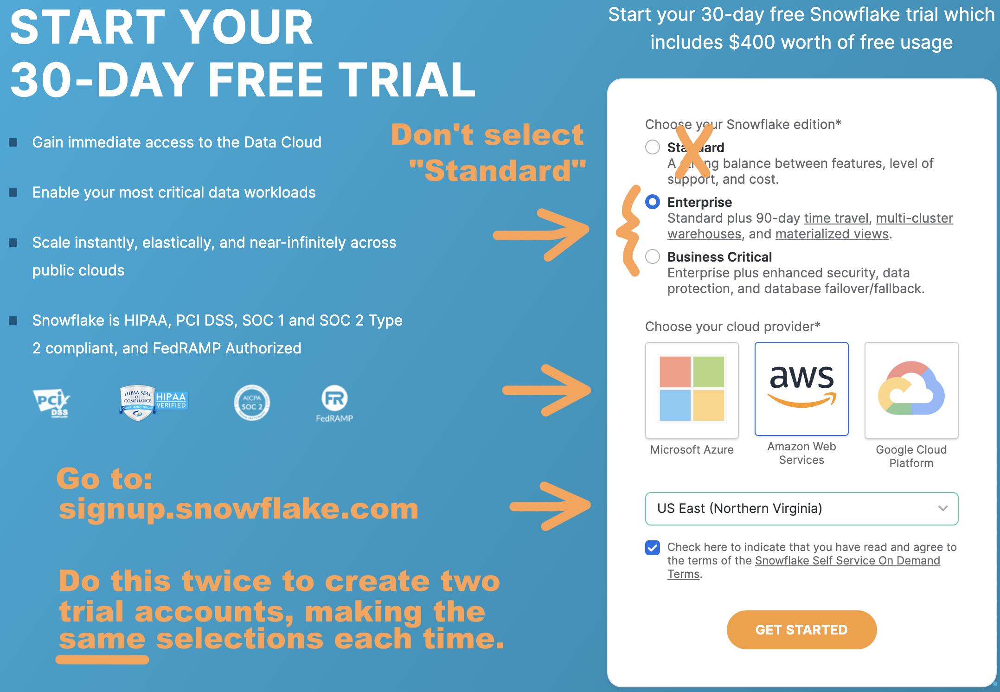

### Attribution
The author wishes to recognize Rachel Blum, Michael Rainey, Mike Walton, Brett Klein, and Justin Langseth for their technical expertise and code contributions that were leveraged to create this Quickstart.

<!-- ------------------------ -->
## Getting Started
Duration: 10

### Watch The Video
It might be helpful to watch the following YouTube video where I provide a walk-through of Snowflake's DCR architecture, along with a demonstration of the DCR that was built during an older version of the DCR Quickstart:

<video id="UI5na73_9cA"></video>

### Log Into Both Snowflake Accounts
The first task at hand is to log into each of the two Snowflake accounts that you'll be using for this Quickstart.  As mentioned earlier, the logins that you use for these Snowflake accounts must have [ACCOUNTADMIN role access](https://docs.snowflake.com/en/user-guide/security-access-control-considerations.html) and both accounts must be deployed in the **same** [cloud and region](https://docs.snowflake.com/en/user-guide/intro-regions.html). You should now log in to each account simultaneously using separate browser tabs or windows.

> aside positive
> 
>  I used Snowsight in [the YouTube video](https://www.youtube.com/watch?v=UI5na73_9cA) that you watched earlier, and for all of the screenshots in this Quickstart.

### Designate Provider And Consumer Accounts
I referred to these as "Party1" and "Party2" in [my YouTube video](https://www.youtube.com/watch?v=UI5na73_9cA).  But the DCR we're building now is capable of having multiple Consumers, so we're replacing the "Party1" and "Party2" labels with "PROVIDER_1" and "CONSUMER_1". At this point you should designate each of your two accounts likewise. 

### Acknowledge Snowflake Third Party Terms
This DCR deployment utilizes open-source Python packages that are built and provided by Anaconda.  Consequently it'll be necessary to acknowledge the [Snowflake Third Party Terms](https://www.snowflake.com/legal/third-party-terms/) before proceeding.  You can do this by following [these instructions](https://docs.snowflake.com/en/developer-guide/udf/python/udf-python-packages.html#using-third-party-packages-from-anaconda) in _both_ the PROVIDER_1 and CONSUMER_1 accounts.  Again, you _must_ successfully complete this step in order to proceed with the DCR installation process, so go ahead and do it now.

### Note PROVIDER_1 And CONSUMER_1 Account Identifiers
Each Snowflake account is assigned [a unique identifier](https://docs.snowflake.com/en/user-guide/admin-account-identifier.html) (sometimes called a Locator) within its cloud provider and region.  If you took my recommendation to use [Snowflake 30-day free trial accounts](https://docs.snowflake.com/en/user-guide/admin-trial-account.html) then these will be a random combination of letters and numbers, such as "GQB12697".  Please go ahead and determine your account identifers by opening a new worksheet and running the following command in each account's UI:
``` sql
select current_account();
```
Here's a screenshot of what it looks like when I did this for one of my accounts:

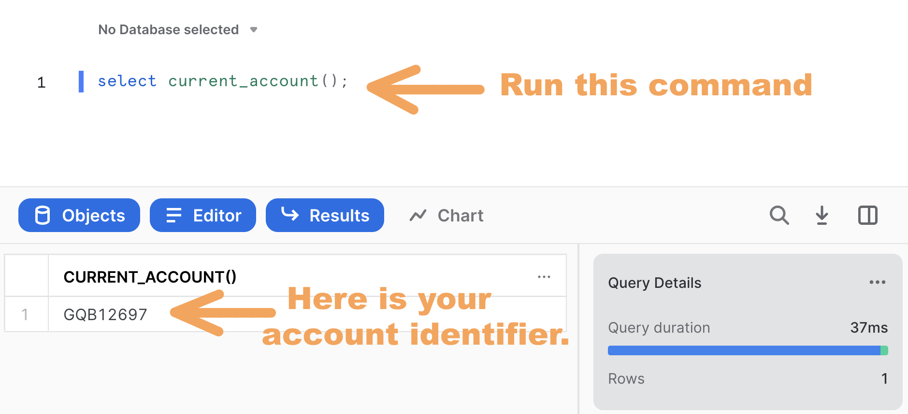

Be sure to note which account identifier corresponds to the PROVIDER_1 and CONSUMER_1 accounts as you'll need these below.

### Generate PROVIDER_1 and CONSUMER_1 Setup Scripts
Now that you've got your account identifiers ready, it's time to prepare the cleanroom deployment scripts.  Although you're welcome to clone our [data-clean-room-quickstart git repository](https://github.com/Snowflake-Labs/sfquickstart-data-clean-room) and then manually find/replace the account identifiers as needed (instructions for doing this are located [here](https://github.com/Snowflake-Labs/sfquickstart-data-clean-room#option-2-manual-findreplace-to-prepare-scripts)), it's a whole lot easier to just use our nifty [Streamlit-based DCR Setup Assistant app](https://snowflake-labs-sfquickstart-data-cle-dcr-setup-assistant-bkx7gg.streamlitapp.com/) to automate that process for you.  My recommendation is that you take the automated approach, so I'll walk you through the process right now.

First, [click here](https://snowflake-labs-sfquickstart-data-cle-dcr-setup-assistant-bkx7gg.streamlitapp.com/) to open our Streamlit-based DCR Setup Assistant app.

Next, place your PROVIDER_1 and CONSUMER_1 account identifiers in their respective fields, as I've done here:

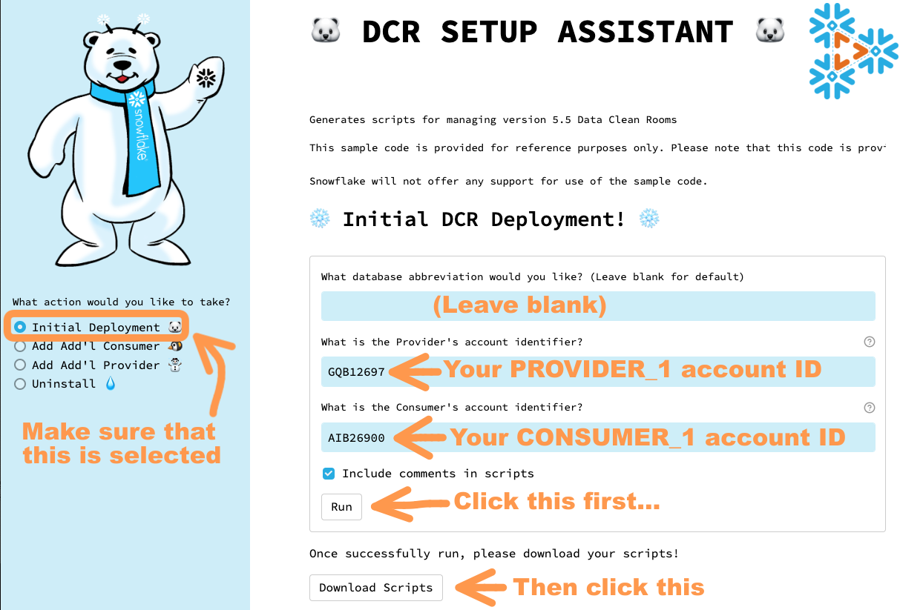

Note that you should leave the database abbreviation field blank, as I've done.  

Now click the **Run** button.  You'll see a fun snowfall animation, and then a **Scripts Ready for Download!** message will display.  At that point you can click the **Download Scripts** button, which will initiate the download of a file called `dcr_scripts.zip` to your local machine.  Go ahead and unzip this file, which contains a set of SQL scripts that were custom-generated by the DCR Setup Assistant for your specific account IDs:
- `provider_init.sql`
- `provider_data.sql`
- `provider_templates.sql`
- `consumer_init.sql`
- `consumer_data.sql`
- `provider_enable_consumer.sql`
- `consumer_request.sql`

Your script files may be prefixed with numbers.  That's okay.  Let's move on...

<!-- ------------------------ -->
## Create A Two-Party Data Clean Room
Duration: 12

We're now ready to run the scripts that the DCR Setup Assistant generated for us.  Let's get started!

### Run The Provider Initialization Script
Open a new worksheet in the **PROVIDER_1** account's UI and rename it to `provider_init.sql`.  Next, either import or copy/paste the contents of the `provider_init.sql` script into this new worksheet.
Go ahead and run the entire script - the easiest way to do this is to place your cursor anywhere in the worksheet, do a "Select All", and then click the blue triangle run button in the upper-right corner.  The script should run without error.  Note that it is designed to be re-runnable, so if you do encounter any issues (or if it gets "stuck" for any reason) you can confidently re-run the entire script as needed.  It should complete execution within 1-2 minutes.

Take a look at the database and schemas that were created during its execution.  You should notice that a database called `DCR_SAMP_PROVIDER_DB` has been created - this database contains all of the Provider's DCR objects.  For future reference, the [DCR Setup Assistant App](https://snowflake-labs-sfquickstart-data-cle-dcr-setup-assistant-bkx7gg.streamlitapp.com/) that we used to generate these scripts will replace `DCR_SAMP` prefix here with whatever you put into the "Database Abbreviation" field (we simply left that field blank for the purposes of this Quickstart, however).  I'll provide more details about the rest of the objects that the script created in this database later - for now, however, let's continue on!

### Run The Provider Data and Templates Scripts

Open a new worksheet in the **PROVIDER_1** account's UI and rename it to `provider_data.sql`.  Next, either import or copy/paste the contents of the `provider_data.sql` script into this new worksheet, and then run it in its entirety just like you did in the prior step.  As before, this script should run without error, and can be re-run if needed.

Do likewise for the  `provider_templates.sql` script.  Note, however, that this script _is not_ designed to be re-runnable, so if you do happen to encounter any issues then you'll want to completely clean out the `DCR_TEMPLATES` table before running it again by executing this command:

``` sql
delete from dcr_samp_provider_db.templates.dcr_templates;
```

### Run The Consumer Initialization and Data Scripts
Open a new worksheet in the **CONSUMER_1** account's UI and rename it to `consumer_init.sql`.  Either import or copy/paste the contents of the `consumer_init.sql` script into this new worksheet. Go ahead and run the entire script, just like you did for the Provider account scripts.  It should run without error within 1-2 minutes, and - like its **Provider Initialization Script** counterpart - is designed to be re-runnable as needed. 

Do likewise for the  `consumer_data.sql` script.

Notice how these scripts have created _two_ databases - `DCR_SAMP_APP` and `DCR_SAMP_CONSUMER` - in addition to a variety of schemas.  Again, I'll provide more details about the objects in these schemas later.

### Run The Consumer Enablement Script
It's now time to enable the newly-created Consumer.  This is done from the Provider's account, so return to the **PROVIDER_1** account's UI and open a new worksheet named `provider_enable_consumer.sql`.  
Either import or copy/paste the contents of the `provider_enable_consumer.sql` script into this new worksheet and run it in its entirety.  

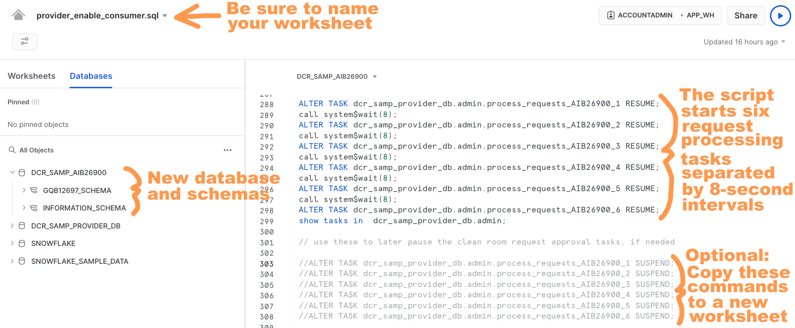

As noted in the screenshot above, the script starts a fleet of six request processing tasks separated by 8-second intervals.  Each task is scheduled to run once a minute.  If you look at the definition of each task, you'll note the inclusion of a `WHEN` clause that checks for data in a [stream object](https://docs.snowflake.com/en/user-guide/streams.html) defined for the Consumer's `REQUESTS` table before running the task.  For example:

``` sql
CREATE OR REPLACE TASK dcr_samp_provider_db.admin.process_requests_AIB26900_1
  SCHEDULE = '1 minute'  WAREHOUSE = 'app_wh'
WHEN SYSTEM$STREAM_HAS_DATA('dcr_samp_provider_db.admin.request_stream_AIB26900')
AS call dcr_samp_provider_db.admin.process_requests('AIB26900');
```

We'll discuss this stream object later.  For now, just know that the `WHEN` clause in these task definitions ensures that each task only runs when there's at least one request waiting to be processed, which allows the `APP_WH` virtual warehouse to shut down when the DCR deployment isn't in use.  That's right - these tasks _won't_ consume credits until a new record is added to the Consumer's `REQUESTS` table, so there's no need for concern!  But if you ever do need to shut them down then simply copy the corresponding `SUSPEND` commands to a new worksheet, uncomment, and run (I've highlighted as "Optional" in the screenshot above).


<!-- ------------------------ -->
## Clean Room Objects
Duration: 25

Now that we have our two-party DCR deployed, let's take a look at what's been created for us.  As we examine the various components, we'll build ourselves an object map that we can use later to keep track of where everything is located and how it all works together.

### Provider's Source Tables and Row Access Policy

Let's start off with looking at the source tables in the **PROVIDER_1** account's UI.  It turns out that the `provider_data.sql` script created three sample tables: `CUSTOMERS`, `EXPOSURES`, and `SUBSCRIPTIONS`.  We'll use these later when we run through a demo of the DCR - but, for now, just know that these are the three datasets that PROVIDER_1 is contributing to the DCR.  You'll find them in the `DCR_SAMP_PROVIDER_DB` database, under `SHARED_SCHEMA`:

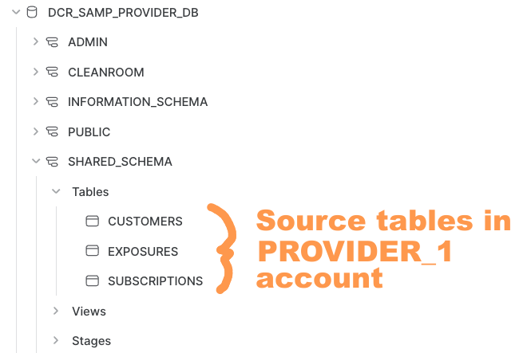

Now, go back and open your `provider_init.sql` worksheet, then scroll down to where the `DATA_FIREWALL` row access policy is created:

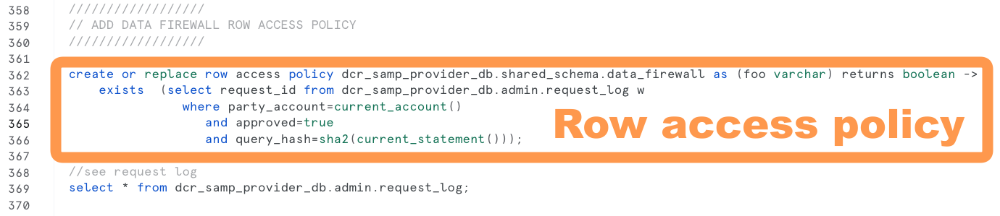

You'll recall from my [Build A Data Clean Room in Snowflake](../build_a_data_clean_room_in_snowflake) Quickstart how a row access policy acts as a _Data Firewall_ to protect the Provider's data.  Well, here it is again, protecting these three tables in `SHARED_SCHEMA`.  Now, you'll notice that the row access policy is coded such that it leverages the `REQUEST_LOG` table that's located in the `ADMIN` schema.  Although this table logs _all_ query approval requests, you should observe that the row access policy is coded such that it only allows queries that have been flagged as **Approved** to return data to the Consumer.  That other Quickstart had two tables (`REQUEST_STATUS` and `APPROVED_QUERY_REQUESTS`) so this is definitely a more elegant approach.  Notice also that this row access policy references a `PARTY_ACCOUNT` column, which enables multi-party DCR deployments (we'll look at this later). 

> aside positive
> 
>  Even though the `DATA_FIREWALL` row access policy has been created, we haven't yet looked at how it actually gets activated.  We'll do that shortly when we look at a set of Secure Views that sit on top of these source tables.

Let's begin drawing a map of the DCR objects we've explored so far:

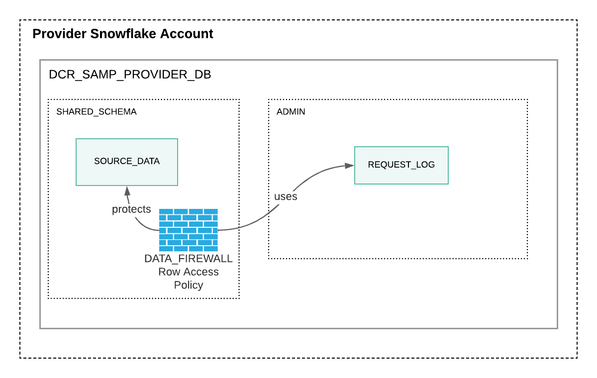

Lovely.  We're off to a good start.

### Provider Query Templates

Now that we know where the Provider's source data lives and how it's protected, let's take a look at how query requests from the Consumer get processed.  You'll recall from my [Build A Data Clean Room in Snowflake](../build_a_data_clean_room_in_snowflake) Quickstart that each Consumer query request was the combination of a query template along with one or more available values, and that these were stored in tables called `QUERY_REQUESTS`, `QUERY_TEMPLATES`, and `AVAILABLE_VALUES` respectively.  Well, one of the big improvements offered by this **v5.5** DCR deployment is the use of [Jinja SQL templating language tags and logic](https://github.com/sripathikrishnan/jinjasql).  I say that because Jinja SQL templates provide far better protection against [SQL Injection attacks](https://en.wikipedia.org/wiki/SQL_injection) than the rudimentary JavaScript-based approach used by the prior Quickstart, plus they enable the use of conditionals and looping constructs as part of the SQL template definition.  In other words, they offer us a more powerful and secure language for defining the query templates that will be used by our DCR environment.  

We installed some sample templates during our deployment process, and you'll find them in your `provider_templates.sql` worksheet.  If you study them over, you'll see how we leverage some of that nifty conditional and looping logic in our SQL query template definitions, along with how substitution parameters are specified:   

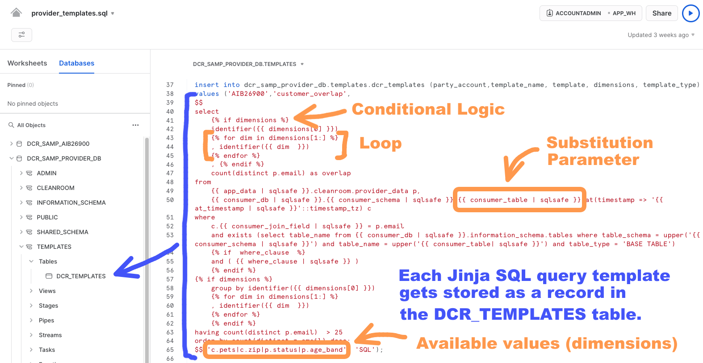

Another thing you should notice is how the list of available values gets included as part of the template definition records (we'll refer to these as "dimensions" from now on).  This is - once again - a more elegant approach than that of the prior Quickstart as it elimates the need for a separate `AVAILABLE_VALUES` table.  We'll spend some more time with these templates later when we run through a demo of the DCR.

While we're on the subject of Jinja templates, there's one more thing I'd like to point out.  The [logic used for processing these Jinja templates is Python-based](https://github.com/sripathikrishnan/jinjasql), which works out well because Snowflake provides great support for writing [stored procedures](https://docs.snowflake.com/en/sql-reference/stored-procedures-python.html) and [user-defined functions (UDFs)](https://docs.snowflake.com/en/developer-guide/udf/python/udf-python.html) using Python.  You'll find the `TEMPLATES.GET_SQL_JINJA` UDF defined in the `provider_init.sql` script.

We'll hold off on updating our DCR object map for a moment, since things are about to get a lot more interesting...

### Provider Request Processing

The next bit we need examine is the processing logic that determines whether or not incoming Consumer query requests are approved.  This logic is contained within the `ADMIN.PROCESS_REQUESTS` stored procedure, which is deployed by the `provider_enable_consumer.sql` script.  There's a lot going on here, so let's break it down.  Here we go:

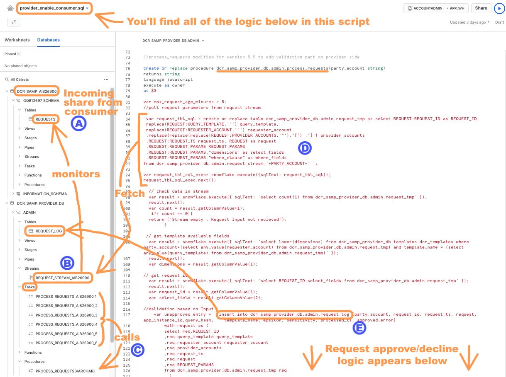

- **A:** Consumer requests permission to run a query template with one (or more) dimensions.  This is written as record to a `REQUESTS` table that has been [shared](https://docs.snowflake.com/en/user-guide/data-sharing-provider.html) with the Provider.  Note that the `provider_enable_Consumer.sql` script creates a database in the Provider's account using this incoming share, and names it using the Consumer's Account Identifier. 
- **B:** A [stream object](https://docs.snowflake.com/en/user-guide/streams.html) in the Provider's `ADMIN` schema monitors the aforementioned `REQUESTS` table so that it can be checked for incoming requests.
- **C:** The `ADMIN.PROCESS_REQUESTS` stored procedure is called by a fleet of six request processing tasks separated by 8-second intervals.  As we discussed earlier, each task definition includes a `WHEN` clause that checks for data in the stream object to ensure execution takes place only when there's at least one request waiting to be processed.  
- **D:** When at least one request is ready for processing, the `ADMIN.PROCESS_REQUESTS` stored procedure will fetch the waiting request record(s) from the stream.  Note that this stored procedure is deployed by the `provider_enable_consumer.sql` script, so that's the place to look if you'd like to examine its processing logic.
- **E:** From there, the `ADMIN.PROCESS_REQUESTS` stored procedure evaluates the request(s) to determine whether or not approval should be granted.  The results are written to the `ADMIN.REQUEST_LOG` table.

As mentioned earlier, the `ADMIN.REQUEST_LOG` table contains a record of _all_ query approval requests, while the `SHARED_SCHEMA.DATA_FIREWALL` row access policy is coded such that it only allows Consumer queries that have been flagged as **Approved** by the `ADMIN.PROCESS_REQUESTS` stored procedure.  Also, it's worth noting that the `ADMIN.PROCESS_REQUESTS` stored procedure creates and populates an `ADMIN.REQUEST_TMP` table - this just temporarily stores the request stream data as part of the request processing flow.

Whew!  Alright, now let's update our DCR object map with all of these additional objects!

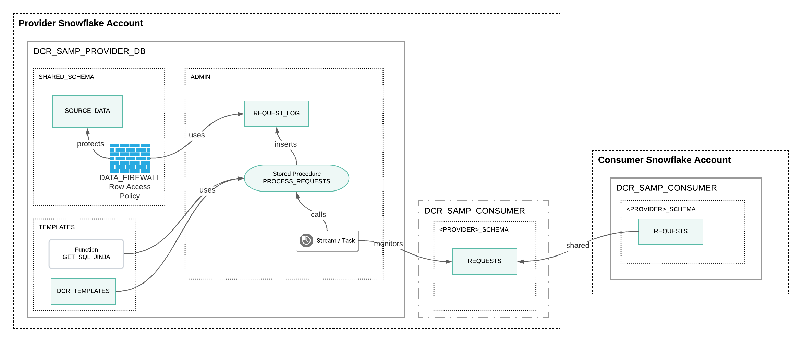

### Provider's Clean Room Objects

Now that we've examined how query requests get processed, let's take a look at the Provider's data objects that are shared with the Consumer.  If you look back at the `provider_init.sql` script you should notice the creation of a `CLEANROOM` schema, which later gets added to the `DCR_SAMP_APP` share with the Consumer account.  

Now, have a look at `provider_data.sql` script where you'll find that a set of [secure views](https://docs.snowflake.com/en/user-guide/views-secure.html) is created in the `CLEANROOM` schema on top of the `SHARED_SCHEMA` source tables.  Specifically, this script deploys the `PROVIDER_CUSTOMERS_VW`, `PROVIDER_EXPOSURES_VW`, and `PROVIDER_SUBSCRIPTIONS_VW` secure views, which correspond to the `CUSTOMERS`, `EXPOSURES`, and `SUBSCRIPTIONS` sample source tables in `SHARED_SCHEMA` respectively.  Unlike the prior Quickstart, these secure views are what actually gets shared with the Consumer within the context of the `CLEANROOM` schema (and _not_ the tables themselves).  This is a [best practice](https://docs.snowflake.com/en/user-guide/data-sharing-secure-views.html) that provides several advantages:
- Allows for row- and column-level security to be applied on a per-Consumer basis (for multitenant DCR deployments)
- Enables schema translation for Consumer consumption, as needed

It's time now to take a look at how the `DATA_FIREWALL` row access policy gets activated by the `provider_data.sql` script so that it can protect the Provider's source tables:


As you can see, our `DATA_FIREWALL` row access policy is being added to those secure views we just discussed. The end result is a combination of secure views working together with the row access policy to protect the Provider's source data in our DCR deployment.

The `provider_init.sql` script creates a some additional objects in the `CLEANROOM` schema:
- `TEMPLATES` - Secure view that allows each Consumer account to see their templates in the `TEMPLATES.DCR_TEMPLATES` table
- `PROVIDER_LOG` - Secure view that allows each Consumer to see the status of their request rows in the `ADMIN.REQUEST_LOG` table
- `PROVIDER_ACCOUNT` - Table which simply contains the Provider's Snowflake Account ID

Let's add all of these these to our DCR object map:

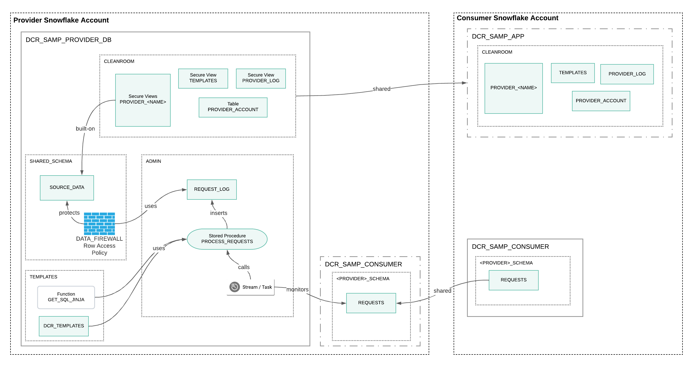

### Consumer's Source, Settings, and Instance Tables

Now let's have a look at the source tables in the **CONSUMER_1** account's UI.  Here we'll find two sample tables: `CONVERSIONS` and `CUSTOMERS` in the `DCR_SAMP_CONSUMER` database, under the `MYDATA` schema:

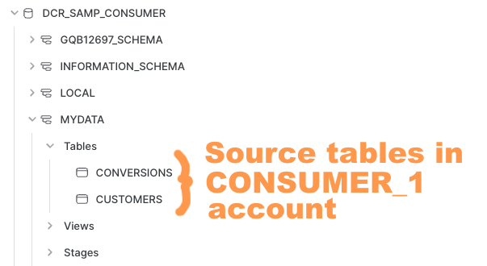

We'll use these later when we run through a demo of the DCR.

Next, take a look at the contents of the `LOCAL.USER_SETTINGS` table, which gets created at the very end of the `consumer_data.sql` script:


This relatively simple table serves an important purpose: It's the local storage object for metadata that gets used when DCR requests are created by the Consumer.  If you go back and have a look at the Jinja SQL query templates in the `provider_templates.sql` script you'll find a number of substitution parameters that directly correlate to these settings (Hint: They'll be prefixed with `consumer_` such as `consumer_email_field`).  This flexibility makes it possible for a single set of Jinja SQL query templates to be leveraged by a variety of Consumer tenants - each with their own schema definitions - within the same DCR deployment.

An additional table that gets created by the `consumer_init.sql` script is `UTIL.INSTANCE`.  This table gets populated with a single record containing a randomly-generated ID which should be unique to each Consumer instance.  

### Consumer Request Processing

Having brought up Jinja SQL templates makes for a great segue into our next topic, which is the logic behind the formation of a query request by the Consumer.  Remember that a query request is how the Consumer asks permission to run a query against the Provider's data, and it's formed by a combination of a query template along with the selection of one (or more) dimensions.  The Consumer initiates a request by calling the `REQUEST` stored procedure, which builds the request record and stores it in the `REQUESTS` table.  This stored procedure is deployed by the `consumer_init.sql` script.  Here's an overview of how it works:

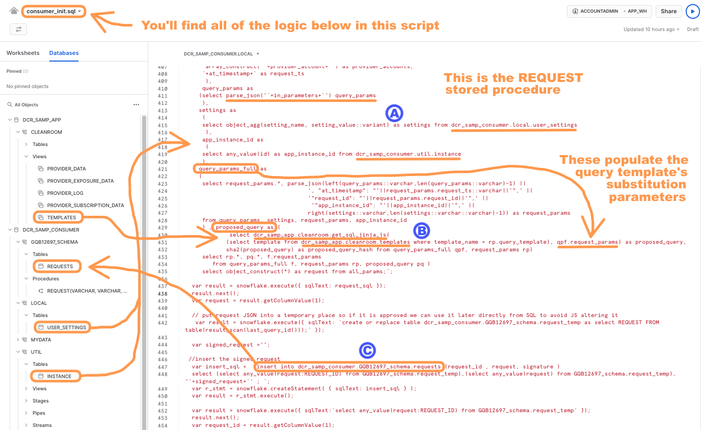

- **A:** The `REQUEST` stored procedure fetches metadata from the `LOCAL.USER_SETTINGS` table, along with the Consumer instance ID from the `UTIL.INSTANCE` table, and combines these with a JSON document containing the parameters provided by the Consumer as part of the `REQUEST` stored procedure call.  These will be used to populate the query template's substitution parameters in the next step.
- **B:** A proposed query is then constructed by the Jinja SQL interpreter UDF that we discussed earlier, which is a combination of the query template selected by the Consumer and substitution parameters populated using values from step **A** above.
- **C:** The completed request record is written to the `REQUESTS` table.

As mentioned earlier, the `REQUESTS` table that has been [shared](https://docs.snowflake.com/en/user-guide/data-sharing-provider.html) with the Provider, and the records we've just written to it will now be processed by the Provider's `PROCESS_REQUEST` stored procedure as described earlier.  

Well now, it looks like we've worked our way through everything.  Here's the final version of our DCR object map with all of the Provider and Consumer objects filled in:

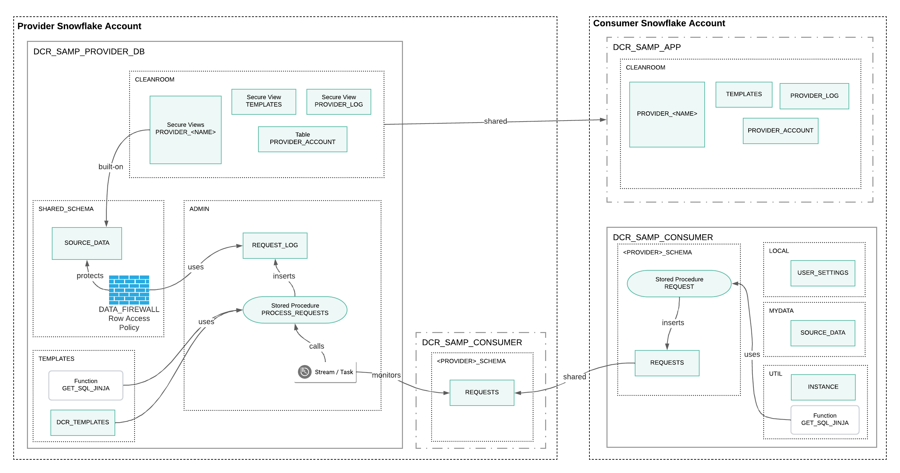

<!-- ------------------------ -->
## Two-Party Data Clean Room Demo
Duration: 12

Now that we've got a good idea of where everything's located and how it all works together, it's time to put our sparkly new DCR into action.  Open a new worksheet in the **CONSUMER_1** account's UI and rename it to `consumer_request.sql`.  Either import or copy/paste the contents of the `consumer_request.sql` script into this new worksheet. Go ahead and run the first couple of commands to set the current role and virtual warehouse context.  You're welcome to run the queries that appear directly below those commands if you'd like - these give you a chance to familiarize yourself with the current state of the Consumer before getting underway.

### Demo 1: Customer Overlap on EMAIL 

It's time now to run the `call` command in the first demo section that executes the `REQUEST` stored procedure for the `customer_overlap` template.  You should see a _Request Sent_ acknowledgment returned after a moment or two.  

Wait at least 5-10 seconds so that one of the fleet of tasks in the Provider's account which monitor the stream on the `REQUESTS` table will have recognized that a new request has been inserted.  That task will have thus called the `PROCESS_REQUESTS` stored procedure, which then evaluates the request and writes its decision back to the `REQUEST_LOG` table.  

You can now go ahead and run the next query, which selects from the `DCR_SAMP_APP.CLEANROOM.PROVIDER_LOG` table.  Take a look at the record that gets returned.  You should see your request's unique ID in the first column, an `APPROVED` column which shows Boolean `TRUE`, and finally a third column which contains the proposed query that was assembled for you by the `GET_SQL_JINJA` UDF.  Assuming all of this this is as I've just described, you're now approved to proceed with your query!  Here's how to do that:

1. Click on the query text cell in the third column.
2. Click on the "Copy" icon in the text focus box on the lower right (see my screenshot below).
3. Paste the query text into the worksheet beneath the `\\ run query` comment line which appears directly below the `PROVIDER_LOG` query that you just ran.
4. And, finally, run the query that you just pasted into the worksheet.

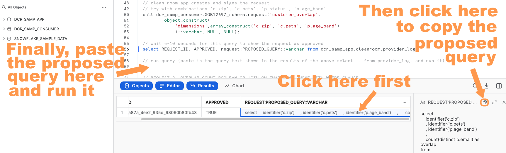

You should get a result set back which provides overlapping customer counts (called `OVERLAP` in the result set) grouped by columns `ZIP`, `PETS`, and `AGE_BAND`.  

Now for some experimentation.  Go back and have a look at the `customer_overlap` template definition in the `provider_templates.sql` script.  You'll notice that this list of dimensions is included with that template: `c.pets|c.zip|p.status|p.age_band`.  This means you're welcome to use any combination of those dimensions in your query request.  Try replacing `c.pets` with `p.status`, for example.  Or, perhaps, try adding `c.phone` to the dimension list and see what happens - The `phone` column is, after all, present in the Consumer's `CUSTOMERS` table, so why doesn't this work? (Because it's not in the template's list of approved dimensions!)

By now you've probably noticed the introduction of a timestamp associated with the Consumer's `MYDATA.CUSTOMERS` table in the text of the proposed query.  This timestamp automatically gets generated by the `REQUEST` stored procedure if it gets called with a _null_ value passed for the `AT_TIMESTAMP` parameter.  Although the `AT_TIMESTAMP` parameter is optional for two-party DCR deployments, it _must_ be specified when multiple Providers are present in order to ensure cross-timezone compatibility.  Just something to keep in mind if you end up deploying a multi-provider DCR.

### Demo 2: Customer Overlap on EMAIL or PHONE

Go ahead and work through the query request in the second demo section.  This request demonstrates the inclusion of a `WHERE` clause in addition to the list of dimensions.  Also, if you compare the  `customer_overlap_waterfall` template it requests with that of the prior example (`customer_overlap`) you should notice that it joins the Provider and Consumer datasets on matches between `EMAIL` _or_ `PHONE` columns - hence the inclusion of _Waterfall_ in the template name.  Execution of the proposed query - once approved - might take a bit longer to complete than the prior example did.  Feel free to experiment with the list of dimensions and the `WHERE` clause, and note that you can even remove the `WHERE` clause if you want to.

Another thing you may have noticed in the text of the proposed query is the inclusion of a `having count(distinct p.email)  > 25` clause.  This aggregate threshhold is included in the query template to reduce the risk of _Thin-Slicing_, an attack whereby a Consumer attempts to isolate specific records in the Provider's dataset.  This particular clause prevents the query from returning any groups of fewer than 25 records as an example.

### Demo 3: Campaign Conversions

The `campaign_conversion` template for this request joins the Providers advertising campaign exposure dataset with the Consumer's customer conversion data to help evaluate advertising campaign effectiveness.  You can use the same techniques as with the prior examples to check for request approval and to run the proposed query.  Again, feel free to experiment - both with the request process as well as testing out that `DATA_FIREWALL` row access policy.

> aside negative
> 
>  The demo sections that appear after this point are intended for execution in DCR deployments with multiple Providers and Consumers (see the next section for a discussion on that topic)

<!-- ------------------------ -->
## Adding Tables, Templates, Consumers, and Providers
Duration: 10

Now that you've got your framework implemented and a pretty good understanding of how it all works, it's time to figure out what's next in your DCR journey.  Here's some options...

### Adding Additional Provider Source Tables

Use the following steps as a guide for adding additional source tables to the Provider side of the DCR framework:

1. Apply the `SHARED_SCHEMA.DATA_FIREWALL` row access policy to the new tables using the the commands in the "Shields Up" section of the `provider_init.sql` script as a guide.  Be sure the column referenced by the row access policy matches one that exists in the table.
2. Create secure views that reference the new tables in the `DCR_SAMP_PROVIDER_DB.CLEANROOM` schema.  You can leverage the examples provided in the `provider_data.sql` script.
3. If the new tables reside in a database other than `DCR_SAMP_PROVIDER_DB` then you'll need to [grant REFERENCE_USAGE](https://docs.snowflake.com/en/user-guide/data-sharing-mutiple-db.html) on that database to the `DCR_SAMP_APP` share.  For example: `grant reference_usage on database new_table_db to share dcr_samp_app;`
4. Grant `SELECT` privilege on the newly-created secure views to the `DCR_SAMP_APP` share.  For example: `grant select on dcr_samp_provider_db.cleanroom.new_secure_view to share dcr_samp_app;`

The newly-created secure views can now be referenced in query templates and used as part of future DCR requests.

### Adding Additional Templates

As mentioned earlier, this DCR's query templates leverage [Jinja SQL templating language tags and logic](https://github.com/sripathikrishnan/jinjasql) for query request processing.  Use the `provider_templates.sql` script as a guide for writing your own templates, especially as it pertains to conditional and looping logic.

You'll likely make extensive use of substitution parameters in these templates, which are denoted using double braces (eg. `{{parameter_name}}`).  Substitution parameters can refer to:
- Metadata from the Consumer's `LOCAL.USER_SETTINGS` table
- The Consumer's instance ID from the `UTIL.INSTANCE` table
- Parameters provided by the Consumer as part of the `REQUEST` stored procedure call (such as the dimension or WHERE clause)

All templates reside as records in the `TEMPLATES.DCR_TEMPLATES` table, and each is assigned to a corresponding Consumer account ID by way of the `PARTY_ACCOUNT` column value.  

### Adding Additional Consumers

Adding additional Consumers to the DCR deployment is a relatively straightforward process.  First, it'll be necessary to acknowledge the [Snowflake Third Party Terms](https://www.snowflake.com/legal/third-party-terms/) from the new Consumer account, so follow [these instructions](https://docs.snowflake.com/en/developer-guide/udf/python/udf-python-packages.html#using-third-party-packages-from-anaconda) accordingly.  

Next, you'll want to use our [Streamlit-based DCR Setup Assistant app](https://snowflake-labs-sfquickstart-data-cle-dcr-setup-assistant-bkx7gg.streamlitapp.com/) to automate the process of generating the necessary scripts.  This time, however, you'll select the **Add Add'l Consumer** option on the action menu.  You'll be asked to provide the [account identifiers](https://docs.snowflake.com/en/user-guide/admin-account-identifier.html) for the existing Provider and the new Consumer accounts.  As before, simply click the **Run** button, wait for the fun snowfall animation and the **Scripts Ready for Download!** message to display, and then click the **Download Scripts** button.  The `dcr_scripts.zip` file that gets downloaded to your local machine will contain the custom-generated scripts that you'll need for adding the new Consumer account to your DCR deployment.  You should work through these scripts in the following order:
1. `provider_templates.sql` - Run this in the Provider account to add sample templates for the new Consumer account (or, alternatively, you can use these as a model for your own templates).
2. `provider_add_consumer_to_share.sql` - Run in the Provider account to add the new Consumer account to the `DCR_SAMP_APP` share.
3. `consumer_init.sql` - Run this in the new Consumer account to create the `DCR_SAMP_CONSUMER` database and corresponding objects.
4. `consumer_data.sql` - Run this in the new Consumer account if you'd like to create the `MYDATA` schema along with a couple of sample dataset tables.  Alternatively, you can use this script as a model for deploying your own datasets - just be certain to create a `LOCAL` schema along with a `USER_SETTINGS` table in the new Consumer account.
5. `provider_enable_new_consumer.sql` - Run this in the Provider account to create a database from the new Consumer account's `DCR_SAMP_REQUESTS` share, and to create the stream and tasks for processing query requests from the new Consumer account.

The DCR Setup Assistant also custom-generates a `consumer_request.sql` script which provides a set of commands and queries for testing the newly-created Consumer account using the templates and data deployed by the `provider_templates.sql` and `consumer_data.sql` scripts, respectively.

### Adding Additional Providers

The inclusion of additional Providers in the DCR deployment allows Consumers to run queries against each Provider independently, or to run multi-party joins across two (or more) Providers.  The process of adding an additional Provider bears some similarity to the installation process we just went through for the initial DCR deployment process.  You'll need to acknowledge the [Snowflake Third Party Terms](https://www.snowflake.com/legal/third-party-terms/) from the new Provider account before getting started, and [these instructions](https://docs.snowflake.com/en/developer-guide/udf/python/udf-python-packages.html#using-third-party-packages-from-anaconda) walk you through that process.  

Use our [Streamlit-based DCR Setup Assistant app](https://snowflake-labs-sfquickstart-data-cle-dcr-setup-assistant-bkx7gg.streamlitapp.com/) to automate the process of generating the necessary scripts.  Start by selecting the **Add Add'l Provider** option on the action menu.  You'll then be asked to provide the [account identifiers](https://docs.snowflake.com/en/user-guide/admin-account-identifier.html) for the existing Consumer and the new Provider accounts.  Click the **Run** button, wait for the fun snowfall animation and the **Scripts Ready for Download!** message to display, and then click the **Download Scripts** button.  The `dcr_scripts.zip` file that gets downloaded to your local machine will contain custom-generated scripts for adding the new Provider account to your DCR deployment.  You should work through them in the following order:
1. `provider_init.sql` - Run this in the new Provider account to create the `DCR_SAMP_PROVIDER_DB` database and corresponding objects.
2. `provider_data.sql` - Run this in the new Provider account if you'd like to create the sample dataset tables in `SHARED_SCHEMA`, along with their corresponding `CLEANROOM` schema secure views.  This script also adds the `DATA_FIREWALL` row access policy those secure views.  Alternatively, you can use this script as a model for deploying your own datasets.
3. `provider_templates.sql` - Run this in the new Provider account to add templates for the sample datasets, or use these as a model for your own datasets.  Note that the _Multiparty_ templates demonstrate how to Consumer data can be joined with datasets from multiple Provider accounts.
4. `consumer_init_new_provider.sql` - Run this in the Consumer account to create the Provider-specific schema in the `DCR_SAMP_CONSUMER` database for submitting query requests to the new Provider.
5. `provider_enable_consumer.sql` - Run this in the new Provider account to create a database from the Consumer account's `DCR_SAMP_REQUESTS` share, and to create the stream and tasks for processing requests from the Consumer account.

The DCR Setup Assistant also custom-generates a `consumer_request.sql` script which provides a set of commands and queries for testing the newly-created Provider account using the templates and data deployed by the `provider_templates.sql` and `provider_data.sql` scripts, respectively.  You'll want to look specifically at the _Multiparty_ scenarios in this script to see how the Consumer initiates requests for joining their data with datasets from multiple Provider accounts, paying particular attention to how the UTC timestamp gets passed to the `REQUEST` stored procedure to ensure compatibility with Providers in different timezones.

> aside negative
> 
>  You'll need to run through the above sequence for _each_ Consumer account when adding additional Provider accounts into a DCR deployment where multiple Consumer accounts are present.


<!-- ------------------------ -->
## Reset / Drop
Duration: 2

### Quick Reset
This simply restores the DCR deployment to its original state (no query requests or approved queries):
- Consumer account - Delete the contents of the `REQUESTS` table in the Provider-specific schema of the `DCR_SAMP_CONSUMER` database.
- Provider account - Delete the contents of the `DCR_SAMP_PROVIDER_DB.ADMIN.REQUEST_LOG` table.  

### Drop All Quickstart Objects
Our [Streamlit-based DCR Setup Assistant app](https://snowflake-labs-sfquickstart-data-cle-dcr-setup-assistant-bkx7gg.streamlitapp.com/) generates custom scripts to automate the process of dropping all objects associated with the DCR deployment from Consumer and/or Provider accounts.  

<!-- ------------------------ -->
## Conclusion
Duration: 1

Congratulations!  You've just deployed a powerful Snowflake DCR that is capable of joining data from two (or more) parties without on PII fields without either party their full dataset to the other.  And by doing so you've gotten a first-hand look at Snowflake's [unique DCR deployment architecture](https://www.snowflake.com/blog/distributed-data-clean-rooms-powered-by-snowflake/).

### What You’ve Learned 
- How to create and deploy a DCR environment between two Snowflake accounts
- How DCR query requests are initiated from one Snowflake account to another
- How DCR query requests are reviewed and approved (or declined)
- How approved DCR query requests are executed

### Next Steps
I'd like to recommend some further reading for you:
- Blog Post: [Enabling the Future of Cross-Cloud Data Collaboration with Snowflake Data Clean Rooms and NBCUniversal](https://www.snowflake.com/blog/enabling-the-future-of-cross-cloud-data-collaboration-with-snowflake-data-clean-rooms-and-nbcuniversal/)
- Blog Post: [The Snowflake Media Data Cloud Enables Disney Advertising Sales’ Innovative Clean Room Data Solution](https://www.snowflake.com/blog/the-snowflake-media-data-cloud-powers-disneys-innovative-advertising-platform/)
- Article: [Using A Data Clean Room For Business Growth](https://www.snowflake.com/trending/data-clean-room-for-business-growth)
- Webinar: [Secure Data Sharing with Data Clean Rooms in the Data Cloud](https://resources.snowflake.com/webinars-thought-leadership/secure-data-sharing-with-data-clean-rooms-in-the-data-cloud)
- Solution Brief: [Monetize Your First-Party Data Using Snowflake Data Clean Rooms](https://resources.snowflake.com/solution-briefs/monetize-your-first-party-data-using-snowflake-data-clean-rooms)

<!-- ------------------------ -->
## Appendix - Object Map

### DCR Deployment Object Map


