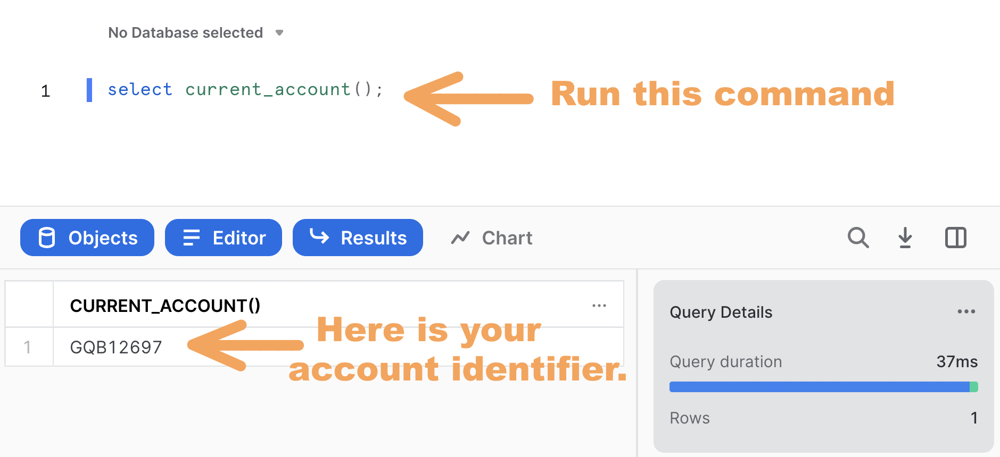
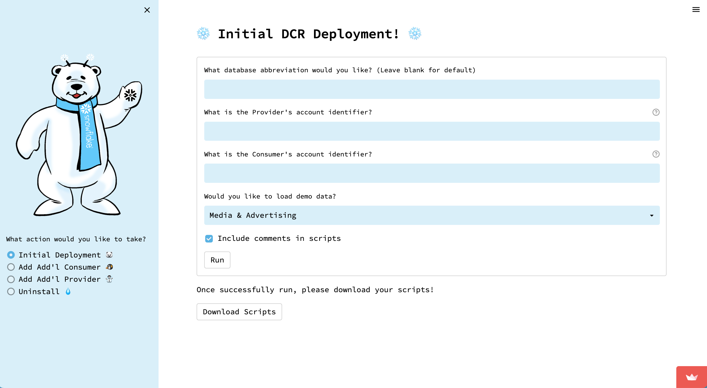
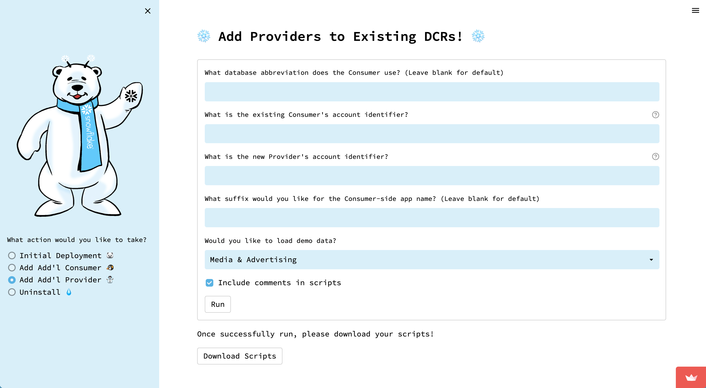
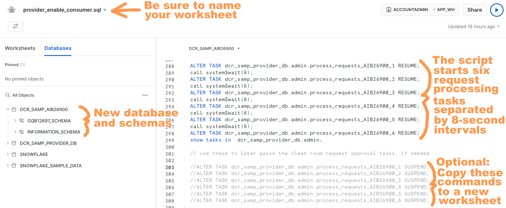
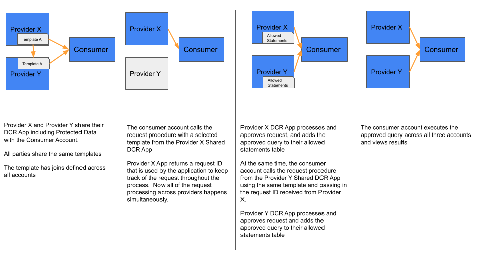
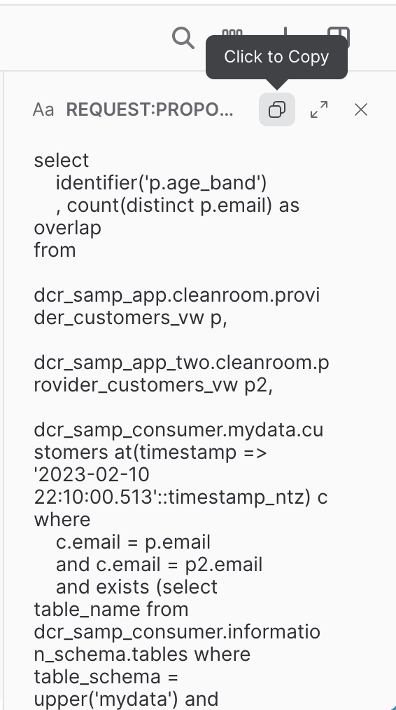
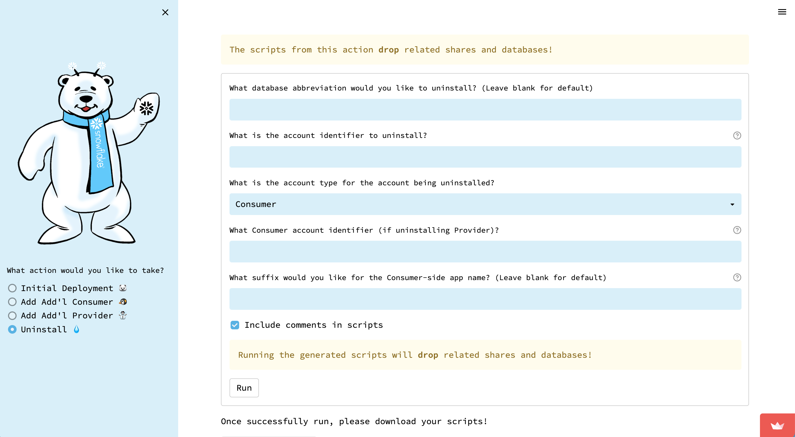

author: Rachel Blum, Jim Warner
id: build_a_multiparty_clean_room_in_snowflake
summary: Learn how to build a simple three-party Data Clean Room in Snowflake
categories: data-engineering,app-development,solution-examples
environments: web
status: Published
feedback link: https://github.com/Snowflake-Labs/sfguides/issues
tags: Getting Started, Data Clean Rooms, Data Engineering

# Build a Multiparty Data Clean Room in Snowflake
<!-- ------------------------ -->
## Overview 
Duration: 5

Data Clean Rooms (DCRs) are secure environments that enable multiple organizations (or divisions of an organization) to bring data together for joint analysis under defined guidelines and restrictions that keep the data secure.  These guidelines control what data comes into the clean room, how the data within the clean room can be joined with other data in the clean room, the kinds of analytics that can be performed on the clean room data, and what data - if any - can leave the clean room environment.  

A common use case for DCRs is publishers sharing advertising impression data with advertisers. Of course, big advertisers work with multiple publishers, and it is common for advertisers to understand the incremental reach of their media.  For a longer discussion of this, see the [Reach and Frequency Quickstart](https://quickstarts.snowflake.com/guide/reach_and_frequency_queries/index.html#0).  In order to answer this question in a DCR environment, a multiparty clean room is needed.  In this Quickstart, we walk through answering this question using a three-party data clean room with two providers (publishers) and one consumer (the advertiser).

> aside negative
> 
>  **Caveat:** This Data Clean Room QuickStart is for illustrative purposes only, as a hands-on lab intended to show some of the basic features used to build a data clean room on Snowflake. The result of this lab must not be used in a production environment.

### Prerequisites
- Familiarity with Snowflake's [unique DCR architecture](https://www.snowflake.com/blog/distributed-data-clean-rooms-powered-by-snowflake/)
- Working knowledge with Snowflake database objects and the [Snowflake Web UI](https://docs.snowflake.com/en/user-guide/ui-web.html)
- Clear understanding of how Snowflake [Secure Data Sharing](https://docs.snowflake.com/en/user-guide/data-sharing-intro.html) works
- Experience going through the [two-party Data Clean Room Quickstart](https://quickstarts.snowflake.com/guide/build_a_data_clean_room_in_snowflake_advanced/index.html?index=..%2F..index#0)


### What you’ll learn 
- How to create and deploy a DCR environment between three Snowflake accounts
- How the two-party clean room can be extended to a third account (a second provider)

### What you’ll build 
This Quickstart lab will walk you through the process of deploying a Snowflake **v5.5** DCR environment, which is our latest General Availability (GA) release. 
- Shows a multi-party DCR environment
- Leverages Jinja SQL templating language tags and logic
- Includes example query templates for some common advertising scenarios

### What you’ll need 
- **Three** Snowflake accounts - either [Enterprise or Business Critical edition](https://docs.snowflake.com/en/user-guide/intro-editions.html) - that are deployed in the **same** [cloud provider and region](https://docs.snowflake.com/en/user-guide/intro-regions.html). You may procure these as [Snowflake 30-day free trial accounts](https://docs.snowflake.com/en/user-guide/admin-trial-account.html) to make things easier for you - Simply go through the signup process three times on [signup.snowflake.com](https://signup.snowflake.com), making certain to select the **same cloud provider and region** for each. You may reuse the two accounts created for the [two-party Data Clean Room Quickstart](https://quickstarts.snowflake.com/guide/build_a_data_clean_room_in_snowflake_advanced/index.html?index=..%2F..index#0), if they are still available, and simply add a third.
- Logins to **all** of the Snowflake accounts should have [ACCOUNTADMIN role access](https://docs.snowflake.com/en/user-guide/security-access-control-considerations.html) (note that [Snowflake free trial accounts](https://docs.snowflake.com/en/user-guide/admin-trial-account.html) provide this automatically, which is why I suggest using them for this Quickstart).

### Attribution
This Quickstart draws heavily on the [one written by Craig Warman](https://quickstarts.snowflake.com/guide/build_a_data_clean_room_in_snowflake_advanced/index.html?index=..%2F..index#0).

<!-- ------------------------ -->
## Getting started
Duration: 10

### Log into all Snowflake accounts
First, you must log in to each of the accounts created earlier.  As mentioned, the logins that you use for these Snowflake accounts must have [ACCOUNTADMIN role access](https://docs.snowflake.com/en/user-guide/security-access-control-considerations.html) and all accounts must be deployed in the **same** [cloud and region](https://docs.snowflake.com/en/user-guide/intro-regions.html). You should now log in to each account simultaneously using separate browser tabs or windows.

### Designate two provider accounts and one consumer account
Two of the three accounts will be providers (publishers), and the third account will be the consumer.  Designate one as the first provider, PROVIDER_1, another as the second, PROVIDER_2, and the third as the consumer, CONSUMER_1.

### Acknowledge Snowflake Third Party Terms
This DCR deployment utilizes open-source Python packages that are built and provided by Anaconda.  Consequently it'll be necessary to acknowledge the [Snowflake Third Party Terms](https://www.snowflake.com/legal/third-party-terms/) before proceeding.  You can do this by following [these instructions](https://docs.snowflake.com/en/developer-guide/udf/python/udf-python-packages.html#using-third-party-packages-from-anaconda) in _all three_ accounts: the PROVIDER_1, PROVIDER_2 and CONSUMER_1 accounts.  Again, you _must_ successfully complete this step in order to proceed with the DCR installation process.

### Note PROVIDER_1, PROVIDER_2, and CONSUMER_1 account identifiers
Each Snowflake account is assigned [a unique identifier](https://docs.snowflake.com/en/user-guide/admin-account-identifier.html) (sometimes called a Locator) within its cloud provider and region.  If you took my recommendation to use [Snowflake 30-day free trial accounts](https://docs.snowflake.com/en/user-guide/admin-trial-account.html) then these will be a random combination of letters and numbers, such as "GQB12697".  Please go ahead and determine your account identifiers by opening a new worksheet and running the following command in each account's UI:

``` sql
select current_account();
```

It should look like the following:



Be sure to note which account identifier corresponds to the PROVIDER_1, PROVIDER_2 and CONSUMER_1 accounts as you will need these later.

### Generate PROVIDER_1 and CONSUMER_1 setup scripts
First, we generate the scripts for the first provider and the consumer as in the [two-party Quickstart](https://quickstarts.snowflake.com/guide/build_a_data_clean_room_in_snowflake_advanced/index.html?index=..%2F..index#0). If re-using the accounts used previously for the two-party Quickstart, you do not have to repeat this section.  If not, please follow the below.

You will use the account identifiers collected above to prepare the clean room deployment scripts.  In this Quickstart, we will use the [Streamlit-based DCR Setup Assistant app](https://snowflake-labs-sfquickstart-data-cle-dcr-setup-assistant-bkx7gg.streamlitapp.com/) to automate the process.

First, [click here](https://snowflake-labs-sfquickstart-data-cle-dcr-setup-assistant-bkx7gg.streamlitapp.com/) to open our Streamlit-based DCR Setup Assistant app.



Next, place your PROVIDER_1 and CONSUMER_1 account identifiers in their respective fields. Note that you should leave the database abbreviation field blank.  Make sure to load the Media & Advertising demo data, as this will be used in the examples below.

Now click the **Run** button.  You'll see a fun snowfall animation, and then a **Scripts Ready for Download!** message will display.  At that point you can click the **Download Scripts** button, which will initiate the download of a file called `dcr_scripts.zip` to your local machine.  Go ahead and unzip this file, which contains a set of SQL scripts that were custom-generated by the DCR Setup Assistant for your specific account IDs:
- `1 - provider_init.sql`
- `2 - provider_data.sql`
- `3 - provider_templates.sql`
- `4 - consumer_init.sql`
- `5 - consumer_data.sql`
- `6 - provider_enable_consumer.sql`
- `7 - consumer_request.sql`

### Generate scripts for additional provider for PROVIDER_2

Next, you will use the [DCR Setup Assistant app](https://snowflake-labs-sfquickstart-data-cle-dcr-setup-assistant-bkx7gg.streamlitapp.com/) again to add an additional provider to our clean room.  First, select **Add Add'l Provider** on the left.  It will look as follows:



Fill the new PROVIDER_2 identifier to the **What is the Provider's account identifier?** field and put the CONSUMER_1 identifier in the **What is the Consumer's account identifier?** field. Next, click **Run**.  Once the scripts are ready to download, click **Download Scripts** and another zip file will be downloaded.  Unzip the file, and the following scripts will be present:
- `1 - provider_init.sql`
- `2 - provider_data.sql`
- `3 - provider_templates.sql`
- `4 - consumer_init_new_provider.sql`
- `5 - provider_enable_consumer.sql`
- `6 - consumer_request.sql`

<!-- ------------------------ -->
## Run the scripts to create the clean room for first provider and consumer
Duration: 12

Next we need to run the scripts generated by the Setup Assistant to create the clean room.  If you have run through the two-party DCR Quickstart, and have not cleaned up the created objects, you can skip ahead to the second provider section.

### Run the first provider initialization script

Open a new worksheet in the **PROVIDER_1** account and rename it to `provider_init.sql`.  Next, either import or copy/paste the contents of the `1 - provider_init.sql` script into this new worksheet.
Run the entire script - the easiest way to do this is to place your cursor anywhere in the worksheet, do a "Select All", and then click the blue triangle run button in the upper-right corner.  The script should run without error.  Note that it is designed to be re-runnable, so if you do encounter any issues (or if it gets "stuck" for any reason) you can confidently re-run the entire script as needed.  It should complete execution within 1-2 minutes.

Take a look at the database and schemas that were created during its execution.  You should notice that a database called `DCR_SAMP_PROVIDER_DB` has been created - this database contains all of the Provider's DCR objects.  For future reference, the [DCR Setup Assistant App](https://snowflake-labs-sfquickstart-data-cle-dcr-setup-assistant-bkx7gg.streamlitapp.com/) that we used to generate these scripts will replace `DCR_SAMP` prefix here with whatever you put into the "Database Abbreviation" field (we simply left that field blank for the purposes of this Quickstart, however).

### Run the provider data and templates scripts

Open a new worksheet in the **PROVIDER_1** account and rename it to `provider_data.sql`.  Next, either import or copy/paste the contents of the `2 - provider_data.sql` script into this new worksheet, and then run it in its entirety just like you did in the prior step.  As before, this script should run without error, and can be re-run if needed.

Do likewise for the `3 - provider_templates.sql` script.  Note, however, that this script _is not_ designed to be re-runnable, so if you do happen to encounter any issues then you'll want to completely clean out the `DCR_TEMPLATES` table before running it again by executing this command:

``` sql
delete from dcr_samp_provider_db.templates.dcr_templates;
```

### Run the consumer initialization and data scripts
Open a new worksheet in the **CONSUMER_1** account and rename it to `consumer_init.sql`.  Either import or copy/paste the contents of the `4 - consumer_init.sql` script into this new worksheet. Go ahead and run the entire script, just like you did for the Provider account scripts.  It should run without error within 1-2 minutes, and - like its **Provider Initialization Script** counterpart - is designed to be re-runnable as needed. 

Do likewise for the  `5 - consumer_data.sql` script.

Notice how these scripts have created _two_ databases - `DCR_SAMP_APP` and `DCR_SAMP_CONSUMER` - in addition to a variety of schemas.  Again, I'll provide more details about the objects in these schemas later.

### Run the consumer enablement script

Next you will enable the newly-created Consumer.  This is done from the first provider's account, so return to the **PROVIDER_1** account's UI and open a new worksheet named `provider_enable_consumer.sql`.  
Either import or copy/paste the contents of the `provider_enable_consumer.sql` script into this new worksheet and run it in its entirety.  



As noted in the screenshot above, the script starts a fleet of six request processing tasks separated by 8-second intervals.  Each task is scheduled to run once a minute.  If you look at the definition of each task, you'll note the inclusion of a `WHEN` clause that checks for data in a [stream object](https://docs.snowflake.com/en/user-guide/streams.html) defined for the Consumer's `REQUESTS` table before running the task.  For example:

``` sql
CREATE OR REPLACE TASK dcr_samp_provider_db.admin.process_requests_AIB26900_1
  SCHEDULE = '1 minute'  WAREHOUSE = 'app_wh'
WHEN SYSTEM$STREAM_HAS_DATA('dcr_samp_provider_db.admin.request_stream_AIB26900')
AS call dcr_samp_provider_db.admin.process_requests('AIB26900');
```

We'll discuss this stream object later.  For now, just know that the `WHEN` clause in these task definitions ensures that each task only runs when there's at least one request waiting to be processed, which allows the `APP_WH` virtual warehouse to shut down when the DCR deployment isn't in use.  That's right - these tasks _won't_ consume credits until a new record is added to the Consumer's `REQUESTS` table, so there's no need for concern!  But if you ever do need to shut them down then simply copy the corresponding `SUSPEND` commands to a new worksheet, uncomment, and run (I've highlighted as "Optional" in the screenshot above).

## Run scripts for additional provider
Duration: 12

Next we will run the scripts produced for adding the additional provider.

### Run the second provider initialization and data scripts

Here you will follow the same process that you followed for the first provider in the account of the second provider.  Create worksheets for `1 - provider_init.sql` and `2 - provider_data.sql` and run the entire scripts, in turn.  As noted previously, these scripts are designed to be idempotent, so they can be re-run if you run into any problems.

### Run the second provider templates script

As before with the first provider's templates script, you will run `3 - provider_templates.sql` in its entirety.  Keep in mind that as with the first provider, this script is not designed to be run multiple times.

### Initialize the second provider with the consumer

Next, we return to CONSUMER_1 to initialize the connection to the new PROVIDER_2. Open the UI for CONSUMER_1 and create a new worksheet named `consumer_init_new_provider.sql` and import or paste the code from `4 - consumer_init_new_provider.sql`. Run the code in its entirety.

### Run the consumer enablement script from the second provider

Next you will enable the consumer.  This is done from the second provider's account, so return to the **PROVIDER_2** account's UI and open a new worksheet named `provider_enable_consumer.sql`.  
Either import or copy/paste the contents of the `provider_enable_consumer.sql` script into this new worksheet and run it in its entirety.  This works the same as the consumer enablement script run from the first provider.

## Clean Room Objects
Duration: 6

To get a detailed overview of the objects created and the architecture of the clean room, please review the details from the [previous Quickstart](https://quickstarts.snowflake.com/guide/build_a_data_clean_room_in_snowflake_advanced/index.html?index=..%2F..index#3).  In this section, we will focus just on the flow and template for the multiparty use case.

### Overall flow

The following illustrates the overall flow we will follow for the multiparty use case.



Note that the providers must share a template. The flow is then as follows:

1. The consumer makes a call to the first provider and gets the request ID.
2. The consumer calls the second provider, and provides the request ID from the first provider.
3. The consumer executes the combined query.

### Multiparty template

In order for this multiparty scenario to work, the providers must use the same template. You can see the template by running the following in one of the provider accounts.

```sql
select * from dcr_samp_provider_db.templates.dcr_templates;
```

You will see one row with the template name **customer_overlap_multiparty** with the template as follows:

```sql
select
    identifier({{ dimensions[0] }})
    
    , identifier({{ dim  }})
    
    , count(distinct p.email) as overlap
from
    {{ app_data | sqlsafe }}.cleanroom.provider_customers_vw p,
    {{ app_two_data | sqlsafe }}.cleanroom.provider_customers_vw p2,
    {{ consumer_db | sqlsafe }}.{{ consumer_schema | sqlsafe }}.{{ consumer_table | sqlsafe }} at(timestamp => '{{ at_timestamp | sqlsafe }}'::timestamp_ntz) c
where
    c.{{ consumer_join_field | sqlsafe }} = p.email
    and c.{{ consumer_join_field | sqlsafe }} = p2.email
    and exists (select table_name from {{ consumer_db | sqlsafe }}.information_schema.tables where table_schema = upper('{{ consumer_schema | sqlsafe }}') and table_name = upper('{{ consumer_table| sqlsafe }}') and table_type = 'BASE TABLE')
    
    and ( {{ where_clause | sqlsafe }} )
    
group by
    identifier({{ dimensions[0]  }})
    
    , identifier({{ dim }})
    
having count(distinct p.email)  > 25
order by count(distinct p.email) desc;
```

As you can see, this template joins the email in the consumer's table to the email in both provider's tables.

<!-- ------------------------ -->
## Three-Party Data Clean Room Demo
Duration: 12

Now that the clean room is set up, we can show how it can be used to answer reach-type questions for an advertiser.  Open a new worksheet in the **CONSUMER_1** account's UI and rename it to `consumer_request.sql`.  Either import or copy/paste the contents of the `consumer_request.sql` script into this new worksheet. Go ahead and run the first couple of commands to set the current role and virtual warehouse context.  You're welcome to run the queries that appear directly below those commands if you'd like - these give you a chance to familiarize yourself with the current state of the Consumer before getting underway.

Our goal will be to understand the overlap of CONSUMER_1 with each of PROVIDER_1 and PROVIDER_2 individually, as well as to understand the overlap of all three parties.

### Demo 1: Customer Overlap on EMAIL with PROVIDER_1

It's time now to run a `call` command like the one in the first demo section that executes the `REQUEST` stored procedure for the `customer_overlap` template.  You should see a _Request Sent_ acknowledgment returned after a moment or two.  For the example, I use the `age_band` dimension, but you should feel free to experiement with other options like `pets`, `zip`, and/or `status`. The call should look like the following:

```sql
call dcr_samp_consumer.<PROVIDER_1_ACCOUNT>_schema.request('customer_overlap',
        object_construct(
            'dimensions',array_construct('p.age_band')
            )::varchar, NULL, NULL);
```

Wait at least 5-10 seconds so that one of the fleet of tasks in the Provider's account which monitor the stream on the `REQUESTS` table will have recognized that a new request has been inserted.  That task will have thus called the `PROCESS_REQUESTS` stored procedure, which then evaluates the request and writes its decision back to the `REQUEST_LOG` table. 

You can now go ahead and run the next query, which selects from the `DCR_SAMP_APP.CLEANROOM.PROVIDER_LOG` table.

```sql
select REQUEST_ID, APPROVED, request:PROPOSED_QUERY::varchar from dcr_samp_app.cleanroom.provider_log;
```

Take a look at the record that gets returned.  You should see your request's unique ID in the first column, an `APPROVED` column which shows Boolean `TRUE`, and finally a third column which contains the proposed query that was assembled for you by the `GET_SQL_JINJA` UDF.  Assuming all of this this is as I've just described, you're now approved to proceed with your query!  Here's how to do that:

1. Click on the query text cell in the third column.
2. Click on the "Copy" icon in the text focus box on the lower right (see my screenshot below).
3. Paste the query text into the worksheet beneath the `\\ run query` comment line which appears directly below the `PROVIDER_LOG` query that you just ran.
4. And, finally, run the query that you just pasted into the worksheet.

The query should look like the following:

```sql
select
    identifier('p.age_band')
    , 
    count(distinct p.email) as overlap
from
    dcr_samp_app.cleanroom.provider_customers_vw p,
    dcr_samp_consumer.mydata.customers at(timestamp => '2023-02-10 19:15:09.697'::timestamp_ntz) c
where
    c.email = p.email
    and exists (select table_name from dcr_samp_consumer.information_schema.tables where table_schema = upper('mydata') and table_name = upper('customers') and table_type = 'BASE TABLE')
    group by identifier('p.age_band')
having count(distinct p.email)  > 25
order by count(distinct p.email) desc;
```

You should get a result set back which provides overlapping customer counts (called `OVERLAP` in the result set) grouped by column `AGE_BAND`.  

### Demo 2: Customer Overlap on EMAIL with PROVIDER_2

Now we will repeat the above process, except we will change the request to the PROVIDER_2 account schema.  Then again select the query from the `PROVIDER_LOG`, this time using `DCR_SAMP_APP_TWO` as follows:

```sql
select REQUEST_ID, APPROVED, request:PROPOSED_QUERY::varchar from dcr_samp_app_two.cleanroom.provider_log;
```

Again, select the query and run it as before.

### Demo 3: Customer overlap on EMAIL with BOTH PROVIDER_1 and PROVIDER_2

Next, we want to understand the overlap of all three parties. For the queries to use, you can scroll down to the **REQUEST 4** section of the `consumer_request.sql` notebook the CONSUMER_1 account.  Here we will edit the query to use only the `p.age_band` dimension.

First, we run the following to set the `ts` variable to be used later.

```sql
set ts = SYSDATE();
```

Next, we fire a request to the first provider as follows:

```sql
// clean room app creates and signs the request
call dcr_samp_consumer.<PROVIDER_1_ACCOUNT>_schema.request('customer_overlap_multiparty',
        object_construct(
            'dimensions',array_construct('p.age_band')
            )::varchar, NULL, $ts);
```

Next, you need to get the request ID to pass to the second provider.

```sql
// if multi-party, get request ID for use in second provider request
set request_id1 = (select request_id from dcr_samp_consumer.<PROVIDER_1_ACCOUNT>_schema.requests where request:REQUEST_PARAMS.at_timestamp::varchar=$ts);
```

Next, wait for the query to be approved by PROVIDER_1.  You can verify wih the following query:

```sql
// wait 5-10 seconds for this query to show the request as approved
select REQUEST_ID, APPROVED, request:PROPOSED_QUERY::varchar, * from dcr_samp_app.cleanroom.provider_log order by request_ts desc;
```

Now the consumer needs to pass the request ID set above in the call to the PROVIDER_2 clean room.

```sql
// clean room app creates and signs the request
call dcr_samp_consumer.<PROVIDER_2_ACCOUNT>_schema.request('customer_overlap_multiparty',
        object_construct(
            'dimensions',array_construct('p.age_band')
            )::varchar, $request_id1, $ts);
```

Once again, we wait for the query to be approved by PROVIDER_2.

```sql
// wait 5-10 seconds for this query to show the request as approved
select REQUEST_ID, APPROVED, request:PROPOSED_QUERY::varchar, * from dcr_samp_app_two.cleanroom.provider_log order by request_ts desc;
```

Now copy the SQL from result like the following.



The query will look like the following:

```sql
select
    identifier('p.age_band')
    , count(distinct p.email) as overlap
from
    dcr_samp_app.cleanroom.provider_customers_vw p,
    dcr_samp_app_two.cleanroom.provider_customers_vw p2,
    dcr_samp_consumer.mydata.customers at(timestamp => '2023-02-10 22:10:00.513'::timestamp_ntz) c
where
    c.email = p.email
    and c.email = p2.email
    and exists (select table_name from dcr_samp_consumer.information_schema.tables where table_schema = upper('mydata') and table_name = upper('customers') and table_type = 'BASE TABLE')
group by
    identifier('p.age_band')
having count(distinct p.email)  > 25
order by count(distinct p.email) desc;
```

Running this query gives you the result with all three overlapped.

<!-- ------------------------ -->
## Reset / Drop
Duration: 2

### Quick Reset
This simply restores the DCR deployment to its original state (no query requests or approved queries):
- Consumer account - Delete the contents of the `REQUESTS` table in the Provider-specific schema of the `DCR_SAMP_CONSUMER` database.
- Provider accounts - Delete the contents of the `DCR_SAMP_PROVIDER_DB.ADMIN.REQUEST_LOG` table.  

### Drop All Quickstart Objects
Our [Streamlit-based DCR Setup Assistant app](https://snowflake-labs-sfquickstart-data-cle-dcr-setup-assistant-bkx7gg.streamlitapp.com/) generates custom scripts to automate the process of dropping all objects associated with the DCR deployment from Consumer and/or Provider accounts.



You will download three scripts, one for the consumer, and one for each provider.

<!-- ------------------------ -->
## Conclusion
Duration: 1

This Quickstart has extended on the [two-party Data Clean Room Quickstart](https://quickstarts.snowflake.com/guide/build_a_data_clean_room_in_snowflake_advanced/index.html?index=..%2F..index#0), showing how a consumer can query for overlap between two providers. This is a common use case for advertisers who work with multiple publishers, and want to understand how the audiences overlap, often for calculating [Reach and Frequency](https://quickstarts.snowflake.com/guide/reach_and_frequency_queries/index.html#0).

### What You’ve Learned 
- How to create and deploy a DCR environment between three Snowflake accounts
- How DCR query requests are initiated from one Snowflake account to another
- How DCR query requests are reviewed and approved (or declined)
- How approved DCR query requests are executed
