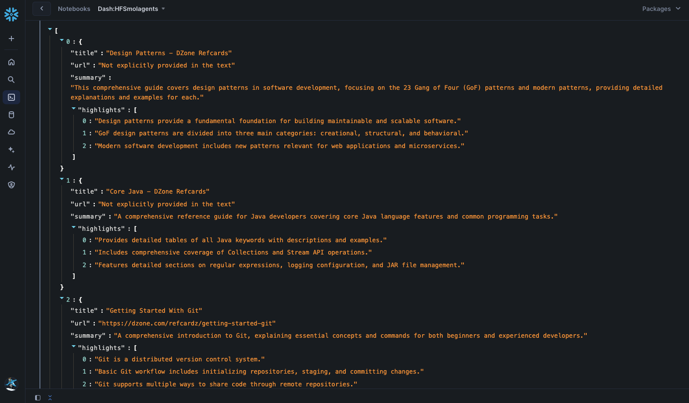

id: build-agentic-workflows-with-huggingface-smolagents-in-snowflake
summary: This guide outlines the process for creating agentic workflow in Snowflake Notebook on Container Runtime.
categories: featured,getting-started,data-science-&-ml,app-development
environments: web
status: Hidden
feedback link: <https://github.com/Snowflake-Labs/sfguides/issues>
tags: Getting Started, Data-Science-&-Ai, Featured
authors: Dash Desai

# Build Agentic Workflows with HuggingFace smolagents in Snowflake
<!-- ------------------------ -->

## Overview

Duration: 4

This guide outlines the process for creating agentic workflows in Snowflake Notebook on Container Runtime using [smolagents from Hugging Face](https://github.com/huggingface/smolagents). These agents are capable of writing Python code to call tools and orchestrate other agents. In this guide, we will also see how you can create a custom tool in **smolagents** that uses Snowflake Cortex.

### What is Container Runtime? 

Snowflake Notebooks on Container Runtime enable advanced data science and machine learning workflows directly within Snowflake. Powered by Snowpark Container Services, it provides a flexible environment to build and operationalize various workloads, especially those requiring Python packages from multiple sources and powerful compute resources, including CPUs and GPUs. With this Snowflake-native experience, you can train models, perform hyperparameter tuning, and execute batch inference while seamlessly running SQL queries. Unlike virtual warehouses, Container Runtime for ML offers greater flexibility and tailored compute options for complex workloads. ***NOTE: This feature is currently in Public Preview.***

Learn more about [Container Runtime](https://docs.snowflake.com/en/user-guide/ui-snowsight/notebooks-on-spcs).

### What is Snowflake Cortex? 

Snowflake Cortex is a suite of AI features that use large language models (LLMs) to understand unstructured data, answer freeform questions, and provide intelligent assistance.

Learn more about [Snowflake Cortex](https://docs.snowflake.com/en/user-guide/snowflake-cortex/overview).

### Prerequisites

* Access to a [Snowflake account](https://signup.snowflake.com/) with ACCOUNTADMIN role
* Access to a [Hugging Face account and HF token](https://huggingface.co/)
    * Log into your Hugging Face account and access your Hugging Face token by browsing to ***Settings -> Access Tokens -> New token***. Make note of this token – you will need to copy-paste it later on.

### What You Will Learn

* How to create multi-step agentic worksflow using smolagents library from Hugging Face

### What You Will Build

Agentic workflow using smolagents library and Snowflake Cortex in Snowflake Notebook on Container Runtime running in Snowflake.

<!-- ------------------------ -->
## Setup

Duration: 10 

**Step 1.** In Snowsight, [create a SQL Worksheet](https://docs.snowflake.com/en/user-guide/ui-snowsight-worksheets-gs?_fsi=THrZMtDg,%20THrZMtDg&_fsi=THrZMtDg,%20THrZMtDg#create-worksheets-from-a-sql-file) and open [setup.sql](https://github.com/Snowflake-Labs/sfguide-build-agentic-workflows-with-huggingface-smolagents-in-snowflake/blob/main/setup.sql) to execute all statements in order from top to bottom.

**Step 2.** In Snowsight, switch your user role to `DASH_CONTAINER_RUNTIME_ROLE`.

**Step 3.** Click on [huggingface_smolagents_notebook_app.ipynb](https://github.com/Snowflake-Labs/sfguide-build-agentic-workflows-with-huggingface-smolagents-in-snowflake/blob/main/huggingface_smolagents_notebook_app.ipynb) to download the Notebook from GitHub. (NOTE: Do NOT right-click to download.)

**Step 4.** In Snowsight:

* On the left hand navigation menu, click on **Projects » Notebooks**
* On the top right, click on **Notebook** down arrow and select **Import .ipynb file** from the dropdown menu
* Select **Gen_AI_Video_Search.ipynb** file you downloaded in the step above
* In the Create Notebook popup
    * For Notebook location, select `DASH_DB` and `DASH_SCHEMA`
    * For SQL warehouse, select `DASH_WH_S`
    * For Python environment, select `Run on container`
    * For Runtime, select `Snowflake ML Runtime CPU 1.0`
    * For Compute pool, select `CPU_X64_XS`
    * Click on **Create** button

**Step 5.** Open Notebook

* Click in the three dots at the very top-right corner and select `Notebook settings` >> `External access`
* Turn on **ALLOW_ALL_ACCESS_INTEGRATION**
* Click on **Save** button
* Click on **Start** button on top right

> aside positive
> NOTE: At this point, the container service will take about 5-7 minutes to start. You will not be able to proceed unless the status changes from **Starting** to **Active**.

<!-- ------------------------ -->
## Run Notebook

Duration: 15

> aside negative
> PREREQUISITE: Successful completion of steps outlined under **Setup**.

Here's the code walkthrough of the [huggingface_smolagents_notebook_app.ipynb](https://github.com/Snowflake-Labs/sfguide-build-agentic-workflows-with-huggingface-smolagents-in-snowflake/blob/main/huggingface_smolagents_notebook_app.ipynb) notebook that you downloaded and imported into your Snowflake account.

**Cell 1:** Install **smolagents** library

**Cell 2:** Replace `hf_ZkEXVwIXXXXXXXXXXXXXXX` with your Hugging Face token. Here we create instances of **HfApiModel**, **ToolCallingAgent**, **ManagedAgent**, and **CodeAgent** to perform web search using built-in **DuckDuckGoSearchTool**.

**Cell 3:** Here we use the instance of **ManagedAgent** created in step / cell above and perform a web search using prompt `Top 5 announcements at Snowflake Summit 2024 in JSON format. Only return the JSON formatted output as the response and nothing else.`. If all goes well, you should see output similar to the following:

**Cell 4:** Here we use the same instance of **ManagedAgent** and perform a web search using prompt `Top 5 Cortex blogs from Snowflake Medium publication. Only return the reaponse  in a dataframe format as the response and nothing else.`. If all goes well, you should see output similar to the following:

**Cell 5:** Here we create a new tool/class **HFModelSnowflakeCortex** with custom code that uses [Snowflake Cortex Complete](https://docs.snowflake.com/user-guide/snowflake-cortex/llm-functions?_fsi=THrZMtDg,%20THrZMtDg&_fsi=THrZMtDg,%20THrZMtDg&_fsi=THrZMtDg,%20THrZMtDg#complete-function) function to summarize given long-form text using prompt `Summarize the text enclosed in ### in less than 200 words in JSON format and list out upto 3 highlights in JSON format ### {txt} ###. Return only the JSON formatted output and nothing else.` and `claude-3.5-sonnet` as the default LLM to use. Feel free to experiment with [other supported LLMs](https://docs.snowflake.com/en/user-guide/snowflake-cortex/llm-functions?_fsi=THrZMtDg,%20THrZMtDg&_fsi=THrZMtDg,%20THrZMtDg#availability) in your region. If all goes well, you should see the output similar to the following:

---

> aside positive
> NOTES: 
> * Since LLMs are non-deterministic in nature, the results for all of the 3 operations above may vary. In any case, I encourage you to try different prompts and LLMs.
> * If you receive this error `Json Parse Error: Unexpected token '...' is not valid JSON ← here`, then replace `st.json()` with `st.write()` where applicable.

<!-- ------------------------ -->
## Conclusion And Resources

Duration: 1

Congratulations! You've successfully created agentic workflow using smolagents library and Snowflake Cortex in Snowflake Notebook on Container Runtime running in Snowflake..

### What You Learned

* How to create multi-step agentic worksflow using smolagents library from Hugging Face

### Related Resources

- [GitHub Repo](https://github.com/Snowflake-Labs/sfguide-build-agentic-workflows-with-huggingface-smolagents-in-snowflake)
- [Snowflake Notebooks on Container Runtime](https://docs.snowflake.com/en/user-guide/ui-snowsight/notebooks-on-spcs)
