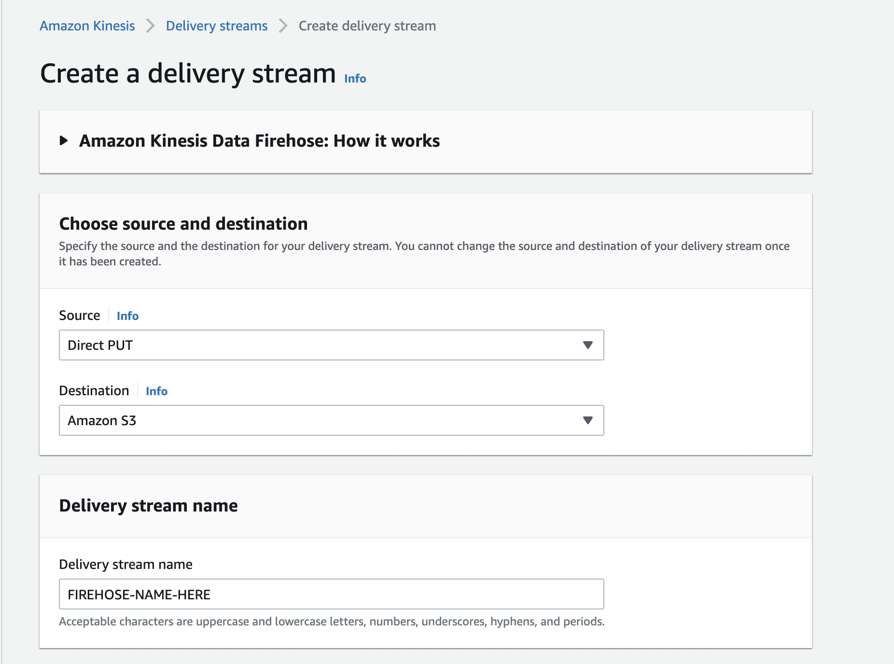

author: Jim Warner
id: build_an_ad_tag_in_python_on_aws
summary: A guide to building and running a simple ad tag (in Python) Powered by Snowflake and AWS
categories: Getting-Started
environments: web
status: Published
feedback link: https://github.com/Snowflake-Labs/sfguides/issues
tags: Getting Started, AdTech

# Build an Ad Tag in Python on AWS

## Overview
Duration: 5

Many Snowflake customers use Snowflake as their centralized platform for their advertising data. In some cases, this can come directly through Snowflake, as with [The Trade Desk](https://www.snowflake.com/datasets/the-trade-desk-raw-event-data-stream-reds/). In other cases, though, it might be easiest to place a tag in the media, and ingest that data into Snowflake.

This Ad Tag takes information from the HTTP request and stores it in Snowflake. [Serverless Framework](https://www.serverless.com/) was used to build and deploy the application for simplicity of operation and ease of scaling.

After completing this guide, you will have built, tested, and deployed an Ad Tag built with [Python Flask](https://flask.palletsprojects.com/en/2.0.x/), [Serverless Framework](https://www.serverless.com/), and [AWS](https://aws.amazon.com/) Lambda/API Gateway. 

### Prerequisites
- Privileges necessary to create a user, database, and warehouse in Snowflake
- Privileges necessary to create an API Gateway and Lambda in Amazon Web Services
- Ability to install and run software on your computer
- Basic experience using git and editing yml
- Intermediate knowledge of Python

### What You’ll Learn 
- How to configure and build an Ad Tag Powered by Snowflake
- How to deploy an Ad Tag on AWS serverless technologies
- How to test and monitor the Ad Tag

### What You’ll Need 
- [AWS](https://aws.amazon.com) Account
- [GitHub](https://github.com/) Account
- [Serverless.com](https://serverless.com) Account 
- [VSCode](https://code.visualstudio.com/download) Installed
- [NodeJS](https://nodejs.org/en/download/) Installed
- [Serverless Framework](https://www.serverless.com/framework/docs/providers/aws/guide/installation) Installed
- [Python 3](https://www.python.org/) Installed
- [Virtualenv](https://virtualenv.pypa.io/en/latest/installation.html) Installed
- [AWS CLI](https://docs.aws.amazon.com/cli/latest/userguide/getting-started-install.html) Installed and [Configured](https://docs.aws.amazon.com/cli/latest/userguide/cli-configure-quickstart.html)

### What You’ll Build 
- Ad Tag by Snowflake

## Downloading the Code
Duration: 3

The code used in this guide is hosted in github. You can download the code as a ZIP from [GitHub](https://github.com/Snowflake-Labs/sf-samples) or use the following git command to clone the repository.

```bash
git clone https://github.com/Snowflake-Labs/sf-samples.git
```

After downloading you will have a folder sf-samples, and the code for this project would be in sf-samples/samples/sfguide-snowflake-python-adtag containing all the code needed for the Ad Tag. Open the folder in VSCode to review the project.

The app.py contains all of the python for this very simple ad tag. The main function is below.

```python
@app.route("/", methods=["GET"])
def log_request_and_return():
    existing_cookie = request.cookies.get(cookie_id)
    cookie = existing_cookie if existing_cookie else str(uuid.uuid1())
    response = impressionClient.put_record(
           DeliveryStreamName=stream_name,
           Record={
                'Data': json.dumps({
                    'event_time': datetime.datetime.now().isoformat(),
                    'cookie': cookie,
                    'args': request.args,
                    'headers': dict(request.headers),
                    'browser': request.user_agent.browser,
                    'platform': request.user_agent.platform,
                    'remote_addr': request.remote_addr,
                })
            }
        )
    
    resp = make_response('', 204)
    if (not existing_cookie):
        resp.set_cookie(cookie_id, cookie)
    return resp
```

The tag reads data from the HTTP request, serializes the data as JSON, and sends it to Kinesis Firehose. The tag itself returns no payload and uses 204 no content, because the ad tag just needs information about the ad impression, and need not waste bytes across the wire sending a response.

## Setting up Snowflake and AWS
Duration: 3

The setup.sql file contains the SQL statements used in this section.

### Set up warehouse, database, schema and table

Run the following SQL commands to create the warehouse, database, and schema.

```sql
-- setup warehouse, database and schema
USE ROLE ACCOUNTADMIN;
CREATE WAREHOUSE TAG_DEMO_WH WITH WAREHOUSE_SIZE='XSmall'  STATEMENT_TIMEOUT_IN_SECONDS=15 STATEMENT_QUEUED_TIMEOUT_IN_SECONDS=15;
USE WAREHOUSE TAG_DEMO_WH;
CREATE DATABASE TAG_DEMO;
CREATE SCHEMA TAG_DEMO.DEMO;
```

Following that, you can create the table as follows.

```sql
-- create table to hold impressions
use TAG_DEMO.DEMO;
create or replace table IMPRESSIONS
(event variant);
```

Next, you should create an S3 bucket to hold the files.  Please note the name of the bucket.  See the [AWS documentation](https://docs.aws.amazon.com/AmazonS3/latest/userguide/create-bucket-overview.html) for details about how to create a bucket.

Then you will need to create the Kinesis Firehose stream that will write the files into S3.



Select "Direct PUT" as the Source, and "Amazon S3" as the Destination.  Name your firehose stream, and note the name used.  Next scroll down to the "Destination settings" section, and put the bucket you created above.

Go back to Snowflake, and run the following SQL to create the stage.  Make sure to add your AWS credentials and set the name of the S3 bucket you created above.

```sql
-- create a stage to take the data from S3
create or replace stage tag_demo_stage
url='s3://<s3_location>]/'
credentials = (AWS_KEY_ID='<accesskey>' AWS_SECRET_KEY='<secretkey>');
```

You can now create the pipe to ingest the data into your impressions table.

```sql
-- create the pipe to load it into the table
create or replace pipe tag_demo_pipe auto_ingest=true as
copy into IMPRESSIONS
from @tag_demo_stage
file_format = (type = 'JSON');
```

Next, run the following SQL to get the notification channel for the pipe.  This gives an ARN to an SQS queue that should be notified when a new file is written to S3.  Copy this ARN.

```sql
show pipes;
```

Then you will take this ARN to S3 to set up notifications when new files arrive in the S3 bucket that is the endpoint for the Firehose stream. Head back to the AWS console, and bring up S3. Click on the S3 bucket you created above, and click "Properties." Scroll down to "Event Notifications" and click the "Create event notification" button. Give it a name, e.g. "tag-creation" and click the button for "All object create events." Scroll down to the "Destination" section, and click "SQS queue" as the destination. In the "Specify SQS queue" section, choose "Enter SQS queue ARN" and paste the ARN you selected above.  Click "Save changes."

Now you are ready to run your tag code.

## Configuring the Application
Duration: 3

Copy the serverless-template.yml to serverless.yml. Update the serverless.yml to name your service by replacing <NAME_OF_YOUR_SERVICE> and set the name of your Kinesis Firehose stream by replacing <FIREHOSE_STREAM_NAME>.

Modify the region in the serverless.yml (line 17) to the same region as your credentials.

```bash
aws configure get region
```

## Configuring, Packaging, and Testing
Duration: 5

Serverless login will open a browser to authenticate the serverless tool. When running serverless, it will ask you what org to add it to. You can choose the default or any org you have setup in serverless.com. You can also keep the original snowflake-python-api name for the application or give it a new name. When asked to deploy the application, choose No.

```bash
npm install
serverless login
serverless
```

After this is complete, the Serverless Framework is configured for use.

Before we deploy the application, we should test locally. For local development, we will isolate the python dependencies in user space using virtualenv. 

Create a virtualenv locally and install python packages.

```bash
virtualenv venv --python=python3
source ./venv/bin/activate
pip install -r requirements.txt
```

You can now start the local serverless server which hosts the API.

```bash
sls wsgi serve
```

To verify the API is working properly you can hit the 3 API endpoints:

```bash 
curl "http://localhost:5000/?adid=1234&placementid=abcd&creativeid=789"
```

If these endpoints are not working and you are on macOS, make sure [port 5000 is not in use](https://www.reddit.com/r/webdev/comments/qg8yt9/apple_took_over_port_5000_in_the_latest_macos/). 

The curl commands will not return any data because we used 204 no content as the HTTP response. You can also open these uris in a browser if that's preferred.

## Deploying, Verifying and Monitoring the tag
Duration: 6

### Deploying to AWS

Now that the application and configuration is verfied to be working, you can deploy it to AWS by running the following command:

```bash
serverless deploy
```

After the completion of deployment, serverless info will give you the URI where your API is now hosted.

```bash
serverless info
```

You can now do the same tests you did locally on the now publicly available API. Replace the server uri with your API location.

```bash 
curl "http://<DEPLOYMENT>.execute-api.<REGION>/?adid=1234&placementid=abcd&creativeid=789"
```

Your api is now available for use by your mobile and web applications.

### Placing the tag in your ad server

While the tag can often be placed using a simple HTML img tag, the information about placements, creatives, etc. most often come in the form of macros that your ad server will expand. For this and more details about placing the tag, please refer to your ad server documentation.

When using Google's Campaign Manager 360, the tag may look something like the following:

```html
.execute-api.<REGION>/?adid=%eaid!&placementid=%epid!&creativeid=%ecid!" width="1" height="1">
```

### Verify the loaded data

You can query Snowflake to verify that the JSON impressions were loaded into the table.

```sql
-- verify that data is loading
select * from IMPRESSIONS;
```

### Monitoring your API with Serverless Framework

You can monitor your application directly by logging into serverless.

```bash
sls login
```

The serverless console allows you to easily view requests to the API as well as errors. The overview and api endpoints tabs allow you to view requests, errors, and latencies for your API. The explorer is useful to look at logs of each request.

If you are more familiar with the AWS Console this same information is available in Cloudwatch Metrics and Logs.

## Cleanup
Duration: 1

If you are done with this exercise you can remove all aws resources by having Serverless Framework cleanup.

```bash
serverless remove
```

## Conclusion
Duration: 1

You've successfully built, tested, and deployed an ad tag on AWS Powered by Snowflake. The serverless stack from AWS is a great way to quickly and easily build an ad tag that can scale to any volume.

Code for this project is available at [https://github.com/Snowflake-Labs/sf-samples](https://github.com/Snowflake-Labs/sf-samples).

### What we've covered
- How to build, configure and package an ad tag Powered by Snowflake
- How to test the tag locally
- How to deploy the tag on AWS serverless technologies
- How to test and monitor the tag in AWS
