author: Annette Chen
id: explo_integration
summary: Explo Integration
categories: Analytics,Getting-Started,Partner-Integrations
environments: web
status: Published
feedback link: https://github.com/Snowflake-Labs/sfguides/issues
tags: Getting Started, Analytics, Dashboards, Explo

# Explo Integration

<!-- ------------------------ -->

## Overview

Duration: 1

[Explo](https://explo.co) is an customer-facing analytics platform that enables embedding of interactive dashboards and reports into your customer-facing web applications. In this guide, you'll learn how to connect a Snowflake database to Explo and begin building a dashboard or report.

### Prerequisites

- A Snowflake account with a database
- An Explo account
- Familiarity with basic SQL

### What You’ll Learn

- How to connect a Snowflake database in an Explo workspace
- How to build a dataset in Explo that can be used to create dashboards and reports

<!-- ------------------------ -->

## Connect Snowflake data in Explo

Duration: 10

In the Explo application, go to the Data page and click on `Connect Datasource`.

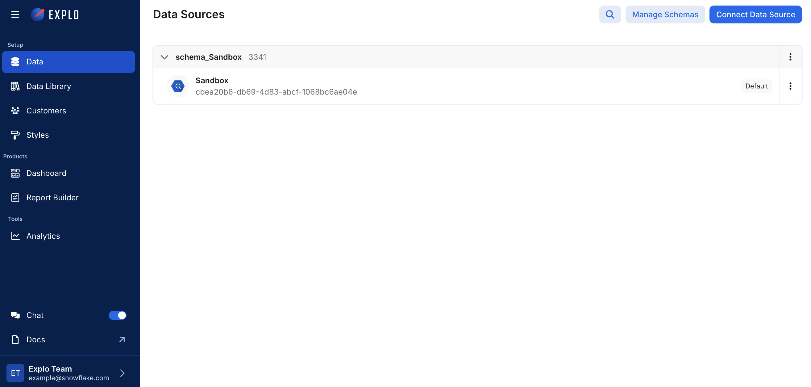

First, give your database a nickname, and create a new schema for your datasource. On the next page, select `Snowflake` as the database type.

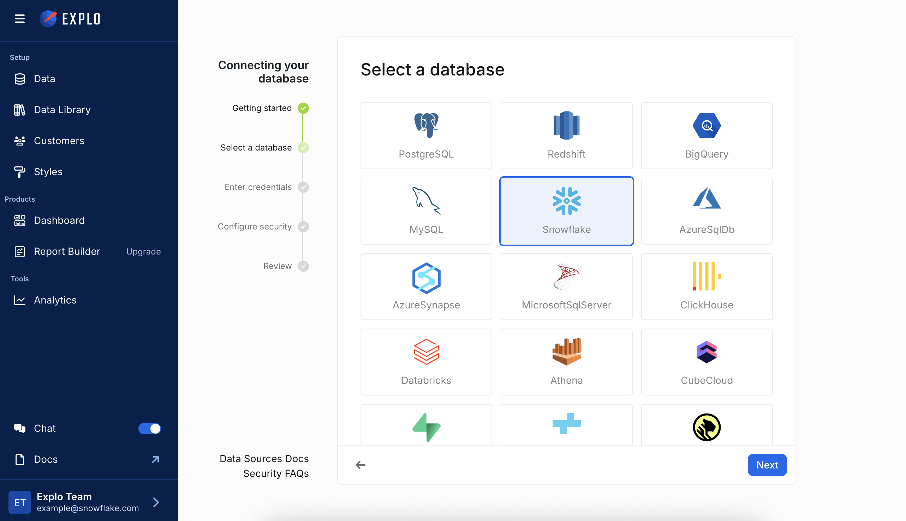

Enter the credentials for your Snowflake database and hit `Next`. Click the `Connect` button once the green banner appears that confirms the connection was successful.

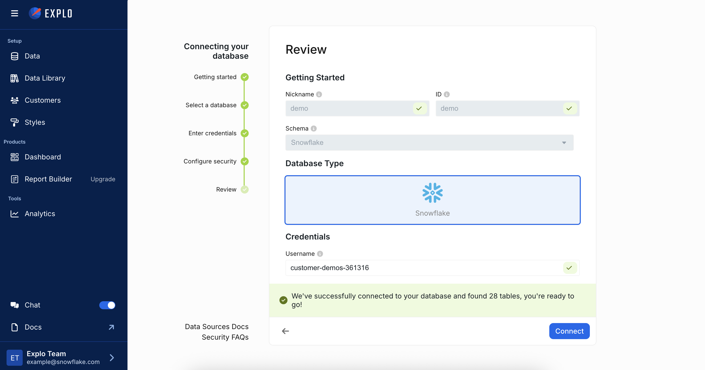

Back on the Data page, you can optionally choose to sync the tables by clicking on the new datasource and clicking `Sync Tables`. This will allow you to use autocomplete when writing queries.

Now the data is successfull connected, and you should be able to click on the datasource to preview the data.

<!-- ------------------------ -->

## Create a dataset

Duration: 10

A dataset is view created with SQL that defines a table of data that can be used to create charts and tables.

To create a dataset, go to the Data Library page, click `Create Dataset` in the top right. Give the dataset a name, and select the schema that you created in the previous section.

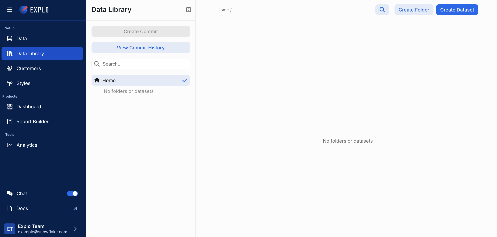

Then, define your dataset with Snowflake compatible SQL. The dataset editor is very flexible so that SQL can contain joins, filtering logic, computed columns, etc. To keep it simple, you can just create a dataset that pulls an entire table, e.g. `SELECT * from <table_name>`. Preview the data to confirm that the resulting data is as expected.

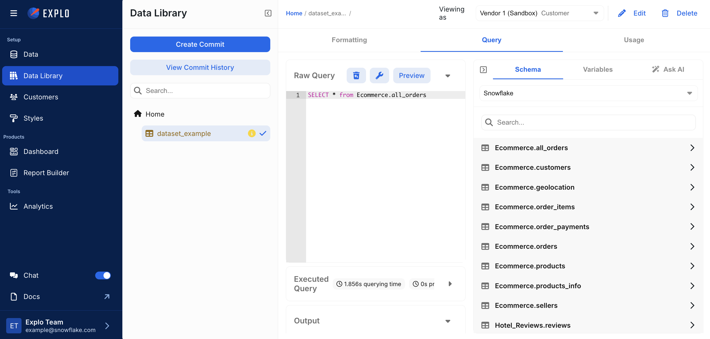

Once the dataset is complete, click the `Create Commit` button in the top left. Add a simple message and click `Create`.

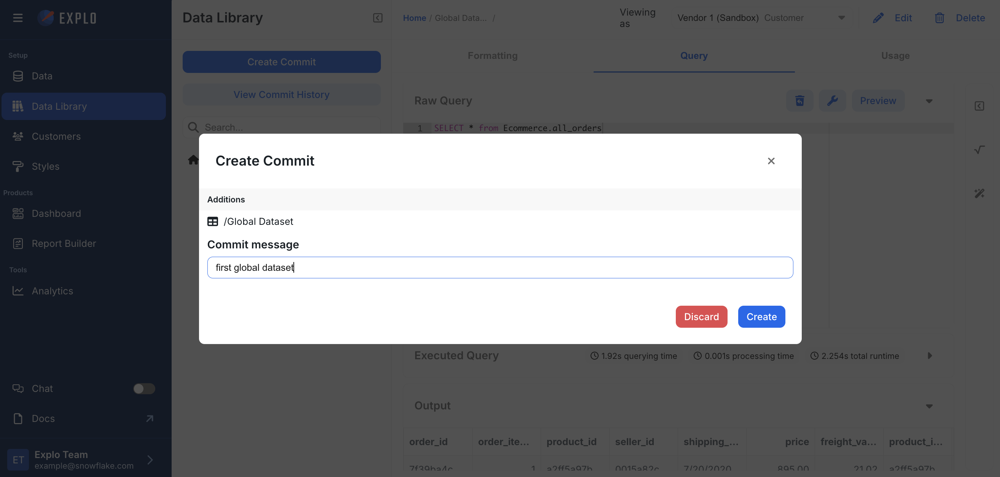

Your dataset is now ready to use!

<!-- ------------------------ -->

## Build an Explo Product

Duration: 30

Once the Snowflake database is connected and a dataset is created, you are now able to create dashboards and reports in Explo.

For a dashboard, go to the Dashboard page and click `Create Dashboard`.

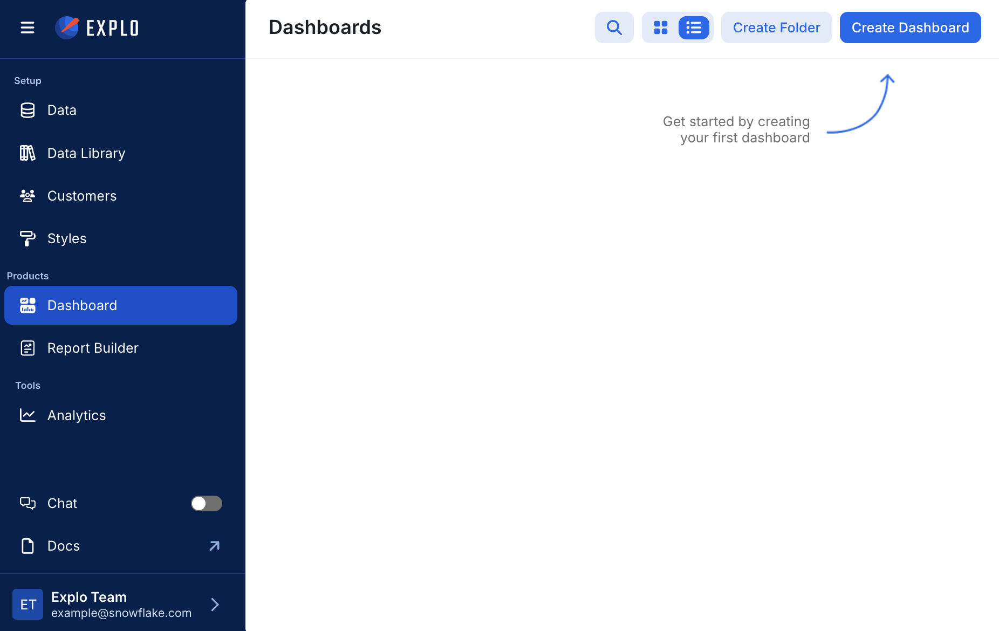

Navigate to the Datasets tab and import the dataset you created in the Data Library from the previous section.

Then, go back to the main dashboard page and pull on any element to add it to the dashboard and select the global dataset.

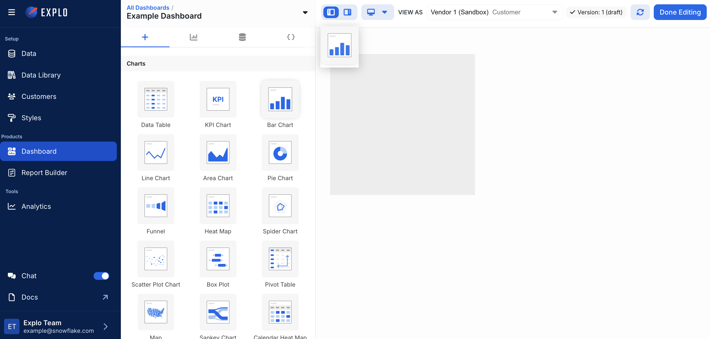

Then, you can use the left panel to configure the data, formatting, and interactive options on the chart. Repeat this process with however many elements you would like.

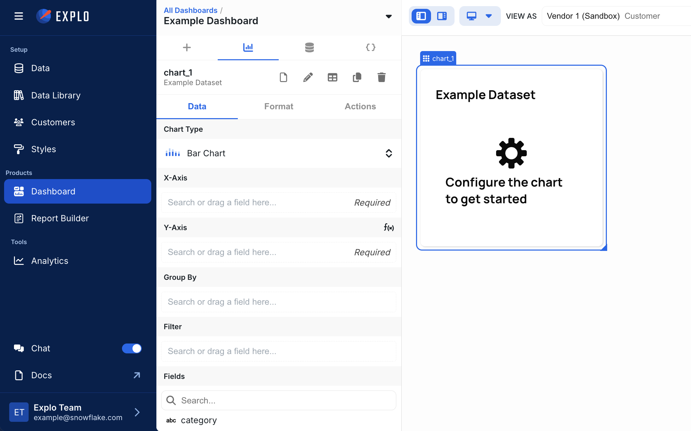

For a Report Builder, go to the Report Builder page and click `Create Report Builder`.

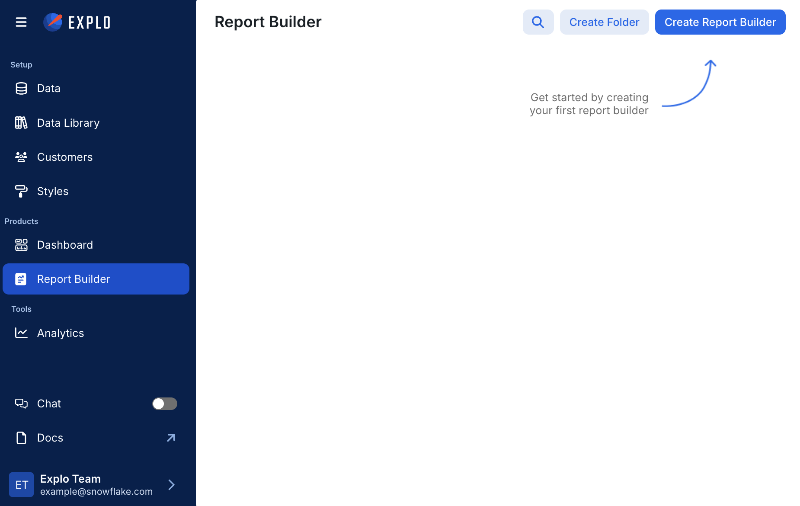

Import the global dataset that you created in the Data Library in the previous section. In the middle section, format the columns, determine initial column visibility, and add any custom aggregations that your end users may want to use to aggregate data.

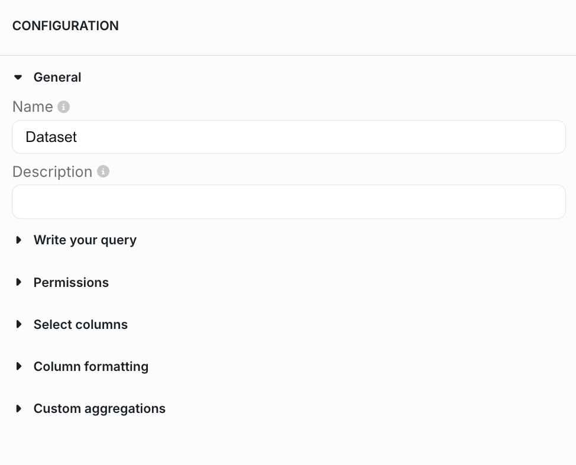

Then, go to the Built Ins section and create a new built in report. Click on the `Select Data` button in the middle of right panel and select the imported global dataset.

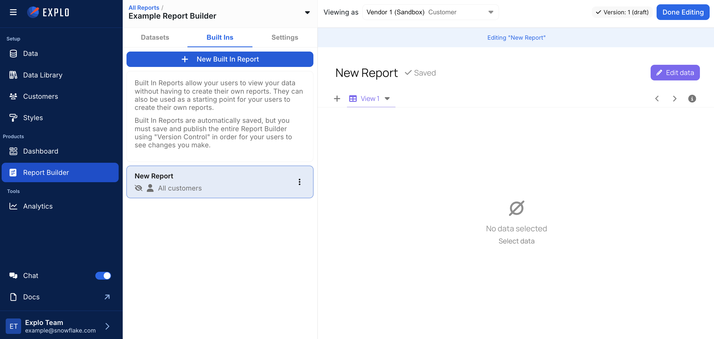

Now, you can configure the built in report as desired. Add filters, aggregate columns, create multiple views, change the chart type, etc.

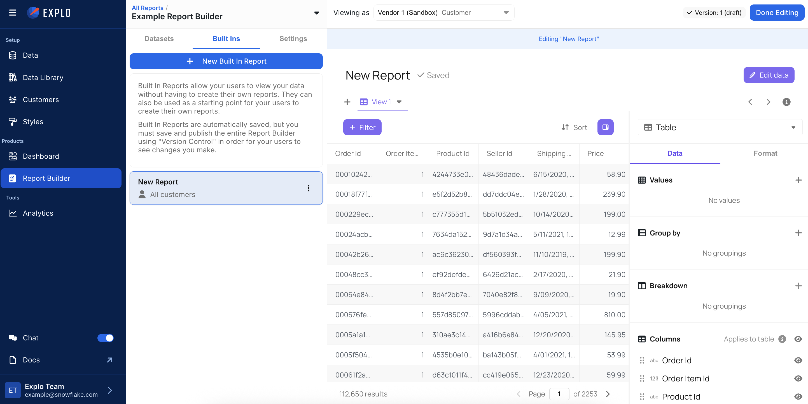

<!-- ------------------------ -->

## Conclusion and Resources

Duration: 10

Congratulations! You have successfully created a dashboard or report to visualize data from your Snowflake database.

### What You Learned

- How to connect a Snowflake database to Explo
- How to create a dataset in Explo
- How to begin creating a dashboard and report builder

### Resources

[Explo Documentation](https://docs.explo.co/explo-help-desk)
[Request an Explo Trial](https://www.explo.co/request-a-trial)
