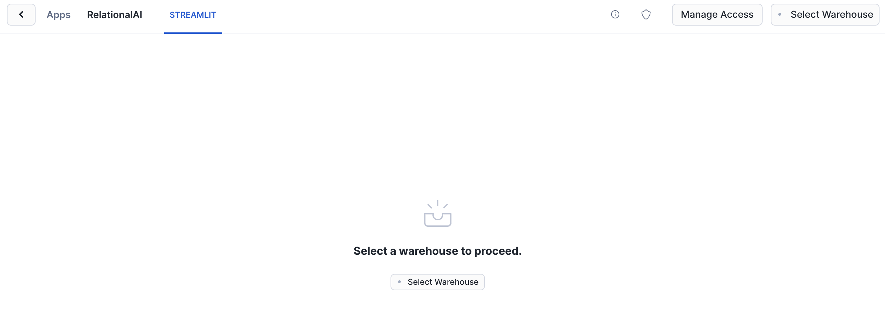
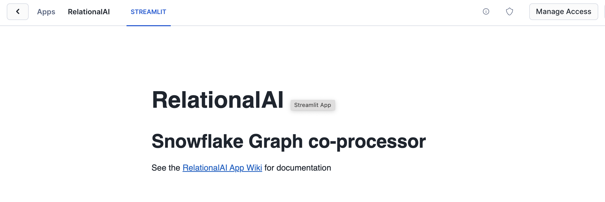
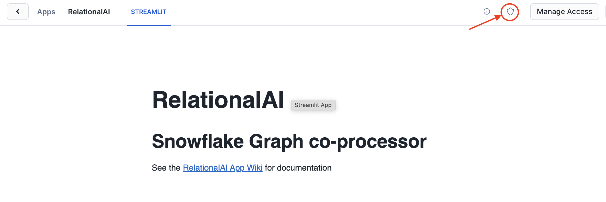

author: Haythem Tellili
id: build_collaborative_filtering_recommender_system_with_relationalai_and_snowflake
summary: This guide shows how to use RelationalAI and Snowflake to create a recommender system.
categories: data-science, graph-analysis, relationalai
environments: web
status: Published 
feedback link: https://github.com/RelationalAI/rai-samples/issues
tags: Getting Started, Data Science, Data Engineering, RelationalAI, Recommender Systems

# Recommender Systems with RelationalAI’s Snowflake Native App

## Overview 
Duration: 5

By completing this guide, you will be able to build a collaborative filtering recommender system RelationalAI’s Native App on Snowflake.

### What Is RelationalAI?
RelationalAI is a cloud-native platform that enables organizations to streamline and enhance decisions with intelligence. RelationalAI extends Snowflake with native support for an expanding set of AI workloads (e.g., graph analytics, rule-based reasoning, and optimization), all within your Snowflake account, offering the same ease of use, scalability, security, and governance.

Users can build a knowledge graph using Python, and materialize it on top of their Snowflake data, shared with the RelationalAI app through Snowflake Streams.  Insights can be written to Snowflake tables and shared across the organization.

### What you will learn
Here is a summary of what you will be able to learn in each step by following this quickstart:

- **Setup Environment**: How to run graph algorithms on your data, where it already lives.
- **Data Preparation**: How to load data from a Snowflake table into a RelationalAI model
- **Build Recommender system**: How to use the graph representation to build a recommendation algorithm


### What You’ll Need 
- A [Snowflake](https://signup.snowflake.com/) Account
- Snowflake privileges on your user to [Install a Native Application](https://other-docs.snowflake.com/en/native-apps/consumer-installing#set-up-required-privileges)
- The [RAI Recommendation Jupyter notebook](https://github.com/RelationalAI/rai-samples/tree/main/samples/recommender-system/collaborative_filtering.ipynb) used in this quickstart

### What You’ll Build 
- A recommmender system on the 100k Movielense database using Snowflake and RelationalAI

<!-- ------------------------ -->

## Install the RelationalAI Native App In Your Account
Duration: 5

In the [Snowflake Marketplace](https://app.snowflake.com/marketplace), search for the ‘RelationalAI’ Native App and install it in your account by clicking the “Get” button.  You will be prompted to accept permission granting, after which an installation dialog will run.  
You should see a screen like this prompting you to choose a warehouse:


After selecting a warehouse (any size will do, this is only for installation), a progress dialog will briefly show, followed by the Streamlit splash screen for the RelationalAI App.


The link provided contains the full initial setup guide as well as system documentation and a user guide.  First run through the initial setup guide, which involves setting up additional permissions using the Shield Icon:


At the end of the install guide you will start up the RelationalAI service using the SQL command:
```sql
CALL relationalai.app.start_service('rai_compute_pool','rai_warehouse');
```

Finally, you need to create a role that should be granted to any users permitted to use this application
```sql
-- In your account, create a role specific for accessing the app
CREATE ROLE rai_user;
-- Link the app's user role to the created role
GRANT APPLICATION ROLE relationalai.user TO ROLE rai_user;
```

Refer to the [initial setup](https://github.com/RelationalAI/rai-sf-app-docs/wiki/Guide-%E2%80%90-Initial-Setup)  for full instructions and the user guide.  

<!-- ------------------------ -->

## Setup Your Environment
Duration: 5

Now with your Snowflake account is ready to go, to build a knowledge graph using RelationalAI from within your Snowflake account, we need to setup the local environment with Jupyter Lab and the RelationalAI Python library.  The easiest way to do this is using the miniconda installer:
Download the miniconda installer from https://conda.io/miniconda.html. (OR, you may use any other Python environment with Python 3.11).


From the app folder, create conda environment. Then activate conda environment and install JupyterLab and RelationalAI package
```console
> conda create -n rai_recsys python=3.11.8
> conda activate rai_recsys    
> pip install jupyterlab
> pip install snowflake
> pip install relationalai  
```

### RelationalAI Config File
After installing the `relationalai` package, you will need to setup an initial RAI configuration with the Snowflake credentials you want to use (similar to the configuration for Snowflake CLI):


<!-- ------------------------ -->
## Data Preparation

Duration: 15

To prepare data needed for this tutorial, follow these steps:

1. **Download Movielens-100K Dataset**: Obtain the [Movielens-100K dataset](https://grouplens.org/datasets/movielens/100k/) locally to use as sample data for your recommender system.

2. **Install Snowflake VS Code Extension**: Install the [Snowflake Visual Studio Code Extension](https://marketplace.visualstudio.com/items?itemName=snowflake-computing.snowflake) for seamless integration with Snowflake in your development environment.

3. **Connect to Snowflake and Prepare Data**: Utilize the Snowflake extension to establish a connection to your Snowflake instance. Once connected, create tables and prepare your data directly from within VS Code by running the commands below:

> aside positive
> IMPORTANT:
>
> - If you use different names for objects created in this section, be sure to update scripts and code in the following sections accordingly.
>
> - For each SQL script block below, select all the statements in the block and execute them top to bottom.

Run the following SQL commands to create the [database](https://docs.snowflake.com/en/sql-reference/sql/create-database.html) and prepare data needed for this tutorial.

```sql
USE ROLE ACCOUNTADMIN;

CREATE DATABASE IF NOT EXISTS RECOMMENDATION_DEMO;
USE DATABASE RECOMMENDATION_DEMO;
USE SCHEMA PUBLIC;
```

Run the following SQL commands to create an internal stage and upload files to the stage.

```sql
CREATE OR REPLACE STAGE movielens_stage;
-- Note: Change the file paths to your local paths before running these commands.
PUT file:///path/to/your/local/movielens_demo/ml-100k/u1.base @movielens_stage;
PUT file:///path/to/your/local/movielens_demo/ml-100k/u1.test @movielens_stage;
PUT file:///path/to/your/local/movielens_demo/ml-100k/u.item @movielens_stage;
```

Run the following SQL commands to create file formats.

```sql
CREATE OR REPLACE FILE FORMAT csv_format_pipe
  TYPE = 'CSV'
  RECORD_DELIMITER = '\n'
  SKIP_HEADER = 0
  FIELD_DELIMITER = '|'
  NULL_IF = ('NULL', 'null')
  EMPTY_FIELD_AS_NULL = TRUE
  ENCODING = 'ISO-8859-1' 
  FIELD_OPTIONALLY_ENCLOSED_BY = '0x22';
  
CREATE OR REPLACE FILE FORMAT csv_format_tab
  TYPE = CSV
  RECORD_DELIMITER = '\n'
  FIELD_DELIMITER = '\t'
  SKIP_HEADER = 0
  NULL_IF = ('NULL', 'null')
  EMPTY_FIELD_AS_NULL = TRUE
  FIELD_OPTIONALLY_ENCLOSED_BY = '0x22';
```

Run the following SQL commands to create tables for **TRAIN**, **TEST** and **MOVIE_DETAILS** that we will use during our solution.

```sql
CREATE OR REPLACE TABLE TRAIN (
    USER_ID VARCHAR(255),
    ITEM_ID VARCHAR(255),
    RATING FLOAT,
    TIMESTAMP TIMESTAMP
);

CREATE OR REPLACE TABLE TEST (
    USER_ID VARCHAR(255),
    ITEM_ID VARCHAR(255),
    RATING FLOAT,
    TIMESTAMP TIMESTAMP
);

CREATE OR REPLACE TABLE MOVIE_DETAILS (
    item_id VARCHAR(255),
    title VARCHAR(255),
    date DATE,
    A1 VARCHAR(255),
    A2 VARCHAR(255),
    A3 VARCHAR(255),
    A4 VARCHAR(255),
    A5 VARCHAR(255),
    A6 VARCHAR(255),
    A7 VARCHAR(255),
    A8 VARCHAR(255),
    A9 VARCHAR(255),
    A10 VARCHAR(255),
    A11 VARCHAR(255),
    A12 VARCHAR(255),
    A13 VARCHAR(255),
    A14 VARCHAR(255),
    A15 VARCHAR(255),
    A16 VARCHAR(255),
    A17 VARCHAR(255),
    A18 VARCHAR(255),
    A19 VARCHAR(255),
    A20 VARCHAR(255),
    A21 VARCHAR(255)
);
```

Run the following commands to load data from the stage to tables.

```sql
COPY INTO TRAIN
    FROM @movielens_stage
    FILE_FORMAT = csv_format_tab
    FILES = ('u1.base.gz');

COPY INTO TEST
    FROM @movielens_stage
    FILE_FORMAT = csv_format_tab
    FILES = ('u1.test.gz');

COPY INTO MOVIE_DETAILS
    FROM @movielens_stage
    FILE_FORMAT = csv_format_pipe
    FILES = ('u.item.gz');
```

By following these steps, you'll be ready to build and deploy your Recommender System using Snowflake seamlessly.

> aside positive
> IMPORTANT: If you use different names for objects created in this section, be sure to update scripts and code in the following sections accordingly.

<!-- ------------------------ -->
## Building a Recommender System

Duration: 20

The Notebook linked below covers the following steps.

1) Convert user-item interactions to a bipartite graph
2) Use user-item interactions to compute item-item by leveraging the functions supported by the graph analytics library
3) Use the similarities to predict the scores for all (user, movie) pairs. Each score is an indication of how likely it is for a user to interact with a movie
4) Sort the scores for every user in order to generate top-k recommendations
5) Evaluate performance using evaluation metrics that are widely used for recommender systems

### Walkthrough Notebook in Jupyter or Visual Studio Code

To get started, follow these steps:

1) If not done already, in a terminal window, browse to this folder and run `jupyter lab` at the command line. (You may also use other tools and IDEs such Visual Studio Code.)

2) Open and run through the cells in [collaborative_filtering.ipynb](https://github.com/RelationalAI/rai-samples/blob/main/samples/recommender-system/collaborative_filtering.ipynb)

> aside positive
> IMPORTANT: Make sure in the Jupyter notebook the (Python) kernel is set to ***rai_demo***-- which is the name of the environment created in **Setup Environment** step.

<!-- ------------------------ -->
## Conclusion And Resources
Duration: 2

Thanks to RelationalAI’s Native App on Snowflake, we built a recommendation system with just a few steps. Although the dataset used was a small graph with thousands of nodes and edges, our solution can scale to real world datasets due to our cloud-native architecture that separates compute from storage.

In this Quickstart you learned

- How to find and install the RelationalAI Native App from the Snowflake Marketplace
- How to build a knowledge graph on top of your Snowflake data without having to extract data from Snowflake
- How to create a recommender system using graph algorithms on the MovieLense 100k dataset.

### Related Resources
- To learn about more about RelationalAI and view full documentation, visit [https://relational.ai](https://relational.ai)
- To see a brief summary of the recommender system you just built, see [Blogpost](https://medium.com/@haythemtellili/recommender-systems-with-relationalais-snowflake-native-app-68d9c76bb07f)
- [Snowflake Marketplace](https://app.snowflake.com/marketplace)
- More info on [Snowflake Native Apps](https://docs.snowflake.com/en/developer-guide/native-apps/native-apps-about)