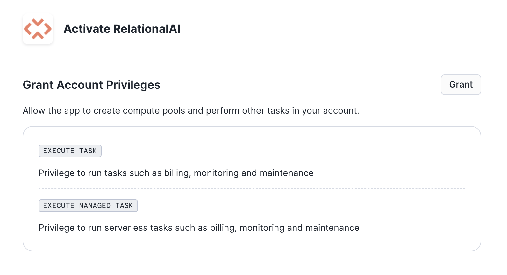
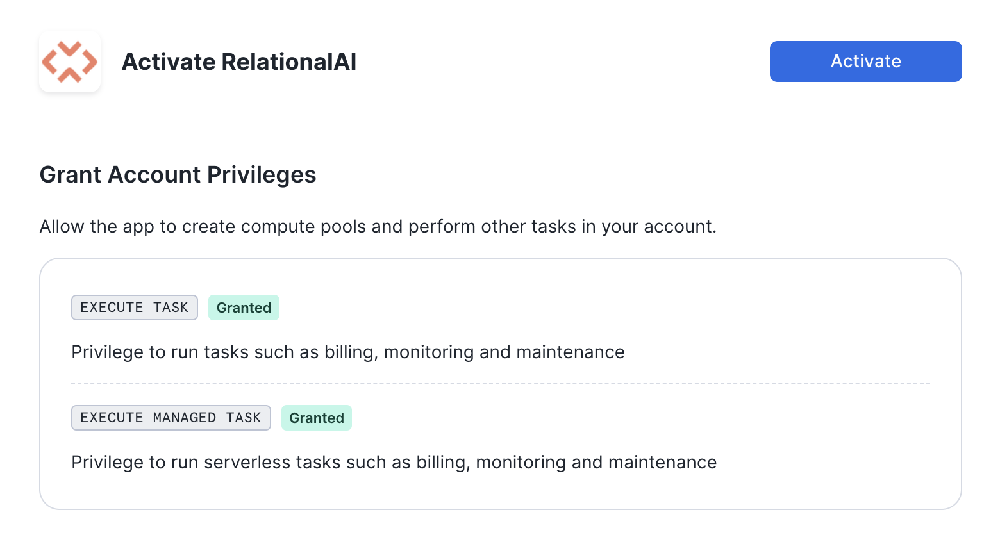

author: Haythem Tellili
id: build_collaborative_filtering_recommender_system_with_relationalai_and_snowflake
summary: This guide shows how to use RelationalAI and Snowflake to create a recommender system.
categories: data-science, graph-analysis, relationalai
environments: web
status: Published 
feedback link: https://github.com/RelationalAI/rai-samples/issues
tags: Getting Started, Data Science, Data Engineering, RelationalAI, Recommender Systems

# Recommender Systems with RelationalAI’s Snowflake Native App

## Overview 
Duration: 1

By completing this guide, you will be able to build a collaborative filtering recommender system RelationalAI’s Native App on Snowflake.

### What Is RelationalAI?

RelationalAI is a cloud-native platform that enables organizations to streamline and enhance decisions with intelligence. RelationalAI extends Snowflake with native support for an expanding set of AI workloads (e.g., graph analytics, rule-based reasoning, and optimization), all within your Snowflake account, offering the same ease of use, scalability, security, and governance.

Users can build a knowledge graph using Python, and materialize it on top of their Snowflake data, shared with the RelationalAI app through Snowflake Streams.  Insights can be written to Snowflake tables and shared across the organization.

### What You'll Learn

In this quickstart, you'll learn how to:

- **Set Up Your Environment**: How to run graph algorithms on your data, where it already lives.
- **Prepare Data**: How to load data from a Snowflake table into a RelationalAI model
- **Build a Recommender System**: How to use the graph representation to build a recommendation algorithm


### What You’ll Need 
- A [Snowflake](https://signup.snowflake.com/?utm_cta=quickstarts_) Account
- Snowflake privileges on your user to [Install a Native Application](https://other-docs.snowflake.com/en/native-apps/consumer-installing#set-up-required-privileges)
- The [RAI Recommendation Jupyter notebook](https://github.com/RelationalAI/rai-samples/tree/main/samples/recommender-system/collaborative_filtering.ipynb) used in this quickstart

### What You’ll Build 
- A recommmender system on the 100k MovieLens database using Snowflake and RelationalAI

<!-- ------------------------ -->

## Install the RelationalAI Native App In Your Account
Duration: 7

### Installation Sequence

In the [Snowflake Marketplace](https://app.snowflake.com/marketplace), search for the ‘RelationalAI’ Native App and request it by clicking the “Request” button. When your request is approved by the RelationalAI team, you'll see the RelationalAI app under *Data Products > Apps*. Click the “Buy” button to install the app in your Snowflake account.


When the installation process is complete, you'll see RelationalAI in your list of installed apps:


Click on the RelationalAI app to open it. The first screen prompts you to grant the necessary privileges for the app to run:



The next button prompts you to activate the app:



The last screen in this sequence prompts you to launch the app, but you can skip that step.

Congratulations! The RelationalAI app is now available in your Snowflake account.

### Setup

Next, open a Snowsight SQL worksheet and run the SQL commands below from top to bottom. Note that this worksheet includes some appendices with commands that you may need later.

```sql
-- Main Script: Basic Setup

-- Step 0: Use the ACCOUNTADMIN role for the following operations
USE ROLE ACCOUNTADMIN;

-- Step 1: Create an event table (customize the database, schema, and table name as needed)

-- first, check whether you already have an event table:
SHOW PARAMETERS LIKE 'event_table' in ACCOUNT;

-- if the above command returns an empty result, create an event table
-- (customize the database, schema, and table name as needed):
CREATE DATABASE IF NOT EXISTS TELEMETRY;
CREATE SCHEMA IF NOT EXISTS TELEMETRY.PUBLIC;
CREATE EVENT TABLE IF NOT EXISTS TELEMETRY.PUBLIC.EVENTS;
ALTER ACCOUNT SET EVENT_TABLE = TELEMETRY.PUBLIC.EVENTS;

-- Enable telemetry sharing
ALTER APPLICATION relationalai SET SHARE_EVENTS_WITH_PROVIDER = TRUE;

-- Step 2: Create compute pools for the RAI service and engines
CREATE COMPUTE POOL IF NOT EXISTS rai_service_pool
      FOR APPLICATION relationalai
      MIN_NODES = 1
      MAX_NODES = 1
      AUTO_RESUME = TRUE
      AUTO_SUSPEND_SECS = 300
      INSTANCE_FAMILY = CPU_X64_S;
GRANT USAGE, MONITOR ON COMPUTE POOL rai_service_pool TO APPLICATION relationalai;

CREATE COMPUTE POOL IF NOT EXISTS rai_engine_pool_s
      FOR APPLICATION relationalai
      MIN_NODES = 1
      MAX_NODES = 10
      AUTO_RESUME = TRUE
      AUTO_SUSPEND_SECS = 300
      INSTANCE_FAMILY = HIGHMEM_X64_S;
GRANT USAGE, MONITOR ON COMPUTE POOL rai_engine_pool_s TO APPLICATION relationalai;

CREATE COMPUTE POOL IF NOT EXISTS rai_engine_pool_m
      FOR APPLICATION relationalai
      MIN_NODES = 1
      MAX_NODES = 10
      AUTO_RESUME = TRUE
      AUTO_SUSPEND_SECS = 300
      INSTANCE_FAMILY = HIGHMEM_X64_M;
GRANT USAGE, MONITOR ON COMPUTE POOL rai_engine_pool_m TO APPLICATION relationalai;

-- Create a warehouse for the app to use
CREATE WAREHOUSE IF NOT EXISTS rai_warehouse WITH
      MAX_CONCURRENCY_LEVEL = 8
      WAREHOUSE_SIZE = 'X-SMALL'
      AUTO_SUSPEND = 180
      AUTO_RESUME = TRUE
      INITIALLY_SUSPENDED = TRUE;
GRANT USAGE ON WAREHOUSE rai_warehouse TO APPLICATION relationalai;

-- Step 3: Start the RAI service
-- use this command to poll the compute pool until its state is 'Active/Idle':
-- (this usually takes 1-2 minutes)
DESCRIBE COMPUTE POOL rai_service_pool;

-- ...then start the RAI service:
CALL RELATIONALAI.APP.START_SERVICE('rai_service_pool', 'rai_warehouse');

-- Step 6: Setting up CDC
-- create an engine for change-data-capture
-- (this command usually takes 3-4 minutes to run)
CALL RELATIONALAI.API.CREATE_ENGINE('cdc_engine', 'rai_engine_pool_s', 'HighMem|S');

-- set that engine to be the CDC engine
CALL RELATIONALAI.APP.SETUP_CDC('cdc_engine');

-- Congatulations! Your RelationalAI app is ready to use.
-- Check out the Simple Start notebook at 
-- https://relational.ai/docs/example-notebooks
-- to try a simple demo

--------------------------------------------------------------------------------------

-- Appendix 1: Suspending the Service

-- If you aren't going to use the service for a while, 
-- suspend it to avoid incurring unnecessary costs:

-- Suspend CDC
CALL RELATIONALAI.APP.SUSPEND_CDC();

-- Delete the CDC engine:
CALL RELATIONALAI.API.DELETE_ENGINE('cdc_engine', TRUE);

-- List the engines:
SELECT * FROM RELATIONALAI.API.ENGINES;

-- For each engine name in the output of the above `SELECT` statement (if any),
-- fill in the engine name in the following command and run it:
-- CALL RELATIONALAI.API.DELETE_ENGINE('<engine_name>', TRUE);

-- Suspend the service
CALL RELATIONALAI.APP.SUSPEND_SERVICE();

--------------------------------------------------------------------------------------

-- Appendix 2: Resuming the Service

-- Resume the service after suspending it:
CALL RELATIONALAI.APP.RESUME_SERVICE();

-- Recreate the engine if necessary:
CALL RELATIONALAI.API.CREATE_ENGINE('cdc_engine', 'rai_engine_pool_s', 'HighMem|S');

-- Resume CDC:
CALL RELATIONALAI.APP.RESUME_CDC();

--------------------------------------------------------------------------------------

-- Appendix 3: Defining a RelationalAI User Role

-- To create a role that can be granted to any users permitted to use this application

-- In your account, create a role specific for accessing the app
CREATE ROLE rai_user;

-- Link the app's user role to the created role. 
-- Note that you can create more fine-grained roles later.
GRANT APPLICATION ROLE relationalai.all_admin TO ROLE rai_user;

-- Allow the role to see engine compute pools.
-- This is needed for the RAI Python library to manage engines.
GRANT MONITOR ON COMPUTE POOL rai_engine_pool_s TO ROLE rai_user;
GRANT MONITOR ON COMPUTE POOL rai_engine_pool_m TO ROLE rai_user;
```

Refer to the [documentation](https://relational.ai/docs/native_app/installation) for full instructions and more details about how to use the RelationalAI Native App.

<!-- ------------------------ -->
## Data Preparation

Duration: 15

To prepare data needed for this tutorial, follow these steps:

1. **Download Movielens-100K Dataset**: Obtain the [Movielens-100K dataset](https://grouplens.org/datasets/movielens/100k/) locally to use as sample data for your recommender system.

2. **Install Snowflake VS Code Extension**: Install the [Snowflake Visual Studio Code Extension](https://marketplace.visualstudio.com/items?itemName=snowflake-computing.snowflake) for seamless integration with Snowflake in your development environment.

3. **Connect to Snowflake and Prepare Data**: Utilize the Snowflake extension to establish a connection to your Snowflake instance. Once connected, create tables and prepare your data directly from within VS Code by running the commands below:

> aside positive
> IMPORTANT:
>
> - If you use different names for objects created in this section, be sure to update scripts and code in the following sections accordingly.
>
> - For each SQL script block below, select all the statements in the block and execute them top to bottom.

Run the following SQL commands to create the [database](https://docs.snowflake.com/en/sql-reference/sql/create-database.html) and prepare data needed for this tutorial.

```sql
USE ROLE ACCOUNTADMIN;

CREATE DATABASE IF NOT EXISTS RECOMMENDATION_DEMO;
USE DATABASE RECOMMENDATION_DEMO;
USE SCHEMA PUBLIC;
```

Run the following SQL commands to create an internal stage and upload files to the stage.

```sql
CREATE OR REPLACE STAGE movielens_stage;
-- Note: Change the file paths to your local paths before running these commands.
PUT file:///path/to/your/local/movielens_demo/ml-100k/u1.base @movielens_stage;
PUT file:///path/to/your/local/movielens_demo/ml-100k/u1.test @movielens_stage;
PUT file:///path/to/your/local/movielens_demo/ml-100k/u.item @movielens_stage;
```

Run the following SQL commands to create file formats.

```sql
CREATE OR REPLACE FILE FORMAT csv_format_pipe
  TYPE = 'CSV'
  RECORD_DELIMITER = '\n'
  SKIP_HEADER = 0
  FIELD_DELIMITER = '|'
  NULL_IF = ('NULL', 'null')
  EMPTY_FIELD_AS_NULL = TRUE
  ENCODING = 'ISO-8859-1' 
  FIELD_OPTIONALLY_ENCLOSED_BY = '0x22';
  
CREATE OR REPLACE FILE FORMAT csv_format_tab
  TYPE = CSV
  RECORD_DELIMITER = '\n'
  FIELD_DELIMITER = '\t'
  SKIP_HEADER = 0
  NULL_IF = ('NULL', 'null')
  EMPTY_FIELD_AS_NULL = TRUE
  FIELD_OPTIONALLY_ENCLOSED_BY = '0x22';
```

Run the following SQL commands to create tables for **TRAIN**, **TEST** and **MOVIE_DETAILS** that we will use during our solution.

```sql
CREATE OR REPLACE TABLE TRAIN (
    USER_ID VARCHAR(255),
    ITEM_ID VARCHAR(255),
    RATING FLOAT,
    TIMESTAMP TIMESTAMP
);

CREATE OR REPLACE TABLE TEST (
    USER_ID VARCHAR(255),
    ITEM_ID VARCHAR(255),
    RATING FLOAT,
    TIMESTAMP TIMESTAMP
);

CREATE OR REPLACE TABLE MOVIE_DETAILS (
    item_id VARCHAR(255),
    title VARCHAR(255),
    date DATE,
    A1 VARCHAR(255),
    A2 VARCHAR(255),
    A3 VARCHAR(255),
    A4 VARCHAR(255),
    A5 VARCHAR(255),
    A6 VARCHAR(255),
    A7 VARCHAR(255),
    A8 VARCHAR(255),
    A9 VARCHAR(255),
    A10 VARCHAR(255),
    A11 VARCHAR(255),
    A12 VARCHAR(255),
    A13 VARCHAR(255),
    A14 VARCHAR(255),
    A15 VARCHAR(255),
    A16 VARCHAR(255),
    A17 VARCHAR(255),
    A18 VARCHAR(255),
    A19 VARCHAR(255),
    A20 VARCHAR(255),
    A21 VARCHAR(255)
);
```

Run the following commands to load data from the stage to tables.

```sql
COPY INTO TRAIN
    FROM @movielens_stage
    FILE_FORMAT = csv_format_tab
    FILES = ('u1.base.gz');

COPY INTO TEST
    FROM @movielens_stage
    FILE_FORMAT = csv_format_tab
    FILES = ('u1.test.gz');

COPY INTO MOVIE_DETAILS
    FROM @movielens_stage
    FILE_FORMAT = csv_format_pipe
    FILES = ('u.item.gz');
```

By following these steps, you'll be ready to build and deploy your Recommender System using Snowflake seamlessly.

> aside positive
> IMPORTANT: If you use different names for objects created in this section, be sure to update scripts and code in the following sections accordingly.

The last step is to stream data from snowflake tables into RelationalAI model:

```bash
rai imports:stream --source RECOMMENDATION_DEMO.PUBLIC.TRAIN --source RECOMMENDATION_DEMO.PUBLIC.TEST --source RECOMMENDATION_DEMO.PUBLIC.MOVIE_DETAILS --model recommendation_demo
```

- `--source`: This flag specifies the fully-qualified name of a Snowflake table or view.
- `--model`: This flag specifies the name of the model to which the data in the Snowflake table or view is streamed.

> aside positive
> IMPORTANT: An import stream utilizes [change data capture](https://docs.snowflake.com/en/user-guide/streams)
to synchronize your Snowflake data with your RelationalAI model at an interval of once per minute. 
<!-- ------------------------ -->
## Building a Recommender System

Duration: 20

The Notebook linked below covers the following steps.

1) Convert user-item interactions to a bipartite graph
2) Use user-item interactions to compute item-item by leveraging the functions supported by the graph analytics library
3) Use the similarities to predict the scores for all (user, movie) pairs. Each score is an indication of how likely it is for a user to interact with a movie
4) Sort the scores for every user in order to generate top-k recommendations
5) Evaluate performance using evaluation metrics that are widely used for recommender systems

### Walkthrough Notebook in Jupyter or Visual Studio Code

To get started, follow these steps:

1) If not done already, in a terminal window, browse to this folder and run `jupyter lab` at the command line. (You may also use other tools and IDEs such Visual Studio Code.)

2) Open and run through the cells in [collaborative_filtering.ipynb](https://github.com/RelationalAI/rai-samples/blob/main/samples/recommender-system/collaborative_filtering.ipynb)

> aside positive
> IMPORTANT: Make sure in the Jupyter notebook the (Python) kernel is set to ***rai_recsys***-- which is the name of the environment created in **Setup Environment** step.

<!-- ------------------------ -->
## Conclusion And Resources
Duration: 2

Thanks to RelationalAI’s Native App on Snowflake, we built a recommendation system with just a few steps. Although the dataset used was a small graph with thousands of nodes and edges, our solution can scale to real world datasets due to our cloud-native architecture that separates compute from storage.

In this Quickstart you learned

- How to find and install the RelationalAI Native App from the Snowflake Marketplace
- How to build a knowledge graph on top of your Snowflake data without having to extract data from Snowflake
- How to create a recommender system using graph algorithms on the MovieLens 100k dataset.

### Related Resources
- To learn about more about RelationalAI and view full documentation, visit [https://relational.ai](https://relational.ai)
- To see a brief summary of the recommender system you just built, see [Blogpost](https://medium.com/@haythemtellili/recommender-systems-with-relationalais-snowflake-native-app-68d9c76bb07f)
- [Snowflake Marketplace](https://app.snowflake.com/marketplace)
- More info on [Snowflake Native Apps](https://docs.snowflake.com/en/developer-guide/native-apps/native-apps-about)