author: Naveen Thomas
id: build_collaborative_large_language_vision_models_with_landingai_and_snowflake
summary: This guide shows how to use LandingAI LandingLens and Snowflake to create a simple LVM usecase.
categories: data-science, genai, LLM, LVM, landingai
environments: web
status: Published
tags: Getting Started, Data Science, Data Engineering, LandingAI, LVM

# Recommender Systems with RelationalAI’s Snowflake Native App

## Overview
Duration: 1

By completing this guide, you will be able to build a collaborative LVM model using LandingAI-LandingLens application in Snowflake

### What Is LandingAI?

LandingAI’s cutting-edge software platform makes computer vision easy for a wide range of applications across all industries. LandingAI extends Snowflake with native support for their Computer Vision application LandingLens, all within your Snowflake account, offering the customers/users to create, test your computer vision AI project in minutes. No need for complex programing or AI knowledge to get started. Please go through the [documentation] (https://landing.ai/snowflake) to learn more.

Users can build a sample LVM model using sample dataset available on Snowflake marketplace and using the LandingLens application on marketplace. With regards to sample dataset, LandingAI offers two sample datasets for free in our marketplace.
    - Manufacturing Metal Casting defect detection
    - LifeSciences Pneumonia detection

### What You'll Learn

In this quickstart, you'll learn how to:

- **Set Up Your Environment**: How to install LandingLens and their free dataset apps
- **Prepare Data**: How to load data from free dataset apps to LandingLens
- **Build a Manufacturing Defect Detection**: How to build classification LVM model on LandingLens to classify defects in manufacturing usecase
- **Build a LifeSciences Pneumonia Detection**: How to build classification LVM model on LandingLens to classify images to detect Pneumonia


### What You’ll Need
- A [Snowflake](https://signup.snowflake.com/?utm_cta=quickstarts_) Account
- Snowflake privileges on your user to [Install a Native Application](https://other-docs.snowflake.com/en/native-apps/consumer-installing#set-up-required-privileges)
- The [LandingLens app](https://app.snowflake.com/marketplace/listing/GZTYZ12K65CU/landingai-landinglens-visual-ai-platform?originTab=provider&providerName=LandingAI&profileGlobalName=GZTYZ12K65BX) used to build and train LVM models in Snowflake. Please note this app has 30 day free trial for you to build this cool demo. Thanks to LandingAI!!!

### What You’ll Build
- A simple LVM classification model to detect defects in Manufacturing domain
- A simple LVM classification model to detect Pneumonia in Lifesciences domain

<!-- ------------------------ -->

## Install the Native Apps In Your Account
Duration: 30

- In the [Snowflake Marketplace](https://app.snowflake.com/marketplace), search for the ‘LandingAI’ in our marketplace. You will see a provider with the name "LandingAI", please click the provider. You will see 3 apps under the same provider as below.

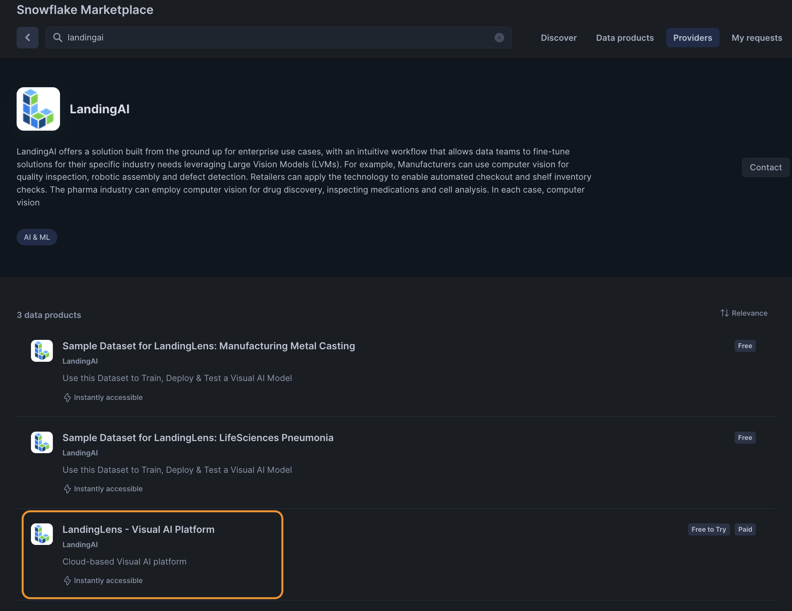

- Click the LandingLens app and click "GET" and "TRY FOR FREE" to install the app.

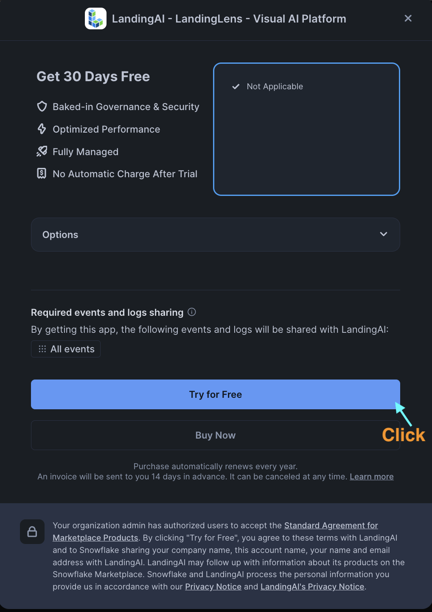

- Once the installation is complete, click "Done" and "Open" the app. Then click "GRANT" and "REVIEW" button as shown below.

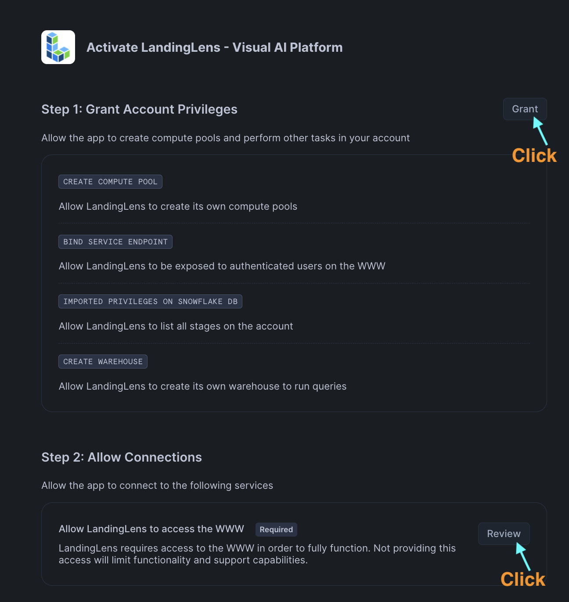

- When you click review, you will see the screenshot below for the containers to be accessible from outside world. So please click "Connect". You should see a screens below.

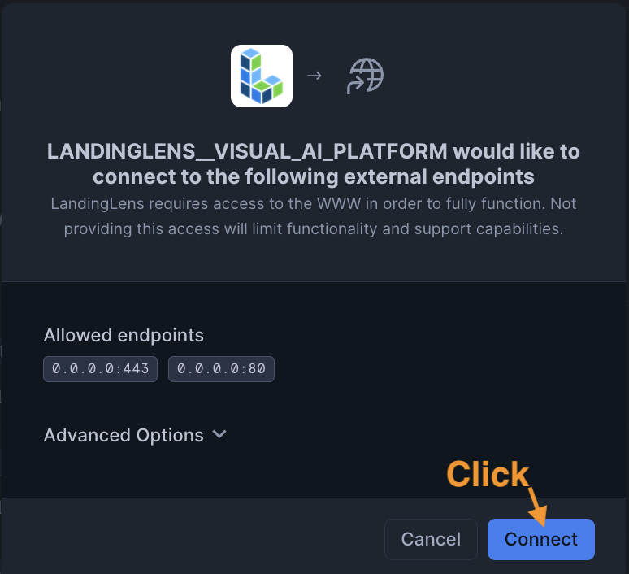
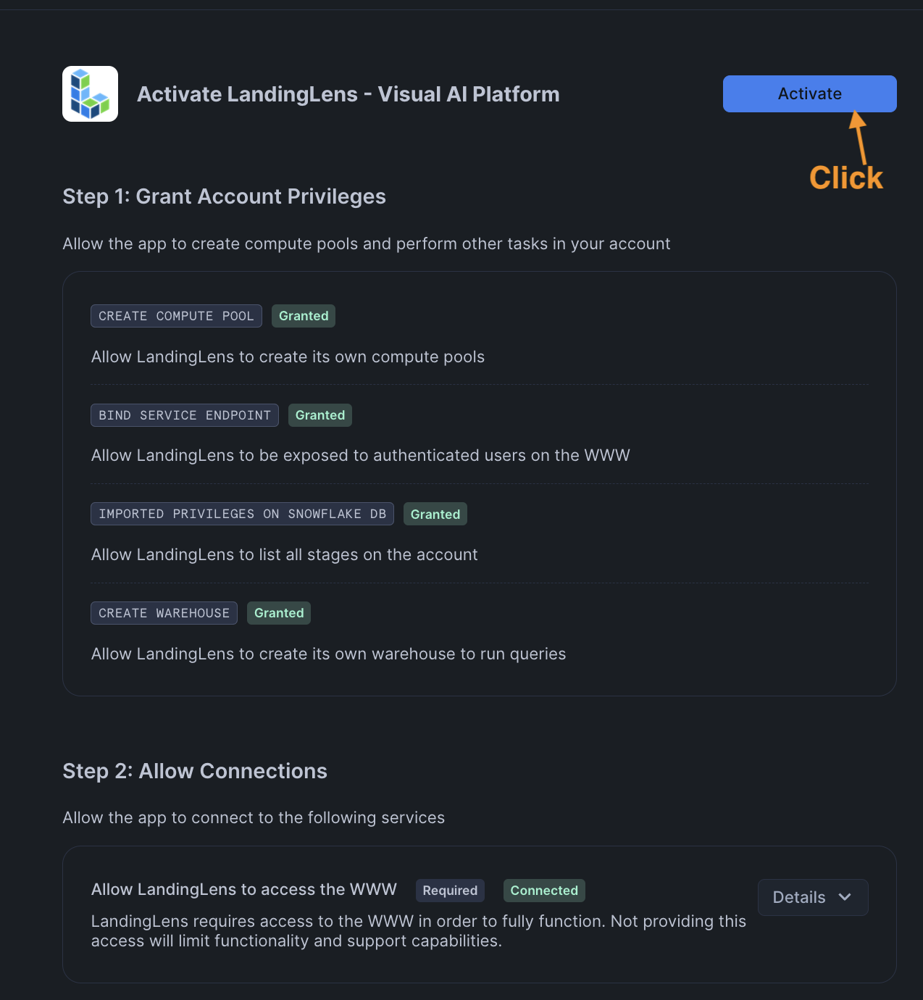

- Then click "Activate" now, and click "Launch" button which will bring up a streamlit app which installs the app in your account.

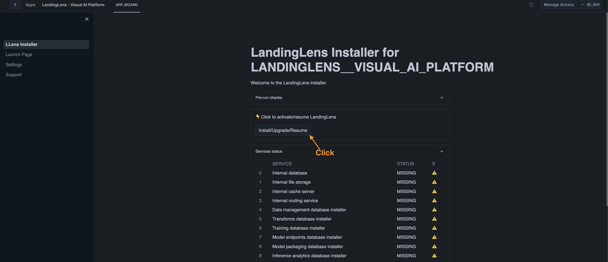

- Then click "Install/Upgrade/Resume" to install the services. This will install around 25 services behind the scenes, so please wait for around 20 minutes for the installation to complete.

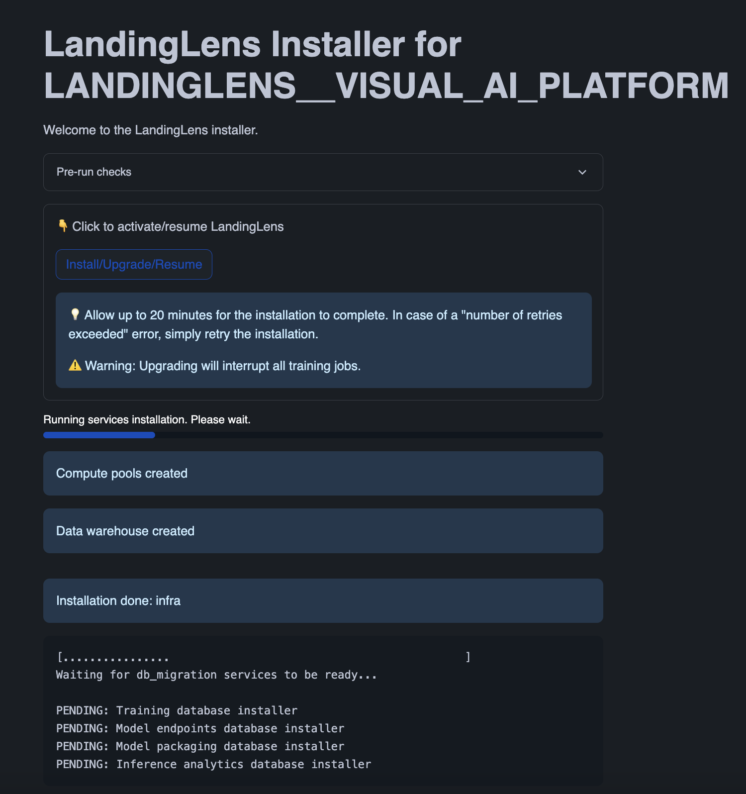

- Once the installation is successful, you will see an endpoint as below screenshot. Open a new tab with the endpoint to open the LandingLens app.

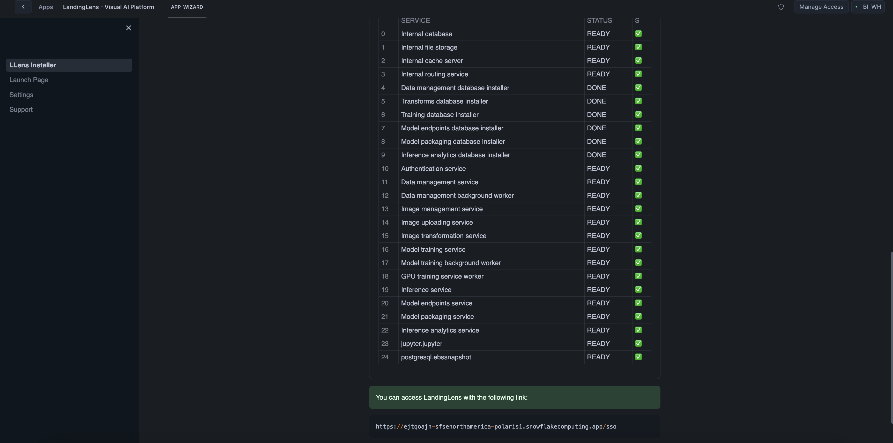

Congratulations! The LandingLens app is now available in your Snowflake account. When you open the endpoint in the browser, you will see the app running as below.

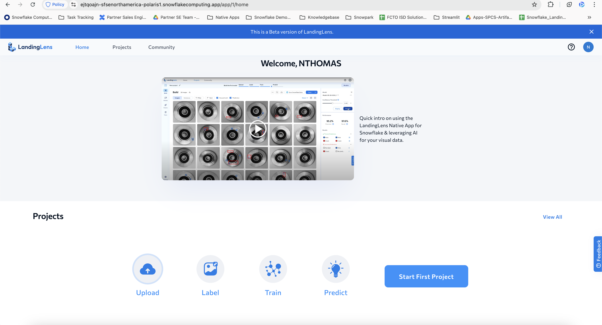


- Now, lets get some sample data for LandingLens to perform the classification. Good news is that, LandingAI has launched couple of apps just to have the sample data for building it. First of the kind is [Lifesciences Pnemonia](https://app.snowflake.com/marketplace/listing/GZTYZ12K65CA/landingai-sample-dataset-for-landinglens-lifesciences-pneumonia?originTab=provider&providerName=LandingAI&profileGlobalName=GZTYZ12K65BX) and the other is [Manufacturing defect detection](https://app.snowflake.com/marketplace/listing/GZTYZ12K65C6/landingai-sample-dataset-for-landinglens-manufacturing-metal-casting?originTab=provider&providerName=LandingAI&profileGlobalName=GZTYZ12K65BX)

- Click [Lifesciences Pnemonia](https://app.snowflake.com/marketplace/listing/GZTYZ12K65CA/landingai-sample-dataset-for-landinglens-lifesciences-pneumonia?originTab=provider&providerName=LandingAI&profileGlobalName=GZTYZ12K65BX) app, Click "Get" and install the app.

- Click [Manufacturing defect detection](https://app.snowflake.com/marketplace/listing/GZTYZ12K65C6/landingai-sample-dataset-for-landinglens-manufacturing-metal-casting?originTab=provider&providerName=LandingAI&profileGlobalName=GZTYZ12K65BX) app, Click "Get" and install the app.

- Open both the installed app, click "security icon" and click "Review" and enable the toggle bars to provide grants for the app to create database to load the sample data.

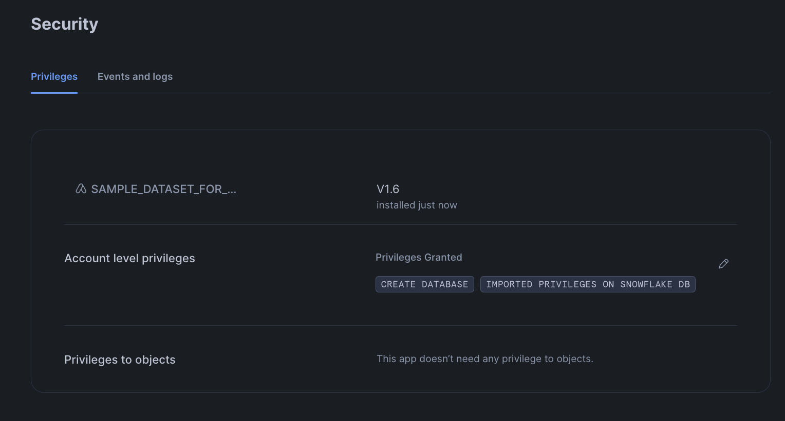

- Once the permissions are done, please click the tab as below to open the streamlit app.

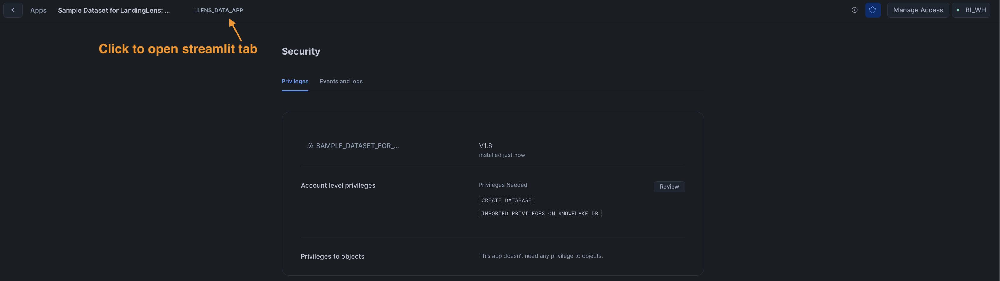

- Once the permissions are done, please click "Create Sample Dataset" button to download all the images needed for the demo into your snowflake account.

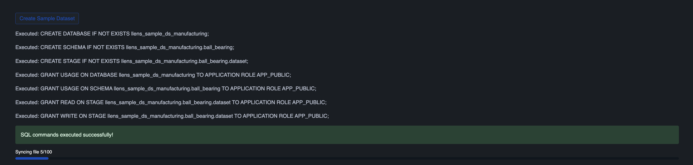

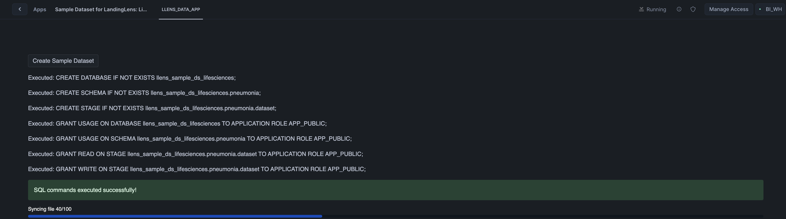


## Data Preparation

Duration: 5

Next, open a Snowsight SQL worksheet and run the SQL commands below from top to bottom.

```sql
-- Main Script: Basic Setup

-- Step 0: Use the ACCOUNTADMIN role for the following operations
USE ROLE ACCOUNTADMIN;

-- Step 1: Create an event table (customize the database, schema, and table name as needed)

-- first, check whether you already have an event table:
SHOW PARAMETERS LIKE 'event_table' in ACCOUNT;

-- if the above command returns an empty result, create an event table
-- (customize the database, schema, and table name as needed):
CREATE DATABASE IF NOT EXISTS TELEMETRY;
CREATE SCHEMA IF NOT EXISTS TELEMETRY.PUBLIC;
CREATE EVENT TABLE IF NOT EXISTS TELEMETRY.PUBLIC.EVENTS;
ALTER ACCOUNT SET EVENT_TABLE = TELEMETRY.PUBLIC.EVENTS;

-- Enable telemetry sharing
ALTER APPLICATION LANDINGLENS__VISUAL_AI_PLATFORM SET SHARE_EVENTS_WITH_PROVIDER = TRUE;

-- Step 2: Create access to the LandingLens app to the stages created by both the dataapps in the installation demo

GRANT USAGE ON DATABASE llens_sample_ds_manufacturing TO APPLICATION LANDINGLENS__VISUAL_AI_PLATFORM;
GRANT USAGE ON SCHEMA llens_sample_ds_manufacturing.ball_bearing TO APPLICATION LANDINGLENS__VISUAL_AI_PLATFORM;
GRANT READ ON STAGE llens_sample_ds_manufacturing.ball_bearing.dataset TO APPLICATION LANDINGLENS__VISUAL_AI_PLATFORM;


GRANT USAGE ON DATABASE llens_sample_ds_lifesciences TO APPLICATION LANDINGLENS__VISUAL_AI_PLATFORM;
GRANT USAGE ON SCHEMA llens_sample_ds_lifesciences.pneumonia TO APPLICATION LANDINGLENS__VISUAL_AI_PLATFORM;
GRANT READ ON STAGE llens_sample_ds_lifesciences.pneumonia.dataset TO APPLICATION LANDINGLENS__VISUAL_AI_PLATFORM;

```

- Once the permissions are done, please click "Create Sample Dataset" button to download all the images needed for the demo into your snowflake account.


Once the copy is finished, the app will show you the details about where the dataset was copied to.

Take notes of the database, schema and stage names as you will need them in the next steps.

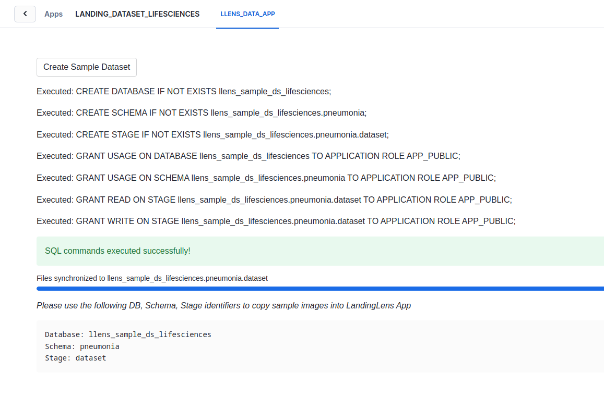

Refer to the [documentation](https://landing.ai/snowflake) for more details about how to use the LandingAI Native App.

<!-- ------------------------ -->
## Building a LifeSciences Pnemonia detection project

Duration: 20


### Importing the images to LandingLens
Now, we are going to import the copied images to a LandingLens classification project.

Open the LandingLens app in your Snowflake account, login with your credentials and click on the "Start First Project" button.

In the project creation screen, give a name to your project, select "Classification" as the project type and click on the "sync Snowflake Data" button, as shown below.

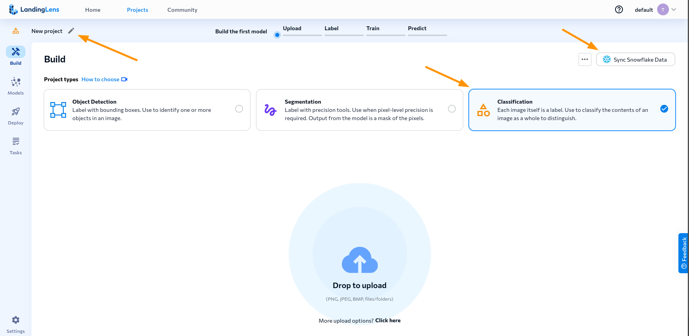

In the sync screen, select the database, schema and stage where the images were copied to. If should be `LLENS_SAMPLE_DS_LIFESCIENCES` for database, `PNEUMONIA` for the schema and `DATASET` for the stage.

When you select those values, you will see a warning message saying that it is not possible to read the stage. In order to fix that, you need to copy the commands shown in the sync dialog and run them in a Snowsight SQL worksheet.

After granting permission, you will be able to sync the data. Check the "Classify images based on folder names", so it also imports the labels, and then click on the "Sync" button, as shown below.

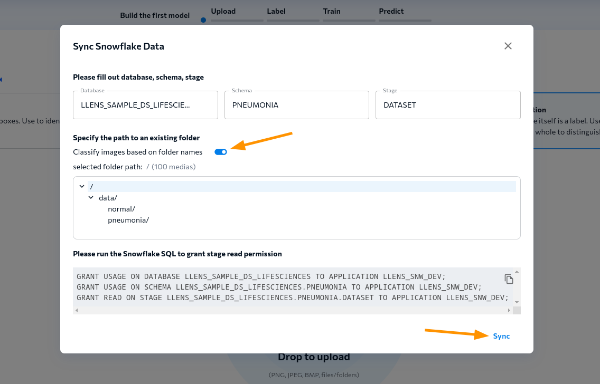

Once the syncronization process finishes, the images will be imported to the project and will be shown in LandingLens data browser. You can now click on the "Train" button to start training the model.

### Training


Once you click on the "Train" button, you will see on the right side panel the training progress. LandingLens will provision a GPU, configure the dataset and run the training process. This process can take a few minutes to complete.


Once training finishes, you will see both the original labels and the model predictions in the main project page. You will also be able to see the model performance, and the "Try model" button, which allows you to test the model with new images.

In the "Models" tab, you can see the trained model and its details. You can also see detailed metrics about the model performance, which allows you to play with the datasets and labels to improve model performance.

In this example case, the trained model should be already performing quite well.


### Deploying the model to an endpoint

Once you are satisfied with the model performance, you can deploy it to an endpoint. To do that, click on the "Deploy" button in the models tab. Select "Cloud deployment", give the new endpoint a name and hit "Deploy".


Once the model is deployed, you will be redirected to the "Deploy" tab, with your new endpoint already selected. In this tab, you will need to get the endpoint URL, which you can use to make predictions with the model.


LandingLens provide several ways to run inferences using your trained model. You can use the Python library to integrate the model with your applications with very few lines of code. You can find the documentation for the Python library [here](https://landing-ai.github.io/landingai-python/inferences/snowflake-native-app/).

You can also use LandingEdge ([documentation here](https://support.landing.ai/docs/landingedge-overview)) or Docker deployment ([documentation here](https://support.landing.ai/docs/docker-deploy)) to run inferences on the edge or on your own infrastructure.

<!-- TODO: Uncomment this section once the endpoint function will be available.

Another alternative is using our built-in Snowflake functions to make predictions directly from Snowflake. For example:

```sql
SELECT
    -- Replace "ac104c43-c6eb-4d1a-8a94-cfaf3dae8f70" below with the deployed cloud endpoint ID
    LANDING_APP_NAME.code.run_inference(file_url_column, 'ac104c43-c6eb-4d1a-8a94-cfaf3dae8f70') as inference
FROM table_with_image_files
WHERE
    some_condition = true;
```
-->

For permissions needed to use LandingEdge, Docker deployment and Snowflake functions, please check the "Settings" tab in the LandingLens installer.


<!-- ------------------------ -->
## Conclusion And Resources
Duration: 2

Thanks to RelationalAI’s Native App on Snowflake, we built a recommendation system with just a few steps. Although the dataset used was a small graph with thousands of nodes and edges, our solution can scale to real world datasets due to our cloud-native architecture that separates compute from storage.

In this Quickstart you learned

- How to find and install the RelationalAI Native App from the Snowflake Marketplace
- How to build a knowledge graph on top of your Snowflake data without having to extract data from Snowflake
- How to create a recommender system using graph algorithms on the MovieLens 100k dataset.

### Related Resources
- To learn about more about RelationalAI and view full documentation, visit [https://relational.ai](https://relational.ai)
- To see a brief summary of the recommender system you just built, see [Blogpost](https://medium.com/@haythemtellili/recommender-systems-with-relationalais-snowflake-native-app-68d9c76bb07f)
- [Snowflake Marketplace](https://app.snowflake.com/marketplace)
- More info on [Snowflake Native Apps](https://docs.snowflake.com/en/developer-guide/native-apps/native-apps-about)