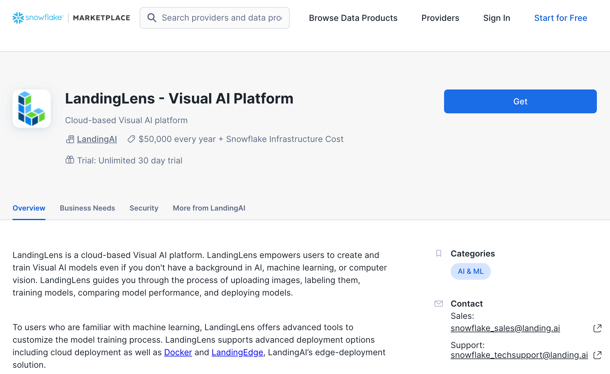
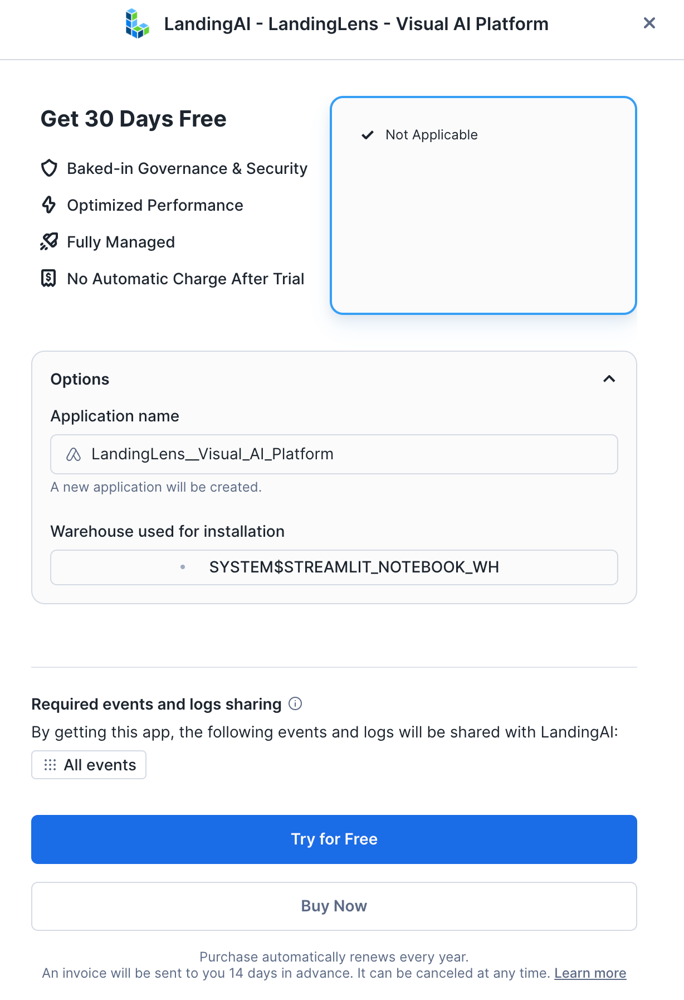
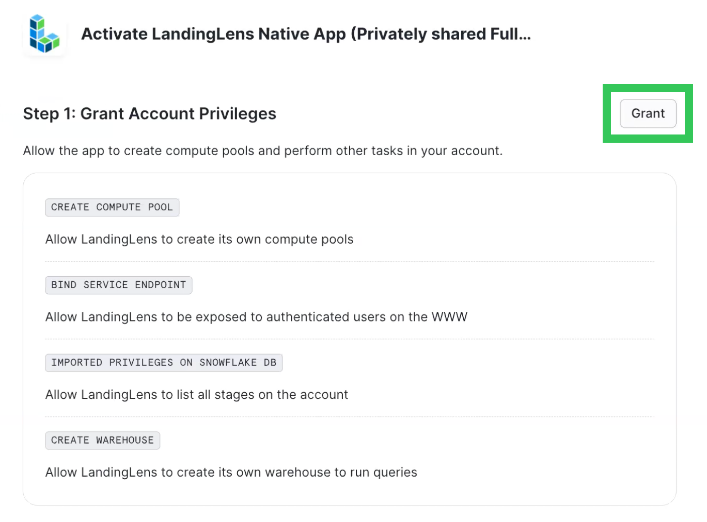
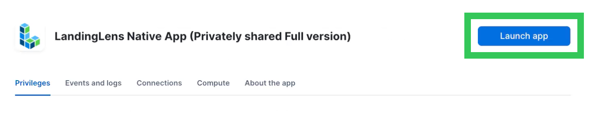
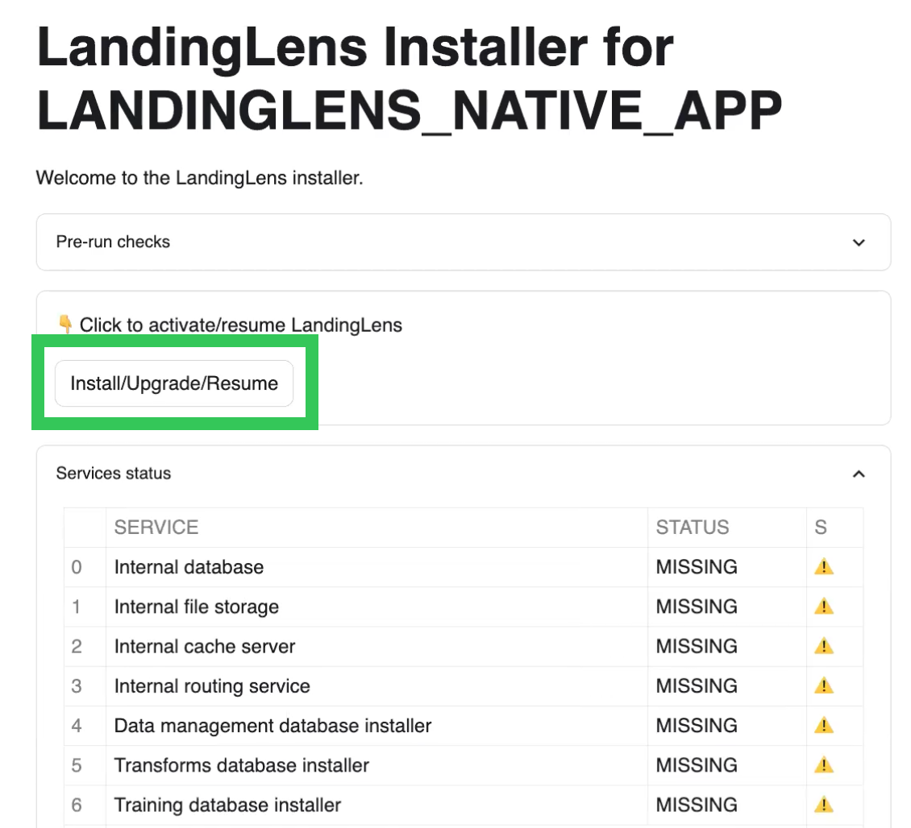
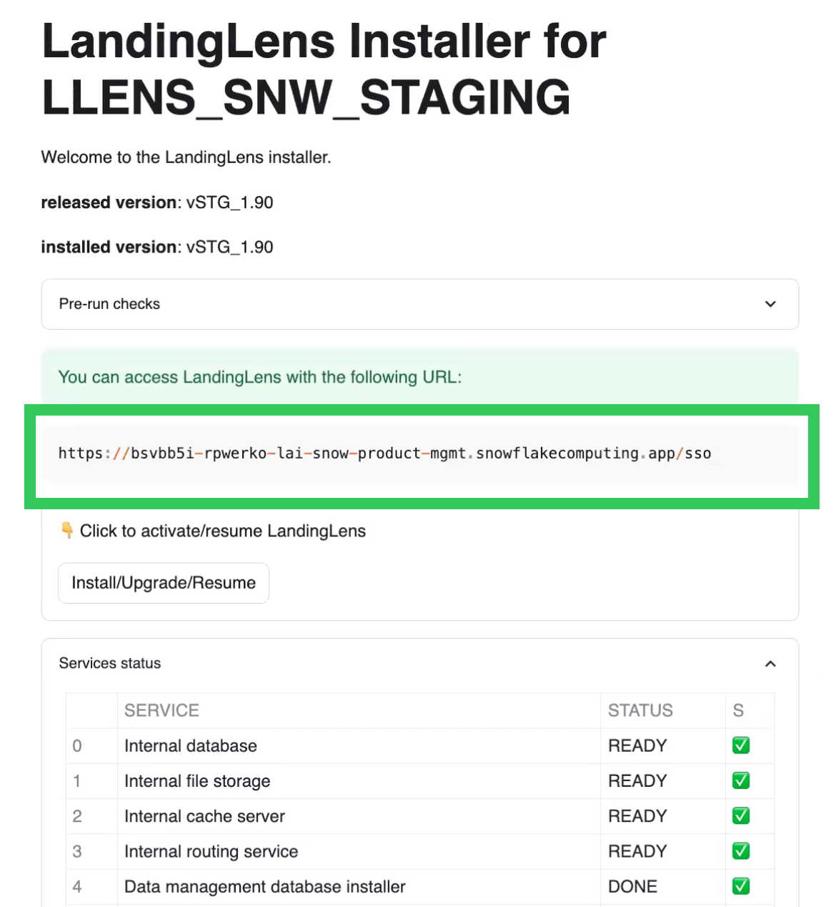

author: Naveen Thomas
id: build_collaborative_large_language_vision_models_with_landingai_and_snowflake
summary: This guide shows how to use LandingLens and Snowflake to create a computer vision model that detects pneumonia in X-ray images.
categories: data-science, genai, LLM, LVM, landingai
environments: web
status: Published
tags: Getting Started, Data Science, Data Engineering, LandingAI, LVM

# Computer Vision Models with LandingLens on Snowflake

## Overview
Duration: 1

In this quickstart, we'll use LandingLens — a Native App available in the Snowflake Marketplace — to create a computer vision model that detects pneumonia in X-ray images. After completing this quickstart, users can use the concepts and procedures from this quickstart to build Object Detection, Segmentation, and Classifications models in LandingLens. 

### What Is LandLens?
LandingLens is a cloud-based Visual AI platform. LandingLens empowers users to create and train Visual AI models even if you don't have a background in AI, machine learning, or computer vision. LandingLens guides you through the process of uploading images, labeling them, training models, comparing model performance, and deploying models.

To users who are familiar with machine learning, LandingLens offers advanced tools to customize the model training process. LandingLens supports advanced deployment options including cloud deployment as well as [Docker](https://support.landing.ai/landinglens/docs/docker-deploy) and [LandingEdge](https://support.landing.ai/landinglens/docs/landingedge-overview), LandingAI’s edge-deployment solution.

### What You'll Learn

- How to install LandingLens from the Snowflake Marketplace
- How to load sample data from a Snowflake stage
- How to build a Classification computer vision model in LandingLens


### What You’ll Need
- A [Snowflake](https://signup.snowflake.com/?utm_cta=quickstarts_) account
- Snowflake privileges on your user to [Install a Native Application](https://other-docs.snowflake.com/en/native-apps/consumer-installing#set-up-required-privileges)
- A warehouse to *install* LandingLens (the warehouse can be any size and can have auto-suspend enabled)
- A warehouse to *run* LandingLens


### What You’ll Build
- A computer vision Classification model to detect pneumonia

<!-- ------------------------ -->

## Install the LandingLens Native App in Your Account
Duration: 30

1. Open the [LandingLens app listing](https://app.snowflake.com/marketplace/listing/GZTYZ12K65CU/landingai-landinglens-visual-ai-platform) in the Snowflake Marketplace and click **Get**.
   
   
2. Select the **Warehouse** to use for the installation process. The warehouse is only used to install the app, and can be any size (including X-Small).
3. If you want to change the name of the application, click **Options** and enter a name in **Application Name**.
4. Click **Try for Free**. This starts a 30 day free trial of LandingLens.
   

5. Go to **Snowsight** > **Data Products** > **Apps**. Double-click the LandingLens app listing. (Although the app is listed in the Installed Apps section, it is not installed yet.)
   

6. A new page opens. It has a series of steps that guide you through the installation process.
7. In **Step 1**, click **Grant**. These permissions allow LandingLens to create compute pools and perform other tasks in your account.
   
   
8. In **Step 2**, click **Review**. Review the allowed endpoints on the pop-up and click **Connect**. This allows LandingLens to access the World Wide Web (WWW).
9. Scroll to the top of the page and click **Activate**.
   
   
10. LandingLens opens in your Apps. Click **Launch App**.
      
   
11. The installer opens in the **APP_WIZARD** tab.
12. Click **Install/Upgrade/Resume**. The installer installs all the required services for the LandingLens app. This process takes about 20 to 30 minutes. Do NOT close the tab during the installation process, because it will stop the process.
      
   
13. Once the installation process is complete, all services have the status DONE or READY (green checkmark) and the URL to access LandingLens displays. Copy and paste the URL.  
      
14. Paste the URL into a new tab to open the LandingLens app. We recommend bookmarking this URL. you can log in to the app using the Snowflake credentials you used to install the app. Only users with the correct privileges in the account can access the LandingLens app.
   
   
    
<!-- ------------------------ -->

## Get Sample Images
Duration: 15

Now that you've installed the LandingLens app, you are ready to get the sample images. LandingAI provides a set of sample images as an "app" that can be downloaded from the Snowflake Marketplace. You will use these images to train a computer vision model in LandingLens that detects pneumonia.

To get the sample images, follow these instructions:

1. Open the [Sample Dataset for LandingLens: LifeSciences Pneumonia listing](https://app.snowflake.com/marketplace/listing/GZTYZ12K65CA/landingai-sample-dataset-for-landinglens-lifesciences-pneumonia) in the Snowflake Marketplace and click **Get**.
2.Go to **Snowsight** > **Data Products** > **Apps**. Click the **Sample Dataset for LandingLens: LifeSciences Pneumonia** app listing.
3. Click the **Shield** icon in the top right corner of this app page.
4. Click **Review** and allow the CREATE DATABASE privilege, which grants the app to create a database to load the sample data.
5. Open the **LLENS_DATA_APP** tab.
6. Click **Create Sample Dataset** to load the dataset into your Snowflake account.
7. Make a note of the location of the images; you will use these later.
   --Database: llens_sample_ds_lifesciences
   --Schema: pneumonia
   --Stage: dataset


- Open both the installed app, click "security icon" and click "Review" and enable the toggle bars to provide grants for the app to create database to load the sample data.


- Once the permissions are done, please click the tab as below to open the streamlit app.


- Once the permissions are done, please click "Create Sample Dataset" button to download all the images needed for the demo into your snowflake account.


## Data Preparation

Duration: 5

Next, open a Snowsight SQL worksheet and run the SQL commands below from top to bottom.

```sql
-- Main Script: Basic Setup

-- Step 0: Use the ACCOUNTADMIN role for the following operations
USE ROLE ACCOUNTADMIN;

-- Step 1: Create an event table (customize the database, schema, and table name as needed)

-- first, check whether you already have an event table:
SHOW PARAMETERS LIKE 'event_table' in ACCOUNT;

-- if the above command returns an empty result, create an event table
-- (customize the database, schema, and table name as needed):
CREATE DATABASE IF NOT EXISTS TELEMETRY;
CREATE SCHEMA IF NOT EXISTS TELEMETRY.PUBLIC;
CREATE EVENT TABLE IF NOT EXISTS TELEMETRY.PUBLIC.EVENTS;
ALTER ACCOUNT SET EVENT_TABLE = TELEMETRY.PUBLIC.EVENTS;

-- Enable telemetry sharing
ALTER APPLICATION LANDINGLENS__VISUAL_AI_PLATFORM SET SHARE_EVENTS_WITH_PROVIDER = TRUE;

-- Step 2: Create access to the LandingLens app to the stages created by both the dataapps in the installation demo

GRANT USAGE ON DATABASE llens_sample_ds_manufacturing TO APPLICATION LANDINGLENS__VISUAL_AI_PLATFORM;
GRANT USAGE ON SCHEMA llens_sample_ds_manufacturing.ball_bearing TO APPLICATION LANDINGLENS__VISUAL_AI_PLATFORM;
GRANT READ ON STAGE llens_sample_ds_manufacturing.ball_bearing.dataset TO APPLICATION LANDINGLENS__VISUAL_AI_PLATFORM;


GRANT USAGE ON DATABASE llens_sample_ds_lifesciences TO APPLICATION LANDINGLENS__VISUAL_AI_PLATFORM;
GRANT USAGE ON SCHEMA llens_sample_ds_lifesciences.pneumonia TO APPLICATION LANDINGLENS__VISUAL_AI_PLATFORM;
GRANT READ ON STAGE llens_sample_ds_lifesciences.pneumonia.dataset TO APPLICATION LANDINGLENS__VISUAL_AI_PLATFORM;

```

- Once the permissions are done, please click "Create Sample Dataset" button to download all the images needed for the demo into your snowflake account.


Once the copy is finished, the app will show you the details about where the dataset was copied to.

Take notes of the database, schema and stage names as you will need them in the next steps.


Refer to the [documentation](https://landing.ai/snowflake) for more details about how to use the LandingAI Native App.

<!-- ------------------------ -->
## Building a LifeSciences Pnemonia detection project

Duration: 20


### Importing the images to LandingLens
Now, we are going to import the copied images to a LandingLens classification project.

Open the LandingLens app in your Snowflake account, login with your credentials and click on the "Start First Project" button.

In the project creation screen, give a name to your project, select "Classification" as the project type and click on the "sync Snowflake Data" button, as shown below.


In the sync screen, select the database, schema and stage where the images were copied to. If should be `LLENS_SAMPLE_DS_LIFESCIENCES` for database, `PNEUMONIA` for the schema and `DATASET` for the stage.

When you select those values, you will see a warning message saying that it is not possible to read the stage. In order to fix that, you need to copy the commands shown in the sync dialog and run them in a Snowsight SQL worksheet.

After granting permission, you will be able to sync the data. Check the "Classify images based on folder names", so it also imports the labels, and then click on the "Sync" button, as shown below.


Once the syncronization process finishes, the images will be imported to the project and will be shown in LandingLens data browser. You can now click on the "Train" button to start training the model.

### Training


Once you click on the "Train" button, you will see on the right side panel the training progress. LandingLens will provision a GPU, configure the dataset and run the training process. This process can take a few minutes to complete.


Once training finishes, you will see both the original labels and the model predictions in the main project page. You will also be able to see the model performance, and the "Try model" button, which allows you to test the model with new images.

In the "Models" tab, you can see the trained model and its details. You can also see detailed metrics about the model performance, which allows you to play with the datasets and labels to improve model performance.

In this example case, the trained model should be already performing quite well.


### Deploying the model to an endpoint

Once you are satisfied with the model performance, you can deploy it to an endpoint. To do that, click on the "Deploy" button in the models tab. Select "Cloud deployment", give the new endpoint a name and hit "Deploy".


Once the model is deployed, you will be redirected to the "Deploy" tab, with your new endpoint already selected. In this tab, you will need to get the endpoint URL, which you can use to make predictions with the model.


LandingLens provide several ways to run inferences using your trained model. You can use the Python library to integrate the model with your applications with very few lines of code. You can find the documentation for the Python library [here](https://landing-ai.github.io/landingai-python/inferences/snowflake-native-app/).

You can also use LandingEdge ([documentation here](https://support.landing.ai/docs/landingedge-overview)) or Docker deployment ([documentation here](https://support.landing.ai/docs/docker-deploy)) to run inferences on the edge or on your own infrastructure.

<!-- TODO: Uncomment this section once the endpoint function will be available.

Another alternative is using our built-in Snowflake functions to make predictions directly from Snowflake. For example:

```sql
SELECT
    -- Replace "ac104c43-c6eb-4d1a-8a94-cfaf3dae8f70" below with the deployed cloud endpoint ID
    LANDING_APP_NAME.code.run_inference(file_url_column, 'ac104c43-c6eb-4d1a-8a94-cfaf3dae8f70') as inference
FROM table_with_image_files
WHERE
    some_condition = true;
```
-->

For permissions needed to use LandingEdge, Docker deployment and Snowflake functions, please check the "Settings" tab in the LandingLens installer.


<!-- ------------------------ -->
## Conclusion And Resources
Duration: 2

Thanks to RelationalAI’s Native App on Snowflake, we built a recommendation system with just a few steps. Although the dataset used was a small graph with thousands of nodes and edges, our solution can scale to real world datasets due to our cloud-native architecture that separates compute from storage.

In this Quickstart you learned

- How to find and install the RelationalAI Native App from the Snowflake Marketplace
- How to build a knowledge graph on top of your Snowflake data without having to extract data from Snowflake
- How to create a recommender system using graph algorithms on the MovieLens 100k dataset.

### Related Resources
- To learn about more about RelationalAI and view full documentation, visit [https://relational.ai](https://relational.ai)
- To see a brief summary of the recommender system you just built, see [Blogpost](https://medium.com/@haythemtellili/recommender-systems-with-relationalais-snowflake-native-app-68d9c76bb07f)
- [Snowflake Marketplace](https://app.snowflake.com/marketplace)
- More info on [Snowflake Native Apps](https://docs.snowflake.com/en/developer-guide/native-apps/native-apps-about)
