author: Kelsey Hammock
id: build_customer_facing_applications_using_sigma_and_snowflake
summary: This guide will lead you through the process of connecting Sigma to a Snowflake environment and building an application that leverages the data in Snowflake. This guide additionally highlights unique end user capabilities when Sigma is embedded in an application. 
categories: app-development,partner-integrations
environments: web
status: Published 
feedback link: https://github.com/Snowflake-Labs/sfguides/issues
tags: Getting Started, Data Applications, Data Engineering, Sigma 

# Build Customer Facing Applications Using Sigma and Snowflake
<!-- ------------------------ -->
## Overview 
Duration: 5

 This lab introduces you to the user interface and embedding capabilities of Sigma Workbooks. This lab does not get into complex data analysis use cases for Sigma, but is designed to showcase the type of capabilities available in an application development use case with Sigma.

### Prerequisites
- This lab is designed for semi-technical users who will be aiding in the planning or implementation of Sigma. No SQL or technical data skills are required for this lab.  

### What You Will Learn 
- How to ingest data into Snowflake & connect to Sigma
- How to leverage Sigma functions for data prep
- How to build a workbook and visualizations
- How to embed a workbook into your application
- How end users of the application can explore data and generate new insights in a self-serve fashion with Sigma 

### What You’ll Need 
- Access to a Snowflake trial account on AWS or a Snowflake instance on AWS in which you have Account Admin permissions.
- Download Portal Template: [App_embed.zip](https://partnershiptesting.s3.us-west-2.amazonaws.com/app_embed_RAW+.zip)
- Download and Install [Node.js](https://nodejs.org/)
- Download SQL Script: [Sigma_VHOL.sql](https://partnershiptesting.s3.us-west-2.amazonaws.com/Sigma_VHOL.sql)

### What You’ll Build 
- In this lab you will build a sales performance portal that live queries against data in Snowflake and provides unique drill down and exploration capabilities to the end users through embedding Sigma. 

<!-- ------------------------ -->
## Setting up Snowflake 
Duration: 5

### Prepare Your Snowflake Lab Environment

1. If not done yet, register for a Snowflake free 30-day trial at [https://trial.snowflake.com](https://trial.snowflake.com)

- You will have different Snowflake editions (Standard, Enterprise, e.g.), cloud providers (GCP, AWS, or Azure), and regions (Us Central, Europe West, e.g.) available to you. For this lab, please select AWS as your cloud provider and at minimum enterprise edition.

- After registering, you will receive an email with an activation link and your Snowflake account URL. Bookmark this URL for easy future access. 

2. Click [here](https://partnershiptesting.s3.us-west-2.amazonaws.com/Sigma_VHOL.sql) and download the "sigma_vhol.sql" file to your local machine. This file contains pre-written SQL commands which will be used later in the lab. 
   
### The Snowflake User Interface   

### Logging into the Snowflake User Interface (UI)

1. Open a browser window and enter the URL of your Snowflake 30-day trial environment. You should see the login screen below. Enter your unique credentials to log in. 
   
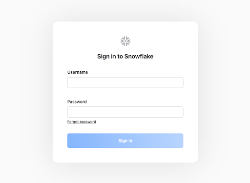
### Navigating the Snowflake Snowsight UI

1. From the Worksheets tab, click the "+ Worksheet" button in the top right to open a new worksheet. 
- In the left pane you will see the database objects browser, which enables users to explore all databases, schemas, tables, and views accessible by the role selected for a worksheet.
- The bottom pane shows results of queries and operations. 

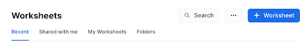

2. At the top left of the page click on the downward facing arrow next to the worksheet name, and select "Import SQL from File". Browse to the "sigma_vhol.sql" file you downloaded in the prior module. Click "Open". 
- All of the SQL commands you need to run for the remainder of this lab will now appear on the new worksheet. <strong>Do not run any of the SQL commands yet. </strong>

 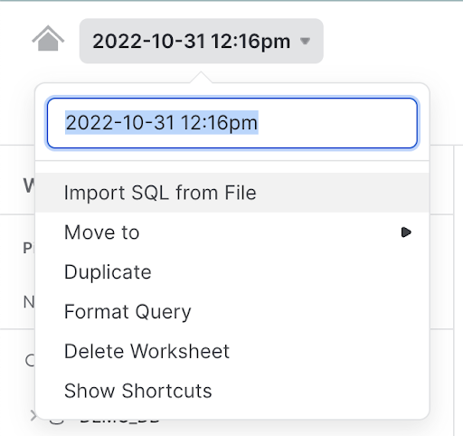 

 
  ## Provisioning Sigma
  ### Provisioning Sigma via Snowflake Partner Connect

1. On the left hand side of the Snowflake UI, navigate to Admin, then select partner connect. Click the icon for Sigma.
   
 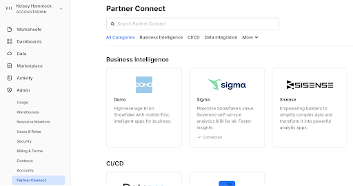  

2. You will see a dialog box that will show the objects that will be created in your Snowflake account by Sigma. We will be using the PC_SIGMA_WH warehouse, PC_SIGMA_DB database, and the PC_SIGMA_ROLE for this lab, which are automatically created for you as part of the launch. 

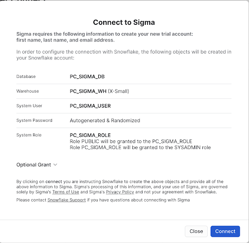

3. Click "Connect" then "Activate", which will open a new tab. You will be prompted to choose a name for the new Sigma Organization that will be created for you. Once you have chosen a name, click continue. You do not need to worry about the IP whitelisting screen, and can click "Get Started". This will open Sigma in a new tab.  <strong>Please keep this tab open, as we will return to it later in the lab. </strong>
   
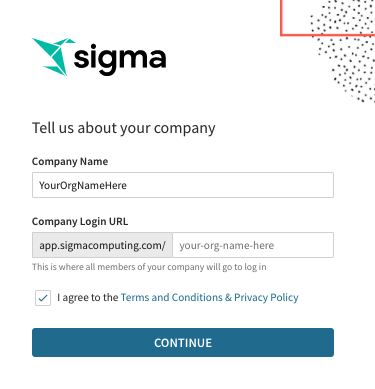

## Preparing and Loading Data into Snowflake
Duration: 5

# <Strong>The Lab Story</strong>

This Snowflake and Sigma lab will be done as part of a theoretical real world story to help you better understand why we are performing the steps in this lab, and the order they appear. 

Throughout the lab, we will be working with some common sales data from our fictitious physical retail company "Plugs Electronics". This data includes order and SKU numbers, product names, prices, store names and regions, as well as customer data. Some of this data is structured and some is JSON (semi-structured). 

We will use this data to create a retailer portal where brands who sell their products at Plugs retail locations can log in to see their sales performance across different metrics. 

### Create a Database and Table

1. Go back to the Snowflake UI and click on the worksheets tab. Per the prior steps, ensure the SQL text from the "Sigma_vhol.sql" file has been loaded into the worksheet.

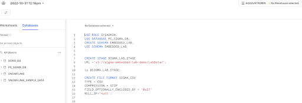

- As you can see from the SQL we loaded into our worksheet, a worksheet can have more than one command in it. SQL commands are delimited by semicolons. In order to run a single command, click anywhere on the line / command you would like to execute, then click the "Run" or "Play" button.  

- <strong>In this lab, never check the "All Queries" box at the top of the worksheet</strong>. We want to run SQL queries one at a time, in a specific order. 

2. <strong> USE ROLE ACCOUNTADMIN; </strong> This will set the context of the worksheet to use the role of ACCOUNTADMIN when we run the commands. This role holds the highest level of permission in a given Snowflake account, and can create new objects, grant permissions to other roles, and more. 

3. <strong> USE WAREHOUSE PC_SIGMA_WH; </strong> Sets the PC_SIGMA_WH to be used for commands run in the worksheet. As you can see by the (XS) to the right of the warehouse name, an extra small warehouse is being used for this lab. An XS translates to a single node cluster for our virtual warehouse. [Here is a link to Snowflake's docs covering warehouses in detail.](https://docs.snowflake.com/en/user-guide/warehouses-overview.html)
4. <strong> USE DATABASE PC_SIGMA_DB; </strong> This command tells Snowflake to operate off the PC_SIGMA_DB database, which was created when your Sigma trial was spun up. 
5. <strong>CREATE SCHEMA IF NOT EXISTS EMBEDDED_LAB;</strong> This creates a new schema in our PC_SIGMA_DB database.
6. <strong>USE SCHEMA EMBEDDED_LAB; </strong>This sets the context of the worksheet to use our newly created schema. 
7. <strong>CREATE STAGE IF NOT EXISTS SIGMA_LAB_STAGE URL = 's3://sigma-embedded-lab-demo/LabData/'; </strong>This creates an external stage in Snowflake that points to an S3 bucket that has the data files we would like to use for the lab. 
8. <strong>LS @SIGMA_LAB_STAGE; </strong>This command lists all of the files in the stage we just created. 

### Loading Data into Snowflake

The data we will be using is demo data for a fictitious retailer called Plugs Electronics. This data has been exported and pre-staged for you in an AWS S3 bucket in the US-East (Northern Virginia) region. The data is in a CSV format, and includes transaction data like order numbers, product names and prices, as well as customer information. This data set is just under 4 million rows.

1. <strong> 
CREATE FILE FORMAT IF NOT EXISTS SIGMA_CSV 
   TYPE = CSV 
   COMPRESSION = GZIP 
   FIELD_OPTIONALLY_ENCLOSED_BY = '0x27' 
   NULL_IF= 'null' ;
</strong>

 

2. <strong>
CREATE TABLE IF NOT EXISTS TRANSACTIONS 
   (ORDER_NUMBER INTEGER, 
   PURCHASE_DATE TIMESTAMP, 
   TRANSACTION_TYPE STRING, 
   PURCHASE_METHOD STRING, 
   SALES_QUANTITY INTEGER, 
   SALE_AMOUNT INTEGER, 
   ITEM_PRICE INTEGER, 
   WHOLESALE_COST INTEGER, 
   PRODUCT_KEY INTEGER, 
   PRODUCT_NAME STRING, 
   PRODUCT_TYPE STRING, 
   PRODUCT_FAMILY STRING, 
   PRODUCT_BRAND STRING, 
   STORE_KEY INTEGER, 
   STORE_NAME STRING, 
   STORE_CITY STRING, 
   STORE_STATE STRING, 
   STORE_ZIP STRING, 
   STORE_REGION STRING, 
   ORDER_CHANNEL STRING, 
   CUST_KEY INTEGER, 
   CUST_SINCE TIMESTAMP, 
   CUST_JSON VARIANT 
    );
</strong>

We have data files in our stage as shown in the previous list (ls) command. These files have certain formats that need to be defined in Snowflake in order for the data to be properly loaded. In this case, we are creating a file format named SIGMA_CSV that is specifying that the data in the files is delimited by commas, has been compressed, and how null values can be determined. We additionally created a table to hold the data we are about to load. More information regarding file formats can be found [here](https://docs.snowflake.com/en/sql-reference/sql/create-file-format.html). 

3. <strong>COPY INTO TRANSACTIONS FROM @SIGMA_LAB_STAGE
   FILE_FORMAT = SIGMA_CSV;</strong>

  - This copies the data from our S3 bucket and loads it into our Transactions table. A SELECT COUNT(*) from the table will show we loaded 3.9 million rows into the table. 

4. <strong>GRANT USAGE ON DATABASE PC_SIGMA_DB TO ROLE PC_SIGMA_ROLE; </strong>
 - Snowflake access rights are based upon [role based access control (RBAC)](https://docs.snowflake.com/en/user-guide/security-access-control-overview.html). This command allows the PC_SIGMA_ROLE to use the PC_SIGMA_DB database. 
  
5. <strong> GRANT USAGE ON SCHEMA PC_SIGMA_DB.EMBEDDED_LAB TO ROLE PC_SIGMA_ROLE; </strong>
  - This allows the PC_SIGMA_ROLE to use the schema we created earlier in the lab. 

6. <strong>GRANT SELECT ON ALL TABLES IN SCHEMA PC_SIGMA_DB.EMBEDDED_LAB TO ROLE PC_SIGMA_ROLE;</strong> 
- This allows our PC_SIGMA_ROLE to query against the transactions table we created. 
   
7. <strong>USE ROLE PC_SIGMA_ROLE; </strong>
- We completed granting access to the data we ingested to the PC_SIGMA ROLE. This command will now allow the user to start reporting on the data from Sigma using this role. 

8. <strong>SELECT * FROM TRANSACTIONS LIMIT 1000;</strong>
- A SELECT * against the transactions table should complete successfully and show the data we have loaded. If not, please go back and re-run the prior steps of this module using the SYSADMIN role to ensure permissions were granted to the new role appropriately.    
  

## Building Your Sigma Workbook 
Duration: 10
### Connecting Your Workbook to the Dataset

1. Navigate to the Sigma tab that was previously opened through partner connect. Select the top left Paper Crane logo to navigate back to the Sigma homepage if you are not there already. 

2. Let's create a new Workbook and connect it to the data we just ingested into Snowflake. Click on the "<strong>+ Create New</strong>" button at the top left of the page and select "Create New Workbook".

3. We are now inside a Sigma Workbook. Sigma workbooks are a collaborative canvas for data driven decision makers. Each workbook can have one or more pages, and each page has its own canvas. Each canvas supports one or more visual elements (e.g. charts, tables, controls, images, etc).

4. We'll first add a new data source to our workbook. Click the "+" icon on the left hand side in the Elements sidebar, then select the "Table" option. For source, select "Tables and Datasets". 

5. On the resulting page, navigate to "Connections", expand the drop down, and click into "Snowflake PC_SIGMA_WH". Select "PC_SIGMA_DB", then navigate to the EMBEDDED_LAB schema and select the "TRANSACTIONS" table. You will notice Sigma automatically populates a preview of the table. Click "Select" to begin our data modeling. 

 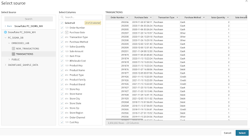

 ### Workbook Analysis 
 In this segment we will begin to clean up the data set for our customer portal. We will create calculations, parse JSON, and build visualizations with the ultimate goal of creating and embedding a dashboard for our brand managers to get a sense of how their products are performing in Plugs Electronic's stores. 

 1. First, let's save our workbook as 'Customer Portal Workbook' by clicking "Save As" at the top of the page. We will then rename our workbook page to "Data" by clicking the down arrow next to "Page 1" in the bottom left of the UI. 

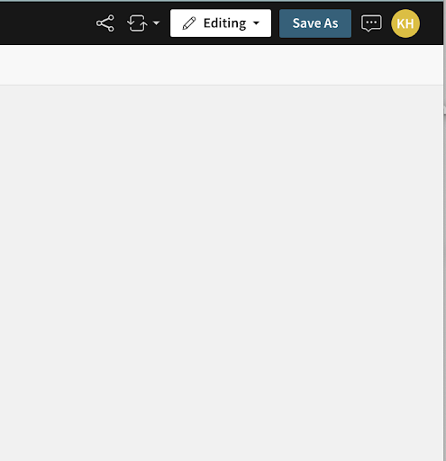

  - All workbooks are considered purely exploratory until you as their creator actively save the first version. This means you have one central location to start both your ad-hoc analysis and reporting. Once you begin exploring your data, you can choose to leave the unsaved workbook behind, or you can save it and continue to build it out as a report. 

  2. Let's start by formatting our currency columns. Select the columns for Sale Amount, Item Price, and Wholesale Cost, then click the "$" icon by the formula bar. You will see that these columns are now formatted as currency.

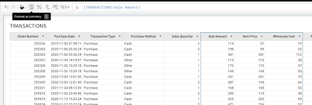

  3. Double click on the Sale Amount column name and rename this column to Revenue.

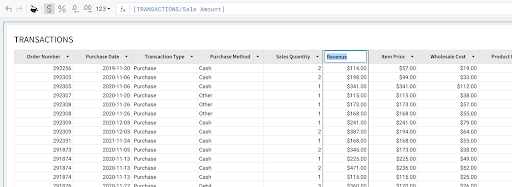

  4. Click the drop down to the right of Purchase Date and select "Truncate Date - Day". This will now display the purchase timestamps as the date only. Rename the column to Purchase Date, by double clicking the column name and typing "Purchase Date". Repeat this process for the Cust Since column.

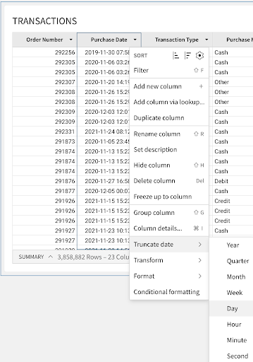

  5. On the far right side of the table you will see the CUST_JSON column. This column holds JSON data around the customers who made these purchases. Click on the arrow to the right of the column name, and choose "extract columns". This will bring up a window where Sigma has already identified the fields within the JSON object. Select Age Group and Cust_Gender, then click confirm. You will notice that Sigma intuitively parses this data out of the JSON object and adds it to the table as columns. 

  6. To prevent end users from extracting more sensitive customer information, click the arrow next to the Cust_JSON column and select "Hide Column" from the drop down. 

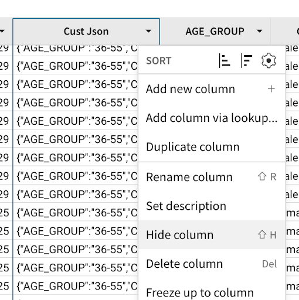

 7. Finally, click the Revenue column once more. For reporting purposes, we are going to remove the decimals so that our total Revenue metrics in the report are more aligned with the industry standard. With the column selected, click the decrease decimal places button in the top tool bar twice to turn this into a whole number. 

 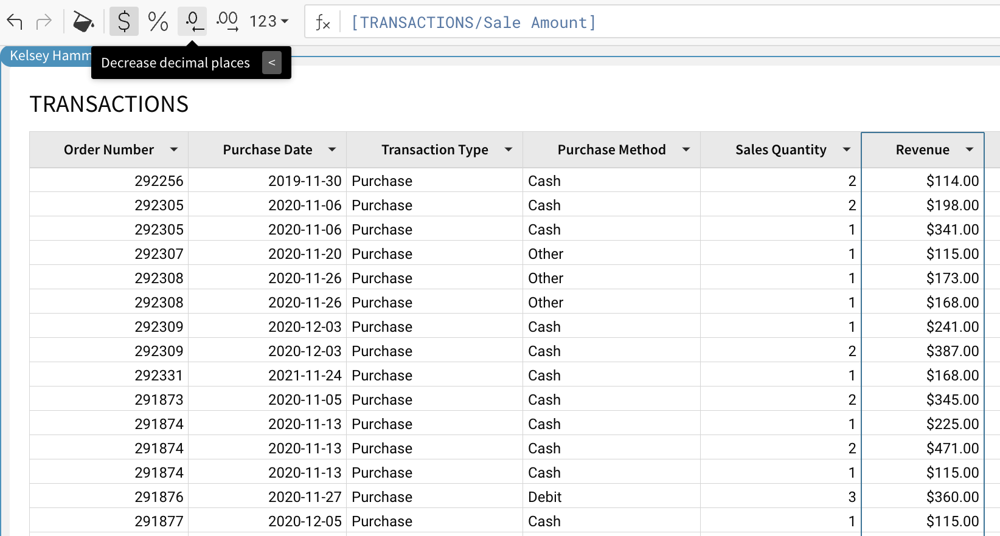

  - Every action we take in Sigma produces machine-generated SQL, optimized for Snowflake, that runs live against the warehouse. This ensures that the data is secure and up to date at all times. You can see the queries we are generating by clicking the dropdown next to the refresh button on the top right and selecting "Query History". 

 - If we navigate back to our Snowflake environment, we can see the queries being pushed down in our Snowflake query history view as well.

  ## Creating Visualizations & Filters
Duration:15
  ### Creating Visualizations
  It is often easier to spot trends, outliers, or insights which lead to further questions when viewing data in a visualization. Sigma makes it easy to create visualizations of your data while also enabling you to dig into the data that makes up the visualization. 

  1. Start the creation of a visualization by clicking on the Transaction table that we just built, then clicking the "Create Child Element" icon on the top right corner. Select "Visualization" to start creating a new chart. 
   
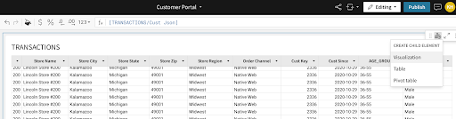

  2. You will see a new visualization element has been created under our table. In the left-hand bar you will see a dropdown that lists all of the visualizations that Sigma currently supports. Select the bar chart. 

  3. On the X-Axis click the plus icon and add our "Store Region" column. Notice that Sigma allows you to search for the column you would like to add. We can also drag values onto the axis instead of using the add button. Find "Revenue" in the list of columns and drag it to the Y-axis. The value will automatically aggregate and become "Sum of Revenue". Double click the header on the bar chart and name it Revenue by Store Region. 

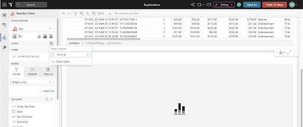
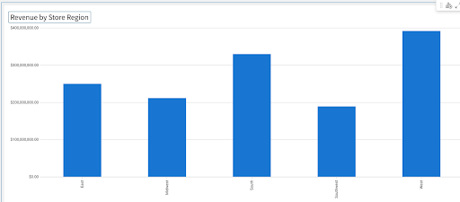

  4. Click the 'kebab' (3 dots) on the top right hand side of the element. From the drop down, select 'move to new page'. This will create a new page in our workbook to hold our visualizations. Rename this new page "Customer Portal".
   
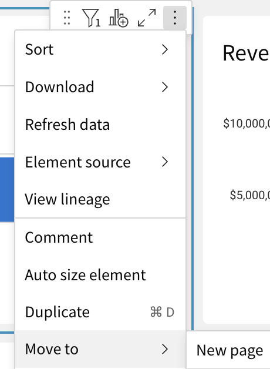

  5. Now let's look at our sales over time to get an understanding of how we are trending. Another way to create a new chart is by selecting the plus icon on the top of the left hand panel next to our 'Page Overview' title. Click on this icon to get a list of elements that we can add to our canvas, and choose 'Viz'. 

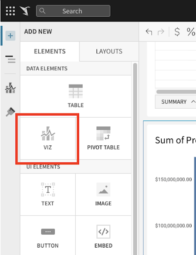

  6. After selecting the 'Viz' icon, you will be prompted to select a source to use for the new visualization. You can see tabs for selecting:
- <strong> In Use </strong> : sources that are currently being used by other elements in the workbook.
- <strong> New </strong>: a new source that could be a table, dataset, SQL, or uploaded CSV.
- 
<strong> Page Elements </strong> : any data elements already in the workbook, such as the bar chart or table we created.  

 
  From the "In Use" tab, select the Workbook Element "Transactions". 

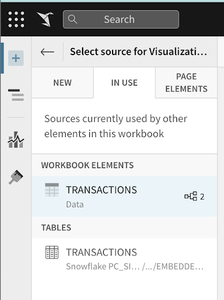

  7. Click on the visualization drop down and select "Line". Next, drag the "Purchase Date" column to the X-Axis. (Optionally add it using the + icon next to the x-axis)

  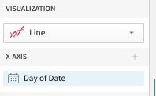

  8. We previously truncated our purchase date timestamp to the day of date, but can change this aggregation level for the visualization. Using the dropdown next to the field name, select a new aggregation level under the "Truncate Date" submenu. Let's change the aggregation level to be "Month".   

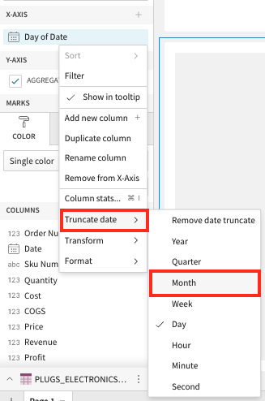

  9.  Next we can place our "Revenue" column on the Y-Axis to see our revenue over time. Again, Sigma has automatically summed the revenue to the monthly level.

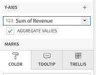

  10. We now have a line graph with revenue by month. Let's add some more detail by breaking the series out by customer age group. To do this add "AGE_GROUP" to the color grouping section in the left sidebar.  

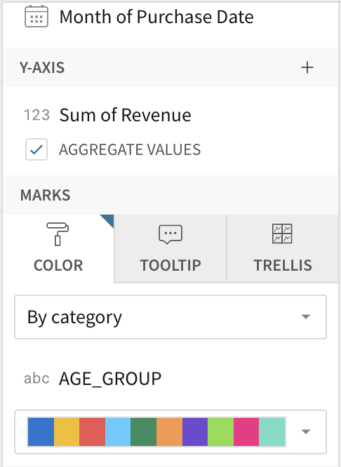

  11. You will notice a sharp drop off on the right side of the chart where our data end. Right click on the right most data point, and select "exclude 2022-04". Once this is done, rename the visualization to "Revenue by Month & Age Group".

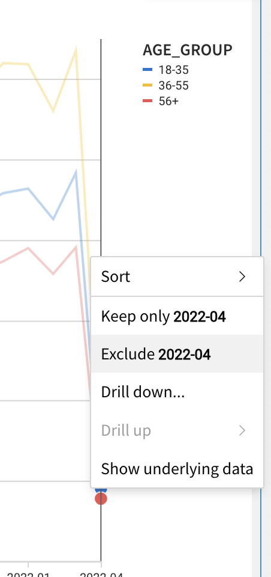
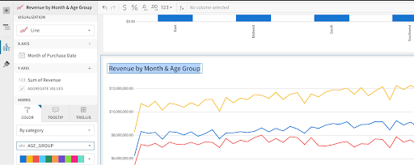

  12. Let's create one more visualization around our revenue generated. Again, select the "+" icon on the top left of the screen and select "Viz". 

13. For the data source, go to the In Use tab and select the Workbook Element "Transactions". For the visualization type, select "Single Value" from the drop down list. 

 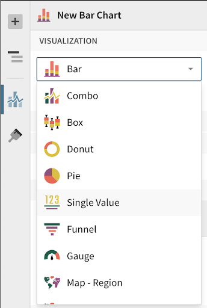

14. Next drag Revenue to the value. This will automatically sum the revenue across all transactions. Rename this visualization to Total Revenue by double clicking Sum of Revenue on the left hand side and typing Total Revenue. 

 

15. Finally, we want to share some transaction level data with our end users. From our transactions table on the data page, click "Create child element - table". This creates a new table from our Transactions table. Let's sort this table by purchase date descending, so that our most recent transactions are shown first. Finally, move this element to our Customer Portal page. 

  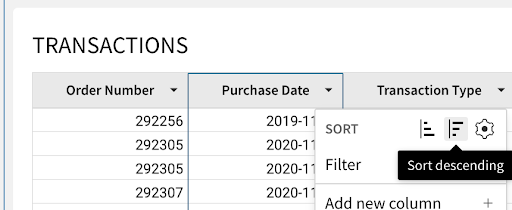

16. Drag and drop the visualizations on the Customer Portal page so that the Total Revenue element is at the top, the line chart and bar graph are side by side below it, and the transactions table is at the bottom.

  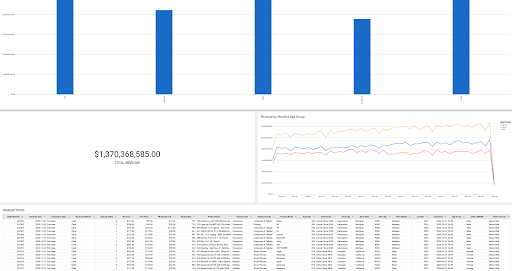

   ### Create Filters
   Let's add a filter to this data. We will do this by adding a control element to our canvas. Controls enable interactions with the charts such as filtering them for specific values. When clicking the '+' icon in the upper left hand pane, we will see options for control elements:
   - <strong> Number Range</strong>: Creates a range of values you wish to look at
   - <strong> List Values</strong>: Creates a list of values for users to choose from
   - <strong> Text Box</strong>: Allows users to input free form text
   - <strong> Switch</strong>: Allows users to filter on Boolean (true/false) values
   - <strong> Drill Down</strong>: Allows you to specify specific drill paths
   - <strong> Date </strong>: Allows users to filter for a specific date or date range
   
   
  1. Click the "+" icon on the upper left hand pane, then select "Date". This will add a Date control element to the canvas. 

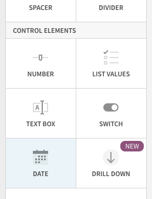

  2. After adding the "Date" control to our Customer Portal page, let's drag it to the top of the page and update the control_id to say "Date-Range" and update the control label to say "Select a Date Range". 

  3. Next we need to tell the control which elements we want it applied to. Clicking on the filter control, we have some options in the left hand pane. Select "Targets", then choose "Add Target". Select the 3 visualizations we previously created- Revenue by Store Region, Revenue by Month & Customer Age, and Total Revenue. 

   

  4. On the data page, right click on the drop down next to the column "Product Brand" and select the "Filter" option from the menu. A new filter will be added to the table. 

   
   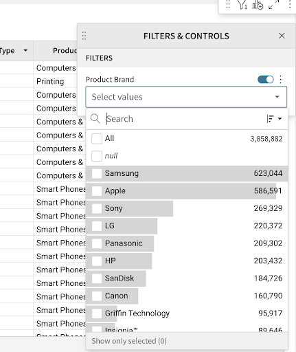

   5. Click on the kebab menu to the right of the "Product Brand" filter and select "Convert to Page Control".
   
   
   
The filter will be added as a page control to the canvas. This product brand filter is additionally what we will pass into our embed URL to only serve up data related to the brand we are exploring. Since this filter started out with a target, there is no need to add one.

   ### Finishing up the Canvas
In Sigma, you can add a variety of UI elements to your workbook to customize the look and feel. In this section, we will work with text elements to create a dynamic text element as the header for our workbook. When you click the '+' in the top left, you will see a variety of elements available to you such as:
- <strong> Image</strong>: Upload images or links to URLs to show an image on the canvas
- <strong> Button</strong>: Use buttons to navigate to other workbooks, websites, or download the workbook as a PDF
- <strong>Embed</strong>: Embed other websites or applications into your workbook
- <strong>Spacer</strong>: Use to add space between elements on the canvas
- <strong>Divider</strong>: Use to create hard divisions between sections of the canvas

1. To start, navigate to your Customer Portal page, and click "add element". Under UI elements, select "Text". 

   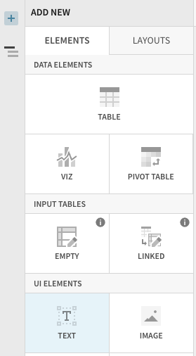

2. We are going to create a dynamic text element as the header for our page. In the text bar type '='. This will start the input of a formula. In the formula bar type <strong>If(CountDistinct([TRANSACTIONS/Product Brand]) >1, "All Brands", [TRANSACTIONS/Product Brand])</strong>. Hit Enter. You should now see a circle stating "All Brands". To the right of this, type "Sales Performance".

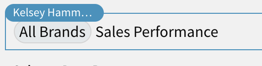

3. Click your new dynamic text element to open the formatting bar at the top. Select "Large Heading" for the element size, and drag your text element to the top of the page. Finally, click the formatting option to center the element. This dynamic title will adjust based on the user we log into our portal as, and the brand we are exploring. 

  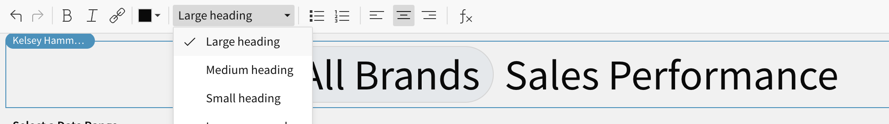

4. On the bottom left, click the down arrow next to your 'Data' page and select "Hide". This will hide the page with the underlying data set from your end users. 

  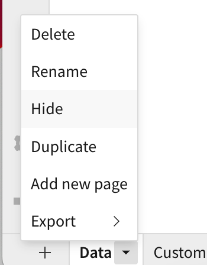

5. Click Publish to save these changes. 
   
## Embedding the Sigma Workbook into an Application
Duration: 10
   ### Building the Application / Portal

  We are now going to begin building our portal where we can embed our workbook. This will be a Sales Performance dashboard where the Plugs Electronics family of brands can log in to see how their products are performing in our store. 

  1. First we will need to install Node.js. Node is going to allow us to set up a local server, as well as the front end portal, and securely embed our dashboards with row level security so that brands are not seeing each other's data. Download and install Node.js by going here: [https://nodejs.org/](https://nodejs.org/)
   - Note, there are many programming languages and libraries you can use to code a client and server side application, this just happens to be the one we will be using today. 

   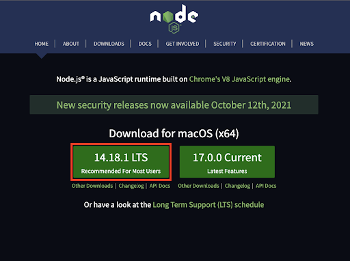

  2. Once downloaded, double click on the download and go through the installation steps. This should only take a minute. 

  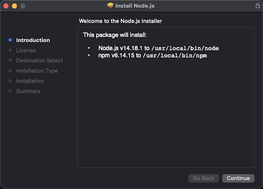

  3. Now open the app_embed folder that was provided to you. This holds the shell for the portal we will be building today. 

  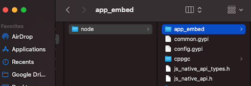

  4. First, open the two files index.html and server.js in your favorite text editor. 

  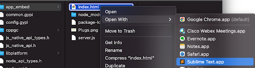

  5. If we look first at the index. html file, we can see it is just a basic HTML page that calls an API to the backend server. js file. When the server is running, you will be able to access the page by going to the URL [http://localhost:3000](http://localhost:3000) in your browser. This is also where you would define the client-facing website if you wanted to customize the look and feel of the portal. 

  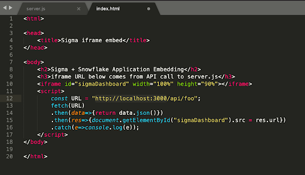

  6. If we move over to the server.js file, we can start to see what is expected.  Sigma requires a variety of parameters to be set when requesting a dashboard. These parameters not only ensure security, but also allow for flexible interaction with filters and parameters within the dashboard.
- <strong> <dashboard_embed_path> </strong>is the Embed Path that is generated on the dashboard you wish to embed.
- <strong><random_nonce_value></strong> is a  random unique string (less than 255 characters). Sigma uses this to prevent application embed URLs from being shared and reused.
- <strong> <allow_export_boolean> </strong>(optional) is a boolean (true/false) parameter that controls whether the viewer of the dashboard will be able to download data from the dashboard visualizations. If this parameter is not specified, the URL will default to false and viewers will not be able to download data.
- <strong><session_length></strong> is the number of seconds after <strong><unix_timestamp></strong> that the URL will remain valid. After the specified number of seconds, the Application Embed will no longer display new values.
- <strong><unix_timestamp></strong> is the current time as a UNIX timestamp. Sigma uses this in combination with the <strong><session_length> </strong>to determine if your link has expired. The URL is valid after the <strong><unix_timestamp></strong> and before the <strong><session_length></strong> expiration.
- <strong><control_id></strong> and <strong><control_value></strong> are the ID and value of a dashboard control you'd wish to pass through to the dashboard. You may pass multiple control IDs and values. This will allow you to customize what your viewers see.
Note: All controls must exist on the dashboard. This is to ensure changes to a dashboard do not cause data to be visible unintentionally.
- <Strong>< mode ></strong> Determines the end users permissions. For this lab, it will be set to <strong>mode = explore</strong> to allow end users to take advantage of Sigma’s exploratory capabilities. 

We need to install a couple of libraries in order to get this working: <strong>express</strong> and <strong>uuid</strong>. These libraries are used to construct a unique signature for your embed URLs when combined with a secret key provided by Sigma. This makes it so that no one is able to ever modify and request the dashboard other than the server.

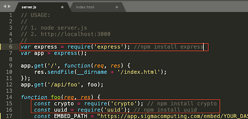

7. Go back to the Finder, right-click on the app_embed folder, and select "New Terminal at Folder". 

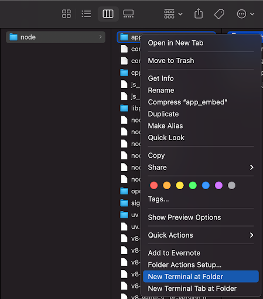

8. Now we can install the needed libraries by issuing the following command:<strong> npm install express uuid</strong>.

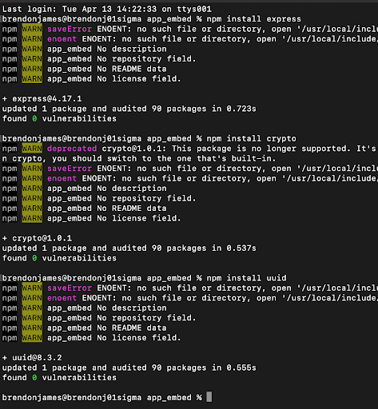

There are two key edits we need to make in order for the server to use our workbook, the Secret Key and the Embed URL of our workbook. We will obtain both of these pieces of information next. 

### Generating an Application Embedding Secret in Sigma

1. If we go back to Sigma, we can generate our secret key that is needed for application embedding. You can do this by clicking on your user icon on the top right of the screen and selecting "Administration". 

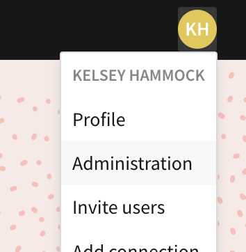

2. On the account screen there is an Embedding section with a subheading labeled "Application Embedding". Click on the "Add" button to generate the key.

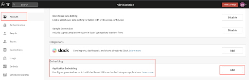

3. You will now get your secret key that can be used for all embedded workbooks. Please make sure to save this key in a secure place. If you lose it, you will have to re-generate a new key. 

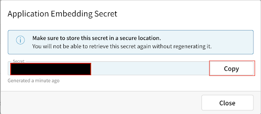

4. Copy this key and place it in the server.js file where it says "YOUR_SECRET_KEY_HERE". 

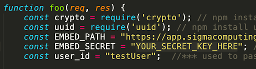

### Generating an Embed URL for your Workbook

1. Now, if we go back to your Sigma workbook by clicking on the back button in the top left, we can retrieve the embed URL. 

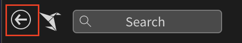

2. Find the drop-down icon next to the dashboard name in the top header bar and select "Embedding". 

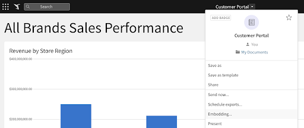

3. Next, click on the tab labeled "Application(0)" and use the dropdown to generate an embed path for the entire workbook. 

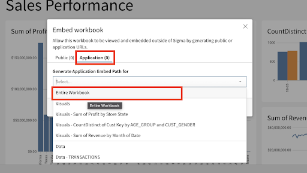

4. Now it has generated the embed path for your dashboard. Select COPY to copy this URL, then paste it into the server.js file where it says "YOUR WORKBOOK PATH HERE".

5. Save your server.js file.

6. Once complete, we are ready to start our server. Back in your terminal, you can run the following command to start the server: <strong>node server.js</strong>

7. Now that the server is running, we can visit our portal by going to [http://localhost:3000](http://localhost:3000) in our browser. 

8. You will notice that your workbook shows All Brands Sales Performance as we have not added any row level security yet. We will see changes in this title following the next section.

## Row Level Security 
Duration: 5
1. Now we might want to put some row level security on this dashboard, so that brands can only see data related to the sale of their own products. Navigate back to your data page in your Sigma workbook. 

2. On the data page, find the page control we created previously for Product-Brand. When we select it the left panel will show its properties. Find the Control ID and copy the value. It should be a value similar to "Product-Brand". 

3. Click Publish to save the changes. 

4. Navigate to your server.js file and un-comment the field that contains the control_id by deleting the "//" before searchParams at the beginning of the line. Here is where we can place the control_id from our workbook and pass a value to set that control. Today, we will hardcode a value, but these can always be set in a more dynamic fashion based on user properties. For more information on more dynamic security for embedding, please see the Sigma docs [here](https://help.sigmacomputing.com/hc/en-us/articles/6797945342483-User-Backed-Embedding-).
Update control-id to 'Product-Brand' (or whatever the control ID was labeled in your workbook) and the controlValue to 'Samsung' as shown in the photos below.  

  Before the changes in step 1 your file looks like this:

   After changes it should look like this: 

5. Save your server.js file and navigate back to your terminal. Here we need to stop the server by pressing <strong>Control + C</strong>. This will exit the running server process. We can then start it again with our new configuration by running the command <strong>Node server.js</strong>.

6. Now if you go back to your browser and reload the web page, you should notice that we only see data for Samsung now. You will additionally notice that the dynamic text we created for the header now reads "Samsung Sales Performance" rather than "All Brands Sales Performance". 

For more details on how to set up dynamic row-level security in Sigma, refer [here](https://help.sigmacomputing.com/hc/en-us/articles/6709896696979-User-Attributes).

## Exploring the Embed
Duration: 10
For the purpose of this lab, we will now explore the portal as a member of the Samsung marketing team. We have been tasked with identifying which regions to focus our in store marketing efforts on, and will use the Plugs Sales Performance portal to help identify where the majority of our in store purchases happen. 

1. Looking at the customer portal, click maximize element in the top right of the Revenue by Store Region bar chart. 

2. Lets get some additional insights from this dashboard. Drag Product Type to the color category.

3. Collapse the bar chart by clicking minimize element in the same place you clicked to expland it. 

4. Next, scroll down to the Transactions table and click Maximize element. 

5. Scroll right to the store region column. Click the drop down arrow and select "Group Column". Then, scroll to the Order Channel column, and again select "Group Column". We can now see that our data has been aggregated at two levels, first the store region, then the order channel. 

6. Click the drop down next to Order Channel and select "Add new column". 

7. In the formula bar, type <strong>CountDistinct([Order Number])</strong>. Rename this column Number of Orders. 

8. Again, click the drop down next to Order Channel and select "Add Column". This time, type <strong>Sum([Revenue])</strong> in the formula bar. What we can now see is Revenue generated for a specific region by the Order Channel the purchase was made from. 

9. With the Sum of Revenue column selected, click the paintbrush to the right of the table icon in the left hand tool pane. 

10. Select "Conditional Formatting", then click "Data Bars". 

11. Click the minus to the left of Order Channel to collapse the view at the aggregate level. You should now see revenue generated by different order channels across regions. Based on this view, we can tell that the South region has the largest amount of revenue tied to in store purchases (Brick & Mortar order channel) and that we might want to focus our in store marketing efforts here.  

12. Minimize the element using the arrows in the top right to collapse this new visualization back into the larger page. 

## Conclusion & Helpful Resources
Duration: 5

### Conclusion
Thank you for your participation in this hands-on lab. To learn more about how real businesses are leveraging Snowflake & Sigma for embedded use cases, check out our webinar here : [How iPipeline Leverages Snowflake and Sigma](https://www.snowflake.com/build/agenda/?agendaPath=session/1031449)

### What We Have Covered
- Creating objects in Snowflake and ingesting data
- Connecting Sigma to Snowflake
- Creating workbooks, visualizations, and filters
- Embedding Sigma workbooks into an application
- Adding row level security to an embed
- Exploring an embedded Sigma workbook 

### Helpful Resources

- General Sigma Embedding Docs: [https://help.sigmacomputing.com/hc/en-us/categories/1500001787282-Embedded-Analytics](https://help.sigmacomputing.com/hc/en-us/categories/1500001787282-Embedded-Analytics)  
- User Backed Embedding Docs: [https://help.sigmacomputing.com/hc/en-us/articles/6797945342483-User-Backed-Embedding-](https://help.sigmacomputing.com/hc/en-us/articles/6797945342483-User-Backed-Embedding-)
- Sigma Blog: [https://www.sigmacomputing.com/blog](https://www.sigmacomputing.com/blog)
- Resources and Case Studies: [https://www.sigmacomputing.com/resources](https://www.sigmacomputing.com/resources)
- Help Center including Documentation: [https://help.sigmacomputing.com/hc/en-us](https://help.sigmacomputing.com/hc/en-us)

