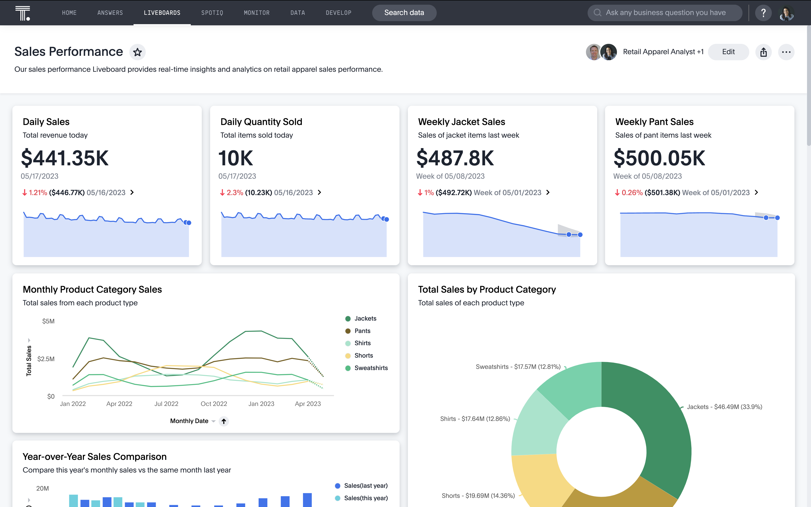
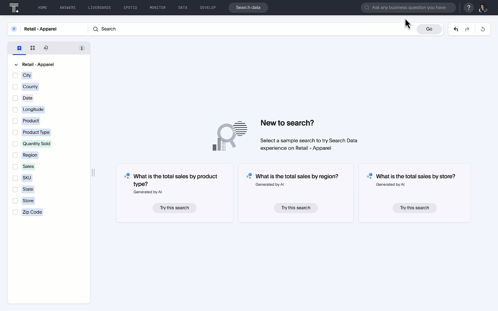

author: Ali Alladin (ali.alladin@thoughtspot.com)
id: ai_powered_embedded_analytics_using_thoughtspot
summary: Guide to create your own embedded analytics application using ThoughtSpot
categories: Getting-Started, Analytics
environments: web
status: Published 
feedback link: https://github.com/Snowflake-Labs/sfguides/issues
tags: Getting Started, Data Science, Data Engineering, analytics, app-development, solution-examples, marketing, retail 

# AI Powered Embedded Analytics using ThoughtSpot
<!-- ------------------------ -->
## Overview 
Duration: 1

When combined with Snowflake’s robust and efficient data cloud solution, ThoughtSpot help you turn your data into actionable insights. Our AI-Powered Analytics platform is designed for everyone—whether you’re code first or code free. Instead of relying on data teams to crank out clunky dashboards and outdated reports, business users can use a familiar natural language search interface and augmented analytics to discover insights, create and share Liveboards, and make real-time decisions This frees analysts and data teams to work on more impactful projects, like data pipeline optimizations or complex analysis. By choosing ThoughtSpot and Snowflake, you’re investing in a modern data infrastructure built to scale, grow, and innovate with your business. 

### Prerequisites
- Familiarity with Snowflake and React.
- ThoughtSpot Free Trial.
- A Snowflake Account to connect ThoughtSpot

### What You’ll Learn
- How to connect your free ThoughtSpot [trial](https://www.thoughtspot.com/trial) instance to Snowflake 
- How to use Natural Language Search
- How to search data using search tokens
- How to create [Liveboards](https://docs.thoughtspot.com/cloud/latest/liveboards) which are interactive dashboards
- How to use interact with your data conversationally using [Ask Sage](https://docs.thoughtspot.com/cloud/latest/ask-sage)
- How to use [SpotIQ](https://docs.thoughtspot.com/cloud/latest/spotiq) and AI driven analytics feature for trend analysis and anomaly detection
- And finally how to build a very simple yet powerful embedded application 

### What You’ll Need 
- A [GitHub](https://github.com/) Account 
- Your favorite IDE like [VSCode](https://code.visualstudio.com/download)
- [NodeJS](https://nodejs.org/en/download/) Installed

### What You’ll Build 
- An embedded ThoughtSpot Application

<!-- ------------------------ -->
## Getting Started
Duration: 5

- To sign up for a ThoughtSpot free trial, follow these steps:
- Go to the [ThoughtSpot website](https://www.thoughtspot.com)
- Click on the "Free Trial" or "Try for Free" button.
- Select Snowflake from the drop down list under "Select Cloud Data Platform" and fill out the required information in the sign-up form.
- Follow the instructions sent to your email to complete the setup.
- This will give you access to ThoughtSpot's features for a limited time.

<!-- ------------------------ -->
## Connect to Snowflake and Create a Worksheet
Duration: 2

### Snowflake Connection
- Click on the link below for a step by step guide to connecting ThoughtSpot to your Snowflake instance
- [Connect ThoughtSpot to Snowflake](https://docs.thoughtspot.com/cloud/latest/connections-snowflake-add)

### Creating a Worksheet
Duration: 3

Worksheet is a flat table representation exposed to business users, the goal is for business users to express questions on top of this worksheet without having to worry about the data schema hidden behind this simplistic definition.
- Click on the link for a step by step guide to creating a [Worksheet](https://docs.thoughtspot.com/cloud/latest/worksheets)

## Build your own embedded application
Duration: 5

### ThoughtSpot Embed with Snowflake

This project demonstrates how to embed ThoughtSpot analytics into a web application using React, TypeScript, and Vite. It integrates with Snowflake as the data source.

### Project Overview

This application serves as a template for embedding ThoughtSpot into web applications. It utilizes modern web development tools and practices.

### Features

- Embed ThoughtSpot analytics
- Built with React and TypeScript
- Fast development with Vite
- Integration with Snowflake

### Getting Started

These instructions will help you set up and run the project on your local machine for development and testing purposes.

### Prerequisites

- Node.js and npm installed on your machine
- Access to ThoughtSpot and Snowflake accounts

### Installation

1. Clone the repository: open a terminal window in your IDE and type in the following below

```bash
   git clone https://github.com/aalladin/snowflake-quickstart-tse

```

2. Navigate to the project directory:

```bash
cd ts-embed-snowflake

```

3. Install the dependencies:

```bash
npm install

```

### Running the Application

1. To start the development server, run:

```bash
npm run dev

```

Open your browser and go to [your newly created application](http://localhost:5173/) to see it in action.
1. Click on the Liveboard. A sample retail liveboard will appear. 



2. Use Natural Language Search with [Sage](https://docs.thoughtspot.com/cloud/latest/sage-search)


3. Or simply use our [token based search](https://docs.thoughtspot.com/cloud/latest/search-data)




<!-- ------------------------ -->
## Contributing and Resources
Duration: 2

Contributions are welcome! Please follow these steps:

1. Fork the repository.
2. Create a new branch: git checkout -b feature/your-feature-name.
3. Commit your changes: git commit -m 'Add your feature'.
4. Push to the branch: git push origin feature/your-feature-name.
5. Submit a pull request.

### Resources
- [Source Code on Github](https://github.com/aalladin/snowflake-quickstart-tse)
- [ThoughtSpot Codespot - code samples, visualizations and more](https://developers.thoughtspot.com/codespot)
- [Developer Playground](https://try-everywhere.thoughtspot.cloud/v2/#/everywhere)
