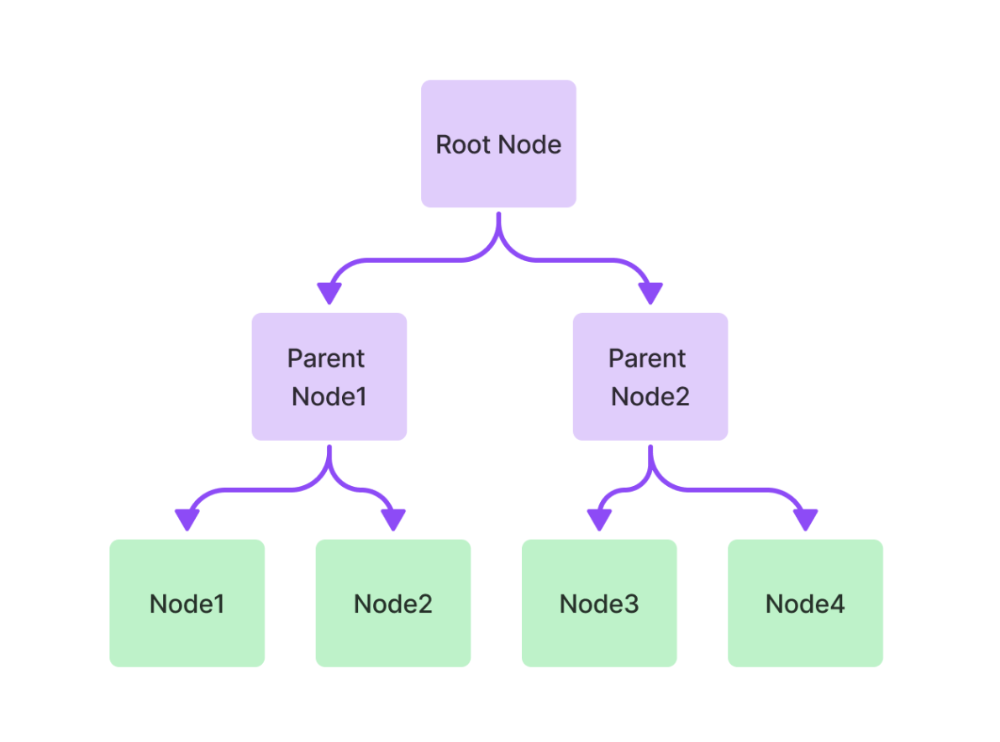
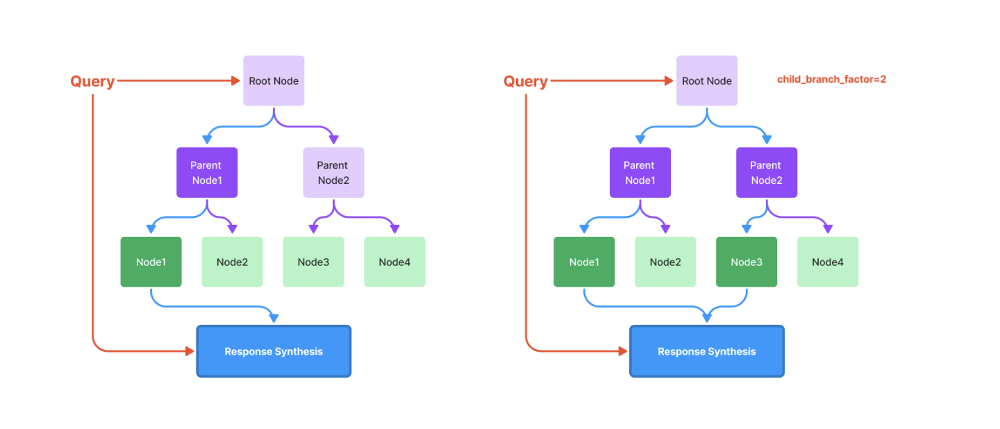
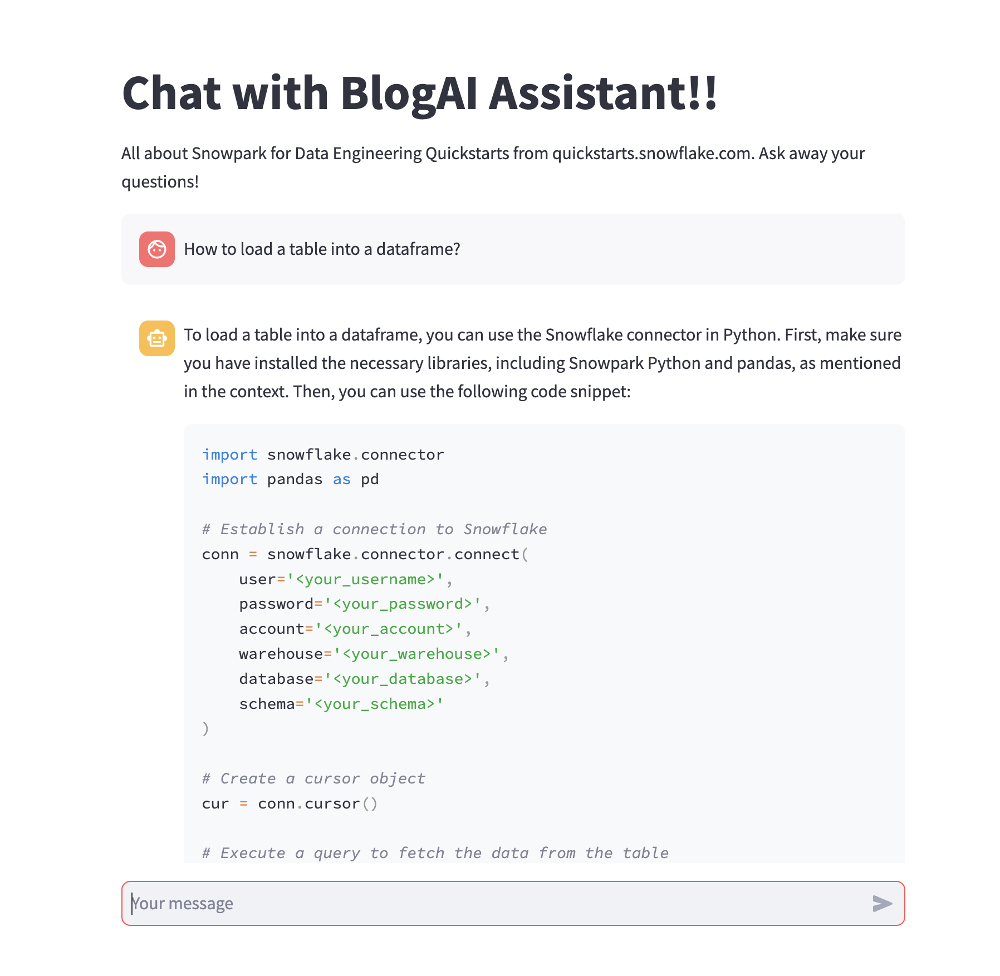

author: Vino Duraisamy
id: build_rag_based_blog_ai_assistant_using_streamlit_openai_and_llamaindex
summary: This guide will provide step-by-step details for building an LLM chatbot called SnowStart that answers questions based on Snowflake Quickstart Blogs
categories: data-science-&-ml,app-development
environments: web
status: Published
feedback link: https://github.com/Snowflake-Labs/sfguides/issues
tags: Getting Started, LLMs, Generative AI, Streamlit, ChatBot, OpenAI

# SnowStart: Build a Retrieval Augmented Generation(RAG) based LLM assistant using  Streamlit, OpenAI and LlamaIndex
<!-- ------------------------ -->
## Overview

Duration: 5

This quickstart will cover the basics of Retrieval Augmented Generation (RAG) and how to build an LLM assistant (SnowStart) using Streamlit, OpenAI and LlamaIndex. The AI assistant will be trained on Snowpark data engineering quickstarts and can answer questions related to those blogs.

Here is a summary of what you will be able to learn in each step following this quickstart:

- **Setup Environment**: Setup your development environment, access OpenAI API keys and install the dependancies needed to run this quickstart
- **Data Pipeline**: Build a data pipeline to download the blogs on which the AI assisstant is trained on
- **Build Index**: Chunk the blogs into smaller contexts which can then be appended with the input prompt to an LLM
- **Streamlit Application**: Build a Streamlit App to serve as the UI for SnowStart

Let's dive into the key features and technologies used in the demo, for better understanding.

### Key Features & Technology

- Large Language Models (LLMs)
- Retrieval Augmented Generation
- LlamaIndex
- Streamlit

### What is a large language model (LLM)?

A large language model, or LLM, is a deep learning algorithm that can recognize, summarize, translate, predict and generate text and other content based on knowledge gained from massive datasets. Some examples of popular LLMs are [GPT-4](https://openai.com/research/gpt-4), [GPT-3](https://openai.com/blog/gpt-3-apps), [BERT](https://cloud.google.com/ai-platform/training/docs/algorithms/bert-start), [LLaMA](https://ai.facebook.com/blog/large-language-model-llama-meta-ai/), and [LaMDA](https://blog.google/technology/ai/lamda/).

### What is OpenAI?

OpenAI is the AI research and deployment company behind ChatGPT, GPT-4 (and its predecessors), DALL-E, and other notable offerings. Learn more about [OpenAI](https://openai.com/). We use OpenAI in this guide, but you are welcome to use the large language model of your choice in its place.

### What is Retrieval Augmented Generation(RAG)?

Retrieval Augmentation Generation (RAG) is an architecture that augments the capabilities of a Large Language Model (LLM) like GPT-4 by adding an information retrieval system that provides the models with relevant contextual data. Through this information retrieval system, we could provide the LLM with additional information around specific industry or a company's proprietary data and so on.

### What is LlamaIndex?

Applications built on top of LLMs often require augmenting these models with private or domain-specific data. LlamaIndex (formerly GPT Index) is a data framework for LLM applications to ingest, structure, and access private or domain-specific data.

### What is Streamlit?

Streamlit enables data scientists and Python developers to combine Streamlit's component-rich, open-source Python library with the scale, performance, and security of the Snowflake platform. Learn more about [Streamlit](https://streamlit.io/).

### What You Will Learn?

- How to build a data pipeline to download the blogs for retrieval
- How to chuck the blogs into smaller contexts which can then be augmented with the input prompt to an LLM
- How to build a Streamlit App to serve as the UI for SnowStart bot

### Prerequisites

- **GitHub account** - If you don't already have a GitHub account you can create one for free. Visit the [Join GitHub](https://github.com/signup) page to get started.
- A **OpenAI account** or API key to another language model - [Sign-in or create an account](https://openai.com/)
  - [OpenAI API Key](https://platform.openai.com/account/api-keys)

<!-- ------------------------ -->

## Setup Environment

The very first step is to clone the [GitHub repository](https://github.com/Snowflake-Labs/sfguide-blog-ai-assistant). This repository contains all the code you will need to successfully complete this QuickStart Guide.

Using HTTPS:

```shell
git clone https://github.com/Snowflake-Labs/sfguide-blog-ai-assistant.git
```

OR, using SSH:

```shell
git clone git@github.com:Snowflake-Labs/sfguide-blog-ai-assistant.git
```

Run the following command to install the dependancies.

```shell
cd sfguide-blog-ai-assistant 
pip install -r requirements.txt
```

Great, we installed all the dependancies needed to work through this demo.

<!-- ------------------------ -->

## Data Pipeline to Download Blogs

Duration: 5

During this step, we will identify the blog or list of blogs that we want to query using the AI chatbot. In this example, the bot will answer questions about Snowpark Data Engineering quickstarts. The list of blogs the bot is capable of answering is defined in `data_pipeline.py` file in `PAGES` list.

```python
PAGES = [
    "https://quickstarts.snowflake.com/guide/data_engineering_pipelines_with_snowpark_python",
    "https://quickstarts.snowflake.com/guide/cloud_native_data_engineering_with_matillion_and_snowflake",
    "https://quickstarts.snowflake.com/guide/data_engineering_with_apache_airflow",
    "https://quickstarts.snowflake.com/guide/getting_started_with_dataengineering_ml_using_snowpark_python",
    "https://quickstarts.snowflake.com/guide/data_engineering_with_snowpark_python_and_dbt"
]
```

> aside positive
> IMPORTANT:
>
> - You can append or replace this list with your own list of blogs as well. Open the code in an IDE of your choice and update the list.

After you update the blogs list, switch to the terminal run the following command:

```shell
python data_pipeline.py
```

This will iteratively download all the blogs in `PAGES` list into  `.content` directory and convert them into markdown files. We use the `html2text` library to convert the html files into markdown files. 

<!-- ------------------------ -->

## Chunk the Blog Contents and Build Index

Duration: 10

In this step, we will build a vector index for the markdown files. It involves chunking the blogs in the `.content` directory, storing them as a [TreeIndex](https://gpt-index.readthedocs.io/en/latest/api_reference/indices/tree.html) using LlamaIndex.

Before diving into building the index, let us understand the Retrieval Augmented Generation(RAG) architecture. It has three main steps.

- Choose a foundation model of your choice to generate text
However, if I were to question the foundation model about the specifics of Snowpark and other features that were released recently, GPT-4 may not be able to answer.
- Augment the input prompt (i.e., your question) with relevant documents
If we provide the model with Snowpark documentation or quickstart, it will be capable of answering questions. However, the context length of these models are small. GPT-4 has context length of 4000 tokens only. 4000 tokens is about 500 words, which is roughly 3-4 paragraphs. But Snowpark documentation is more than 4 paragraphs. What could be done?
  - We take the Snowflake documentation and chunk it with ~500 words per chunk. We then convert each of these chunks into vector embeddings, store them in a vector store, and build an index for easy retrieval.
- Query the foundation model for answers
  - During the inference phase, the input prompt is converted into a vector embedding, the vector store is searched to find the text chunk that has higher similarity to the input prompt and is returned to the foundation model.
  - The model then uses the chunk of document that is relevant to the query to answer the query.

Challenges in this approach:

- How can you split the document into meaningful chunks so the context is not lost?
- What are the different indexes you can build? 
- How can you decide on the type of index to build for faster retrieval?

Here is where LlamaIndex comes in. It abstracts away the complexity in smart chucking and indexing of the document. All you need to do is to select which type of index you need based on your use case, and let LlamaIndex do the work.

Now that we understand RAG architecture, let's review the code in `build_index.py` and understand what each snippet of code does.

```python
def build_index(data_dir: str, knowledge_base_dir: str) -> None:
    """Build the vector index from the markdown files in the directory."""
    print("Building vector index...")
    documents = SimpleDirectoryReader(data_dir).load_data()

    index = TreeIndex.from_documents(documents, service_context=service_context)
    index.storage_context.persist(persist_dir=knowledge_base_dir)
    print("Done.")
```

The `build_index()` creates a TreeIndex from the markdown files in `.content` directory and persists the index in the local `.kb` directory. In LlamaIndex terminology, a node refers to a chunk of text from a document.

The  `TreeIndex` builds a hierarchical tree from a set of nodes which become leaf nodes in the tree. 



During the inference time, it queries the index by traversing from root nodes down to leaf nodes. Once the leaf node/nodes with relevant keywords as the user prompt is returned, a response is returned by the index. This response is then augmented with user prompt to chat with the model.



Open the `build_index.py` file from an IDE of your choice and update the `YOUR_OPENAI_API_KEY` with your OpenAI API key.

Open the terminal and run the following command to build the vector index:

```shell
python build_index.py
```

This will store the chunks of documents as a tree index in `.kb` directory.

<!-- ------------------------ -->

## Build a Streamlit Chatbot Application

We're ready to start building our app. We will build a Streamlit App for the chat interface. As a first step, open the `streamlit_app.py` from an IDE of your choice and update the `YOUR_OPENAI_API_KEY` with your OpenAI API key.

Open the terminal and run the following command to create the Streamlit App:

```python
streamlit run streamlit_app.py
```

The chat UI will open in a chrome window at `https://localhost:8051`. You can type your questions about Snowpark data engineering and the chatbot will respond.

We'll break down the Python file snippet-by-snippet so that you understand the functionality of each section.

Initialize the chatbot's message history by adding the system prompt that sets the tone and functionality of the chatbot. 

```python
if "messages" not in st.session_state:
    system_prompt = (
        "Your purpose is to answer questions about specific documents only. "
        "Please answer the user's questions based on what you know about the document. "
        "If the question is outside scope of the document, please politely decline. "
        "If you don't know the answer, say `I don't know`. "
    )
    st.session_state.messages = [{"role": "system", "content": system_prompt}]
```

Prompt the user to enter the chat input by using Streamlit's `st.chat_input()` feature. After the user enters a message, add that message to the chat history by storing it in [session state](https://docs.streamlit.io/library/api-reference/session-state).

```python
if prompt := st.chat_input():
    st.session_state.messages.append({"role": "user", "content": prompt})
    with st.chat_message("user"):
        st.markdown(prompt)
```

In the next step, the `load_index()` function returns the relevant chuck of document from the `.kb` directory. By invoking OpenAI's ChatCompletion API with the user prompt and the relevant document context, the chatbot generates a response.

That's it. So when you finally run the app using the command `streamlit run streamlit_app.py`, you can interact with the chatbot and learn all about using Snowpark for data engineering use-cases.

Here is how the app looks:



## Conclusion and next steps

Duration: 1

Congratulations – you've just built an LLM-powered chatbot capable of answering questions based on the blog(s) you built it on.

### Where to go from here

This tutorial is just a starting point for exploring the possibilities of LLM-powered chat interfaces for data exploration and question-answering using Snowflake and Streamlit. 

Want to learn more about the tools and technologies used by your app? Check out the following resources:

- [Streamlit's new chat UI](https://docs.streamlit.io/library/api-reference/chat)
- [Session state](https://docs.streamlit.io/library/api-reference/session-state)
- [OpenAI's ChatCompetion feature](https://platform.openai.com/docs/api-reference/chat)
- [Generative AI and Streamlit: A perfect match](https://blog.streamlit.io/generative-ai-and-streamlit-a-perfect-match/)
- [Build powerful generative AI apps with Streamlit](https://streamlit.io/generative-ai)