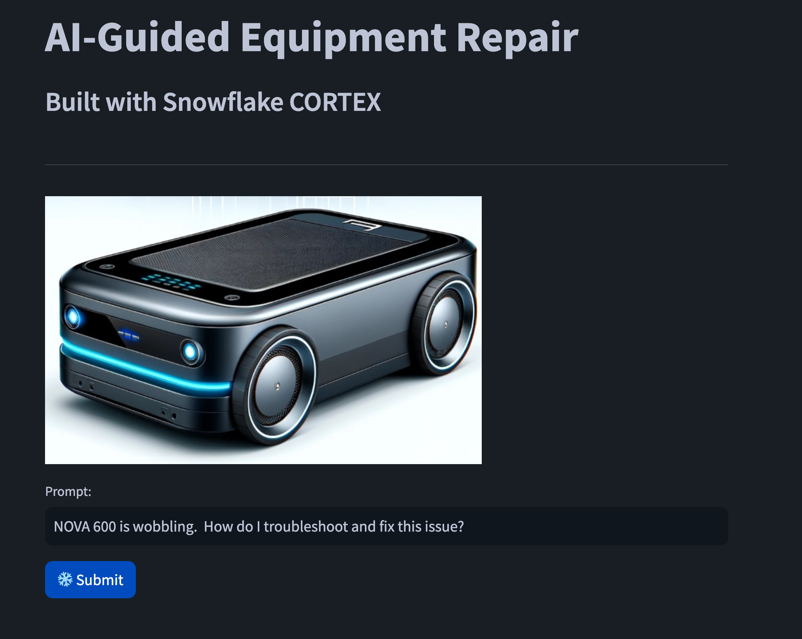

id: build_rag_based_equipment_maintenance_app_using_snowflake_cortex
summary: Build Rag Based Equipment Maintenance App Using Snowflake Cortex
categories: cortex,getting-started,app-development
environments: web
status: Published
feedback link: <https://github.com/Snowflake-Labs/sfguides/issues>
tags: Getting Started, Snowpark Python, Streamlit, scikit-learn, Data Engineering, Machine Learning
authors: Ryan Ellis, Tim Long

# Build Rag Based Equipment Maintenance App Using Snowflake Cortex
<!-- ------------------------ -->
## Overview

Duration: 5

By completing this guide, you will be able to go from downloaded maintenance manuals to an interactive application that can help your organization optimize the downtime experinced on your manufacturing equipment.

Here is a summary of what you will be able to learn in each step by following this quickstart:

- **Setup Environment**: Use stages and tables to ingest and organize raw data from repair manuals into Snowflake
- **Data Engineering**: Leverage Snowpark for Python PDF reader to perform data transformations such as reading, splitting/overlap and chunking to prep the data for our custom application
<!---
- **Data Pipelines**: Use Snowflake Tasks to turn your data pipeline code into operational pipelines with integrated monitoring
--->
- **LLM's**: Process data, chat prompts and run highly tuned LLM's in Snowflake using Retrival Augmented Generation, to enhance a maintence technicions repair actions.  Giving them the info needed for faster repair times, and lower your machine downtime. 
- **Streamlit**: Build an interactive Streamlit application using Python (no web development experience required) to gain knowledge from both the repair manuals and the repair logs of previous technicians.

In case you are new to some of the technologies mentioned above, here’s a quick summary with links to documentation.

### What is Snowpark?

Snowpark is the set of libraries and runtimes that securely enable developers to deploy and process Python code in Snowflake.

**Client Side Libraries** - Snowpark libraries can be installed and downloaded from any client-side notebook or IDE and are used for code development and deployment. Libraries include the Snowpark API for data pipelines and apps and the Snowpark ML API for end to end machine learning.

**Elastic Compute Runtimes** - Snowpark provides elastic compute runtimes for secure execution of your code in Snowflake. Runtimes include Python, Java, and Scala in virtual warehouses with CPU compute or Snowpark Container Services (public preview) to execute any language of choice with CPU or GPU compute.

Learn more about [Snowpark](https://www.snowflake.com/snowpark/).

### What Snowflake CORTEX ?

[Snowflake Cortex](https://docs.snowflake.com/en/user-guide/snowflake-cortex/overview) Snowflake Cortex is an intelligent, fully managed service that offers machine learning and AI solutions to Snowflake users. Snowflake Cortex capabilities include:

LLM Functions: SQL and Python functions that leverage large language models (LLMs) for understanding, querying, translating, summarizing, and generating free-form text.

ML Functions: SQL functions that perform predictive analysis using machine learning to help you gain insights into your structured data and accelerate everyday analytics.


This quickstart will focus on

- Snowpark Python Functions, which enables the use of popular Python  frameworks, such as PyPDF2 , for splitting, chunking and reading PDF's  without the need to move data out of Snowflake.

**Vectors and Text Embedding** - Using the new Vector datatype and Text embedding model native to snowflake you will convert the uploaded PDF's to vectoried data for use with LLM's in Snowflake.


**Large Language Models** - Manage LLM's created both within and outside Snowflake. Models range from Small to Medium and on to Large.  Smaller models are faster and cheaper but less accurate.  Larger models are slower, but more accurate.  Snowflake has both open source and privately lisecened models running inside our snowflake security boundry.  And provides native access to them via Snowflake Cortex.


### What is Streamlit?

Streamlit enables data engineers and Python developers to combine Streamlit's component-rich, open-source Python library with the scale, performance, and security of the Snowflake platform.

Learn more about [Streamlit](https://www.snowflake.com/en/data-cloud/overview/streamlit-in-snowflake/).

### What You Will Learn

- How to analyze data and perform data engineering tasks using Snowpark and native Snowflake SQL
- How to use the new vector datatype in Snowflake
- How to use the 'E5-base-v2' text embeding model to vecotrize your data for use in Retrieval Augmented Generation
- How to use Snowflake Cortex COMPLETE to invoke an LLM to answer natural language questions, using Retrieval Augmented Generation
- How to create Streamlit application that uses the vectorized repair manuals and repair logs for inference based on user input

### Prerequisites

- Access to [Git](https://git-scm.com/book/en/v2/Getting-Started-Installing-Git) for source code
- A Snowflake account, if you do not have a Snowflake account, you can register for a [free trial account](https://signup.snowflake.com/).
- A Snowflake account login with ACCOUNTADMIN role. If you have this role in your environment, you may choose to use it. If not, you will need to 1) Register for a free trial, 2) Use a different role that has the ability to create database, schema, tables, stages, tasks, user-defined functions, and stored procedures OR 3) Use an existing database and schema in which you are able to create the mentioned objects.

> aside positive
> IMPORTANT: Before proceeding, make sure you have the correct access to CORTEX as described [here](https://docs.snowflake.com/user-guide/snowflake-cortex/llm-functions#required-privileges).

<!-- ------------------------ -->
## Setup Environment

Duration: 15

### Create Tables, Load Data and Setup Stages

Log into [Snowsight](https://docs.snowflake.com/en/user-guide/ui-snowsight.html#) using your credentials to create tables, setup Snowflake internal stages, and load repair manuals.

> aside positive
> IMPORTANT:
>
> - If you use different names for objects created in this section, be sure to update scripts and code in the following sections accordingly.
>
> - For each SQL script block below, select all the statements in the block and execute them top to bottom.

Run the following SQL commands to create the [warehouse](https://docs.snowflake.com/en/sql-reference/sql/create-warehouse.html), [database](https://docs.snowflake.com/en/sql-reference/sql/create-database.html) and [schema](https://docs.snowflake.com/en/sql-reference/sql/create-schema.html).

```sql
USE ROLE ACCOUNTADMIN;

CREATE OR REPLACE WAREHOUSE Medium WAREHOUSE_SIZE='Medium' AUTO_SUSPEND = 300;
CREATE OR REPLACE DATABASE LLM;
CREATE OR REPLACE SCHEMA RAG;

USE LLM.RAG;
```

Create the internal stage for loading repair manuals into.

```sql
CREATE STAGE REPAIR_MANUALS;
```

Your snowflake environment is now ready to start loading files, creating tables, and vectorizing your input data.

> aside positive
> IMPORTANT: If you use different names for objects created in this section, be sure to update scripts and code in the following sections accordingly.

<!-- ------------------------ -->
## Get Started

Duration: 8

This section covers cloning of the GitHub repository and downloading the needed repair manuals.

### Clone GitHub Repository -optional

If you have GIT installed and want to clone the repo.
The very first step is to clone the [GitHub repository](https://github.com/Snowflake-Labs/sfguide-build-rag-based-equipment-maintenance-app-using-snowflake-cortex). This repository contains all the code and files you will need to successfully complete this QuickStart Guide.

Using HTTPS:

```shell
git clone https://github.com/Snowflake-Labs/sfguide-build-rag-based-equipment-maintenance-app-using-snowflake-cortex.git
```

OR, using SSH:

```shell
git clone git@github.com:Snowflake-Labs/sfguide-build-rag-based-equipment-maintenance-app-using-snowflake-cortex.git
```

If you do not have GIT installed you can download the four repair manusl needed below

[Otto 1500][1500]

[1500]: assets/Repair_Manuals/OPERATION_AND_MAINTENANCE_MANUAL_OTTO_1500_V2.pdf

[Otto 600][600]

[600]: assets/Repair_Manuals/OTTO_600_workflows_data_sheet.pdf

[Otto 100][100]

[100]: assets/Repair_Manuals/OPERATION_AND_MAINTENANCEMANUALOTTO_100_V2_4.pdf

[Lifter][lifter]

[lifter]: assets/Repair_Manuals/OTTO_Lifter_MkIV_OMM_Operation_maintenance_manual.pdf

At this point you should have four repair manuals and the needed data structures to begin data engeering work on the solution.
<!-- ------------------------ -->
## Data Engineering

Duration: 20

In the following section you will use Snowpark and Snowflake native text embedding functions to read in, split and vectorize the PDF's you just downloaded.

1) Upload PDF's to internal stage created in step 2.
2) Create python UDF to read the pdf's into chunks for the text embedding function.
3) Create tables for storing the repair manuals and the repair logs.  As well as tables for the vectorized text.
4) Read in the repair manuals with the newly created Python UDF.
5) Vectorize the PDF text chunks for later use in RAG based streamlit app.
6) Create UDF's to parameterize the vecorized datasets (repair logs and manuals) and user prompts.

### Upload Repair Manuals to Snowflake

1) From your snowsight UI, click **Data -> Databases. Then click LLM and then RAG.


2) Click on Stages and then Repair Manuals. You will see a screen to add files to your stage


3) Click the blue + Files button in the top right and browse to where you downloaded the repair manuals. Once uploaded it should look like this.


Next we will create the Python UDF to read in those PDF's we just uploaded to our internal stage

### Create Python UDF

```sql
----------------------------------------------------------------------
-- Create a python function to parse PDF files
----------------------------------------------------------------------  
CREATE OR REPLACE FUNCTION py_read_pdf(file string)
    returns string
    language python
    runtime_version = 3.8
    packages = ('snowflake-snowpark-python','pypdf2')
    handler = 'read_file'
as
$$
from PyPDF2 import PdfFileReader
from snowflake.snowpark.files import SnowflakeFile
from io import BytesIO
def read_file(file_path):
    whole_text = ""
    with SnowflakeFile.open(file_path, 'rb') as file:
        f = BytesIO(file.readall())
        pdf_reader = PdfFileReader(f)
        whole_text = ""
        for page in pdf_reader.pages:
            whole_text += page.extract_text()
    return whole_text
$$;
```

The above python UDF will read in PDF's from the internal stage you created.

### Create Snowflake tables for storing repair manuals and vectorized text

Run the following SQL commands to create the needed tables

```sql
USE ROLE ACCOUNTADMIN;
USE DATABASE LLM;
USE SCHEMA RAG;
----------------------------------------------------------------------
-- Create a table for storing the text parsed from each PDF
----------------------------------------------------------------------  
CREATE OR REPLACE TABLE repair_manuals AS
    WITH filenames AS (SELECT DISTINCT METADATA$FILENAME AS file_name FROM @repair_manuals)
    SELECT 
        file_name, 
        py_read_pdf(build_scoped_file_url(@repair_manuals, file_name)) AS contents
    FROM filenames;

--Validate
SELECT * FROM repair_manuals;
```

Next we will create the table to load the chucked repair manuals into.

```sql
----------------------------------------------------------------------
-- Chunk the file contents into 3000 character chunks, overlap each
-- chunk by 1000 characters.
----------------------------------------------------------------------
SET chunk_size = 3000;
SET overlap = 1000;
CREATE OR REPLACE TABLE repair_manuals_chunked AS 
WITH RECURSIVE split_contents AS (
    SELECT 
        file_name,
        SUBSTRING(contents, 1, $chunk_size) AS chunk_text,
        SUBSTRING(contents, $chunk_size-$overlap) AS remaining_contents,
        1 AS chunk_number
    FROM 
        repair_manuals

    UNION ALL

    SELECT 
        file_name,
        SUBSTRING(remaining_contents, 1, $chunk_size),
        SUBSTRING(remaining_contents, $chunk_size+1),
        chunk_number + 1
    FROM 
        split_contents
    WHERE 
        LENGTH(remaining_contents) > 0
)
SELECT 
    file_name,
    chunk_number,
    chunk_text,
    CONCAT(
        'Sampled contents from repair manual [', 
        file_name,
        ']: ', 
        chunk_text
    ) AS combined_chunk_text
FROM 
    split_contents
ORDER BY 
    file_name,
    chunk_number;

--Validate
SELECT * FROM repair_manuals_chunked;
```

Now lets use our first CORTEX function and vectorize the repair manuals.  To embed (vectorize) the text we will use the **e5-base-v2** embedding model supplied in Snowflake.

```sql
----------------------------------------------------------------------
-- "Vectorize" the chunked text into a language encoded representation
----------------------------------------------------------------------  
CREATE OR REPLACE TABLE repair_manuals_chunked_vectors AS 
SELECT 
    file_name, 
    chunk_number, 
    chunk_text, 
    combined_chunk_text,
    snowflake.cortex.embed_text('e5-base-v2', combined_chunk_text) as combined_chunk_vector
FROM 
    repair_manuals_chunked;

--Validate
SELECT * FROM repair_manuals_chunked_vectors;
```

Lets use our first LLM, and create a User Defined Function (UDF) to invoke the LLM using **RetrRetrieval-Augmented Generation** (RAG). For this quickstart we are using the [Mixtral-8x7b](https://mistral.ai/news/mixtral-of-experts/) model.  This model is supplied in your snowflake system without need for additional configuration. You can natively use it in Snowflake CORTEX.  

```sql
----------------------------------------------------------------------
-- Invoke an LLM, sending our question as part of the prompt along with 
-- additional "context" from the best matching chunk (based on cosine similarity)
----------------------------------------------------------------------  
SET prompt = 'OTTO 1500 agv is not driving straight.  How do I troubleshoot and resolve this issue?';

CREATE OR REPLACE FUNCTION REPAIR_MANUALS_LLM(prompt string)
RETURNS TABLE (response string, file_name string, chunk_text string, chunk_number int, score float)
AS
    $$
    WITH best_match_chunk AS (
        SELECT
            v.file_name,
            v.chunk_number,
            v.chunk_text,
            VECTOR_COSINE_DISTANCE(v.combined_chunk_vector, snowflake.cortex.embed_text('e5-base-v2', prompt)) AS score
        FROM 
            repair_manuals_chunked_vectors v
        ORDER BY 
            score DESC
        LIMIT 10
    )
    SELECT 
        SNOWFLAKE.cortex.COMPLETE('mixtral-8x7b', 
            CONCAT('Answer this question: ', prompt, '\n\nUsing this repair manual text: ', chunk_text)
        ) AS response,
        file_name,
        chunk_text,
        chunk_number,
        score
    FROM
        best_match_chunk
    $$;
```

Now we need to validate the work we have done to this point.  Lets call the LLM using the objects we have created so far.

```sql
SELECT * FROM TABLE(REPAIR_MANUALS_LLM($prompt));
```

Once you run the above SQL command, your should see results like this


<!-- ------------------------ -->
## LLM Generated Repair logs

Since we do not have genuine repair logs for our little robot, we used Snowflake Cortex to create them. We will use native snowflake tables and UDF's to store and get inference from our LLM on the repair logs. 

### **Create Table for Repair Logs**

Run the following SQl commands to create a table for the repair logs.

```sql
----------------------------------------------------------------------
-- Create a table to represent equipment repair logs
----------------------------------------------------------------------  
CREATE OR REPLACE TABLE repair_logs (
    date_reported datetime, 
    equipment_model string,
    equipment_id string,
    problem_reported string,
    resolution_notes string
);
```

With the table created, we now have a place to store our AI generated repair logs.  Run the below SQL command to load the AI generated repair logs.

```sql
----------------------------------------------------------------------
-- Load (simulated) repair logs.
----------------------------------------------------------------------  
INSERT INTO repair_logs (date_reported, equipment_model, equipment_id, problem_reported, resolution_notes) VALUES
('2023-03-23 08:42:48', 'Otto Forklift', 'AGV-010', 'Vision System Calibration Error', 'Recalibrated the vision system and replaced damaged image sensors. Tested object recognition accuracy.'),
('2023-09-30 04:42:47', 'Otto 100', 'AGV-011', 'Wireless Receiver Malfunction', 'Replaced faulty wireless receiver and updated communication protocols. Ensured robust signal reception.'),
('2023-09-27 05:01:16', 'Otto Forklift', 'AGV-006', 'Inadequate Lifting Force', 'Adjusted the hydraulic pressure settings and replaced weak hydraulic pistons. Tested lifting capacity with maximum load.'),
('2023-02-16 09:42:31', 'Otto 1500', 'AGV-001', 'Hydraulic System Overpressure', 'Adjusted hydraulic system and replaced faulty pressure valves. Ensured safe and stable operation.'),
('2023-10-29 23:44:57', 'Otto 600', 'AGV-003', 'Erratic Forklift Movement', 'Repaired damaged forklift steering components and recalibrated steering controls. Ensured smooth and accurate movement.'),('2023-11-21 18:35:09', 'Otto 600', 'AGV-002', 'Motor Torque Fluctuations', 'Replaced worn motor brushes and serviced motor components. Calibrated motor for consistent torque output.'),
('2023-07-04 14:22:33', 'Otto Forklift', 'AGV-005', 'Control Software Hangs', 'Diagnosed software hanging issue, optimized system resources, and applied software updates. Conducted stress tests for reliability.'),
('2023-12-13 21:16:49', 'Otto 1500', 'AGV-004', 'Path Deviation in Navigation', 'Updated navigation algorithms and recalibrated wheel encoders. Performed path accuracy tests in different layouts.'),
('2023-08-10 10:55:43', 'Otto 100', 'AGV-012', 'Steering Response Delay', 'Diagnosed and fixed the delay in steering response. Calibrated the steering system for immediate and accurate response.'),
('2023-05-15 16:11:28', 'Otto Forklift', 'AGV-009', 'Unresponsive Touch Panel', 'Replaced the touch panel and updated the interface software. Tested for user interaction and responsiveness.'),
('2023-08-31 02:54:20', 'Otto 100', 'AGV-003', 'Charging System Inefficiency', 'Upgraded the charging system components and optimized charging algorithms for faster and more efficient charging.'),
('2023-10-05 20:24:19', 'Otto Forklift', 'AGV-008', 'Payload Sensor Inaccuracy', 'Calibrated payload sensors and replaced defective units. Ensured accurate load measurement and handling.'),
('2023-02-19 22:29:24', 'Otto 1500', 'AGV-009', 'Cooling Fan Malfunction', 'Replaced malfunctioning cooling fans and cleaned air vents. Tested under load to ensure effective heat dissipation.'),
('2023-05-29 15:09:15', 'Otto 100', 'AGV-011', 'Drive Motor Overheating', 'Serviced drive motors and replaced worn components. Improved motor cooling and monitored temperature during operation.'),
('2023-04-30 01:03:03', 'Otto 600', 'AGV-002', 'Laser Scanner Inaccuracy', 'Calibrated laser scanners and updated scanning software. Ensured precise environmental mapping and obstacle detection.'),
('2023-03-14 13:15:52', 'Otto Forklift', 'AGV-006', 'Conveyor Belt Misalignment', 'Realigned the conveyor belt and adjusted tension settings. Conducted operational tests for smooth and consistent movement.'),
('2023-11-14 08:11:58', 'Otto 1500', 'AGV-012', 'Forklift Sensor Misalignment', 'Realigned forklift sensors and calibrated for precise object positioning and handling.'),
('2023-12-24 22:35:13', 'Otto 600', 'AGV-008', 'Erratic Forklift Movement', 'Repaired damaged forklift steering components and recalibrated steering controls. Ensured smooth and accurate movement.'),
('2023-09-20 08:08:16', 'Otto 100', 'AGV-007', 'Hydraulic System Overpressure', 'Adjusted hydraulic system pressure settings and replaced faulty pressure valves. Ensured safe and stable operation.'),
('2023-10-20 00:37:29', 'Otto 600', 'AGV-003', 'Forklift Sensor Misalignment', 'Performed alignment on forklift sensors and calibrated for precise object positioning and handling.'),('2023-08-20 12:49:44', 'Otto 1500', 'AGV-008', 'Control Software Hangs', 'Diagnosed software hanging issue, optimized system resources, and applied software updates. Conducted stress tests for reliability.'),
('2023-07-08 03:37:26', 'Otto 1500', 'AGV-002', 'Wireless Receiver Malfunction', 'Replaced faulty wireless receiver and updated communication protocols. Ensured robust signal reception.'),
('2023-10-12 09:05:07', 'Otto 1500', 'AGV-001', 'Laser Scanner Inaccuracy', 'Calibrated laser scanners and updated scanning software. Ensured precise environmental mapping and obstacle detection.'),
('2023-03-12 19:28:34', 'Otto 1500', 'AGV-008', 'Hydraulic System Overpressure', 'Adjusted hydraulic system pressure settings and replaced faulty pressure valves. Ensured safe and stable operation.'),
('2023-01-19 23:10:03', 'Otto 600', 'AGV-006', 'Inconsistent Conveyor Speed', 'Repaired gearbox in conveyor attachment and adjusted speed control settings. Verified consistent conveyor operation.'),
('2023-06-29 20:02:38', 'Otto 600', 'AGV-002', 'Battery Overheating', 'Replaced faulty battery cells and improved battery ventilation system. Monitored temperature during charging and operation.'),
('2023-05-09 23:19:03', 'Otto 600', 'AGV-011', 'Inconsistent Conveyor Speed', 'Repaired gearbox in conveyor attachment and adjusted speed control settings. Verified consistent conveyor operation.'),
('2023-06-09 17:56:51', 'Otto Forklift', 'AGV-002', 'Motor Torque Fluctuations', 'Replaced worn motor brushes and serviced motor components. Calibrated motor for consistent torque output.'),
('2023-03-02 09:21:22', 'Otto 1500', 'AGV-004', 'Payload Sensor Inaccuracy', 'Calibrated payload sensors and replaced defective units. Ensured accurate load measurement and handling.'),
('2023-07-16 00:00:54', 'Otto 1500', 'AGV-003', 'Drive Motor Overheating', 'Serviced drive motors and replaced worn components. Improved motor cooling and monitored temperature during operation.'),
('2023-02-28 12:48:29', 'Otto 600', 'AGV-001', 'Inadequate Lifting Force', 'Adjusted the hydraulic pressure settings and replaced weak hydraulic pistons. Tested lifting capacity with maximum load.'),
('2023-10-10 23:04:35', 'Otto Forklift', 'AGV-010', 'Unresponsive Touch Panel', 'Replaced the touch panel and updated the interface software. Tested for user interaction and responsiveness.'),
('2023-08-01 13:37:16', 'Otto 600', 'AGV-004', 'Cooling Fan Malfunction', 'Replaced malfunctioning cooling fans and cleaned air vents. Tested under load to ensure effective heat dissipation.'),
('2023-05-10 17:48:27', 'Otto Forklift', 'AGV-005', 'Battery Overheating', 'Replaced faulty battery cells and improved battery ventilation system. Monitored temperature during charging and operation.'),
('2023-02-05 12:37:50', 'Otto Forklift', 'AGV-010', 'Charging System Inefficiency', 'Upgraded the charging system components and optimized charging algorithms for faster and more efficient charging.'),('2023-08-24 15:29:05', 'Otto 600', 'AGV-012', 'Inconsistent Conveyor Speed', 'Repaired gearbox in conveyor attachment and adjusted speed control settings. Verified consistent conveyor operation.'),
('2023-03-28 02:59:06', 'Otto Forklift', 'AGV-011', 'Inadequate Lifting Force', 'Adjusted the hydraulic pressure settings and replaced weak hydraulic pistons. Tested lifting capacity with maximum load.'),
('2023-08-07 20:55:21', 'Otto 600', 'AGV-007', 'Cooling Fan Malfunction', 'Replaced malfunctioning cooling fans and cleaned air vents. Tested under load to ensure effective heat dissipation.'),
('2023-05-24 15:45:35', 'Otto 600', 'AGV-008', 'Charging System Inefficiency', 'Upgraded the charging system components and optimized charging algorithms for faster and more efficient charging.'),
('2023-08-06 21:27:28', 'Otto Forklift', 'AGV-008', 'Path Deviation in Navigation', 'Updated navigation algorithms and recalibrated wheel encoders. Performed path accuracy tests in different layouts.'),
('2023-02-18 15:41:59', 'Otto 1500', 'AGV-002', 'Battery Overheating', 'Replaced faulty battery cells and improved battery ventilation system. Monitored temperature during charging and operation.'),
('2023-08-11 11:55:51', 'Otto Forklift', 'AGV-003', 'Charging System Inefficiency', 'Upgraded the charging system components and optimized charging algorithms for faster and more efficient charging.'),
('2023-11-11 14:43:55', 'Otto 100', 'AGV-001', 'Charging System Inefficiency', 'Upgraded the charging system components and optimized charging algorithms for faster and more efficient charging.'),
('2023-02-17 09:23:34', 'Otto 600', 'AGV-001', 'Control Software Hangs', 'Diagnosed software hanging issue, optimized system resources, and applied software updates. Conducted stress tests for reliability.'),
('2023-03-13 18:19:47', 'Otto 100', 'AGV-011', 'Path Deviation in Navigation', 'Updated navigation algorithms and recalibrated wheel encoders. Performed path accuracy tests in different layouts.'),
('2023-12-02 02:13:06', 'Otto 1500', 'AGV-001', 'Drive Motor Overheating', 'Serviced drive motors and replaced worn components. Improved motor cooling and monitored temperature during operation.');

--Validate
SELECT * FROM repair_logs;
```

You have loaded the AI generated repair logs. But we need to format them for efficent RAG.  Run the below SQL command to format the repair logs into a format that will optimize our use of the LLM.

```sql
----------------------------------------------------------------------
-- Format the logs in a way that will be helpful context for the LLM
----------------------------------------------------------------------  
CREATE OR REPLACE TABLE repair_logs_formatted AS
SELECT
    *,
    CONCAT(
        'The following Problem was Reported for a ',
        equipment_model,
        ' AGV.\n\nProblem:\n', 
        problem_reported, 
        '\n\nResolution:\n', 
        resolution_notes) AS combined_text
FROM
    repair_logs;

--Validate
SELECT * FROM repair_logs_formatted;
```

Now that we have formatted the repair logs for optimized Retrieval-Augmented Generation.  We need to embedd the text so we can use it in with our LLM. We will be using the same text embedding model as before.

```sql
----------------------------------------------------------------------
-- "Vectorize" the formatted contents
----------------------------------------------------------------------  
CREATE OR REPLACE TABLE repair_logs_vectors AS
SELECT 
    date_reported, 
    equipment_model,
    equipment_id,
    problem_reported,
    resolution_notes,
    snowflake.cortex.embed_text('e5-base-v2', combined_text) as combined_vector
FROM repair_logs_formatted;

--Validate
SELECT * FROM repair_logs_vectors;
```

With our AI generated repair logs loaded and vectorized we are ready to wrap them up in a User Defined Table Function (UDTF).  This makes our code re-useable and will greatly simplify our streamlit app.

### Create UDTF for Repair Logs

```sql
----------------------------------------------------------------------
-- Create a table valued function that looks for the best repair logs 
-- (based upon cosine similarity) and pass those as context to the LLM.
----------------------------------------------------------------------  
CREATE OR REPLACE FUNCTION REPAIR_LOGS_LLM(prompt string)
RETURNS TABLE (response string, relevant_repair_logs string)
AS
    $$
       WITH best_match_repair_logs AS (
            SELECT 
                *, 
                VECTOR_COSINE_DISTANCE(
                    combined_vector,
                    snowflake.cortex.embed_text('e5-base-v2', prompt)
                ) AS score
            FROM
                repair_logs_vectors
            ORDER BY
                score DESC
            LIMIT 10
        ),
        combined_notes AS (
            SELECT 
                SNOWFLAKE.CORTEX.COMPLETE('mixtral-8x7b', 
                    CONCAT('An equipment technician is dealing with this problem on an AGV: ', 
                    prompt, 
                    '\n\nUsing these previous similar resolution notes, what is the recommended course of action to troubleshoot and repair the AGV?\n\n', 
                    LISTAGG(resolution_notes, '\n\nResolution Note:\n')
                    )
                ) AS response,
                LISTAGG(resolution_notes, '\n\nResolution Note:\n') AS relevant_repair_logs
            FROM best_match_repair_logs
        ) 
        SELECT * FROM combined_notes
    $$;

```

You can see we are using the **mixtral-8x7b** model again for this fucntion.  This is important, if you change which models are used for each call, the results will be different in that the quaility will be different.  So the higher quality model will always be chosen, which in come cases could supply a less appropriate answer. Lets validate the work done so far.

```sql
----------------------------------------------------------------------
-- Test the LLM
----------------------------------------------------------------------  
SET prompt = 'OTTO 1500 agv is not driving straight.  How do I troubleshoot and resolve this issue?';

SELECT * FROM TABLE(REPAIR_LOGS_LLM($prompt));
```

If you have made it this far you should see something simialar to this.


<!-- ------------------------ -->
## Combined Logs and Manuals

Duration: 20

Up to this point we have loaded both repair manuals and repair logs.  Now we need to combine them so we can feed them to the LLM and get the best answer of the two combined texts.  This will generate the most accurate answer for our questions around how to repair our little robot.

Run the below SQL command to create our last UDF to be used with our LLM

```sql
----------------------------------------------------------------------
-- Run both LLMs, combine the contents, and ask Snowflake Cortex to summarize
----------------------------------------------------------------------  
CREATE OR REPLACE FUNCTION COMBINED_REPAIR_LLM(prompt string)
RETURNS TABLE (response string)
AS
    $$
       WITH stacked_results AS
        (
            SELECT TOP 1 response FROM TABLE(REPAIR_MANUALS_LLM(prompt)) 
            UNION
            SELECT response FROM TABLE(REPAIR_LOGS_LLM(prompt))
        ),
        collapsed_results AS (
            SELECT 
                LISTAGG(response) AS collapsed_text 
            FROM 
                stacked_results
        )
        SELECT
            SNOWFLAKE.CORTEX.SUMMARIZE(collapsed_text) AS response
        FROM
            collapsed_results
    $$;
```

Validate the UDF is crated and returns the results we are expecting

```sql
----------------------------------------------------------------------
-- Test the combined function
----------------------------------------------------------------------  
SET prompt = 'OTTO 1500 agv is not driving straight.  How do I troubleshoot and resolve this issue?';

SELECT * FROM TABLE(COMBINED_REPAIR_LLM($prompt));
```

Your output from the above cmd should look like this


<!-- ------------------------ -->
## Streamlit App

Your almost there, if you have made it this far you have used the following in Snowflake.

1) Snowflake Cortex to access cutting edge LLM's
2) Python and Snowpark to create a UDF to read in repair logs.  The Python UDF you created can be re-used to read in many other PDF's for different apps, use cases.
3) User defined table functions.  This is similar to the above UDF, but it returns a table instead of a single value.
4) Snowflake's Vector embedding engine to vecotorize text so it can be used in prompt engineering.
5) Snowflake's native Vector data type.  No need to use an external DB or system for your vectors.  Snowflake can handle that for you.
6) General snowfalke tables and compute. These objects are the workhorse behind the scenes that make it all possible.

<!-- ------------------------ -->
### Streamlit

To bring together all the above technology and database objects. We need a user facing application for our end customers.  Streamlit in Snowflake gives us the ability to wrap up all the work we just did and provide a dynamic, interactive application for them.

From your Snowsight UI:

1) Click **Projects** then **Streamlit** you will be presented with a screen to create a streamlit app.


2) Click the blue **+ Streamlit App** in the top right corner. Fill out the info as per the image below, and click create.


3) This creates a default Streamlit app with content already inside of it.  You need to click into the app, type CTRL A, and then delete.


4) Paste the below code to create your AI Guided Equipment Maintenance Streamlit App

```python
#   _____ _                            _ _ _                           _ 
#  / ____| |                          | (_) |       /\               | |
# | (___ | |_ _ __ ___  __ _ _ __ ___ | |_| |_     /  \   _ __  _ __ | |
#  \___ \| __| '__/ _ \/ _` | '_ ` _ \| | | __|   / /\ \ | '_ \| '_ \| |
#  ____) | |_| | |  __/ (_| | | | | | | | | |_   / ____ \| |_) | |_) |_|
# |_____/ \__|_|  \___|\__,_|_| |_| |_|_|_|\__| /_/    \_\ .__/| .__/(_)
#                                                        | |   | |      
#  

# Import python packages
import streamlit as st
from snowflake.snowpark.context import get_active_session

# Write directly to the app
st.title("Ai-Guided Maintenance")
st.image('https://s3.amazonaws.com/assets.ottomotors.com/vehicles/product-card-OTTO_100.png', caption='')

# Get the current credentials
session = get_active_session()

question = st.text_input('Question', 'OTTO 1500 agv is not driving straight.  How do I troubleshoot and resolve this issue?')

if st.button(":snowflake: Submit", type="primary"):
#Create Tabs
	tab1, tab2, tab3 = st.tabs(["1 - Repair Manuals (Only)","2 - Internal Repair Logs (Only)","3 - Combined Insights"])

	with tab1:

	    # Review Manuals and provide response/recommendation
	    manuals_query = f"""
	    SELECT * FROM TABLE(REPAIR_MANUALS_LLM('{question}'));
	    """
	    
	    manuals_response = session.sql(manuals_query).collect()

	    st.subheader('Recommended actions from review of maintenance manuals:')

	    st.write(manuals_response[0].FILE_NAME)
	    st.write(manuals_response[0].RESPONSE)

	    st.subheader('Repair manual "chunks" and their relative scores:')    
	    st.write(manuals_response)

	with tab2:
	    
	    logs_query = f"""
	    SELECT * FROM TABLE(REPAIR_LOGS_LLM('{question}'));
	    """

	    logs_response = session.sql(logs_query).collect()
	    
	    st.subheader('Recommended actions from review of repair logs:')
	    st.write(logs_response[0].RESPONSE)

	    st.subheader('Insights gathered from these most relevant repair logs:')
	    st.write(logs_response[0].RELEVANT_REPAIR_LOGS)


	with tab3:
	    
	    combined_query = f"""
	    SELECT * FROM TABLE(COMBINED_REPAIR_LLM('{question}'));
	    """

	    combined_response = session.sql(combined_query).collect()
	    
	    st.subheader('Combined Recommendations:')
	    st.write(logs_response[0].RESPONSE)
```
Once you have copy and pasted the above code into your streamlit app, click blue Run button in upper right corner of the screen.  Your app should now look like this



You can now ask any question you like of the LLM in regaurds to fixing the Otto 1500 AMR.  Imagine this app running on a tablet for your maintence crew as they go from robot to robot fixing common problems and entering repair logs.  Those same repair logs are then uploaded to Snowflake and the model uses them for the next query.

## Conclusion

You have built an Ai guided equipment maintenace chat bot.  This chat bot base can be used for any piece of equipment.  If you have the repair manuals for a Drill Press, a lithography machine, or a robotic arm.  This app can be used to decrease downtime due to servicing the equipment when in a failed state. You can add your geniune repair logs to further enhance the quality of output from the LLM.

Duration: 3

### What You Learned

- How to use Snowflake CORTEX to invoke LLM's running on large GPU's with a single line of SQL.
- How to use open-source Python libraries from curated Snowflake Anaconda channel
- How to create Snowflake UDF's and UDTF's to package parts of your code for re-usablity and read ability
- How to vector embed text for use in LLM's prompt engineering
- How to create Streamlit application that uses Snowflake CORTEX LLM's for inference based on user input

### Related Resources

- [Source Code on GitHub](https://github.com/Snowflake-Labs/sfguide-build-rag-based-equipment-maintenance-app-using-snowflake-cortex)
- [Snowflake Cortex](https://docs.snowflake.com/en/user-guide/snowflake-cortex/overview)
- [Streamlit in Snowflake](https://docs.snowflake.com/en/developer-guide/streamlit/about-streamlit)
- [Snowpark for Python Developer Guide](https://docs.snowflake.com/en/developer-guide/snowpark/python/index.html)

We would love your feedback on this QuickStart Guide! Please submit your feedback using this [Feedback Form](https://forms.gle/FZsHyujZoffrQRjG8).

## Cleanup

> aside negative
> IMPORTANT:
>
> - If you have created other solutions in your LLM database, do not DROP it.  You will lose those solutions.
>

To clean up and completely remove this app run the below SQL commands.

```sql
DROP DATABASE LLM;
```

This drops all the created database objects including the internal stage, tables, UDF's and Streamlit app.
