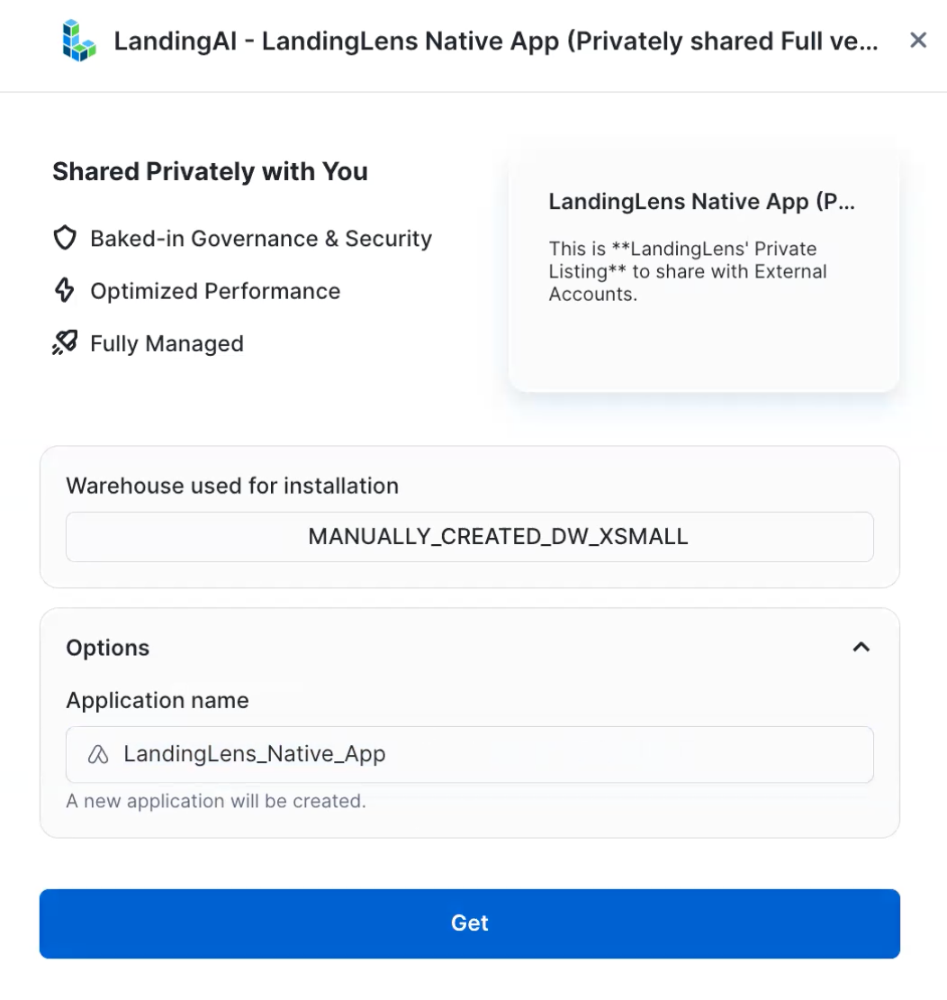
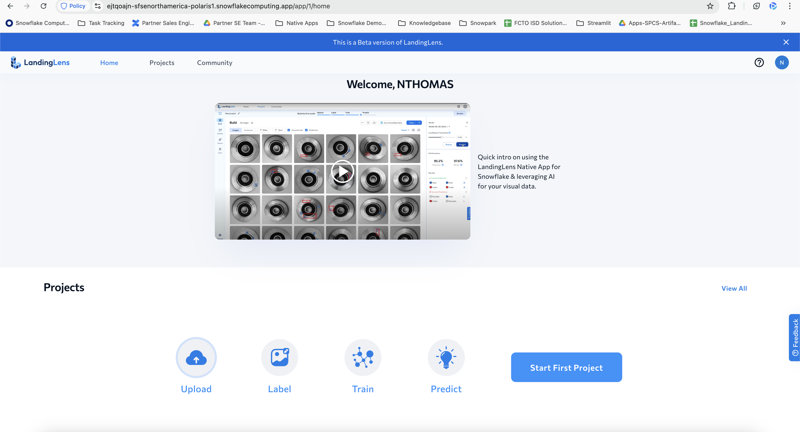

author: Bianca Ragsdale
id: build_visual_ai_model_to_detect_manufacturing_defects_with_landingai_and_snowflake
summary: This guide shows how to use LandingLens and Snowflake to create a computer vision model that detects defects in a manufacturing dataset.
categories: data-science, data-applications, healthcare, data-science-&-ai, app-development
environments: web
status: Published
tags: Getting Started, Data Science, LandingAI, LVM, Data Applications

# Use Visual AI Models to Detect Defects with LandingLens on Snowflake

## Overview
Duration: 1

In this quickstart, we'll use LandingLens — a Native App available in the Snowflake Marketplace — to create a computer vision model that detects defects in components from a manufacturing environment. After completing this quickstart, users can use the concepts and procedures from this quickstart to build Object Detection, Segmentation, and Classifications models in LandingLens. 

### What Is LandingLens?
LandingLens is a cloud-based Visual AI platform. LandingLens empowers users to create and train Visual AI models even if you don't have a background in AI, machine learning, or computer vision. LandingLens guides you through the process of uploading images, labeling them, training models, comparing model performance, and deploying models.

To users who are familiar with machine learning, LandingLens offers advanced tools to customize the model training process. LandingLens supports advanced deployment options including cloud deployment as well as [Docker](https://support.landing.ai/landinglens/docs/docker-deploy) and [LandingEdge](https://support.landing.ai/landinglens/docs/landingedge-overview), LandingAI’s edge-deployment solution.

### What You'll Learn

- How to install LandingLens from the Snowflake Marketplace
- How to load sample data from a Snowflake stage
- How to build a Classification computer vision model in LandingLens


### What You’ll Need
- A [Snowflake](https://signup.snowflake.com/?utm_cta=quickstarts_) account
- Snowflake privileges on your user to [Install a Native Application](https://other-docs.snowflake.com/en/native-apps/consumer-installing#set-up-required-privileges)
- A warehouse to *install* LandingLens (the warehouse can be any size and can have auto-suspend enabled)
- A warehouse to *run* LandingLens


### What You’ll Build
- A computer vision Classification model to detect defects from a manufacturing line.

<!-- ------------------------ -->

## Install the LandingLens Native App in Your Account
Duration: 30

### Request the LandingLens App
Access to the LandingLens app is available by request. To request the app, follow the instructions below:

1. Open the [LandingAI](https://app.snowflake.com/marketplace/providers/GZTYZF0O17X/LandingAI) provider page in the Snowflake Marketplace.
2. Locate and click the **LandingLens - Visual AI Platform** listing.
3. Click **Request**.

   

5. Fill out and submit the request form.
6. The LandingAI team will review the request and contact you with more information.

### Install the LandingLens App
After you've requested the app and been granted access it, follow the instructions below to install it in Snowflake:

1. Open the [LandingAI](https://app.snowflake.com/marketplace/providers/GZTYZF0O17X/LandingAI) provider page in the Snowflake Marketplace.
2. Locate and click the **LandingLens - Visual AI Platform** listing.
3. Click **Get**.

   

4. Select the **Warehouse** to use for the installation process. The warehouse is only used to install the app, and can be any size (including X-Small).

5. If you want to change the name of the application, click **Options** and enter a name in **Application Name**.

6. Click **Get**.

   

7. Go to **Snowsight** > **Data Products** > **Apps**. Double-click the LandingLens app listing. (Although the app is listed in the Installed Apps section, it is not installed yet.)
   

8. A new page opens. It has a series of steps that guide you through the installation process.

9. In **Step 1**, click **Grant**. These permissions allow LandingLens to create compute pools and perform other tasks in your account.
   
   
10. In **Step 2**, click **Review**. Review the allowed endpoints on the pop-up and click **Connect**. This allows LandingLens to access the Internet.

11. Scroll to the top of the page and click **Activate**.
      
   
12. LandingLens opens in your Apps. Click **Launch App**.
      
   
13. The installer opens in the **APP_WIZARD** tab.

14. Click **Install**. The installer installs all the required services for the LandingLens app. This process takes about 20 to 30 minutes. Do NOT close the tab during the installation process, because it will stop the process.
      
   
15. Once the installation process is complete, all services have the status DONE or READY (green checkmark) and the URL to access LandingLens displays. Copy and paste the URL.  
      

16. Paste the URL into a new tab to open the LandingLens app. We recommend bookmarking this URL. You can log in to the app using the Snowflake credentials you used to install the app. Only users with the correct privileges in the account can access the LandingLens app.
   
      
   
    
<!-- ------------------------ -->

## Get Sample Images
Duration: 15

Now that you've installed the LandingLens app, you are ready to get the sample images. LandingAI provides a set of sample images as an "app" that can be downloaded from the Snowflake Marketplace. You will use these images to train a computer vision model in LandingLens that detects manufacturing defects.

To get the sample images, follow these instructions:

1. Open the [Sample Dataset for LandingLens: Manufacturing Metal Casting](https://app.snowflake.com/marketplace/listing/GZTYZ12K65C6/landingai-sample-dataset-for-landinglens-manufacturing-metal-casting) listing in the Snowflake Marketplace and click **Get**.
   

2. Go to **Snowsight** > **Data Products** > **Apps**. Click the **Sample Dataset for LandingLens: Manufacturing Metal Casting** app listing.
   

3. Click the **Shield** icon in the top right corner of this app page.

4. Click **Review** and allow the CREATE DATABASE privilege, which grants the app to create a database to load the sample data.
   

5. Open the **LLENS_DATA_APP** tab.

6. Click **Create Sample Dataset** to load the dataset into your Snowflake account.
   

7. Make a note of the location of the images; you will use these later.
      - **Database**: llens_sample_ds_manufacturing
      - **Schema**: ball_bearing
      - **Stage**: dataset

<!-- ------------------------ -->
## Build a Defect Detection Project
Duration: 20

Now that you've loaded the sample dataset into your Snowflake account, you're ready to create a computer vision model using those images in LandingLens.

### Load the Images into LandingLens
1. Open LandingLens in Snowflake (use the URL generated when you installed the app).
2. Click **Start First Project** and name your project.
3. Click **Classification**.
4. Click **Sync Snowflake Data**.
   
5. Enter the location that you saved the sample dataset to earlier. The location should be:
      - **Database**: llens_sample_ds_manufacturing
      - **Schema**: ball_bearing
      - **Stage**: dataset
6. You will get a message saying that you don't have access to that location. To fix this, copy the SQL commands at the bottom of the pop-up and run them in a Snowsight worksheet in a different browser tab.
7. Turn on **Classify images based on folder names**.
8. Click the directory path (**⌄ /**) in the **Folder** field. 
9. Select the **data** directory.
10. Click **Sync**.
   
11. All the images in the stage are loaded into the LandingLens project. (Refresh the page to see the images.) The project now has 100 images; 50 images have the class "defects", and 50 have the class "no defects".
   

### Train a Classification Model
Now that all of the images are in the LandingLens project and have classes assigned to them, train a computer vision model. When you train a model, you give the labeled images to a deep learning algorithm. This allows the algorithm to "learn" what to look for in images.

To train a model, click **Train**.


The right side panel opens and shows the model training progress. This process can take a few minutes.


Once training finishes, you will see the model's predictions and performance information. You can click the model tile in the side panel to see more detailed information. In most real-world use cases, you might need to upload and label more images to improve performance. In this example, the model should be performing well, so we will go to the next step, which is deploying the model.


<!-- ------------------------ -->
## Deploy the Model to an Endpoint
Duration: 20

After you are happy with the results of your trained model, you are ready to use it. To use a model, you **deploy** it, which means you put the model in a virtual location so that you can then upload images to it. When you upload images, the model runs **inference**, which means that it detects what it was trained to look for.

In this example, we're going to show how to use Cloud Deployment. You can also deploy models using [LandingEdge](https://support.landing.ai/docs/landingedge-overview) and [Docker](https://support.landing.ai/docs/docker-deploy).

To deploy the model with Cloud Deployment, follow these instructions:

1. Open the **Models** tab.
2. Click **Deploy** in the model's row.

   
3. Name the endpoint and click **Deploy**.

   
   
4. LandingLens deploys the model to the endpoint and opens the **Deploy** page. You can now use this endpoint to run inference.
   
5. Make a note of the `endpoint_id` that displays in the **Python SDK** script. You will include this when you run inference later.
   

<!-- ------------------------ -->
## Run Inference

Duration: 20

After deploying a model with Cloud Deployment, there are a few ways to send images to that endpoint for inference. In this example, you will run inference using SQL commands in Snowsight. 

Since you already have access to the Manufacturing dataset, you will run inference on one of those images (typically you would run inference on new images).

### Get Your App Name

The SQL commands you will run in this section require you to include the `APP_NAME` of your LandingLens instance. To get your  `APP_NAME`, follow the instructions below:

1. Open Snowsight.
2. Go **Data Products** > **Apps**. Click the **LandingLens - Visual AI Platform** app listing.
   
3. Click **Launch App**.

   
4. If prompted, select a warehouse.
5. The  `APP_NAME` is the text following the **LandingLens Installer for** line. For example, in the screenshot below, the `APP_NAME` is **LANDINGLENS_SNOWFLAKE**.
   


### Grant Yourself the LLENS_PUBLIC Application Role

Using SQL commands to run inference requires the LLENS_PUBLIC application role. 

Application roles can't be granted directly to users, so you must grant LLENS_PUBLIC to an account role (or to another application role that is then granted to an account role). In this tutorial, you will create an account role called LANDINGLENS_EXTERNAL_ACCESS, grant that role to yourself, and then grant the LLENS_PUBLIC application role to that account role. 

1. Open Snowsight.
2. Go to **Projects** > **Worksheets**.
3. Click the **+** button to create a new SQL worksheet.
   
4. Copy the following code into the worksheet:
   ```
   CREATE ROLE LANDINGLENS_EXTERNAL_ACCESS;
   GRANT ROLE LANDINGLENS_EXTERNAL_ACCESS TO USER <user_name>;
   GRANT APPLICATION ROLE APP_NAME.LLENS_PUBLIC TO ROLE LANDINGLENS_EXTERNAL_ACCESS;
   ```
5. Replace `<user_name>` with your Snowflake user name, and `APP_NAME` with the name of your LandingLens instance.
   
6. Run the code.

### Run Inference

In this tutorial, you will run inference using SQL commands. To do this, follow the instructions below:

1. Open Snowsight.
2. Go to **Projects** > **Worksheets**.
3. Click the **+** button to create a new SQL worksheet.
   
4. Copy the following code into the worksheet:
   ```
   SELECT
    APP_NAME.core.run_inference('@llens_sample_ds_manufacturing.ball_bearing.dataset/data/no-defects/cast_ok_0_102.jpeg', '<endpoint_id>') as inference;
   ```
6. Replace `APP_NAME` with the name of your LandingLens instance, and `<endpoint_id>` with the endpoint ID for the deployed model.
7. Run the code.
8. The response should be similar to the following code. The expected `labelName` is `no defects`.
   ```
   {
      "backbonepredictions": null,
      "backbonetype": null,
      "latency": {
         "infer_s": 0.26324915885925293,
         "input_conversion_s": 0.0013682842254638672,
         "model_loading_s": 0.0002269744873046875,
         "postprocess_s": 7.891654968261719e-05,
         "preprocess_s": 0.0044956207275390625,
         "serialize_s": 0.00017309188842773438
      },
      "model_id": "a24d15b0-3822-4602-a544-720a0097aa36",
      "predictions": {
         "labelIndex": 2,
         "labelName": "no defects",
         "score": 0.999671220779419
      },
      "type": "ClassificationPrediction"
   }
   ```
   

### See Inference Results in LandingLens

After running inference, you can also see the prediction results in LandingLens. To do this:

1. Open the project in LandingLens.
2. Open the Deploy tab.
3. The image and inference results display.
   


<!-- ------------------------ -->
## Conclusion and Resources
Duration: 2

Congratulations on creating a defect detection computer vision model in LandingLens! You can now apply the concepts you've learned to building custom computer vision models in LandingLens.

In this quickstart you learned:

- How to install the LandingLens Native App from the Snowflake Marketplace
- How to load images from Snowflake stages into LandingLens projects
- How to train and deploy a computer vision project in LandingLens
- How to run inference using SQL commands in Snowsight


### Related Resources
- To learn about more about LandingLens, check out the [LandingLens docs](https://support.landing.ai/docs/snowflake)
- To connect with other LandingLens users, join the [LandingAI Community](https://community.landing.ai/home)
- To learn more about LandingAI, check out [landing.ai/](https://landing.ai/)
