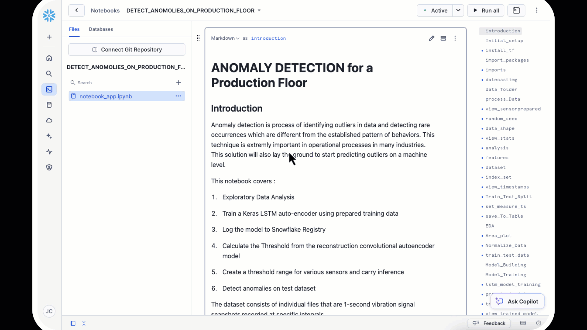

author: James Cha-Earley
id: building-a-custom-model-for-anomaly-detection
categories: snowflake-site:taxonomy/solution-center/certification/quickstart, snowflake-site:taxonomy/solution-center/certification/certified-solution, snowflake-site:taxonomy/solution-center/includes/architecture, snowflake-site:taxonomy/industry/manufacturing, snowflake-site:taxonomy/product/ai, snowflake-site:taxonomy/snowflake-feature/model-development
language: en
summary: Build custom anomaly detection models in Snowflake for fraud detection, quality control, and operational monitoring.
environments: web
status: Published
feedback link: https://github.com/Snowflake-Labs/sfguides/issues


# Build a Custom Model to Detect Anomalies on the Production Floor

## Overview

This guide follows the **detect_anomalies_on_production_floor.ipynb**  notebook to simulate production data, analyze it, and detect anomalies using Snowflake and machine learning. By the end, you will have a registered anomaly detection model in Snowflake's Model Registry.
Download the Notebook [detect_anomalies_on_production_floor.ipynb](https://github.com/Snowflake-Labs/sfguide-build-custom-model-to-detect-anomalies-on-production-floor/blob/main/notebooks/detect_anomolies_on_production_floor.ipynb)

### Prerequisites

Before you begin, ensure you meet the following prerequisites:

- Familiarity with Python programming.
- Basic understanding of machine learning concepts.
- Familiarity with Snowflake and the DataFrame API.
- Access to a Snowflake account with Snowflake Notebooks enabled.

---

### What You’ll Need

To complete this quickstart, you’ll need:

- A Snowflake account in a region that supports Snowflake's Machine Learning and Model Registry capabilities.
- Access to a warehouse with GPU capabilities for training the LSTM model.
- Python libraries: `pandas`, `numpy`, `scikit-learn`, `tensorflow`, and `keras`.
- A copy of the [detect_anomalies_on_production_floor.ipynb](https://github.com/Snowflake-Labs/sfguide-build-custom-model-to-detect-anomalies-on-production-floor/blob/main/notebooks/detect_anomolies_on_production_floor.ipynb) notebook.
- 

---

### What You’ll Learn

In this quickstart, you’ll learn how to:

1. Simulate production data with normal and anomalous patterns.
2. Store and preprocess data using Snowflake Snowpark.
3. Train a Long Short-Term Memory (LSTM) neural network model for anomaly detection.
4. Register and retrieve machine learning models using Snowflake's Model Registry.
5. Use your registered anomaly detection model for inference.

---

### What You’ll Build

You will build a complete anomaly detection workflow for IoT sensor data from production floor machinery, including:

- **Data Simulation:** Generate synthetic IoT sensor data representing normal and anomalous patterns.
- **Data Processing:** Preprocess and store data using Snowflake Snowpark.
- **Model Training:** Train an LSTM model tailored for anomaly detection.
- **Model Deployment:** Register your trained model in Snowflake's Model Registry for streamlined deployment.
- **Actionable Insights:** Build a Streamlit-powered ChatUI to interact with the data and anomalies for deeper insights.

By the end of this guide, you'll have a functional pipeline capable of detecting anomalies in IoT data and providing actionable insights for production monitoring and maintenance.


---

## Setup

### Create Database

1. Open a new worksheet in Snowflake
2. Create the database

```sql
USE ROLE SYSADMIN;
CREATE database Productionfloor_db;
```

### Open Snowflake Notebooks

1. Click [Notebook](https://github.com/Snowflake-Labs/sfguide-build-custom-model-to-detect-anomalies-on-production-floor/blob/main/notebooks/detect_anomolies_on_production_floor.ipynb) to download the Notebook from GitHub. (NOTE: Do NOT right-click to download.)
2. In your Snowflake account:
* On the left hand navigation menu, click on Projects » Notebooks
* On the top right, click on Notebook down arrow and select **Import .ipynb** file from the dropdown menu
* Select the file you downloaded in step 1 above
3. In the Create Notebook popup
* For Notebook location, select your database and public schema
* Select your **Warehouse**. You will need to have access to a **Container** with a **GPU Cluster**
* Click on Create button
4. Open the notebook once created
* You will want to ensure you have external access so we can access pip


---

## Generate Normal and Anomalous Data

In this section, you will create synthetic IoT sensor data to simulate production floor machinery performance. This data will include both normal operating conditions and intentionally introduced anomalies, enabling you to train and validate your anomaly detection model.

The simulated data will represent various sensor readings, such as temperature, vibration, motor RPM, and motor current. By generating this data, you can better understand how your model distinguishes between normal and anomalous behavior in a controlled environment.

---

### Generate Normal Data

Normal data simulates machinery operating under standard conditions without any malfunctions. Each sensor's data is modeled as a Gaussian distribution with predefined means and variances to replicate realistic sensor behavior.

Here’s how the data is generated:
- **Timestamps:** Generate a sequence of evenly spaced timestamps to represent consistent sensor readings over time.
- **Sensor Parameters:** Simulate sensor measurements (e.g., temperature, vibration, motor RPM, and motor current) as random values drawn from normal distributions.

The resulting dataset serves as the baseline for normal operating conditions.

**Code Example:**

```python
# Parameters
num_records = 1000
start_time = pd.Timestamp("2024-06-12 10:52:00")
interval = pd.Timedelta(minutes=10)

# Generate timestamps
timestamps = [start_time + i * interval for i in range(num_records)]

# Generate normal sensor data
np.random.seed(42)
temperature = np.random.normal(loc=0.06, scale=0.002, size=num_records)
vibration = np.random.normal(loc=0.075, scale=0.002, size=num_records)
motor_rpm = np.random.normal(loc=0.045, scale=0.001, size=num_records)
motor_amps = np.random.normal(loc=0.084, scale=0.002, size=num_records)
```

### Add Anomalies

Anomalous data introduces deviations that simulate potential failures or irregularities in the production machinery. This data is used to train and test the model’s ability to detect unusual behavior.

Here’s how anomalies are added:
- **Start Point:** Define the starting index for anomalies in the dataset.
- **Anomalous Patterns:** Introduce significant deviations in sensor values to mimic realistic anomalies, such as overheating, excessive vibration, or power irregularities.

By mixing anomalous and normal data, you create a diverse dataset that challenges the anomaly detection model to perform effectively in real-world scenarios.
```python
# Add anomalies
anomaly_start_index = num_records - 200
temperature[anomaly_start_index:] += np.random.uniform(0.005, 0.01, size=200)
vibration[anomaly_start_index:] += np.random.uniform(0.003, 0.007, size=200)
motor_rpm[anomaly_start_index:] -= np.random.uniform(0.002, 0.005, size=200)
motor_amps[anomaly_start_index:] += np.random.uniform(0.005, 0.01, size=200)

# Combine data into a DataFrame
data = {
    "TEMPERATURE": temperature,
    "VIBRATION": vibration,
    "MOTOR_RPM": motor_rpm,
    "MOTOR_AMPS": motor_amps,
    "MEASURE_TS": timestamps,
}
snow_pd = pd.DataFrame(data)
```

---

## Store Data in Snowflake

Once the synthetic data (both normal and anomalous) has been generated, the next step is to store it in Snowflake for further processing and analysis. Snowflake provides a seamless way to store structured data, making it easily accessible for machine learning workflows.

### Steps to Store Data

1. **Convert to a Snowpark DataFrame:** Use the Snowpark library to create a DataFrame from the generated Pandas DataFrame.
2. **Save Data to a Snowflake Table:** Write the Snowpark DataFrame to a Snowflake table using the `save_as_table` method.

The following code demonstrates how to store the data in Snowflake:

```python
# Convert to Snowpark DataFrame
spdf = session.create_dataframe(snow_pd)

# Save data to Snowflake
spdf.write.save_as_table("SENSOR_PREPARED", mode="overwrite")
```
---

## Create the Anomaly Detection Model

In this section, you will define a custom anomaly detection model, register it with Snowflake's Model Registry, and prepare it for use. Snowflake's Model Registry enables you to manage and deploy machine learning models seamlessly, ensuring efficient integration with your data workflows.

---

### Define the Custom Model

To detect anomalies in the sensor data, we’ll create a custom model class that preprocesses the data, performs predictions, and calculates anomaly scores. This custom model will leverage an LSTM (Long Short-Term Memory) neural network for detecting patterns and deviations.

**Key Steps:**
1. **Preprocessing:** Normalize the input data using `MinMaxScaler` for consistency.
2. **Model Inference:** Use the trained LSTM model to make predictions on the input data.
3. **Anomaly Scoring:** Calculate the anomaly scores by comparing predicted values to the original data.

```python
from snowflake.ml.model import custom_model
from sklearn.preprocessing import MinMaxScaler
import numpy as np

class AnomalyDetectionModel(custom_model.CustomModel):
    def __init__(self, context: custom_model.ModelContext) -> None:
        super().__init__(context)
        
    @custom_model.inference_api
    def predict(self, train_data: pd.DataFrame) -> pd.DataFrame:
        cols = train_data.columns
        scaler = MinMaxScaler()
        
        # Prepare the data
        X_train_pd = train_data.to_numpy()
        X = X_train_pd.reshape(X_train_pd.shape[0], 1, X_train_pd.shape[1])
        
        # Perform predictions
        X_pred = self.context.model_ref('lstm').predict(X)
        X_pred = X_pred.reshape(X_pred.shape[0], X_pred.shape[2])
        
        # Calculate anomaly scores
        scored = np.abs(X_pred - X_train_pd)
        return pd.DataFrame(scored, columns=[f"feature_{i}" for i in range(scored.shape[1])])

# Create the custom model instance
ad = AnomalyDetectionModel(
    context=custom_model.ModelContext(models={'lstm': model})
)
```

### Register the Model in Snowflake

```python
from snowflake.ml.registry import Registry

# Initialize the registry
ml_reg = Registry(session=session)

# Log the model
mv = ml_reg.log_model(
    ad,
    model_name="ANOMALYDETECTION_MODEL_1",
    version_name='v1',
    sample_input_data=train_data,
    conda_dependencies=["scikit-learn", "keras==2.9", "tensorflow==2.9"],
    options={
        "relax_version": True,
        "embed_local_ml_library": True
    }
)
```

## Register the Model in Snowflake

After defining the custom anomaly detection model, the next step is to register it in Snowflake's Model Registry. The Model Registry allows you to store, version, and manage your machine learning models directly within Snowflake, ensuring seamless integration and deployment.

**Key Steps:**
1. **Initialize the Model Registry:** Connect to the Model Registry using your active Snowflake session.
2. **Log the Model:** Save the custom model, including dependencies and version details, to the registry.

```python
# Retrieve the model from the registry
reg = Registry(session=session) 
model_ref = reg.show_models()

# Access the specific model version
m = reg.get_model("ANOMALYDETECTION_MODEL_1")
mv = m.version("v1")

# Use the model
X_pred = mv.run(X_train_snowdf, function_name="predict")
```


## Build a ChatUI on Streamlit

Streamlit provides an intuitive and interactive interface for building data-driven applications.  
In this section, you'll create a ChatUI that allows you to interact with your anomaly detection data, enabling you to gain actionable insights and engage with the results of your model.

This ChatUI leverages Streamlit's features to provide:
- A conversational interface for querying anomaly data.
- Seamless integration with Snowflake for real-time data retrieval.
- AI-powered suggestions and insights to help users make informed decisions.

### Key Components of the ChatUI

1. **Streamlit Setup:** Configure Streamlit to display the ChatUI interface.
2. **Session Management:** Manage user queries and responses in a conversational format.
3. **Integration with Snowflake:** Use Snowflake Cortex functions and Snowpark queries to fetch and analyze data.
4. **Interactive Responses:** Provide AI-powered responses and insights based on user questions.

### Features of the ChatUI

1. **Natural Language Queries:**  
   Users can ask questions like "What anomalies occurred in the last 24 hours?" and receive contextually relevant answers.

2. **Real-Time Data:**  
   The ChatUI fetches anomaly data directly from the Snowflake database, ensuring that users work with up-to-date information.

3. **AI Assistance:**  
   Integrates Snowflake Cortex's `Complete` function to provide AI-enhanced insights, enabling users to make sense of complex datasets with ease.

4. **User-Friendly Interface:**  
   Built with Streamlit, the ChatUI provides an intuitive and visually appealing experience, allowing seamless interaction with data and insights.

---

### Benefits

- **Quick Identification of Anomalies:**  
  Users can swiftly identify and understand anomalies in IoT sensor data, reducing time to action.

- **Natural Interaction with Data:**  
  The ChatUI enables natural language queries, making it accessible to both technical and non-technical users.

- **Proactive Decision-Making:**  
  Gain actionable insights from anomaly data, supporting proactive maintenance and operational improvements.

- **Seamless Integration with Snowflake:**  
  Combines the power of Snowflake's Cortex and Snowpark capabilities with a user-friendly interface, creating an efficient and scalable solution.

- **Enhanced User Experience:**  
  The conversational design ensures that users can intuitively explore and analyze data without needing to write complex queries.


```python
    # Import python packages
    import pandas as pd
    import streamlit as st
    from snowflake.core import Root
    import snowflake.snowpark.functions as F
    import snowflake.snowpark.types as T
    from snowflake.core import Root
    from snowflake.snowpark.exceptions import SnowparkSQLException
    from snowflake.cortex import Complete, ExtractAnswer, Sentiment, Summarize, Translate, ClassifyText
    from snowflake.snowpark.context import get_active_session

    # Constants
    DB = "productionfloor_db"
    SCHEMA = "public"
    SERVICE = "cortex_search_production_data"
    BASE_TABLE = "SENSORS_AD_DETECTED"

    st.set_page_config(layout="wide", initial_sidebar_state="expanded")
    st.title(":gear: Manufacturing Floor Q&A Assistant  :gear:")
    st.caption(
        f"""Welcome! This application suggests answers to questions based 
        on the available data and previous agent responses in support chats.
        """
    )

    # Get current credentials
    session = get_active_session()

    # Constants
    CHAT_MEMORY = 10


    MODELS = [
        "mistral-large",
        "llama3.1-70b",
        "llama3.1-8b",
        "mistral-large2",
        "llama3.1-405b",
    ]

    def init_messages():
        """
        Initialize the session state for chat messages. If the session state indicates that the
        conversation should be cleared or if the "messages" key is not in the session state,
        initialize it as an empty list.
        """
        if st.session_state.clear_conversation or "messages" not in st.session_state:
            st.session_state.messages = []
            st.session_state.suggestions = []
            st.session_state.active_suggestion = None


    ##########################################
    #       Cortex Search
    ##########################################
    def init_service_metadata():
        """
        Initialize the session state for cortex search service metadata. 
        """
        if "service_metadata" not in st.session_state:
            services = session.sql("SHOW CORTEX SEARCH SERVICES;").collect()
            service_metadata = []
            if services:
                for s in services:
                    svc_name = s["name"]
                    svc_search_col = session.sql(
                        f"DESC CORTEX SEARCH SERVICE {svc_name};"
                    ).collect()[0]["search_column"]
                    service_metadata.append(
                        {"name": svc_name, "search_column": svc_search_col}
                    )

            st.session_state.service_metadata = service_metadata

    def init_config_options():
        """
        Initialize the configuration options in the Streamlit sidebar. Allow the user to select
        a cortex search service, clear the conversation, toggle debug mode, and toggle the use of
        chat history. Also provide advanced options to select a model, the number of context chunks,
        and the number of chat messages to use in the chat history.
        """
        st.sidebar.selectbox(
            "Select cortex search service:",
            [s["name"] for s in st.session_state.service_metadata],
            key="selected_cortex_search_service",
        )

        st.sidebar.button("Clear conversation", key="clear_conversation")
        st.sidebar.toggle("Debug", key="debug", value=False)
        st.sidebar.toggle("Use chat history", key="use_chat_history", value=True)

        with st.sidebar.expander("Advanced options"):
            st.selectbox("Select model:", MODELS, key="model_name")
            st.number_input(
                "Select number of context chunks",
                value=5,
                key="num_retrieved_chunks",
                min_value=1,
                max_value=10,
            )
            st.number_input(
                "Select number of messages to use in chat history",
                value=5,
                key="num_chat_messages",
                min_value=1,
                max_value=10,
            )

        st.sidebar.expander("Session State").write(st.session_state)

        if "messages" not in st.session_state:
            st.session_state.messages = []


        # Display chat messages from history on app rerun
        for message in st.session_state.messages:
            with st.chat_message(message["role"]):
                st.markdown(message["content"])

    def query_cortex_search_service(query):
        """
        Query the selected cortex search service with the given query and retrieve context data.

        Args:
            query (str): The query to search the cortex search service with.

        Returns:
            str: The concatenated string of context.
        """
        db, schema = session.get_current_database(), session.get_current_schema()

        cortex_search_service = (
            root.databases[db]
            .schemas[schema]
            .cortex_search_services[st.session_state.selected_cortex_search_service]
        )

        context_documents = cortex_search_service.search(
            query, columns=[], limit=st.session_state.num_retrieved_chunks
        )
        results = context_documents.results

        service_metadata = st.session_state.service_metadata
        search_col = [s["search_column"] for s in service_metadata
                        if s["name"] == st.session_state.selected_cortex_search_service][0]

        context_str = ""
        for i, r in enumerate(results):
            context_str += f"Context {i+1}: {r[search_col]} \n" + "\n"

        if st.session_state.debug:
            st.sidebar.text_area("Context", context_str, height=500)

        return context_str


    def get_chat_history():
        """
        Retrieve the chat history from the session state limited to the number of messages specified
        by the user in the sidebar options.

        Returns:
            list: The list of chat messages from the session state.
        """
        start_index = max(
            0, len(st.session_state.messages) - st.session_state.num_chat_messages
        )
        return st.session_state.messages[start_index : len(st.session_state.messages) - 1]

    def complete(model, prompt):
        """
        Generate a completion for the given prompt using the specified model.

        Args:
            model (str): The name of the model to use for completion.
            prompt (str): The prompt to generate a completion for.

        Returns:
            str: The generated completion.
        """
        return session.sql("SELECT snowflake.cortex.complete(?,?)", (model, prompt)).collect()[0][0]

    def make_chat_history_summary(chat_history, question):
        """
        Generate a summary of the chat history combined with the current question to extend the query
        context. Use the language model to generate this summary.

        Args:
            chat_history (str): The chat history to include in the summary.
            question (str): The current user question to extend with the chat history.

        Returns:
            str: The generated summary of the chat history and question.
        """
        
        prompt = f"""
            [INST]
            Based on the chat history below and the question, generate a query that extend the question
            with the chat history provided. The query should be in natural language.
            Answer with only the query.

            <chat_history>
            {chat_history}
            </chat_history>
            <question>
            {question}
            </question>
            [/INST]
        """

        summary = complete(st.session_state.model_name, prompt)

        if st.session_state.debug:
            st.sidebar.text_area(
                "Chat history summary", summary.replace("$", "\$"), height=150
            )

        return summary

    def create_prompt(user_question):
        """
        Create a prompt for the language model by combining the user question with context retrieved
        from the cortex search service and chat history (if enabled). Format the prompt according to
        the expected input format of the model.

        Args:
            user_question (str): The user's question to generate a prompt for.

        Returns:
            str: The generated prompt for the language model.
        """
        
        if st.session_state.use_chat_history:
            
            chat_history = get_chat_history()
            if chat_history != []:
                question_summary = make_chat_history_summary(chat_history, user_question)
                prompt_context = query_cortex_search_service(question_summary)
            else:
                
                prompt_context = query_cortex_search_service(user_question)
                question_summary=''
                    
            

        prompt = f"""
                You are a AI assistant.There is data from various sensors monitoring a machine. Each sensor records different parameters such as vibration levels, temperature, motor_amps, motor_rpm sensors. The goal is to analyze this data for potential anomalies and gain insights into the machine's performance.
                Answer this question by extracting information given between
            between <context> and </context> tags. \n
                When presented with the question use the information between the \n
                <context> and </context> tags.You are offering a chat experience using the 
                user's chat history provided in between the <chat_history> and </chat_history> tags
                to provide a summary that addresses the user's question. 
            
            When answering the question be concise and dont provide explanation.           
            If you don´t have the information just say so.

            
            The question is given between the <question> and </question> tags.

            <chat_history>
                {chat_history}
                </chat_history>
                <context>
                {prompt_context}
                </context>
                
            <question>
            {user_question}
            </question>
        
            Answer:
            """
        prompt = prompt.replace("'", "''")
        return prompt

    ##########################################
    #      Main
    ##########################################

    def main():
        st.title(f":speech_balloon: Chatbot with Snowflake Cortex")

        init_service_metadata()
        init_config_options()
        init_messages()

        icons = {"assistant": "❄️", "user": "👤"}
        
            
        disable_chat = (
            "service_metadata" not in st.session_state
            or len(st.session_state.service_metadata) == 0
        )
        if question := st.chat_input("Ask a question...", disabled=disable_chat):
            # Add user message to chat history
            st.session_state.messages.append({"role": "user", "content": question})
            # Display user message in chat message container
            with st.chat_message("user", avatar=icons["user"]):
                st.markdown(question.replace("$", "\$"))
                
            

            # Display assistant response in chat message container
            with st.chat_message("assistant", avatar=icons["assistant"]):
                message_placeholder = st.empty()
                # question = question.replace("'", "")
                with st.spinner("Thinking..."):
                    # Generate the response
                    generated_response = complete(
                        st.session_state.model_name, create_prompt(question)
                    )
                    
                    # Store the generated response directly in session state
                    st.session_state.gen_response = generated_response
                    
                    # Display the generated response
                    message_placeholder.markdown(generated_response)

            st.session_state.messages.append(
                {"role": "assistant", "content": generated_response}
            )
            

    if __name__ == "__main__":
        session = get_active_session()
        root = Root(session)
        main()
```

---

## Conclusion and Resources

**Congratulations!** You've successfully followed the **detect_anomalies_on_production_floor.ipynb** notebook to:

- Simulate production data with normal and anomalous patterns.
- Train and register an LSTM-based anomaly detection model in Snowflake.
- Retrieve and prepare the model for inference.

This workflow provides a foundation for real-time anomaly detection in production systems, enabling proactive maintenance and operational efficiency.

### What We've Covered

By completing this quickstart, you have learned:
- How to simulate IoT sensor data for anomaly detection.
- How to store, preprocess, and analyze data using Snowflake Snowpark.
- How to build, register, and retrieve an LSTM-based custom anomaly detection model.
- How to leverage Snowflake's Model Registry for deploying machine learning models.

### Related Resources

To further explore the tools and methodologies used in this quickstart, check out the following resources:

- [Snowpark Python Developer Guide](https://docs.snowflake.com/en/developer-guide/snowpark/python/index)
- [Snowflake ML Model Registry Documentation](https://docs.snowflake.com/en/developer-guide/ml-model-registry/index)
- [Source Code for This Quickstart](https://github.com/Snowflake-Labs/sfguide-build-custom-model-to-detect-anomalies-on-production-floor)
- [Snowflake Notebooks Overview](https://docs.snowflake.com/en/user-guide/ui-snowsight#notebooks)
- [Download Reference Architecture](/content/dam/snowflake-site/developers/2025/anomaly-detection.pdf)
- [Read Medium Blog](https://medium.com/@kala.govindarajan/building-llm-powered-chat-experiences-for-anomaly-detection-and-predictive-maintenance-in-snowflake-4f3f84c06b1d)
  

These resources will help you deepen your understanding and build more complex machine-learning workflows using Snowflake.

---
