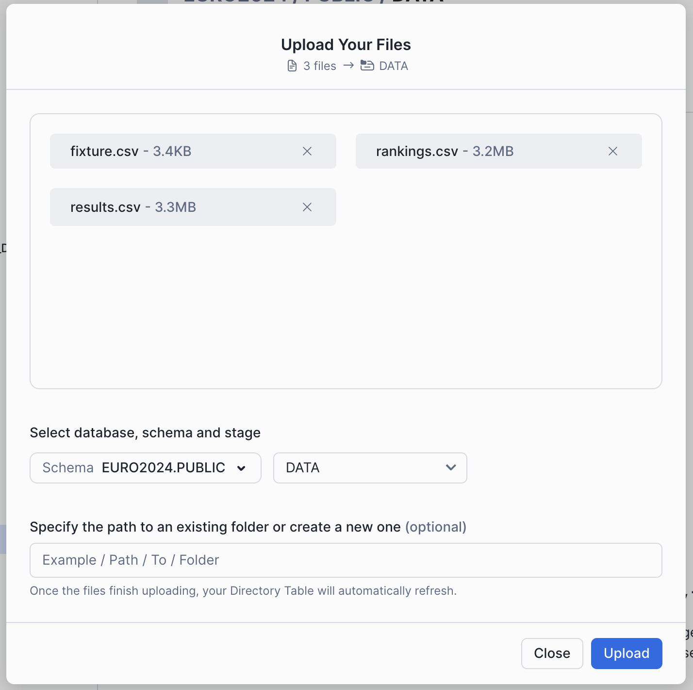
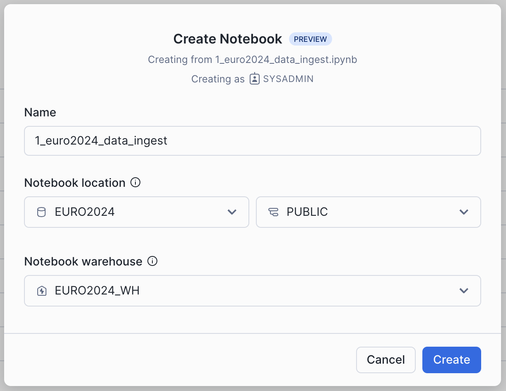

author: Simon Coombes
id: building-a-sports-prediction-model-with-snowpark-ml
categories: snowflake-site:taxonomy/solution-center/certification/quickstart, snowflake-site:taxonomy/solution-center/certification/community-sourced, snowflake-site:taxonomy/solution-center/includes/architecture, snowflake-site:taxonomy/industry/sports, snowflake-site:taxonomy/product/data-engineering, snowflake-site:taxonomy/snowflake-feature/unstructured-data-analysis, snowflake-site:taxonomy/snowflake-feature/ml-functions
language: en
summary: Predict sports outcomes using Snowpark ML for feature engineering, model training, real-time scoring, and betting analytics.
environments: web
status: Published 
feedback link: https://github.com/Snowflake-Labs/sfguides/issues

# Predicting Sporting Outcomes with Snowpark ML
<!-- ------------------------ -->
## Overview 

In this guide, we'll be walking through all the steps you'll need to go through to build a prediction model for the Euro 2024 Football (Soccer) Tournament. Leveraging features like Snowpark, Snowpark ML, and the Snowflake Model Registry, this guide will be using historical results and international rankings to create a model and then simulate all 51 games of the tournament.

### Prerequisites

* Access to a Snowflake account or use of the [Snowflake free 30-day trial](https://trial.snowflake.com)
* Either;
    * Snowflake Notebooks, or
    * A [Hex](https://hex.tech) Account
* Familiarity with Snowpark
* Familiarity with Data Science Modelling
* A love of Football

### What You’ll Learn 

* Using Snowpark for Feature Engineering
* Using Snowpark ML for Hyper Parameter Tuning
* Using Snowpark ML for Model Training
* Storing Models in the Snowflake Model Registry
* Using Models from the Snowflake Model Registry in queries (Snowpark and SQL)
* Using Snowflake Notebooks for all of the above activities

### What You’ll Build 
* An end-to-end Snowpark ML pipeline for predicting the outcome of Euro 2024!

<!-- ------------------------ -->
## Prepare Your Environment

> 
> 
> Please make sure you have downloaded the following [git repo](https://github.com/Snowflake-Labs/sfguide-sporting-events-prediction-using-snowpark-ml).

If you do not have a Snowflake account, you can register for a [Snowflake free 30-day trial](https://trial.snowflake.com). The cloud provider (AWS, Azure, Google Cloud), and Region (US East, EU, e.g.) do _not_ matter for this lab. However, we suggest you select the region which is physically closest to you.

To easily follow the instructions, resize your browser windows so you can view this Quickstart and your Snowflake environment side-by-side. If possible, even better is to use a secondary display dedicated to the Quickstart.

### Create a Warehouse, Database, and Stages
Run the following SQL commands in a Snowsight Worksheet to setup your environment:

``` sql
CREATE DATABASE IF NOT EXISTS EURO2024;
CREATE STAGE IF NOT EXISTS EURO2024.PUBLIC.DATA;
CREATE STAGE IF NOT EXISTS EURO2024.PUBLIC.PYTHON_LOAD;

CREATE WAREHOUSE IF NOT EXISTS EURO2024_WH
    WAREHOUSE_SIZE = 'XSMALL' 
    AUTO_SUSPEND=60 
    AUTO_RESUME=True;
```

Note they can also be found in [setup.sql](https://github.com/Snowflake-Labs/sfguide-sporting-events-prediction-using-snowpark-ml/blob/main/setup/setup.sql).

### Staging the Data
Next you will need to upload the data files in the repo into the `DATA` stage you just created.  

1) Open Snowight UI, and navigate to `DATA / DATABASES / EURO_2024`
2) Click on the `PUBLIC` schema, then `STAGES`, and then click on the `DATA` Stage
3) In the top right corner, click on the `+FILES` option and add the `fixtures.csv`, `rankings.csv`, and `results.csv` files - make sure to click on the **UPLOAD** button.



### Loading the Notebooks
Finally we need to load the 5 notebooks from the repo found here:

* [Snowflake Notebooks](https://github.com/Snowflake-Labs/sfguide-sporting-events-prediction-using-snowpark-ml/tree/main/notebooks_snowflake)
* [Hex Notebooks](https://github.com/Snowflake-Labs/sfguide-sporting-events-prediction-using-snowpark-ml/tree/main/notebooks_hex)

This should include the following files:
- `1_euro2024_data_ingest.ipynb`
- `2_euro2024_feature_engineering.ipynb`
- `3_euro2024_modelling.ipynb`
- `4_euro2024_create_sprocs_udtfs.ipynb`
- `5_euro2024_predictions.ipynb`

***

To load the notebooks in Snowflake's Notebook environment:

1) Within Snowsight navigate to `PROJECTS / NOTEBOOKS`
2) Click on the dropdown option on the `+NOTEBOOK` in the top right, and select **Import from .ipynb**
3) Check that the Database is set to `EURO2024`, the `PUBLIC` scheme is select, and the warehouse is set as `EURO2024_WH`



***

To load the notebooks in Hex, please follow [these instructions](https://learn.hex.tech/docs/explore-data/projects/import-export)

<!-- ------------------------ -->
## Ingesting the Data into Tables

> 
> 
> Please make sure you have downloaded the following [git repo](https://github.com/Snowflake-Labs/sfguide-sporting-events-prediction-using-snowpark-ml).

Run through the cells in the `1_euro2024_data_ingest.ipynb`

In this notebook you will be ingesting the data from the staged files, and creating 3 tables containing the historical games, the historical team ranking, and the fixtures for the upcoming tournament.

At the end of this step, you should see 3 new tables in the `EURO_2024` database; 
- `results` 
- `rankings`
- `fixture`

<!-- ------------------------ -->
## Feature Engineering

> 
> 
> Please make sure you have downloaded the following [git repo](https://github.com/Snowflake-Labs/sfguide-sporting-events-prediction-using-snowpark-ml).

Run through the cells in the `2_euro2024_data_transformation.ipynb`

In this notebook you will be executing various feature engineering steps to build our dataset for training. In summary the steps will be:
- Determining the Rank of each team at the date of the historical match, and then calculating the delta between them.
- Calculating the trail performance of each team, for the prior 10 games (wins, losses and goal difference).
- Pulling in the location to specify whether there is a home advantage (this is determined by the `Neutral` column).
- Combining all this with the historical match data into a single dataset that can be used for Model Training.

<!-- ------------------------ -->
## Model Operations

> 
> 
> Please make sure you have downloaded the following [git repo](https://github.com/Snowflake-Labs/sfguide-sporting-events-prediction-using-snowpark-ml).

Run through the cells in the `3_euro2024_modelling.ipynb`

In this notebook you will be using Snowpark ML and Snowflake Model Registry to perform the following:
1) Scale up the warehouse in a single line of code.
2) Use Snowpark ML to run Hyperparameter Tuning to determine the best parameter set for the highest accuracy.
3) Scale down the warehouse.
4) Using the parameter outputs from HP Tuning, train a new Model using Snowpark ML.
5) Saving the newly trained Model to the Snowflake Model Registry.

<!-- ------------------------ -->
## Creating Stored Procedures and UDTFs

> 
> 
> Please make sure you have downloaded the following [git repo](https://github.com/Snowflake-Labs/sfguide-sporting-events-prediction-using-snowpark-ml).

Run through the cells in the `4_euro2024_create_sprocs_udtfs.ipynb`

In this notebook you will be registering a set of re-usable stored procedures and UDTFs that will be used after each simualation of the tournament:
- `calc_game_outcome(float, str, float)` - a UDTF to combine the 2 predictions into 1 and return number of points.
- `calc_game_outcome_knockout(float, str, float, float)` - a IDTF to combine the 2 predictions into 1 and determine the winner, simulating penalties if needed.
- `prep_prediction_data(int, int)` - a stored procedure that contains all the feature engineering code so we can prep the prediction data.
- `process_group_predictions()` - a stored procedure to process through the end of the group games, and determine the group standings.
- `calculate_r16_games()` - a stored procedure to calculate the new fixtures after the group phase.
- `process_knockout_predictions()` - a stored procedure to process after every knockout round, and determine the results.
- `calc_knockout_games(str)` - a stored procedure to calculate the next set of games.

At the end of this step, we will have a model, and all the functions and procedures needed to simulate the entire tournament!

<!-- ------------------------ -->
## Simulating the Euro 2024 Tournament

> 
> 
> Please make sure you have downloaded the following [git repo](https://github.com/Snowflake-Labs/sfguide-sporting-events-prediction-using-snowpark-ml).

Run through the cells in the `5_euro2024_predictions.ipynb`

In the final notebook, you will be stepping through all rounds of the Euro 2024 tournament and using the model you created in step 4 to run predictions for every game.

At the end of this stage, we will have a predicted winner of the tournament. Great job!


## Conclusion and Resources

Congratulation! - you've completed all the steps to build a full end-to-end model pipeline with Snowpark ML, seen how to persist models into the Snowflake Model Registry, and then used these Models for inference with both Snowpark Python and SQL.

### Where to go from here
This guide was an introduction into the techniques for feature engineering, model training and inference. If you wanted to extend this you could introduce more features, experiment with different model types, and add some automation into the pipeline using streams and tasks. In theory the concept could be used to predict any sporting event where you can obtain historical data. 

For more information on what we've covered today please check out these links:
- [Snowpark ML](https://docs.snowflake.com/en/developer-guide/snowpark-ml/index)
- [Snowpark Model Registry](https://docs.snowflake.com/en/developer-guide/snowpark-ml/snowpark-ml-mlops-model-registry)
- [Fork Repo on GitHub](https://github.com/Snowflake-Labs/sfguide-sporting-events-prediction-using-snowpark-ml)
- [Download Reference Architecture](/content/dam/snowflake-site/developers/2024/06/arch.jpg)
- [Read the Blog](https://medium.com/snowflake/predicting-euro-2024-with-snowflake-ml-9b7c774fdd9e)
- [Watch the Demo](https://youtu.be/OMXXKuVm7Q8?list=TLGGyQmuNl-sU0YyNTA5MjAyNQ)
