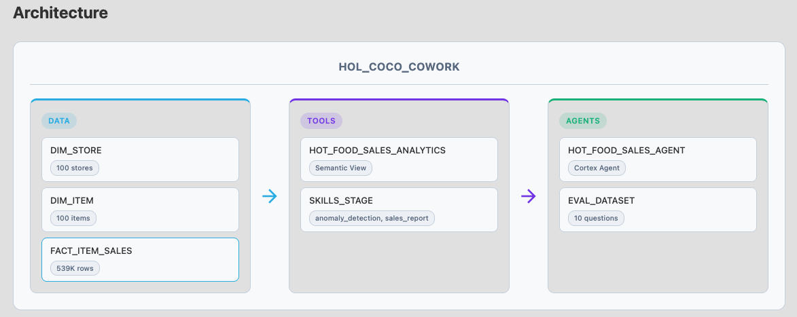
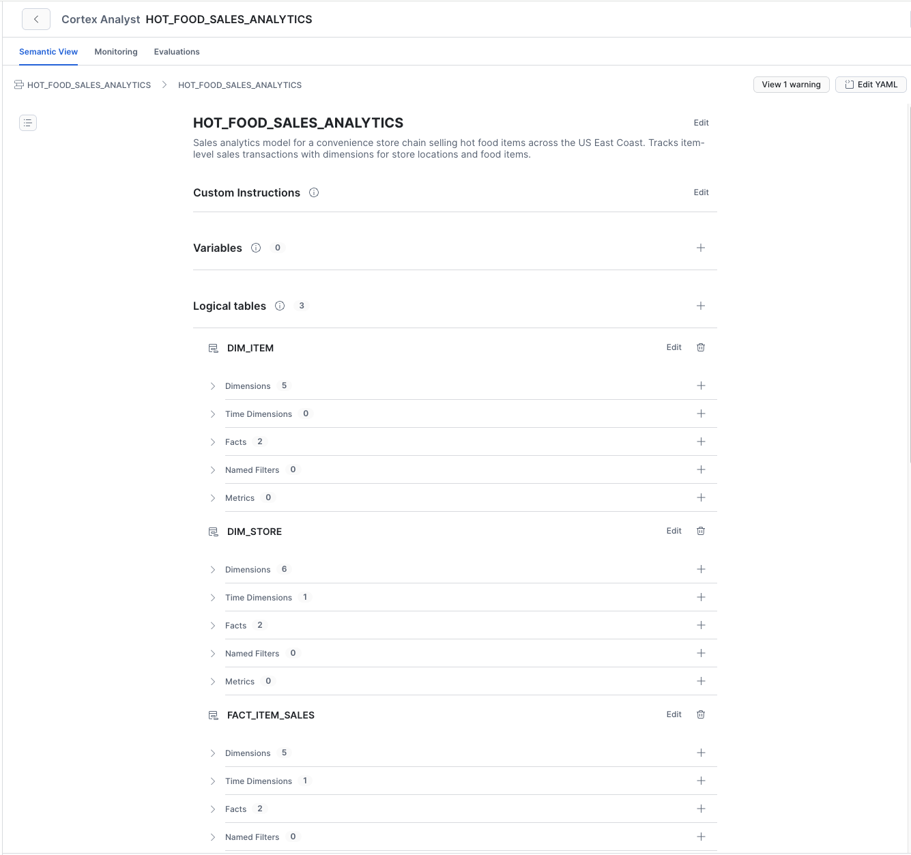
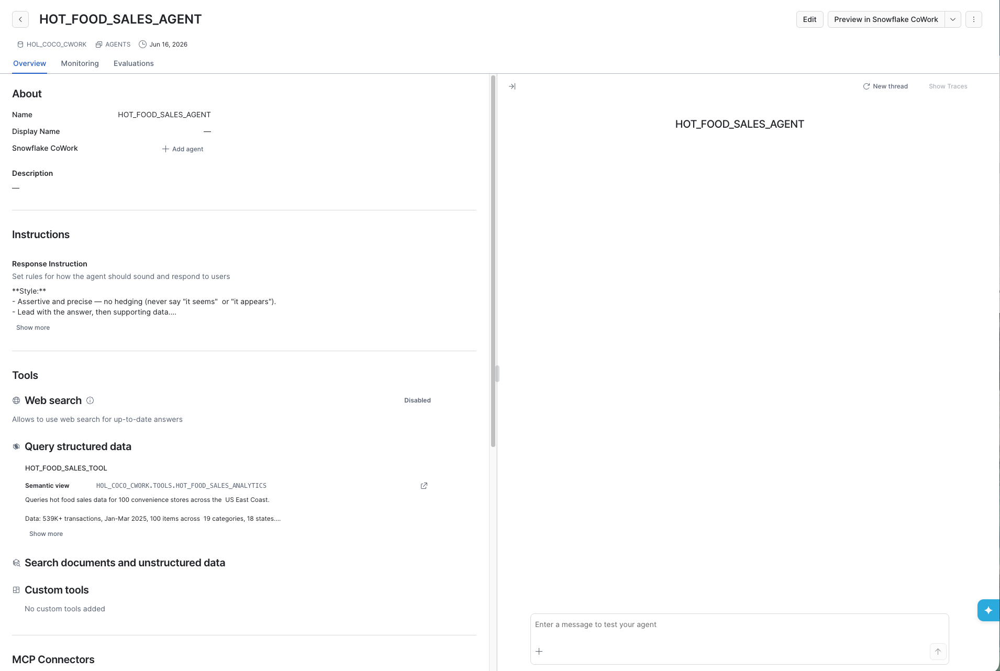
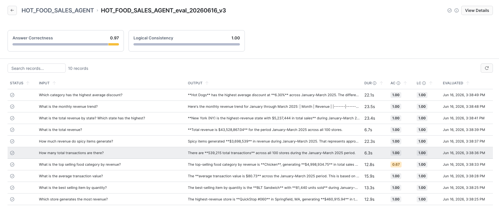
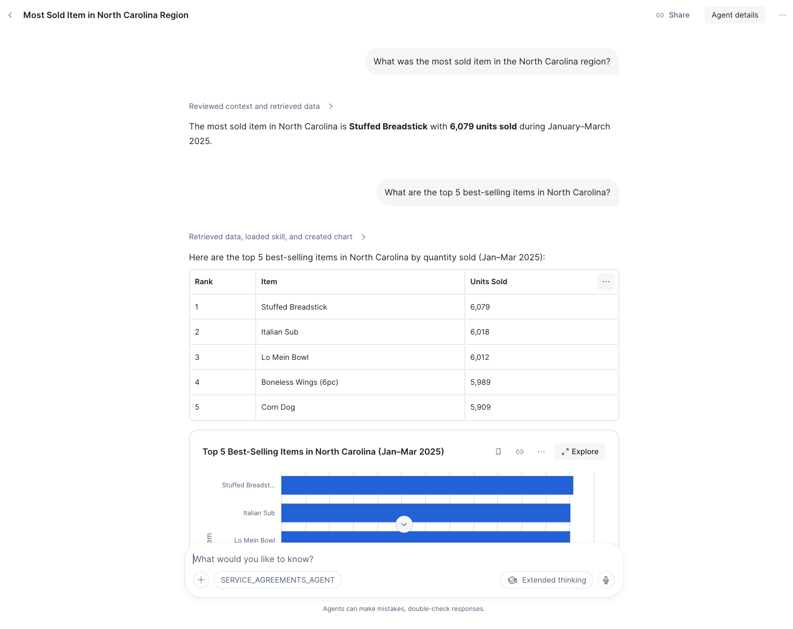

author: Carlos Serrano
id: building-ai-agents-with-cortex-code-and-cowork
language: en
summary: Build an end-to-end AI-powered analytics agent using Snowflake Cortex Code (CoCo) — from raw data to a production-ready Cortex Agent with evaluations.
categories: snowflake-site:taxonomy/solution-center/certification/quickstart, snowflake-site:taxonomy/product/ai-ml
environments: web
status: Published
feedback link: https://github.com/Snowflake-Labs/sfguides/issues
fork repo link: https://github.com/Snowflake-Labs/sfquickstarts/tree/master/site/sfguides/src/building-ai-agents-with-cortex-code-and-cowork
authors: Carlos Serrano

# Building AI Agents with Cortex Code and CoWork

<!-- ------------------------ -->
## Overview

This guide walks you through building a complete AI-powered analytics agent using **Snowflake Cortex Code (CoCo)** — the AI-native IDE for Snowflake. You will go from raw data to a production-ready Cortex Agent with evaluations, all driven by natural language prompts.

The lab uses a convenience store hot food sales dataset (100 stores, 100 items, 539K transactions) and demonstrates how Cortex Code automates the creation of semantic views, agents, skills, and evaluation frameworks.



```
┌─────────────────────────────────────────────────────────┐
│                  HOL_COCO_COWORK Database                 │
├───────────────┬──────────────────┬──────────────────────┤
│  DATA Schema  │  TOOLS Schema    │  AGENTS Schema       │
│               │                  │                      │
│  DIM_STORE    │  Semantic View:  │  Cortex Agent:       │
│  DIM_ITEM     │  HOT_FOOD_SALES  │  HOT_FOOD_SALES     │
│  FACT_ITEM    │  _ANALYTICS      │  _AGENT             │
│  _SALES       │                  │                      │
│               │  (8 VQRs,        │  (text-to-SQL tool,  │
│  100 stores   │   2 relationships│   2 skills,          │
│  100 items    │   3 tables)      │   orchestration +    │
│  539K sales   │                  │   response instrs)   │
│               │  Skills Stage:   │                      │
│               │  anomaly_detect  │                      │
│               │  sales_report    │                      │
└───────────────┴──────────────────┴──────────────────────┘
```

### Prerequisites

- A [Snowflake account](https://signup.snowflake.com/?utm_source=snowflake-devrel&utm_medium=developer-guides&utm_cta=developer-guides) with ACCOUNTADMIN access
- [Cortex Code](https://docs.snowflake.com/en/user-guide/cortex-code/cortex-code) desktop application installed and connected to your Snowflake account
- Access to a Snowflake Workspace

### What You Will Learn

- How to use Cortex Code to build Snowflake objects from natural language prompts
- How to create semantic views with verified queries for Cortex Analyst
- How to build a Cortex Agent with orchestration instructions and server-side skills
- How to evaluate agent performance using Snowflake's built-in evaluation framework

### What You Will Build

- A star-schema data model for convenience store hot food sales
- A semantic view with 8 verified queries (VQRs)
- A Cortex Agent with anomaly detection and sales report skills
- An evaluation framework measuring answer correctness and logical consistency

<!-- ------------------------ -->
## Setup Environment

This step creates all the infrastructure needed for the lab. You will run SQL and Python scripts in a Snowflake Workspace.

### Required Files

Download the [Setup folder](https://github.com/sfc-gh-cserrano/sfquickstarts-hol-coco-cowork/blob/dbcf338e2929a495a015a041b83c7a13b3ab3cdd/site/sfguides/src/building-ai-agents-with-cortex-code-and-cowork/assets/Setup.zip) which contains all scripts and data needed and extract them:

| File | Type | Purpose |
|------|------|---------|
| [01_setup.sql](https://github.com/sfc-gh-cserrano/sfquickstarts-hol-coco-cowork/blob/dbcf338e2929a495a015a041b83c7a13b3ab3cdd/site/sfguides/src/building-ai-agents-with-cortex-code-and-cowork/assets/Setup/01_setup.sql) | SQL | Creates warehouse, database, schemas, stages, and tables |
| [02_copy_files.py](https://github.com/sfc-gh-cserrano/sfquickstarts-hol-coco-cowork/blob/dbcf338e2929a495a015a041b83c7a13b3ab3cdd/site/sfguides/src/building-ai-agents-with-cortex-code-and-cowork/assets/Setup/02_copy_files.py) | Python | Uploads CSV data and skill files to stages |
| [03_load_data.sql](https://github.com/sfc-gh-cserrano/sfquickstarts-hol-coco-cowork/blob/dbcf338e2929a495a015a041b83c7a13b3ab3cdd/site/sfguides/src/building-ai-agents-with-cortex-code-and-cowork/assets/Setup/03_load_data.sql) | SQL | Loads data into tables and verifies row counts |
| [data/dim_store.csv](https://github.com/sfc-gh-cserrano/sfquickstarts-hol-coco-cowork/blob/dbcf338e2929a495a015a041b83c7a13b3ab3cdd/site/sfguides/src/building-ai-agents-with-cortex-code-and-cowork/assets/Setup/data/dim_store.csv) | CSV | 100 convenience stores |
| [data/dim_item.csv](https://github.com/sfc-gh-cserrano/sfquickstarts-hol-coco-cowork/blob/dbcf338e2929a495a015a041b83c7a13b3ab3cdd/site/sfguides/src/building-ai-agents-with-cortex-code-and-cowork/assets/Setup/data/dim_item.csv) | CSV | 100 hot food items |
| [data/fact_item_sales.csv](https://github.com/sfc-gh-cserrano/sfquickstarts-hol-coco-cowork/blob/dbcf338e2929a495a015a041b83c7a13b3ab3cdd/site/sfguides/src/building-ai-agents-with-cortex-code-and-cowork/assets/Setup/data/fact_item_sales.csv) | CSV | 539K sales transactions |

Download the [Skills](https://github.com/sfc-gh-cserrano/sfquickstarts-hol-coco-cowork/blob/dbcf338e2929a495a015a041b83c7a13b3ab3cdd/site/sfguides/src/building-ai-agents-with-cortex-code-and-cowork/assets/Skills.zip) and [Prompts](https://github.com/sfc-gh-cserrano/sfquickstarts-hol-coco-cowork/blob/dbcf338e2929a495a015a041b83c7a13b3ab3cdd/site/sfguides/src/building-ai-agents-with-cortex-code-and-cowork/assets/Prompts.zip) folder and extract them:

### Step 1: Load Project Files into a Workspace

1. Download all the files listed in the [Required Files](#required-files) table above (or clone the [companion repository](https://github.com/Snowflake-Labs/sfguide-building-ai-agents-with-cortex-code-and-cowork))
2. In **Snowsight > Projects > Workspaces**, click **+ Workspace** to create a new blank workspace
3. Use the **Upload** button (or drag and drop) to upload the following folder structure:
   - `Setup/` — including the `data/` subfolder with all three CSV files
   - `Skills/` — both skill subfolders with their SKILL.md files
   - `Prompts/` — all three prompt files (Optional)
4. Verify all files appear in the workspace file browser before proceeding

### Step 2: Create Infrastructure (SQL)

Open [`Setup/01_setup.sql`](https://github.com/sfc-gh-cserrano/sfquickstarts-hol-coco-cowork/blob/dbcf338e2929a495a015a041b83c7a13b3ab3cdd/site/sfguides/src/building-ai-agents-with-cortex-code-and-cowork/assets/Setup/01_setup.sql) in the Workspace and click **Run All**. This creates:

```sql
-- Warehouse and compute pool
CREATE WAREHOUSE IF NOT EXISTS HOL_WH
  WAREHOUSE_SIZE = 'XSMALL'
  AUTO_SUSPEND = 60
  AUTO_RESUME = TRUE;

CREATE COMPUTE POOL IF NOT EXISTS HOL_COMPUTE_POOL
  MIN_NODES = 1
  MAX_NODES = 1
  INSTANCE_FAMILY = CPU_X64_XS
  AUTO_RESUME = TRUE
  AUTO_SUSPEND_SECS = 300;

-- Database and schemas
CREATE DATABASE IF NOT EXISTS HOL_COCO_COWORK;
CREATE SCHEMA IF NOT EXISTS DATA;
CREATE SCHEMA IF NOT EXISTS TOOLS;
CREATE SCHEMA IF NOT EXISTS AGENTS;

-- Tables: DIM_STORE, DIM_ITEM, FACT_ITEM_SALES
-- File format, stages, and foreign key constraints
```

### Step 3: Upload Files to Stages (Python)

Open [`Setup/02_copy_files.py`](https://github.com/sfc-gh-cserrano/sfquickstarts-hol-coco-cowork/blob/dbcf338e2929a495a015a041b83c7a13b3ab3cdd/site/sfguides/src/building-ai-agents-with-cortex-code-and-cowork/assets/Setup/02_copy_files.py) in the Workspace and click **Run All**. This uploads:
- CSV data files to `@HOL_STAGE`
- Agent skill files to `@SKILLS_STAGE`

### Step 4: Load Data (SQL)

Open [`Setup/03_load_data.sql`](https://github.com/sfc-gh-cserrano/sfquickstarts-hol-coco-cowork/blob/dbcf338e2929a495a015a041b83c7a13b3ab3cdd/site/sfguides/src/building-ai-agents-with-cortex-code-and-cowork/assets/Setup/03_load_data.sql) in the Workspace and click **Run All**. This loads data into all three tables.

Verify the final query output shows:

| TABLE_NAME | ROW_COUNT |
|---|---|
| DIM_STORE | 100 |
| DIM_ITEM | 100 |
| FACT_ITEM_SALES | 539,215 |

> NOTE: If row counts don't match, re-run the scripts in order. The fact table uses a staging table with JOINs to resolve UUID foreign keys.

<!-- ------------------------ -->
## Create Semantic View

> From this point forward, all steps are performed in **Cortex Code Desktop (CoCo)**. Open the project folder in CoCo and use the chat panel.

A semantic view is an AI-ready data layer that maps business concepts to your tables. It enables Cortex Analyst to generate accurate SQL from natural language questions.

### Run the Prompt

In the Cortex Code chat panel, type:

```
/semantic-view @semantic_view.md
```

The `@` symbol attaches the file [`Prompts/semantic_view.md`](https://github.com/sfc-gh-cserrano/sfquickstarts-hol-coco-cowork/blob/dbcf338e2929a495a015a041b83c7a13b3ab3cdd/site/sfguides/src/building-ai-agents-with-cortex-code-and-cowork/assets/Prompts/semantic_view.md) as context for the command.

### What CoCo Does

Cortex Code will automatically:
1. Discover all tables in `HOL_COCO_COWORK.DATA`
2. Generate a semantic model with dimensions, facts, and relationships
3. Create 8 verified queries (VQRs) covering common sales analytics questions
4. Validate the YAML against Snowflake
5. Deploy the semantic view to `HOL_COCO_COWORK.TOOLS`

### Verified Queries Included

The semantic view includes verified queries for:
1. Total revenue
2. Total revenue by category
3. Total revenue by state
4. Top 10 stores by revenue
5. Top 10 best-selling items by quantity
6. Monthly revenue trend
7. Average discount percentage by category
8. Total transaction count

### Expected Result

Semantic view `HOL_COCO_COWORK.TOOLS.HOT_FOOD_SALES_ANALYTICS` is created with:
- 3 tables (FACT_ITEM_SALES, DIM_STORE, DIM_ITEM)
- 2 relationships (fact to each dimension)
- 8 verified queries



<!-- ------------------------ -->
## Create Cortex Agent

A Cortex Agent is an intelligent entity that reasons over your data using tools (text-to-SQL, search, skills) and responds to user questions conversationally.

### Run the Prompt

In the Cortex Code chat panel, type:

```
/cortex-agent @agent.md
```

### What CoCo Does

Cortex Code will:
1. Create a workspace directory for the agent configuration
2. Build the agent specification with:
   - **Orchestration instructions** — role context, tool selection logic, boundaries, and business rules
   - **Response instructions** — assertive tone, chart generation, multilingual support
   - **Tool configuration** — pointing to `HOL_COCO_COWORK.TOOLS.HOT_FOOD_SALES_ANALYTICS`
   - **Skills** — anomaly detection and sales report generation from `@SKILLS_STAGE`
3. Validate and deploy the agent to `HOL_COCO_COWORK.AGENTS`

### Agent Skills

The agent is equipped with two server-side skills:

**Anomaly Detection** — Performs z-score analysis over a 7-day rolling window to find unusual spikes or drops in revenue, quantity, or transactions. Supports grouping by store, category, state, or item.

**Sales Report Generator** — Produces structured executive reports with summary metrics, top products, monthly trends, missed opportunities, and recommended actions for a specific store or state.

### Expected Result

Agent `HOL_COCO_COWORK.AGENTS.HOT_FOOD_SALES_AGENT` is created and ready to answer questions.



<!-- ------------------------ -->
## Run Evaluations

Evaluations measure how well your agent answers questions against ground truth data. This step creates a test dataset and runs automated scoring.

### Run the Prompt

In the Cortex Code chat panel, type:

```
@evaluations.md
```

### What CoCo Does

Cortex Code will:
1. Query the underlying tables to compute ground truth answers
2. Create an evaluation dataset with 10 questions across 5 categories:
   - **Basic metrics** — total revenue, transaction count, average transaction value
   - **Dimensional analysis** — revenue by state, by category, by discount
   - **Trend analysis** — monthly revenue patterns
   - **Rankings** — top store, top item
   - **Filter analysis** — spicy items performance
3. Register the dataset using `SYSTEM$CREATE_EVALUATION_DATASET`
4. Run the evaluation measuring:
   - `answer_correctness` — factual accuracy of the agent's responses
   - `logical_consistency` — coherence and reasoning quality
5. Present results with per-question scores

### Expected Result

Evaluation scores of approximately:
- **Answer Correctness**: ~93%
- **Logical Consistency**: 100%



<!-- ------------------------ -->
## Test the Agent in CoWork

Now that the agent is deployed, you can interact with it through Snowflake CoWork.

### Access CoWork

Open <a href="https://app.snowflake.com/_deeplink/#/ai" class="_deeplink">Snowflake CoWork</a> and ensure:
- Your role is set to **ACCOUNTADMIN**
- Your warehouse is set to **HOL_WH**
- Your agent is set to **HOT_FOOD_SALES_AGENT**

### Sample Questions

Try these questions to test the agent's capabilities:

#### Basic Analytics
- *What is the total revenue for Q1 2025?*
- *How many transactions happened in March?*

#### Dimensional Analysis
- *Which state generates the most revenue?*
- *What are the top 5 categories by sales volume?*

#### Trend Analysis
- *Show me the monthly revenue trend with a chart.*
- *How did February compare to January?*

#### Anomaly Detection (Skill)
- *Are there any unusual revenue patterns by category?*
- *Detect anomalies in transactions by store.*

#### Sales Reports (Skill)
- *Generate a sales report for QuickStop #001.*
- *Give me an executive summary for the state of NY.*



<!-- ------------------------ -->
## Conclusion And Resources

Congratulations! You have built a complete AI-powered analytics agent using Cortex Code — from raw data to a production-ready Cortex Agent with automated evaluations.

### What You Learned

- How to set up a star-schema data model in Snowflake for analytics
- How to use Cortex Code's `/semantic-view` command to auto-generate semantic views with verified queries
- How to use Cortex Code's `/cortex-agent` command to build agents with orchestration instructions, tools, and skills
- How to create ground truth evaluation datasets and run automated agent evaluations
- How to interact with your agent through Snowflake CoWork

### Key Takeaway

Steps 2-4 were entirely driven by **single natural language prompts** in Cortex Code. The AI-assisted development workflow lets you build production Snowflake objects from high-level instructions — no manual YAML authoring, no SQL debugging, no configuration files.

### Related Resources

- [Companion Repository](https://github.com/Snowflake-Labs/sfguide-building-ai-agents-with-cortex-code-and-cowork)
- [Cortex Code Documentation](https://docs.snowflake.com/en/user-guide/cortex-code/cortex-code)
- [Semantic Views Documentation](https://docs.snowflake.com/en/user-guide/snowflake-cortex/cortex-analyst/semantic-views)
- [Cortex Agents Documentation](https://docs.snowflake.com/en/user-guide/snowflake-cortex/cortex-agents)
- [Snowflake CoWork Documentation](https://docs.snowflake.com/user-guide/snowflake-cortex/snowflake-intelligence)
- [Best Practices for Building Cortex Agents](https://www.snowflake.com/en/developers/guides/best-practices-to-building-cortex-agents/)
