author: Carlos Carrero
id: building-cortex-agents-hands-on-lab
summary: Step-by-step guide to build a Cortex Agent that uses Cortex Search and Cortex Analyst
categories: Getting-Started
environments: web
status: Hidden 
feedback link: https://github.com/Snowflake-Labs/sfguides/issues
tags: Agents, LLMs, Cortex Agents, Cortex Search, Cortex Analyst, text-2-sql, RAG, embeddings 

<!-- ------------------------ -->
## Overview

This lab will explain step by step how to build a Data Agent using Snowflake Cortex Agents. You will be able to build a Data Agent that is able to use both Structured and Unstructured data to answer sales assistant questions.

First step will be to build the Tools that will be provided to the Data Agent in order to make the work. Snowflake provides two very powerfull tools in order to use Structured and Unstructured data: Cortex Analyst and Cortex Search.

A custom and unique dataset about bikes and ski will be used by this setup, but you should be able to use your own data. This artificial dataset goal is to make sure that we are using data not available within Internet, so no LLM will be able to know about our own data.

### Prerequisites
First step will be to create your own [Snowflake Trial Account](https://docs.snowflake.com/en/user-guide/snowflake-cortex/cortex-agents). Check the [Cortex Agents](https://docs.snowflake.com/en/user-guide/snowflake-cortex/cortex-agents) documentation to select the appropiate Region. Once you have created it, you will be using Snowflake GIT integration to get access to all data that will be needed during this lab.

This guide is based in [this github repo](https://github.com/ccarrero-sf/cortex_agents_summit/)

<!-- ------------------------ -->
## Setup GIT Integration 

Open a Worksheet, copy/paste the following code and execute all. This will setup the GIT repository and will copy everything you will be using during the lab.

``` sql
CREATE or replace DATABASE CC_CORTEX_AGENTS_SUMMIT;

CREATE OR REPLACE API INTEGRATION git_api_integration
  API_PROVIDER = git_https_api
  API_ALLOWED_PREFIXES = ('https://github.com/ccarrero-sf/')
  ENABLED = TRUE;

CREATE OR REPLACE GIT REPOSITORY git_repo
    api_integration = git_api_integration
    origin = 'https://github.com/ccarrero-sf/cortex_agents_summit';

-- Make sure we get the latest files
ALTER GIT REPOSITORY git_repo FETCH;

-- Setup stage for Bikes Docs
create or replace stage docs_bikes ENCRYPTION = (TYPE = 'SNOWFLAKE_SSE') DIRECTORY = ( ENABLE = true );

-- Copy the docs for bikes
COPY FILES
    INTO @docs_bikes/
    FROM @CC_CORTEX_AGENTS_SUMMIT.PUBLIC.git_repo/branches/main/docs/bikes/
    PATTERN='.*[.]pdf';

ALTER STAGE docs_bikes REFRESH;


-- Setup stage for Ski Docs
create or replace stage docs_ski ENCRYPTION = (TYPE = 'SNOWFLAKE_SSE') DIRECTORY = ( ENABLE = true );

-- Copy the docs for ski
COPY FILES
    INTO @docs_ski/
    FROM @CC_CORTEX_AGENTS_SUMMIT.PUBLIC.git_repo/branches/main/docs/ski/
    PATTERN='.*[.]pdf';

ALTER STAGE docs_ski REFRESH;

```

<!-- ------------------------ -->

## Setup Unstructured Data Tools

We are going to be using a Snowflake Notebook to setup the Tools that will be used by the Snowflake Cortex Agents API. Open the Notebook and follow each of the cells.

Select the Notebook that you have available in your Snowflake account in the Git Repositories:

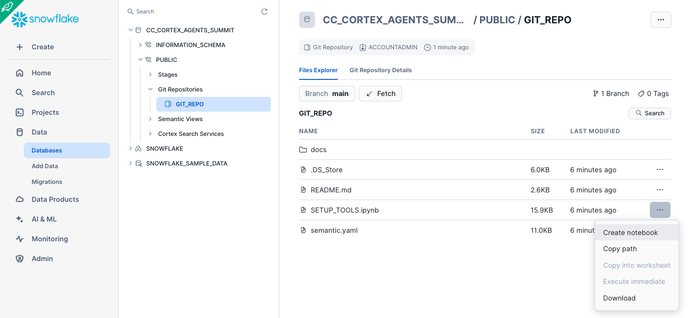

Give a name to the notebook and run it in a Container using CPUs.

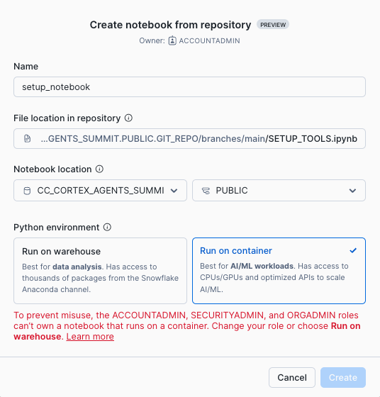

You can run the entire Notebook and check each one of the cells. This is the explanation for Unstructured Data section.

Thank you to the GIT integration done in the previous step, the PDF files that we are going to be used have been already copied into your Snowflake account. We are using two sets of documents, one for bike and other for ski. For this demo, we are creating two different tools to manage each type of document. 

Check the content of the directory with bikes documents. Note this is an internal staging area but it could also be an external S3 location, so there is no need to really copy the PDFs into Snowflake. 

```SQL
SELECT * FROM DIRECTORY('@DOCS_BIKES');
```

To parse the documents, we are going to use the native Cortex [PARSE_DOCUMENT](https://docs.snowflake.com/en/sql-reference/functions/parse_document-snowflake-cortex). For LAYOUT we can specify OCR or LAYOUT. We will be using LAYOUT so the content is markdown formatted.

```SQL

CREATE OR REPLACE TABLE RAW_TEXT_BIKES AS
SELECT 
    RELATIVE_PATH,
    TO_VARCHAR (
        SNOWFLAKE.CORTEX.PARSE_DOCUMENT (
            '@DOCS_BIKES',
            RELATIVE_PATH,
            {'mode': 'LAYOUT'} ):content
        ) AS EXTRACTED_LAYOUT 
FROM 
    DIRECTORY('@DOCS_BIKES');

SELECT * FROM RAW_TEXT_BIKES;
```

Next we are going to split the content of the PDF file into chunks with some overlaps to make sure information and context is not lost. You can read more about token limits and text splitting in the [Cortex Search Documentation ](https://docs.snowflake.com/en/user-guide/snowflake-cortex/cortex-search/cortex-search-overview)

To split the text we also use the native Cortex [SPLIT_TEXT_RECURSIVE_CHARACTER](https://docs.snowflake.com/en/sql-reference/functions/split_text_recursive_character-snowflake-cortex). 

```SQL
-- Create chunks from extracted content

CREATE OR REPLACE TABLE CHUNKED_TEXT_BIKES AS
SELECT
   RELATIVE_PATH,
   c.INDEX::INTEGER AS CHUNK_INDEX,
   c.value::TEXT AS CHUNK_TEXT
FROM
   RAW_TEXT_BIKES,
   LATERAL FLATTEN( input => SNOWFLAKE.CORTEX.SPLIT_TEXT_RECURSIVE_CHARACTER (
      EXTRACTED_LAYOUT,
      'markdown',
      1512,
      256,
      ['\n\n', '\n', ' ', '']
   )) c;

SELECT * FROM CHUNKED_TEXT_BIKES;
```

Now that we have processed the PDF couments, we can create a [Cortex Search Service](https://docs.snowflake.com/en/user-guide/snowflake-cortex/cortex-search/cortex-search-overview) that automatically will created embeddings and indexes over the chunks of text extracted. Read the docs for the different embeddings models available.

When creating the service, we also specify what is the TARGET_LAG. That is the frequency used by the service to maintain the service with new or deleted data. Check the [Automatic Processing of New Documents](https://quickstarts.snowflake.com/guide/ask_questions_to_your_own_documents_with_snowflake_cortex_search/index.html?index=..%2F..index#6) of that quickstart to understand how easy is to maintain your RAG updated when using Cortex Search.

```SQL
CREATE OR REPLACE CORTEX SEARCH SERVICE BIKES_RAG_TOOL
  ON CHUNK_TEXT
  ATTRIBUTES RELATIVE_PATH, CHUNK_INDEX
  WAREHOUSE = COMPUTE_WH
  TARGET_LAG = '1 hour'
  EMBEDDING_MODEL = 'snowflake-arctic-embed-l-v2.0'
AS (
  SELECT
      CHUNK_TEXT,
      RELATIVE_PATH,
      CHUNK_INDEX
  FROM CHUNKED_TEXT_BIKES
);
```

Now follow same steps to create another Cortex Search Service for the Ski documentation:

```SQL
SELECT * FROM DIRECTORY('@DOCS_SKI');

CREATE OR REPLACE TABLE RAW_TEXT_SKI AS
SELECT 
    RELATIVE_PATH,
    TO_VARCHAR (
        SNOWFLAKE.CORTEX.PARSE_DOCUMENT (
            '@DOCS_SKI',
            RELATIVE_PATH,
            {'mode': 'LAYOUT'} ):content
        ) AS EXTRACTED_LAYOUT 
FROM 
    DIRECTORY('@DOCS_SKI');

SELECT * FROM RAW_TEXT_SKI;

CREATE OR REPLACE TABLE CHUNKED_TEXT_SKI AS
SELECT
   RELATIVE_PATH,
   c.INDEX::INTEGER AS CHUNK_INDEX,
   c.value::TEXT AS CHUNK_TEXT
FROM
   RAW_TEXT_SKI,
   LATERAL FLATTEN( input => SNOWFLAKE.CORTEX.SPLIT_TEXT_RECURSIVE_CHARACTER (
      EXTRACTED_LAYOUT,
      'markdown',
      1512,
      256,
      ['\n\n', '\n', ' ', '']
   )) c;

SELECT * FROM CHUNKED_TEXT_SKI;

CREATE OR REPLACE CORTEX SEARCH SERVICE SKI_RAG_TOOL
  ON CHUNK_TEXT
  ATTRIBUTES RELATIVE_PATH, CHUNK_INDEX
  WAREHOUSE = COMPUTE_WH
  TARGET_LAG = '1 hour'
  EMBEDDING_MODEL = 'snowflake-arctic-embed-l-v2.0'
AS (
  SELECT
      CHUNK_TEXT,
      RELATIVE_PATH,
      CHUNK_INDEX
  FROM CHUNKED_TEXT_SKI
);
```

If you have run these steps via the Notebook (recommended so you avoid copy/paste) you have a cell to the the tool API.

Afte this step, we have now two tools ready to retrieve context from PDF files.

## Setup Structured Data
Another Tool that we will be providing to the Cortex Agent will be Cortex Analyst which will provide the capability to extract information from Snowflake Tables. In the API call we will be providing the location of a Semantic file that contains information about the business terminology to describe the data.

First we are going to create some syntethic data about the bikes and ski products that we have.

We are going to create the following tables with content:

**DIM_ARTICLE – Article/Item Dimension**

Purpose: Stores descriptive information about the products (articles) being sold.

Key Columns:

    ARTICLE_ID (Primary Key): Unique identifier for each article.
    ARTICLE_NAME: Full name/description of the product.
    ARTICLE_CATEGORY: Product category (e.g., Bike, Skis, Ski Boots).
    ARTICLE_BRAND: Manufacturer or brand (e.g., Mondracer, Carver).
    ARTICLE_COLOR: Dominant color for the article.
    ARTICLE_PRICE: Standard unit price of the article.
    DIM_CUSTOMER – Customer Dimension

**DIM_CUSTOMER – Customer Dimension**

Purpose: Contains demographic and segmentation info about each customer.

Key Columns:

    CUSTOMER_ID (Primary Key): Unique identifier for each customer.
    CUSTOMER_NAME: Display name for the customer.
    CUSTOMER_REGION: Geographic region (e.g., North, South).
    CUSTOMER_AGE: Age of the customer.
    CUSTOMER_GENDER: Gender (Male/Female).
    CUSTOMER_SEGMENT: Marketing segment (e.g., Premium, Regular, Occasional).
    FACT_SALES – Sales Transactions Fact Table

**FACT_SALES – Sales Transactions Fact Table**

Purpose: Captures individual sales transactions (facts) with references to article and customer details.

Key Columns:

    SALE_ID (Primary Key): Unique identifier for the transaction.
    ARTICLE_ID (Foreign Key): Links to DIM_ARTICLE.
    CUSTOMER_ID (Foreign Key): Links to DIM_CUSTOMER.
    DATE_SALES: Date when the sale occurred.
    QUANTITY_SOLD: Number of units sold in the transaction.
    TOTAL_PRICE: Total transaction value (unit price × quantity).
    SALES_CHANNEL: Sales channel used (e.g., Online, In-Store, Partner).
    PROMOTION_APPLIED: Boolean indicating if the sale involved a promotion or discount.

You can continue executing the Notebook cells to create some syntetic data. 

First some data for articles:

```SQL
CREATE OR REPLACE TABLE DIM_ARTICLE (
    ARTICLE_ID INT PRIMARY KEY,
    ARTICLE_NAME STRING,
    ARTICLE_CATEGORY STRING,
    ARTICLE_BRAND STRING,
    ARTICLE_COLOR STRING,
    ARTICLE_PRICE FLOAT
);

INSERT INTO DIM_ARTICLE (ARTICLE_ID, ARTICLE_NAME, ARTICLE_CATEGORY, ARTICLE_BRAND, ARTICLE_COLOR, ARTICLE_PRICE)
VALUES 
(1, 'Mondracer Infant Bike', 'Bike', 'Mondracer', 'Red', 3000),
(2, 'Premium Bicycle', 'Bike', 'Veloci', 'Blue', 9000),
(3, 'Ski Boots TDBootz Special', 'Ski Boots', 'TDBootz', 'Black', 600),
(4, 'The Ultimate Downhill Bike', 'Bike', 'Graviton', 'Green', 10000),
(5, 'The Xtreme Road Bike 105 SL', 'Bike', 'Xtreme', 'White', 8500),
(6, 'Carver Skis', 'Skis', 'Carver', 'Orange', 790),
(7, 'Outpiste Skis', 'Skis', 'Outpiste', 'Yellow', 900),
(8, 'Racing Fast Skis', 'Skis', 'RacerX', 'Blue', 950);
```

Data for Customers:

```SQL
CREATE OR REPLACE TABLE DIM_CUSTOMER (
    CUSTOMER_ID INT PRIMARY KEY,
    CUSTOMER_NAME STRING,
    CUSTOMER_REGION STRING,
    CUSTOMER_AGE INT,
    CUSTOMER_GENDER STRING,
    CUSTOMER_SEGMENT STRING
);

INSERT INTO DIM_CUSTOMER (CUSTOMER_ID, CUSTOMER_NAME, CUSTOMER_REGION, CUSTOMER_AGE, CUSTOMER_GENDER, CUSTOMER_SEGMENT)
SELECT 
    SEQ4() AS CUSTOMER_ID,
    'Customer ' || SEQ4() AS CUSTOMER_NAME,
    CASE MOD(SEQ4(), 5)
        WHEN 0 THEN 'North'
        WHEN 1 THEN 'South'
        WHEN 2 THEN 'East'
        WHEN 3 THEN 'West'
        ELSE 'Central'
    END AS CUSTOMER_REGION,
    UNIFORM(18, 65, RANDOM()) AS CUSTOMER_AGE,
    CASE MOD(SEQ4(), 2)
        WHEN 0 THEN 'Male'
        ELSE 'Female'
    END AS CUSTOMER_GENDER,
    CASE MOD(SEQ4(), 3)
        WHEN 0 THEN 'Premium'
        WHEN 1 THEN 'Regular'
        ELSE 'Occasional'
    END AS CUSTOMER_SEGMENT
FROM TABLE(GENERATOR(ROWCOUNT => 5000));
```

And Sales data:

```SQL
CREATE OR REPLACE TABLE FACT_SALES (
    SALE_ID INT PRIMARY KEY,
    ARTICLE_ID INT,
    DATE_SALES DATE,
    CUSTOMER_ID INT,
    QUANTITY_SOLD INT,
    TOTAL_PRICE FLOAT,
    SALES_CHANNEL STRING,
    PROMOTION_APPLIED BOOLEAN,
    FOREIGN KEY (ARTICLE_ID) REFERENCES DIM_ARTICLE(ARTICLE_ID),
    FOREIGN KEY (CUSTOMER_ID) REFERENCES DIM_CUSTOMER(CUSTOMER_ID)
);

-- Populating Sales Fact Table with new attributes
INSERT INTO FACT_SALES (SALE_ID, ARTICLE_ID, DATE_SALES, CUSTOMER_ID, QUANTITY_SOLD, TOTAL_PRICE, SALES_CHANNEL, PROMOTION_APPLIED)
SELECT 
    SEQ4() AS SALE_ID,
    A.ARTICLE_ID,
    DATEADD(DAY, UNIFORM(-1095, 0, RANDOM()), CURRENT_DATE) AS DATE_SALES,
    UNIFORM(1, 5000, RANDOM()) AS CUSTOMER_ID,
    UNIFORM(1, 10, RANDOM()) AS QUANTITY_SOLD,
    UNIFORM(1, 10, RANDOM()) * A.ARTICLE_PRICE AS TOTAL_PRICE,
    CASE MOD(SEQ4(), 3)
        WHEN 0 THEN 'Online'
        WHEN 1 THEN 'In-Store'
        ELSE 'Partner'
    END AS SALES_CHANNEL,
    CASE MOD(SEQ4(), 4)
        WHEN 0 THEN TRUE
        ELSE FALSE
    END AS PROMOTION_APPLIED
FROM DIM_ARTICLE A
JOIN TABLE(GENERATOR(ROWCOUNT => 10000)) ON TRUE
ORDER BY DATE_SALES;
```

In the next section you are going to explore the Semantic File. We have prepared two files already that you can copy from the GIT repository:

```SQL
create or replace stage semantic_files ENCRYPTION = (TYPE = 'SNOWFLAKE_SSE') DIRECTORY = ( ENABLE = true );

COPY FILES
    INTO @semantic_files/
    FROM @CC_CORTEX_AGENTS_SUMMIT.PUBLIC.git_repo/branches/main/
    FILES = ('semantic.yaml', 'semantic_search.yaml');
```

<!-- ------------------------ -->
## Explore/Create the Semantic Model 

The [semantic model](https://docs.snowflake.com/en/user-guide/snowflake-cortex/cortex-analyst/semantic-model-spec) map business terminology to database schema and add contextual meaning. It allows [Cortex Analyst](https://docs.snowflake.com/en/user-guide/snowflake-cortex/cortex-analyst) to come up with the right SQL given a question using natural language.

We have provided a couple of semantic models already generated for you to explore. 

### Open the existing semantic model

Under AI & ML -> Studio, select "Cortex Analyst"

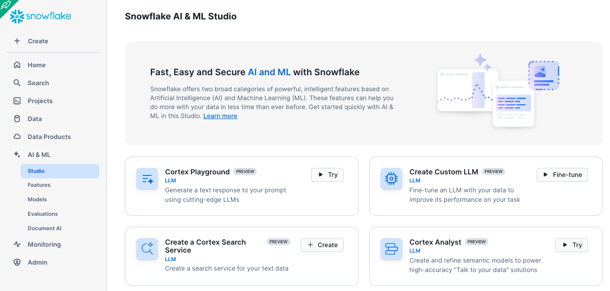

Select the existing semantic.yaml file

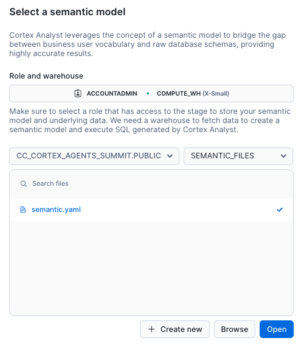

### Test the semantic model

You can try some analytical questions to test your semantic file:

- What is the average revenue per transaction per sales channel?
- What products are often bought by the same customers?

<!-- ------------------------ -->
## Cortex Analyst and Cortex Search Integration

We are going to explore the integration between Cortex Analyst and Cortex Search to provide better results. If we take a look to the semantic model, click on DIM_ARTICLE -> Dimensions and edit ARTICLE_NAME:

In the Dimention you will see that some Sample values have been provided:

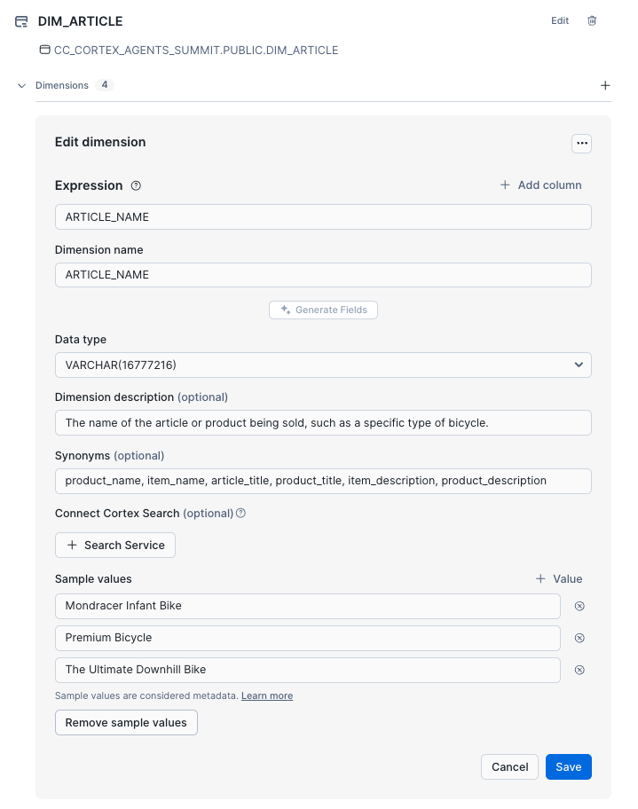

Let's see what happens if we ask for the following question:

- What is the total sales for the carvers?

You may have an answer like this:

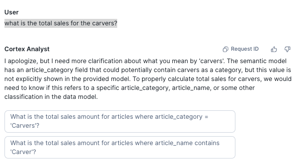

Let's see what happens when we integrate the ARTICLE_NAME dimmension with the Cortex Search Service we created in the Notebook (_ARTICLE_NAME_SEARCH). If you have not run it already in the Notebook, this is the code to be executed:

```SQL
CREATE OR REPLACE CORTEX SEARCH SERVICE _ARTICLE_NAME_SEARCH
  ON ARTICLE_NAME
  WAREHOUSE = COMPUTE_WH
  TARGET_LAG = '1 hour'
  EMBEDDING_MODEL = 'snowflake-arctic-embed-l-v2.0'
AS (
  SELECT
      DISTINCT ARTICLE_NAME
  FROM DIM_ARTICLE
);
```
In the UI:

- Remove the sample values provided
- Click on + Search Service and add _ARTICLE_NAME_SEARCH

It will look like this:

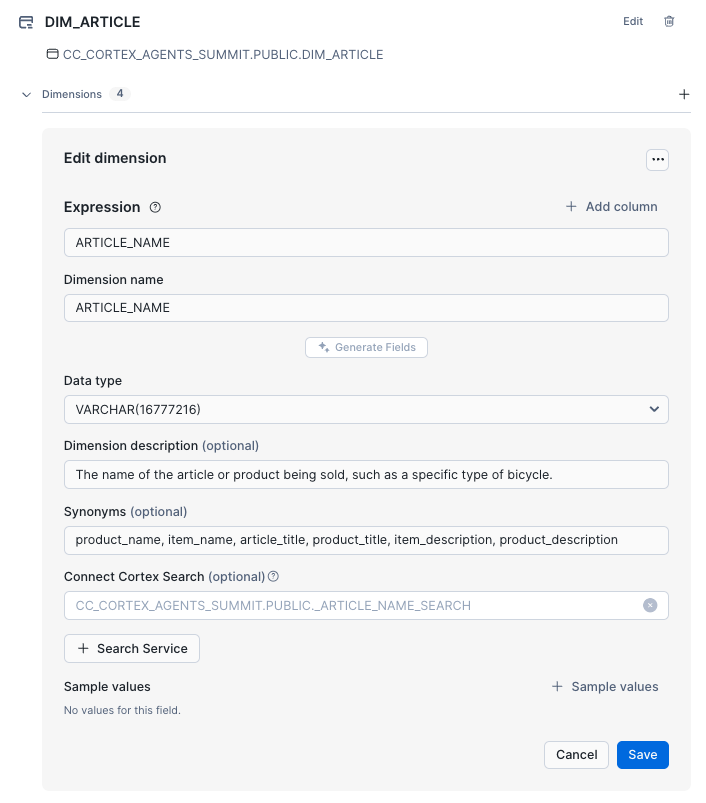

Click on save, also save your semantic file (top right) and ask the same question again:

- What is the total sales for the carvers?

Notice that now Cortex Analyst is able to provide the right answer even because Cortex Search integration, we asked for "Carvers" but find that the right article to ask for is "Carver Skis":

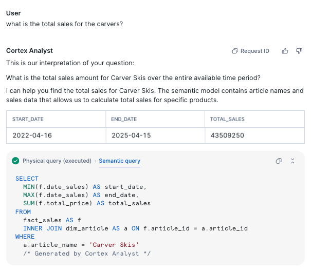

Now we have the tools ready to create our first App that leverages Cortex Agents API.

<!-- ------------------------ -->
## Deploy the Cortex Agent

Create one Streamlit App that uses the [Cortex Agents](https://docs.snowflake.com/en/user-guide/snowflake-cortex/cortex-agents) API.

We are going to leverate this initial code:

[streamlit_app.py](https://github.com/ccarrero-sf/cortex_agents_summit/blob/main/streamlit_app.py)

Click on Projects -> Streamlit -> Streamlit App and "Create from repository":

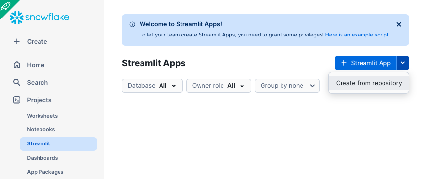

Select the streamlit_app.py file:

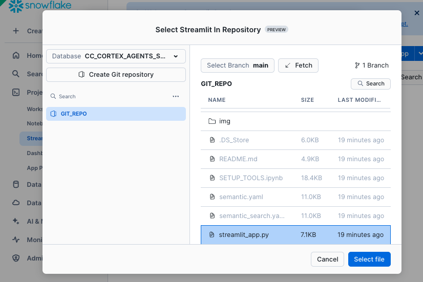

And click on Create.

### Explore the App

Open the Streamlit App and try some of these questions:

#### Unstructured data questions

These are questions where the answer would be in the PDF documents. Examples:

- What is the guarantee of the premium bike?
- What is the length of the carver skies?
- What are the tires used by the road bike?

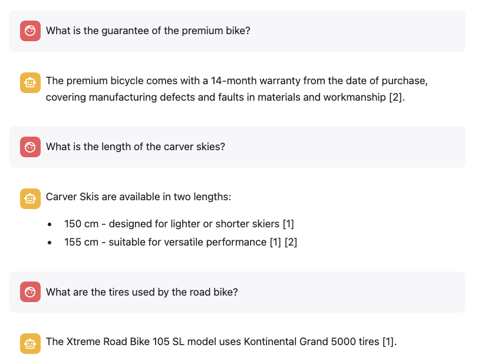

Fell free to explore the PDF docs and ask your own questions

#### Unstructured data questions

These are analytical questions where answer would be in Snowflake Tables. Examples:

- How much are we selling for the carvers per year for the North region?

Notice that for this query, the 3 tables are used. Also Cortex Search integration in the semantic model understand that the article name is "Carver Skis":

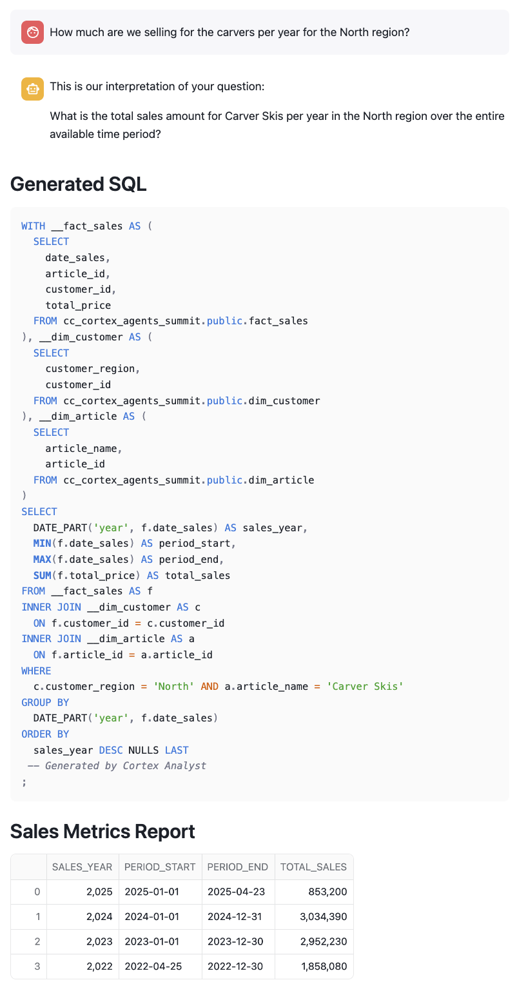

- How much infant bike are we selling per month?
- What are the top 5 customers buying the carvers?

Observe the behavior of the following questions:

- What is the monthly sales via online for the racing fast in central?

Cortex Agents API send the request to Cortex Analyst, but it is not able to filter by customer_region:

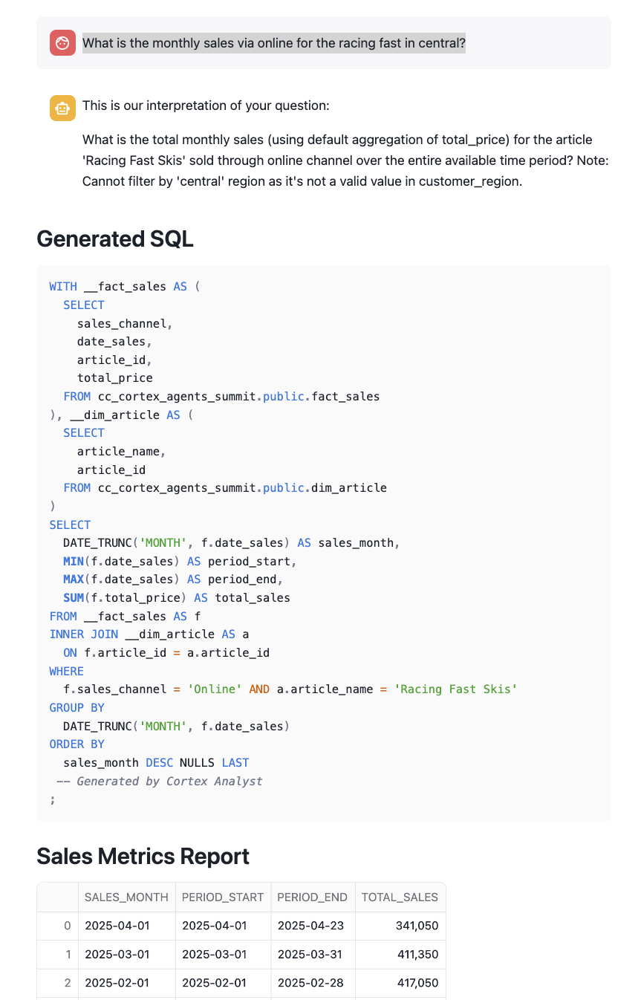

If we take a look to the [semantic file](https://github.com/ccarrero-sf/cortex_agents_summit/blob/main/semantic_search.yaml) we can see that 'central' is not included as a sample value:

```code
      - name: CUSTOMER_REGION
        expr: CUSTOMER_REGION
        data_type: VARCHAR(16777216)
        sample_values:
          - North
          - South
          - East
        description: Geographic region where the customer is located.
```

This would be a good opportunity to fine tune the semantic model. Either adding all possible values if they are not a lot or use Cortex Search as we have done before for the ARTICLE column.


### Understand Cortex Agents API

When calling the [Cortex Agents](https://docs.snowflake.com/en/user-guide/snowflake-cortex/cortex-agents) API, we define the tools the Agent can use in that call. You can read the simple [Streamlit App](https://github.com/ccarrero-sf/cortex_agents_summit/blob/main/streamlit_app.py) you setup to understand the basics before trying to create something more ellaborated.

We define the API_ENDPOINT for the Agent, and how to access the different tools we are going to use. In this lab we have two Cortex Search Services to retrieve information from PDFs about bikes and ski, and one Cortex Analyst Service to retrieve analytical information from Snowflake tables.

The Cortex Search Services point to the Services that we created in the Notebook. The Cortex Analyst uses the semantic model we have verified before.

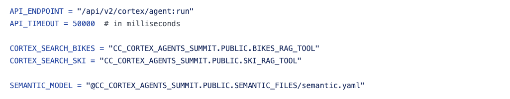

Those services are added into the payload we send to the Cortex Agents API. We define the model we want to use to build the final response, the tools to be used and any specific instruction to build the response:

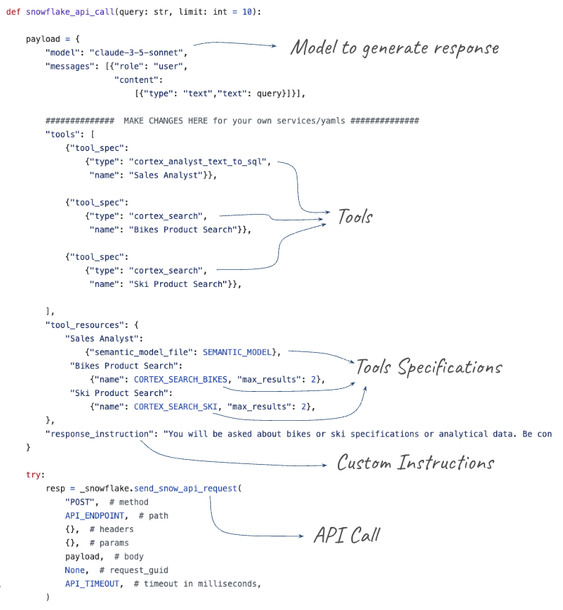

<!-- ------------------------ -->
## Optional: Integrate Cortex Agents API with Slack

[This guide: Getting Started with Cortex Agents and Slack](https://quickstarts.snowflake.com/guide/integrate_snowflake_cortex_agents_with_slack/index.html?index=..%2F..index#0) provides instructions to integrate Cortex Agents with Slack. We are going to debrief it here step by step for the Tools you have created in this hands-on lab.

Follow the instructions from [this repository](https://github.com/ccarrero-sf/cortex_agents_summit_slack)

<!-- ------------------------ -->
## Optional - Setup Cortex Agents Quick Demo Env

[Cortex Agents in Snowflake](https://github.com/michaelgorkow/snowflake_cortex_agents_demo/) is an excellent Git repository developed by **Michael Gorkow** that using GIT integration provides an automatic setup to develop several use cases. It will automatically create a Streamlit App where you can select what tools you want to use.

It also include several use cases for you to try. After running this HOL where you should have an understanding or how to use the different tools and APIs, this is a great Demo to run.

<!-- ------------------------ -->
## Cleanup

Once you finish the lab, to avoid consuming credits you can drop the database used for this lab

```SQL
DROP DATABASE CC_CORTEX_AGENTS_SUMMIT;
```

<!-- ------------------------ -->
## Conclusion and Resources

Congratulations on building your first Data Agent that can talk to your data no matter whether it is structured or unstructured! 

### What You Learned

- How to process unstructured data within Snowflake
- Create a Cortex Search Service to be used as context retrieval tool
- Usage of Cortex Analyst as Structured Data Retrieval
- Improve Cortex Analyst results with Cortex Search integration
- Build Cortex Agent leveraing the API
- Integrate with Slack

### Resources

- [PARSE_DOCUMENT](https://docs.snowflake.com/en/sql-reference/functions/parse_document-snowflake-cortex)
- [SPLIT_TEXT_RECURSIVE_CHARACTER](https://docs.snowflake.com/en/sql-reference/functions/split_text_recursive_character-snowflake-cortex)
- [Cortex Search](https://docs.snowflake.com/en/user-guide/snowflake-cortex/cortex-search/cortex-search-overview)
- [Cortex Analyst](https://docs.snowflake.com/en/user-guide/snowflake-cortex/cortex-analyst)
- [Cortex Agents](https://docs.snowflake.com/en/user-guide/snowflake-cortex/cortex-agents)


