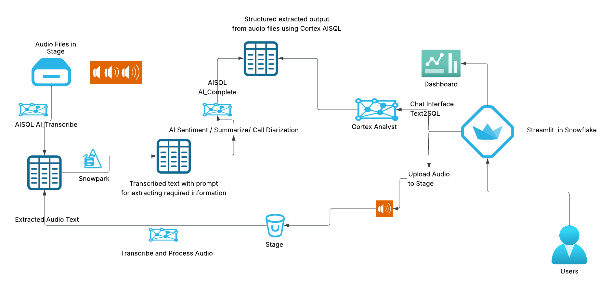
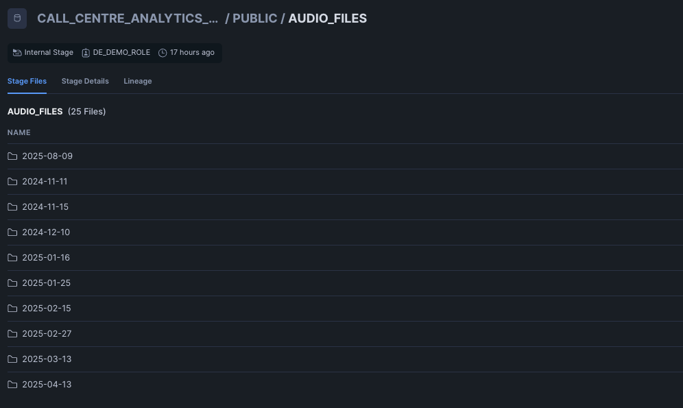
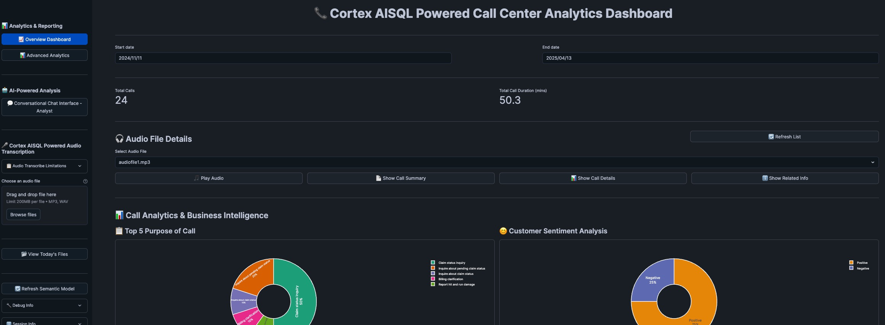
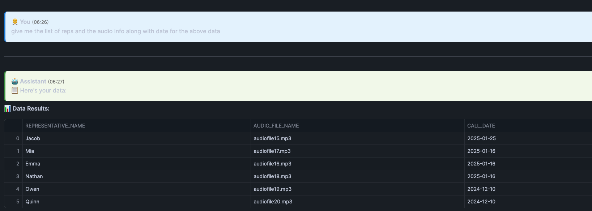
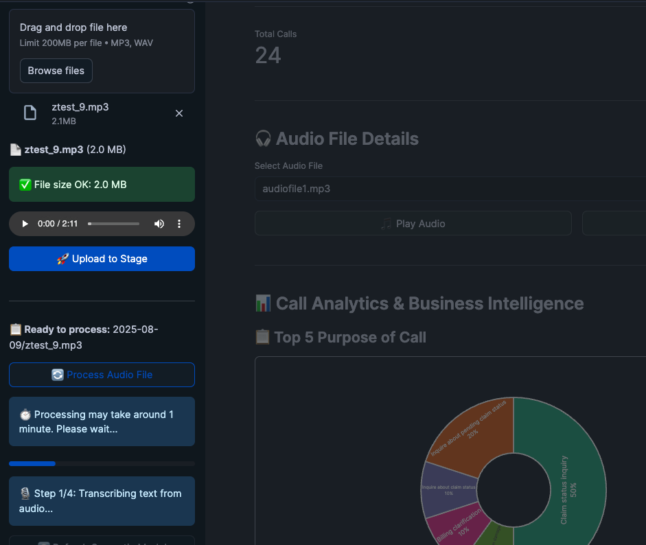

id: building-cortex-aisql-powered-call-centre-analytics
summary: Build a comprehensive call center analytics solution using Snowflake Cortex Analyst, Cortex AISQL, and interactive Streamlit dashboards for intelligent conversation insights and natural language querying.
categories: featured,getting-started,ai,cortex,cortex-aisql, AI Transcribe
environments: web
status: Published
feedback link: <https://github.com/Snowflake-Labs/sfguides/issues>
tags: Getting Started, Featured, Snowpark, Cortex AI, Cortex Analyst, Streamlit, Audio Analytics, Cortex AISQL, Audio Processing, Cortex AI Transcribe
author: Phani Raj

# Build Cortex AISQL Powered Call Center Analytics Solution
<!-- ------------------------ -->

## Overview

Duration: 3

This quickstart demonstrates how to build a comprehensive call center analytics solution leveraging Snowflake's Cortex AISQL for intelligent audio transcription (Cortex AI Transcribe), conversation analysis, and speaker identification. The solution integrates Streamlit dashboards to provide organizations with actionable insights from call center conversations through advanced AI-powered analytics, sentiment analysis, and natural language querying capabilities on audio file.

You'll learn to architect an end-to-end analytics pipeline that seamlessly processes audio files, extracts meaningful conversation insights, and delivers an intuitive conversational interface enabling business users to query call center data using natural language—all powered by Snowflake's integrated Cortex AISQL platform.

### Key Components
- **Audio Processing**: Upload and process call center audio files using Cortex AI Transcribe
- **Conversation Chat Interfact using Cortex Analyst**: Use Cortex Analyst for conversational chat on your extracted data from audio file
- **Interactive Dashboard**: Streamlit-based interface with real-time insights
- **Advanced Analytics**: Advanced analytics on call patterns, sentiment, and performance
- **Upload and Process File**: UI interface in the streamlit to upload you audio file and process all with in Snowflake using Cortex AISQL


### Architecture Overview



> Source Code - https://github.com/Snowflake-Labs/sfguide-building-cortex-aisql-powered-callcentre-analytics

### What You Will Learn

You will quickly learn how to use Cortex AI Transcribe for automated audio file processing, utilize advanced Cortex AISQL functions including AI_Complete and AI_Sentiment for intelligent data extraction from transcribed conversations, and integrate Cortex Analyst with semantic models to create sophisticated conversational chatbots. Additionally, you will develop interactive Streamlit dashboards that present critical KPIs and comprehensive analytics, empowering business stakeholders with data-driven insights.

### What You Will Build

A comprehensive call center analytics solution featuring:

* Upload the set of audio files to stage and process audio files using Cortex AI Transcribe.
* Extract insights and stats from the trascribed audio files into structured format.
* Build Conversational chatbot using Cortex Analyst by building semantic model ensuring consistent and accurate analytics
* Streamlit dashboards providing actionable conversation insights and KPIs
* Ability to upload audio file from the Streamlit App to transcribe and extract information from the uploaded audio file for adhoc analytics.


### Prerequisites

* Access to a [Snowflake account](https://signup.snowflake.com/)
* Basic understanding of Streamlit applications
* Account must have these features:

  - [AI_COMPLETE Function](https://docs.snowflake.com/sql-reference/functions/ai_complete)
  - [AI_TRANSCRIBE Function](https://docs.snowflake.com/en/sql-reference/functions/ai_transcribe)

> We are using CLAUDE-3-5-SONNET models in this solution, if this model is not available in your region please enable cortex cross region inference for your account https://docs.snowflake.com/en/user-guide/snowflake-cortex/cross-region-inference .

<!-- ------------------------ -->
## Setup

Duration: 5

### 1. Environment Setup 

To set up your Snowflake environment for the call centre analytics solution perform the following steps:

1. Open the [setup.sql](https://github.com/Snowflake-Labs/sfguide-building-cortex-aisql-powered-callcentre-analytics/blob/main/setup.sql) file from the git repo or from the cloned local folder.
1. Open a new sql worksheet in Snowsight.
1. Paste the contents of [setup.sql](https://github.com/Snowflake-Labs/sfguide-building-cortex-aisql-powered-callcentre-analytics/blob/main/setup.sql) file or upload and run the file.

The script will create:

- A new database for the solution.
- Stages for Audio Files and Semantic Model.
- Copies the audio files and semantic model yaml file from github to the stage by creating API Integration and Git repo in Snowflake.

### 2. File to Upload to Stage

 Ensure the uploaded files has the following folder structure in the stage.

 

 If you are unable to create the API integration and GIT repository in Snowflake you should upload the following files to the stages created.
 
 - All the files in <b>*[`audio_files`](https://github.com/Snowflake-Labs/sfguide-building-cortex-aisql-powered-callcentre-analytics/tree/main/audio_files)*</b> folder from your cloned repo to *AUDIO_FILES* stage that you have created above. 

 - Upload ['call_center_analytics_model.yaml'](https://github.com/Snowflake-Labs/sfguide-building-cortex-aisql-powered-callcentre-analytics/blob/main/call_center_analytics_model.yaml) to *SEMANTIC_MODEL_STAGE* stage.

Following two files are for: 
- `streamlit_cortex_analyst_dashboard_sis.py` - Main Streamlit application

- `call_center_analytics_model.yaml` - Semantic model for Cortex Analyst


## Audio Transcription and Analysis

Upload the ['Call-Centre-Analytics-Notebook.ipynb'](https://github.com/Snowflake-Labs/sfguide-building-cortex-aisql-powered-callcentre-analytics/blob/main/Call-Centre-Analytics-Notebook.ipynb) notebook from Snowsight.

Navigate to Projects → Notebooks and then click ⌄ to Import ipynb file and select the file Call-Centre-Analytics-Notebook.ipynb.
Make sure to choose the notebook location to match **call_centre_analytics_db** Database and the **public** Schema, and choose the warehouse we created earlier **cca_xs_wh** for the query warehouse and the notebook warehouse.

Run through the notebook which does following:

- Transcribe all the audio files using Cortex AI_TRANSCRIBE  .
- Add prompts for extracting various information from the transcribed text.
- Populate table(s) required for Cortex Analyst and dashboard reports.

## Streamlit Application 

After you complete running through the notebook you can create the streamlit app by navigate to Projects → Streamlit and create a new Streamlit application by selecting the below options:

1. **App Title**: CALL_CENTRE_ANALYTICS_APP
2. **Database**: Choose `CALL_CENTRE_ANALYTICS_DB`
3. **Schema**: Choose `PUBLIC`
4. **Warehouse**: Choose `cca_xs_wh` warehouse

Paste the contents of [streamlit_cortex_analyst_dashboard_sis.py](https://github.com/Snowflake-Labs/sfguide-building-cortex-aisql-powered-callcentre-analytics/blob/main/streamlit_cortex_analyst_dashboard_sis.py) and run the streamlit app. 

While running the app for the first time it will give you package not found error for plotly, please add ploytly in the call_centre_analytics_app streamlit app packages and rerun the app  .



<!-- ------------------------ -->

### Streamlit App offer following Application Components

Duration: 10

#### 1. Dashboard Analytics

The solution provides multiple analytical views:

**Overview Dashboard**
- Key performance indicators (KPIs)
- Call volume trends
- Agent performance metrics
- Customer satisfaction scores

**Advanced Analytics**
- Sentiment analysis across conversations
- Call duration patterns
- Trend Analysis for the call volume (Mom, YoY)


### 2. Cortex Analyst Integration

The heart of the application leverages Snowflake's Cortex Analyst for natural language querying on the audio files. We can have a conversation chatbot where it sends the history for asking question based on previous question.

**Chat Interface Implementation**
```python
def query_cortex_analyst_rest_api(question: str, conversation_history: List[Dict] = None) -> Dict[Any, Any]:
    """Query Cortex Analyst with conversation context"""
    
    request_body = {
        "question": question,
        "semantic_model": semantic_model_content,
        "conversation": conversation_history or []
    }
    
    response = session.post(CORTEX_ANALYST_ENDPOINT, json=request_body)
    return response.json()
```
Question asked `How mant calls were not resolved on the first attempt` and below is the response:


Now I am asking a followup question:
`give me the list of reps and the audio info along with date for the above data` and below is the output


You can see from the screenshot that it is giving us the details for the rep name and the audio file for all the conversation which is not a first call resolution. Following is the query generated by the Cortex Analyst where it filters for first_call_resolution = 'No' showing how powerful cortex analyst is.

```sql
WITH __call_center_interactions AS (
  SELECT
    audio_file_name,
    representative AS representative_name,
    firstcallresolution AS first_call_resolution,
    datetime AS call_date
  FROM call_centre_analytics_db.public.streamlitapptable
)
SELECT
  representative_name,
  audio_file_name,
  call_date
FROM __call_center_interactions
WHERE
  first_call_resolution = 'No'
ORDER BY
  call_date DESC NULLS LAST
 -- Generated by Cortex Analyst
;
```
**Features:**
- Persistent conversation history
- Context-aware responses
- Export conversation logs

#### 3. On-Demand Audio File Transcribing and Processing

The application provides comprehensive audio file handling capabilities. You can upload the file from your local machine and ask the app to process the audio file.

**Key Features:**

1. **Upload Audio Files**: Drag and drop or browse for audio files
2. **Processing Status**: Monitor upload progress and processing status  
3. **File Management**: View uploaded files and their processing status
4. **Playback**: Listen to processed audio files directly in the interface



You can use the file [ztest_9.mp3](https://github.com/Snowflake-Labs/sfguide-building-cortex-aisql-powered-callcentre-analytics/blob/main/ztest_9.mp3) to test the uploading and processing adhoc audio file from the streamlit app.

<!-- ------------------------ -->
## Conclusion And Resources

This quickstart demonstrates how to build a comprehensive call center analytics solution which is powered by Cortex AISQL. By combining Cortex Analyst's natural language capabilities with Streamlit's interactive interface, you've created a powerful tool for extracting insights from call center audio data.


### What You Learned

You've built a complete call center analytics solution featuring:

- **Intelligent Audio Processing** with automated transcription and analysis using Cortex AI Transcribe and Cortex AISQL functions.
- **Natural Language Conversational Analytics** using Cortex Analyst for business user accessibility  
- **Interactive Dashboards** with deep insights and visualizations


### Related Resources

- [Source Code on GitHub](https://github.com/Snowflake-Labs/sfguide-building-cortex-aisql-powered-callcentre-analytics)
- [AI_COMPLETE Function Reference](https://docs.snowflake.com/en/sql-reference/functions/ai_complete)
- [Cortex AISQL](https://docs.snowflake.com/user-guide/snowflake-cortex/aisql?lang=de%2F)
- [Snowflake Cortex Analyst Documentation](https://docs.snowflake.com/en/user-guide/snowflake-cortex/cortex-analyst)
- [Streamlit in Snowflake Documentation](https://docs.snowflake.com/en/developer-guide/streamlit/about-streamlit)
- [Snowpark Python Developer Guide](https://docs.snowflake.com/en/developer-guide/snowpark/python/index.html)
