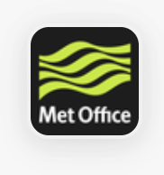
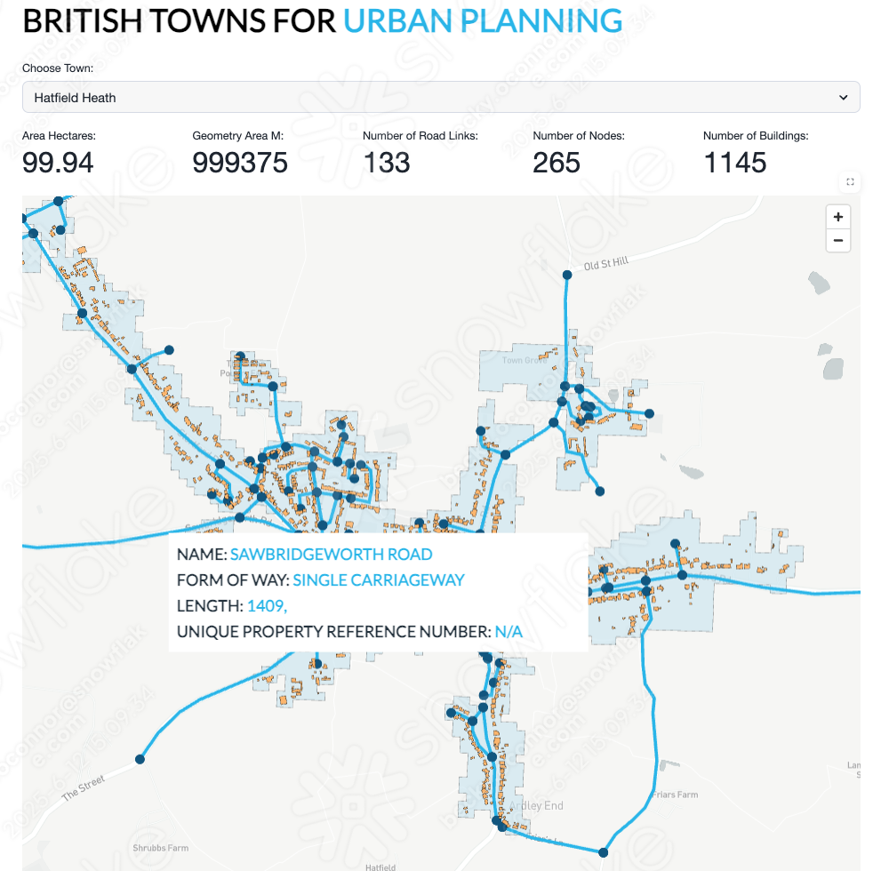
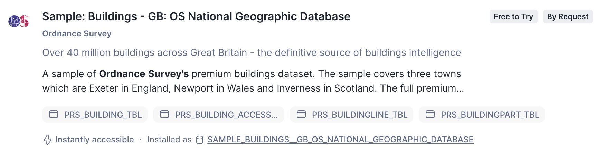
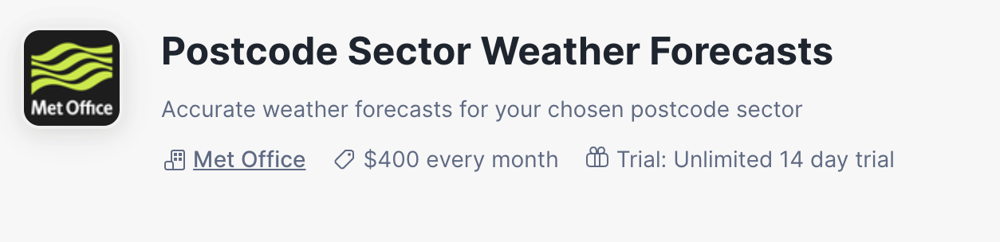
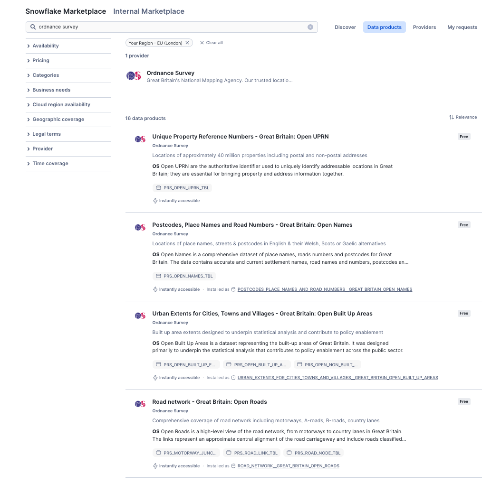
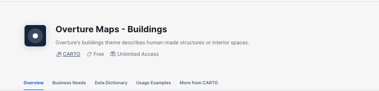
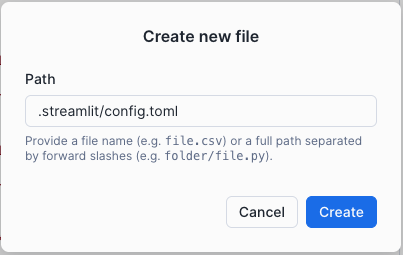
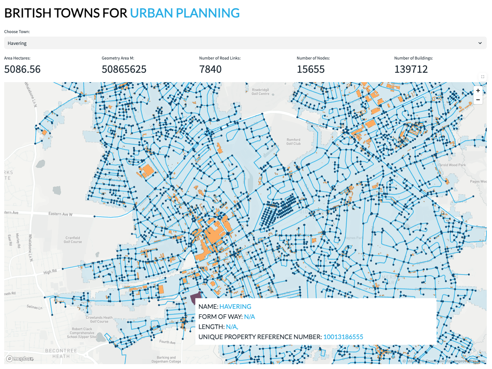
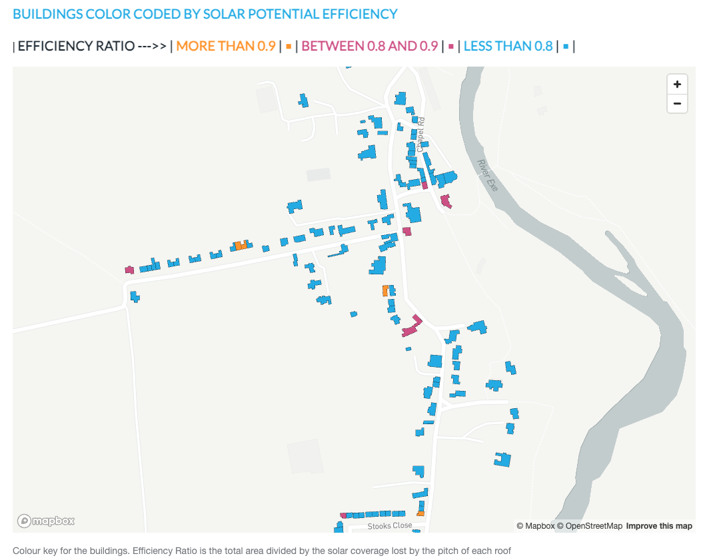
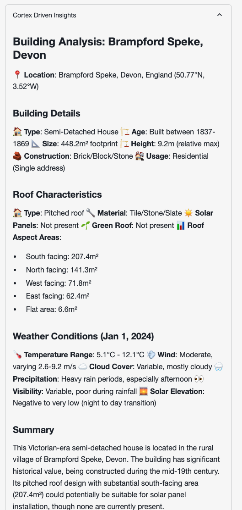

author: Becky O’Connor
id: building-geospatial-mult-layer-apps-with-snowflake-and-streamlit
categories: snowflake-site:taxonomy/solution-center/certification/quickstart, snowflake-site:taxonomy/product/analytics, snowflake-site:taxonomy/snowflake-feature/applied-analytics
language: en
summary: Build multi-layer geospatial applications with Snowflake and Streamlit for location analytics and interactive mapping.
environments: web
status: Published 
feedback link: https://github.com/Snowflake-Labs/sfguides/issues


# Building Geospatial Multi-Layer Apps with Snowflake and Streamlit
<!-- ------------------------ -->
## Overview


Welcome to the **Building Geospatial Multi-Lay Apps with Snowflake and Streamlit quickstart**.  Today you will learn how to analyse and transform [geospatial](https://www.ordnancesurvey.co.uk/blog/what-is-spatial-data) data in Snowflake.  You will be using **Ordnance Survey** open datasets available on the marketplace as well as the worldwide open overture buildings dataset provided by **CARTO**.


&nbsp;&nbsp;&nbsp;&nbsp;&nbsp;&nbsp;&nbsp;&nbsp;&nbsp;&nbsp;&nbsp;&nbsp;&nbsp;&nbsp;

This is a progressive learning experience from viewing points on a mapk right through to building a multi layer app - which pulls together buildings with unique property reference numbers, the road network and urban extents.

You will be covering:

- Geospatial datatypes and formats
- Points, Linestrings and Polygons
- H3
- Spatial Joins and Calculations
- Visualising the results using **Pydeck**
- Search Optimisation
- Building a multi-layer app - which pulls together everything you have learned.

- Using what you have learnt to create a **solar power what if scenario calculator**.  This combines Roofing data and solar elevation data supplied by the **Met Office**

Thoughout the experience, you will demonstrate the concepts with **Snowflake Notebooks** and Streamlit.



### Structure of the session

The Lab consists of three notebooks and two Streamlit applications.

- Completion of the (**ANALYSE_LOCATION_DATA**) notebook. 

    This is an end-to-end tour on how location data works with Snowflake

- Creating a Streamlit app **ROAD_NETWORK**

    This is an example Streamlit application which brings together the different techniques learnt in notebook 1. 


### What You Will Learn

- An understanding of geospatial data types and formats - and how this works in **Snowflake**

- An understanding of Snowflakes built in **H3** capabilities

- Spatial Joins

- Geospatial Calculations

- Geospatial Filtering

- Using Search Optimisation to speed up geospatial queries

- Visualing points, linestrings and polygons on a multi layered map using **Pydeck** - all within a Streamlt application

### What You’ll Build 
- A streamlit application to visualise the UK road network together with buildings - which uses Ordnance survey road network data and the Carto Overture maps buildings dataset.


### Prerequisites
- A Snowflake Account. Sign up [here](https://signup.snowflake.com/?utm_source=snowflake-devrel&utm_medium=developer-guides&utm_cta=developer-guides) for a free 30 day trial.

 


<!-- ------------------------ -->
## Initial Setup

Open up a new SQL worksheet and run the following commands. To open up a new SQL worksheet, select Projects » Worksheets, then click the blue plus button and select SQL worksheet.

```sql

CREATE DATABASE IF NOT EXISTS ANALYSE_LOCATION_DATA;

CREATE WAREHOUSE IF NOT EXISTS LOCATION_ANALYTICS;

CREATE SCHEMA IF NOT EXISTS NOTEBOOK;
CREATE SCHEMA IF NOT EXISTS STREAMLIT;
CREATE SCHEMA IF NOT EXISTS DEFAULT_SCHEMA;
ALTER ACCOUNT SET CORTEX_ENABLED_CROSS_REGION = 'ANY_REGION';

CREATE OR REPLACE WAREHOUSE XX_LARGE_HEAVY_LIFT
WITH 
  WAREHOUSE_SIZE = '2X-LARGE'
  AUTO_SUSPEND = 60
  AUTO_RESUME = TRUE
  INITIALLY_SUSPENDED = TRUE;


```


<!-- ------------------------ -->
## Snowflake Marketplace

- From the home page Navigate to **Data Products >> Marketplace**

### Ordnance Survey Datasets
- In the search box provided, search for the following datasets:

    -   Ordnance Survey - Urban Extents for Cities, Towns and Vilages
    -   Ordnance Survey - Postcodes, Place Names and Road Names
    -   Ordnance Survey - Road Network Great Britain - Open Roads
    -   Ordnance Survey - Unique Property Reference Numbers - Great Britain: Open UPRN
    -   Ordnance Survey - GB: GB: OS National Geographic Database

    
  
  ### Met Office Dataset
  - Search for Met office and install the following dataset:

  - Postcode Sector Weather Forecasts

  


   

- For each dataset found, press **Get** to get the data.  



- Follow the on screen prompts to install each dataset.

### Carto Datasets - Obtain the following datasets from the marketplace

This dataset provides sample building polygons all over the world.

 -   Carto - Overture Maps Buildings

 

<!-- ------------------------ -->
## Notebook Walkthrough

Are you ready to start learning about location data in Snowflake?

This tutorial will take you through how you can use location data to perform spatial calculations, joins, and visualise the data using the popular **Pydeck** python package.  We will be using the freely available datasets which you have now installed to step through examples of how geospatial data can be handled.


- Click [here](https://github.com/Snowflake-Labs/sfguide-building-geospatial-multilayer-app-with-snowflake-streamlit/blob/ed83911899d64a123ebf0180e7e9dae407b18c06/Notebook/Analyse_Location_Data.ipynb) to download notebook

- From the home page, navigate to **Projects > Notebooks**

- Import the notebook as a new **Snowflake Notebook**


- Choose **LOCATION_ANALYTICS** as the database and **Notebooks** as the schema

- Choose **LOCATION_ANALYTICS** as the query warehouse

- Name the notebook **ANALYSE_LOCATION_DATA**

- Before you start the notebook, click on **packages** and import the **Pydeck** package

- Press **Start** to initialise the notebook and follow the instructions within the notebook.

<!-- ------------------------ -->
## The Streamlit Road Network Example

This app gives you an example of how you can bring all these datasets together to form a multi layered mapping visual.

- Navigate to **Projects > Streamlit**

- Create a new streamlit application and call the application **URBAN_PLANNING** inside the **LOCATION_ANALYTICS** database and the **STREAMLITS** schema

- Delete all sample code and import the **pydeck** package by clicking on **packages** on the top left hand corner of the screen.

- copy and paste the following code into the **Streamlit** canvas from [here](https://https://github.com/Snowflake-Labs/sfguide-building-geospatial-multilayer-app-with-snowflake-streamlit/blob/98d6e11b7bd81ae5e96bd784d1d7622371322e85/Streamlit/analyse_location_data/towns_with_roads.pygithub.com/Snowflake-Labs/sfguide-getting-started-with-analysing-geospatial-location-data/blob/main/Streamlit/towns_with_roads.py)

You will add a selection of supporting files for the app.  In this example, you will import a logo, a style sheet and create a config.toml file.  All of which provide additional styling to the app.

Download and the following [Style Sheet](https://github.com/Snowflake-Labs/sfguide-building-geospatial-multilayer-app-with-snowflake-streamlit/blob/98d6e11b7bd81ae5e96bd784d1d7622371322e85/Streamlit/analyse_location_data/extra.css) and add to the app directory.  The app directory is located in the side pane under the **Files** tab.

To add a file, you will need to click on the **+** and select **upload from local**.

Browse to the downloaded file and **upload**.

Download the following [Logo](https://github.com/Snowflake-Labs/sfguide-building-geospatial-multilayer-app-with-snowflake-streamlit/blob/98d6e11b7bd81ae5e96bd784d1d7622371322e85/Streamlit/analyse_location_data/snowflake_logo_color_rgb.svg) and add to the app directory in the same way as previously.

- Click on the **+** and select Create new file and call it **.streamlit/config.toml** 

  

- Navigate to view the content of the newly created empty file, and copy and paste the content from the following file - [config.toml](https://github.com/Snowflake-Labs/sfguide-building-geospatial-multilayer-app-with-snowflake-streamlit/blob/98d6e11b7bd81ae5e96bd784d1d7622371322e85/Streamlit/analyse_location_data/config.toml)




<!-- ------------------------ -->

## Slopey Roofs - Solar Powering our Buildings


The following notebook will leverage building data from the UK Nationall Geographic database.  You will combine this with historic solar elevation data in order to determine what solar power could be generated from these buildings.

- Click [here](https://github.com/Snowflake-Labs/sfguide-building-geospatial-multilayer-app-with-snowflake-streamlit/blob/1e34125503e6212d004d564a95eb181afff079f8/Notebook/SLOPEY_ROOFS.ipynb) to download notebook

- From the home page, navigate to **Projects > Notebooks**

- Import the notebook as a new **Snowflake Notebook**

- Select **ANALYSE_LOCATION_DATA** as the database and **STREAMLIT** as the schema.

- Select **LOCATION_ANALYTICS** as the compute

- Press **Create**

- Before you start the notebook, click on **packages** and import the **Pydeck** package

- Press **Start** to initialise the notebook and follow the instructions within the notebook.

<!-- ------------------------ -->
## Solar Powered Insights



The following streamlit will allow you to visualise the buildings within any urban extent that has available sample building data to understand the potential solar radiation.

- Navigate to **Projects > Streamlit**

- Create a new streamlit application and call the application **SOLAR_POWER_INSIGHTS** inside the **LOCATION_ANALYTICS** database and the **STREAMLITS** schema

- Select **LOCATION_ANALYTICS** as the application warehouse.

- Delete all sample code and import the **pydeck** package by clicking on **packages** on the top left hand corner of the screen.

- Press **Create**

- Copy and paste the following code into the **Streamlit** canvas from [here](https://github.com/Snowflake-Labs/sfguide-building-geospatial-multilayer-app-with-snowflake-streamlit/blob/1e34125503e6212d004d564a95eb181afff079f8/Streamlit/solar_power_insights/slopey_roofs.py)

- Download and the following [Style Sheet](https://github.com/Snowflake-Labs/sfguide-building-geospatial-multilayer-app-with-snowflake-streamlit/blob/main/Streamlit/solar_power_insights/extra.css) and add to the app directory.  

Download the following [Logo](https://github.com/Snowflake-Labs/sfguide-building-geospatial-multilayer-app-with-snowflake-streamlit/blob/main/Streamlit/solar_power_insights/snowflake_logo_color_rgb.svg) and add to the app directory

- Create new file and call it **.streamlit/config.toml** 

  <br>

- Navigate to view the content of the newly created empty file, and copy and paste the content from the following file - [config.toml](https://github.com/Snowflake-Labs/sfguide-building-geospatial-multilayer-app-with-snowflake-streamlit/blob/main/Streamlit/solar_power_insights/config.toml)


Run the app

You will be able to select an urban area which will give you summary details as well as the buildings information.  Each building is color coded based on the level of potential energy efficiency.

the side bar will give you more information about the buildings and weather in the selection.

You will note that when you **Run Cortex** it leverages the Anthropic LLM which gives you written analysis about the building with the most potential.



## Conclusion and Resources
### Conclusion

Congratulations on completing the **Building Geospatial Multi-Layer Apps with Snowflake and Streamlit** Quickstart! Throughout this session, you've explored how Snowflake can be used to analyze and transform geospatial data, combining multiple datasets to generate valuable insights.  

### What You Learned 

- **Fundamentals of Geospatial Analysis in Snowflake**  
  You started by learning how to work with location data in Snowflake, visualizing points on a map and understanding spatial relationships.  

- **Building a Multi-Layer Application**  
  Using Streamlit, you explored how to bring together different layers of geospatial information into an interactive application. 

- You have applied the above techniques to generate a **solar panel insights app**
 

### Next Steps  

With this foundational knowledge, you can extend your analyses by:  

- Integrating additional external datasets, such as demographic or economic data, to enhance decision-making.  
- Experimenting with different visualization techniques to improve data storytelling.  
- Automating geospatial data processing with Snowpark and external APIs.  

We hope this hands-on lab has provided you with the confidence and skills to apply geospatial analytics in your own projects. **Happy analyzing!** 🚀


### Related Resources


#### Source code

- [Source Code on Github](https://github.com/Snowflake-Labs/sfguide-getting-started-with-analysing-geospatial-location-data)


#### Further Related Material

- [Ordnance Survey Documenation](https://docs.os.uk)

- [Geospatial Functions](https://docs.snowflake.com/en/sql-reference/functions-geospatial)

- [H3 Indexing](https://h3geo.org/docs/)

- [Streamlit](https://streamlit.io/)

- [Pydeck](https://deckgl.readthedocs.io/en/latest/index.html#)

- [Using Cortex and Streamlit With Geospatial Data](/en/developers/guides/using-snowflake-cortex-and-streamlit-with-geospatial-data/)

- [Route Plan Optimisation Simulator](https://github.com/Snowflake-Labs/sfguide-Create-a-Route-Optimisation-and-Vehicle-Route-Plan-Simulator)

- [Getting started with Geospatial AI and ML using Snowflake Cortex](/en/developers/guides/geo-for-machine-learning/)

