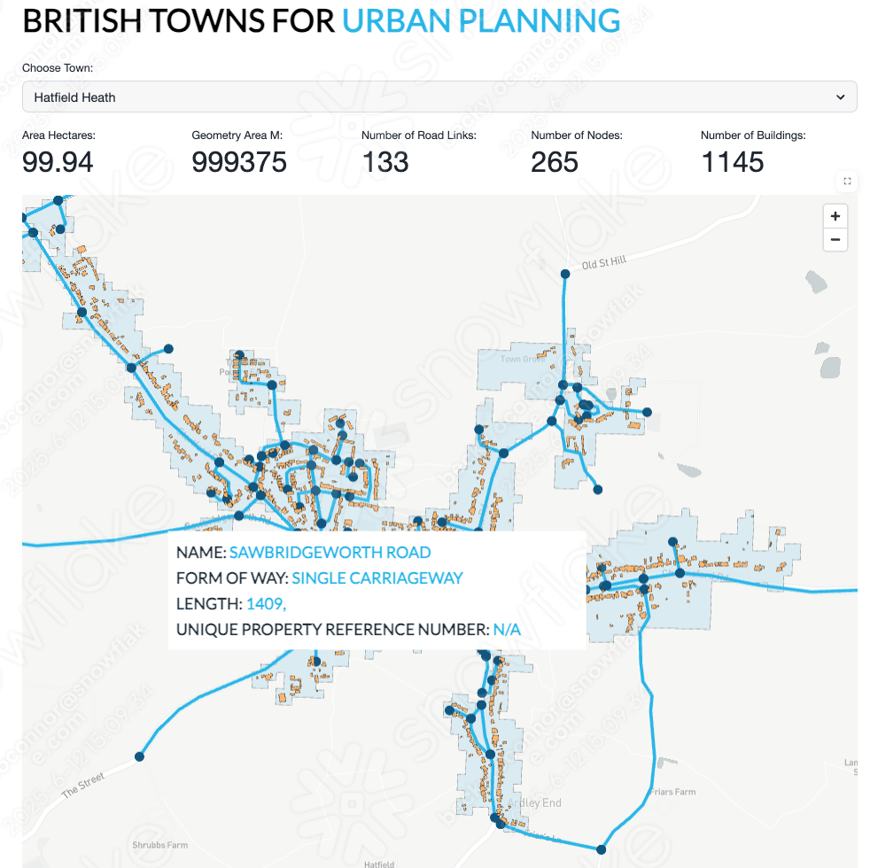

author: Becky O’Connor
id: building-geospatial-mult-layer-apps-with-snowflake-and-streamlit
summary: In this hands-on lab, you'll learn how to analyze and transform geospatial data in Snowflake, progressing from visualizing points on a map to building a multi-layer streamlit app.
categories: Data-Sharing, streamlit
environments: web
status: Hidden 
feedback link: https://github.com/Snowflake-Labs/sfguides/issues
tags: Geospatial, Advanced Analytics, Data Engineering, United kingdom, Geospatial, Ordnance Survey

# Building Geospatial Multi-Layer Apps with Snowflake and Streamlit
<!-- ------------------------ -->
## Overview
Duration: 10


Welcome to the **Building Geospatial Multi-Lay Apps with Snowflake and Streamlit quickstart**.  Today you will learn how to analyse and transform [geospatial](https://www.ordnancesurvey.co.uk/blog/what-is-spatial-data) data in Snowflake.  You will be using **Ordnance Survey** open datasets available on the marketplace as well as the worldwide open overture buildings dataset provided by **CARTO**.

&nbsp;&nbsp;&nbsp;&nbsp;&nbsp;&nbsp;&nbsp;

This is a progressive learning experience from viewing points on a mapk right through to building a multi layer app - which pulls together buildings with unique property reference numbers, the road network and urban extents.

You will be covering:

- Geospatial datatypes and formats
- Points, Linestrings and Polygons
- H3
- Spatial Joins and Calculations
- Visualising the results using **Pydeck**
- Search Optimisation
- Building a multi-layer app - which pulls together everything you have learned.

Thoughout the experience, you will demonstrate the concepts with **Snowflake Notebooks** and Streamlit.




### Structure of the session

The Lab consists of three notebooks and two Streamlit applications.

- Completion of the (**ANALYSE_LOCATION_DATA**) notebook. 

    This is an end-to-end tour on how location data works with Snowflake

- Creating a Streamlit app **ROAD_NETWORK**

    This is an example Streamlit application which brings together the different techniques learnt in notebook 1. 


### What You Will Learn

- An understanding of geospatial data types and formats - and how this works in **Snowflake**

- An understanding of Snowflakes built in **H3** capabilities

- Spatial Joins

- Geospatial Calculations

- Geospatial Filtering

- Using Search Optimisation to speed up geospatial queries

- Visualing points, linestrings and polygons on a multi layered map using **Pydeck** - all within a Streamlt application

### What You’ll Build 
- A streamlit application to visualise the UK road network together with buildings - which uses Ordnance survey road network data and the Carto Overture maps buildings dataset.


### Prerequisites
- A Snowflake Account. Sign up [here](https://signup.snowflake.com/) for a free 30 day trial.

 


<!-- ------------------------ -->
## Initial Setup
Duration: 2

Open up a new SQL worksheet and run the following commands. To open up a new SQL worksheet, select Projects » Worksheets, then click the blue plus button and select SQL worksheet.

```sql

CREATE DATABASE IF NOT EXISTS ANALYSE_LOCATION_DATA;

CREATE WAREHOUSE IF NOT EXISTS LOCATION_ANALYTICS;

CREATE SCHEMA IF NOT EXISTS NOTEBOOK;
CREATE SCHEMA IF NOT EXISTS STREAMLIT;
CREATE SCHEMA IF NOT EXISTS DEFAULT_SCHEMA;

```


<!-- ------------------------ -->
## Snowflake Marketplace
Duration: 10

- From the home page Navigate to **Data Products >> Marketplace**

### Ordnance Survey Datasets
- In the search box provided, search for the following datasets:

    -   Ordnance Survey - Urban Extents for Cities, Towns and Vilages
    -   Ordnance Survey - Postcodes, Place Names and Road Names
    -   Ordnance Survey - Road Network Great Britain - Open Roads
    -   Ordnance Survey - Unique Property Reference Numbers - Great Britain: Open UPRN
   

- For each dataset found, press **Get** to get the data.  


- Follow the on screen prompts to install each dataset.

### Carto Datasets - Obtain the following datasets from the marketplace

This dataset provides sample building polygons all over the world.

 -   Carto - Overture Maps Buildings

 

<!-- ------------------------ -->
## Notebook Walkthrough
Duration: 45

Are you ready to start learning about location data in Snowflake?

This tutorial will take you through how you can use location data to perform spatial calculations, joins, and visualise the data using the popular **Pydeck** python package.  We will be using the freely available datasets which you have now installed to step through examples of how geospatial data can be handled.


- Click [here](https://github.com/Snowflake-Labs/sfguide-getting-started-with-analysing-geospatial-location-data/blob/5629b368b26a679df26baeab717e9f9cf75a8927/Notebook/Analyse_Location_Data.ipynb) to download notebook

- From the home page, navigate to **Projects > Notebooks**

- Import the notebook as a new **Snowflake Notebook**


- Choose **LOCATION_ANALYTICS** as the database and **Notebooks** as the schema

- Name the notebook **ANALYSE_LOCATION_DATA**

- Before you start the notebook, click on **packages** and import the **Pydeck** package

- Press **Start** to initialise the notebook and follow the instructions within the notebook.

<!-- ------------------------ -->
## The Streamlit Road Network Example
Duration: 10

This app gives you an example of how you can bring all these datasets together to form a multi layered mapping visual.

- Navigate to **Projects > Streamlit**

- Create a new streamlit application and call the application **ROAD_NETWORK** inside the **LOCATION_ANALYTICS** database and the **STREAMLITS** schema

- Delete all sample code and import the **pydeck** package by clicking on **packages** on the top left hand corner of the screen.

- copy and paste the following code into the **Streamlit** canvas from [here](https://github.com/Snowflake-Labs/sfguide-getting-started-with-analysing-geospatial-location-data/blob/main/Streamlit/towns_with_roads.py)


<!-- ------------------------ -->
## Conclusion and Resources
Duration: 5
### Conclusion

Congratulations on completing the **Building Geospatial Multi-Layer Apps with Snowflake and Streamlit** Quickstart! Throughout this session, you've explored how Snowflake can be used to analyze and transform geospatial data, combining multiple datasets to generate valuable insights.  

### What You Learned 

- **Fundamentals of Geospatial Analysis in Snowflake**  
  You started by learning how to work with location data in Snowflake, visualizing points on a map and understanding spatial relationships.  

- **Building a Multi-Layer Application**  
  Using Streamlit, you explored how to bring together different layers of geospatial information into an interactive application.  
 

### Next Steps  

With this foundational knowledge, you can extend your analyses by:  

- Integrating additional external datasets, such as demographic or economic data, to enhance decision-making.  
- Experimenting with different visualization techniques to improve data storytelling.  
- Automating geospatial data processing with Snowpark and external APIs.  

We hope this hands-on lab has provided you with the confidence and skills to apply geospatial analytics in your own projects. **Happy analyzing!** 🚀


### Related Resources


#### Source code

- [Source Code on Github](https://github.com/Snowflake-Labs/sfguide-getting-started-with-analysing-geospatial-location-data)


#### Further Related Material

- [Ordnance Survey Documenation](https://docs.os.uk)

- [Geospatial Functions](https://docs.snowflake.com/en/sql-reference/functions-geospatial)

- [H3 Indexing](https://h3geo.org/docs/)

- [Streamlit](https://streamlit.io/)

- [Pydeck](https://deckgl.readthedocs.io/en/latest/index.html#)

- [Using Cortex and Streamlit With Geospatial Data](https://quickstarts.snowflake.com/guide/using_snowflake_cortex_and_streamlit_with_geospatial_data/index.html#1)

- [Route Plan Optimisation Simulator](https://github.com/Snowflake-Labs/sfguide-Create-a-Route-Optimisation-and-Vehicle-Route-Plan-Simulator)

- [Getting started with Geospatial AI and ML using Snowflake Cortex](https://quickstarts.snowflake.com/guide/geo-for-machine-learning/index.html?index=..%2F..index#0)

