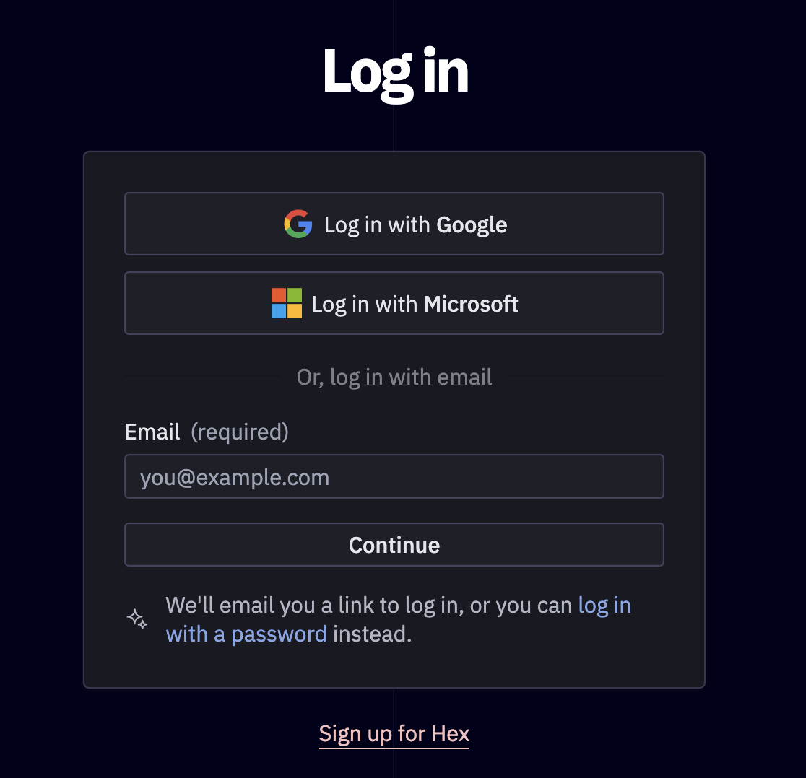
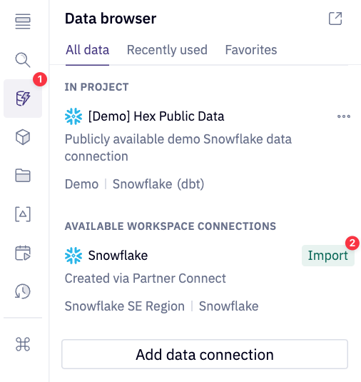

author: Armin Efendic
id: building-ml-models-in-minutes-with-hex-and-snowflake-ml-functions
categories: snowflake-site:taxonomy/solution-center/certification/quickstart, snowflake-site:taxonomy/solution-center/certification/community-sourced, snowflake-site:taxonomy/solution-center/includes/architecture, snowflake-site:taxonomy/product/data-engineering
language: en
summary: Train ML models rapidly using Hex collaborative notebooks with Snowflake ML Functions for quick experimentation and deployment.
environments: web
status: Published
feedback link: https://github.com/Snowflake-Labs/sfguides/issues

# Building ML Models In Minutes With Hex And Snowflake ML Functions

<!-- ------------------------ -->
## Overview 

In this quickstart, we will be utilizing population data gathered by the US Census Bureau. This dataset will be used to forecast population growth of various countries. For the forecasting model we will use is the Snowflake ML Forecast function. 

### Prerequisites
- Familiarity with basic Python and SQL 
- Familiarity with data science notebooks
- A [Snowflake](https://signup.snowflake.com/?utm_source=snowflake-devrel&utm_medium=developer-guides&utm_cta=developer-guides) Account (if you are using an enterprise account through your organization, it is unlikely that you will have the privileges to use the `ACCOUNTADMIN` role, which is required for this lab).

Head over to the [Snowflake](https://signup.snowflake.com/?utm_source=snowflake-devrel&utm_medium=developer-guides&utm_cta=developer-guides) sign-up page and register for a free account. Once you've registered, you'll get an email that will bring you to Snowflake so that you can sign in.

#### Connecting Snowflake with Hex
If you have an existing Hex account, login in to your account and continue to the `Getting Started With Hex` section. 

Otherwise, once you've logged into your Snowflake account, simply navigate to the `Data Products` tab on the left and click `Partner connect`. In the search bar at the top, type in `Hex`, and you should see the Hex partner connect tile appear. Clicking on the tile will bring up a new screen, select the `Connect` button in the lower right corner. After this, you'll see a new screen confirming that your account has been created and from here you can click `Activate`.

#### Creating a workspace
Once activated, you'll be brought over to Hex and will be prompted to create/name your new workspace. After you've named your workspace, you'll be brought to the [projects](https://learn.hex.tech/docs/getting-started/intro-to-projects#projects-home) page.

#### Workflow roadblocks
The following issues may occur if you have an existing Hex account and you're not an Admin in that org.

**Unauthorized error**
> If you have an existing Hex account that was created with a password and username, you may run into an "Unauthorized" error when activating your workspace in Partner Connect. If this is your experience, head over to [hex.tech](https://hex.tech) and login with your password and username. 

**Plan upgrade**
> If you are an existing Hex user currently on a Community plan, you may encounter an issue that will prevent you from using Partner Connect. If you’re unclear on what Hex plan you are on, feel free to reach out to [support@hex.tech](mailto:support@hex.tech). If you are the Admin of your organization, you can see your plan under Manage plan on the Settings page. To extend a trial, email [support@hex.tech](mailto:support@hex.tech) with the subject "VHOL trial extension."

**Role privileges**
> If you do not have an Editor role or higher, you won't be able to create data connections in your workspace. To upgrade your role, contact your workspace Admin. You can find out who this is by navigating to Settings -> Users & groups within your Hex workspace.

*If you're still encountering issues, or encounter any issues other than the ones listed above, please contact our support team [support@hex.tech](mailto:support@hex.tech) with the subject "VHOL" for priority support.*

<!-- ------------------------ -->

### What You Will Learn
* How to perform model training using Snowflake ML functions
* How to handle model training for multi-series datasets
* How to call the model for inference
* How to create charts in Hex and finally a Hex App

### What You Will Build
In this quickstart, you will create a few machine learning models using Snowflake ML functions. In the end we will use our results and data exploration to create a final Hex app.
<!-- ------------------------ -->

## Getting Started with Hex

Now we can move back over to Hex and get started on our project. The first thing you'll need to do is transfer the Hex project into your new Hex org.

<button>

[Get Hex project](https://app.hex.tech/hex-public/hex/dbac0486-1d27-4a10-9db8-7eb73a7ce4e4/draft/logic?utm_source=quickstart)

</button>

- Select Get a copy.
- Select your new or existing Hex org. 

Now that you've got your project, you will find yourself in the [Logic view](https://learn.hex.tech/docs/develop-logic/logic-view-overview) of a Hex project. The Logic view is a notebook-like interface made up of cells such as code cells, markdown cells, input parameters and more! On the far left side, you'll see a control panel that will allow you to do things like upload files, import data connections, or search your project. Before we dive into the code, we'll need to import our Snowflake connection to our project. You can follow along with the video, [Creating a Snowflake Database Connection and Transferring Data](https://www.loom.com/share/d949de0c7c6e49f3b286af07d70cd96b?sid=99eeb02b-8b64-4c64-93c4-910110358c2b), describing how to create/edit your Snowflake connection and write data into your Snowflake database from Hex (which will be described in the Hex project).

We can import our Snowflake data connection by heading over to the `Data sources` tab represented by a database icon with a lightning bolt. At the bottom of this section, you'll see a portion that says available workspace connections and you should see one that says Snowflake if you created the Hex account via Partner Connect.

If you had an existing Hex org and did not create one via Partner Connect please follow [Hex documentation](https://learn.hex.tech/docs/connect-to-data/data-connections/data-connections-introduction) and reference [Creating a Snowflake Database Connection and Transferring Data](https://www.loom.com/share/d949de0c7c6e49f3b286af07d70cd96b?sid=99eeb02b-8b64-4c64-93c4-910110358c2b) as needed.

### Common Problems
If coming from Partner Connect or creating a new database connection, ensure that your database connection has both the Snowpark and Writeback toggle enabled. Navigate to the Settings window and select the desired Snowflake database connection. 

Enable the Snowpark and Writeback toggles.

## Hex Project

The rest of the lab can entirely be followed step-by-step from the Hex project. Any subsequent steps and explanation will be found in the Hex project itself.

Key sections of the Hex project include:
- Data Exploration
- Single Series Modeling
- Mutli-Series Modeling
- Hex App Creation

## Sharing our results

Now that we've completed going through our project, we can share this project with others! To do this:
- Head over to the app builder
- A pre-built layout has been designed but feel free to customize and add any additional elements
- To customize add, remove, and arrange cells. Check out the [Hex docs](https://learn.hex.tech/docs/build-apps/app-builder) for more info.
- Publish the app with the [Publish button](https://learn.hex.tech/docs/share-insights/apps/publish-and-share-apps)
- Lastly, hit the share button next to publish, and select `Publish to web`.

## Conclusion and Resources
Congratulations on making it to the end of this Lab! You've successfully trained an forecast model to predict the country population using only SQL. At the end, you created a Hex app highlight your analysis that can be easily shared with others.

### What You Learned
* How to use the Snowflake ML Forecast Function
* How to handle multi-series datasets
* How to call the model to perform inference and recieve population growth projections
* How to chart those predictions and other useful information with Hex's native visual cells
* How to create and share a Hex app

### Related Resources
* [Final Project](https://app.hex.tech/hex-public/hex/dbac0486-1d27-4a10-9db8-7eb73a7ce4e4/draft/logic?utm_source=quickstart)
* [Building ML Models In Minutes With Hex and Snowflake ML Functions](https://medium.com/snowflake/building-ml-models-in-minutes-with-hex-and-snowflake-cortex-434e94486365)
* [Machine Learning Made Easy With SNowflake ML Functions And Hex](https://www.youtube.com/watch?v=Sj64VEyfwww)
* [Snowflake ML Functions Documentation](https://docs.snowflake.com/en/guides-overview-ml-functions)
* [Hex Documentation](https://learn.hex.tech/)
* [Download Reference Architecture](/content/dam/snowflake-site/developers/2024/05/Cortex-ML-Archtecture.pdf)
* [Read the Blog](https://medium.com/snowflake/building-ml-models-in-minutes-with-hex-and-snowflake-cortex-434e94486365)
* [Watch the Demo](https://youtu.be/Sj64VEyfwww?list=TLGG6uV5wGgnKuIxOTA5MjAyNQ)
