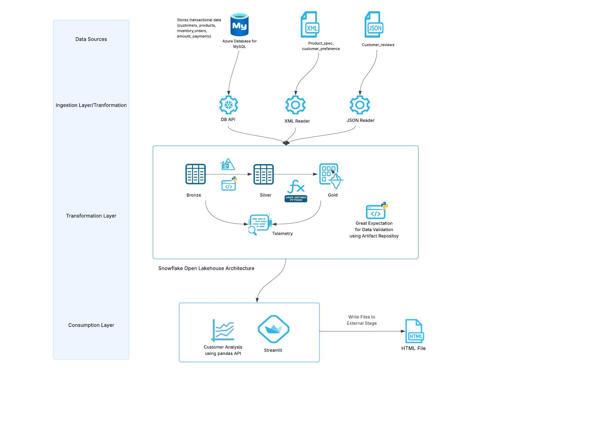
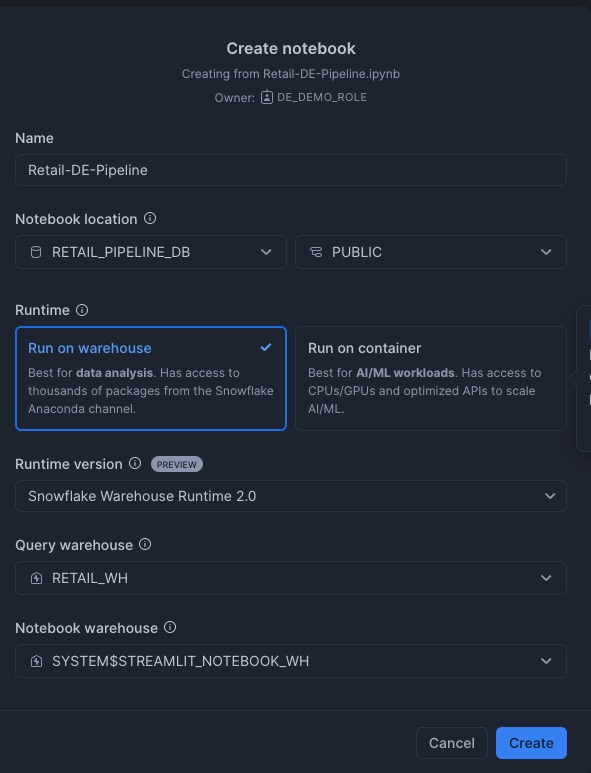
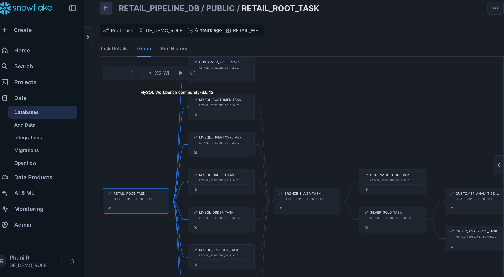
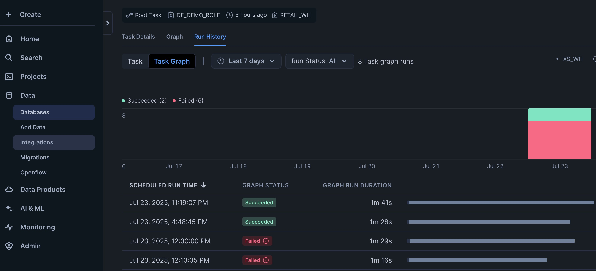
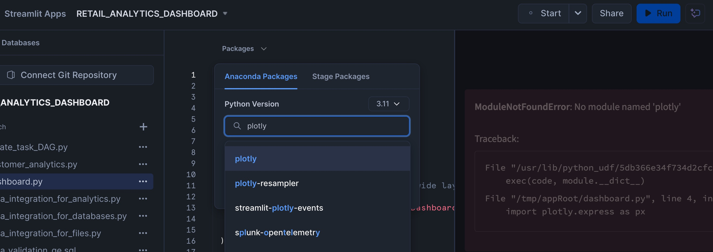
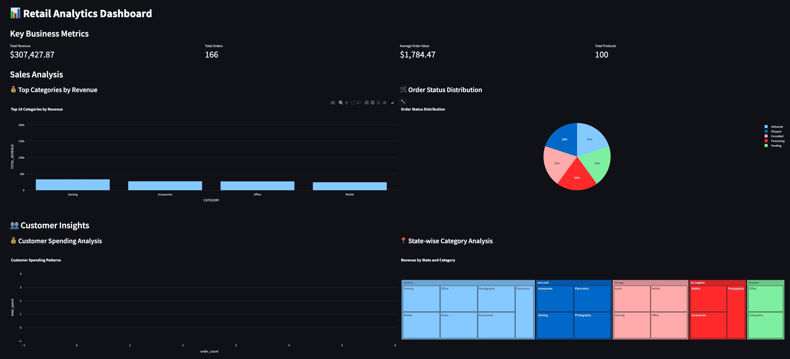
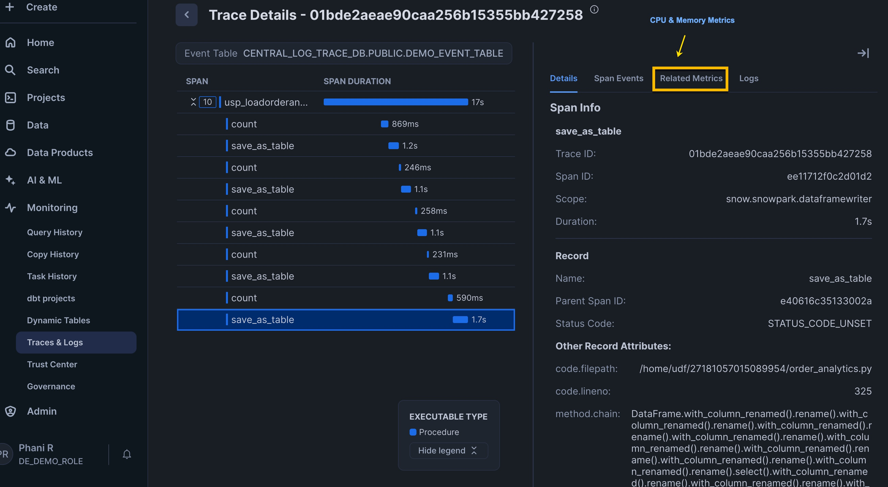

id: building-retail-analytics-de-pipeline
categories: snowflake-site:taxonomy/solution-center/certification/quickstart, snowflake-site:taxonomy/industry/retail-and-cpg, snowflake-site:taxonomy/product/data-engineering
language: en
summary: Build retail analytics data engineering pipelines with Snowflake managed Iceberg tables for sales tracking, inventory management, and customer insights.
environments: web
status: Published
feedback link: <https://github.com/Snowflake-Labs/sfguides/issues>
authors: Phani Raj
fork repo link: https://github.com/Snowflake-Labs/sfguide-building-retail-analytics-de-pipeline


# Build a Retail Analytics Data Engineering Pipeline with Snowflake
<!-- ------------------------ -->

## Overview


This quickstart demonstrates how to build a comprehensive retail analytics data analytics pipeline using Snowflake's latest data engineering capabilities in Python. Python has become the preferred language for data engineers due to its rich ecosystem of data processing libraries, ease of use, and extensive community support. Snowflake offers native Python support through Snowpark API, Snowpark Pandas APIs and offers  seamless integration with popular Python libraries, and familiar APIs that make data engineering accessible and efficient.

You'll learn how to integrate data from multiple sources, perform advanced analytics and create interactive dashboards - all within Snowflake's unified platform using the Python ecosystem you already know.

The retail pipeline follows a modern data architecture pattern with three distinct layers following the medallion architecture.

### Key Components
- **Data Integration**: Snowpark DB APIs for MySQL and Snowpark for file processing
- **Data Processing**: Snowpark for transformations, Cortex for AI/ML
- **Data Quality**: Great Expectations with Artifact Repository
- **Orchestration**: Snowflake Tasks with DAG dependencies
- **Analytics**: Snowpark Pandas API for advanced analytics
- **Observability**: Snowflake Trail Integration
- **Visualization**: Streamlit dashboard with real-time data
- **File Write to Stage**: Saving chart from streamlit to Snowflake stage as html file.


### Data Layers
- **Bronze Layer**: Raw data from multiple sources (databases, JSON, XML files)
- **Silver Layer**: Cleaned and enriched data with AI-powered insights
- **Gold Layer**: Analytics-ready data stored in managed Iceberg tables and regular Snowflake tables.




### What You Will Learn

You will learn how to leverage Snowpark DB APIs for seamless data integration from external databases using DB APIs, use Snowpark APIs and Snowpark Pandas API for distributed data processing , implement AI-powered analytics with Cortex, and build a complete data pipeline with open source data quality checks - all using Python. Discover how Snowflake's native Python support eliminates the need for complex ETL tools and enables data engineers to work with familiar Python syntax and libraries. 

### What You Will Build

An end to end Data Engineering pipeline which does the following:

* Data integration pipeline connecting MYSQL databases using Snowpark DB API to load into Snowflake tables.
* Semi-structured data ingestion for JSON and XML files using Snowpark APIs
* Data processing with Snowpark and Snowpark Pandas API
* AI-powered sentiment analysis and address extraction using Cortex AI
* Automated data quality validation with open source Great Expectations library
* Comprehensive observability and monitoring using Snowflake's native observability feature like Snowflae Trail.
* Interactive analytics dashboard with Streamlit with file writes to stage.
* End-to-end pipeline orchestration with Tasks Graphs.


### Prerequisites

* Access to a [Snowflake account](https://signup.snowflake.com/?utm_source=snowflake-devrel&utm_medium=developer-guides&utm_cta=developer-guides)
* Basic Python programming experience 
* Access to external databases (MySQL) or ability to set up sample data. You can download the sample data used for this demo from here.
* Basic understandig of Snowflake tasks.


<!-- ------------------------ -->
## Setup


### 1. Environment Setup

Create the necessary Snowflake objects for the pipeline:

```sql
-- Create database and schemas

USE ROLE ACCOUNTADMIN;

CREATE ROLE DE_DEMO_ROLE;

CREATE DATABASE IF NOT EXISTS retail_pipeline_db;
-- Create warehouse
CREATE WAREHOUSE IF NOT EXISTS retail_wh 
    WAREHOUSE_SIZE = 'SMALL'
    AUTO_SUSPEND = 300
    AUTO_RESUME = TRUE;

USE DATABASE retail_pipeline_db;
USE SCHEMA PUBLIC;

-- UPDATE <MYSQL_HOST_NAME> WITH YOUR MYSQL HOST AND PORT NUMBER
CREATE OR REPLACE NETWORK RULE dbms_network_rule
  MODE = EGRESS
  TYPE = HOST_PORT
  VALUE_LIST = ('<MYSQL_HOST_NAME>:3306');

-- Update the usename and password with you mysql username and password

CREATE OR REPLACE SECRET mysql_db_secret
  TYPE = PASSWORD
  username = '<enter the username>'
  password = '<enter the password>';

-- Update the secret with you mysql hostname only. Do not include the port number. We are using 3306 which is used in db_connections.py

CREATE OR REPLACE SECRET mysql_hostname
  TYPE = GENERIC_STRING
  SECRET_STRING = '<enter the mysql hostname>'
  COMMENT = 'host name for mysql db without port number';


CREATE OR REPLACE EXTERNAL ACCESS INTEGRATION dbms_access_integration
  ALLOWED_NETWORK_RULES = (dbms_network_rule)
  ALLOWED_AUTHENTICATION_SECRETS = (mysql_db_secret,mysql_hostname)
  ENABLED = true;

GRANT USAGE ON INTEGRATION dbms_access_integration TO ROLE DE_DEMO_ROLE;

GRANT OWNERSHIP ON SECRET mysql_db_secret TO ROLE DE_DEMO_ROLE;

GRANT OWNERSHIP ON SECRET mysql_hostname TO  ROLE DE_DEMO_ROLE;

-- GRANT OWNERSHIP ON THE DB TO THE CUSTOM ROLE
GRANT OWNERSHIP ON DATABASE retail_pipeline_db TO ROLE DE_DEMO_ROLE COPY CURRENT GRANTS;
GRANT OWNERSHIP ON ALL SCHEMAS IN DATABASE retail_pipeline_db TO ROLE DE_DEMO_ROLE COPY CURRENT GRANTS;

GRANT USAGE ON WAREHOUSE retail_wh TO ROLE DE_DEMO_ROLE;

GRANT EXECUTE TASK ON ACCOUNT TO ROLE DE_DEMO_ROLE;

GRANT ROLE DE_DEMO_ROLE TO USER <username>;

-- Creating Event tables in a dedicated database. This is used for observability
CREATE OR REPLACE DATABASE central_log_trace_db;
USE DATABASE central_log_trace_db;
CREATE OR REPLACE EVENT TABLE demo_event_table;
ALTER ACCOUNT SET EVENT_TABLE = central_log_trace_db.PUBLIC.demo_event_table;

USE ROLE DE_DEMO_ROLE;
USE DATABASE retail_pipeline_db;
USE WAREHOUSE retail_wh;
USE SCHEMA PUBLIC;

CREATE STAGE IF NOT EXISTS SOURCE_FILES
 ENCRYPTION = (TYPE = 'SNOWFLAKE_SSE');

CREATE STAGE IF NOT EXISTS CODEFILES
 ENCRYPTION = (TYPE = 'SNOWFLAKE_SSE');

-- This is for Observability Feature
ALTER DATABASE retail_pipeline_db SET TRACE_LEVEL = ALWAYS;

ALTER DATABASE retail_pipeline_db SET LOG_LEVEL = DEBUG;

ALTER DATABASE retail_pipeline_db SET METRIC_LEVEL = ALL;

```

> Note: 

 - Upload all the files in <b>*[`sample_data`](https://github.com/Snowflake-Labs/sfguide-building-retail-analytics-de-pipeline/tree/main/sample_data)*</b> folder from your cloned repo to *SOURCE_FILES* stage that you have created above. 
 - Upload all the files in  <b>*[`src`](https://github.com/Snowflake-Labs/sfguide-building-retail-analytics-de-pipeline/tree/main/src)*</b> folder while has all the python files from your cloned repo to *CODEFILES* stage that you have created above. 

Here's a summary of the functionality provided by each Python file:

**`db_connections.py`** - Has the connection details for the RDBMS sources. 

**`data_integration_for_databases.py`** - Connects to Oracle, Azure SQL, and MySQL databases to extract data and load it into Snowflake bronze tables using Snowpark. In this quickstart we are only loading data from MySQL DB.

**`transformations.py`** - Implements a medallion architecture data pipeline that transforms bronze (raw) data to silver (cleaned) to gold (analytics-ready) layers in Iceberg Tables and using Snowflake Cortex for sentiment analysis and address extraction.

**`order_analytics.py`** - Performs comprehensive order analysis including product performance, category analysis, customer order history, and top-selling products using Snowpark DataFrames.

**`data_integration_for_files.py`** - Loads JSON product reviews and XML customer preferences/product specifications into Snowflake bronze tables using Snowpark's file reading capabilities.

**`data_integration_for_analytics.py`** - Provides database connection functions and data loading utilities specifically for analytics workflows, supporting Oracle, Azure SQL, and MySQL sources.

**`dashboard.py`** - Creates an interactive Streamlit dashboard displaying e-commerce analytics including KPIs, sales analysis, customer insights, and product performance visualizations.

**`save_charts_to_stage.py`** - Exports customer preference data to CSV format and saves HTML chart visualizations to Snowflake stages for dashboard consumption.

**`customer_analytics.py`** - Implements parallel data loading and customer analytics using **Snowpark Pandas API** to generate customer statistics, order analytics, inventory analysis, and product pricing insights.

**`create_task_DAG.py`** - Creates and manages a Snowflake task DAG (Directed Acyclic Graph) that orchestrates the entire data pipeline from data loading through transformations to analytics in a scheduled workflow.


### 2. External Database Connections

Configure connections to external databases using Snowpark DB APIs. The pipeline supports following sources:

- **MySQL Database**: Direct connection using `session.read.dbapi()` with native MySQL drivers
- **File Sources**: JSON and XML files using Snowpark file readers APIs

Snowpark DB APIs eliminate the need for traditional ETL tools by providing native Python connectivity to external databases, making it the preferred platform for Python-based data engineering workflows. Below is an example we are using on how to connect to MySQL using the Snowpark DB API. The code db_connections.py has the logic to read data from Azure SQL and Oracle as well.

``` python
def create_mysql_db_connection():
    import pymysql
    """Create MySQL database connection using credentials from appropriate source"""
    HOST = get_host_name('mysql')
    PORT = 3306
    USERNAME, PASSWORD = get_db_credentials('mysql')
    DATABASE = "retail_db"

    connection = pymysql.connect(
        host=HOST,
        port=PORT,
        db=DATABASE,
        user=USERNAME,
        password=PASSWORD,
    )
    return connection
```


Reference implementation: [`db_connections.py`](https://github.com/Snowflake-Labs/sfguide-building-retail-analytics-de-pipeline/blob/main/src/db_connections.py). This file has the logic for multiple rdms sources. Update the port number if you not using 3306 for MySQL.


### 3. Sample Data Setup for MySQL

Load sample data to MySQL database using the provided CSV files in [`sample_data/`](snowflake_retail_pipeline/sample_data/). Run the follow DDL in your MYSQL DB. Ensure you create a database with name retail_db in your MySQL instance.

```sql
use retail_db

-- Create Customers table
CREATE TABLE customers (
    customer_id VARCHAR(8) PRIMARY KEY,
    first_name VARCHAR(50) NOT NULL,
    last_name VARCHAR(50) NOT NULL,
    email VARCHAR(100) NOT NULL,
    phone VARCHAR(20) NOT NULL,
    address VARCHAR(200) NOT NULL,
    created_date TIMESTAMP NOT NULL DEFAULT CURRENT_TIMESTAMP,
    last_updated TIMESTAMP NOT NULL DEFAULT CURRENT_TIMESTAMP ON UPDATE CURRENT_TIMESTAMP
);

-- Create Products table
CREATE TABLE products (
    product_id VARCHAR(8) PRIMARY KEY,
    product_name VARCHAR(100) NOT NULL,
    category VARCHAR(50) NOT NULL,
    price DECIMAL(10,2) NOT NULL,
    description VARCHAR(500) NOT NULL,
    created_date TIMESTAMP NOT NULL DEFAULT CURRENT_TIMESTAMP,
    last_updated TIMESTAMP NOT NULL DEFAULT CURRENT_TIMESTAMP ON UPDATE CURRENT_TIMESTAMP
);

-- Create Orders table
CREATE TABLE orders (
    order_id VARCHAR(8) PRIMARY KEY,
    customer_id VARCHAR(8) NOT NULL,
    order_date TIMESTAMP NOT NULL,
    total_amount DECIMAL(10,2) NOT NULL,
    status VARCHAR(20) NOT NULL,
    payment_method VARCHAR(20) NOT NULL,
    created_date TIMESTAMP NOT NULL DEFAULT CURRENT_TIMESTAMP,
    last_updated TIMESTAMP NOT NULL DEFAULT CURRENT_TIMESTAMP ON UPDATE CURRENT_TIMESTAMP
    -- FOREIGN KEY (customer_id) REFERENCES customers(customer_id)
);

-- Create Inventory table
CREATE TABLE inventory (
    inventory_id VARCHAR(8) PRIMARY KEY,
    product_id VARCHAR(8) NOT NULL,
    quantity INT NOT NULL,
    warehouse_id VARCHAR(5) NOT NULL,
    last_updated TIMESTAMP NOT NULL DEFAULT CURRENT_TIMESTAMP ON UPDATE CURRENT_TIMESTAMP
    -- FOREIGN KEY (product_id) REFERENCES products(product_id)
);

-- Create Order_Items table
CREATE TABLE order_items (
    order_id VARCHAR(8) NOT NULL,
    product_id VARCHAR(8) NOT NULL,
    quantity INT NOT NULL,
    unit_price DECIMAL(10,2) NOT NULL,
    created_date TIMESTAMP NOT NULL DEFAULT CURRENT_TIMESTAMP,
    last_updated TIMESTAMP NOT NULL DEFAULT CURRENT_TIMESTAMP ON UPDATE CURRENT_TIMESTAMP,
    PRIMARY KEY (order_id, product_id)
    -- ,FOREIGN KEY (order_id) REFERENCES orders(order_id),
    -- FOREIGN KEY (product_id) REFERENCES products(product_id)
);

```
> **Note:** You can use any method to load these CSV files into the mysql tables created above.

### 4. Creating External Volumnes for Managed Iceberg Tables

For this pipeline, we will be implementing Snowflake managed Iceberg tables for selected gold layer tables to leverage the open table format. Iceberg tables require external volumes as a prerequisite for their creation and management.

**Prerequisites:**
1. Create an AWS S3 bucket named **de-managed-iceberg** in the same region where your Snowflake account runs.
2. Ensure proper IAM permissions are configured for Snowflake to access the S3 bucket
3. Configure the external volume following the cloud-specific instructions below

The external volume serves as the storage layer for Iceberg table metadata and data files, enabling features such as time travel, schema evolution, and optimized query performance. Follow the detailed instructions in the links below to create the external volume that will be used throughout this pipeline for managed Iceberg table operations.

AWS - https://docs.snowflake.com/en/user-guide/tables-iceberg-configure-external-volume-s3
Azure - https://docs.snowflake.com/en/user-guide/tables-iceberg-configure-external-volume-azure

```sql
USE ROLE ACCOUNTADMIN;

CREATE OR REPLACE EXTERNAL VOLUME iceberg_external_volume_de_demo
   STORAGE_LOCATIONS =
      (
         (
            NAME = 'my-s3-us-east-1'
            STORAGE_PROVIDER = 'S3'
            STORAGE_BASE_URL = 's3://de-managed-iceberg/'
            STORAGE_AWS_ROLE_ARN = 'arn:aws:iam::<your role info>'   
            STORAGE_AWS_EXTERNAL_ID = 'iceberg_table_external_id'
         )
      )
      ALLOW_WRITES = TRUE;

GRANT USAGE ON EXTERNAL VOLUME iceberg_external_volume_de_demo TO ROLE DE_DEMO_ROLE;

<< Following additional steps as mentioned in the docs after creating the external volume>>

USE ROLE DE_DEMO_ROLE;

ALTER DATABASE retail_pipeline_db SET EXTERNAL_VOLUME = 'iceberg_external_volume_de_demo';


create or replace iceberg TABLE retail_pipeline_db.public.GOLD_PRODUCT_REVIEWS_ANALYTICS (
	PRODUCT_ID string,
	AVG_RATING NUMBER(38,6),
	TOTAL_REVIEWS NUMBER(38,0) NOT NULL,
	VERIFIED_REVIEWS NUMBER(38,0),
	AVG_BATTERY_RATING FLOAT,
	AVG_QUALITY_RATING FLOAT,
	AVG_VALUE_RATING FLOAT,
	POSITIVE_REVIEWS NUMBER(38,0) NOT NULL,
	NEGATIVE_REVIEWS NUMBER(38,0) NOT NULL,
	LAST_UPDATED TIMESTAMP_LTZ NOT NULL
)
    CATALOG = 'SNOWFLAKE'
    EXTERNAL_VOLUME = 'iceberg_external_volume_de_demo'
    BASE_LOCATION = 'retail_gold_layer/GOLD_PRODUCT_REVIEWS_ANALYTICS/'
    STORAGE_SERIALIZATION_POLICY  = 'OPTIMIZED' ;


   CREATE OR REPLACE ICEBERG TABLE retail_pipeline_db.public.GOLD_CUSTOMER_INSIGHTS(
       CUSTOMER_ID STRING NOT NULL , 
       STATE STRING, 
       TOTAL_ORDERS BIGINT NOT NULL , 
       TOTAL_SPENT NUMBER(22, 2), 
       AVG_ORDER_VALUE NUMBER(28, 8), 
       LAST_ORDER_DATE TIMESTAMP_NTZ, 
       LAST_UPDATED TIMESTAMP_LTZ 
   )  
   CATALOG = 'SNOWFLAKE'
   BASE_LOCATION = 'retail_gold_layer/GOLD_CUSTOMER_INSIGHTS/'  
   EXTERNAL_VOLUME = 'iceberg_external_volume_de_demo'
   STORAGE_SERIALIZATION_POLICY = 'OPTIMIZED' ;

```

<!-- ------------------------ -->
## Data Integration and Transformation

Upload the ['Retail-DE-Pipeline.ipynb'](https://github.com/Snowflake-Labs/sfguide-building-retail-analytics-de-pipeline/blob/main/Retail-DE-Pipeline.ipynb) notebook from Snowsight.

Navigate to Projects → Notebooks and then click ⌄ to Import ipynb file and select the file Retail-DE-Pipeline.ipynb.
Make sure to choose the notebook location to match **retail_pipeline_db** Database and the **public** Schema, and choose the warehouse we created earlier **retail_wh** for the query warehouse and the notebook warehouse.




This notebook contains comprehensive instructions for implementing the data engineering pipeline, encompassing all stages from multi-source data ingestion through Streamlit application development.Follow all steps and directives outlined in the uploaded notebook file.

Please ensure that all prerequisite steps mentioned in the **Setup** have been completed prior to executing the notebook. Failure to complete will result in code execution errors within the notebook environment.


### 1. Multi-Source Data Loading

In the notebook uploaded under section 1 (1.1 and 1.2) we are loading from multiple sources (MySQL and files). Snowpark DB APIs enable seamless data integration from external databases without complex ETL processes, making it the ideal platform for Python developers. The pipeline demonstrates how Python data engineers can leverage familiar database connectivity patterns:


**File Processing**
```python
# JSON and XML file processing with Snowpark
df = session.read.format("json").load("@stage/product_reviews.json")
df = session.read.format("xml").option("rowTag", "customer").load("@stage/preferences.xml")
```

Code reference in ['data_integration_for_files.py'](https://github.com/Snowflake-Labs/sfguide-building-retail-analytics-de-pipeline/blob/main/src/data_integration_for_files.py)

>**Note**: The `rowTag` option is a new feature in Snowpark for XML file processing that allows you to specify which XML element should be treated as a row when parsing XML data. This is particularly useful for nested XML structures.

>For example, when using `rowTag="customer"`, each `<customer>` element in the XML file becomes a separate row in the resulting DataFrame, making it easier to work with hierarchical XML data in a tabular format. This feature enhances Snowpark's ability to handle semi-structured data formats efficiently.

>For more details: https://docs.snowflake.com/en/developer-guide/snowpark/reference/python/latest/snowpark/api/snowflake.snowpark.DataFrameReader.xml

<!-- ------------------------ -->

### 2. Data Transformations and Validation

#### 2.1 Data Transformation

Sections 2.1 of the notebook where the usp_loadBronzeToSilver created, it demonstrate advanced data transformation workflows leveraging Snowpark API combined with Snowflake Cortex AISQL functions. This integration showcases how modern data engineers can build intelligent pipelines that combine traditional ETL operations with AI-powered data enrichment.

**AI-Powered Data Enrichment Pipeline**

In the transformation.py used by the usp_loadBronzeToSilver SP we are calling cortex function to get the sentiment and address detalils from other fields of the tables as show below.

```python
# Advanced sentiment analysis with categorical scoring
df = df.withColumn(
    "sentiment_score",
    when(sentiment(col("content")) > 0.6, 'Positive')
    .otherwise(when(sentiment(col("content")) < 0.4, 'Negative')
    .otherwise('Neutral'))
)

# Intelligent address parsing using natural language extraction
df = df.withColumn('state', 
    extract_answer(col('address'), 'what is name of the state of the customer')[0]['answer']
)
```

This approach eliminates the complexity of managing separate AI/ML infrastructure while providing production-ready intelligence capabilities directly within your data transformation workflows.

Reference implementation: ['transformations.py'](https://github.com/Snowflake-Labs/sfguide-building-retail-analytics-de-pipeline/blob/main/src/transformations.py)


#### 2.2. Automated Data Validation with Great Expectations

In the notebook section 2.2 we are leveraging Snowflake's Artifact Repository feature, which allows Python developers to use their favorite open-source libraries directly within Snowflake without the need for uploading libraries to a stage. We have to specify the list of libararies under ARTIFACT_REPOSITORY_PACKAGES while creating the stored procedure. We are creating a SP which is using Great Expectation library for data validation on set of columns of a table.

**Validation Framework**
```sql
-- Using Artifact Repository for OSS libraries
CREATE PROCEDURE usp_generateValidationResults()
  LANGUAGE PYTHON
  RUNTIME_VERSION = 3.9
  ARTIFACT_REPOSITORY = snowflake.snowpark.pypi_shared_repository
  ARTIFACT_REPOSITORY_PACKAGES = ('great-expectations==0.15.14')
```

Reference implementation: [`data_validation_ge.sql`](https://github.com/Snowflake-Labs/sfguide-building-retail-analytics-de-pipeline/blob/main/src/data_validation_ge.sql). This is a sample implementation to demonstrate how to use any open source library which is not found in anaconda channel and can be downloaded from PyPI.

>For more details: /en/blog/snowpark-supports-pypi-packages/

### 2.3. Gold Layer Storage

In notebook section 2.3, the pipeline utilizes Snowflake's managed Iceberg tables and regular FDN tables for the gold layer.

**Managed Iceberg Tables Implementation**

The pipeline leverages Snowflake's managed Iceberg tables for the gold layer, providing an open table format that offer interoperability between compute engines. This implementation demonstrates how Python data engineers can seamlessly work with modern table formats without sacrificing ease of use.

**Implementation Example:**
```python
# Writing to managed Iceberg tables with optimized configuration
df.write.mode("overwrite").saveAsTable(
    "GOLD_CUSTOMER_INSIGHTS",
    iceberg_config={
        "BASE_LOCATION": "retail_gold_layer/GOLD_CUSTOMER_INSIGHTS/",
        "storage_serialization_policy": "OPTIMIZED"
    }
)
```
This approach provides open lakehouse capabilities all within Snowflake, making it ideal for modern analytics workloads that require both performance, flexibility and interoperability.

### 3. Advanced Analytics with Snowpark Pandas API

In the section 3 (3. Analytics Layer) of the notebook demonstrates how to leverage Snowflake's Snowpark Pandas API for complex analytics operations. The Snowpark Pandas API provides familiar pandas-like syntax while harnessing Snowflake's distributed processing power, making it the ideal platform for Python data engineers.

**Key Benefits:**
- **Familiar Syntax**: Use standard pandas operations with distributed processing
- **Automatic Optimization**: Snowflake optimizes queries for performance
- **Scalability**: Process large datasets without memory constraints
- **Integration**: Seamless integration with existing Python workflows

**Parallel Data Processing Implementation**

The pipeline implements parallel processing patterns that combine Python's concurrent programming capabilities with Snowflake's distributed architecture. This approach maximizes throughput and reduces overall pipeline execution time significantly.

**Parallel Loading Implementation:**

```python
# Concurrent data loading with optimized thread management
from concurrent.futures import ThreadPoolExecutor
import modin.pandas as pd
import snowflake.snowpark.modin.plugin

def load_data_parallel(session: Session):
    """Load data from multiple sources concurrently with intelligent resource allocation"""
    table_params = [
        {'source': 'mysql', 'source_table': 'customers'},
        {'source': 'mysql', 'source_table': 'products'},
        {'source': 'mysql', 'source_table': 'orders'},
        {'source': 'mysql', 'source_table': 'inventory'},
        {'source': 'mysql', 'source_table': 'order_items'}
    ]
    
    # Optimal worker count matches data source count for maximum parallel efficiency
    with ThreadPoolExecutor(max_workers=len(table_params)) as executor:
        futures = [executor.submit(load_single_table, params) for params in table_params]
        results = [future.result() for future in futures]
    
    return results
```

**Performance Advantages:**

- **Reduced Latency**: Parallel execution cuts total data loading time by ~80% compared to sequential processing
- **Resource Optimization**: Concurrent threads utilize available compute capacity efficiently without resource contention
- **Scalable Architecture**: Thread pool automatically adapts to data source count, ensuring optimal resource utilization


**Analytics Operations using Snowpark Pandas API:**

We are using Pandas like operation which is joining between tables and also perform aggregations. Using Snowpark Pandas API you can bring in your existing pandas code and run it with very minimal changes and it supports most of the pandas operations.

```python
# Customer analytics using familiar pandas syntax
def customer_analytics(customers, orders):
    """Perform customer analytics with pandas-like operations"""
    df = orders.merge(customers, on='customer_id', how='left')
    
    # Calculate customer metrics
    total_spend = df.groupby(['customer_id','first_name','last_name'])['total_amount'] \
                    .sum().reset_index(name='total_spend')
    
    order_count = df.groupby('customer_id')['order_id'] \
                    .count().reset_index(name='order_count')
    
    avg_order = df.groupby('customer_id')['total_amount'] \
                    .mean().reset_index(name='avg_order_value')
    
    return total_spend.merge(order_count, on='customer_id') \
                    .merge(avg_order, on='customer_id')
```

Reference implementation: [`customer_analytics.py`](https://github.com/Snowflake-Labs/sfguide-building-retail-analytics-de-pipeline/blob/main/src/customer_analytics.py)

<!-- ------------------------ -->

## Pipeline Orchestration

In the Section 4 of the notebook wedemonstrate how to create an orchestration pipeline using Snowflake Tasks and DAGs that orchestrates all the Python stored procedures created in the previous steps.

### Task-Based Workflow Management

The pipeline uses Snowflake Tasks to create a sophisticated DAG (Directed Acyclic Graph) for workflow orchestration. Python developers can orchestrate complex data pipelines using familiar SQL syntax while maintaining the power and flexibility of Python stored procedures:

**Task Dependencies**
```python
# Parallel data loading tasks
CREATE TASK oracle_customer_task AFTER root_task
AS CALL usp_loadMySQLData('mysql','customers','BRONZE_CUSTOMER');

# Sequential transformation tasks
CREATE TASK bronze_silver_task 
AFTER productreview_task,mysql_customer_task,mysql_product_task
AS CALL usp_loadBronzeToSilver();
```

**Pipeline Flow**
1. **Data Ingestion**: Parallel loading from multiple sources
2. **Data Transformation**: Bronze to Silver to Gold processing
3. **Quality Validation**: Automated data quality checks
4. **Analytics Generation**: Customer and order analytics


### Key Benefits for Data Engineers

- **Python stored procedures**: Write complex logic in Python
- **Declarative orchestration**: Simple task definition and dependencies
- **Automatic scheduling**: Built-in cron-based scheduling
- **Monitoring**: Built-in task monitoring and logging
- **No external orchestration tools**: Everything runs within Snowflake

Below is the screenshot of the graph that will be created.


After running the Task Graph you can check the status of the executions from the *Run History* tab and can check status of task per execution.



Reference implementation: [`create_task_DAG.py`](https://github.com/Snowflake-Labs/sfguide-building-retail-analytics-de-pipeline/blob/main/src/create_task_DAG.py)


<!-- ------------------------ -->
## Dashboard and Exporting Charts to Stage

After you create the Streamlit App (section 5.Dashboard) as the last step in the notebook, from the Snowsight go to Streamlit option under Projects open the RETAIL_ANALYTICS_DASHBOARD streamlit app. 
When you launch the streamlit app you will get "ModuleNotFoundError: No module named 'plotly'" error. To fix the error click on Edit which is on the top right of the streamlit app and add plotly under packages as shown in the below screenshot and run the app.



After the error is resolved the app should be running. Below is the screenshot of the Streamlit app.



### Exporting Charts Directly to Snowflake Stage

This dashboard includes an **export functionality** that allows users to generate HTML charts and save them direclty to **Snowflake stage** using Snowflake File Write Access feature.

Go to the Export Top Customer Preferences to HTML section of the application and click on *Export* button to export the chart as html to SOURCE_FILES stage.


Reference implementation: [`dashboard.py`](https://github.com/Snowflake-Labs/sfguide-building-retail-analytics-de-pipeline/blob/main/src/dashboard.py)


## Observability and Monitoring


### Snowflake Trail Integration

The pipeline implements comprehensive observability using Snowflake Trail. From Snowsight, go to Monitoring and under that you will find *Traces and Logs* 

**Telemetry Features**
- Execution time tracking
- Resource utilization monitoring
- Error logging and alerting
- Performance metrics collection

When you run the task Graph, you will find events being written to Event tables as we have set the required log level, metrics and events at the database level to track the required information. 
You can access this information from Snowsight under the Monitoring section **Traces and Logs**. The screenshot below shows the execution of the customer_analytics stored procedure. You can see the series of spans and identify which parts of the code are consuming the most time, providing valuable insights during debugging or root cause analysis.




<!-- ------------------------ -->
## Conclusion And Resources
This quickstart demonstrates the power of Snowflake as a comprehensive data engineering platform for Python developers. By leveraging Snowflake's native Python ecosystem, including DB APIs, Snowpark, Snowpark Pandas API, and Cortex AI, you can build sophisticated data pipelines without leaving the Snowflake environment or sacrificing the familiar Python syntax and libraries you already know.

The retail analytics pipeline showcases how modern data engineering workflows can be streamlined by eliminating data movement between systems and using a unified platform for all data processing needs. The medallion architecture (bronze → silver → gold) provides a clean separation of concerns while maintaining data lineage and enabling advanced analytics.

By completing this guide, you've learned how to implement a complete Python-based data engineering workflow on Snowflake - from data integration through transformation to visualization - with enterprise-grade features like orchestration, data quality validation, and comprehensive observability.


### What You Learned

You've built a comprehensive retail analytics pipeline that demonstrates:

- **Modern data integration** with Snowpark DB APIs and Snowpark APIs
- **Run your Pandas code** at scale using Snowpark Pandas API
- **AI-powered analytics** using Snowflake Cortex
- **Automated data quality using open source libs**  using Artifact Repository
- **Scalable orchestration** with Tasks and DAGs
- **Interactive visualization and File Writes** with Streamlit
- **Open Table Format** with managed Iceberg tables
- **Observability**: with Snowflake Trail to track pipeline execution, resource usage, and performance metrics for End-to-end monitoring.

### Related Resources

- [Source Code on GitHub](https://github.com/Snowflake-Labs/sfguide-building-retail-analytics-de-pipeline)
- [Snowflake Documentation](https://docs.snowflake.com/)
- [Snowpark Python Developer Guide](https://docs.snowflake.com/en/developer-guide/snowpark/python/index.html)
- [Snowflake Cortex Documentation](https://docs.snowflake.com/en/user-guide/snowflake-cortex/aisql)
- [Streamlit Documentation](https://docs.snowflake.com/en/developer-guide/streamlit/about-streamlit)
- [Snowflake Trail](/en/product/use-cases/observability/)
- [Snowpark DB API](https://docs.snowflake.com/en/developer-guide/snowpark/reference/python/latest/snowpark/api/snowflake.snowpark.DataFrameReader.dbapi)
