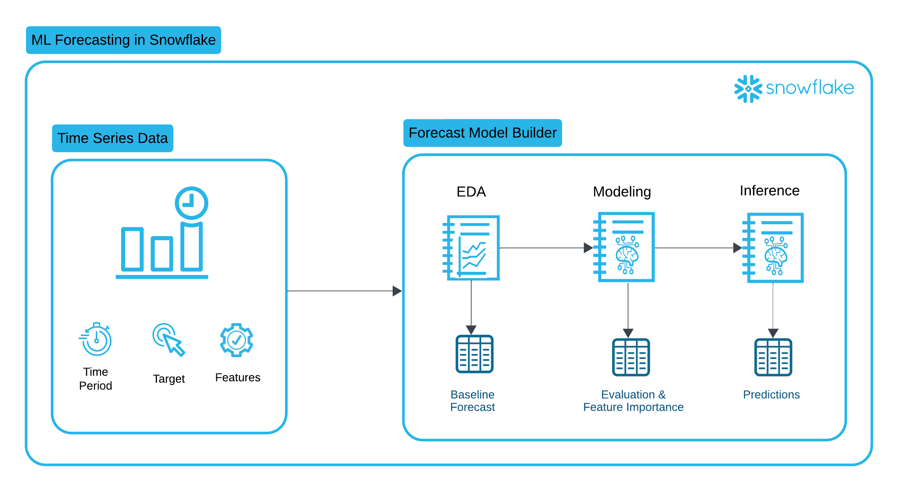
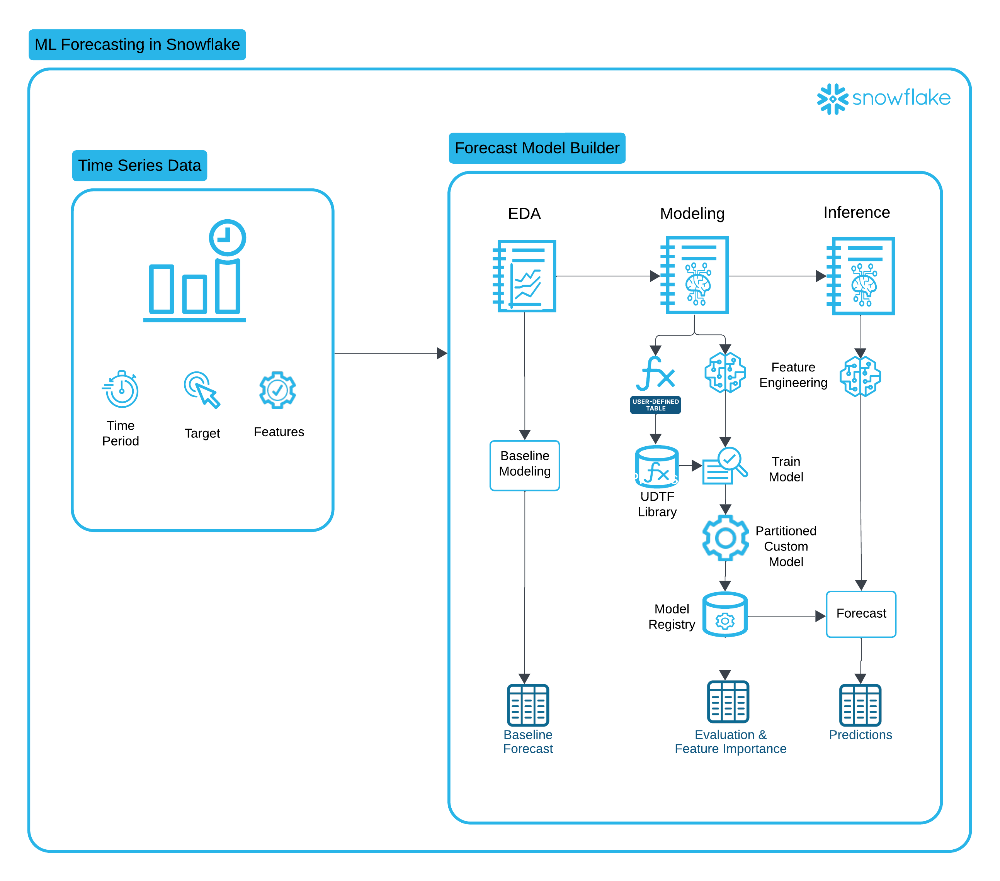
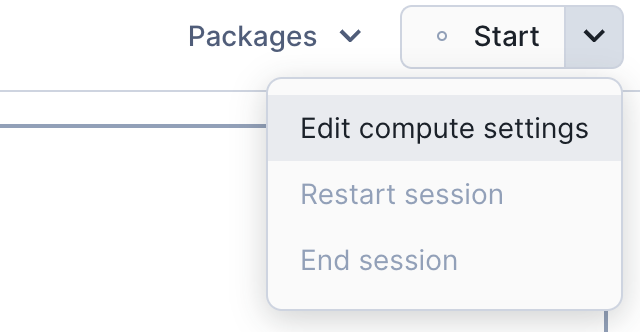
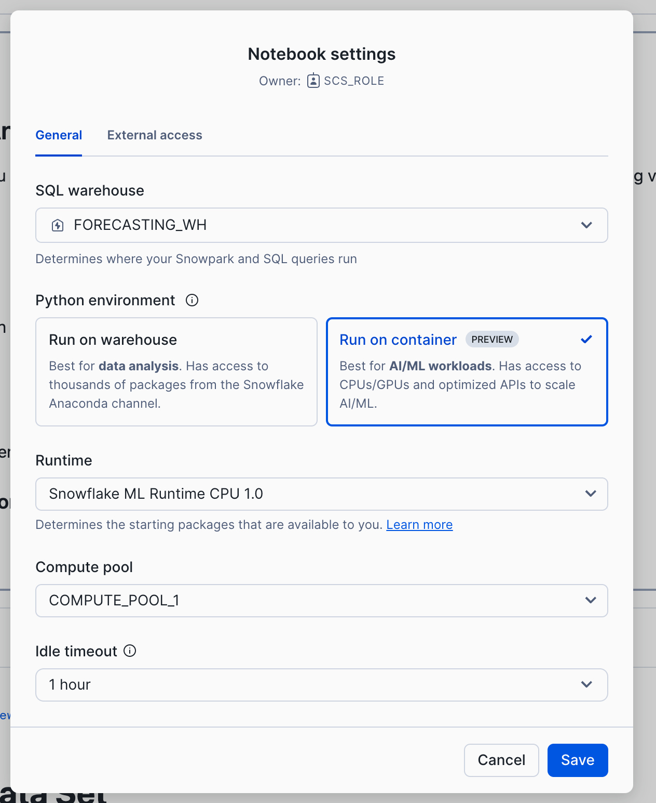

author: Rachel Blum
id: building-scalable-time-series-forecasting-models-on-snowflake
categories: snowflake-site:taxonomy/solution-center/certification/quickstart, snowflake-site:taxonomy/product/ai, snowflake-site:taxonomy/snowflake-feature/model-development
language: en
summary: Build scalable time-series forecasting with Snowflake ML for demand planning, inventory optimization, and trend prediction.
environments: web
status: Published
feedback link: https://github.com/Snowflake-Labs/sfguides/issues

# Building Scalable Time Series Forecasting Models on Snowflake
<!-- ------------------------ -->
## Overview 

Forecasting is a business process that predicts future events over time based on historical time-series data, and has cross-industry applicability and utility in nearly every organization. Multiple business units can benefit from this modelling technique to more accurately predict performance, demand, or or any activity that can lead to improved business reactivity and optimization.

The Forecast Model Builder accelerates time to value by offering modeling flexibility, a low code environment, and automated model deployment through Snowflake Model Registry. This solution walks through a complete time series forecasting workflow, from Exploratory Data Analysis (EDA) to model training, and finally batch inference and evaluation in Snowflake. By leveraging XGBoost, Snowpark, and Snowflake’s Model Registry, we create a scalable and efficient forecasting solution.

### Prerequisites
- A Github account and access to the [Emerging Solutions Toolbox Github Repository for Forecast Model Builder](https://github.com/Snowflake-Labs/emerging-solutions-toolbox).

### What You’ll Learn 
This guide will walk you through the process of:
- Performing Exploratory Data Analysis on your Time Series Data
- Executing Feature Engineering, Advanced Modeling and Model Registration for your single or multi-series partitioned data
- Running inferencing against the models stored in the Registry

### What You’ll Need 
- A Snowflake account (ideally with CREATE DATABASE permissions). If you do not have a Snowflake account, you can register for a [Snowflake free 30-day trial](https://trial.snowflake.com).
- The aforementioned Github Repository

### What You’ll Build 
- An end-to-end Snowflake Notebook based forecasting solution for your time series data.

<!-- ------------------------ -->
## Architecture and Key Technologies

This solution leverages several key Snowflake features:

- [**Snowflake Notebooks**](https://docs.snowflake.com/en/user-guide/ui-snowsight/notebooks) is a unified development interface in Snowsight that offers an interactive, cell-based programming environment for Python, SQL, and Markdown. In Snowflake Notebooks, you can leverage your Snowflake data to perform exploratory data analysis, develop machine learning models, and perform other data science and data engineering workflows, all within the same interface.

- [**Snowflake Feature Store**](https://docs.snowflake.com/en/developer-guide/snowflake-ml/feature-store/overview): Feature Transformations are standardized and centralized into the Feature Store, ensuring that features used for training, evaluation, and inference are consistent and fresh.

- [**Snowflake Datasetse**](https://docs.snowflake.com/en/developer-guide/snowflake-ml/dataset): Datasets are Snowflake schema-level objects specifically designed for machine learning workflows. Snowflake Datasets hold collections of data organized into versions. Each version holds a materialized snapshot of your data with guaranteed immutability, efficient data access, and interoperability with popular deep learning frameworks.

- [**Snowflake Model Registry**](https://docs.snowflake.com/en/developer-guide/snowflake-ml/model-registry/overview): After training a model, operationalizing the model and running inference in Snowflake starts with logging the model in the Snowflake Model Registry. The Model Registry lets you securely manage models and their metadata in Snowflake, regardless of origin and type, and makes running inference easy. 

- [**Partitioned Models**](https://docs.snowflake.com/en/developer-guide/snowflake-ml/model-registry/partitioned-models): Many datasets can be partitioned into multiple independent subsets. For example, a dataset containing sales data for a chain of stores can be partitioned by store number. A separate model can then be trained for each partition. Training and inference operations on the partitions can be parallelized, reducing the wall-clock time for these operations. Furthermore, since individual stores likely differ significantly in how their features affect their sales, this approach can lead to more accurate inference at the store level.

- [**Snowpark API**](https://docs.snowflake.com/en/developer-guide/snowpark/index) is a developer framework that allows data engineers, data scientists, and developers to write code in Python, Java, or Scala to build data pipelines, machine learning workflows, and data applications directly within Snowflake.

- [**Container Runtime for ML**](https://docs.snowflake.com/en/user-guide/ui-snowsight/notebooks-on-spcs) is a set of preconfigured customizable environments built for machine learning on Snowpark Container Services, covering interactive experimentation and batch ML workloads such as model training, hyperparameter tuning, batch inference and fine tuning. They include the most popular machine learning and deep learning frameworks. Used with Snowflake notebooks, they provide an end-to-end ML experience.

<!-- ------------------------ -->
## Solution Setup

To setup the Forecast Model Builder solution in Snowflake you will:
1) Download from Github and then import the [Forecast_Model_Builder_Deployment.ipynb notebook](https://github.com/Snowflake-Labs/emerging-solutions-toolbox/blob/main/framework-forecast-model-builder/FORECAST_MODEL_BUILDER_DEPLOYMENT.ipynb) to Snowsight.  (For instructions on how create a new Snowflake Notebook from an existing file, please see [this documentation](https://docs.snowflake.com/en/user-guide/ui-snowsight/notebooks-create#create-a-new-notebook) and follow the instructions for creating a notebook from an existing file.)
2) Follow the deployment instructions found in the [Forecast Model Builder README](https://github.com/Snowflake-Labs/emerging-solutions-toolbox/blob/main/framework-forecast-model-builder/README.md) to run the deployment notebook. 

<!-- ------------------------ -->
## Exploratory Data Analysis

Understanding the structure and patterns of time series data is crucial for building accurate forecasting models. This notebook walks through an **Exploratory Data Analysis (EDA)** of time series data, providing statistical summaries and visual insights to inform model development.

**Key Highlights**

- **Seasonality** in time series modeling refers to patterns that repeat at fixed intervals, such as daily, weekly, monthly, or yearly cycles. These patterns can significantly impact the accuracy of time series models, and understanding seasonality is crucial for making accurate predictions. Using Seasonal Decomposition and ACF/PACF analysis, we can understand seasonality better and build models that account for seasonality.  

    *Seasonality Visualizations*
    - Actuals plot
    - Seasonal decomposition
    - ACF/PACF

- **Stationarity** in time series modeling refers to the property of a time series where its statistical properties, such as the mean, variance, and autocorrelation structure, remain constant over time.  The ADF test is a unit root test that will check whether a time series is stationary.  When time series are non-stationary, other data engineering techniques are necessary to account for the changing time series. 

    *Stationarity Tests*
    - Augmented Dickey-Fuller

- **Baseline Analysis (Optional)** performs basic non-ML-based forecasting (baseline modeling) on your data which can be used as a comparison for advanced modeling later

By the end of this notebook, you will have a deep understanding of the dataset’s characteristics, enabling informed decisions on feature engineering and model selection for accurate time series forecasting.
___

To run the EDA Notebook:
1) Go to Projects > Notebooks in Snowsight.  You should see notebooks for EDA, MODELING & INFERENCE with your Project prefix.
2) Open the notebook <YOUR_PROJECT_NAME>_EDA.
3) In the upper right hand corner of your UI, click the down arrow next to the word Start and select 'Edit compute settings'.

    />

4) Select 'Run on container' and click Save.  You will also do this for the Modeling and Inference notebooks.  (Please note that you will need to use a role other than ACCOUNTADMIN, SECURITYADMIN or ORGADMIN to run the notebook on a container.)

    

    />
    

5) Follow the instructions provided in the each notebook cell.

<!-- ------------------------ -->
## Feature Engineering and Advanced Modeling

In this notebook, we explore a **partitioned time series modeling approach** using **XGBoost** and **Snowflake's Snowpark**, enabling efficient and scalable forecasting for large datasets.

**Key Highlights**
- **Feature Engineering for Time Series**  This notebook applies various transformations, including rolling averages, date-based feature expansion, and aggregations to enhance predictive power. These features are then registered in the schema level **Snowflake Feature Store**.

- **Snowflake Integration** Leveraging **Snowpark DataFrames**, we ensure seamless data processing within Snowflake’s environment, reducing the need for external data movement.  

- **XGBoost for Forecasting** The model is trained using **XGBoost**, a powerful gradient boosting algorithm.

- **Efficient Model Deployment**  The workflow includes exporting trained models and registering them in **Snowflake’s Model Registry** for scalable inference.  

By the end of this notebook, you'll have a structured approach to forecasting time series data using Snowflake & XGBoost, optimizing performance while maintaining flexibility across different datasets.
___

To run the Feature Engineering and Advanced Modeling Notebook:
1) Go to Projects > Notebooks in Snowsight.  
2) Open the notebook <YOUR_PROJECT_NAME>_MODELING.
3) Switch to Container Runtime.
4) Follow the instructions provided in the each notebook cell.

<!-- ------------------------ -->
## Evaluation

This notebook is designed to perform **inference and evaluation** using the trained time series model from the modeling pipeline. It leverages **Snowflake's Snowpark** environment to efficiently make predictions on new data, ensuring seamless integration between model training and deployment.

**Key Highlights**
- **Model Deployment & Inference** Uses a pre-trained model from the **Snowflake Model Registry** to generate forecasts on fresh time series data.  

- **Snowflake-Powered Data Processing** Processes large-scale inference data directly within Snowflake, leveraging Snowpark's **distributed computing capabilities** to avoid unnecessary data movement.  

- **Visualize Model Performance with Streamlit** Plots performance metrics for the overall model and individual partitions, allowing efficient drill-down into model evaluation.

- **Promote Model and Create Model Monitor** Track model performance over time as scheduled inference populates the results table.

By the end of this notebook, you'll have a clear understanding of your models performance, giving you confidence to promote it to production and run inference.
___

To run the Evaluation Notebook:
1) Go to Projects > Notebooks in Snowsight. 
2) Open the notebook <YOUR_PROJECT_NAME>_EVALUATION.
3) Switch to Container Runtime.
4) Follow the instructions provided in the each notebook cell.

<!-- ------------------------ -->
## Inference_job

This notebook is designed to perform **scheduled inference** using the trained time series model from the modeling pipeline. It leverages **Snowflake's Snowpark** environment to efficiently identify new records for inference and generate predictions, populating the results table. 

**Key Highlights**
- **Model Deployment & Inference** Uses a pre-trained model from the **Snowflake Model Registry** to generate forecasts on fresh time series data.  

- **Snowflake-Powered Data Processing** Identifies new data for inference and generates predictions, leveraging Snowpark's **distributed computing capabilities** to avoid unnecessary data movement.  

- **Efficient Forecast Storage** Saves inference results into a dedicated Snowflake table, ensuring that forecasts are readily available for downstream analysis and business applications.

- **Scheduled Inference** Easily schedule the notebook as a recurring job to automate forecasting.

By the end of this notebook, you'll have a scalable and efficient pipeline for time series inference, enabling forecasting within Snowflake’s powerful data ecosystem.
___

To run the Inference Notebook:
1) Go to Projects > Notebooks in Snowsight. 
2) Open the notebook <YOUR_PROJECT_NAME>_INFERENCE_JOB.
3) Switch to Container Runtime.
4) Follow the instructions provided in the each notebook cell.
5) To schedule recurring inference, use the notebook scheduling button next to "Run All".

<!-- ------------------------ -->
## Conclusion And Resources

By following this structured workflow, businesses can build scalable, reliable, and high-performing forecasting models. Whether applied to retail traffic, sales predictions, or resource allocation, this pipeline ensures that forecasting models are accurate, interpretable, and easy to deploy in production. 

### What You Learned
After completing all the notebooks in this series, a user has gained a **comprehensive understanding of time series forecasting** and how to implement it efficiently using **Snowflake, Snowpark, and XGBoost**. Specifically, they have learned:

**1. Exploring Time Series Data (EDA)**
- Visualizing trends, seasonality, and anomalies  
- Applying stationarity tests like Augmented Dickey-Fuller (ADF) 
- Understanding autocorrelation through ACF/PACF plots

**2. Feature Engineering for Time Series Forecasting**
- Generating rolling averages, date-based features, and holiday indicators  
- Handling missing data and optimizing features for a machine learning model  

**3. Building and Training a Forecast Model**
- Implementing a **partitioned time series approach** using **XGBoost** 
- Leveraging **Snowpark** for large-scale, in-database model training  
- Evaluating model accuracy and performance  

**4. Evaluating Forecast Results**
- Loading a trained model and applying it to validation data  
- Ensuring consistency between **training and inference pipelines**  
- Storing predictions in **Snowflake tables** for real-time access 
- Visualizing forecast model performance 

By following this workflow, a user is now equipped with the knowledge to build, deploy, and scale time series forecasting models efficiently within Snowflake, enabling data-driven decision-making in real-world business scenarios. 🚀

### Related Resources
- [A Getting Started Guide with Snowflake Notebooks](/en/developers/guides/getting-started-with-snowflake-notebooks/)
- [Getting Started with Snowflake Notebook Container Runtime](/en/developers/guides/notebook-container-runtime/)
- [Train an XGBoost Model with GPUs using Snowflake Notebooks](/en/developers/guides/train-an-xgboost-model-with-gpus-using-snowflake-notebooks/)
