author: Josh Hall
id: building-snowflake-llm-based-functions-with-coalesce
summary: Learn to build Cortex based data pipelines in Coalesce
categories: data-engineering
environments: web
status: Published 
feedback link: https://github.com/Snowflake-Labs/sfguides/issues
tags: Data Engineering, Getting Started

# Snowflake Guide Template
<!-- ------------------------ -->
## Overview 
Duration: 1

Please use [this markdown file](https://raw.githubusercontent.com/Snowflake-Labs/sfguides/master/site/sfguides/sample.md) as a template for writing your own Snowflake Quickstarts. This example guide has elements that you will use when writing your own guides, including: code snippet highlighting, downloading files, inserting photos, and more. 

It is important to include on the first page of your guide the following sections: Prerequisites, What you'll learn, What you'll need, and What you'll build. Remember, part of the purpose of a Snowflake Guide is that the reader will have **built** something by the end of the tutorial; this means that actual code needs to be included (not just pseudo-code).

The rest of this Snowflake Guide explains the steps of writing your own guide. 

### Prerequisites
- Familiarity with Markdown syntax

### What You’ll Learn 
- how to set the metadata for a guide (category, author, id, etc)
- how to set the amount of time each slide will take to finish 
- how to include code snippets 
- how to hyperlink items 
- how to include images 

### What You’ll Need 
- A [GitHub](https://github.com/) Account 
- [VSCode](https://code.visualstudio.com/download) Installed
- [NodeJS](https://nodejs.org/en/download/) Installed
- [GoLang](https://golang.org/doc/install) Installed

### What You’ll Build 
- A Snowflake Guide

<!-- ------------------------ -->
## Setup Work
To complete this lab, please create free trial accounts with Snowflake and Coalesce by following the steps below. You have the option of setting up Git-based version control for your lab, but this is not required to perform the following exercises. Please note that none of your work will be committed to a repository unless you set Git up before developing.

We recommend using Google Chrome as your browser for the best experience.

| Note: Not following these steps will cause delays and reduce your time spent in the Coalesce environment\! |
| :---- |

### Step 1: Create a Snowflake Trial Account  

1. Fill out the Snowflake trial account form [here](https://signup.snowflake.com/?utm_source=google&utm_medium=paidsearch&utm_campaign=na-us-en-brand-trial-exact&utm_content=go-eta-evg-ss-free-trial&utm_term=c-g-snowflake%20trial-e&_bt=579123129595&_bk=snowflake%20trial&_bm=e&_bn=g&_bg=136172947348&gclsrc=aw.ds&gclid=Cj0KCQiAtvSdBhD0ARIsAPf8oNm6YH7UeRqFRkVeQQ-3Akuyx2Ijzy8Yi5Om-mWMjm6dY4IpR1eGvqAaAg3MEALw_wcB). Use an email address that is not associated with an existing Snowflake account.   
     
2. When signing up for your Snowflake account, select the region that is physically closest to you and choose Enterprise as your Snowflake edition. Please note that the Snowflake edition, cloud provider, and region used when following this guide do not matter.   
  

3. After registering, you will receive an email from Snowflake with an activation link and URL for accessing your trial account. Finish setting up your account following the instructions in the email. 

### Step 2: Create a Coalesce Trial Account with Snowflake Partner Connect 

Once you are logged into your Snowflake account, sign up for a free Coalesce trial account using Snowflake Partner Connect. Check your Snowflake account profile to make sure that it contains your fist and last name. 

Once you are logged into your Snowflake account, sign up for a free Coalesce trial account using Snowflake Partner Connect. Check your Snowflake account profile to make sure that it contains your fist and last name. 

1. Select Data Products \> Partner Connect in the navigation bar on the left hand side of your screen and search for Coalesce in the search bar.   
     
   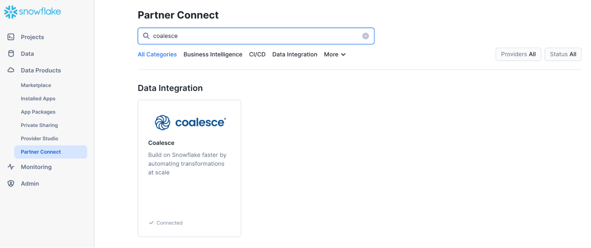
 
2. Review the connection information and then click Connect. 

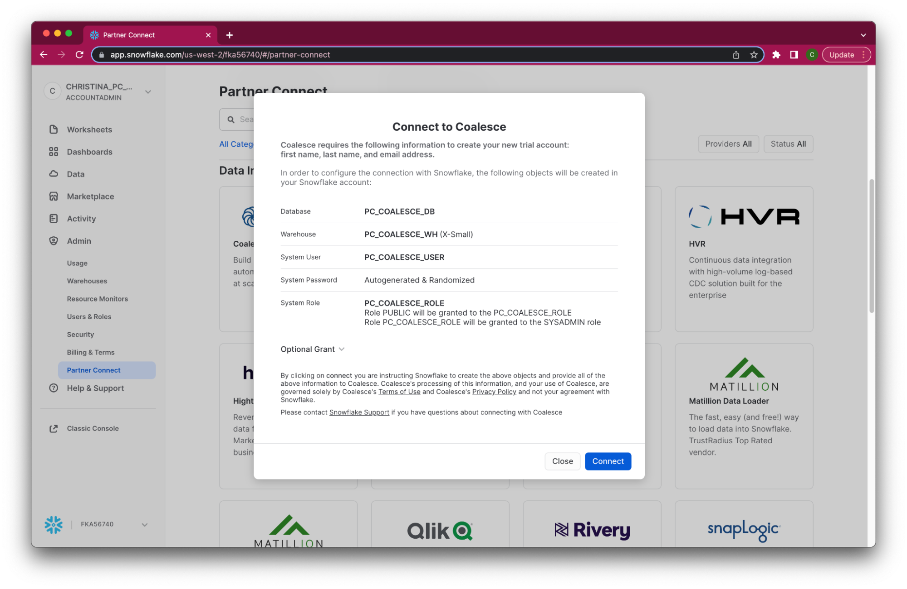

3. When prompted, click Activate to activate your account. You can also activate your account later using the activation link emailed to your address. 

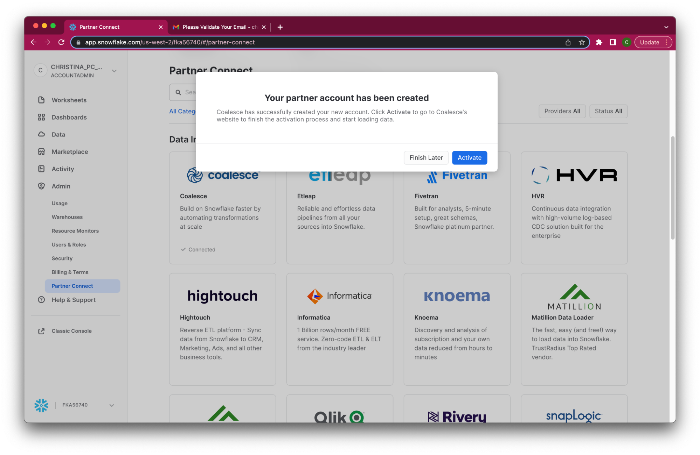
4. Once you’ve activated your account, fill in your information to complete the activation process. 

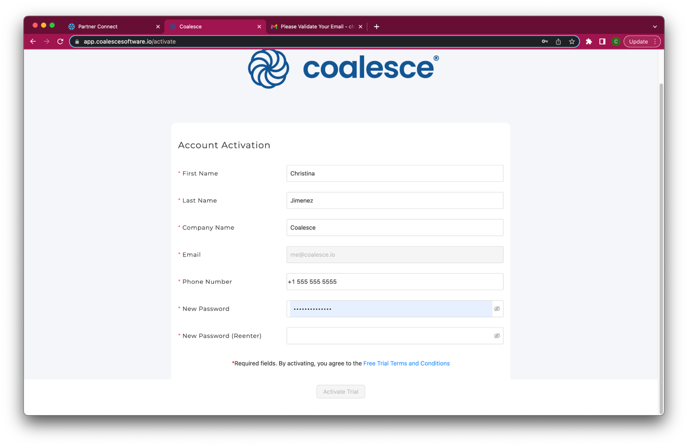

Congratulations\! You’ve successfully created your Coalesce trial account. 

### Step 3: Set Up The Ski Store Dataset

1. We will be using a M Warehouse size within Snowflake for this lab. You can upgrade this within the admin tab of your Snowflake account.

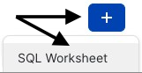

2. In your Snowflake account, click on the Worksheets Tab in the left-hand navigation bar.

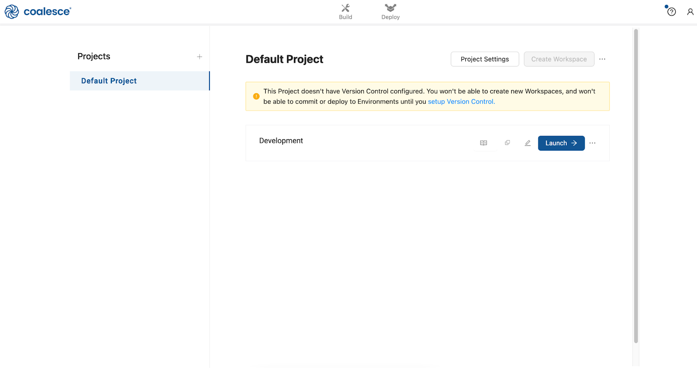

3. Within Worksheets, click the "+" button in the top-right corner of Snowsight and choose "SQL Worksheet.”   
   

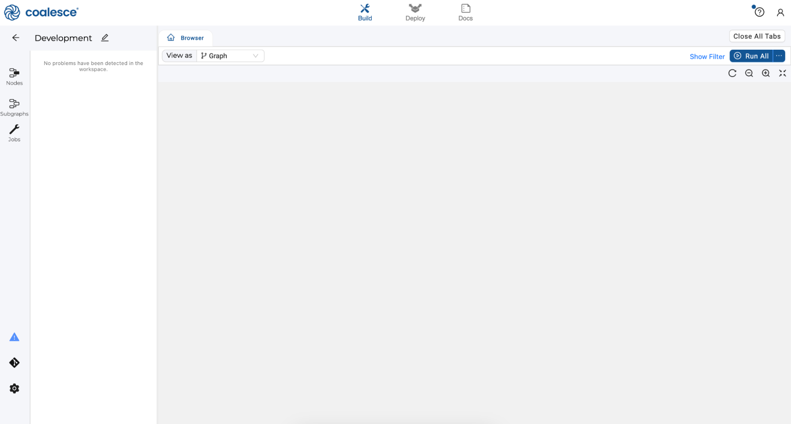

4. Paste the setup SQL from below into the worksheet that you just created:

```
CREATE or REPLACE schema pc_coalesce_db.calls;

CREATE or REPLACE file format csvformat
  SKIP_HEADER = 1
  FIELD_OPTIONALLY_ENCLOSED_BY = '"'
  type = 'CSV';

CREATE or REPLACE stage pc_coalesce_db.calls.call_transcripts_data_stage
  file_format = csvformat
  url = 's3://sfquickstarts/misc/call_transcripts/';

CREATE or REPLACE table pc_coalesce_db.calls.CALL_TRANSCRIPTS ( 
  date_created date,
  language varchar(60),
  country varchar(60),
  product varchar(60),
  category varchar(60),
  damage_type varchar(90),
  transcript varchar
);

COPY into pc_coalesce_db.calls.CALL_TRANSCRIPTS
  from @pc_coalesce_db.calls.call_transcripts_data_stage;

```

### Step 4: Add the Cortex Package from the Coalesce Marketplace

You will need to add the ML Forecast node into your Coalesce workspace in order to complete this lab. 

1. Launch your workspace within your Coalesce account 

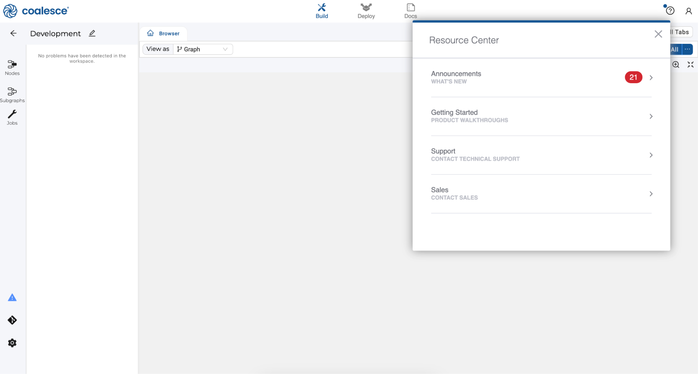

2. Navigate to the build settings in the lower left hand corner of the left sidebar


3. Select Packages from the Build Settings options  
    

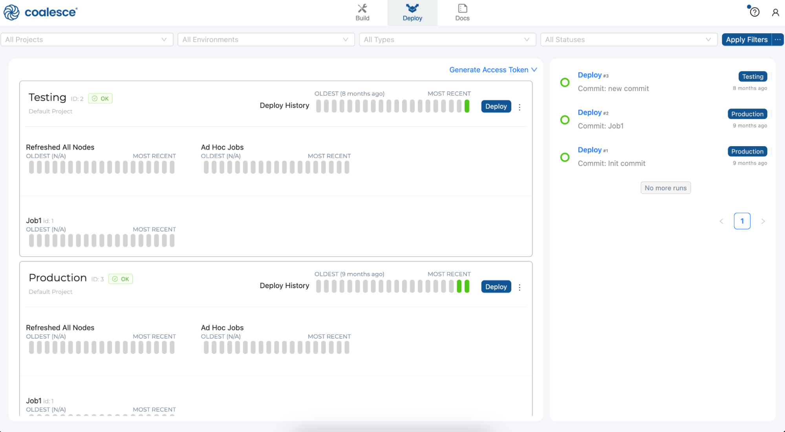

4. Select Browse to Launch the Coalesce Marketplace 

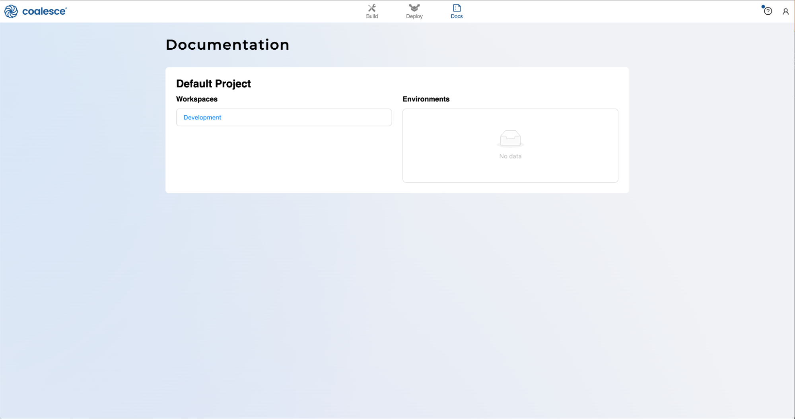

5. Select Find out more within the Cortex package

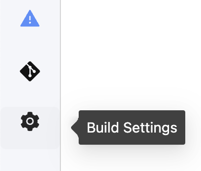

6. Copy the package ID from the Cortex page   
   

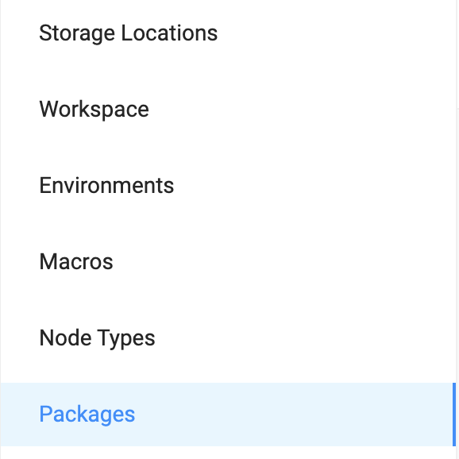

7. Back in Coalesce, select the Install button:

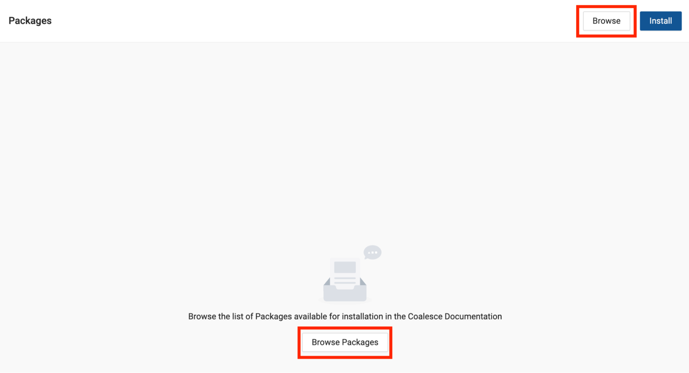

8. Paste the Package ID into the corresponding input box:

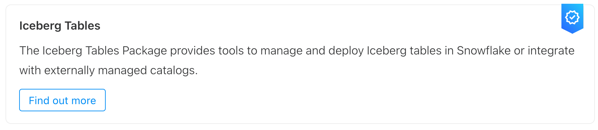

9. Give the package an Alias, which is the name of the package that will appear within the Build Interface of Coalesce. And finish by clicking Install. 


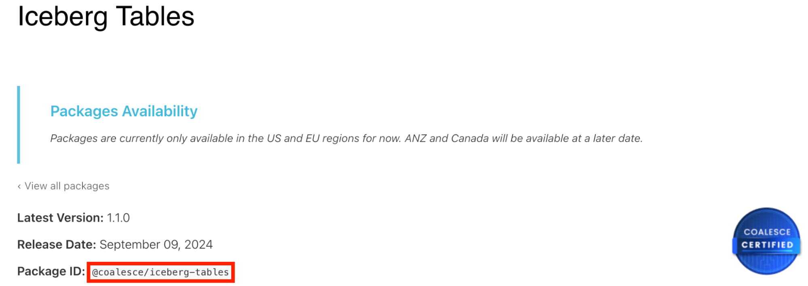

<!-- ------------------------ -->
## Navigating the Coalesce User Interface 

| About this lab: Screenshots (product images, sample code, environments) depict examples and results that may vary slightly from what you see when you complete the exercises. This lab exercise does not include Git (version control). Please note that if you continue developing in your Coalesce account after this lab, none of your work will be saved or committed to a repository unless you set up before developing.   |
| :---- |

Let's get familiar with Coalesce by walking through the basic components of the user interface. 

​​Once you've activated your Coalesce trial account and logged in, you will land in your Projects dashboard. Projects are a useful way of organizing your development work by a specific purpose or team goal, similar to how folders help you organize documents in Google Drive.

Your trial account includes a default Project to help you get started. 


1. Launch your Development Workspace by clicking the Launch button and navigate to the Build Interface of the Coalesce UI. This is where you can create, modify and publish nodes that will transform your data.   
     
   Nodes are visual representations of objects in Snowflake that can be arranged to create a Directed Acyclic Graph (DAG or Graph). A DAG is a conceptual representation of the nodes within your data pipeline and their relationships to and dependencies on each other.

2. In the Browser tab of the Build interface, you can visualize your node graph using the Graph, Node Grid, and Column Grid views. In the upper right hand corner, there is a person-shaped icon where you can manage your account and user settings.  

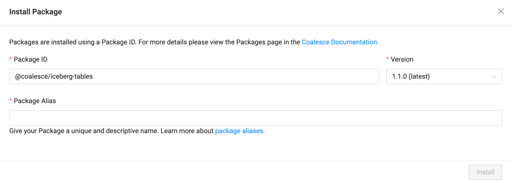

3. By clicking the question mark icon, you can access the Resource Center to find product guides, view announcements, request support, and share feedback.  
   

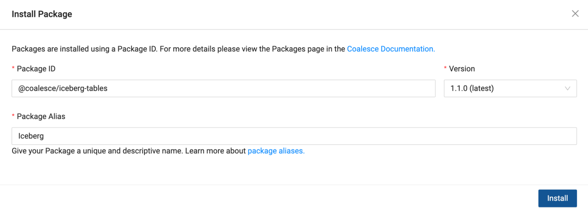

4. The Browser tab of the Build interface is where you’ll build your pipelines using nodes. You can visualize your graph of these nodes using the Graph, Node Grid, and Column Grid views. While this area is currently empty, we will build out nodes and our Graph in subsequent steps of this lab.  

5. Next to the Build interface is the Deploy interface. This is where you will push your pipeline to other environments such as Testing or Production. 

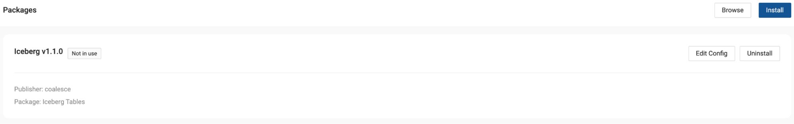

6. Next to the Deploy interface is the Docs interface. Documentation is an essential step in building a sustainable data architecture, but is sometimes put aside to focus on development work to meet deadlines. To help with this, Coalesce automatically generates and updates documentation as you work. 

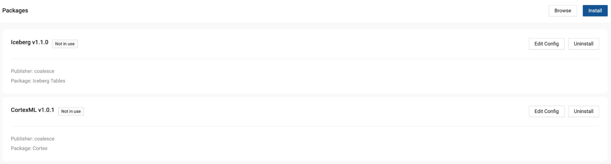

<!-- ------------------------ -->
## Configure Storage Locations and Mappings 

Before you can begin transforming your data, you will need to configure a storage location. Storage locations represent a logical destination in Snowflake for your database objects such as views and tables. 

1. To add a storage location, navigate to the left side of your screen and click on the Build settings cog. 

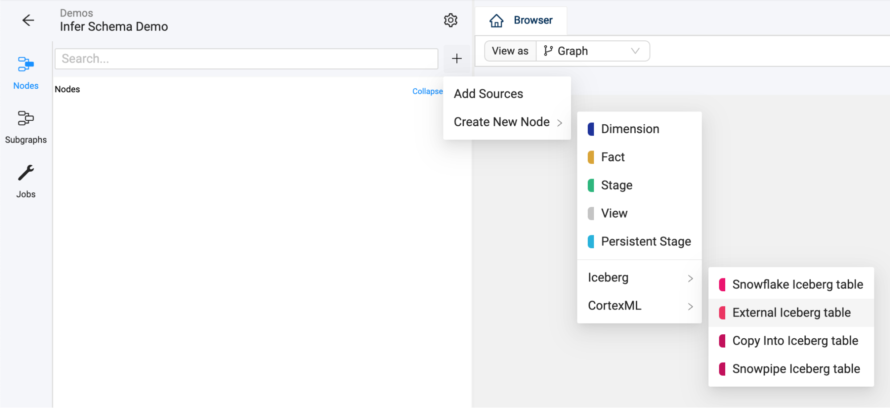

2. Click the “Add New Storage Locations” button and name it CALLS for your call transcript data.

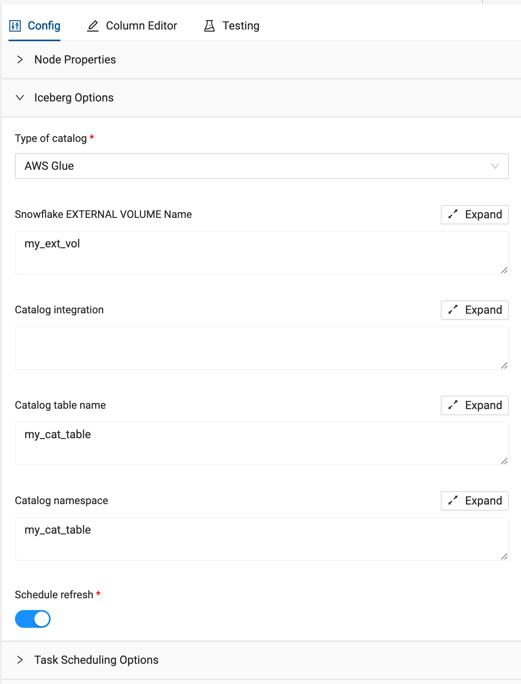

3. Now map your storage locations to their physical destinations in Snowflake. In the upper left corner next to your Workspace name, click on the gear icon to open your Workspace settings. Click on Storage Mappings and map your CALL  location to the PC\_COALESCE\_DB database and the CALLS schema. 

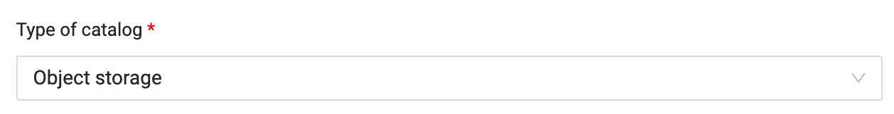

4. Click save, and you have successfully configured your new storage location to provide Coalesce to work with the call transcript data. 

   

5. In the Build settings of the workspace, navigate to Node Types and toggle on View. 

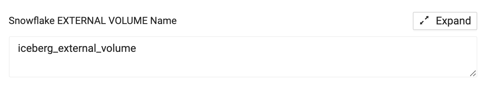

 
<!-- ------------------------ -->
## Adding Data Sources 

Let’s start to build the foundation of your LLM data pipeline by creating a Graph (DAG) and adding data in the form of Source nodes. 

1. Start in the Build interface and click on Nodes in the left sidebar (if not already open). Click the \+ icon and select Add Sources. 

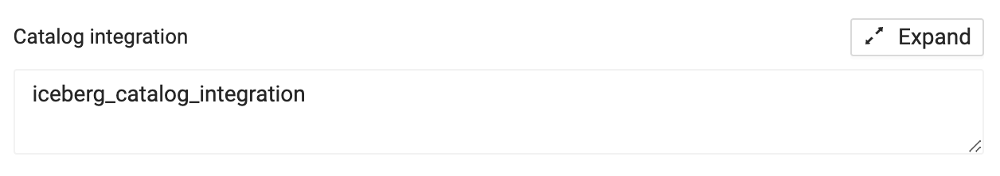

2. Select the CALL\_TRANSCRIPTS table from the CALLS source storage location. Then click the Add 1 Sources button. 

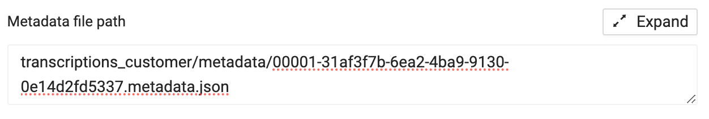

3. You'll now see your graph populated with your Source node. Note that the node is designated in red. Each node type in Coalesce has its own color associated with it, which helps with visual organization when viewing a Graph. 

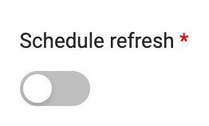

<!-- ------------------------ -->
## Creating Stage Nodes 

Now that you’ve added your Source node, let’s prepare the data by adding business logic with Stage nodes. Stage nodes represent staging tables within Snowflake where transformations can be previewed and performed. Let's start by adding a standardized "stage layer" for the data source.

1. Select the CALL\_TRANSCRIPT source node then right click and select Add Node \> Stage from the drop down menu. This will create a new stage node and Coalesce will automatically open the mapping grid of the node for you to begin transforming your data. 

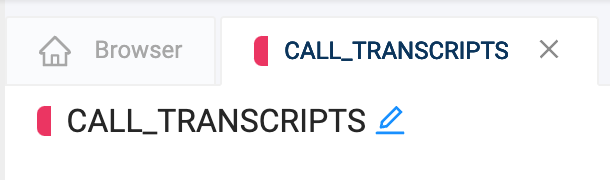

2. Within the Node, the large middle section is your Mapping grid, where you can see the structure of your node along with column metadata like transformations, data types, and sources.   
   

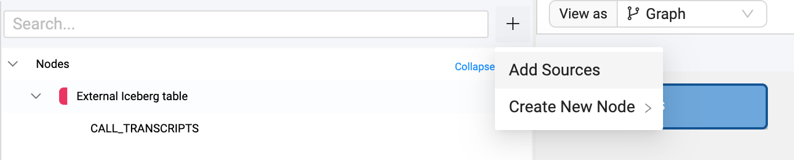

3. On the right hand side of the Node Editor is the Config section, where you can view and set configurations based on the type of node you’re using.   

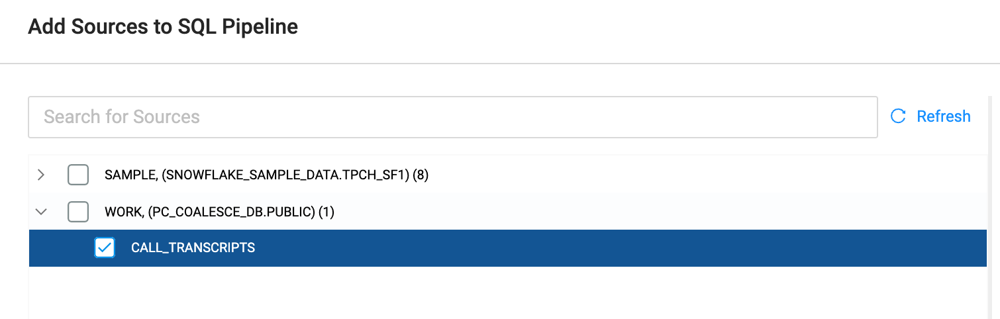

     
4. At the bottom of the Node Editor, press the arrow button to view the Data Preview pane. 

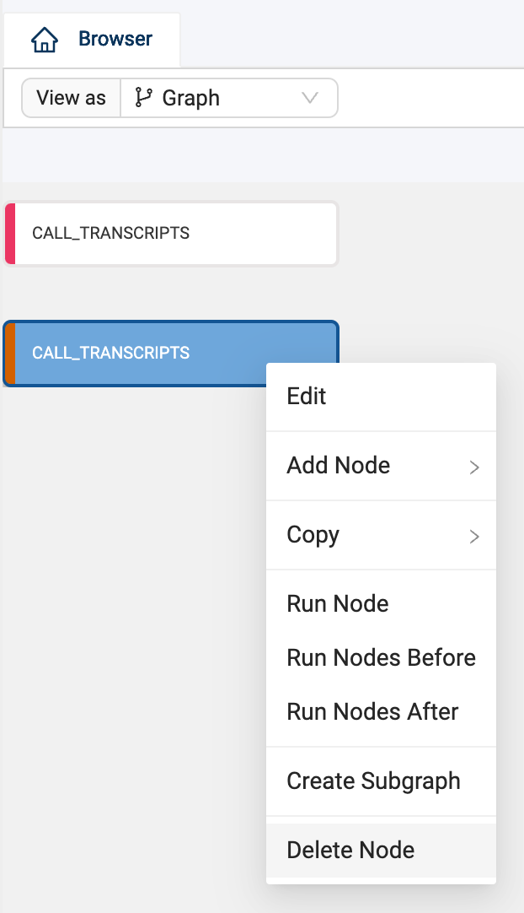

5. Rename the node to STG\_CALL\_TRANSCRIPTS\_GERMAN

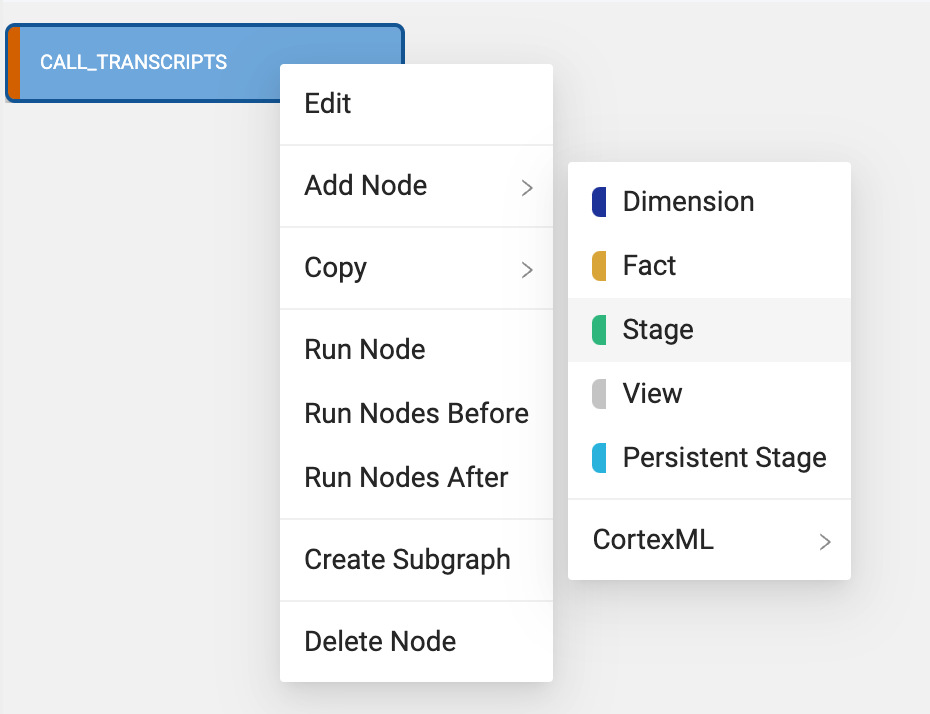

6. Within Coalesce, you can use the Transform column to write column level transformations using standard Snowflake SQL. We will transform the Category column to use an upper case format using the following function: 

	UPPER({{SRC}})

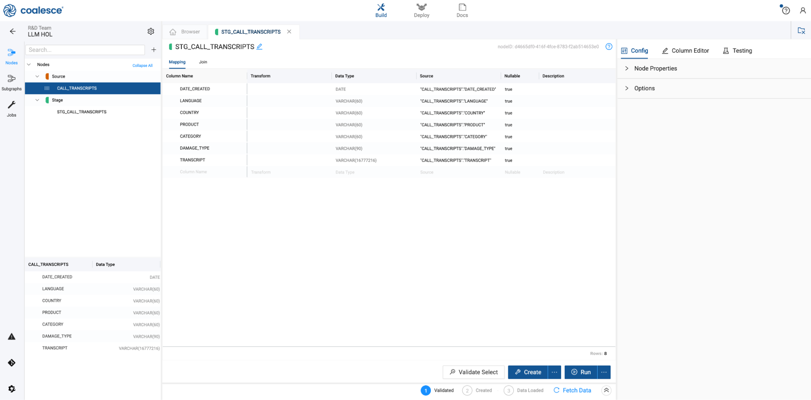

7. Coalesce also allows you to write as much custom SQL as needed for your business use case. In this case, we need to process French and German language records in separate tables so that we can pass each language to its own Cortex translation function and union the tables together.

   To do this, navigate to the Join tab, where you will see the node dependency listed within the Ref function. Within the Join tab, we can write any Snowflake supported SQL. In this use case, we will add a filter to limit our dataset to only records with German data, using the following code snippet: 

   

   WHERE "LANGUAGE" \= 'German'

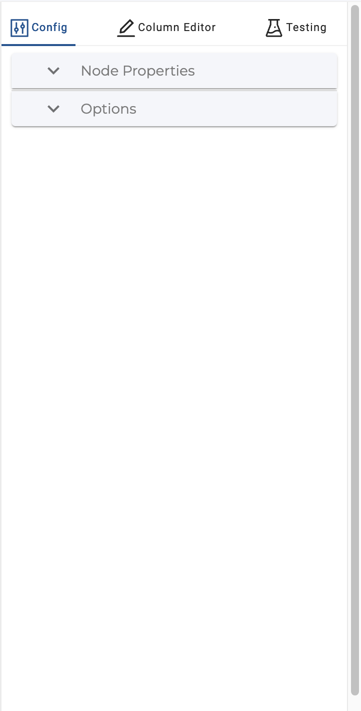

8. Now that we have transformed and filtered the data for our German node, we now need to process our French data. Coalesce leverages metadata to allow users to quickly and easily build objects in Snowflake. Because of this metadata, users can duplicate existing objects, allowing everything contained in one node to be duplicated in another, including SQL transformations. 

	  
Navigate back to the Build Interface and right click on the STG\_CALL\_TRANSCRIPTS\_GERMAN node and select duplicate node. 

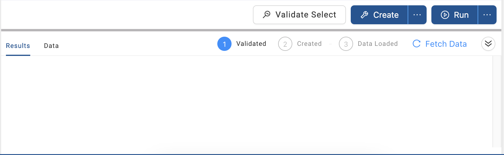

9. Double click on the duplicated node, and once inside the node, rename the node to STG\_CALL\_TRANSCRIPTS\_FRENCH. 

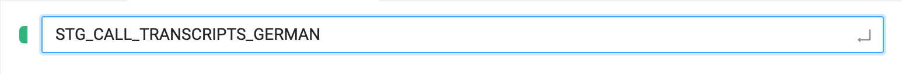

10. Navigate to the Join tab, where we will update the where condition to an IN to include both French and English data.   
      
    WHERE "LANGUAGE" IN ('French', 'English')

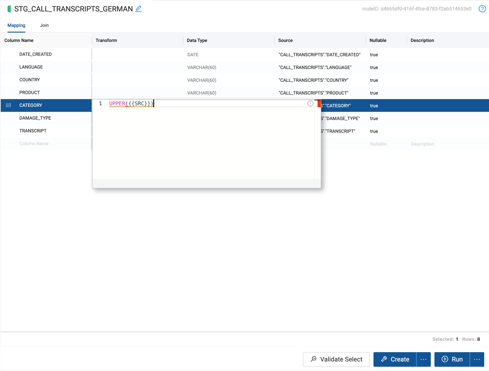

11. All the changes made from the STG\_CALL\_TRANSCRIPTS\_GERMAN carry over into this node, so we don’t need to rewrite any of our transformations. Let’s change the view back to Graph and select Create All and then Run All

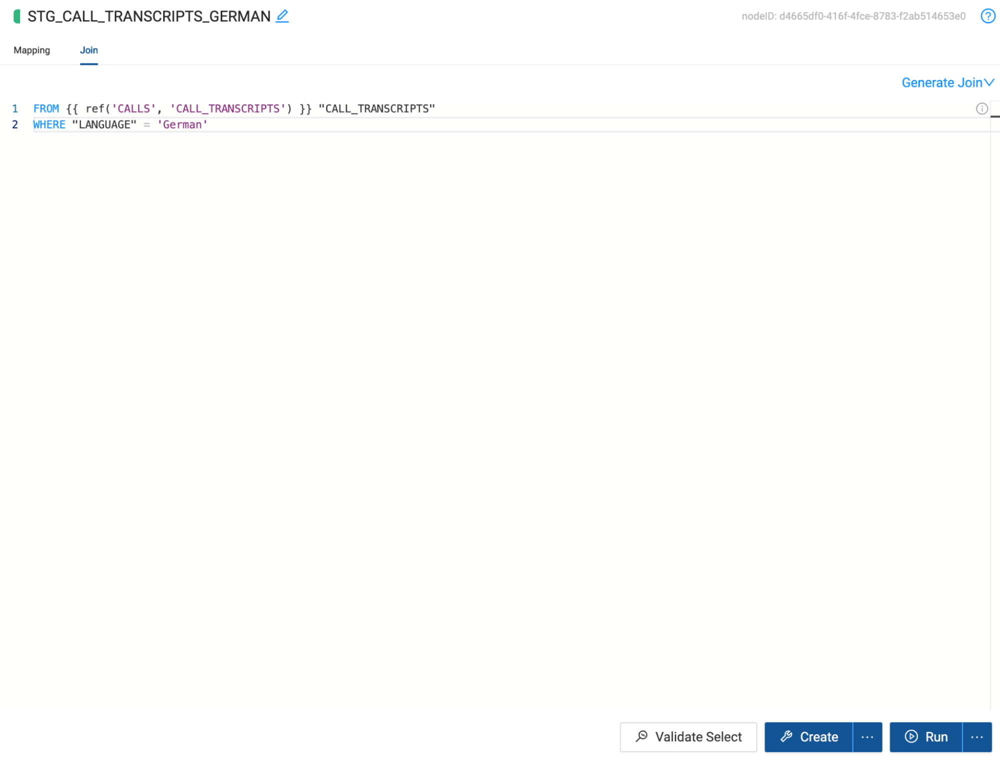

<!-- ------------------------ -->
## Translating Text Data with Cortex LLM Functions 

Now that we have prepared the call transcript data by creating nodes for each language, we can now process the language of the transcripts and translate them into a singular language. In this case, English. 

1. Select the STG\_CALL\_TRANSCRIPTS\_GERMAN node and hold the Shift key and select the STG\_CALL\_TRANSCRIPTS\_FRENCH node. Right click on either node and navigate to Add Node. You should see the Cortex package that you installed from the Coalesce Marketplace. By hovering over the Cortex package, you should see the available nodes. Select Cortex Functions. This will add the Cortex Function node to each STG node.   
   

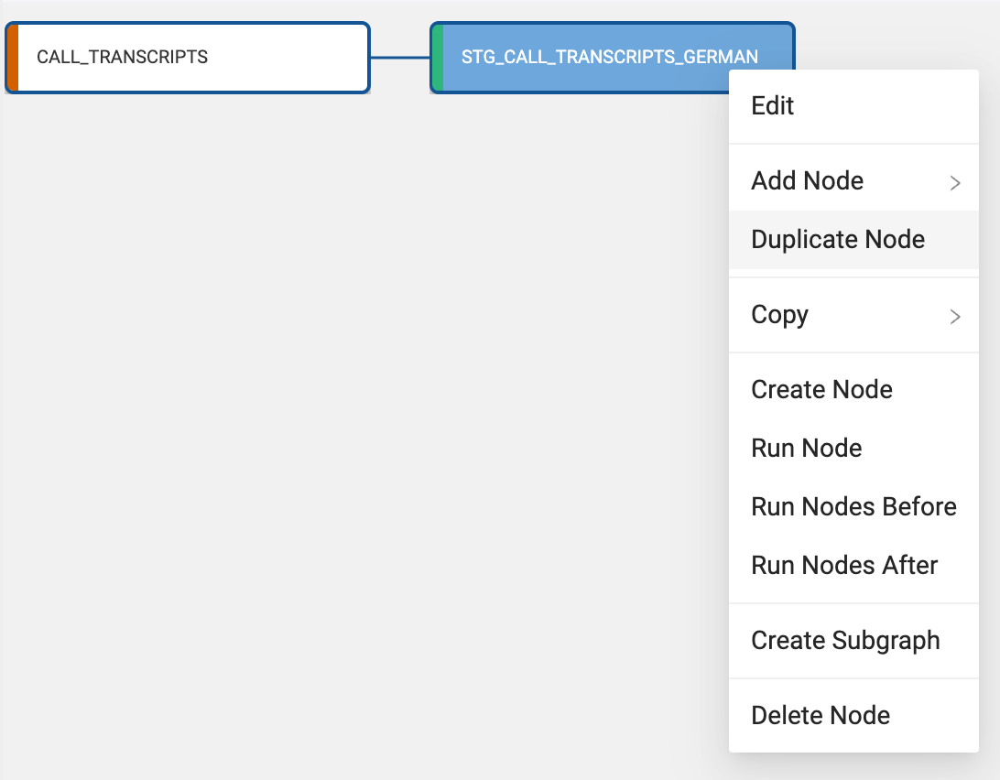

2. You now need to configure the Cortex Function nodes to translate the language of the transcripts. Double click on the LLM\_CALL\_TRANSCRIPTS\_GERMAN node to open it. 

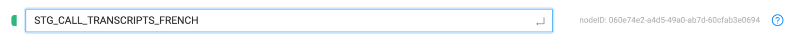

3. In the configuration options on the right hand side of the node, open the Cortex Package dropdown and toggle on TRANSLATE. 

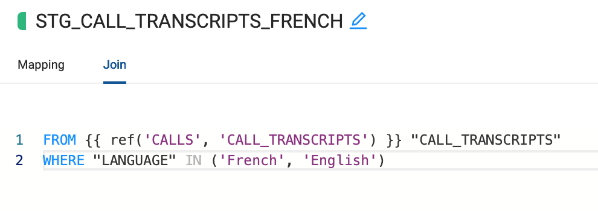

4. With the TRANSLATE toggle on, In the column name selector dropdown, you need to select the column to translate. In this case, the TRANSCRIPT column. 

   
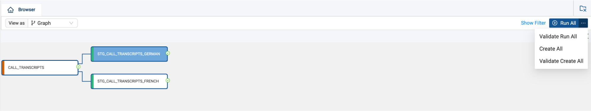

5. Now that you have selected the column that will be translated, you will pass through the language you wish to translate from and the language you wish to translate to, into the translation text box. In this case, you want to translate from German to English. The language code for this translation is as follows: 

	'de', 'en'

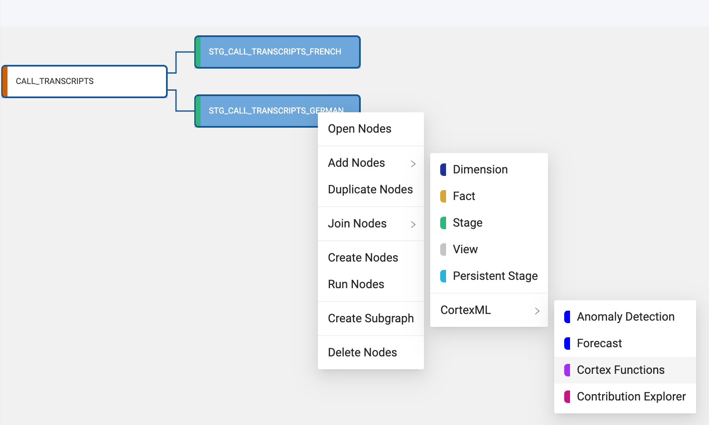

6. Now that you have configured the LLM node to translate German data to English, you can click Create and Run to build the table in Snowflake and populate it with data. 

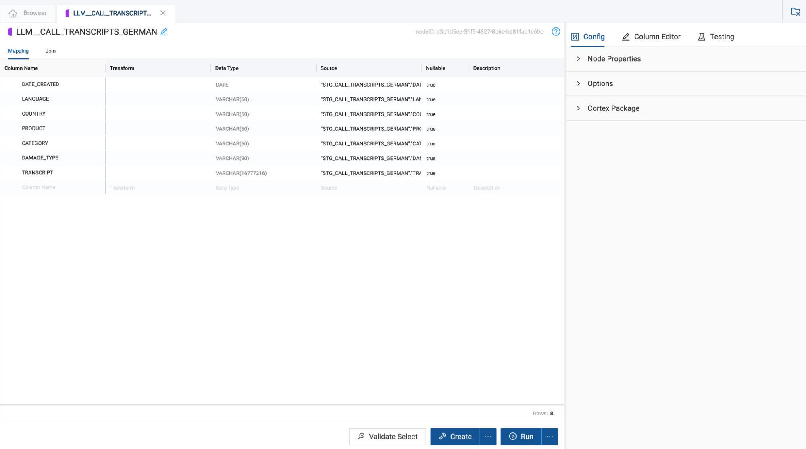

7. While the LLM\_CALL\_TRANSCRIPT\_GERMAN node is running, you can configure the LLM\_CALL\_TRANSCRIPT\_FRENCH. Double click on the LLM\_CALL\_TRANSCRIPT\_FRENCH node to open it. 

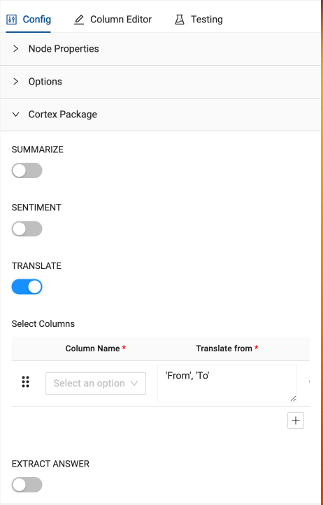

8. Open the Cortex Package dropdown on the right hand side of the node and toggle on TRANSLATE. 

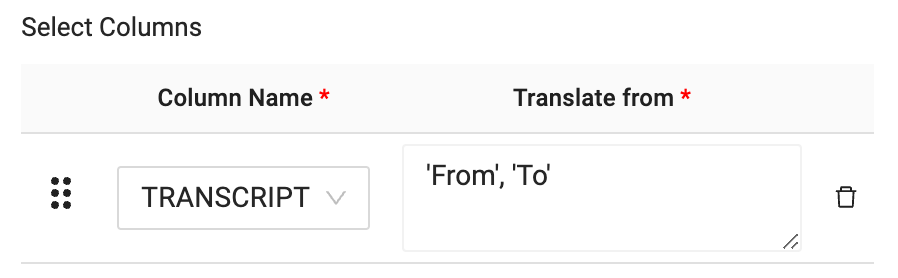

9. Just like the German node translation, you will pass the TRANSCRIPT column through as the column you want to translate. 

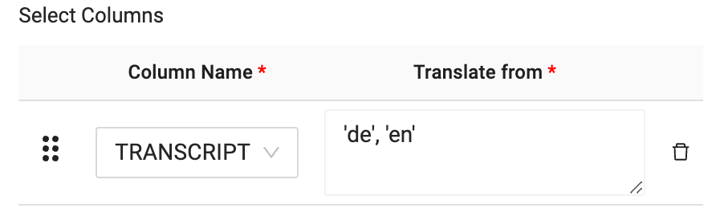

10. Finally, you will configure the language code for what you wish to translate the language of the transcript column from to the language you wish to translate to. In this case, the language code is as follows: 

	'fr', 'en'

Any values in the transcript field which do not match the language being translated from will be ignored. In this case, there are both French and English language values in the TRANSCRIPT field. Because the English values are not in French, they will automatically pass through as their original values. Since those values are already in English, they don’t require any additional processing. 

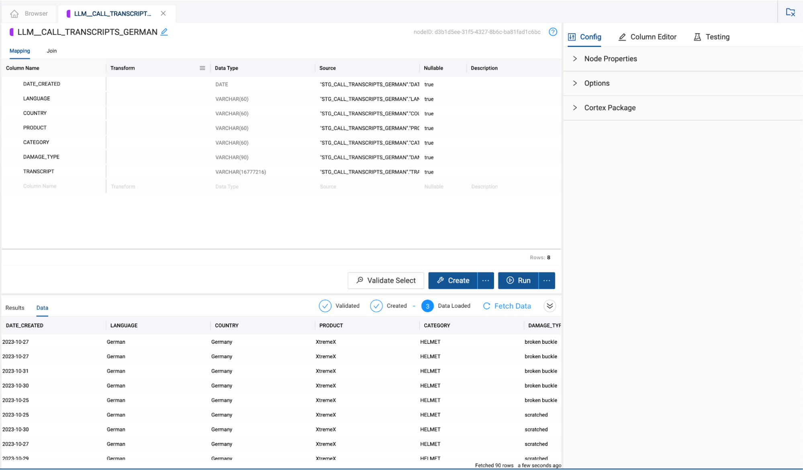

11. Select Create and Run to build the object in Snowflake and populate it with data

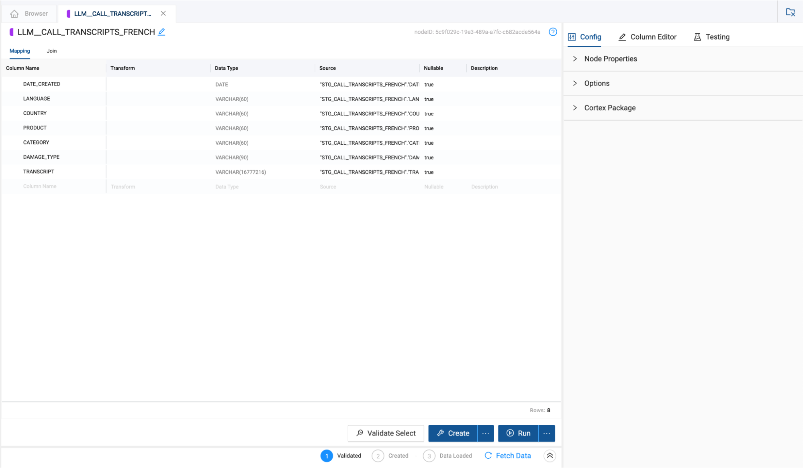

<!-- ------------------------ -->
## Unifying the Translated Data 

You have now processed the transcript data by translating the German and French transcripts into English. However, this translated data exists in two different tables, and in order to build an analysis on all of our transcript data, we need to unify the two tables together into one. 

1. Select the LLM\_CALL\_TRANSCRIPTS\_GERMAN node and Add Node \> Stage. 

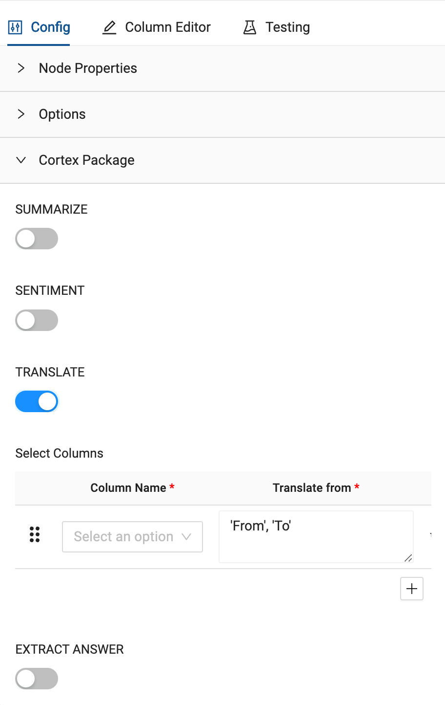

2. Rename the node to STG\_CALL\_TRANSCRIPTS\_ALL.

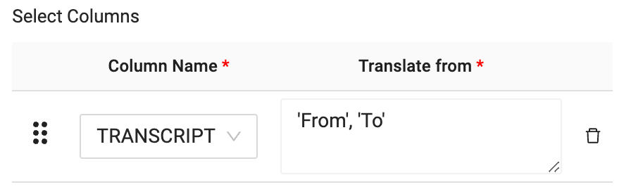

3. In the configuration options on the right hand side of the node, open the options dropdown and toggle on Multi Source. 


4. Multi Source allows you to union together nodes with the same schema without having to write any of the code to do so. Click on the Multi Source Strategy dropdown and select UNION ALL. 


5. There will be a union pane next to the columns in the mapping grid that will list all of the nodes associated with the multi source strategy of the node. Click the \+ button to add a node to union to the current node. You will see a new node get added to the pane called New Source. 


6. Within this new source, there is an area to drag and drop any node from your workspace into the grid to automatically map the columns to the original node. Make sure you have the Nodes navigation menu item selected so you can view all of the nodes in your project. 


7. You will now drag and drop the LLM\_CALL\_TRANSCRIPTS\_FRENCH node into the multi source mapping area of the node. This will automatically map the columns to the original node i.e. LLM\_CALL\_TRANSCRIPTS\_GERMAN. 


8. Finally, select the join tab to configure the reference of the node we are mapping. Using metadata, Coalesce is automatically able to generate this reference for you. Hover over the Generate Join button and select Copy to Editor. Coalesce will automatically insert the code into the editor, and just like that, you have successfully unioned together the two datasets without writing a single line of code. 


9. Select Create and Run to build the object and populate it with data. 


<!-- ------------------------ -->
## Sentiment Analysis and Finding Customers 

Now that we have all of our translated transcript data in the same table, we can now begin our analysis and extract insights from the data. For the sake of our use case, we want to perform a sentiment analysis on the Transcript, to understand how each of our customers felt during their interaction with our company. 

Additionally, our call center reps are trained to ask for the customer’s name when someone calls into the call center. Since we have this information, we want to extract the customer name from the transcript so we can associate the sentiment score with our customer to better understand their experience with our company. 

1. Right click on the STG\_CALL\_TRANSCRIPTS\_ALL node and we will add one last Cortex Function node. Add Node \> CortexML \> Cortex Functions. 


2. Within the node click on the Cortex Package dropdown and toggle on SENTIMENT and EXTRACT ANSWER.   
   


3. When cortex functions are applied to a column, they overwrite the preexisting values of the column. Because of this, you will need two transcript columns to pass through to your two functions. One to perform the sentiment analysis, and one to extract the customer name from the transcript. Right click on the TRANSCRIPT column and select Duplicate Column. 


4. Double click on the original TRANSCRIPT column name and rename the column to TRANSCRIPT\_SENTIMENT. 


5. Double click on the duplicated TRANSCRIPT column name and rename the column to TRANSCRIPT\_CUSTOMER.   
   


6. Next, double click on the data type value for the TRANSCRIPT\_CUSTOMER column. Change the data type to ARRAY. This is necessary because the output of the EXTRACT ANSWER function is an array that contains JSON values from the extraction.   
   


7. Now that your columns are ready to be processed, we can pass them through to each function in the Cortex Package. For the SENTIMENT ANALYSIS, select the TRANSCRIPT\_SENTIMENT column as the column name. 


8. For the EXTRACT ANSWER function, select the TRANSCRIPT\_CUSTOMER column as the column name. 


9. The EXTRACT ANSWER function accepts a plain text question as a parameter to use to extract the values from the text being processed. In this case, we’ll ask the question “Who is the customer?”


10. With the node fully configured to process our sentiment analysis and answer extraction, you can Create and Run the node to build the object and populate it with the values being processed.   
    


<!-- ------------------------ -->
## Process and Expose results with a View 

You have now used Cortex LLM Functions to process all of your text data without writing any code to configure the cortex functions, which are now ready for analysis. Let’s perform some final transformations to expose for your analysis. 

1. Right click on the LLM\_CALL\_TRANSCRIPTS\_ALL node and Add Node \> View. 


2. Select the Create button and then Fetch Data. You will see the output from our LLM functions is the sentiment score and an array value containing a customer value with a confidence interval. We want to be able to extract the customer name out of the array value so we can associate the sentiment score with the customer name. 

   Right click on the TRANSCRIPT\_CUSTOMER column and hover over Derive Mappings and select From JSON. 


3. You will see two new columns automatically created. Answer and score. The answer column contains our customer name. Double click on the answer column name and rename it to CUSTOMER. 


4. Rename the score column to CONFIDENCE\_SCORE.   
   


5. Rerun the view by selecting Create, which will automatically rerun the query that generates the view, which will contain the updated CUSTOMER column we just created. 


<!-- ------------------------ -->
## Analyzing the output in Snowflake 

Now that you have created a view in Snowflake that contains all of the data you needed for your analysis, you can query the view we just created to learn more about the data. 

1. Open a worksheet in Snowflake and paste in the following query which analyzes the sentiment of each customer.   
     
   select customer, transcript\_sentiment  
   from pc\_coalesce\_db.public.v\_call\_transcripts\_all  
   where confidence\_score \> .8  
     
   This query is allowing us to view all of the customers and their associated sentiment, where the likelihood of the customer name being correct is 80% or higher.   
     
2. You can use Snowsight to graphically represent this data. Select Chart from the results pane and select a Bar chart if not already selected.   
   


Additionally, you can uncheck the box next to Limit number of bars to see all of your results. 

3. Another question you may need to answer for the business, is what damage types have the lowest sentiment. You can copy and paste the query here to evaluate the answer to this question. 

	select damage\_type, avg(transcript\_sentiment)  
from pc\_coalesce\_db.public.v\_call\_transcripts\_all  
where transcript\_sentiment \< 0  
group by damage\_type

This query allows you to see the aggregated average sentiment towards damage types, where the sentiment is below zero. This would allow decision makers to understand which damages are the most frustrating for customers, and take action on how to improve processes to avoid these damages. 

4. Again, you can use Snowsight to graphically analyze the data using a chart with bars.  
   


5. With this view now in Snowflake, you can continue to analyze this data and obtain more insights and inferences about everything surrounding the call transcripts that traditionally would be incredibly difficult to gain the same value from without the ease of using Cortex LLM functions in Coalesce. 

<!-- ------------------------ -->
## Conclusion and Next Steps 

Congratulations on completing your lab\! You've mastered the basics of building and managing Snowflake Cortex LLM functions in Coalesce and can now continue to build on what you learned. Be sure to reference this exercise if you ever need a refresher.

We encourage you to continue working with Coalesce by using it with your own data and use cases and by using some of the more advanced capabilities not covered in this lab.

<!-- ------------------------ -->
## What we’ve covered 

* How to navigate the Coalesce interface  
* Configure storage locations and mappings  
* How to add data sources to your graph   
* How to prepare your data for transformations with Stage nodes  
* How to union tables  
* How to set up and configure Cortex LLM Nodes  
* How to analyze the output of your results in Snowflake

Continue with your free trial by loading your own sample or production data and exploring more of Coalesce’s capabilities with our [documentation](https://docs.coalesce.io/docs) and [resources](https://coalesce.io/resources/). For more technical guides on advanced Coalesce and Snowflake features, check out Snowflake Quickstart guides covering [Dynamic Tables](https://quickstarts.snowflake.com/guide/building_dynamic_tables_in_snowflake_with_coalesce/index.html?index=..%2F..index#1) and [Cortex ML functions](https://quickstarts.snowflake.com/guide/ml_forecasting_ad/index.html?index=..%2F..index#0).


<!-- ------------------------ -->
## Additional Coalesce Resources 

* [Getting Started](https://coalesce.io/get-started/)  
* [Documentation](https://docs.coalesce.io/docs) & [Quickstart Guide](https://docs.coalesce.io/docs/quick-start)  
* [Video Tutorials](https://fast.wistia.com/embed/channel/foemj32jtv)  
* [Help Center](https://help.coalesce.io/hc/en-us) 

Reach out to our sales team at [coalesce.io](https://coalesce.io/contact-us/) or by emailing [sales@coalesce.io](mailto:sales@coalesce.io) to learn more\!


<!-- ------------------------ -->
## Conclusion And Resources
Duration: 1

At the end of your Snowflake Guide, always have a clear call to action (CTA). This CTA could be a link to the docs pages, links to videos on youtube, a GitHub repo link, etc. 

If you want to learn more about Snowflake Guide formatting, checkout the official documentation here: [Formatting Guide](https://github.com/googlecodelabs/tools/blob/master/FORMAT-GUIDE.md)

### What You Learned
- creating steps and setting duration
- adding code snippets
- embedding images, videos, and surveys
- importing other markdown files

### Related Resources
- <link to github code repo>
- <link to documentation>
