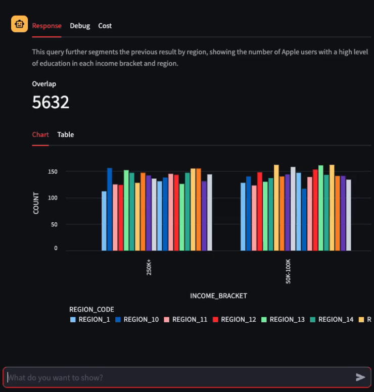
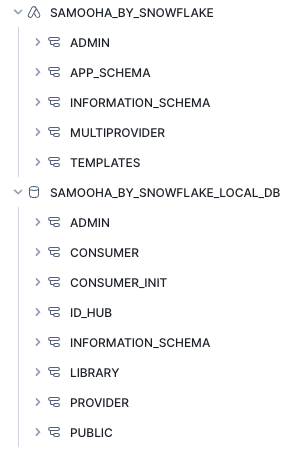
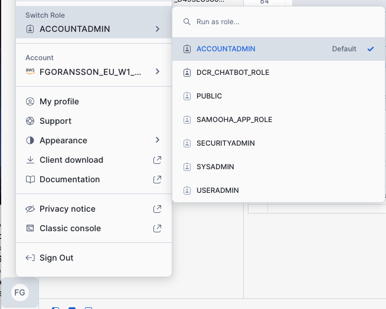
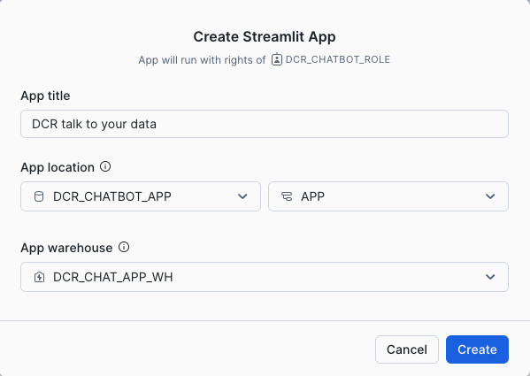
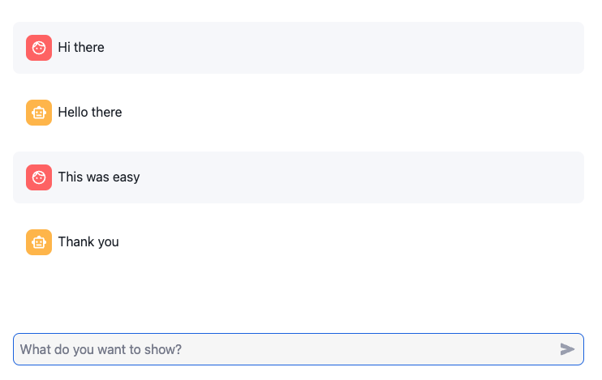
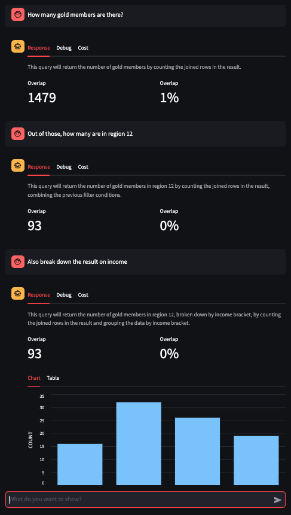

author: Fredrik Göransson
id: building_an_llm_driven_chatbot_for_data_clean_rooms
summary: Building an LLM-driven chatbot for Data Clean Rooms
categories: Cortex
environments: web
status: Published 
feedback link: https://github.com/Snowflake-Labs/sfguides/issues
tags: Snowpark Python, Streamlit, LLMs, CORTEX, Data Clean Rooms

# Building an LLM-driven chatbot for Data Clean Rooms
<!-- ------------------------ -->
<!-- 
███████ ████████ ███████ ██████               ██      
██         ██    ██      ██   ██             ███      
███████    ██    █████   ██████               ██      
     ██    ██    ██      ██                   ██      
███████    ██    ███████ ██                   ██      
-->
## Overview

Duration: 5

In this guide, we will walk through creating a Snowflake Data Clean Room, connecting to it as a Consumer and then building a Chat agent that let's users talk directly to the Data Clean Room and explore the data, without having to know any details about the Data Clean Room or how to operate that.

Here is a summary of what you will be able to learn in each step by following this quickstart:

- **Setup Data Clean Rooms**: We will use Developer Edition of Snowflake Data Clean Rooms to create a new clean room and share it with a Consumer
- **Connect to a Data Clean Room**: Similarily we will use Developer Edition to join a Data Clean Room as a Consumer
- **Create a chatbot in Streamlit**: A basic setup of a chatbot using Streamlit in Snowflake
- **Use Cortex Complete (LLM) to answer questions and build analysis parameters**: We will make use of the managed Cortex Complete function to invoke an LLM to answer natural language questions and build parameters for analysis requests to the Data Clean Room
- **Run analysis in a Data Clean Room**: Finally we will run an analyisis and serve the result in the chatbot using the Data Clean Room APIs
- **Basic Python and Snowpark**: We will use Python and Snowpark to connect it all and serve the results in Streamlit



### What are Snowflake Data Clean Rooms ?

[Snowflake Data Clean Rooms](https://docs.snowflake.com/en/user-guide/cleanrooms/introduction) Snowflake Data Clean Rooms are secure, isolated environments that enable collaborative data analysis while maintaining privacy. They use advanced encryption, access controls, and query restrictions to ensure sensitive data is never exposed, allowing parties to share insights without directly accessing each other's raw data.


### What is Snowflake Cortex ?

[Snowflake Cortex](https://www.snowflake.com/en/data-cloud/cortex/) Snowflake Cortex is an intelligent, fully managed service that offers machine learning and AI solutions to Snowflake users. Snowflake Cortex capabilities include:

LLM Functions: SQL and Python functions that leverage large language models (LLMs) for understanding, querying, translating, summarizing, and generating free-form text.

ML Functions: SQL functions that perform predictive analysis using machine learning to help you gain insights into your structured data and accelerate everyday analytics.

> aside negative
> IMPORTANT: Some of CORTEX's functions and features used in this quickstart are in PrPr and or PuPr.  Please reach out to your account team for enablement.  [Availability](https://docs.snowflake.com/en/user-guide/snowflake-cortex/llm-functions?_ga=2.5151286.405859672.1709568467-277021311.1701887324&_gac=1.124754680.1707955750.Cj0KCQiA5rGuBhCnARIsAN11vgRLWfK6RIoIEqcZ7cFas8qwN4yCoL0q9nttp5UEmSocnPmhdBG57fgaAjqNEALw_wcB&_fsi=j2b82Wl3#availability).

> aside positive
> IMPORTANT: Make sure that the LLM you want to use is available in the region where your Consumer account is located. Refer to the [Availability](https://docs.snowflake.com/user-guide/snowflake-cortex/llm-functions#availability) of Cortex LLM functions before continuing.

### What is Streamlit?

Streamlit enables data engineers and Python developers to combine Streamlit's component-rich, open-source Python library with the scale, performance, and security of the Snowflake platform.

Learn more about [Streamlit](https://www.snowflake.com/en/data-cloud/overview/streamlit-in-snowflake/).

### What You Will Learn

- How to create a Data Clean Room using the Developer Edition APIs
- How to join a Data Clean Room using the Developer Edition APIs
- How to build a simple chatbot using Streamlit in Snowflake
- How to prompt and call Cortex Complete LLM function
- How to run a Data Clean Room analysis using the Developer Edition APIs

### Prerequisites

> aside negative
> IMPORTANT: Snowflake Data Clean Rooms are available to capacity accounts only, this means that you cannot test this guide with a Trial account for instance. The Provider account also needs to be Enterprise Edition or higher to support the data governance policies needed for Data Clean Rooms. [Data Clean Room prerequisites](hhttps://docs.snowflake.com/en/user-guide/cleanrooms/getting-started#prerequisites).

> aside positive
> If your accounts do not meet the requirements yet, but you still want to test this guide and explore the setup, there is a simulated version provided in the code. Look out for notes in the guide and be aware that some steps have to be skipped (such as creating and joining the Data Clean Room).

- Access to [Git](https://git-scm.com/book/en/v2/Getting-Started-Installing-Git) for source code
- ACCOUNTADMIN access and login to one Snowflake capacity accounts with Enterprise Edition or higher
- ACCOUNTADMIN access and login to one Snowflake capacity account with Standard Edition or higher

### Vocabulary

- **LLM**: Large Language Model
- **DCR**: Data Clean Room
- **Provider**: The party in a Data Clean Room (or any collaboration) that shares the data, or in the case of DCRs, owns the clean room
- **Consumer**: The party in the Data Clean Room that uses the clean room and runs analysis on the combined datasets

> aside positive
> IMPORTANT: Before proceeding, make sure you have the correct access to CORTEX as described [here](https://docs.snowflake.com/user-guide/snowflake-cortex/llm-functions#required-privileges).


<!-- ------------------------ -->
<!-- 
███████ ████████ ███████ ██████              ██████   
██         ██    ██      ██   ██                  ██  
███████    ██    █████   ██████               █████   
     ██    ██    ██      ██                  ██       
███████    ██    ███████ ██                  ███████  
-->
## Setting up the Data Clean Room

Duration: 5

The first step is to ensure that Snowflake Data clean Rooms are set up on both the Provider and Consumer account. Setting up Data Clean Rooms on a Snowflake account should be done on both the Provider account and the Consumer account used for this demo.

If you already have Data Clean Rooms set up for the accounts, you can now skip to the next step.

For each account, follow [this walkthrough](https://docs.snowflake.com/en/user-guide/cleanrooms/getting-started) to set it up.

Once each step is completed, you should have the following entities in your Snowflake account
- Native App installed: `SAMOOHA_BY_SNOWFLAKE`
- Database created: `SAMOOHA_BY_SNOWFLAKE_LOCAL_DB`



These two parts are used by the Data Clean Room web-based UI to create, join and run clean rooms. The Developer Edition APIs that we will be using are defined in the `SAMOOHA_BY_SNOWFLAKE_LOCAL_DB` database, and specifically for this guide we will use the Stored Procedures in the `CONSUMER` schema.

To validate that your Data Clean Room environment is set up and you can access it, open up a Worksheet in each account and run the following statement:

````sql
use role SAMOOHA_APP_ROLE;
select version from SAMOOHA_BY_SNOWFLAKE_LOCAL_DB.ADMIN.VERSION;
````

This should return a value, something like `VERSION: 5.8`.

### Creating the Data Clean Room

Log in to the Provider account and open up a new Worksheet for SQL.

````sql
use role samooha_app_role;
use warehouse app_wh;

set cleanroom_name = 'DCR_With_LLM_demo';
call samooha_by_snowflake_local_db.provider.cleanroom_init($cleanroom_name, 'INTERNAL');
call samooha_by_snowflake_local_db.provider.set_default_release_directive($cleanroom_name, 'V1_0', '0');
````

> aside positive
> Note the `INTERNAL` when creating the clean room, this signifies that it can (only) be shared with another account in the same Snwoflake organization. This is great for testing and evaluating the functionality because it does not trigger a security scan of the packaged clean room when it is shared. For a production setup the `EXTERNAL` distribution should be used, but in that case the distribution to the Consumer account(s) may take longer as it goes through the security scan for any external Marketplace distribution. See more [here](https://docs.snowflake.com/en/developer-guide/native-apps/security-run-scan).

This creates the clean room on the Provider side. We now want to connect the data to it. We will use the supplied sample data that comes with the Data Clean Room environment. To make it a little clearer which dataset is which in the clean room, we will create a copy of it and then add that to the clean room.

````sql
USE ROLE ACCOUNTADMIN;
CREATE OR REPLACE DATABASE SAMPLE_DATA;
CREATE OR REPLACE SCHEMA SAMPLE_DATA.DEMO;
GRANT USAGE ON DATABASE SAMPLE_DATA TO ROLE SAMOOHA_APP_ROLE;
GRANT USAGE ON SCHEMA SAMPLE_DATA.DEMO TO ROLE SAMOOHA_APP_ROLE;
GRANT SELECT ON FUTURE TABLES IN SCHEMA SAMPLE_DATA.DEMO TO ROLE SAMOOHA_APP_ROLE;
CREATE OR REPLACE TABLE SAMPLE_DATA.DEMO.PROVIDER_CUSTOMERS AS 
    SELECT HASHED_EMAIL, STATUS, AGE_BAND, DAYS_ACTIVE, REGION_CODE FROM SAMOOHA_SAMPLE_DATABASE.DEMO.CUSTOMERS;

CALL SAMOOHA_BY_SNOWFLAKE_LOCAL_DB.PROVIDER.REGISTER_DB('SAMPLE_DATA');
USE ROLE SAMOOHA_APP_ROLE;
````

With this, we have given the clean room environment access to the new table `PROVIDER_CUSTOMERS`.

We can now add the _template_, _join columns_, and _column policies_ to the clean room.

* The template `prod_overlap_analysis` is a pre-defined template and allows for an overlap analyis between the Provider and the Consumer - i.e. it show how many records on an aggregated level matches between the two datasets.
* The join-policy is for `HASHED_EMAIL` meaining the Consumer dataset can be joined on a column that matches this, but the details of it will never be exposed
* The column policy is for `STATUS`, `AGE_BAND`, `DAYS_ACTIVE` and `REGION_CODE`, meaning that an analysis can use these for filtering and segmentation of the results

````sql
CALL SAMOOHA_BY_SNOWFLAKE_LOCAL_DB.PROVIDER.LINK_DATASETS($CLEANROOM_NAME, ['SAMPLE_DATA.DEMO.PROVIDER_CUSTOMERS']);
CALL SAMOOHA_BY_SNOWFLAKE_LOCAL_DB.PROVIDER.SET_JOIN_POLICY($CLEANROOM_NAME, ['SAMPLE_DATA.DEMO.PROVIDER_CUSTOMERS:HASHED_EMAIL']);
CALL SAMOOHA_BY_SNOWFLAKE_LOCAL_DB.PROVIDER.ADD_TEMPLATES($CLEANROOM_NAME, ['prod_overlap_analysis']);
CALL SAMOOHA_BY_SNOWFLAKE_LOCAL_DB.PROVIDER.SET_COLUMN_POLICY($CLEANROOM_NAME, [
  'prod_overlap_analysis:SAMPLE_DATA.DEMO.PROVIDER_CUSTOMERS:STATUS', 
  'prod_overlap_analysis:SAMPLE_DATA.DEMO.PROVIDER_CUSTOMERS:AGE_BAND', 
  'prod_overlap_analysis:SAMPLE_DATA.DEMO.PROVIDER_CUSTOMERS:DAYS_ACTIVE', 
  'prod_overlap_analysis:SAMPLE_DATA.DEMO.PROVIDER_CUSTOMERS:REGION_CODE']);
call SAMOOHA_BY_SNOWFLAKE_LOCAL_DB.PROVIDER.UPDATE_COLUMN_POLICY_DISTINCT_VALUES($cleanroom_name, ['prod_overlap_analysis']);
````

The last step is to share the clean room with our Consumer account. Log in to Consumer account now to get the details.

````sql
USE ROLE ACCOUNTADMIN;
SELECT CURRENT_ACCOUNT() as CONSUMER_ACCOUNT_LOCATOR, 
  CURRENT_ORGANIZATION_NAME() || '.' || CURRENT_ACCOUNT_NAME() as CONSUMER_ACCOUNT_NAME;
````
The result should be something like:

| **CONSUMER_ACCOUNT_LOCATOR** | **CONSUMER_ACCOUNT_NAME**          |
|------------------------------|------------------------------------|
| < XYZ1234 >                  | < DEMO_ORG.CONSUMER_ACCOUNT_NAME > |

Now take those two identifiers and go back to the Provider account, and run:

````sql
CALL SAMOOHA_BY_SNOWFLAKE_LOCAL_DB.PROVIDER.ADD_CONSUMERS($CLEANROOM_NAME, '< XYZ1234 >','< DEMO_ORG.CONSUMER_ACCOUNT_NAME >');
CALL SAMOOHA_BY_SNOWFLAKE_LOCAL_DB.PROVIDER.CREATE_OR_UPDATE_CLEANROOM_LISTING($CLEANROOM_NAME);
````

Where `< XYZ1234 >` and `< DEMO_ORG.CONSUMER_ACCOUNT_NAME >` are replaced.

The Provider side is not set up, and the Consumer can join the clean room.

### Joining the Data Clean Room

Switch to the Consumer account and open a new Worksheet.

````sql
USE ROLE SAMOOHA_APP_ROLE;
USE WAREHOUSE APP_WH;

CALL SAMOOHA_BY_SNOWFLAKE_LOCAL_DB.CONSUMER.VIEW_AVAILABLE_CLEANROOMS();
````

This should show you the new clean room created by the Provider.
| CREATED_ON	| UPDATED_ON	| CLEANROOM_NAME	| CLEANROOM_ID  |	CREATOR_ACCOUNT |
|-------------|-------------|-----------------|---------------|-----------------|
| 2025-01-01 09:00:00.123 -0800	| 2025-01-01 09:00:01.123 -0800 |	DCR_With_LLM_demo	| DCR_WITH_LLM_DEMO | < DEMO_ORG >.< PROVIDER_ACCOUNT_NAME > |

Take the value from the `CLEANROOM_ID` column and note it down. 

````sql
SHOW TERSE AVAILABLE LISTINGS  IS_SHARED_WITH_ME = TRUE;
````
This shows something like this:
| created_on	| global_name	| title	profile | 
|-------------|-------------|-------------|
| 2024-11-29 03:16:34.855 -0800	| GZSVZRLVPW	| samooha_cleanroom_app:8338b61b2195423bbeadb445ce58dd75	| 
| 2025-01-01 09:00:00.123 -0800	| < ABCPQR >	| samooha_cleanroom_md:DCR_With_LLM_demo	| 
| 2025-01-01 09:00:00.123 -0800	| < ABCPQS >	| samooha_cleanroom_app:DCR_With_LLM_demo	| 

Pick up the `global_name` for the listing named `samooha_cleanroom_app:DCR_With_LLM_demo`, and then run the `DESCRIBE` command for that:

````sql
DESCRIBE AVAILABLE LISTING < ABCDXYZPQS >;
````

Pick up the `description` in the result and look for the entry for "account locator" in the text:
```
Samooha cleanroom DCR_With_LLM_demo. 
Shared by account < DEMO_ORG >.< PROVIDER_ACCOUNT_NAME >, 
account locator: < PROVIDER_ACCOUNT_LOCATOR >
```

Now use this identifier `< PROVIDER_ACCOUNT_LOCATOR >` to install the clean room:

```sql
call samooha_by_snowflake_local_db.consumer.install_cleanroom($cleanroom_name, '< PROVIDER_ACCOUNT_LOCATOR >');
```

This will install the clean room on the Consumer side now. It may take a few moments to complete.

Similar to what we did on the Provider account, we will take the supplied sample data and create a separate table that we add to the clean room.

```sql

USE ROLE ACCOUNTADMIN;

CREATE OR REPLACE DATABASE DCR_SAMPLE_DATA;
CREATE OR REPLACE SCHEMA DCR_SAMPLE_DATA.DEMO;
GRANT USAGE ON DATABASE DCR_SAMPLE_DATA TO ROLE SAMOOHA_APP_ROLE;
GRANT USAGE ON SCHEMA DCR_SAMPLE_DATA.DEMO TO ROLE SAMOOHA_APP_ROLE;
GRANT SELECT ON FUTURE TABLES IN SCHEMA DCR_SAMPLE_DATA.DEMO TO ROLE SAMOOHA_APP_ROLE;

CREATE OR REPLACE TABLE DCR_SAMPLE_DATA.DEMO.CONSUMER_CUSTOMERS AS 
    SELECT HASHED_EMAIL, DEVICE_TYPE, EDUCATION_LEVEL, INCOME_BRACKET, HOUSEHOLD_SIZE, GENDER FROM SAMOOHA_SAMPLE_DATABASE.DEMO.CUSTOMERS;

CALL SAMOOHA_BY_SNOWFLAKE_LOCAL_DB.PROVIDER.REGISTER_DB('DCR_SAMPLE_DATA');

USE ROLE SAMOOHA_APP_ROLE;

CALL SAMOOHA_BY_SNOWFLAKE_LOCAL_DB.CONSUMER.LINK_DATASETS($CLEANROOM_NAME, ['DCR_SAMPLE_DATA.DEMO.CONSUMER_CUSTOMERS']);
```

> aside popsitive
> Note that while this is very similar to the connection of data that was done on the Provider side, it is important to remember that these are two separate accounts, and the data on each side is _not_ available to the other account.

We can now set the _join policy_ and the _column policy_ for the Consumer side of the collaboration, meaning the keys to join on and the attributes available to filter and segment on.
* The join-policy is for `HASHED_EMAIL` meaining the Consumer dataset can be joined to the similarly named column from the Provider side (but the name does not need to to match at all)
* The column policy is for `DEVICE_TYPE`, `EDUCATION_LEVEL`, `INCOME_BRACKET`, `HOUSEHOLD_SIZE` and `GENDER`, meaning that an analysis can use these for filtering and segmentation of the results, as well as the attributes from the Provider side

```sql
call samooha_by_snowflake_local_db.consumer.set_join_policy($cleanroom_name, ['DCR_SAMPLE_DATA.DEMO.CONSUMER_CUSTOMERS:HASHED_EMAIL']);
call samooha_by_snowflake_local_db.consumer.set_column_policy($cleanroom_name, [
  'prod_overlap_analysis:DCR_SAMPLE_DATA.DEMO.CONSUMER_CUSTOMERS:DEVICE_TYPE', 
  'prod_overlap_analysis:DCR_SAMPLE_DATA.DEMO.CONSUMER_CUSTOMERS:EDUCATION_LEVEL', 
  'prod_overlap_analysis:DCR_SAMPLE_DATA.DEMO.CONSUMER_CUSTOMERS:INCOME_BRACKET', 
  'prod_overlap_analysis:DCR_SAMPLE_DATA.DEMO.CONSUMER_CUSTOMERS:HOUSEHOLD_SIZE', 
  'prod_overlap_analysis:DCR_SAMPLE_DATA.DEMO.CONSUMER_CUSTOMERS:GENDER']);
```

We also want to make sure we generate some metadata for these available columns (we will use this later when building a semantic layer for the LLM)
```sql
call samooha_by_snowflake_local_db.consumer.distinct_values($cleanroom_name, ['prod_overlap_analysis'], FALSE);
```

That is it, the clean room is now ready for an analysis to be run on these setup.

You can test it by running a simple analyis call:

```sql
CALL SAMOOHA_BY_SNOWFLAKE_LOCAL_DB.CONSUMER.RUN_ANALYSIS(
  $cleanroom_name,
  'prod_overlap_analysis',
  ['DCR_SAMPLE_DATA.DEMO.CONSUMER_CUSTOMERS'],
  ['SAMPLE_DATA.DEMO.PROVIDER_CUSTOMERS'],
  OBJECT_CONSTRUCT(
      'dimensions', ['p.REGION_CODE'],
      'measure_type', ['COUNT'],
      'measure_column', ['C.HASHED_EMAIL'],
      'where_clause', 'p.HASHED_EMAIL=c.HASHED_EMAIL'
    )
);
```
Wait a few moments and you will have the result displayed of this overlap (here you will see the overlap between the two sides segmented by region).

| STATUS | DEVICE_TYPE | COUNT_C_HASHED_EMAIL | 
|--------|-------------|----------------------|
| MEMBER | 	iOS	 | 11718 | 
| PLATINUM	 | Android	 | 1799
| MEMBER	 | Android	 | 11713
| SILVER	 | iOS | 	2600
| GOLD	 | Android	 | 767
| SILVER	 | Android | 	2438
| GOLD	 | iOS	 | 712
| PLATINUM | 	iOS | 	1754


<!-- ------------------------ -->
<!-- 
███████ ████████ ███████ ██████              ██████   
██         ██    ██      ██   ██                  ██  
███████    ██    █████   ██████               █████   
     ██    ██    ██      ██                       ██  
███████    ██    ███████ ██                  ██████   
-->
## Creating the Chatbot in Streamlit

Duration: 5

Creating a chatbot in Streamlit is very easy. All of the components needed are provided with Streamlit, so we will just put them together. To make this even easier, we will host the chatbot in Streamlit in Snowflake, so we won't have to think about connections to Snowflake or where to host this.

In an empty Worksheet, start by creating a database an schema for the Streamlit app.

```sql
USE ROLE ACCOUNTADMIN;
USE WAREHOUSE APP_WH;

CREATE ROLE DCR_CHATBOT_ROLE;
GRANT ROLE SAMOOHA_APP_ROLE TO ROLE DCR_CHATBOT_ROLE;
SET SQL = (SELECT 'GRANT ROLE DCR_CHATBOT_ROLE TO USER ' || current_user() || ';');
EXECUTE IMMEDIATE $SQL;

CREATE OR REPLACE DATABASE DCR_CHATBOT_APP;
CREATE OR REPLACE SCHEMA APP;

GRANT USAGE ON DATABASE DCR_CHATBOT_APP TO ROLE DCR_CHATBOT_ROLE;
GRANT USAGE ON SCHEMA DCR_CHATBOT_APP.APP TO ROLE DCR_CHATBOT_ROLE;
GRANT CREATE STREAMLIT ON SCHEMA DCR_CHATBOT_APP.APP TO ROLE DCR_CHATBOT_ROLE;
GRANT CREATE STAGE ON SCHEMA DCR_CHATBOT_APP.APP TO ROLE DCR_CHATBOT_ROLE;

CREATE WAREHOUSE DCR_CHAT_APP_WH;
GRANT USAGE ON WAREHOUSE DCR_CHAT_APP_WH TO ROLE DCR_CHATBOT_ROLE;
```

Switch to the new role `DCR_CHATBOT_ROLE` in the UI


Create a new Streamlit from the UI


Make sure to choose `DCR_CHATBOT_APP` as the database, `APP` as schema, and `DCR_CHAT_APP_WH` as the warehouse to run it on.

In the code editor, add the following code:

```python
# Import python packages
import streamlit as st
from snowflake.snowpark.context import get_active_session
from snowflake.snowpark.functions import col
import json

# Get the current credentials
session = get_active_session()

##############################
#
# Connect to the Data Clean Room
#
##############################

##############################
#
# Run the analysis
#
##############################

##############################
#
# Build the LLM prompt
#
##############################

##############################
#
# Display the chat messages
#
##############################

def display_message(message):

    role = message["role"]
    content = message["content"].strip('"')

    if role == 'assistant':
        st.markdown(content)
    elif role == 'user':
        st.markdown(content)

##############################
#
# Get and parse LLM responses
#
##############################

def get_llm_response(messages):
    import time
    with st.spinner('Thinking about it'):
        canned_responses = ['Hello there', 'Thank you', 'That is great', 'Very nice']
        index = len([_ for _ in messages if _["role"]=='user']) % len(canned_responses) - 1
        response = f'{canned_responses[index]}'
        time.sleep(1) # Just simulate that it is actually thinking about it
    return {"role": "assistant", "content": response}

def clean_llm_input_prompt(prompt:str)->str:
    # remove all input characters that may 
    # interfere with the response from the llm
    return prompt.replace("'", "").strip()

def parse_llm_response(response):
    try:
        return {"role": "assistant", "content": response.get('content'), "tokens": 0, "model": "dummy-0.1"}
    except:
        return None
    
##############################
#
# Initialize the application
#
##############################

if "messages" not in st.session_state:
    st.session_state.messages = []

##############################
#
# Create the chat UI
#
##############################

for message in st.session_state.messages:
    with st.chat_message(message["role"]):
        display_message(message)

if prompt := st.chat_input("What do you want to show?"):
    prompt = clean_llm_input_prompt(prompt)
    with st.chat_message("user"):
        st.markdown(prompt)
    st.session_state.messages.append({"role": "user", "content": prompt})    
    messages = st.session_state.messages

    try:
        with st.spinner('Getting a response...'):
            response = get_llm_response(messages)
    except Exception as e:
        st.error('Couldn''t talk to the chatbot')
        st.warning(e)

    if response:
        with st.spinner('Parsing the response...'):
            message = parse_llm_response(response)

        if message:
            with st.chat_message(message["role"]):
                display_message(message)
            #Add assistant response to chat history        
            st.session_state.messages.append(message)
```

This basic code will give you a very basic chatbot that give fairly stupid answers, but this is where we will connect the LLM now to make it respond with something better.




<!-- ------------------------ -->
<!-- 
███████ ████████ ███████ ██████              ██   ██  
██         ██    ██      ██   ██             ██   ██  
███████    ██    █████   ██████              ███████  
     ██    ██    ██      ██                       ██  
███████    ██    ███████ ██                       ██  
-->
## Connecting to Cortex LLM

Duration: 5

Using Snowflake Cortex LLM functions is a lot easier than you may think. You simply choose which model to use (make sure it is avaialble in the region where you are running), and then you can call it from SQL or Python code. Here we will use SQL to invoke it direcrtly through the already open Snowpark session. We will specifically use the Cortex Complete function to give answers to our direct questions.

The format for invoking it is like this:
```sql
SELECT SNOWFLAKE.CORTEX.COMPLETE(
            'llama3.1-8b',
            [{'role':'system','content':'you are a helpful chatbot'},
             {'role':'user','content':'What can you do?'}], 
            {}
            ) as response;
```
You can test it out in a SQL Worksheet on your Snowflake instance.

The model here is `llama3.1-8b`, that can be substituted for any of the other [models supported](https://docs.snowflake.com/en/user-guide/snowflake-cortex/llm-functions#availability) in the region you are running, like `claude-3-5-sonnet`, `llama3.1-70b`, `snowflake-arctic`, `reka-flash`, `mistral-8x7b` and many others. The trick is to choose the model that gives you the best balance between cost and quality of responses.

The response is a JSON document with both the actual responded content, and details like how many tokens were used:
```json
{
  "choices": [
    {
      "messages": "I can do a wide range of things to help and assist you. Here are some examples:\n\n1. **Answer questions**: I can provide information on various topics, including history, science, technology, literature, and more.\n2. **Generate text**: I can create text based on a prompt or topic, such as writing a story, creating a poem, or even composing an email.\n\nWhat would you like to do?"
    }
  ],
  "created": 1737464521,
  "model": "llama3.1-8b",
  "usage": {
    "completion_tokens": 302,
    "prompt_tokens": 26,
    "total_tokens": 328
  }
}
```

From this we can pick up the `messages` under `choices` to get the actual response. Note how this is in escaped text, and can be anything, most often it is in markdown format, buit we can instruct it to be more specific in a response as well. We will do that in the prompting of the LLM.

We can now update the chatbot with the code to connect it to the Cortex run LLM. 

Add the following code to build up the prompt for the LLM
```python
##############################
#
# Build the LLM prompt
#
##############################

def build_llm_prompt_for_clean_room_attributes(cleanroom_name, consumer_dataset_name, consumer_attributes, provider_attributes):
    prompt = f''''''
    return prompt

def build_llm_system_prompt(cleanroom_name, consumer_dataset_name, consumer_attributes, provider_attributes):
    prompt_for_attributes = build_llm_prompt_for_clean_room_attributes(cleanroom_name, consumer_dataset_name, consumer_attributes, provider_attributes)
    system_prompt = f'''
You are a text to SQL conditions assistant that  based on user natural language text inputs generates SQL conditions to filter data sets of persons with combined attributes from a Provider table and a Consumer table joined on an identifier key.

{prompt_for_attributes}
    
Try to infer the data type for each column based on the naming if not provided.

Questions like: "how many are there in [attribute]", "show me [attribute]", "what is the overlap [attribute]", "how big is the overlap [attribute]" will generate a WHERE clause with conditions using the attributes. The overlap refers to the number of joined rows in the result. People, users, customers, subscribers, viewers can all be used to ask for the overlap. If possible combine the filter with previous filter conditions and segments.

Questionst like: "group by [attribute]", "segment it on [attribute]", "break it down by [attribute]" will generate a GROUP BY clause using the attributes to segment the result, if possible combine the segment with previous segments and filter conditions.

When asked about what you can do let the user know that you can help run analysis for a clean room based overlap. Explain the attributes when asked for that specifically, but try to generate SQL if not very clearly asked for an explanation.  Ensure that linebreaks are replaced with "\\n" and quotes are escaped in the explanation.

Combine previous results for both filtering and segmentation in new responses.

Always include prefix "c." for attributes from Consumer table, and "p." for attributes from the Provider table.

Attribute values in the filter conditions should be wrapped in '$$' and remove single quotes.

Respond only with a json result like this, never return annotation or details outside of the json result:
{{
    "where": "WHERE attribute1 = $$attribute value X$$ AND attribute2 = $$attribute value Y$$",
    "segments": "GROUP BY attribute3, attribute4",
    "explanation": "Explanation of how the filtering and grouping is done based on the interpreted questions, avoid technical details."
}}
If no where clause and segments are generated provide the answer in the "explanation" tag of the json result. Never return results outside of the json result
    '''
    return system_prompt
```

The replace the section for displaying the messages:

```python
##############################
#
# Display the chat messages
#
##############################

def display_message(message):

    role = message.get('role')
    content = message.get('content')

    if role == 'assistant':
        t1,t2,t3 = st.tabs(['Response', 'Debug', 'Cost'])
        with t2:
            st.caption('LLM response:')
            st.code(content)
            st.json(content)
        with t3:
            tokens = message["tokens"]
            model = message["model"]
            st.metric('Tokens', tokens)
            st.caption('Model')
            st.write(model)
        with t1:
            display_result(message)
    else:
        st.markdown(content)

def display_result(message):
    explanation = message.get('content').get('explanation')
    st.write(explanation)
```

Also add code to get and then parse the responses from the LLM:

```python
##############################
#
# Get and parse LLM responses
#
##############################

def parse_llm_response_content(message_response_content):
    try:
        content_object = json.loads(message_response_content)
        if not 'explanation' in content_object:
            content_object['explanation'] = ''
        return content_object
    except:
        content_object = {'explanation': message_response_content}
        return content_object

def parse_llm_response(response):
    try:
        llm_response= json.loads(response)
        message_response = llm_response["choices"][0]['messages']
        tokens = llm_response["usage"]["total_tokens"]
        model = llm_response["model"]
        content = parse_llm_response_content(message_response)
        return {"role": "assistant", "content": content, "tokens": tokens, "model": model}
    except:
        return None
     
def get_llm_response(messages):
    message_history = get_llm_message_history(messages)
    if len(message_history) > 1:
        sql = f"""
        SELECT SNOWFLAKE.CORTEX.COMPLETE(
            '{current_model}',
            {message_history}, 
            {{}}
            ) as response;
        """
        response = session.sql(sql).collect()
        return response[0].RESPONSE
    return None

def clean_llm_input_prompt(prompt:str)->str:
    # remove all input characters that may 
    # interfere with the response from the llm
    return prompt.replace("'", "").strip()

def get_llm_message_history(messages):

    latest_messages = messages[-10:]
    cleaned_messages = [{'role':_['role'], 'content':json.dumps(_['content'])} for _ in latest_messages]

    return [{'role':'system', 'content':system_prompt}] + cleaned_messages
```

Finally, add some code to setup the application state:

```python
##############################
#
# Initialize the application
#
##############################

#current_model = 'llama3.1-8b'
available_models = ['llama3.1-8b','llama3.1-70b','mistral-large2','mixtral-8x7b','mistral-7b']
system_prompt_default = build_llm_system_prompt(None, None, None, None)

if "messages" not in st.session_state:
    st.session_state.messages = []

with st.expander('Setup details', expanded=False):

    t1,t2 = st.tabs(['LLM Setup', 'Clean Room connection'])
    with t1:
        system_prompt = st.text_area('System prompt', value=system_prompt_default, height=300)
        current_model = st.selectbox('LLM model for chatbot', options=available_models)

        if st.button('Clear conversation'):
            st.session_state.messages = []
            st.experimental_rerun()
    with t2:
        st.info('TBD')
```

This chatbot can now answer questions in natural language and respond with something that looks like SQL that we can take and later run in an analysis.

Try it out by asking it to show how many highly educated user there are. The result (click the Debug tab in the chat response) should be something like (if you are using `llama3.1-8b`):

```json
{
   "where":"WHERE p.education_level = $$highly educated$$",
   "segments":"GROUP BY c.income_level",
   "explanation":"The query will first filter the joined table to show only users with a high level of education, and then group the result by income level. This will provide a breakdown of the number of highly educated users by income level."
}
```

We could use this in the next step to run specific analysis on the data.


<!-- ------------------------ -->
<!-- 
███████ ████████ ███████ ██████              ███████  
██         ██    ██      ██   ██             ██       
███████    ██    █████   ██████              ███████  
     ██    ██    ██      ██                       ██  
███████    ██    ███████ ██                  ███████  
-->
## Building the semantic layer

Duration: 5

By adding understanding of the data we can make the responses more direct and soemthing that works on the actual data connected. Here we will take advantage of the metadata that the Data Clean Room surfaces for each analysis and dataset. Metadata like the names of columns (attributes we can use), the type of data and a range of values or if there are a resonable (20 is the current limit) amount of distinct values, then these can be fed to the LLM prompt.

Let's start by connecting to the clean room and retrieve the datasets that are available. Add some code to the Streamlit:

```python
##############################
#
# Connect to the Data Clean Room
#
##############################

st.cache_data(show_spinner="Getting Consumer datasets")
def dcr_view_consumer_datasets(cleanroom_name)->str:
    df = session.call('samooha_by_snowflake_local_db.consumer.view_consumer_datasets', cleanroom_name).collect()
    return df[0].LINKED_TABLE

st.cache_data(show_spinner="Getting Provider datasets")
def dcr_view_provider_datasets(cleanroom_name)->str:
    df = session.call('samooha_by_snowflake_local_db.consumer.view_provider_datasets', cleanroom_name).collect()
    return df[0].TABLE_NAME
```

These calls will get the datasets connected to the clean room. For the Consumer dataset, we want to grab the actual table that is linked from the consumer database, named `LINKED_TABLE` in the result, which should be `DCR_SAMPLE_DATA.DEMO.CONSUMER_CUSTOMERS`, and for the Provider dataset it is the `TABLE_NAME` column that should have a value of `SAMPLE_DATA.DEMO.PROVIDER_CUSTOMERS`.

We can now add code to read this data from the clean room. For the Consumer side, we have to calculate the metadata values based on the table itself. We can do that with some basic SQL to build the same level of metadata that is coming from the Provider side (that data is prepared by the Data Clean Room when we share the clean room. the call to `SAMOOHA_BY_SNOWFLAKE_LOCAL_DB.PROVIDER.UPDATE_COLUMN_POLICY_DISTINCT_VALUES` when the clean room is created is responsible by that)

> aside positive
> Note that we are making some assumptions about the clean room here - that each party is only including one dataset each. It is fully possible to add more dataasets, and to support that, we could include additional code to figure out which dataset to use for the overlap.

Also add the following methods to the same section:

```python
st.cache_data(show_spinner="Getting Provider join policies")
def dcr_get_provider_join_policy(cleanroom_name)->dict[str,list[str]]:
    df = session.call('samooha_by_snowflake_local_db.consumer.view_provider_join_policy', cleanroom_name).collect()
    policies = {}
    for (key, value) in [(_.TABLE_NAME, _.COLUMN_NAME) for _ in df]:
        policies.setdefault(key, []).append(value)
    return policies

st.cache_data(show_spinner="Getting Consumer join policies")
def dcr_get_consumer_join_policy(cleanroom_name)->dict[str,list[str]]:
    df = session.call('samooha_by_snowflake_local_db.consumer.view_join_policy', cleanroom_name).collect()
    policies = {}
    for (key, value) in [(_.TABLE_NAME, _.COLUMN_NAME) for _ in df]:
        policies.setdefault(key, []).append(value)
    return policies

@st.cache_data(show_spinner="Getting avalable segmentation values")
def get_column_values(cleanroom_name):

    consumer_attributes = session.table([f'SAMOOHA_CLEANROOM_CONSUMER_{cleanroom_name}','SHARED','COLUMN_VALUES']).collect()
    provider_attributes = session.call(f'SAMOOHA_CLEANROOM_APP_{cleanroom_name}.ALLOWED_SPROCS.GET_POLICY_COLUMN_VALUES', 'prod_overlap_analysis').collect()

    return (consumer_attributes, provider_attributes)

@st.cache_data(show_spinner="Getting avalable segmentation values")
def get_column_distinct_values(cleanroom_name, consumer_table_name, column_name):
    max_distinct_values = 20
    sql = f'''SELECT COUNT(DISTINCT c.{column_name}) as COUNT, MIN(c.{column_name}) as MIN, MAX(c.{column_name}) as MAX FROM  {consumer_table_name} c;'''
    result = session.sql(sql).collect()
    min_value, max_value, values_distinct = result[0].MIN, result[0].MAX, result[0].COUNT
    if values_distinct > max_distinct_values:
        sql = f'''SELECT $1 AS VALUE FROM (
                    SELECT DISTINCT c.{column_name}
                    FROM {consumer_table_name} c
                ) 
                SAMPLE ({max_distinct_values} ROWS) 
                ORDER BY 1;'''
        result = session.sql(sql).collect()
        return ([_.VALUE for _ in result], False, values_distinct, min_value, max_value)

    sql = f'''SELECT DISTINCT c.{column_name} AS VALUE FROM {consumer_table_name} c GROUP BY ALL;'''
    result = session.sql(sql).collect()
    return ([_.VALUE for _ in result], True, values_distinct, min_value, max_value)
```
Now we get the details of the clean room, update the Initialize the application section:

```python
##############################
#
# Initialize the application
#
##############################

class Context(object):
    def __init__(self):
        self.cleanroom_name:str|None = None
        self.consumer_dataset:str|None = None
        self.provider_dataset:str|None = None
        self.consumer_join_policy:str|None = None
        self.provider_join_policy:str|None = None
        self.consumer_attributes:list|None = None
        self.provider_attributes:list|None = None

_context = Context()
_context.cleanroom_name = 'DCR_With_LLM_demo'
(_context.consumer_attributes, _context.provider_attributes) = get_column_values(_context.cleanroom_name)
_context.consumer_dataset = dcr_view_consumer_datasets(_context.cleanroom_name)
_context.provider_dataset = dcr_view_provider_datasets(_context.cleanroom_name)
_context.provider_join_policy = dcr_get_provider_join_policy(_context.cleanroom_name)
_context.consumer_join_policy = dcr_get_consumer_join_policy(_context.cleanroom_name)

#current_model = 'llama3.1-8b'
available_models = ['llama3.1-8b','llama3.1-70b','mistral-large2','mixtral-8x7b','mistral-7b']
system_prompt_default = build_llm_system_prompt(
    _context.cleanroom_name, 
    _context.consumer_dataset, 
    _context.consumer_attributes, 
    _context.provider_attributes)

if "messages" not in st.session_state:
    st.session_state.messages = []

with st.expander('Setup details', expanded=False):

    t1,t2 = st.tabs(['LLM Setup', 'Clean Room connection'])
    with t1:
        system_prompt = st.text_area('System prompt', value=system_prompt_default, height=300)
        current_model = st.selectbox('LLM model for chatbot', options=available_models)

        if st.button('Clear conversation'):
            st.session_state.messages = []
            st.experimental_rerun()

    with t2:

        debug_mode = st.toggle('Simulated run only', value=True)

        st.caption('Clean Room Name')
        st.write(_context.cleanroom_name)

        st.caption('Provider dataset')
        st.write(_context.provider_dataset)
        st.write(", ".join([f'🔑 {_}' for _ in _context.provider_join_policy[_context.provider_dataset]]))
        st.write(", ".join([f'🔎 {_}' for _ in [__.COLUMN_NAME for __ in _context.provider_attributes if __.TABLE_NAME==_context.provider_dataset]]))
        
        st.caption('Consumer dataset')
        st.write(_context.consumer_dataset)
        st.write(", ".join([f'🔑 {_}' for _ in _context.consumer_join_policy[_context.consumer_dataset]]))
        st.write(", ".join([f'🔎 {_}' for _ in [__.COLUMN_NAME for __ in _context.consumer_attributes if __.TABLE_NAME==_context.consumer_dataset]]))
```

We can then take that data and add it to the prompt for the LLM, so that it can reference what the user is asking for to the actual attributes.

Update the `build_llm_prompt_for_clean_room_attributes` method and add the `unpack_column_data_for_llm` method, as seen here:
```python

##############################
#
# Build the LLM prompt
#
##############################

def unpack_column_data_for_llm(data, prefix, do_lookup=False, cleanroom_name=None, consumer_dataset_name=None):

    column_name = data.COLUMN_NAME
    column_value = json.loads(data.COLUMN_VALUE)
    data_type, min_value, max_value, values = column_value['data_type'], column_value['min'], column_value['max'], column_value['values']
    values_count = 0

    values_distinct = True
    if (len(values) == 0) and do_lookup:
        values, values_distinct, values_count, min_value, max_value = get_column_distinct_values(cleanroom_name, consumer_dataset_name, column_name)

    allowed_values_format = ",".join([f'{_}' for _ in values])
    if len(values) > 0:
        if values_distinct:
            format = f'{prefix}.{column_name}, a {data_type}, with allowed values of {allowed_values_format}'
        else:
            format = f'{prefix}.{column_name}, a {data_type}, with {values_count} values like {allowed_values_format} ranging from {min_value} to {max_value}'
    elif min_value != '' and max_value != '':
        format = f'{prefix}.{column_name}, a {data_type} ranging from {min_value} to {max_value}'
    else:
        format = f'{prefix}.{column_name}, a {data_type}'
    return {'name': column_name, 'data_type': data_type, 'min': min, 'max':max, 'values':values, 'format': format}

def build_llm_prompt_for_clean_room_attributes(cleanroom_name, consumer_dataset_name, consumer_attributes, provider_attributes):
    consumer_attributes_unpacked = [unpack_column_data_for_llm(__, 'c', True, 
        cleanroom_name=cleanroom_name, consumer_dataset_name=consumer_dataset_name) for __ in consumer_attributes]
    consumer_attributes_description = "\n".join([f'- {_["format"]}' for _ in consumer_attributes_unpacked])
    provider_attributes_unpacked = [unpack_column_data_for_llm(__, 'p') for __ in provider_attributes]
    provider_attributes_description = "\n".join([f'- {_["format"]}' for _ in provider_attributes_unpacked])

    prompt = f'''
The attributes for the consumer table that can be filtered are: 
{consumer_attributes_description}
The attributes for the provider table that can be filtered are:
{provider_attributes_description}'''
    return prompt
```

With that we have everything we need from the LLM. You could try it by asking questions like:

* **How many rich ppl are there?**
* **Out of those, how many are apple users?**
* **Break it down by region**


<!-- ------------------------ -->
<!--
███████ ████████ ███████ ██████               ██████  
██         ██    ██      ██   ██             ██       
███████    ██    █████   ██████              ███████  
     ██    ██    ██      ██                  ██    ██ 
███████    ██    ███████ ██                   ██████
-->
## Putting it together

Duration: 5

The final part is to actually run the analysis in the clean room and to display the result. The Data Clean Room API offers an easy way to run an analysis on one of the allowed templates, `samooha_by_snowflake_local_db.consumer.run_analysis`. We will simply take the SQL-based WHERE and GROUP BY statements returned by the LLM and pipe them into this call.

```python
##############################
#
# Run the analysis
#
##############################

@st.cache_data(show_spinner="Running the analysis in the Clean Room")
def run_analysis(cleanroom_name, consumer_dataset, provider_dataset, consumer_join_policy, provider_join_policy, consumer_attributes, provider_attributes, where_filter, group_by):
    where_filter_for_sql = ''
    group_by_dimensions = []
    if where_filter:
        where_filter_for_sql = f'{where_filter}'.removeprefix("WHERE").removeprefix("AND").strip()
        if len(where_filter_for_sql) > 0:
            where_filter_for_sql = "AND " + where_filter_for_sql

    consumer_attributes_prefixed = [f'c.{_.COLUMN_NAME}' for _ in consumer_attributes]
    provider_attributes_prefixed = [f'p.{_.COLUMN_NAME}' for _ in provider_attributes]
    all_attributes = consumer_attributes_prefixed + provider_attributes_prefixed
    filtered_attributes = [_ for _ in all_attributes if _ in where_filter_for_sql]

    if group_by:
        group_by_sql = f'{group_by}'.replace("GROUP BY ", "")
        group_by_dimensions = [_.strip() for _ in group_by_sql.split(',')]

    all_dimensions = list(set(filtered_attributes+group_by_dimensions))
    total_consumer_group_count = get_consumer_dataset_count(consumer_dataset)

    sql = f"""
    call samooha_by_snowflake_local_db.consumer.run_analysis(
      '{cleanroom_name}',
      'prod_overlap_analysis',
      {[consumer_dataset]},
      {[provider_dataset]},
      object_construct(
          'dimensions', {all_dimensions},
          'measure_type', ['COUNT'],
          'measure_column', ['C.{consumer_join_policy}'],
          'where_clause', 'p.{provider_join_policy}=c.{consumer_join_policy} {where_filter_for_sql}'
        )
    );"""

    df = session.sql(sql)
    result = df.collect()
    if len(result) > 0:
        df = session.create_dataframe(result)
        df_renamed = df.rename(col(f'COUNT_C_{consumer_join_policy}'), 'COUNT')
        result = df_renamed.collect()

        overlap = sum([_.COUNT for _ in result])
        return (overlap, result, total_consumer_group_count)
    return None

@st.cache_data(show_spinner="Getting the total Consumer population count")
def get_consumer_dataset_count(consumer_dataset):
    return session.table(consumer_dataset).count()
```

Now we can take the output of the LLM response and plug it into that function to get the result directly in the chat. 

And then update the code that recieves and parses the response from the LLM to also call the clean room after a response:

```python
##############################
#
# Create the chat UI
#
##############################

for message in st.session_state.messages:
    with st.chat_message(message["role"]):
        display_message(message)

if prompt := st.chat_input("What do you want to show?"):
    prompt = clean_llm_input_prompt(prompt)
    with st.chat_message("user"):
        st.markdown(prompt)
    st.session_state.messages.append({"role": "user", "content": prompt})    
    messages = st.session_state.messages

    try:
        with st.spinner('Getting a response...'):
            response = get_llm_response(messages)
    except Exception as e:
        st.error('Couldn''t talk to the chatbot')
        st.warning(e)

    if response:
        with st.spinner('Parsing the response...'):
            message = parse_llm_response(response)
        if message:
            with st.spinner('Running the statement...'):
                content = message.get("content")
                where_filter = content.get('where')
                group_by = content.get('segments')
                result = run_analysis(
                    _context.cleanroom_name, 
                    _context.consumer_dataset, 
                    _context.provider_dataset, 
                    _context.consumer_join_policy[_context.consumer_dataset][0], 
                    _context.provider_join_policy[_context.provider_dataset][0],
                    _context.consumer_attributes, 
                    _context.provider_attributes, 
                    where_filter, 
                    group_by
                )
                message["result"] = result
            with st.chat_message(message["role"]):
                display_message(message)
            #Add assistant response to chat history        
            st.session_state.messages.append(message)
```

Finally, we add a visualisation of the result, update the `display_result` method:

```python
def display_result(message):
    result = message.get('result')
    content = message.get('content')
    explanation = content.get('explanation')
    group_condition = content.get('segments')
    if result:
        if len(result) > 0:
            if explanation:
                st.caption(explanation)
            with st.container():
                c1,c2 = st.columns(2)
                with c1:
                    st.metric('Overlap', f'{result[0]:n}')
                with c2:
                    st.metric('Overlap', f'{round(result[0] / result[2], 2):.0%}')
            if group_condition:
                datatable = result[1]
                with st.container():
                    t3,t4 = st.tabs(['Chart', 'Table'])
                    with t4:
                        st.table(datatable)
                    with t3:
                        columns = [_.strip().replace('c.', '').replace('p.', '') for _ in group_condition.replace("GROUP BY ", "").split(',')]
                        if len(columns) == 1:
                            st.bar_chart(datatable, x=columns[0], y="COUNT")
                        elif len(columns) > 1:
                            st.bar_chart(datatable, x=columns[0], y="COUNT", color=columns[1], stack=False)
        else:
            st.warning('The resulting overlap is possibly too small to show or there is no overlap')
    elif explanation:
        st.markdown(explanation)
    else:
        st.markdown(message)
```

Tha is it! You now have a powerful LLM to drive your interactions with the Data Clean Room. It can help you interpret expressions and based on it's taxonomy connect it to the right attributes and values when possible.

You can now test it out fully, try some questions like:

* **How many Gold members are there?**
* **Out of those, how many are in region 12?**
* **Also break down the result on income**




<!-- ------------------------ -->
<!-- 
███████ ████████ ███████ ██████              ███████      
██         ██    ██      ██   ██                  ██      
███████    ██    █████   ██████                  ██       
     ██    ██    ██      ██                     ██        
███████    ██    ███████ ██                     ██        
-->
## Cleanup

Duration: 1

> aside negative
> IMPORTANT:
>
> This will not remove Snowflake Data Clean Rooms from your accounts, only the resources created for this clean room and the chat agent and related resources. If you want to completely remove Snowflake Data Clean Rooms you should follow [this guide](https://docs.snowflake.com/en/user-guide/cleanrooms/uninstalling-clean-rooms)
>


On the consumer account, uninstalling the clean room and dropping the related databases:
```sql
USE ROLE ACCOUNTADMIN;

SET CLEANROOM_NAME = 'DCR_WITH_LLM_DEMO';
CALL SAMOOHA_BY_SNOWFLAKE_LOCAL_DB.CONSUMER.UNINSTALL_CLEANROOM($cleanroom_name);

DROP DATABASE DCR_CHATBOT_APP;
DROP DATABASE DCR_SAMPLE_DATA;
DROP ROLE DCR_CHATBOT_ROLE;
```

On the Provider account, perform a similar operation:
```sql
USE ROLE ACCOUNTADMIN;

SET CLEANROOM_NAME = 'DCR_WITH_LLM_DEMO';
CALL SAMOOHA_BY_SNOWFLAKE_LOCAL_DB.PROVIDER.DROP_CLEANROOM($cleanroom_name);

DROP DATABASE SAMPLE_DATA;
```

## Conclusion

You have build an LLM driven chat agent for a Data Clean Room. It can be adapted to any clean room really and is not constrained to the specific dataset of this sample data, it can (to a resonable extent) understand your data and put it in a context that an end user can work with without having detailed knowledge of how the data clean room is set up. It also doesn't require the user to understand how to work with the Data Clean Room UI to get results from it.

Duration: 3

### What You Learned

- How to use Snowflake CORTEX to invoke LLM's to complete responses to user prompts
- How to create Streamlit application that uses Snowflake CORTEX LLM's for inference based on user input
- How to set up and join Snowflake Data Clean Rooms
- How to programatically run a clean room analysis using the Data Clean Room APIs

### Related Resources

- [Snowflake Data Clean Rooms](https://docs.snowflake.com/en/user-guide/cleanrooms/introduction)
- [Snowflake Cortex](https://docs.snowflake.com/en/user-guide/snowflake-cortex/overview)
- [Streamlit in Snowflake](https://docs.snowflake.com/en/developer-guide/streamlit/about-streamlit)

We would love your feedback on this QuickStart Guide! Please submit your feedback using this [Feedback Form](https://forms.gle/FZsHyujZoffrQRjG8).


<!--
                                                        
                                                          
███████ ████████ ███████ ██████               █████       
██         ██    ██      ██   ██             ██   ██      
███████    ██    █████   ██████               █████       
     ██    ██    ██      ██                  ██   ██      
███████    ██    ███████ ██                   █████       
                                                          
                                                          
███████ ████████ ███████ ██████               █████       
██         ██    ██      ██   ██             ██   ██      
███████    ██    █████   ██████               ██████      
     ██    ██    ██      ██                       ██      
███████    ██    ███████ ██                   █████       
                                                          
                                                          
███████ ████████ ███████ ██████               ██  ██████  
██         ██    ██      ██   ██             ███ ██  ████ 
███████    ██    █████   ██████               ██ ██ ██ ██ 
     ██    ██    ██      ██                   ██ ████  ██ 
███████    ██    ███████ ██                   ██  ██████  
                                                          
-->