author: Christina Jimenez
id: building_dynamic_tables_in_snowflake_with_coalesce
summary: Building Dynamic Tables in SNowflake with Coalesce
categories: data-engineering
environments: web
status: final
feedback link: https://github.com/Snowflake-Labs/sfguides/issues
tags: Getting Started, Data Engineering

# Building Dynamic Tables in Snowflake with Coalesce
<!-- ------------------------ -->
## Overview  
Duration: 2

Dynamic tables are a new table type offered by Snowflake that allow data teams to use SQL statements to declaratively define the results of data pipelines. Dynamic tables simplify the process of creating and managing data pipelines by streamlining data transformations without having to manage Streams and Tasks.

[Dynamic tables](https://docs.snowflake.com/en/user-guide/dynamic-tables-about) materialize the results of a query that you specify. Instead of creating a separate target table and writing code to transform and update the data in that table, you can define the target table as a dynamic table and specify the SQL statement that performs the transformation. An automated process updates the materialized results automatically through regular [refreshes](https://docs.snowflake.com/en/user-guide/dynamic-tables-refresh). These automatic refreshes occur based on changes to your data, meaning that they only operate on new data changes since the last refresh.

### Using Coalesce to Build Dynamic Tables

As the only transformation solution uniquely built for Snowflake, Coalesce offers a way to visually build, adjust and deploy dynamic tables in Snowflake orders of magnitude faster without having to code by hand. Coalesce provides many “out-of-the-box” node types that are ready to use immediately upon logging into the platform, in addition to empowering users to create their own nodes [known as user-defined nodes, or UDNs](https://docs.coalesce.io/docs/user-defined-nodes). The dynamic table node that you will use in the following exercise is a form of a UDN found in Coalesce. 

In this guide, you will build a small directed acyclic graph (DAG) in Coalesce using dynamic table nodes that understands dependency ordering. Snowflake handles the refreshing of the pipeline, while Coalesce guarantees that dynamic tables are created only after all upstream dependencies are satisfied. When building pipelines without dynamic tables, Coalesce uses the dependency graph for deployment and refreshing of tables and views. 

### Prerequisites
- Familiarity with Snowflake
- Basic knowledge of SQL, database concepts, and objects
- Optional completion of the foundational Coalesce Quickstart [Accelerating Transformations with Coalesce and Snowflake](https://quickstarts.snowflake.com/guide/transform_your_data_with_coalesce/index.html?index=..%2F..index#0)

### What You’ll Need 
- A Snowflake account [trial account](https://signup.snowflake.com) or access to an existing account with `ACCOUNT ADMIN` privileges 
- A Coalesce account (either a trial account created via [Snowflake Partner Connect](https://coalesce.io/product-technology/launch-coalesce-from-snowflake-partner-connect/), or access to an existing account)
- A git account (optional)
- Google Chrome browser (recommended)

### What You’ll Learn 
- How to create dynamic tables for Snowflake ELT processing, faster and easier than ever before
- How to deploy dynamic tables to non-development environments 

### What You’ll Build 
- Analytics-ready dynamic tables
- A directed acyclic graph (DAG) made up of dynamic table nodes

<!-- -------------------------->
## Before You Start
Duration: 10 

Complete the steps in this section to prepare your Coalesce environment. Please note that these steps assume you are using trial Snowflake and Coalesce accounts. If you are using pre-existing accounts, you will need to adjust your [Storage Locations and Mappings](https://docs.coalesce.io/docs/storage-locations) to use the sample Snowflake dataset as shown in this guide. 

### Step 1: Set Up Your Snowflake Trial Account

1. Fill out the Snowflake trial account form [here](https://signup.snowflake.com). Use an email address that is not associated with an existing Snowflake account. 

2. When signing up for your Snowflake account, select the region that is physically closest to you and choose Enterprise as your Snowflake edition. Please note that the Snowflake edition, cloud provider, and region used when following this guide do not matter. 

After registering, you will receive an email from Snowflake with an activation link and URL for accessing your trial account. Finish setting up your account following the instructions in the email. 

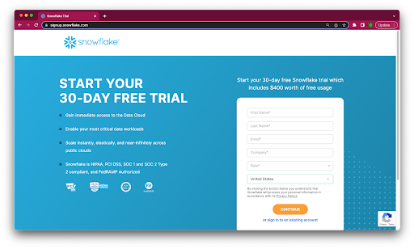

### Step 2: Create a Coalesce Trial Account with Snowflake Partner Connect

Once you are logged into your Snowflake account, sign up for a free Coalesce trial account using Snowflake Partner Connect. Check your Snowflake account profile to make sure that it contains your fist and last name. 

1. Select **Admin > Partner Connect** in the navigation bar on the left hand side of your screen and click on the Coalesce button (under Data Integration). 

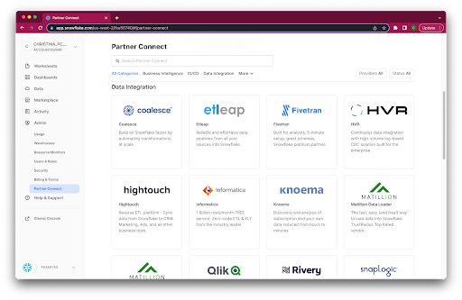

2. Review the connection information and then click Connect. 

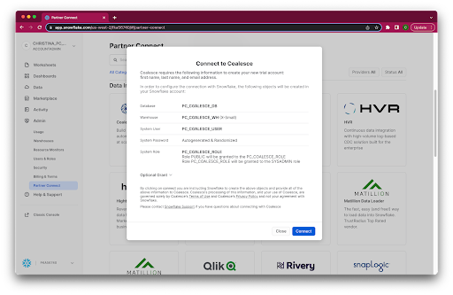

3. When prompted, click **Activate** to activate your account. You can also activate your account later using the activation link emailed to your address. 

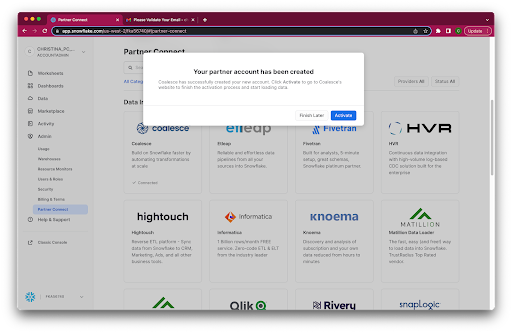

4. Once you’ve activated your account, fill in your information to complete the activation process. 

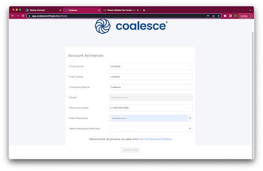

### Step 3: Complete Your Coalesce Account Setup

1. Log in to your Coalesce account and click the **+** icon in the left sidebar next to **Projects.** This will create a dedicated Project for your development and deployment Workspaces focused on your work with this guide. Name your new Project **Dynamic Tables** and then click the **Next** button. 

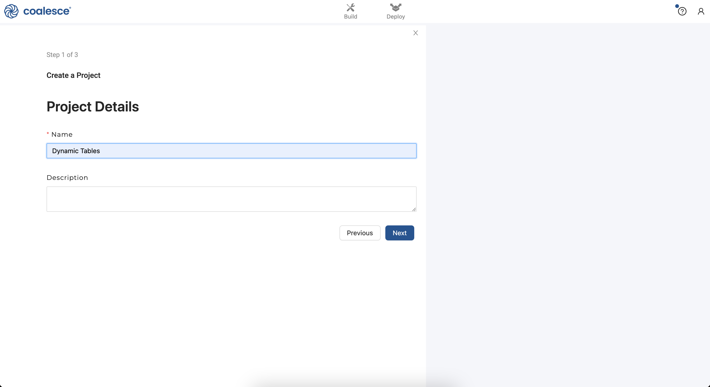

2. You will be prompted to set up version control with Coalesce. For now, click the **Skip and Create** button twice when prompted. You will set up git for version control in an optional step later in this guide, which will allow you to commit your work and deploy from your development Workspace to your test (QA) and Production Environments.

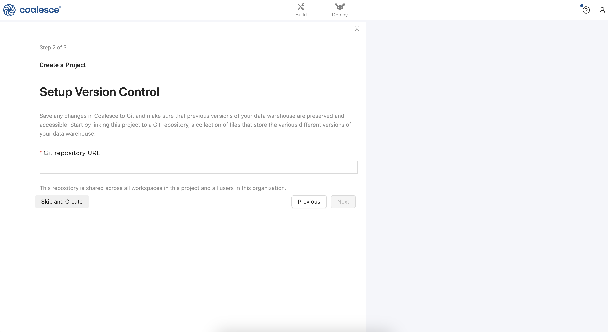

3. Once you’ve created your Project, click the **Create Workspace** button to create your development Workspace. 

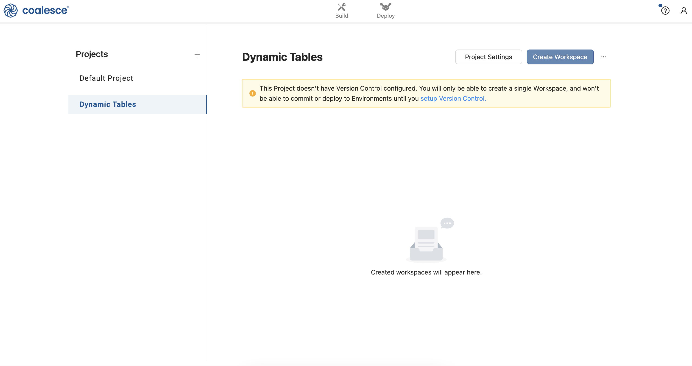

4. Name your Workspace **Dynamic Tables - Dev** and then click the **Create** button. 

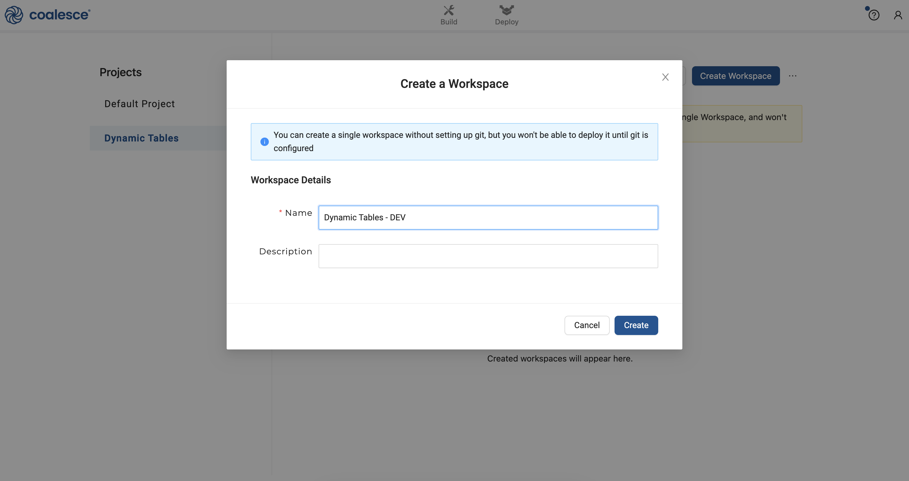

5. Click the **Launch** button to open up your development Workspace.

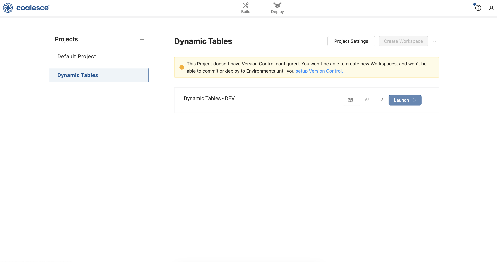

6. You are now in the Build interface of your Workspace. In the upper right corner, click the question mark icon to open up the Resource Center. 

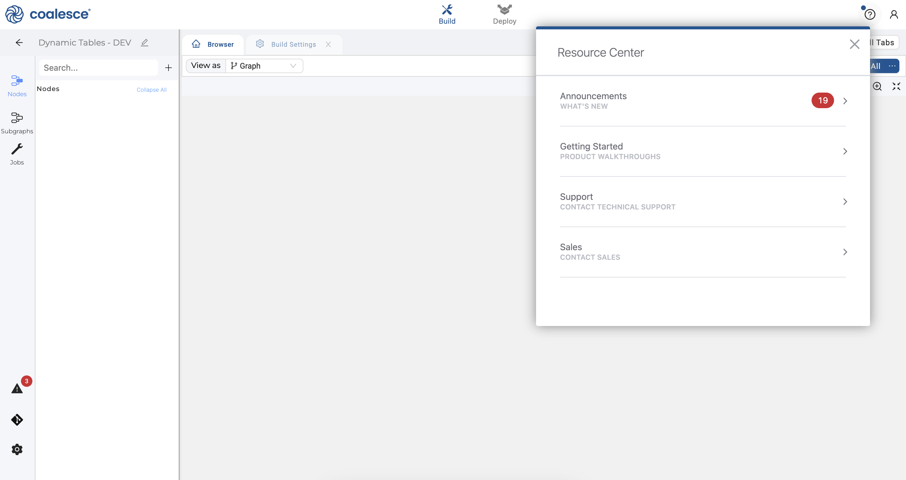

7. Coalesce provides many “out-of-the-box” node types that are immediately available in your account for commonly-used transformations, and also gives you the option to create your own user-defined nodes, or [UDNs](https://docs.coalesce.io/docs/user-defined-nodes). The dynamic tables node used in this guide is a UDN that can be added to your account upon request. 

To do this, click on **Support** and enter the following note in the support message field: 

“Please add the dynamic tables node into my account.” 

Then click the Send Feedback button. The dynamic tables node will be loaded into your account shortly. 

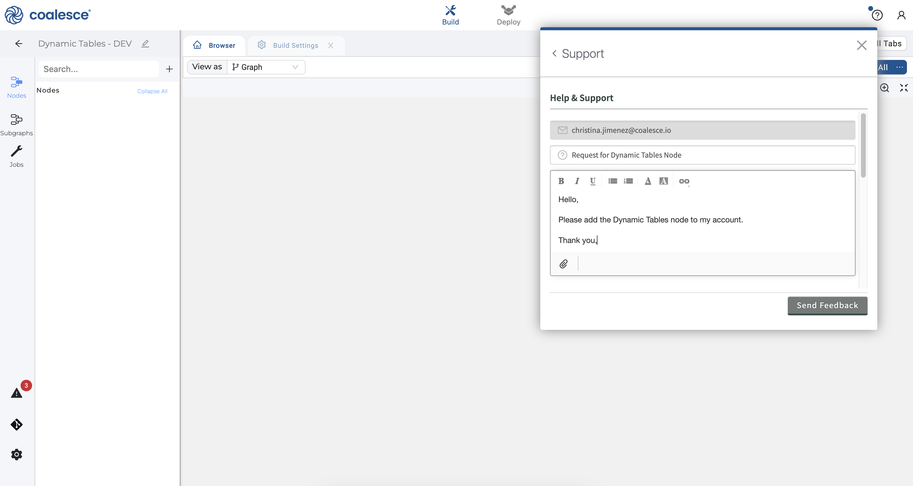

8. Once the dynamic tables node is loaded into your account, navigate to back to your Snowflake account and create a new Worksheet named **Dynamic Tables.** 

Copy and run this [code](https://docs.google.com/document/d/1BMSSVw3uwpFo2KM_GI7teSD9x2GMQL_FkUJdtjd8-cw/edit?usp=sharing) in your Worksheet. This will create a standalone Development, QA (Testing) and Production environment for you. 

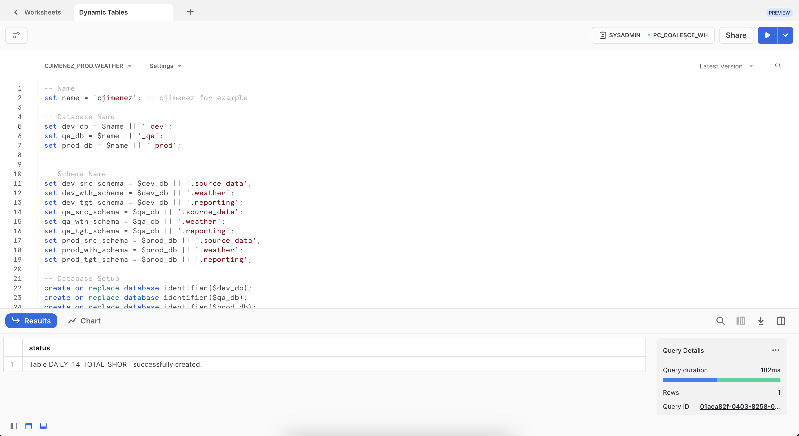

9. Return to your Coalesce account, click on the pencil icon next to the name of your Workspace and then click on **Storage Mappings.** For your `SRC` mapping, select your newly created `DEV` database (starting with your first initial and last name) and `SOURCE DATA` schema. For your `WORK` mapping, select your `DEV` database and `REPORTING` schema as shown below.

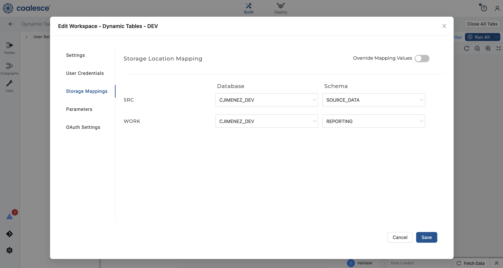

10. Click on **Parameters** in your Workspace Settings and enter the following parameter in the field. This parameter will set the warehouse that will be used in your development Environment. 

```sql
{
    "targetDynamicTableWarehouse": "DEV ENVIRONMENT"
}
```

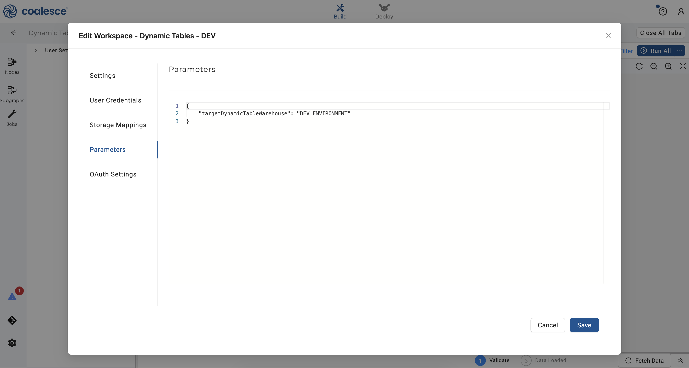

<!-- -------------------------->
## Adding Data Sources

Duration: 2

1. Click back to your Browser tab and click the Nodes icon in the left sidebar. Click the + icon that appears next to the Search bar. Click **Add Sources** from the dropdown menu.

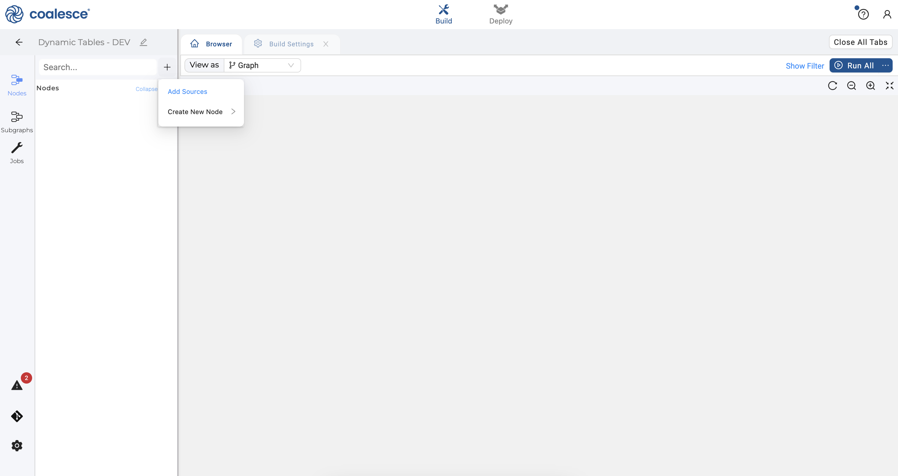

2. Expand and check all of the data sources under `SRC` - `SNOWFLAKE_SAMPLE_DATA.TPCH_SF1`. Then click **Add 8 sources** in the bottom right corner. 

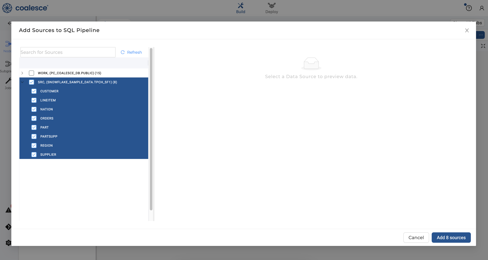

3. You will see 8 new source nodes added to your graph which forms the foundation of your pipeline. 

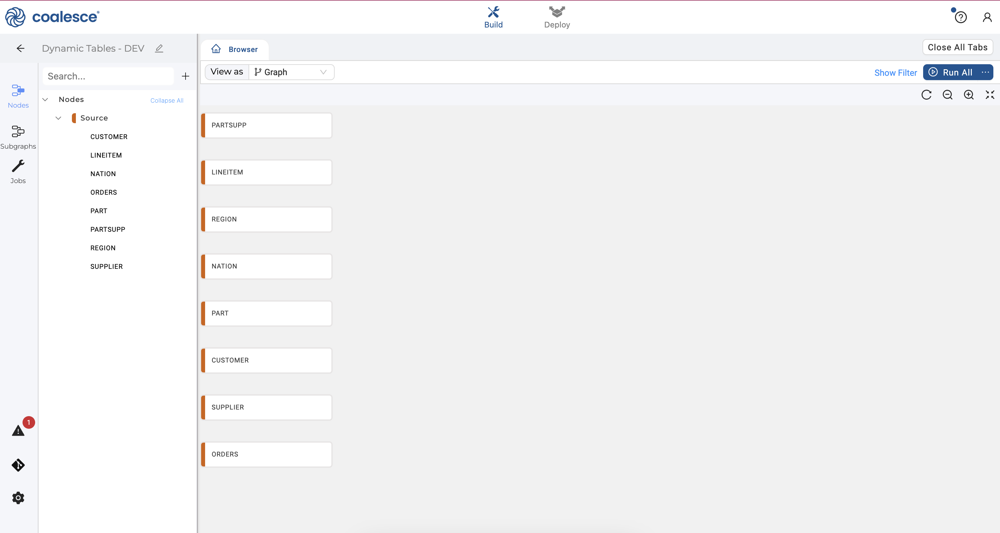

<!-- -------------------------->
## Creating Dynamic Table Nodes

Duration: 5

1. Select your `CUSTOMER`, `NATION` and `REGION` source nodes. Then right click and hover over **Join Nodes** and select **Dynamic Table Stage**. 

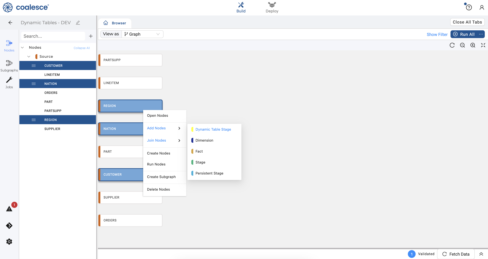

2. Your new dynamic table node will open to show a handful of configuration settings in the right sidebar. These include **Node Properties** which includes your Storage Location, node type and whether deployment is enabled for your node. 

Under **Dynamic Table Options,** you have the option of changing the selected warehouse that you would like to use to run your node. Enter the warehouse `dev_wh_xs` that was created when you ran your setup code in Snowflake. In Coalesce, you have the ability to change and set specific warehouses that run each dynamic table node in a given environment (e.g. `DEV`, `QA`, or `PROD`) by using [Parameters](https://docs.coalesce.io/docs/rtp-default).


The **Downstream** toggle controls whether refreshes are determined by subsequent nodes in your pipeline. 

Your **Lag Specification** determines how often your node is refreshed. Set this schedule to 1 minute as shown. 

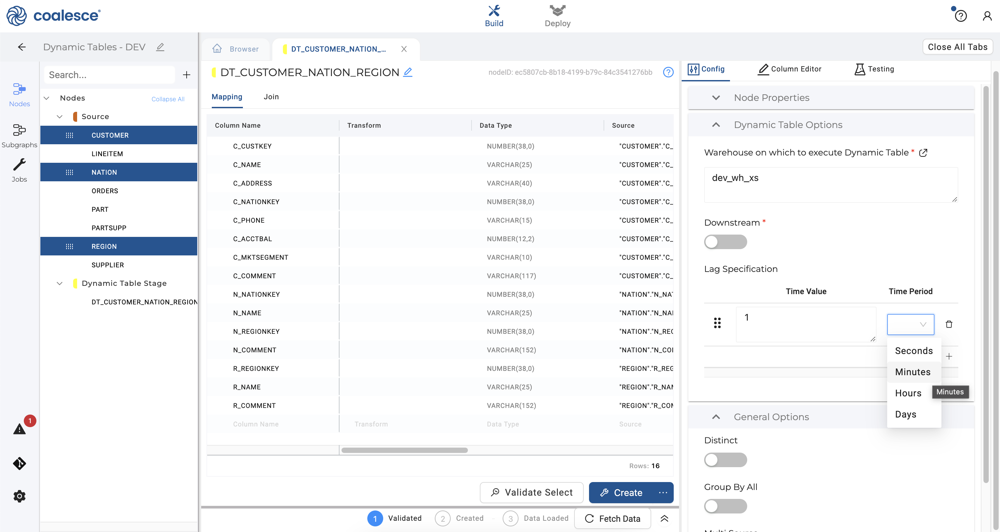

3. Switch over to the **Join** tab in your dynamic table node and complete the join using the following statement: 

```sql
FROM {{ ref('SRC', 'NATION') }} "NATION"
INNER JOIN {{ ref('SRC', 'REGION') }} "REGION"
ON "NATION"."N_REGIONKEY" = "REGION"."R_REGIONKEY"
INNER JOIN {{ ref('SRC', 'CUSTOMER') }} "CUSTOMER"
ON "NATION"."N_NATIONKEY" = "CUSTOMER"."C_NATIONKEY"
```

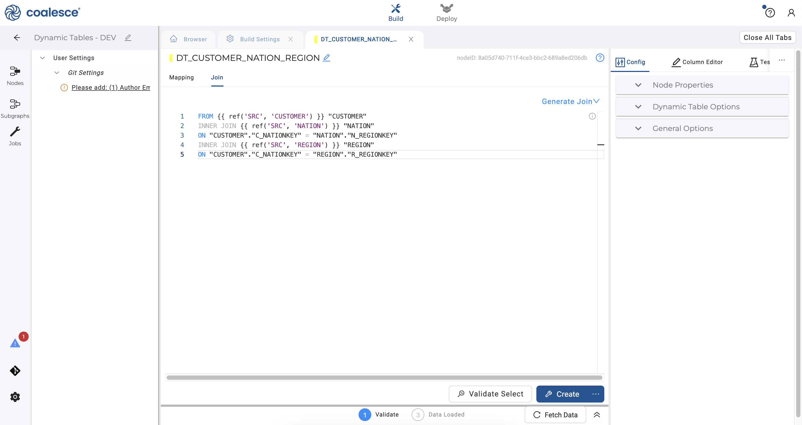

4. Press the Command key to multi-select and delete the columns `N_NATIONKEY`, `N_REGIONKEY`, `N_COMMENT`, `R_REGIONKEY` and `R_COMMENT` in your node. 

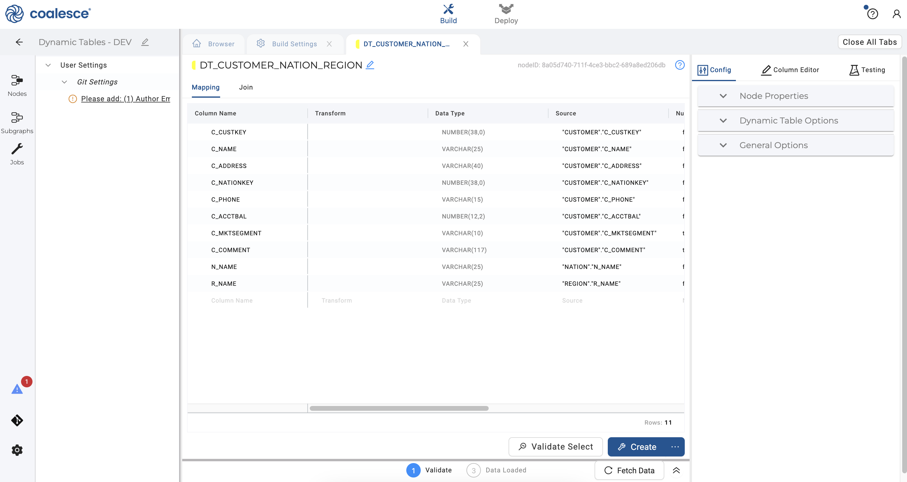

5. Click the **Create** button to create your dynamic table node. You can expand the DDL statement and view the code that was auto-generated by Coalesce to create the node. 

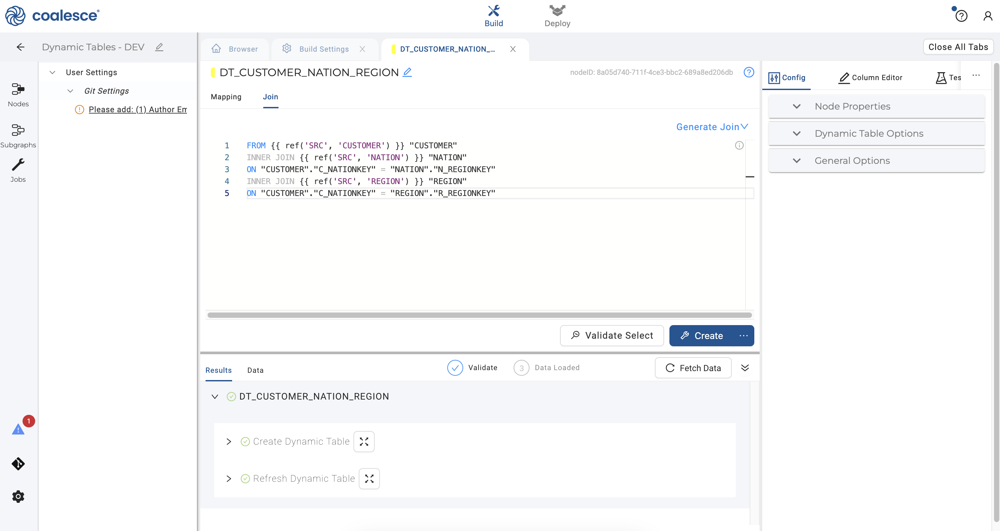

6. Click on your Browser tab to return to your graph and select the `ORDERS` and `LINEITEM` source nodes. Right click and hover over **Join Nodes** and then click on your click on your dynamic table node. 

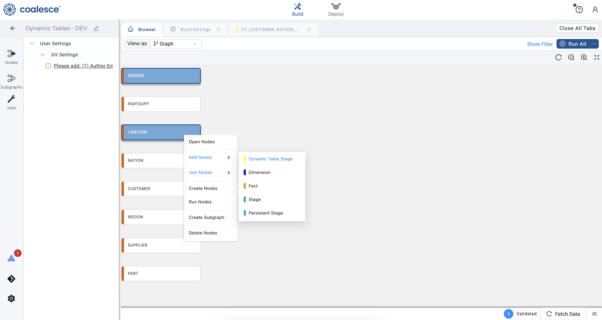

7. In your second dynamic table node, click on **Dynamic Table Options** on the right side in your config area. In the dropdown, set the lag specification to 1 minute as you did with the previous dynamic table node. 

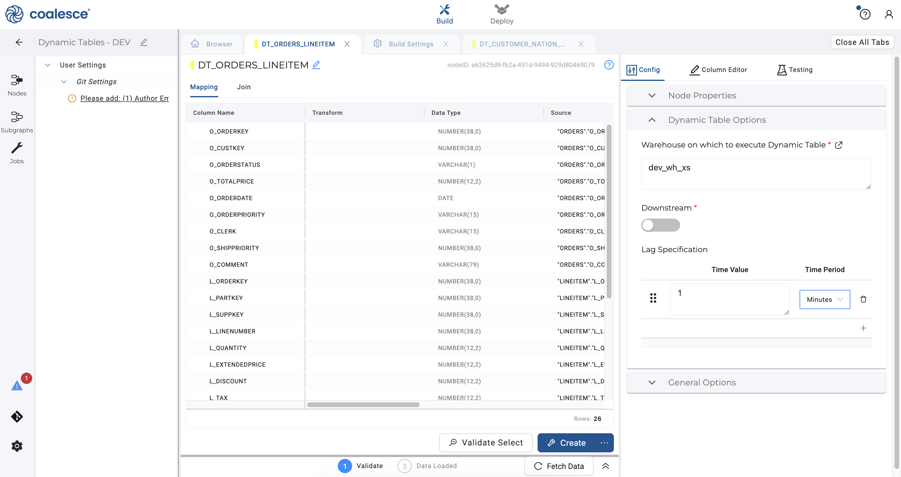

8. Click on the Join tab and adjust the join statement as shown in the code below: 

```sql
FROM {{ ref('SRC', 'ORDERS') }} "ORDERS"
INNER JOIN {{ ref('SRC', 'LINEITEM') }} "LINEITEM"
ON "ORDERS"."O_ORDERKEY" = "LINEITEM"."L_ORDERKEY"
```

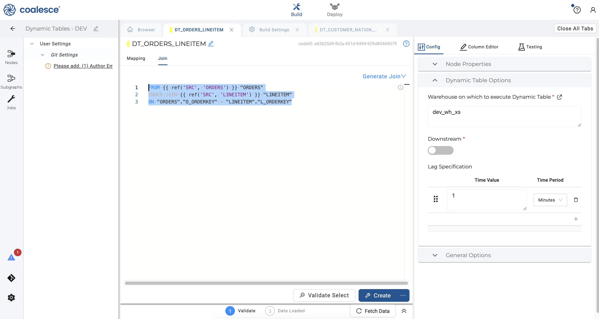

9. Click **Mapping** next to the Join tab. Press the Command key to multi-select and delete the columns `O_ORDERSTATUS`, `O_TOTALPRICE`, `O_ORDERDATE`, `O_CLERK`, `O_SHIPRIORITY`, `L_PARTKEY` and `L_SUPPKEY`: 

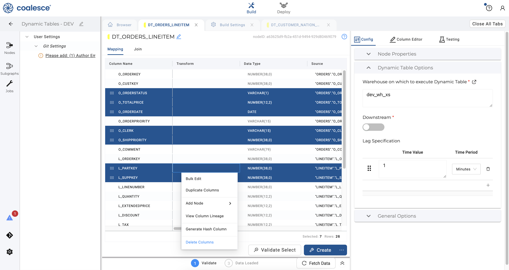

10. Click the Create button to create your dynamic table node. 

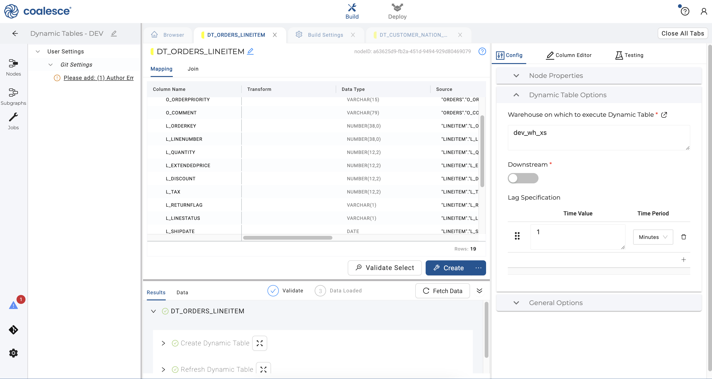

<!---------------------------->
## Joining Dynamic Table Nodes

Duration: 5

1. Click on the Browser tab to return to your graph. Select your two dynamic table nodes that you just created. To aggregate quantity of goods by customer, right click and hover over **Join Nodes** and then click on **Dynamic Table Stage** in the dropdown menu. 

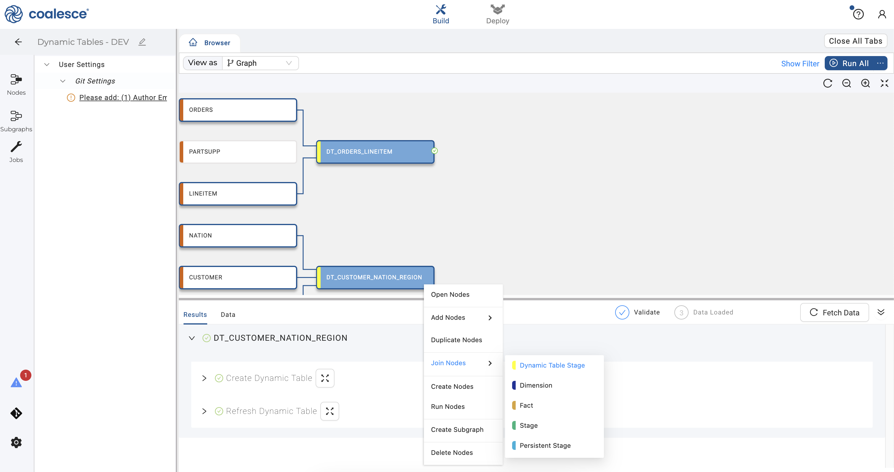

2. Click on the **Join** tab and adjust the join statement as shown below.

```sql
FROM {{ ref('SRC', 'DT_ORDERS_LINEITEM') }} "DT_ORDERS_LINEITEM"
INNER JOIN {{ ref('SRC', 'DT_CUSTOMER_NATION_REGION') }} "DT_CUSTOMER_NATION_REGION"
ON "DT_ORDERS_LINEITEM"."O_CUSTKEY" = "DT_CUSTOMER_NATION_REGION"."C_CUSTKEY"
```

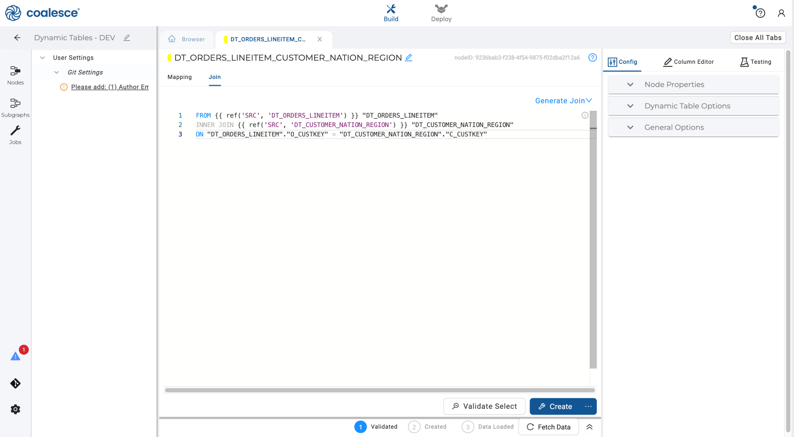

3. Return to the **Mapping** grid, press the Shift key and select the `C_ADDRESS`, `C_NATIONKEY`, `C_PHONE`, `C_ACCTBAL`, `C_MKTSEGMENT`, and `C_COMMENT` columns. Right click and select **Delete Columns** from the dropdown menu. 

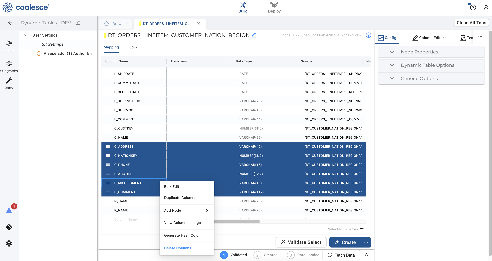

4. Select the `C_CUSTKEY` column. Press and hold the Shift and Option buttons, then scroll upwards to multi-select every column from `C_CUSTKEY` to `L_EXTENDEDPRICE`. Right click on the columns and select **Delete Columns** to bulk delete them. Finally, delete all of the remaining columns but `C_NAME` and `L_QUANTITY`. 

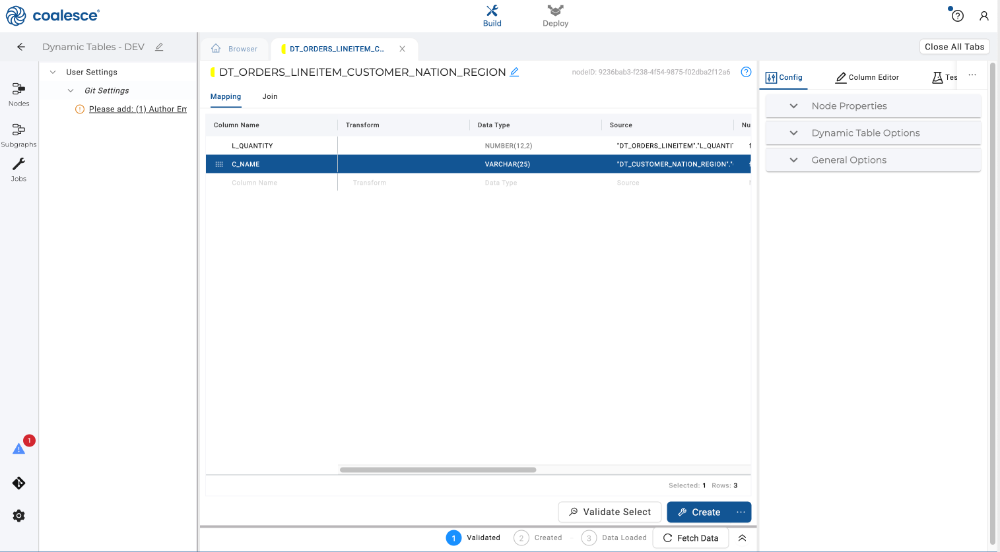

5. Select the `C_NAME` column and drag it to the top of your **Mapping** grid so that it appears in front of the `L_QUANTITY` column. Select `L_QUANTITY` and add the aggregation below to the **Transform** field: 

```sql
sum({{SRC}})
```

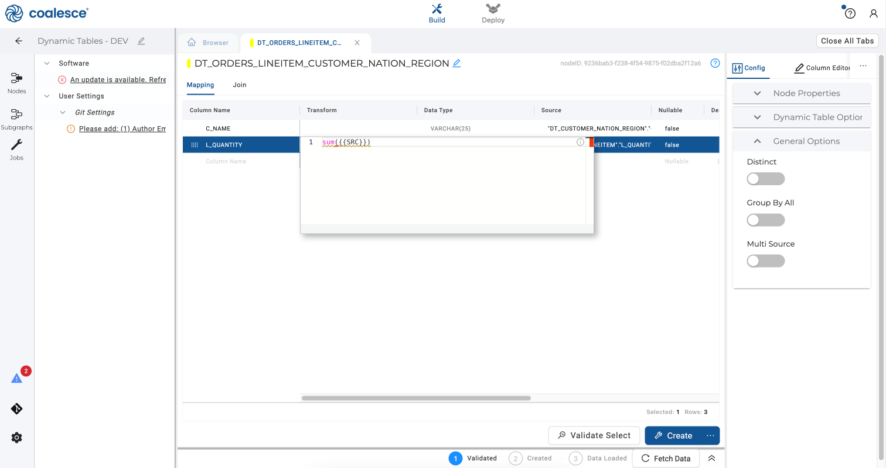

6. In your Config panel to the right, click on **General Options.** Select **Group By All** and toggle this on to utilize Snowflake’s `GROUP BY ALL` capability. 

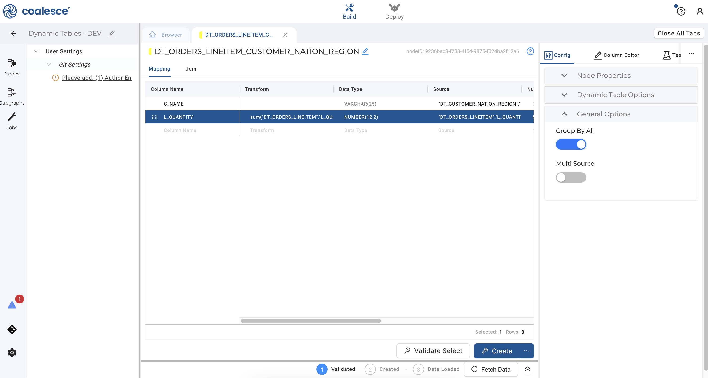

7. Under **Dynamic Table Options**, ensure that your node will be refreshed slightly less frequently than your previous dynamic table nodes by setting your **Time Value** to 5 minutes. 

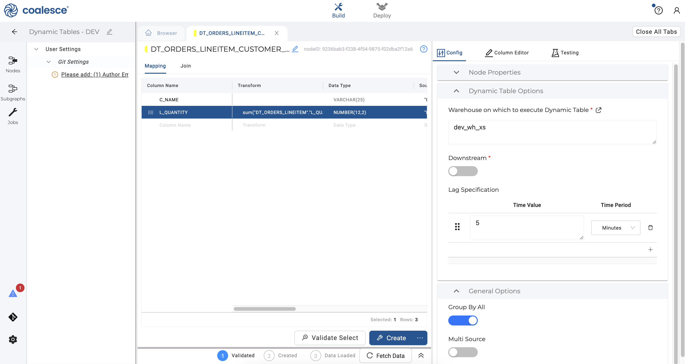

8. Press the **Create** button to create your dynamic tables node, and then expand your Create statement to view the `GROUP BY ALL` function that you added via the Config. 

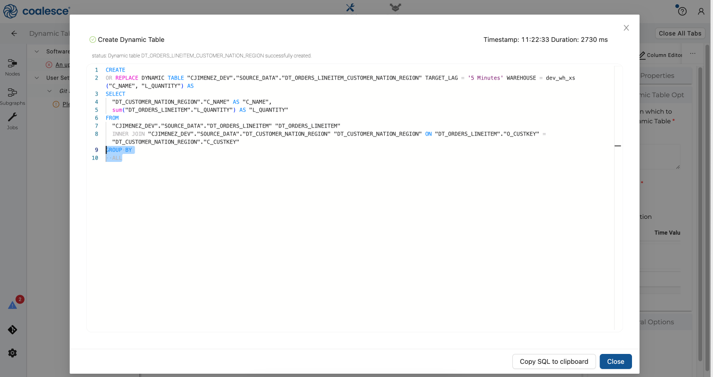

Congratulations! You have built out a small DAG of dynamic table nodes. 

<!---------------------------->
## Running and Visualizing Your DAG
Duration: 5 

1. To run your nodes as a DAG in its entirety, select your preceding node `DT_ORDERS_LINEITEM` to open it. In the Config section, select the **Downstream** option and press the **Create** button. 

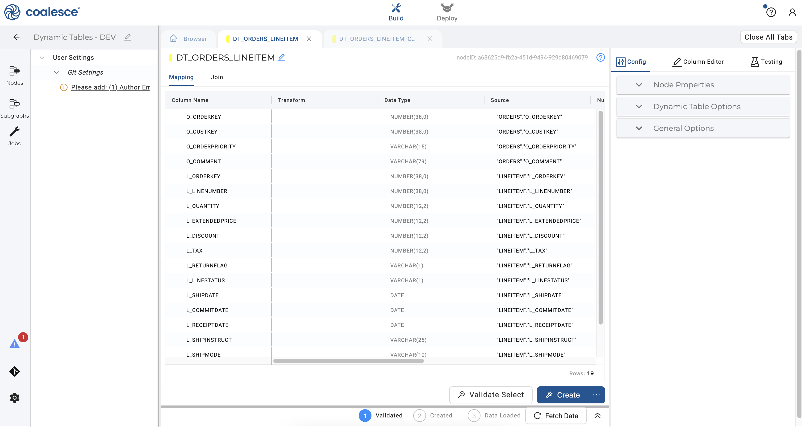

2. Return to your Build interface, open up your `DT_CUSTOMER_NATION_REGION` node and repeat this action by selecting the **Downstream** option and creating your node. 

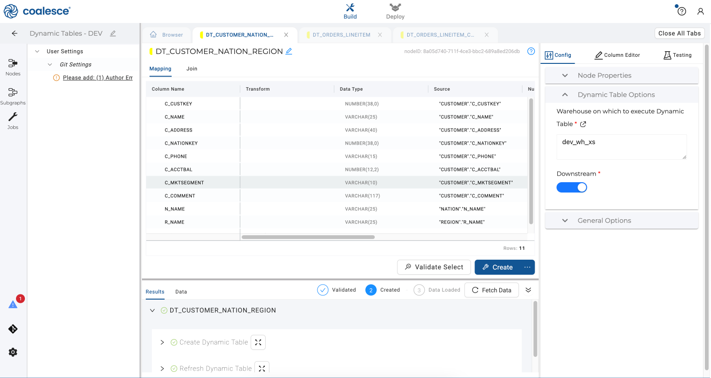

3. Return to your Build interface and click the **Run All** button in the upper right corner to run your DAG. Now you are no longer using a lag to refresh the preceding dynamic table nodes. Instead, these dynamic tables will refresh based on the lag time of your subsequent `DT_ORDERS_LINEITEM_CUSTOMER_NATION_REGION` node.

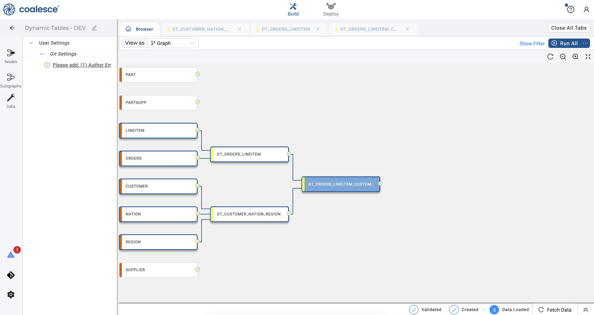

4. Now let’s visualize the DAG in Snowflake. Navigate to your Snowflake account and select **Data > Databases** in the left sidebar. 

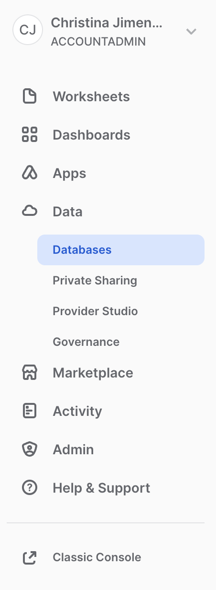

5. Select your `DEV` database that you created earlier in this guide (`YOURFIRSTINITIALLASTNAME_DEV`). Under **Source Data**, click on Dynamic Tables and select your `DT_ORDERS_LINEITEM_CUSTOMER_NATION_REGION` node. 

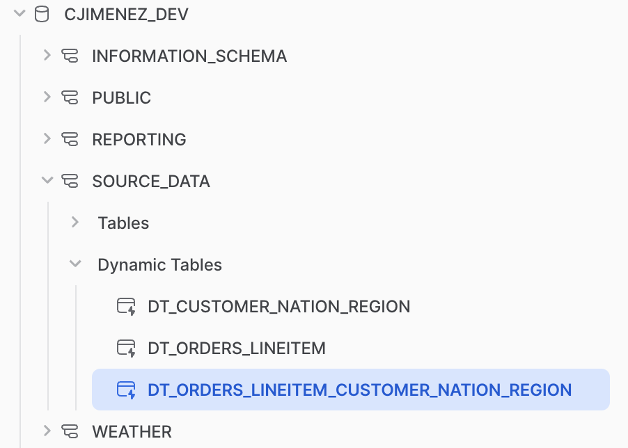

6. On the right hand side of your Snowflake UI, click on **Graph** to see the status of your Coalesce DAG that has been visualized in Snowflake.

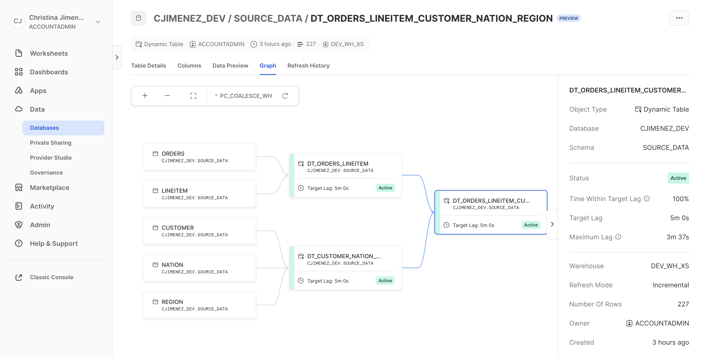

<!---------------------------->
## Preparing for Deployment (Optional)
Duration: 5 

To deploy your DAG to a non-development environment, you will first need to set up version control in Coalesce by connecting to a git repository.

1.  Log into git and create a new repository for your dynamic tables Project in Coalesce. Copy the URL for your newly created repository. 

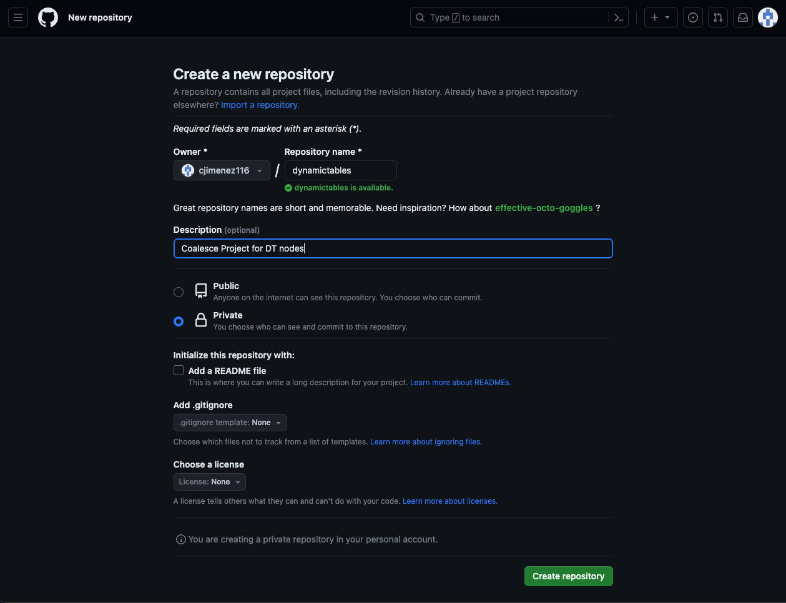

2. Navigate back to your Coalesce account and click back to your Projects dashboard. Click on **Setup Version Control** in the prompt under your dynamic tables Project. 

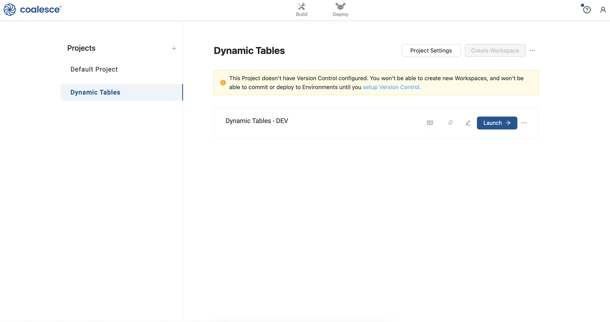

3. Enter your git repository URL when prompted:

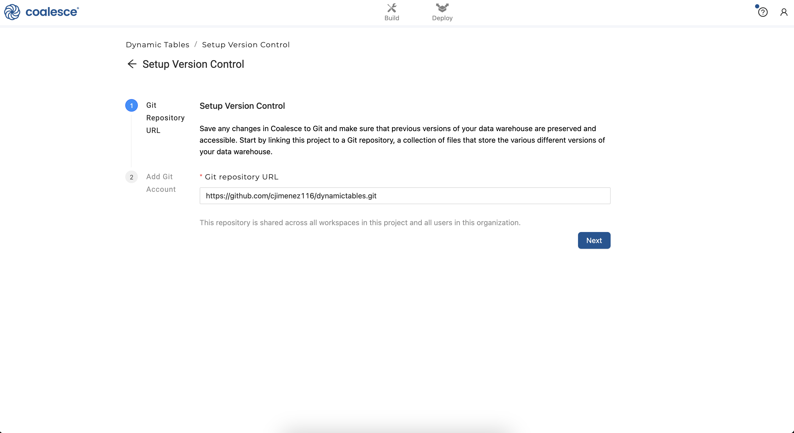

4. Enter your git account credentials when prompted and click the **Test Account** button to confirm that your credentials are correct. Then click **Finish.** You have set up version control for your Project! 

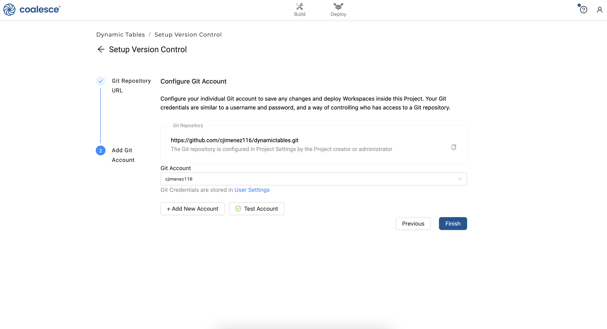

5. Launch your dynamic tables Workspace once more and click on the git icon in the lower left corner. Enter "Initial Commit” in the Commit Message field and then click the **Commit and Push** button. 

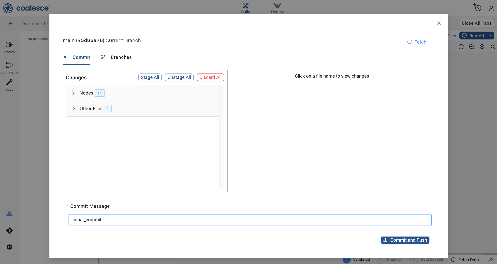

6. Close the git modal and click on the **Build Settings** (gear icon) in the lower left corner. Now it’s time to create two Environments that are tied to the `QA` and `PROD` databases that we created as part of our setup in Snowflake. 

Click on **Environments** and then click on the **New Environment** button. Name your new Environment `QA` to use as a testing environment. You will need to enter your Snowflake account which can be found in the lower left hand corner of your Snowflake account. Click the Save button to save your `QA` settings. 

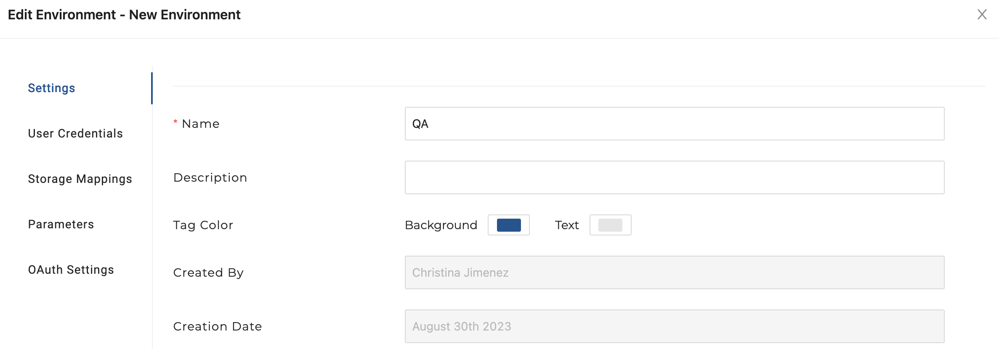

7. Click on **User Credentials** and enter your Snowflake user credentials. Then click on **Storage Mappings** on the left side and set your `SRC` mapping to your `QA` database (`FIRSTINITIALLASTNAME_DB`) and `SOURCE DATA` schema. Set your `WORK` mapping to your `QA` database and `REPORTING` schema. Then click the **Save** button and close the window.

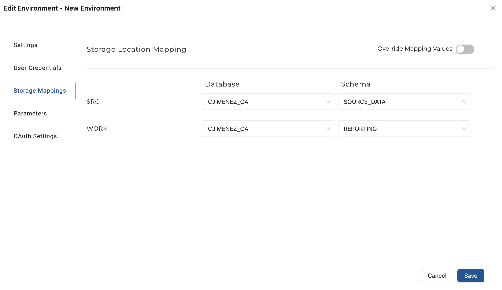

8. Click on the **Parameters** section and enter the following parameter to designate that any dynamic table node run in your `QA` Environment will use the `qa_wh_xs.` Then click the **Save** button to save your `QA` settings.

```sql 
{
    "targetDynamicTableWarehouse": "qa_wh_xs"
}
```

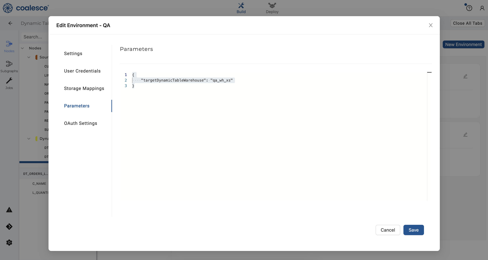

9. Close out of your `QA` Environment and click the **New Environment** button. Name this Environment `PROD.` You will need to enter your Snowflake account name which can be found in the lower left hand corner of your Snowflake account. Click the **Save** button to save your `PROD` settings. 

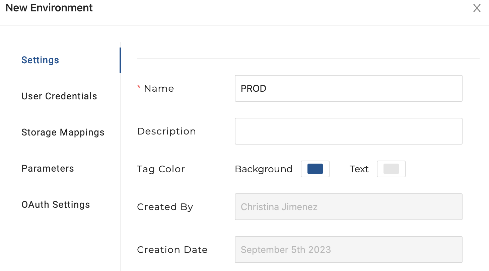

10. Click on **User Credentials** and enter your Snowflake credentials as you did for your `QA` Environment. Be sure to list `prod_wh_xs` as your warehouse. Then click on **Storage Mappings** and set your database to your `PROD` DB for `SRC` and `WORK.` Map your `SRC` schema to `SOURCE_DATA` and your `WORK` schema to `PUBLIC.` Then click the **Save** button.

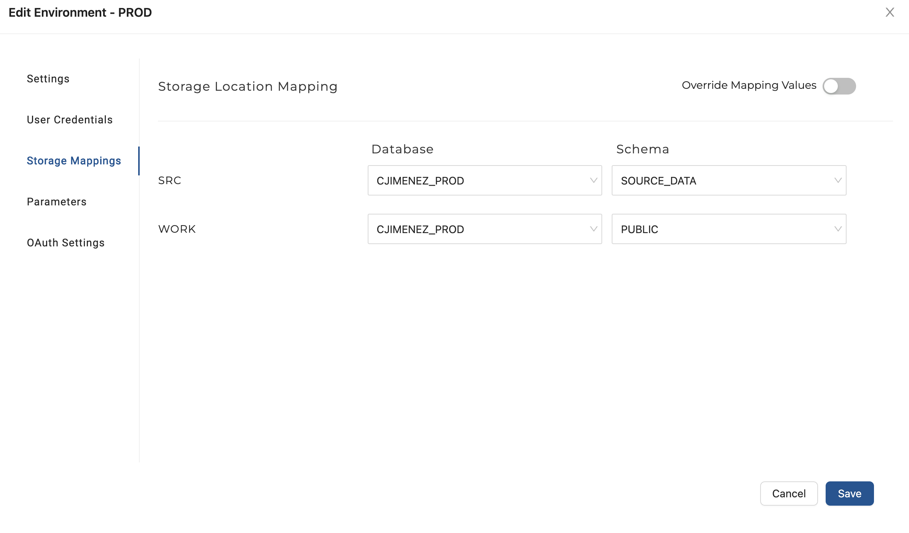

11. Click on the **Parameters** section and enter the following parameter to designate that any dynamic table node run in your `PROD` Environment will use the `prod_wh_xs.` Then click the **Save** button. 

```sql
{
    "targetDynamicTableWarehouse": "prod_wh_xs"
}
```

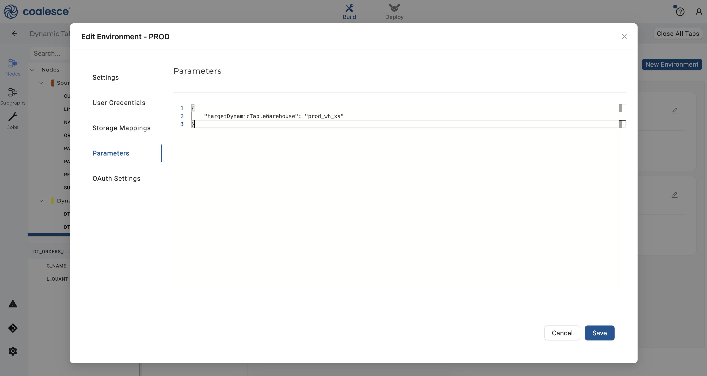

12. Return to the Build interface and click on the git icon in the loweer left corner to commit your changes in preparation for deployment. Name your commit "Env_Update” and then click the **Commit and Push** button.  

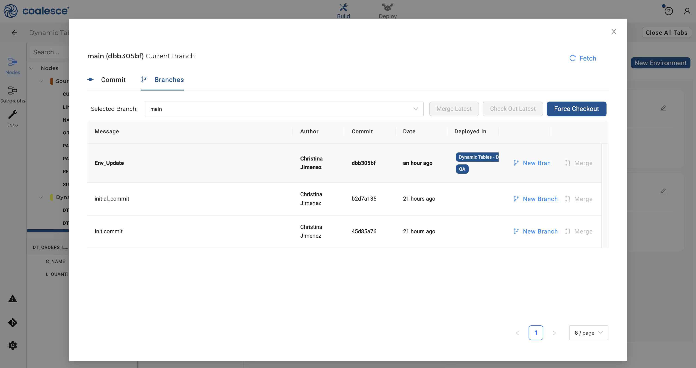

Congratulations! You’ve set up your `QA` and `PROD` Environments and are now ready to deploy. 

<!---------------------------->
## Deploying Your DAG (Optional)
Duration: 2

1. To deploy your DAG to your `QA` Environment, switch over to the **Deploy** interface at the top of your screen:

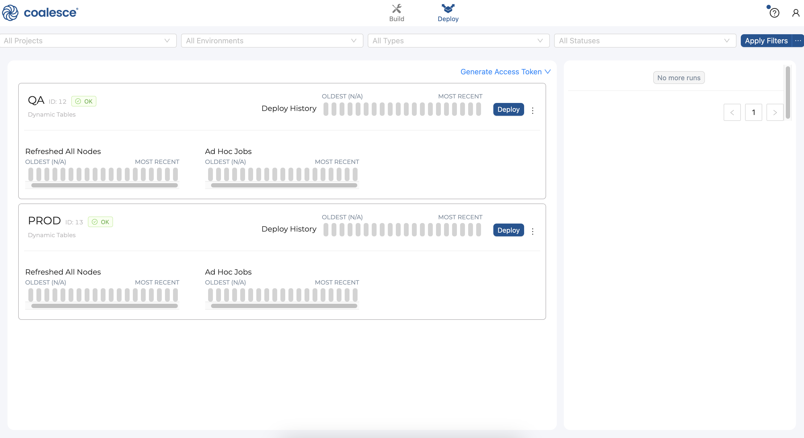

2. Press the **Deploy** button next to your `QA` Environment to start the deployment process. Then select your most recent commit (Env_Update) and click **Next.**

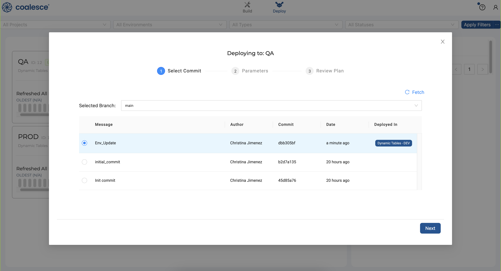

3. Your next screen will show the parameter that specifies that your `QA` warehouse should be used. Click the **Next** button to continue:

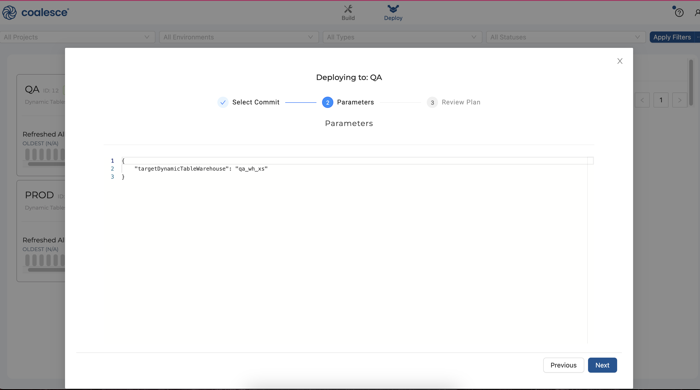

4. Finally, review your deployment plan and then click the **Deploy** button.

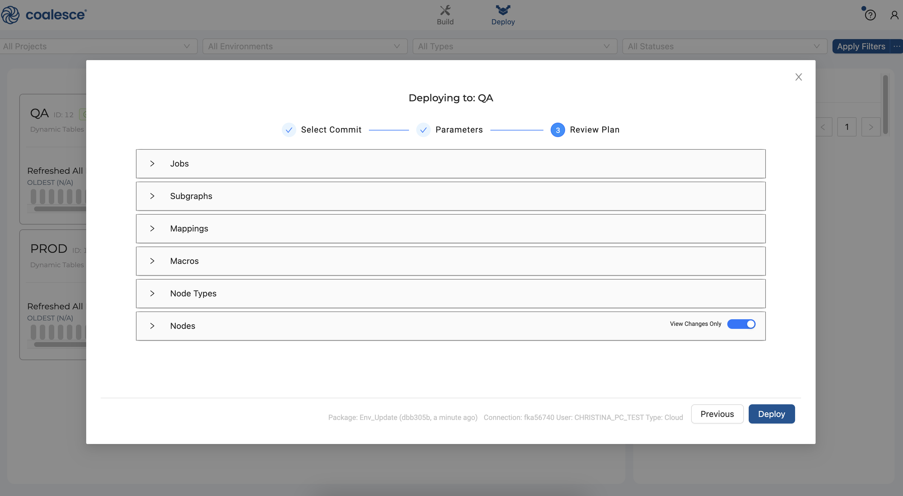

5. Congratulations! You have successfully deployed your DAG to your `QA` Environment. You can continue working on your DAG, or repeat the deployment process and deploy to your `PROD` environment. 

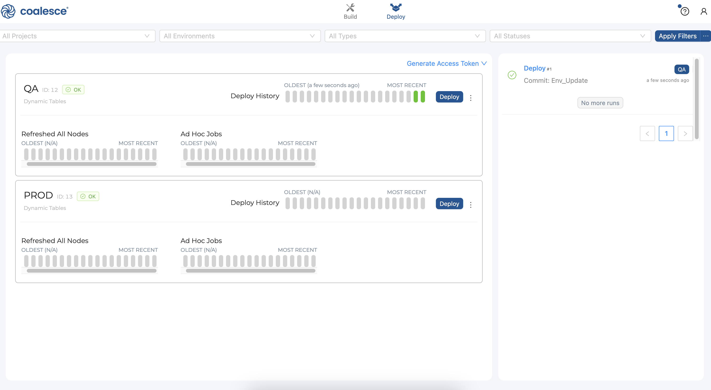

<!---------------------------->
## Conclusion
Duration: 1 

Congratulations, you’ve completed this guide on creating dynamic table nodes in Snowflake using Coalesce. Continue with your free trial by loading your own sample or production data and exploring more of Coalesce's capabilities with our [documentation](https://docs.coalesce.io/docs) and [resources](https://coalesce.io/resources/).

### What we've covered
- How to create dynamic tables for data engineering tasks more efficiently in Coalesce
- How to deploy dynamic tables to non-development environments
- How to build a directed acyclic graph (DAG) made up of dynamic table nodes

### Additional resources
- [Coalesce FAQs](https://coalesce.io/faqs/)
- [Coalesce Documentation](https://docs.coalesce.io/docs)
- Reach out to our sales team at [coalesce.io](https://coalesce.io/contact-us/) or by emailing [sales@coalesce.io](sales@coalesce.io) to learn more!

Happy transforming!
