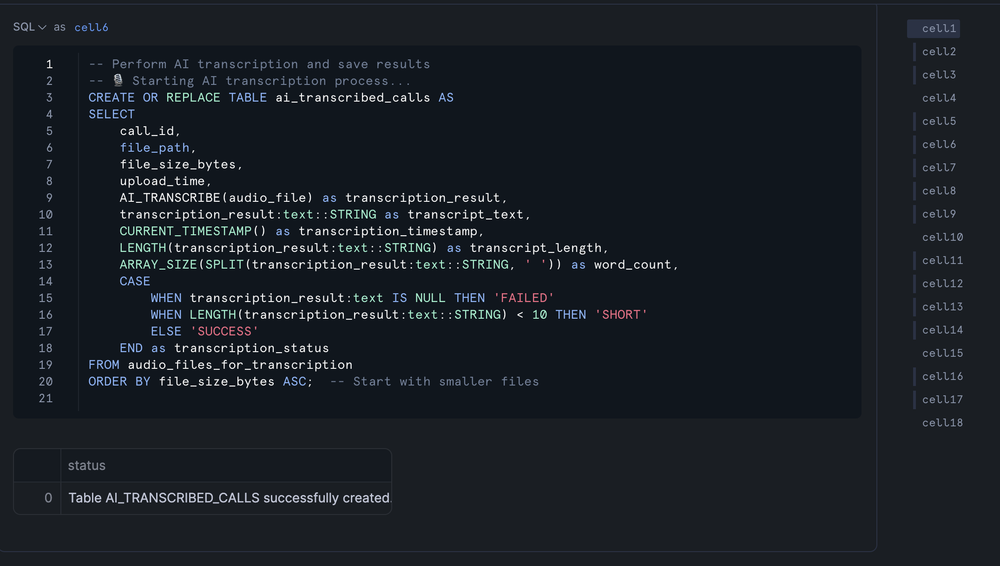
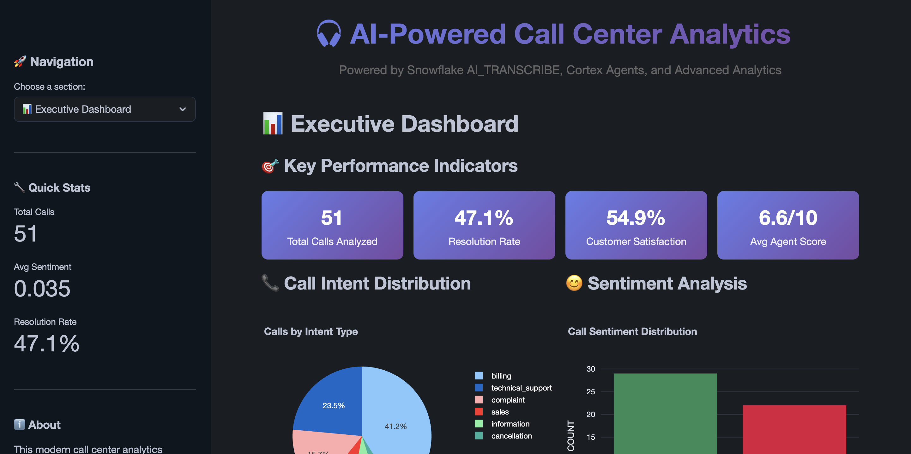

author: Charlie Hammond
id: call-center-analytics-with-ai-transcribe-and-cortex-agents
categories: snowflake-site:taxonomy/solution-center/certification/quickstart, snowflake-site:taxonomy/product/ai
language: en
summary: Analyze call center recordings with AI transcription using Snowflake Cortex Agents for conversation insights and automation.
environments: web
status: Published
feedback link: <https://github.com/Snowflake-Labs/sfguides/issues>

# Call Center Analytics with AI_TRANSCRIBE and Cortex Agents
<!-- ------------------------ -->
## Overview


Audio files in call centers offer rich insights beyond text. With Snowflake Cortex Functions and native capabilities, you can quickly transcribe audio files, extract summaries of calls, sentiment, and patterns which can eventually help in enhancing customer experiences. By transcribing audio to text and developing custom analytics, call centers and supervisors gain actionable insights on agent responses and proactive issue resolution, ultimately driving better customer satisfaction.

In this quickstart, you focus on a scenario where you are a supervisor in a vehicle insurance call center company. As a supervisor, you need to identify metrics about agents and track key metrics like total number of call resolutions and overall call sentiment. With Snowflake Cortex functions, supervisors can get all these details through a Streamlit App with natural language querying capabilities.

This Quickstart will cover essential ground, and by the end you will have built an AI application for call center analytics.

### Prerequisites

* Familiarity with Python
* Familiarity with Snowflake
* Snowflake account

### What You'll Learn

You will learn about the following Snowflake features during this Quickstart:

* **AI_TRANSCRIBE Function**: Convert audio files to text using Snowflake's native speech-to-text with 40+ language support
* **Cortex LLM Functions**: Extract insights using COMPLETE, SENTIMENT, and SUMMARIZE functions for comprehensive call analysis
* **Cortex Agents**: Orchestrate between structured and unstructured data sources with intelligent planning and tool selection
* **Cortex Analyst**: Enable natural language to SQL conversion for structured data queries without writing code
* **Cortex Search**: Implement semantic search across unstructured call transcripts and documents
* **Streamlit in Snowflake**: Quickly build applications within Snowflake containing key Cortex features

### What You'll Need

You will need the following things before beginning:

* Snowflake account in a cloud region where Snowflake Cortex functions are [supported](https://docs.snowflake.com/user-guide/snowflake-cortex/llm-functions#availability) or [cross-region inference](https://docs.snowflake.com/user-guide/snowflake-cortex/cross-region-inference#label-use-cross-region-inference) enabled on the account.
* **A Snowflake user created with ACCOUNTADMIN permissions**

### What You'll Build

During this Quickstart you will accomplish the following:

* Set up call center analytics database and objects
* Process audio transcriptions using AI_TRANSCRIBE and extract insights using Cortex LLM functions
* Configure [Cortex Search](https://docs.snowflake.com/en/user-guide/snowflake-cortex/cortex-search/cortex-search-overview) and [Cortex Analyst](https://docs.snowflake.com/en/user-guide/snowflake-cortex/cortex-analyst) for intelligent transcript search and production-grade conversational self-service analytics
* Deploy Streamlit app with [Cortex Agents](https://docs.snowflake.com/en/user-guide/snowflake-cortex/cortex-agents) integration for call center analytics and natural language analytics


<!-- ------------------------ -->
## Setup


### Run Setup SQL

First, run the setup SQL script located [here](https://github.com/Snowflake-Labs/call-center-analytics-with-aitranscribe-and-cortex-agents/blob/main/scripts/setup.sql) to create all necessary database objects, tables, and configurations for the call center analytics solution. This will create:
- Database and analytics schema for call center analytics
- Audio file stage for mp3 uploads
- Custom role with appropriate permissions for AI_TRANSCRIBE and Cortex functions

### Upload Audio Files

After running the setup script (which automatically grants you the `call_center_analytics_role`):

1. **Download example MP3 files** located [here](https://github.com/Snowflake-Labs/call-center-analytics-with-aitranscribe-and-cortex-agents/tree/main/scripts/audio_files). Tip: Download the zip from the repository root to get the full folder. 
2. **Upload the files** to the `call_center_analytics_db.analytics.audio_files` stage for processing with AI_TRANSCRIBE. You can access the stage by going to Databases > `call_center_analytics_db` > `analytics` schema > `audio_files` stage > 


<!-- ------------------------ -->
## Transcribe Calls


### Upload and Run Analytics Notebook

1. Download the notebook [here](https://github.com/Snowflake-Labs/call-center-analytics-with-aitranscribe-and-cortex-agents/blob/main/notebooks/ai_transcribe_analytics.ipynb)
2. Navigate to **Snowsight** → **Projects** → **Notebooks**
3. Click **"+ Notebook"** and select **"Upload from file"**
4. Upload the `call_center_analytics.ipynb` notebook
5. Select the call center analytics database and analytics schema, and call center warehouse
6. Run all cells in the notebook



The notebook demonstrates the power of **Snowflake's AI_TRANSCRIBE function** and **Cortex LLM capabilities**:

#### AI_TRANSCRIBE Function
Snowflake's native speech-to-text capability for processing call center audio files.

- **High-Quality Transcription**: Uses latest AI models for accurate speech-to-text conversion
- **Multi-Language Support**: Supports 40+ languages including English, Spanish, French, German, and many others
- **Stage Integration**: Works seamlessly with Snowflake internal/external stages using `TO_FILE()` function
- **Batch Processing**: Can process multiple audio files efficiently using directory tables

**Usage Example**:
```sql
-- Single file transcription
SELECT AI_TRANSCRIBE(TO_FILE('@audio_stage/call_001.mp3'));

-- Batch transcription from stage
CREATE TABLE audio_files AS 
  (SELECT TO_FILE('@audio_stage', RELATIVE_PATH) AS audio_file 
   FROM DIRECTORY(@audio_stage));
SELECT AI_TRANSCRIBE(audio_file) FROM audio_files;
```

**Key Specifications**:
- Maximum file size: 700 MB
- Supported formats: .mp3 and .wav files
- Available across major cloud regions

#### Cortex LLM Functions Processing
The notebook uses multiple Cortex functions to extract insights:

- **SNOWFLAKE.CORTEX.COMPLETE()**: Analyzes call transcripts to extract:
  - Customer sentiment and satisfaction scores
  - Call purpose and resolution status
  - Key topics and action items
  - First call resolution determination

- **SNOWFLAKE.CORTEX.SENTIMENT()**: Performs sentiment analysis on customer interactions

- **SNOWFLAKE.CORTEX.SUMMARIZE()**: Creates concise call summaries for supervisor review

The notebook will:
- **Transcribe Audio**: Use AI_TRANSCRIBE to convert sample audio files to text
- **Extract Call Insights**: Use Cortex LLM functions to analyze transcriptions
- **Prepare Search Content**: Structure call data for Cortex Search service
- **Populate Analytics Tables**: Store processed insights for dashboard consumption

### Upload and Run Cortex Agents Setup

1. Download the notebook [here](https://github.com/Snowflake-Labs/call-center-analytics-with-aitranscribe-and-cortex-agents/blob/main/notebooks/cortex_analyst_setup.ipynb)
2. Upload the `cortex_analyst_setup.ipynb` notebook
3. Run all cells to set up the semantic model and search services for **Cortex Agents**
4. This configures:
   - **Cortex Analyst** semantic model for structured data queries (text-to-SQL)
   - **Cortex Search** service for unstructured call transcript search

**What Gets Created**:
- Semantic model YAML file defining call center data relationships
- Cortex Search service for intelligent transcript search


<!-- ------------------------ -->
## Deploy Streamlit Application


### Upload Streamlit Application

1. Copy the contents of the python file [here](https://github.com/Snowflake-Labs/call-center-analytics-with-aitranscribe-and-cortex-agents/blob/main/streamlit/Modern_Call_Center_App.py)
2. Navigate to **Snowsight** → **Streamlit**
3. Click **"+ Streamlit App"**
4. Create the App in the call center database, analytics schema, and use the call center warehouse
5. Paste the content into the code editor
6. Add plotly from the packages dropdown at the top of the code editor

### Configure Application with Cortex Agents Integration

1. Once deployed, the Streamlit app will automatically connect to your call center analytics database
2. The app leverages **Cortex Agents** for intelligent data exploration and has four main application screens



#### Executive Dashboard
The **Executive Dashboard** provides high-level call center insights for supervisors and managers:

- **Key Performance Indicators**: Real-time metrics including total calls, average handle time, first call resolution rates
- **Trend Visualizations**: Interactive charts showing call volume patterns, sentiment trends, and agent performance over time  
- **Alert Summaries**: Automated alerts for escalated calls, low satisfaction scores, and operational issues
- **Executive Reporting**: Summary cards with actionable insights powered by Cortex LLM functions

#### AI Assistant  
The **AI Assistant** page features **Cortex Agents** orchestration for natural language data exploration:

**Agent Orchestration Features**:
- **Intelligent Routing**: Automatically selects between Cortex Analyst (structured data) and Cortex Search (unstructured data)
- **Planning & Execution**: Breaks complex questions into subtasks and executes them systematically
- **Multi-Modal Responses**: Combines insights from call transcripts, analytics tables, and knowledge base

**Example Agent Interactions**:
- "What's the average resolution time for billing issues and show me examples" *(routes to both Analyst + Search)*
- "Find calls where customers mentioned our mobile app" *(routes to Search)*
- "Show top agents by performance metrics this quarter" *(routes to Analyst)*

#### Deep Analytics
The **Deep Analytics** section provides detailed performance analysis and operational insights:

- **Agent Performance Metrics**: Detailed drill-down capabilities for individual agent analysis
- **Customer Journey Analysis**: Track customer interactions across multiple touchpoints
- **Operational Efficiency**: Queue time analysis, peak hour identification, and resource optimization insights
- **Sentiment Deep-Dive**: Granular sentiment analysis by call type, product, and time period
- **Custom Query Builder**: Interface for business users to create custom analytics using Cortex Analyst

#### Audio Explorer
The **Audio Explorer** showcases **AI_TRANSCRIBE** capabilities for call analysis:

- **Transcript Search**: Powered by Cortex Search for semantic exploration of call content
- **Audio Playback**: Synchronized audio playback with transcript highlighting
- **Call Analysis**: Automated extraction of customer details, agent responses, and call outcomes
- **Sentiment Visualization**: Real-time sentiment scoring throughout call duration
- **Export Capabilities**: Download transcripts, summaries, and analysis reports

**Tool Integration Across All Screens**:
- **Cortex Analyst**: Converts natural language to SQL for structured call center data
- **Cortex Search**: Searches call transcripts and unstructured content using semantic search
- **AI_TRANSCRIBE**: Processes audio files for transcript generation and analysis
- **Cortex LLM Functions**: Powers sentiment analysis, summarization, and insight extraction

## Conclusion & Resources


Congratulations! You have successfully built a call center analytics solution using Snowflake Cortex LLM functions and Streamlit.

### What You Learned

* **AI_TRANSCRIBE Implementation**: Master Snowflake's native speech-to-text with multi-language support and stage integration
* **Cortex LLM Functions**: Leverage COMPLETE, SENTIMENT, and SUMMARIZE for automated call analysis
* **Cortex Agents Orchestration**: Build intelligent applications that route between structured and unstructured data sources
* **Cortex Analyst & Search Integration**: Combine text-to-SQL and semantic search for comprehensive data exploration
* **REST API Development**: Connect applications to Cortex services with secure authentication and governance
* **Multi-Modal AI Pipeline**: Create end-to-end solutions from audio transcription to intelligent agent responses

### Key Features Built

* **Audio Analytics Streamlit App**: Comprehensive metrics and insights powered by AI_TRANSCRIBE
* **Intelligent Chatbot**: Natural language interface using Cortex Agents for data exploration
* **Sentiment Analysis**: Automated customer satisfaction tracking with Cortex LLM functions
* **Agent Performance**: Detailed analytics on agent effectiveness
* **Real-time Insights**: Up-to-date call center metrics with Cortex Search integration

### Related Resources

* [Source Code on GitHub](https://github.com/Snowflake-Labs/call-center-analytics-with-aitranscribe-and-cortex-agents)
* [Cortex LLM Functions](https://docs.snowflake.com/en/user-guide/snowflake-cortex/llm-functions)
* [Cortex Agents](https://docs.snowflake.com/en/user-guide/snowflake-cortex/cortex-agents)
* [Cortex Analyst](https://docs.snowflake.com/en/user-guide/snowflake-cortex/cortex-analyst)
* [Cortex Search](https://docs.snowflake.com/en/user-guide/snowflake-cortex/cortex-search/cortex-search-overview)
* [Streamlit in Snowflake](https://docs.snowflake.com/en/developer-guide/streamlit/about-streamlit)
