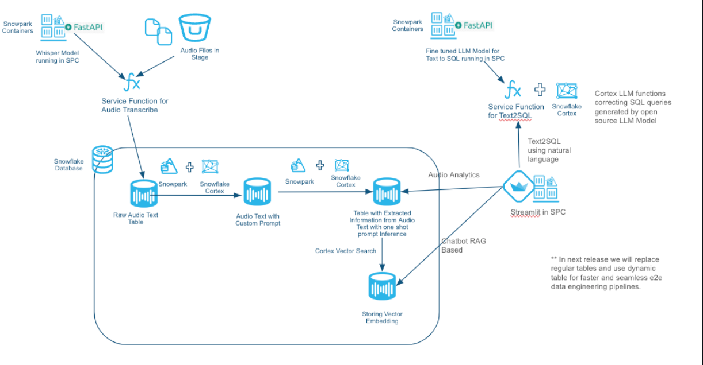
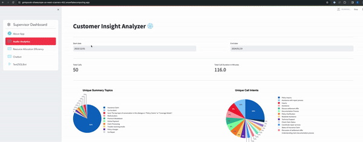
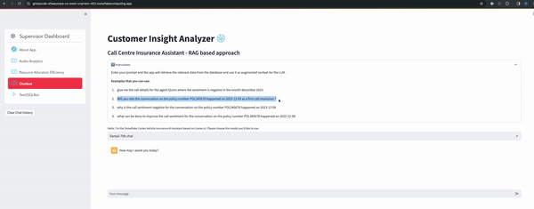
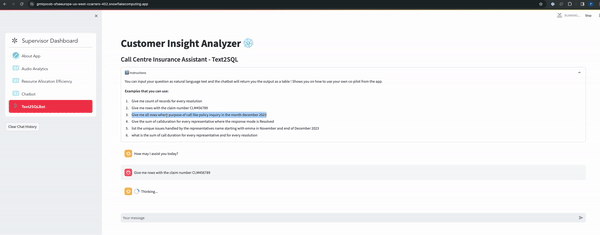
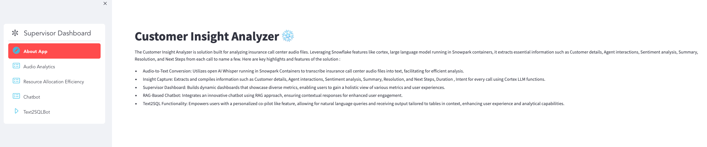

author: Phani Raj, Karuna Nadadur
id: call_centre_analytics_with_snowflake_cortex_and_spcs
summary: This guide will provide step-by-step details for building call centre analytics using Snowflake Cortex LLM functions and Snowpark Container Services
categories: Getting-Started,data-science, gen-ai
environments: web
status: Draft
feedback link: <https://github.com/Snowflake-Labs/sfguides/issues>
tags: Getting Started, Gen AI, Data Engineering, Snowpark , Python , Snowflake Cortex, Snowpark Container Services,Vectors, Embeddings,Streamlit

# Call Centre Analytics with Snowflake Cortex LLM and Snowpark Container Services
<!-- ------------------------ -->
## Overview

Duration: 15

Audio files in call centers offer rich insights beyond text. With Snowflake Cortex Functions and running open source LLM models in Snowpark Container Services, you can extract summary of the call, sentiment, and patterns which can eventually help in enhancing customer experiences. By transcribing audio to text and developing custom analytics, call centres and supervisor gain actionable insights on agent responses and proactive issue resolution, ultimately driving better customer satisfaction. These insights can inform strategic decision-making, improve operational efficiency, and drive revenue growth. From optimizing agent performance to predicting customer behavior, the possibilities are endless.

In this quick start you focus on a scenario where you are a supervisor in a vehicle insurance call centre company. As a supervisor you have to identify metrics about the agent , track few key metrics like Average Handle Time(AHT), total number of first call resolution, Sentiment count to name a few. With the help of running Whisper model with in Snowpark Container Services we can transcribe the text from audio, get the call duration and using Snowflake Cortex functions supervisor can get all these details with a help of a Streamlit App. Supervisors also get options to ask questions on the extracted audio files using natural language. Following is the solution diagram for building this solution end-end in Snowflake.



This Quickstart will cover a lot of ground, and by the end you will have built a AI application for you the Call Centre .

> You can read the medium blog post [call-centre-analytics-with-snowflake-cortex-function-and-snowpark-container-services](https://medium.com/snowflake/call-centre-analytics-with-snowflake-cortex-function-and-snowpark-container-services-5e06b4baef46) to know more about this solution in detail.
> **Note** - As of 3/28/2024, the [Vector Search] is still in private preview.

### Prerequisites

* Familiarity with Python
* Familiarity with the DataFrame API
* Familiarity with Snowflake
* Docker


### What You’ll Learn

You will learn about the following Snowflake features during this Quickstart:

* Audio-to-Text Conversion: Utilizes open AI Whisper running in Snowpark Containers to transcribe insurance call center audio files into text, extract call duration facilitating for efficient analysis.

* Insight Capture: Extracts and compiles information such as Customer details, Agent interactions, Sentiment analysis, Summary, Resolution, and Next Steps, Duration , Intent for every call using Cortex LLM functions.

* Supervisor Dashboard: Builds dashboards in Streamlit that showcase diverse metrics, enabling users to gain a holistic view of various metrics and user experiences.

* RAG-Based Chatbot: Integrates an innovative chatbot using RAG approach, ensuring contextual responses for enhanced user engagement.

* Text2SQL Functionality: Empowers users with a personalized co-pilot like feature, allowing for natural language queries and receiving output tailored to tables in context, enhancing user experience and analytical capabilities.n

### What You’ll Need

You will need the following things before beginning:

* Snowflake account in a cloud region where Snowflake Cortex LLM functions are [supported](https://docs.snowflake.com/user-guide/snowflake-cortex/llm-functions#availability).
  * **A Snowflake user created with ACCOUNTADMIN permissions**. This user will be used to get things setup in Snowflake
* GitHub account
  * **A GitHub account** If you don't already have a GitHub account you can create one for free. Visit the [Join GitHub](https://github.com/signup) page to get started.
* **VS Code** (<https://code.visualstudio.com/download>) Installed
* **Docker installed**
* **Anaconda Installed**

> **Note**: To get access to Snowflake Cortex vector functions and vector datatype (both currently in private preview) reach out to your Snowflake account team. This solution uses Cortex vector functions and vector datatype and you will encounter errors if these private preview features are not enabled in your account.


### What You’ll Build

During this Quickstart you will accomplish the following things:

* Create a SPCS service to transcribe audio files to text along with extracting duration from the audio files.
* Peform call diarization using LLAMA-2 prompt engineering techniques with cortex function providing llama-2 (70B) or Mistral 7B model.
* Extract Customer Name, Agent Name, Claim Number, First Call Resolution, Call to Action, Resolution, Update Mode to name a few from the raw audio text. Also perform call summarization using cortex LLM functions.
* Create vector embedding using Cortex function on the extracted information and storing it in the vector data type with in Snowflake. These embeddings along with the cortex vector search functionality will be used in providing a RAG based chatbot interface with in the Streamlit App 
* Building service functions for text2sql capability by hosting NumbersStation/nsql-llama-2–7B model in Snowpark Container Services using GPU’s. 
* Snowpark to invoke the cortex functions
* Create and deploy Streamlit app in SPCS

Below gif explaining the main pages of the app and the information it gives about the audio.

* Audio Analytics Page



* RAG based chatbot



* Text2SQL Bot




## Setup

Duration: 15

### Clone GitHub repository

You'll need to clone the repository for this Quickstart. Visit the [Call Centre Analytics with Snowflake Cortex LLM and Snowpark Container Services](https://github.com/Snowflake-Labs/sfguide-call-centre-analytics-with-snowflake-cortex-and-spcs).

```shell
git clone https://github.com/Snowflake-Labs/sfguide-call-centre-analytics-with-snowflake-cortex-and-spcs.git
```

### Conda setup

Open a terminal and run the following commands to create a conda virtual environment and install few packages

```shell
conda create --name demosnowparkdemo --override-channels -c https://repo.anaconda.com/pkgs/snowflake python=3.8 

conda install snowflake-snowpark-python pandas pyarrow streamlit
```

<b> Please update the [connection.json](https://github.com/Snowflake-Labs/sfguide-call-centre-analytics-with-snowflake-cortex-and-spcs/blob/main/connection.json) file located within the sfguide-call-centre-analytics-with-snowflake-cortex-and-spcs directory (in your cloned repository) to include the specifics of your Snowflake account, database, and schema. </b>

Once you have created the conda environment. The setup is broken into three main steps:

* Running whisper model in SPCS for transcribing audio files and extracting duration from audio file and loading that information into a Snowflake table. As part of this step we are extracting relavent information from the raw text required for building the dashboard, reporting and RAG based chatbot using Cortex LLM functions.
* Running a open source LLM model from NumberStation which is fine tuned on SQL queries in SPCS for generating SQL queries from the natural language text (Text2SQL) which will be intergrated into the Streamlit App.
* Creating and running a Streamlit app which is the front end for this solution running in SPCS.

## Transcribing Audio Files

In this step you will run either of the steps below. Step a will make you learn on how to setup the container which does the audio transcribe and extract call duration from the audio files. You have sample audio files for reference that you can use to get the text and call duration and understand the flow. Once you have understood the flow, we have a csv which has got all the data transcribed from audio file and made it available for the next steps to work. 

a. Run the following notebook to bring up the Whisper Container for transcribing audio to text, extract durationand creating other objects required for audio2text. This step will make you go through all the steps needed to spin up a Snowpark container services and will take around 20-40 mins depeding on you internet bandwidth as we are pushing the docker image to Snowpark image registry over the internet.

 [audio2text_setup_code.ipynb](https://github.com/Snowflake-Labs/sfguide-call-centre-analytics-with-snowflake-cortex-and-spcs/blob/main/audio2text/audio2text_setup_code.ipynb) found in **audio2text** folder in your cloned local directory.

 You can find the model card for Whisper from the following link: [ModelCard](https://github.com/openai/whisper/blob/main/model-card.md#model-details)

(OR)

 b. If you don't want to create the Audio2text container but load the raw conversation data (which is done in the previous step) into required the raw table then run the below notebook. This notebook reads the conversation from a csv file and loads into a raw table which is further used by subsequent notebooks.
[audio2text_setup_onlyConversation.ipynb ](https://github.com/Snowflake-Labs/sfguide-call-centre-analytics-with-snowflake-cortex-and-spcs/blob/main/audio2text/audio2text_setup_onlyConversation.ipynb) found in **audio2text** folder in your cloned local directory.

c. Once either a or b steps are executed, run the following notebook:

[AudioAnalytics.ipynb](https://github.com/Snowflake-Labs/sfguide-call-centre-analytics-with-snowflake-cortex-and-spcs/blob/main/audio2text/AudioAnalytics.ipynb) found in audio2text folder in the cloned folder.

AudioAnalytics notebook does the following steps:

* Use Cortex LLM functions (using Mistral-7b and LLama2-70B model) do extract various information from the raw audio text and load into Snowflake table. 
* Doing Call diarization using one shot prompting.
* Store the embeddings of the extracted information in Snowflake table required for RAG based chatbot.
* Populate a table used by the streamlit app for text2sql functionality. 

## Setup Text2SQL

In this step we are hosting a LLM model from [NumberStation](https://huggingface.co/NumbersStation/nsql-llama-2-7B) which is fine tuned on sql queries for proving text2sql capabilities. We are hosting the model in SPCS and are showing the capabilities on how you can fine tune on your dataset which will have the questions and the queries. Using Fast API we are exposing the model as a rest api endpoint.

Run the following notebook to bring up the text2sql Container and creating other objects required to run the container in SPCS. 

> This is required if you want the text2sql capabilities from the streamlit app. You can skip this step if you don't want to explore this feature. This capability will be soon replaced by Cortex Text2SQL function once its aviable in public preview. This steps helps you to learn on how you can host your own LLM model, fine tune on your dataset and eventually do the model inference all inside Snowflake platform.

 [text2sql_setup_code.ipynb](https://github.com/Snowflake-Labs/sfguide-call-centre-analytics-with-snowflake-cortex-and-spcs/blob/main/text2sql/text2sql_setup_code.ipynb) found in **text2sql** folder in your cloned local directory.

 After completing this step you will have a service function which accepts a natural language text and generates a SQL query based on the context we have set.

 ```sql
select text2sql('What is the distinct purpose of the calls in the last month?')::string;
 ```

## Setup Streamlit App

Run the following notebook to bring up the Snowpark container required for runnig Streamlit App which is the front end app for this application. Below notebook has the steps to create all the objects required to create and run the streamlit app.

 [streamlit_setup_code.ipynb](https://github.com/Snowflake-Labs/sfguide-call-centre-analytics-with-snowflake-cortex-and-spcs/blob/main/streamlit/streamlit_setup_code.ipynb) found in **streamlit** folder in your cloned local directory.

 After running the notebook below is the screenshot of home page of the streamlit app.


<!-- ------------------------ -->
## Conclusion & Resources

Duration: 5

Congratulations! You have successfully learnt how to transcibe audio files, perform analytics on unstructured data using the power of Cortex LLM functions and build a text summarization, audio analytics dashboards, RAG based and Text2SQL chatbots using Streamlit and all with in the Snowflake platform.

### What you learned

* How to host models in Snowpark Container Services to transcribe the audio files, get the call duration.
* From the transribed text, extract required details like summary, sentiment,first call resolution, audio stats to name a few using cortex LLM functions.
* Use Snowpark to create all resources and extract required information.
* How to build a RAG based chatbot using streamlit using features like cortex vector search with in snowflake.
*-* How to host a custom LLM model for text2sql capabilities and provide a text2sql chatbot interface from the streamlit app.

### Related Resources

Want to learn more about the tools and technologies used by your app? Check out the following resources:

* [Source Code on GitHub](https://github.com/Snowflake-Labs/sfguide-call-centre-analytics-with-snowflake-cortex-and-spcs)
* [Cortex LLM](https://docs.snowflake.com/en/user-guide/snowflake-cortex/llm-functions)
* [Snowpark Container Services](https://docs.snowflake.com/en/developer-guide/snowpark-container-services/overview)
* [Build powerful generative AI apps with Streamlit](https://streamlit.io/generative-ai)
* [Snowpark Python Developer Guide](https://docs.snowflake.com/en/developer-guide/snowpark/python/index)
* [Snowpark Guide for Data Engineers](https://www.snowflake.com/resource/the-data-engineers-guide-to-python-for-snowflake/)
