author: Kevin Nguyen, Snowflake CoCo
id: campaign-planning-with-coco-and-cowork
categories: snowflake-site:taxonomy/solution-center/certification/quickstart, snowflake-site:taxonomy/product/ai, snowflake-site:taxonomy/product/data-engineering, snowflake-site:taxonomy/snowflake-feature/cortex-analyst, snowflake-site:taxonomy/snowflake-feature/apache-iceberg, snowflake-site:taxonomy/snowflake-feature/snowflake-intelligence, snowflake-site:taxonomy/industry/travel-and-hospitality
language: en
summary: Land messy campaign exports in open Apache Iceberg tables, clean and standardize them with CoCo, surface audience collisions on a live collision heatmap, and answer planning questions in plain language with Snowflake CoWork.
environments: web
status: Published
feedback link: https://github.com/Snowflake-Labs/sfguides/issues


# Campaign Planning, Simplified: Build It with CoCo, Ask It with CoWork
<!-- ------------------------ -->
## Overview
Duration: 2

Campaign data comes from everywhere: ad platforms, the email & SMS platform, the CRM. Each system has its own names for channels, regions, and audiences, its own date format, and its own copy of the biggest campaigns. So nobody has a single, trustworthy view of what's launching, and teams end up hitting the same audience with competing offers in the same week.

In this hands-on lab you'll fix that for **Meridian Stay**, a fictional global hotel brand, just as its holiday season plan is going live. You'll land the raw campaign exports in open **Apache Iceberg** tables, use **Snowflake CoCo** to clean and standardize them, and surface every audience collision on a live collision heatmap. Then you'll hand the result to the whole team through **Snowflake CoWork**, so anyone can ask *"What's launching in APAC next month?"* and get an answer in seconds.

### Prerequisites
- No coding experience required. CoCo writes the SQL; you describe what you want and review the result.

### What You'll Learn
- How to clone a public GitHub repo as a Git-backed Snowflake Workspace and run a notebook inside it
- How to land raw data in **Snowflake-managed Apache Iceberg tables**, an open format that other engines can read
- How to use **CoCo** to standardize labels, parse dates and budgets, remove duplicates, and filter out cancelled campaigns
- How to find audience collisions across teams and channels
- How to run and customize a **Streamlit** collision heatmap with CoCo
- How to create a **Semantic View** with CoCo and a **Cortex Agent** backed by it
- How to investigate business questions in plain language in **Snowflake CoWork**

### What You'll Need
- A free Snowflake trial account: [https://signup.snowflake.com/](https://signup.snowflake.com/?utm_source=snowflake-devrel&utm_medium=developer-guides&trial=student&cloud=aws&region=us-east-2&utm_campaign=introtosnowflake&utm_cta=developer-guides)
- The companion GitHub repo: [https://github.com/Snowflake-Labs/expedition-2026-day-2-hol](https://github.com/Snowflake-Labs/expedition-2026-day-2-hol)

### What You'll Build
- A governed, deduplicated campaign list built from three messy exports, stored as Iceberg
- A table of every audience collision in Meridian Stay's November 2026 – January 2027 plan
- A live collision heatmap app
- A Cortex Agent that answers campaign-planning questions in Snowflake CoWork

<!-- ------------------------ -->
## Open a Snowflake Trial Account
Duration: 3

To complete this lab, you'll need a Snowflake account. A free Snowflake trial account works well. To open one:

1. Navigate to [https://signup.snowflake.com/](https://signup.snowflake.com/?utm_source=snowflake-devrel&utm_medium=developer-guides&trial=student&cloud=aws&region=us-east-2&utm_campaign=introtosnowflake&utm_cta=developer-guides). This link pre-selects **AWS** and the **US East (Ohio)** region for you.

2. Complete the first page of the form.

3. On the next section, set the Snowflake edition to **Enterprise (Most popular)**.

4. Confirm **AWS – Amazon Web Services** is selected as the cloud provider (pre-filled by the link).

5. Confirm **US East (Ohio)** is selected as the region (pre-filled by the link).

6. Complete the rest of the form and click **Get started**.

<!-- ------------------------ -->
## Understand the Scenario
Duration: 2

You're on the marketing operations team at Meridian Stay, and it's November 2026. Last year, the Loyalty team and Brand Marketing both targeted rewards members with competing Black Friday offers, and nobody noticed until the emails went out. Leadership wants to know: is it about to happen again?

The root cause is simple: campaign plans live in three systems that don't agree with each other.

| Source system | Export | How it's messy |
|---|---|---|
| Ad platforms | `paid_media_export.csv` | Channel codes like `fb_ads` and `google_ads`, region `NA`, budgets stored as text (`"$65,000"`), and two rows exported twice |
| Email & SMS platform (e.g., Marketo, HubSpot, Braze) | `email_sms_export.csv` | `MM/DD/YYYY` dates, regions like `US & Canada`, segments like `Corporate Segment` |
| CRM | `crm_campaigns_export.csv` | `Nov 02, 2026` dates, copies of the biggest paid campaigns (one with a trailing space, one in ALL CAPS), and a **cancelled** campaign, *Veterans Day Weekend Blitz*, that was never removed |

### Here's the plan

1. **Land** the three exports, exactly as they arrived, in **Apache Iceberg** tables.
2. **Clean** them with CoCo into one governed campaign list, also stored as Iceberg.
3. **Find** every audience collision: two campaigns aimed at the same audience in the same region on overlapping dates.
4. **See** where collisions cluster on a live heatmap and put a dollar value on them.
5. **Ask** planning questions in plain language through a Cortex Agent in **Snowflake CoWork**.

Everything through step 4 runs from a **single notebook** (`lab.ipynb`) and a pre-built app in the companion repo. Step 5 is done in the Snowsight UI. Let's get started!

<!-- ------------------------ -->
## Set Up Your Workspace
Duration: 5

There are no setup scripts to run and no SQL worksheets to open first. Your first action is to create a **Git-backed Workspace** that clones the companion repo. The repo contains the notebook you'll run (`lab.ipynb`), the three campaign exports (`data/`), and the collision heatmap app (`campaign_timeline/`).

### Sign in as ACCOUNTADMIN

Make sure you are signed into your trial account. Confirm your active role is **ACCOUNTADMIN**: click your name in the bottom-left corner of Snowsight to see the active role. If it shows a different role, choose **Switch role** → **ACCOUNTADMIN**.

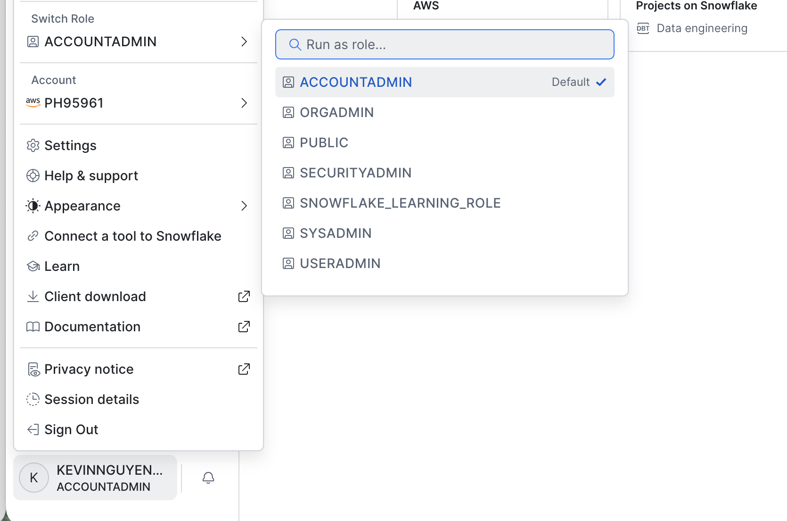

### Create a Git-backed Workspace

1. In Snowsight, navigate to **Projects » Workspaces**.

2. Click the **+** icon next to **Workspaces/Databases** → **Create new Git workspace**.

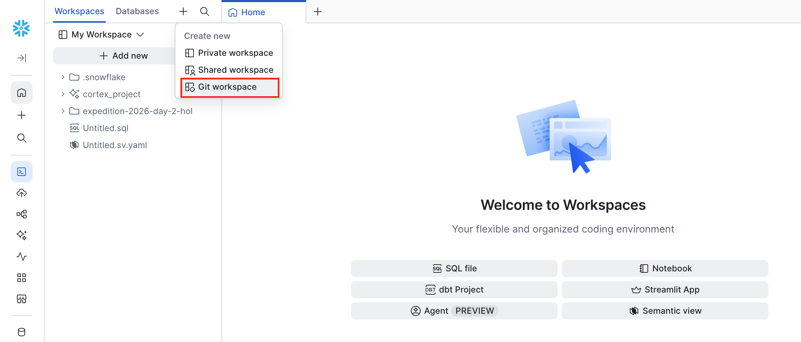

3. Fill out the modal:
   - **Repository URL:** `https://github.com/Snowflake-Labs/expedition-2026-day-2-hol`
   - **Workspace name:** anything you like (e.g., `campaign-planning`)
   - **API integration:** click **+ / Create new** and provide:
     - **Name:** `GITHUB_MERIDIAN_LAB`
     - **Allowed prefixes:** `https://github.com/Snowflake-Labs`
   - Check **Public repository**.

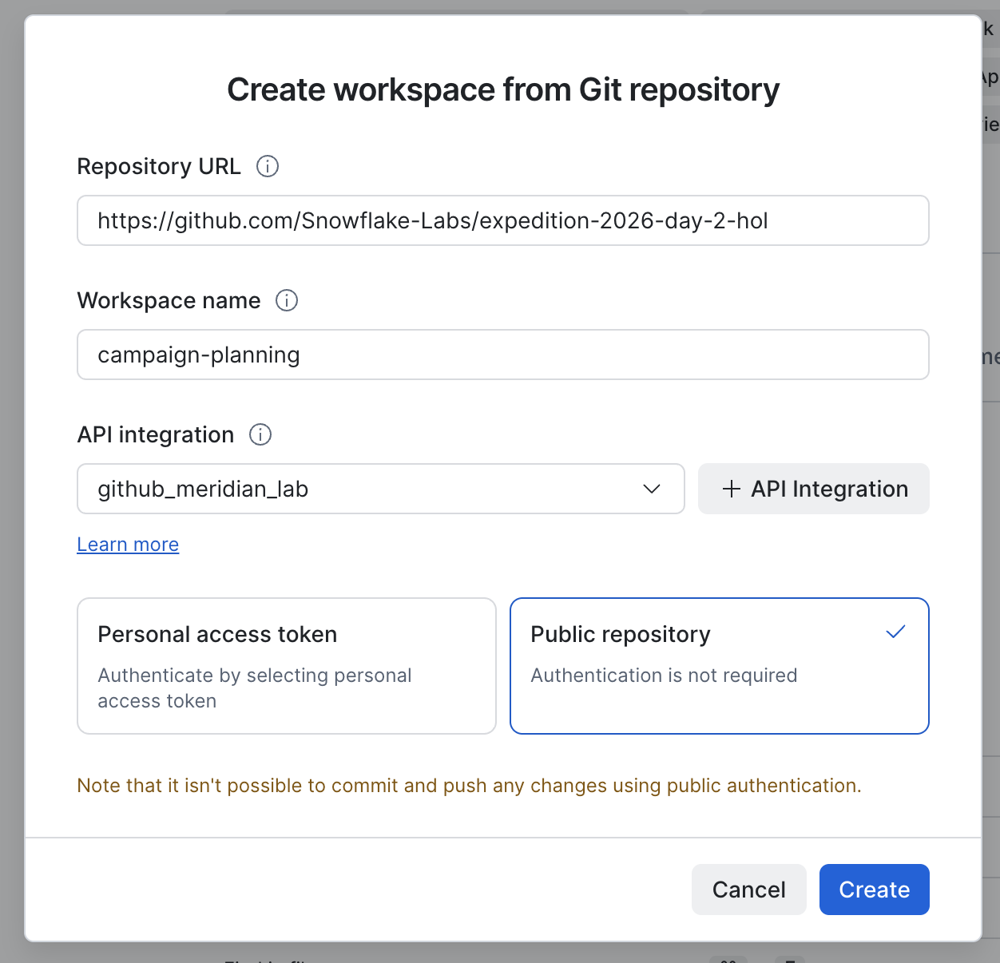
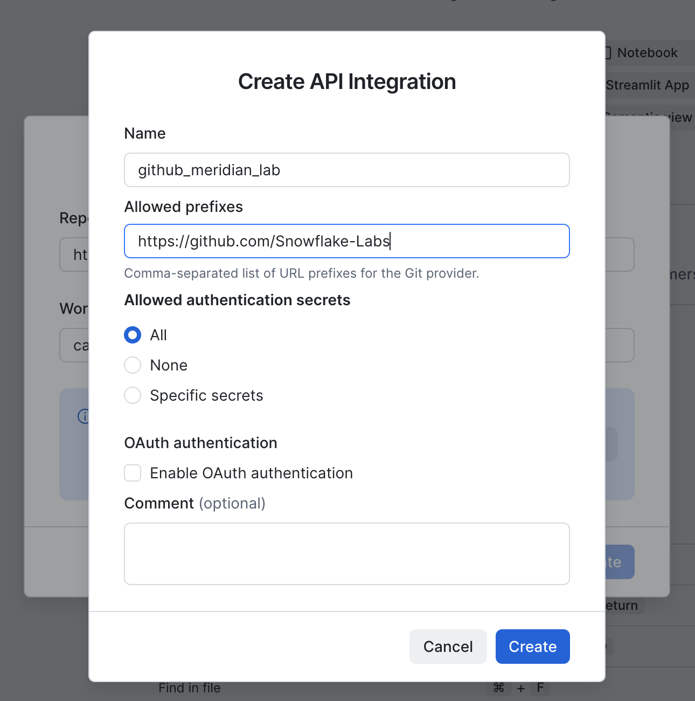

4. Click **Create**.

> **What just happened?** The Workspace modal created a Git API integration for you, a one-time step that tells Snowflake which GitHub organization is an allowed source for Git-backed Workspaces.

The Workspace opens with the repo's files visible in the file explorer on the left.

### Open the notebook and set its compute

1. In the Workspace file explorer, open **`lab.ipynb`**.

2. Click **Connect** next to the Run button and select **Create and connect**. Wait for the status bar at the bottom of the notebook to show **Connected** before proceeding.

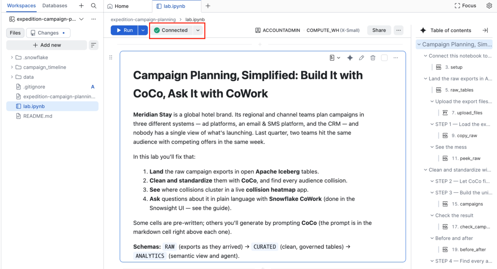

3. Set the notebook's active **role** and **warehouse** using the **role & warehouse picker** at the top of the Notebooks editor:
   - **Role:** **ACCOUNTADMIN**
   - **Warehouse:** **COMPUTE_WH** (the default warehouse in every trial account)

4. Work top-to-bottom through the notebook. Markdown cells explain each step; code cells contain the SQL, some of which you'll generate yourself with CoCo. Run a cell with **▶** (or **Shift+Enter**).

> Throughout the lab, the notebook shows a **CoCo prompt** in the markdown cell directly above each empty SQL cell. You can use the prompts from there or copy them from this guide. They should be identical or similar.

### Open the CoCo panel

Open the **CoCo** chat panel from the Workspace toolbar. You'll send it prompts throughout the lab.

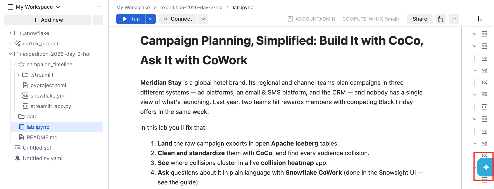

> **Key principle:** Use CoCo to generate the hard parts and understand why. The workflow is: describe → generate → compare → run. After CoCo generates SQL, compare it against the **Expected output** shown in the notebook. If they match, click **Allow** to run it. Optionally, copy the SQL into the notebook cell for future reference.

### Run the setup cell

The first SQL cell in the notebook (**`setup`**) creates the `MERIDIAN_STAY` database with three schemas:

- `RAW`: the exports, exactly as they arrived
- `CURATED`: clean, governed tables
- `ANALYTICS`: the semantic view and agent

It also grants the Cortex Agent privileges your role needs later. Run the **`setup`** cell before continuing. You should see *"Statement executed successfully."*

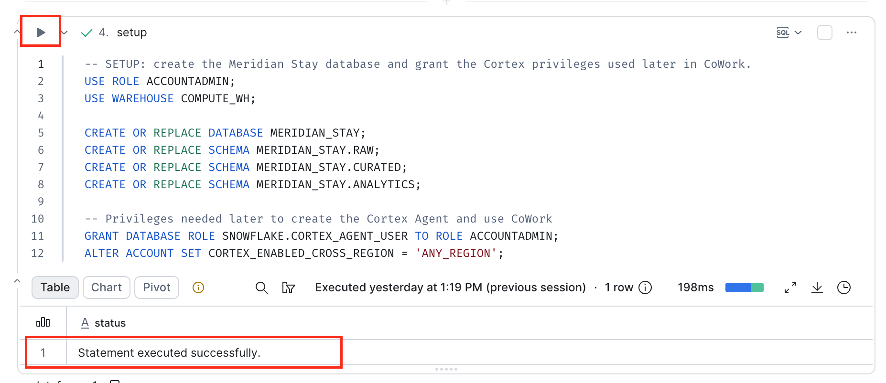

<!-- ------------------------ -->
## Land Raw Exports
Duration: 7

The first step is to get the raw exports into Snowflake **without changing them**, so you always have the original to compare against.

### Why Apache Iceberg?

**Apache Iceberg** is an open table format. An Iceberg table's data is stored as Parquet files plus open metadata, so other engines (Spark, Trino, DuckDB, and more) can read the same tables through Snowflake Horizon Catalog. Your campaign data stays open instead of being locked into one tool, which matters when the data science team, an agency, or a partner platform needs it too.

In this lab you'll use **Snowflake-managed Iceberg tables** (`CATALOG = 'SNOWFLAKE'` and `EXTERNAL_VOLUME = 'SNOWFLAKE_MANAGED'`). Snowflake manages the storage for you, so there's no cloud bucket or IAM setup.

### Create the raw tables

Run the **`raw_tables`** cell. It creates:

- Three raw Iceberg tables, one per export, with every column as `STRING` (exactly as exported)
- A CSV file format, `RAW.CSV_FF`
- An internal stage, `RAW.CAMPAIGN_EXPORTS`, to hold the files

### Upload the export files

Run the **`upload_files`** Python cell. It copies the three CSVs from the repo's `data/` folder into the stage. You should see three files with status `UPLOADED`.

### STEP 1 — Load the exports

`COPY INTO` is Snowflake's bulk-loading command. It reads files from a stage and inserts them into a table, and it works the same way whether the target is a standard table or an Iceberg table.

Send this prompt to CoCo. Compare the output against the expected output in the notebook. If they match, click **Allow** to run it.

> *"Load the three CSV files in the stage @MERIDIAN_STAY.RAW.CAMPAIGN_EXPORTS into their matching Iceberg tables in MERIDIAN_STAY.RAW: paid_media_export.csv into PAID_MEDIA_EXPORT, email_sms_export.csv into EMAIL_SMS_EXPORT, and crm_campaigns_export.csv into CRM_CAMPAIGNS_EXPORT. Use the file format MERIDIAN_STAY.RAW.CSV_FF and load the columns in file order."*

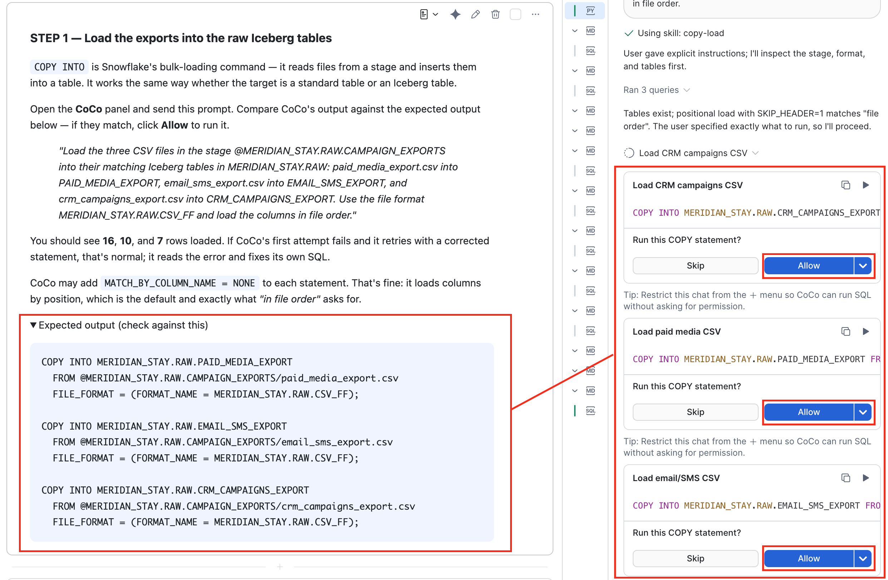

You should see **16**, **10**, and **7** rows loaded. If CoCo's first attempt fails and it retries with a corrected statement, that's normal: it reads the error and fixes its own SQL.

> **Seeing `MATCH_BY_COLUMN_NAME = NONE` at the end of each statement?** That's fine. It tells Snowflake to load columns by position, which is the default and exactly what *"in file order"* asks for.

### See the mess

Run the **`peek_raw`** cell. It lines up all 33 raw rows from the three exports in one grid, sorted by campaign name so copies of the same campaign sit next to each other. Scroll through and notice:

- *Thanksgiving Getaway Sale* appears **three times**: twice in the ad platform export (a re-export duplicate) and once in the CRM, with a trailing space.
- *Black Friday Mega Sale* appears twice, once in ALL CAPS.
- The same channel is `fb_ads` in one system and `Social Media` in another; the same region is `NA`, `US & Canada`, or `N. America`.
- Three date formats: `2026-11-02`, `11/09/2026`, and `Nov 02, 2026`.
- Budgets like `"$65,000"` are text, not numbers.
- *Veterans Day Weekend Blitz* has a status of **Cancelled**, but it's still in the list.

You can't find collisions until all three systems speak the same language, and that's next.

<!-- ------------------------ -->
## Clean and Standardize With CoCo
Duration: 12

Now you'll turn three messy exports into one governed campaign list. This usually takes a marketing ops analyst a day of spreadsheet work. With CoCo, you describe the rules in plain language and review the SQL it writes.

### The rules

- **One vocabulary.** Every channel, region, and audience maps to a single standard label.
- **Real dates and numbers.** Three date formats become real `DATE` values, and `"$65,000"` becomes `65000.00`.
- **No duplicates.** A campaign that appears in more than one system, or twice in the same export, is kept once. The system of record (ad platforms or the email & SMS platform) wins over the CRM copy.
- **No cancelled campaigns.** A cancelled CRM campaign shouldn't show up on anyone's plan.

### STEP 2 — Let CoCo find the mess

Before building anything, ask CoCo to compare the three sources. It queries the raw tables itself and shows you how differently each system describes the *same* things.

> *"Compare how the three tables in MERIDIAN_STAY.RAW label channel, region, and audience. Map every label to one of these standard values:*
> - *Channel: Paid Social, Paid Search, Display, Email, SMS*
> - *Region: North America, EMEA, APAC, LATAM, Global*
> - *Audience: Leisure Travelers, Business Travelers, Families, Loyalty Members, Meeting Planners, Wellness Seekers, All Guests*
>
> *Also point out how dates and budgets are formatted differently, and any campaigns whose status means they shouldn't be on the plan."*

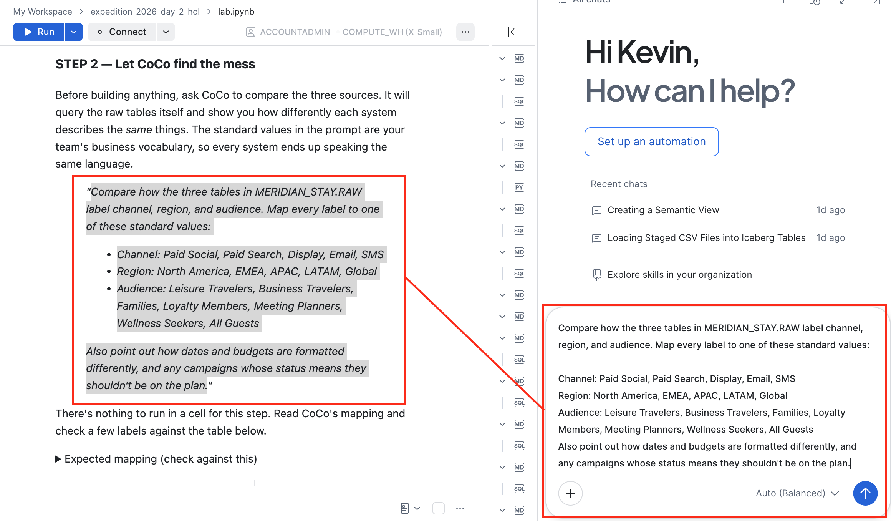

CoCo should map, for example, `fb_ads`, `paid_social`, and `Social Media` to **Paid Social**, and `NA`, `US & Canada`, and `N. America` to **North America**. It should also call out the three date formats, the text budgets, and the cancelled *Veterans Day Weekend Blitz*. It may mention the **Draft** *Tokyo Business District Launch* too; drafts are still planned, so it stays. The full expected mapping is in the notebook.

> **Why give CoCo the standard values?** They're business decisions, like "`Corporate Segment` means Business Travelers." Listing them is how you make sure CoCo applies *your* team's vocabulary instead of inventing its own.

### STEP 3 — Build the unified CAMPAIGNS table

In the **same CoCo conversation**, send this prompt. CoCo reuses the mapping from STEP 2 and writes the SQL. Your SQL may not match the expected output in the notebook word for word, and that's fine; the check cell is what tells you it's right. Click **Allow** to run it.

> *"Using that mapping, create a Snowflake-managed Iceberg table MERIDIAN_STAY.CURATED.CAMPAIGNS (EXTERNAL_VOLUME = 'SNOWFLAKE_MANAGED') that combines the three raw tables into one campaign list:*
> - *Columns: campaign_id, campaign_name, channel, region, audience, start_date, end_date, budget_usd, owner_team, status, source_system*
> - *Convert dates and budgets to real dates and numbers*
> - *Drop cancelled campaigns*
> - *Remove duplicates with the same name (ignoring case and extra spaces) and dates, keeping the ad platform or email & SMS copy over the CRM copy"*

### Check the result

Run the **`check_campaigns`** cell. You should see:

| campaigns | unmapped_values | channels | regions | audiences |
|---|---|---|---|---|
| 27 | 0 | 5 | 5 | 7 |

That's 33 raw rows, minus 5 duplicates and 1 cancelled campaign. If your numbers are different, ask CoCo to fix it rather than editing the SQL yourself:

- `unmapped_values` above 0: *"Which rows in MERIDIAN_STAY.CURATED.CAMPAIGNS have a NULL channel, region, audience, date, or budget? Fix the mapping."*
- More than 27 campaigns: *"Which campaigns appear more than once in MERIDIAN_STAY.CURATED.CAMPAIGNS? Fix the duplicate removal."*

Short on time? Paste the expected output from the notebook into the empty cell and run it.

### Before and after

Run the **`before_after`** cell. It shows the campaigns that needed the most cleaning, as they arrived in `RAW` and as they are now in `CURATED`:

| Layer | Source | Campaign | Channel | Region | Audience | Start date | Budget | Status |
|---|---|---|---|---|---|---|---|---|
| Before | CRM_CAMPAIGNS_EXPORT | Thanksgiving Getaway Sale *(trailing space)* | Social Media | N. America | Leisure | Nov 02, 2026 | 65000 | Active |
| Before | PAID_MEDIA_EXPORT | Thanksgiving Getaway Sale | fb_ads | NA | leisure | 2026-11-02 | $65,000 | |
| Before | PAID_MEDIA_EXPORT | Thanksgiving Getaway Sale | fb_ads | NA | leisure | 2026-11-02 | $65,000 | |
| **After** | Paid Media | Thanksgiving Getaway Sale | Paid Social | North America | Leisure Travelers | 2026-11-02 | 65000.00 | Active |

The same happens for *Black Friday Mega Sale* (two copies become one), and *Veterans Day Weekend Blitz* has no "after" row at all. Six messy rows become two clean ones.

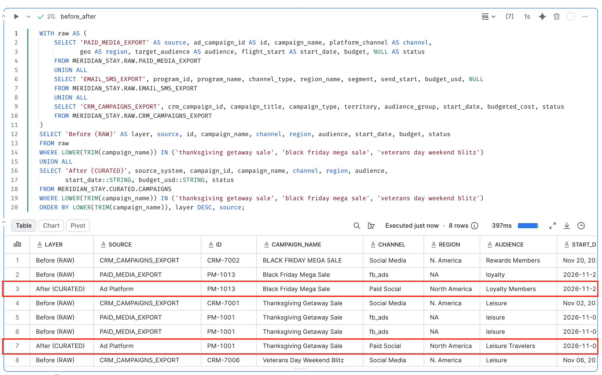

### STEP 4 — Find every audience collision

A **collision** is two different campaigns that target the same audience, in the same region, on overlapping dates. That's exactly what happened with last year's Black Friday offers.

Send this prompt to CoCo. Compare the output against the expected output in the notebook, then click **Allow** to run it. The prompt names the columns so that everyone's table matches the Semantic View and CoWork questions later.

> *"Create a Snowflake-managed Iceberg table MERIDIAN_STAY.CURATED.CAMPAIGN_COLLISIONS (EXTERNAL_VOLUME = 'SNOWFLAKE_MANAGED') listing every pair of campaigns in CURATED.CAMPAIGNS that target the same region and audience on overlapping dates. List each pair once.*
> - *Columns: campaign_a_id, campaign_a_name, campaign_b_id, campaign_b_name, region, audience, overlap_start, overlap_end, overlap_days, combined_budget_usd"*

### Check the result

Run the **`check_collisions`** cell. You should see **9 rows**, with `total_collisions` = **9** and `total_combined_budget` = **$557,500**. If you see 18 rows, each pair is listed twice; ask CoCo to *"list each pair only once."* The collisions are (A and B may be swapped in your table):

| Campaign A | Campaign B | Region | Audience | Overlap starts | Combined budget |
|---|---|---|---|---|---|
| Amex Travel Partner Promo | Business Travel Year-End Push | North America | Business Travelers | 2026-11-09 | $80,000 |
| Autumn Weekend Escapes | Thanksgiving Getaway Sale | North America | Leisure Travelers | 2026-11-09 | $77,000 |
| Amex Travel Partner Promo | Road Warrior Rewards | North America | Business Travelers | 2026-11-16 | $9,000 |
| Road Warrior Rewards | Business Travel Year-End Push | North America | Business Travelers | 2026-11-16 | $89,000 |
| Loyalty Double Points Month | Black Friday Mega Sale | North America | Loyalty Members | 2026-11-20 | $97,000 |
| EMEA Winter Sun | London Festive Stays | EMEA | Leisure Travelers | 2026-12-01 | $63,000 |
| Holiday Gift Card Push | Holiday Family Getaways | North America | Families | 2026-12-05 | $47,500 |
| APAC Year-End Flash Sale | Singapore Staycation Deals | APAC | Families | 2026-12-20 | $40,000 |
| Tokyo Cherry Blossom Preview | Sydney Summer Kickoff | APAC | Leisure Travelers | 2027-01-10 | $55,000 |

Five of the nine are in **November**, including the answer to leadership's question: *Loyalty Double Points Month* and *Black Friday Mega Sale* are about to hit rewards members at the same time, again.

Notice what's *not* on the list: the cancelled *Veterans Day Weekend Blitz*. Without the clean-up step, it would have raised two false alarms against *Thanksgiving Getaway Sale* and *Autumn Weekend Escapes*.

<!-- ------------------------ -->
## See Where Collisions Cluster
Duration: 9

A table of collisions is useful. A view the whole team can scan in five seconds is better. The companion repo includes a pre-built **Streamlit** app that turns `CURATED.CAMPAIGNS` into a **collision heatmap** for the whole holiday season.

### Run the heatmap

1. In the Workspace file explorer, open **`campaign_timeline/streamlit_app.py`**.

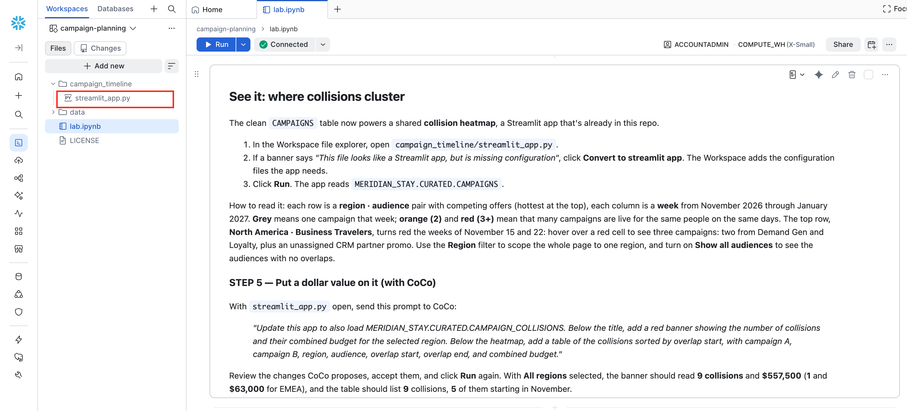

2. If a banner says *"This file looks like a Streamlit app, but is missing configuration"*, click **Convert to streamlit app**. The Workspace adds the configuration files the app needs.

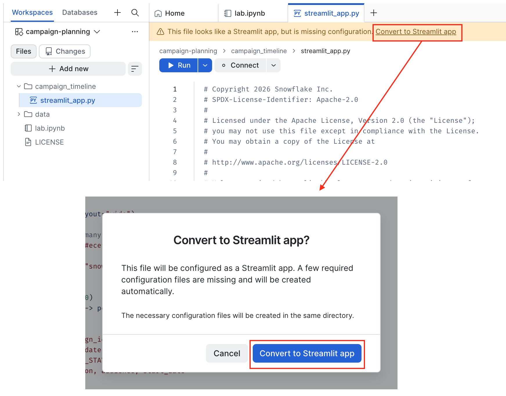

3. Click **Run**. The app runs privately for you on a container runtime and reads straight from `MERIDIAN_STAY.CURATED.CAMPAIGNS`.

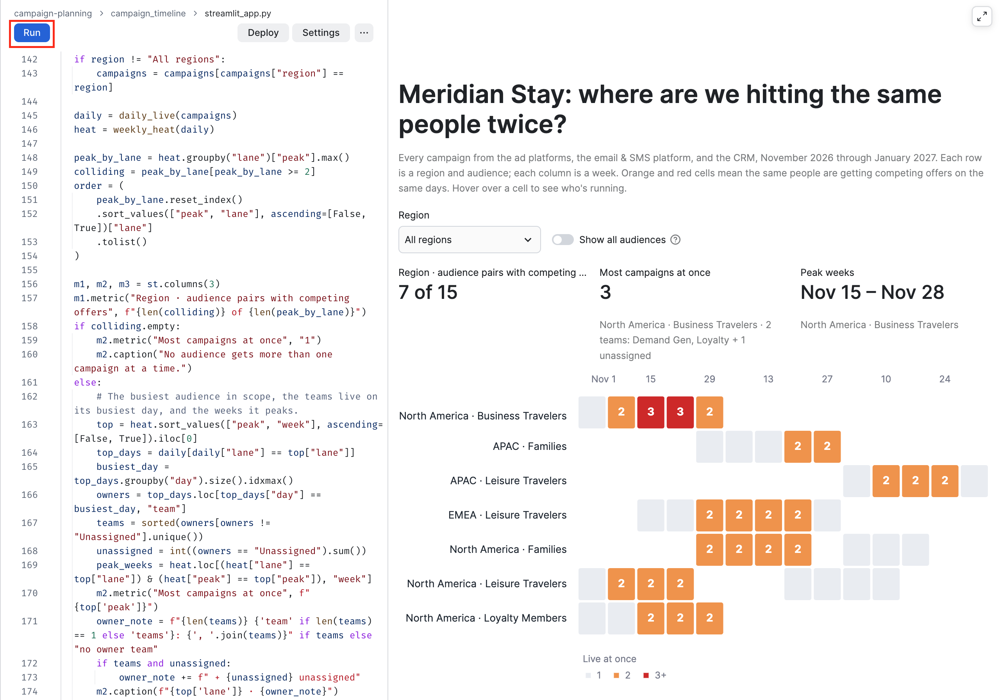

### How to read it

- Each **row** is a region and audience pair, like *North America · Business Travelers*. The app opens on only the pairs with competing offers, hottest at the top.
- Each **column** is a week, from November 2026 through January 2027.
- A **grey** cell means one campaign is reaching that audience that week, which is fine. An **orange (2)** or **red (3+)** cell means that many campaigns are live for the same people on the same days.

Start with the three numbers at the top: **7 of 15** region and audience pairs are getting competing offers, and the busiest one, North America · Business Travelers, has **3** campaigns live at once, peaking **Nov 15 – Nov 28**. The caption under it reads *2 teams: Demand Gen, Loyalty + 1 unassigned*. Now hover over one of the red cells in the top row: Demand Gen and Loyalty are both aimed at the same business travelers, and so is *Amex Travel Partner Promo*, a CRM campaign with no owner team. This isn't a one-off; it's a planning problem.

Use the **Region** filter to see one region's view: everything on the page, including the numbers at the top, follows it. Pick **EMEA**, and you'll see **1 of 4** EMEA pairs with competing offers. Turn on **Show all audiences** to see the pairs that have no overlaps. Use **Inspect an audience** below the heatmap to see every campaign for one row, with its owner, dates, and budget.

### STEP 5 — Put a dollar value on it

The heatmap shows *where* the plan collides. Leadership will ask *how much is at stake*. Ask CoCo to bring in the collisions table. With `streamlit_app.py` open, send this prompt:

> *"Update this app to also load MERIDIAN_STAY.CURATED.CAMPAIGN_COLLISIONS. Below the title, add a red banner showing the number of collisions and their combined budget for the selected region. Below the heatmap, add a table of the collisions sorted by overlap start, with campaign A, campaign B, region, audience, overlap start, overlap end, and combined budget."*

Review the changes CoCo proposes, accept them, and click **Run** again. You should see:

- A red banner reading **9 collisions** and **$557,500** in combined budget with **All regions** selected, and **1 collision** and **$63,000** for **EMEA**
- A collisions table with **9** rows, starting with the two that begin on **November 9**
- **5** of the 9 collisions starting in November, matching the cluster of orange and red cells on the left side of the heatmap

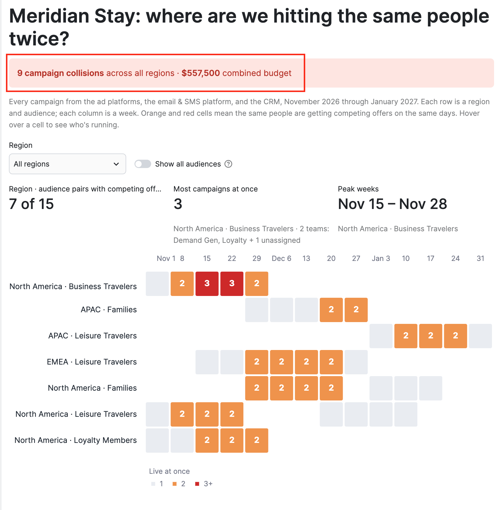

> **Want to share it?** Click **Deploy** in the Workspace to publish the app to `MERIDIAN_STAY.ANALYTICS` so teammates with access can open it from **Projects » Streamlit**. This step is optional for the lab.

<!-- ------------------------ -->
## Ask It With CoWork
Duration: 18

The data is clean and the heatmap is live. Now make it available to everyone, in plain language. You'll create a **Semantic View** with CoCo, a **Cortex Agent** backed by it, and investigate the plan in **Snowflake CoWork**. This happens in the Snowsight UI; no SQL is required.

### STEP 6 — Create the Semantic View with CoCo

A Semantic View describes your data in **business terms**: which columns are dimensions (things you filter and group by, like region or channel), which are facts (raw values, like budget), and which words people use for them (*"territory"* means region, *"segment"* means audience). It's the bridge that lets Cortex Analyst turn a question like *"What's launching in APAC in January?"* into correct SQL.

1. In Snowsight, navigate to **AI & ML → Analyst**.

2. Click **Create in Workspaces** in the top right.

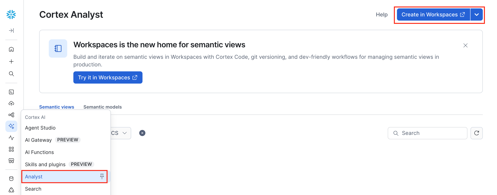

3. Click **Create with CoCo**. Snowsight opens a new `.sv.yaml` file, and the CoCo panel asks for a name, a location, and the source tables.

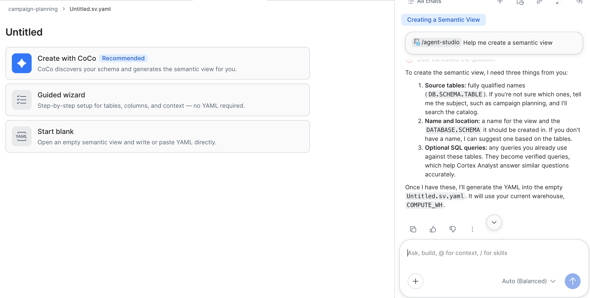

4. Send CoCo this prompt:

> *"Create the semantic view with these details:*
> - *Name: CAMPAIGN_PLANNING_SV*
> - *Location: MERIDIAN_STAY.ANALYTICS*
> - *Source tables: MERIDIAN_STAY.CURATED.CAMPAIGNS and MERIDIAN_STAY.CURATED.CAMPAIGN_COLLISIONS*
> - *Use campaign_id as the unique key for CAMPAIGNS, and add clear descriptions and synonyms for region, audience, and channel*
> - *Make BUDGET_USD a fact on CAMPAIGNS, and make COMBINED_BUDGET_USD and OVERLAP_DAYS facts on CAMPAIGN_COLLISIONS*
> - *Make START_DATE and END_DATE time dimensions on CAMPAIGNS, and OVERLAP_START and OVERLAP_END time dimensions on CAMPAIGN_COLLISIONS*
> - *Add this verified query for "Which campaigns collide, and how much combined budget is involved?": SELECT campaign_a_name, campaign_b_name, region, audience, overlap_start, overlap_end, combined_budget_usd FROM MERIDIAN_STAY.CURATED.CAMPAIGN_COLLISIONS ORDER BY overlap_start"*

5. Allow CoCo to create the Semantic View draft in the Workspace. This creates an editable draft; it does not publish the view yet.

6. Review the draft in the Semantic View editor, one table at a time. Confirm it contains:

   **`CAMPAIGNS`**
   - `CAMPAIGN_ID` as the unique key
   - **Facts:** `BUDGET_USD`
   - **Time Dimensions:** `START_DATE` and `END_DATE`
   - **Synonyms:** `REGION` (*geography, market, territory*), `AUDIENCE` (*segment, target group*), and `CHANNEL` (*medium, platform*)

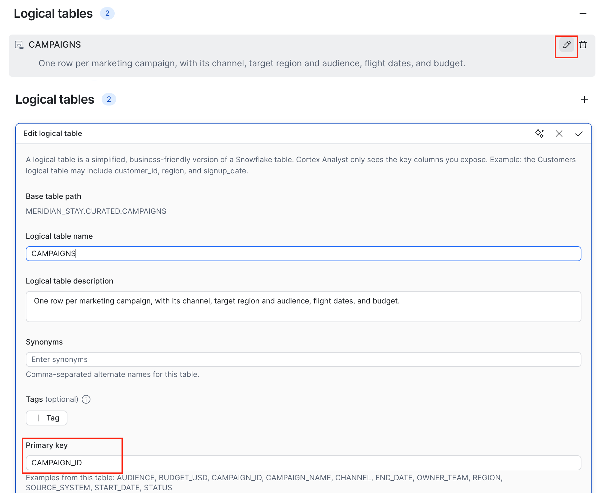

   **`CAMPAIGN_COLLISIONS`**
   - **Facts:** `COMBINED_BUDGET_USD` and `OVERLAP_DAYS`
   - **Time Dimensions:** `OVERLAP_START` and `OVERLAP_END`
   - **Synonyms:** `REGION` (*geography, market, territory*) and `AUDIENCE` (*segment, target group*)

   **Verified queries**
   - One verified query: *"Which campaigns collide, and how much combined budget is involved?"*

   CoCo may also add metrics, such as a total budget, or extra synonyms. That's fine. If one of the items above differs, for example `OVERLAP_DAYS` landing under **Dimensions**, ask CoCo to fix it (*"Make OVERLAP_DAYS a fact"*) before publishing.

7. Click **Publish** in the top right of the editor. In the dialog, confirm **Name** `CAMPAIGN_PLANNING_SV`, **Database** `MERIDIAN_STAY`, and **Schema** `ANALYTICS`, then click **Publish**.

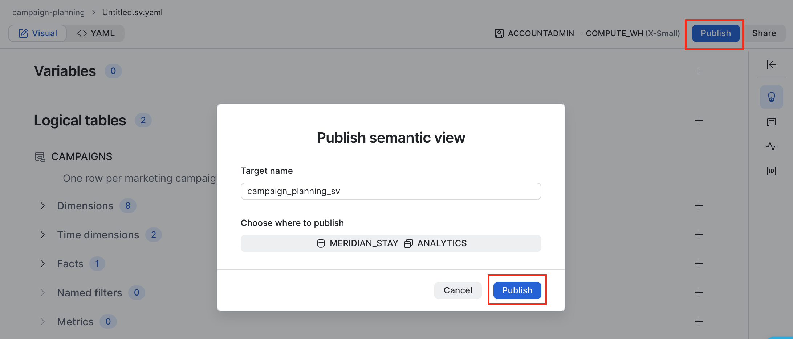

> **Prefer to click through it yourself?** Choose **Guided wizard** in step 3 instead, select both `CURATED` tables and all columns, name it `CAMPAIGN_PLANNING_SV` in `MERIDIAN_STAY.ANALYTICS`, and click **Publish**.

### STEP 7 — Create the Cortex Agent

**Cortex Analyst** is Snowflake's text-to-SQL engine; it reads the Semantic View to understand your data. The **Cortex Agent** receives questions, routes them to Cortex Analyst, and writes the answer.

1. In Snowsight, navigate to **AI & ML → Agent Studio**.

2. Click **Create agent** in the top right.

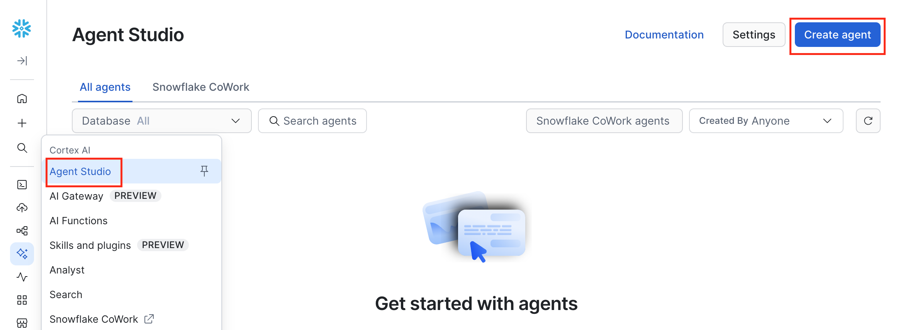

3. Configure:
   - **Database and schema:** `MERIDIAN_STAY.ANALYTICS`
   - **Agent object name:** `CAMPAIGN_PLANNING_AGENT`

4. Click **Create**.

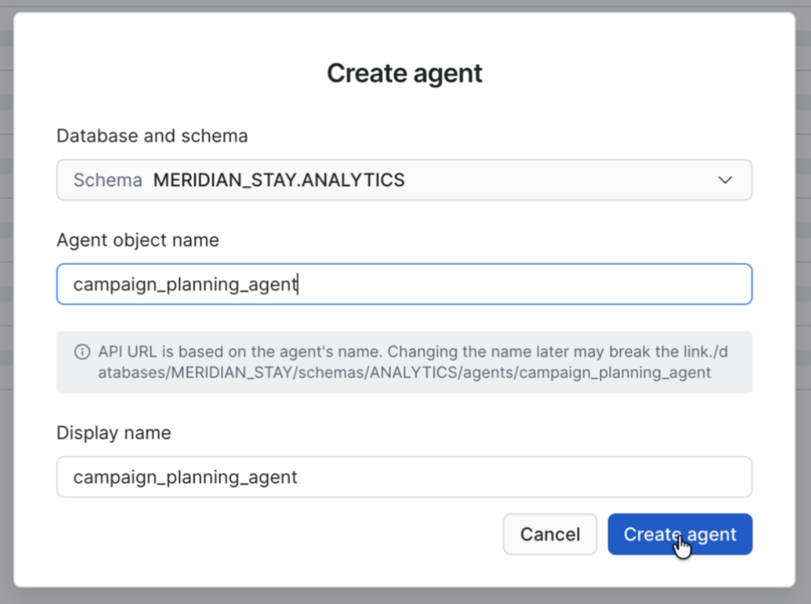

5. Click **Configuration** near the top of the agent editor.

6. Under the **General** tab, set:
   - **Description:** `I am the Meridian Stay Campaign Planning Agent. I answer questions about planned marketing campaigns across every channel, region, and audience, and I flag campaigns that target the same audience at the same time.`
   - **Example questions:**
     - `Which campaigns collide over the same audience between November 2026 and January 2027, and how much combined budget is involved?`
     - `Which collisions are happening in November 2026?`
     - `What's launching in APAC in January 2027?`

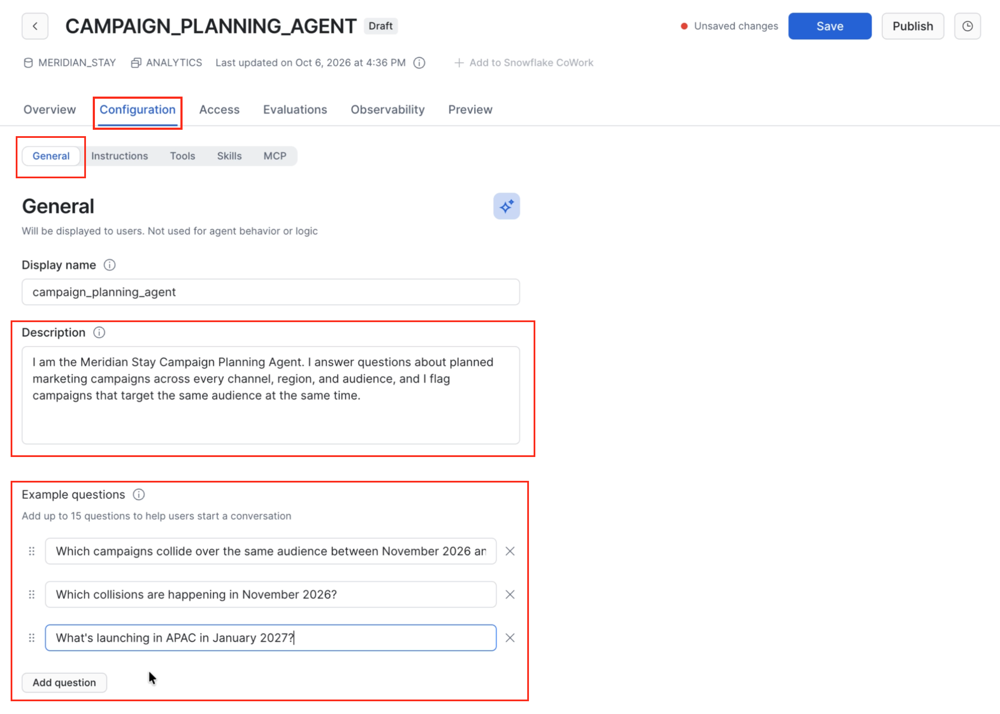

7. Under the **Instructions** tab, set:
   - **Orchestration instructions:** `Whenever you can answer visually with a chart, always choose to generate a chart even if the user didn't ask for one.`
   - **Response instructions:** `Give concise, accurate answers for marketing planners. Name campaigns explicitly and include dates, budgets, and owner teams when relevant.`

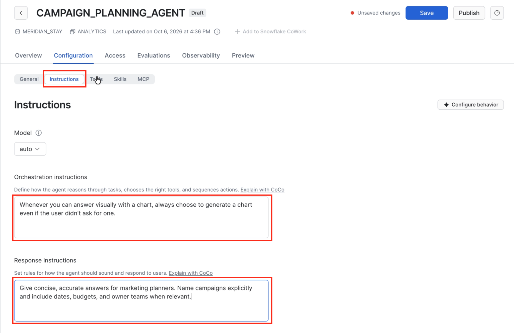

8. Click **Tools → Add semantic view**.

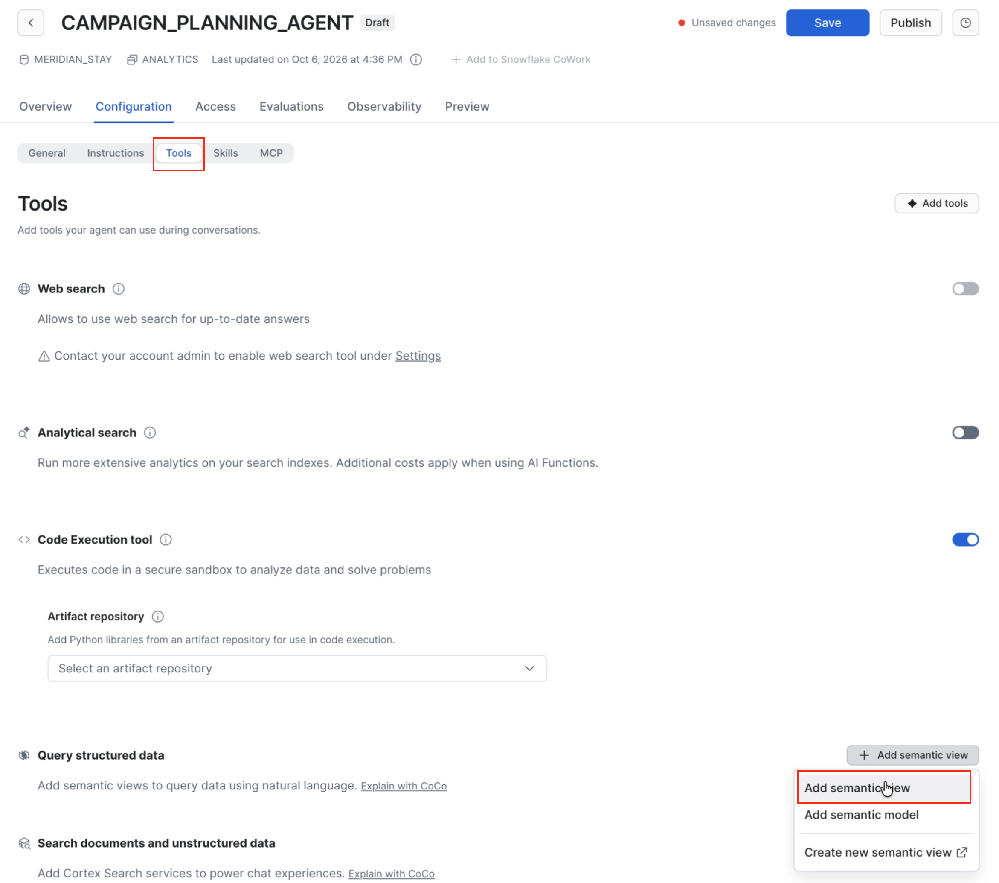

9. Configure the tool:
   - **Service database & schema:** `MERIDIAN_STAY.ANALYTICS`
   - **Select semantic view:** `CAMPAIGN_PLANNING_SV`
   - **Name:** `CAMPAIGN_PLANNING_ANALYST`
   - **Description:** `Answers questions about Meridian Stay's planned campaigns and audience collisions`

10. Click **Add**, then click **Save** in the top right.

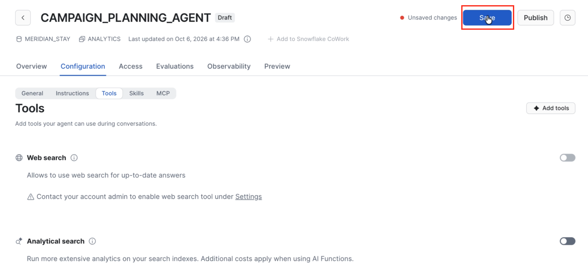

### STEP 8 — Ask the agent the key question

Since you created the agent through the UI, it's already available in Snowflake CoWork.

1. In Snowsight, navigate to **AI & ML → Snowflake CoWork**.

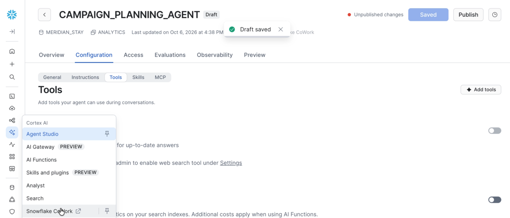

2. Select **CAMPAIGN_PLANNING_AGENT** from the agent list.

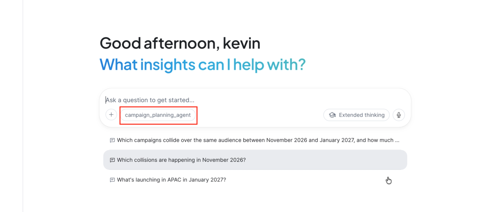

3. Ask:

   > *"Which campaigns collide over the same audience between November 2026 and January 2027, and how much combined budget is involved?"*

The agent should list **9 collisions** with a combined budget of **$557,500**.

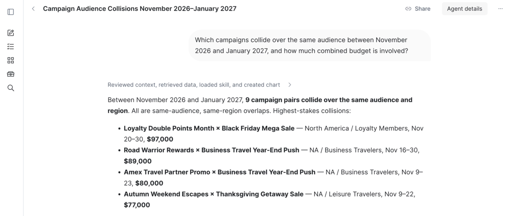

### Investigate in CoWork

The first answer tells you *that* there's a problem. Continue the same conversation to find out *where* to act, the way a planner would:

1. **Focus on this month.** Ask: *"Which of those collisions are in November 2026? Chart them by region and audience."*

   You should see **5** November collisions, and **North America · Business Travelers** stands out with **3** of them.

2. **Look inside the pile-up.** Ask: *"For North America business travelers in November 2026, list each campaign's channel, dates, budget, and owner team."*

   You should see *Business Travel Year-End Push* (Paid Search, Nov 1–30, $80,000, Demand Gen), *Road Warrior Rewards* (Email, Nov 16–30, $9,000, Loyalty), and *Amex Travel Partner Promo* (Email, Nov 9–23, $0). The Amex promo only exists in the CRM, so it has no owner team. That's a real finding: a partner campaign nobody on the marketing side owns.

3. **Check the repeat offender.** Ask: *"Do the Loyalty Double Points Month and Black Friday Mega Sale campaigns overlap? For how many days, and what's the combined budget?"*

   They overlap for **11 days** (Nov 20–30) with **$97,000** combined, so last year's Black Friday problem is set to repeat.

4. **Look ahead.** Ask: *"What's launching in APAC in January 2027?"*

   You should see *Tokyo Cherry Blossom Preview*, *Sydney Summer Kickoff*, and the draft *Tokyo Business District Launch*.

5. **Turn it into action.** Ask: *"Draft a short Slack message to the North America Demand Gen and Loyalty teams explaining the November business-traveler overlap and suggesting how to stagger the three campaigns."*

Your results may vary in wording and chart choice. Before acting on an answer, review the SQL and the rows behind it, especially for totals and date ranges.

### What CoWork adds

The notebook produced clean, open Iceberg tables. The Semantic View gives them business meaning and the words your team actually uses. The Cortex Agent makes that model available in CoWork, where anyone on the team can go from *"is there a problem?"* to *"who needs to talk to whom this week?"* without writing a query or waiting on a report.

<!-- ------------------------ -->
## Teardown
Duration: 1

Once you've finished the lab, run the **`teardown`** cell in the notebook, or execute the following in a SQL worksheet:

> **Before running teardown:** If you're running this guide as part of an Expedition workshop, make sure to run the autograder and answer key before running the teardown. The autograder checks for objects created during this lab, so dropping the database beforehand will cause it to fail.

```sql
USE ROLE ACCOUNTADMIN;

-- Drops all schemas, Iceberg tables, the stage, the semantic view, and the Cortex Agent
DROP DATABASE IF EXISTS MERIDIAN_STAY;

-- Removes the Git API integration created for the workspace
DROP API INTEGRATION IF EXISTS GITHUB_MERIDIAN_LAB;
```

> **Note:** Dropping `MERIDIAN_STAY` cascades to everything inside it. If you deployed the heatmap app to `MERIDIAN_STAY.ANALYTICS`, it's removed too.

<!-- ------------------------ -->
## Conclusion And Resources
Duration: 1

Congratulations! You took Meridian Stay's holiday campaign plan from three disconnected exports to a shared collision heatmap and an agent anyone can ask, prompting CoCo along the way.

### What You Learned

- Landed raw exports in **Snowflake-managed Apache Iceberg tables**, keeping the data in an open format
- Used **CoCo** to standardize labels, parse three date formats and text budgets, remove cross-system duplicates, and drop cancelled campaigns
- Found **9 audience collisions** worth **$557,500** in combined budget, including a three-way North America business-traveler pile-up and a repeat of last year's Black Friday overlap
- Ran a **Streamlit** collision heatmap and used CoCo to add the collisions and their combined budget
- Created a **Semantic View** with CoCo and a **Cortex Agent** backed by it
- Investigated the plan in plain language in **Snowflake CoWork**

### Related Resources

- [Apache Iceberg™ tables in Snowflake](https://docs.snowflake.com/en/user-guide/tables-iceberg)
- [Git-backed Workspaces documentation](https://docs.snowflake.com/en/user-guide/ui-snowsight/workspaces-git)
- [Streamlit in Snowflake in Workspaces](https://docs.snowflake.com/en/developer-guide/streamlit/streamlit-in-workspaces/streamlit-in-workspaces-overview)
- [Semantic Views documentation](https://docs.snowflake.com/en/user-guide/views-semantic/sql)
- [Cortex Agents documentation](https://docs.snowflake.com/en/user-guide/snowflake-cortex/cortex-agents-manage)
- [Snowflake CoWork documentation](https://docs.snowflake.com/en/user-guide/snowflake-cortex/snowflake-cowork/getting-started)
- [Snowflake Documentation](https://docs.snowflake.com/)
