author: Brenna Buuck
id: cdc_data_from_oracle_to_snowflake_in_streamsets
summary: CDC Data from Oracle to Snowflake in StreamSets
categories: data-engineering
environments: web
status: Published 
feedback link: community@streamsets.com
tags: Oracle CDC

# Process Change Data Capture (CDC) data from Oracle to Snowflake Using StreamSets
<!-- ------------------------ -->
## Overview 
Duration: 1

Change Data Capture (CDC) is a design pattern to determine, track, capture, and deliver changes made to enterprise data sources. These sources are typically relational databases like Oracle, MySQL, and PostgreSQL. CDC is critical because when changes occur at the source the changed data must be made available to downstream destinations like data warehouses, because decisions can’t be made and analysis can’t be done using stale data.

Given this critical need, let's look at how StreamSets DataOps Platform can be used to process CDC data from Oracle to Snowflake. To do this, you will build a data pipeline with StreamSets to send change data from Oracle to Snowflake. A data pipeline describes the flow of data from origin to destination systems and defines how to process the data along the way. Pipelines can access multiple types of external systems, including cloud data lakes, cloud data warehouses, and storage systems installed on-premises such as relational databases.

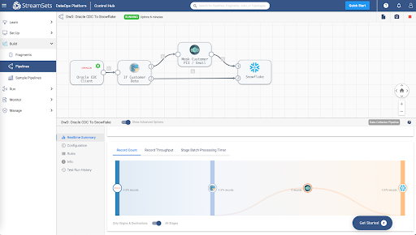

### Prerequisites
- Access to [StreamSets DataOps Platform account](https://cloud.login.streamsets.com/login)
- Setup [Environment](https://docs.streamsets.com/portal/platform-controlhub/controlhub/UserGuide/Environments/Overview.html#concept_z4x_nw2_v4b)
- Setup Deployment with engine type Data Collector
  - Once a deployment has been successfully activated, the Data Collector
 engine must be up and running before you can create pipelines and
 run jobs
- Access to [Snowflake](https://signup.snowflake.com/) account
- Access to Oracle database
  - Check [versions of Oracle](https://docs.streamsets.com/portal/datacollector/4.0.x/help/datacollector/UserGuide/Installation/SupportedSystemVersions.html#concept_k4l_5ft_v4b) supported for CDC
  - Complete [Oracle CDC prerequisites](https://docs.streamsets.com/portal/datacollector/4.0.x/help/datacollector/UserGuide/Origins/OracleCDC.html#concept_xwg_33w_cx)

**NOTE:** As a precursor in order to migrate existing data before processing CDC records, follow the [Oracle to Snowflake](https://go.streamsets.com/rs/535-TEA-657/images/StreamSets-Oracle-Snowflake-TechGuide.pdf) guided walkthrough before proceeding.

### What You’ll Learn 
In this guide, you will learn how to process Change Data Capture (CDC) data from Oracle to Snowflake in StreamSets DataOps Platform.
<!-- ------------------------ -->
## Import Pipeline
Duration: 1

To get started making a pipeline in StreamSets, download the [sample pipeline from GitHub](https://github.com/iamontheinet/StreamSets/blob/master/Sample%20Pipelines/Oracle%20CDC%20To%20Snowflake/Oracle%20CDC%20To%20Snowflake.zip) and use the **Import a pipeline** feature to create an instance of the pipeline in your StreamSets DataOps Platform account.

This sample pipeline includes some processors (Stream Selector and Field Masker) to show how StreamSets can help you transform data as it passes through the pipeline. They aren't necessary for a basic CDC design pattern, but are included to show such a design pattern might be extended.

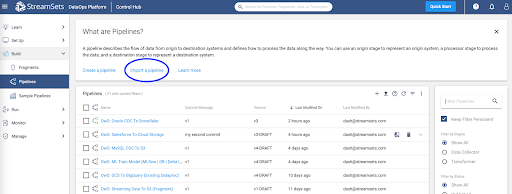

Once the pipeline has been imported, open it in the pipeline canvas and select
**Authoring Data Collector** -- this is the Data Collector engine that would have
been deployed once your deployment was successfully activated.

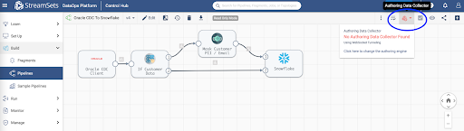
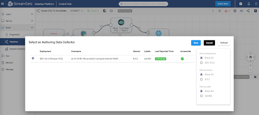

<!-- ------------------------ -->
## Configure Oracle CDC Client Origin
Duration: 2

[Oracle CDC Client](https://docs.streamsets.com/portal/#datacollector/latest/help/datacollector/UserGuide/Origins/OracleCDC.html#concept_rs5_hjj_tw) origin will enable you to capture Create, Update, and Delete operations across various tables in your Oracle data warehouse so that your Snowflake Data Cloud can be kept in sync.

Key configuration on **Oracle CDC** tab for this setup:
  - Set **Table Name** Pattern to “%” -- this wildcard will capture changes across
  all tables in your Oracle data warehouse
  - Set **Dictionary Source** to ***Online Catalog***

For other configuration details such as JDBC connection string, limiting CDC operation to specific tables instead of all tables, LogMiner session window, transaction length, System change number, etc., refer to the detailed [configuration section](https://docs.streamsets.com/portal/#datacollector/latest/help/datacollector/UserGuide/Origins/OracleCDC.html#task_ehh_mjj_tw).

In StreamSets DataOps Platform, it is really easy to optionally apply any number
of transformations to data while it’s in motion flowing through the pipeline.
Here are a couple of examples using [Stream Selector](https://docs.streamsets.com/portal/datacollector/latest/help/datacollector/UserGuide/Processors/StreamSelector.html#concept_tqv_t5r_wq) and [Field Masker](https://docs.streamsets.com/portal/datacollector/latest/help/datacollector/UserGuide/Processors/FieldMasker.html#concept_hjc_t4k_wq)
processors.

<!-- ------------------------ -->
## Configure Stream Selector Processor
Duration: 2

This is an optional step and can be removed before proceding. This processor will conditionally route records based on user-defined conditions. For instance, in this case, we’d like to protect customer email addresses from being ingested (in plaintext) in Snowflake.

Key configuration on **Conditions** tab for this setup:
  - Set Condition 1 to expression ${str:toLower(record:attribute(‘oracle.cdc.
    table’)) == str:toLower(‘customers’)} -- this will route records being read from
    ‘customers’ table through Field Masker; all other records will flow directly
    into Snowflake.

<!-- ------------------------ -->

## Configure Field Masker Processor
Duration: 2

This is another optional processor. This processor will enable us to “mask” PII in configured fields. In this case, it is configured to mask customer email addresses before sending it over to Snowflake.

Key configuration on **Mask** tab for this setup:
• Set Fields to Mask to /CUSTOMER_EMAIL
• Set Mask Type to Custom
• Set Custom Mask to XXXXXXXX

<!-- ------------------------ -->
## Snowflake Destination Configuration
Duration: 2

[Snowflake](https://docs.streamsets.com/portal/#datacollector/latest/help/datacollector/UserGuide/Destinations/Snowflake.html#concept_vxl_zzc_1gb) destination uses the MERGE command to write CDC data that’s being
captured from Oracle. Note that this provides real-time access to data as it is
written into Snowflake tables.

Key configuration on **Snowflake Connection Info** tab for this setup:
  - Set **Snowflake Region, Account, User, and Password**
      **Note:** You can also take advantage of [Snowflake Connection](https://docs.streamsets.com/portal/#platform-controlhub/controlhub/UserGuide/ConnectionTypes/Snowflake.html#concept_ycf_xvd_q4b) so
      these attributes can be used across multiple pipelines, shared with
      team members and any changes to credentials can be made in a
      centralized location.

Key configuration on **Snowflake tab** for this setup:
  - Set **Warehouse, Database, Schema, and Table**
      **Note:** Setting Table to ${record:attribute(‘oracle.cdc.table’)} will
      dynamically get the table name from the record header attribute
      generated by the [Oracle CDC Client](https://docs.streamsets.com/portal/#datacollector/latest/help/datacollector/UserGuide/Origins/OracleCDC.html#concept_rs5_hjj_tw) origin
  - Enable Table Auto Create -- this will automatically create the tables if they
  don’t already exist in Snowflake

Key configuration on **Data tab** for this setup:
  - Enable **Processing CDC Data (Use MERGE)**
  - Set **Table Key Columns** for all the tables you’d like to capture and sync
  changes. For example, in this case we’d like to sync records from the
  following tables:
- Table: **CUSTOMERS;** Key Columns: CUSTOMER_ID
- Table: **ORDERS;** Key Columns: ORDER_ID
- Table: **ORDER_ITEMS;** Key Columns: ORDER_ITEM_ID, ORDER_ITEM_
 ORDER_ID

For other configuration details such as **Staging, Snowflake File Format**, defaults for missing fields, etc. refer to the [configuration section](https://docs.streamsets.com/portal/#datacollector/latest/help/datacollector/UserGuide/Destinations/Snowflake.html#task_nfs_c2k_mfb).

<!-- ------------------------ -->
## Set Pipeline Parameters
Duration: 2

Click on the **Edit** button and
update the following pipeline parameters.

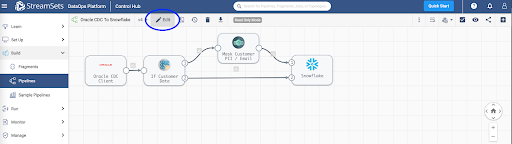

Pipeline parameters to update.
  - SNOWFLAKE_WH
  - SNOWFLAKE_DB
  - SNOWFLAKE_SCHEMA
  - SNOWFLAKE_ACCOUNT
  - SNOWFLAKE_USER
  - SNOWFLAKE_PWD
  - ORACLE_JDBC_URL
  - ORACLE_JDBC_USERNAME
  - ORACLE_JDBC_PASSWORD

  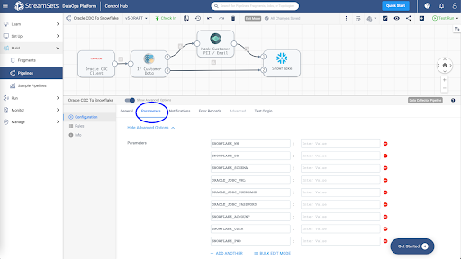

  <!-- ------------------------ -->
## Pipeline Validation, Preview and Test Run
Duration: 2

Once you’ve updated the pipeline parameters, you can **Validate** it to make sure the credentials are correct.

 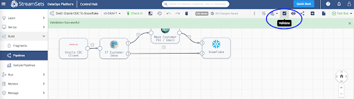

Then, **Preview** the data to make sure the transformations are accurate.

 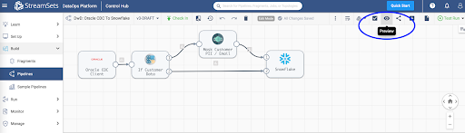

Next, **Test Run** the pipeline to ensure the data is being ingested into Snowflake correctly.

 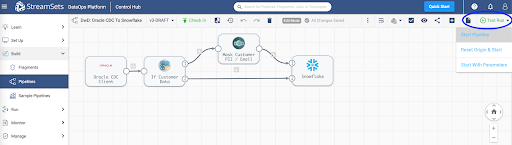

<!-- ------------------------ -->
 ## Create and Run a Job

Once you’ve successfully executed a pipeline test run you can **Check In** your pipeline.

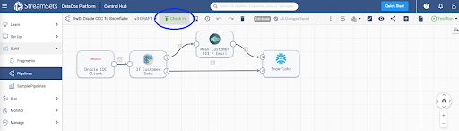

You can create a job to run your pipeline. Jobs enable you to execute, manage and orchestrate data pipelines that run across multiple engines. You can increase the number of pipeline instances that run for a job, or you can enable a job for pipeline failover to minimize downtime due to unexpected failures.

 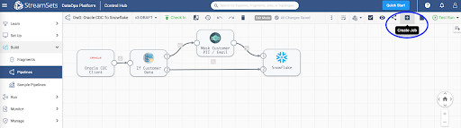

 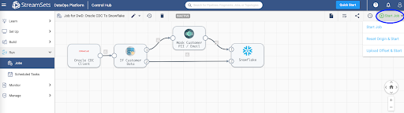

For more information on jobs, refer to the [documentation.](https://docs.streamsets.com/portal/#platform-controlhub/controlhub/UserGuide/Jobs/Jobs.html#concept_omz_yn1_4w)

<!-- ------------------------ -->
## Monitor Job

When you start a job, Control Hub sends the pipeline to the engines. The engine runs the pipeline, sending status updates and metrics back to Control Hub.

As the job runs, click the Realtime Summary tab in the monitor panel to view the real-time statistics for the job.

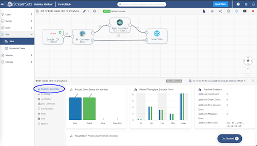

For more information on monitoring jobs, refer to the [documentation.](https://docs.streamsets.com/portal/#platform-controlhub/controlhub/UserGuide/Jobs/Jobs-Monitoring.html#concept_msl_4nv_2y)

<!-- ------------------------ -->
## Conclusion

You've learned how to process Change Data Capture (CDC) data from Oracle to Snowflake in StreamSets DataOps Platform.

Get up and running with StreamSets in minutes - free. [Start Now.](https://cloud.login.streamsets.com/signup)

Join our conversation at the [StreamSets Community](https://community.streamsets.com/)