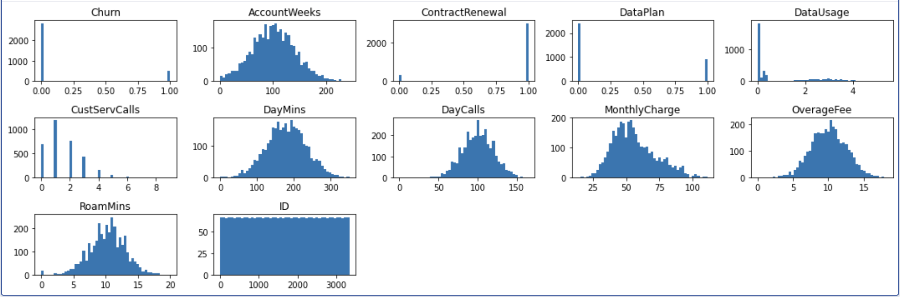
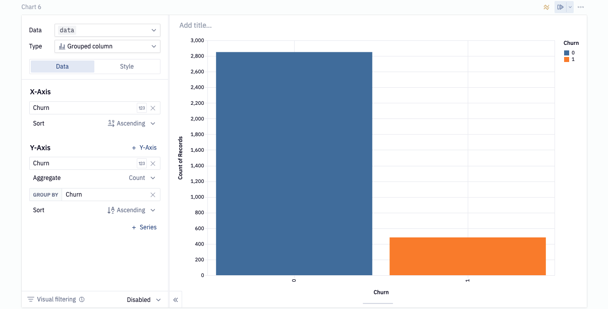
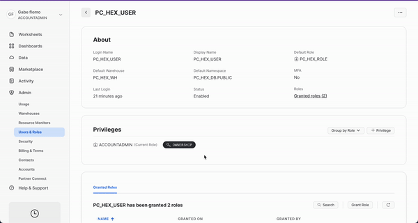
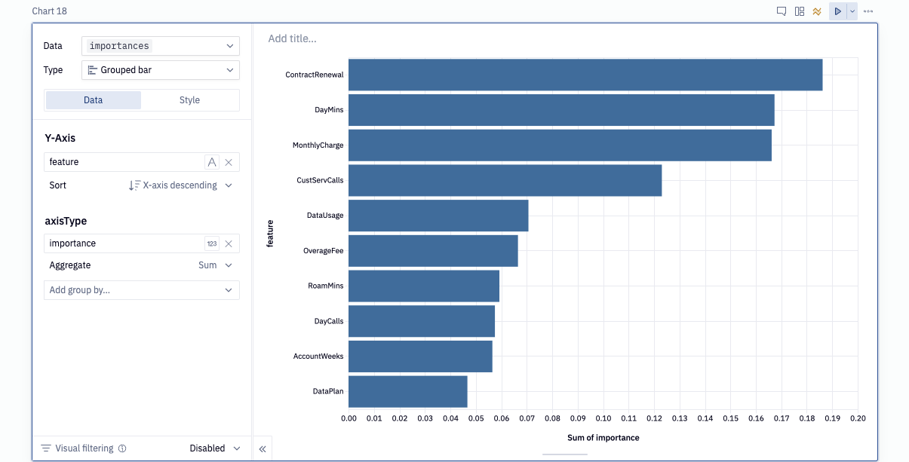
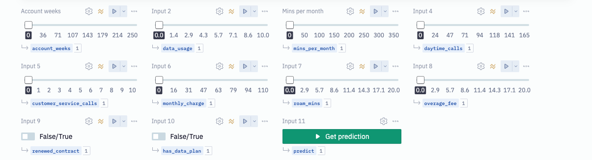

author: gflomo@hex.tech
id: hex-churn-model
summary: This lab will walk you through how to use Snowflake and Hex.
categories: data-science-&-ml,partner-integrations
environments: web
status: Published
feedback link: https://github.com/Snowflake-Labs/sfguides/issues
tags: Hex, Notebooks, Partner Connect

# Churn modeling using Snowflake and Hex


## Overview 
Duration: 5
In this demo, we will play the role of a data scientist at a telecom company that wants to identify users who are at high risk of churning. To accomplish this, we need to build a model that can learn how to identify such users. We will demonstrate how to use Hex in conjunction with Snowflake/Snowpark to build a Random Forest Classifier to help us with this task.

### Prerequisites
* Familiarity with basic Python and SQL
* Familiarity with training ML models
* Familiarity with data science notebooks
* Go to the [Snowflake](https://signup.snowflake.com/) sign-up page and register for a free account. After registration, you will receive an email containing a link that will take you to Snowflake, where you can sign in.


### What You'll Learn
* How to import/export data between Hex and Snowflake
* How to train a Random Forest model and deploy to Snowflake using UDFs
* How to visualize the predicted results from the forecasting model
* How to convert a Hex project into an interactive web app and make predictions on new users


<!-- ------------------------ -->


## Setting up partner connect
Duration: 5
After logging into your Snowflake account, you will land on the `Learn` page. To connect with Hex, navigate to the `Admin` tab on the left and click on `Partner connect`. In the search bar at the top, type `Hex` and the Hex partner connect tile will appear. Clicking on the tile will bring up a new screen, and click the `connect button` in the lower right corner. A new screen will confirm that your account has been created, from which you can click `Activate`.


### Creating a workspace
After activating your account, you'll be directed to Hex and prompted to create a new workspace and give it a name. Once you've named your workspace, you'll be taken to the projects page where you can create new projects, import existing projects (Hex or Jupyter), and navigate to other sections of your workspace.


## Getting Started with Hex
Now we can move back over to Hex and get started on our project. The first thing you'll need to do is download the Hex project that contains all of the code to train our model.

<button>

[Download Hex project](https://static.hex.site/SFS_Churn_model_yaml.yaml)

</button>


Now that you've got your project imported, you will find yourself in the [Logic view](https://learn.hex.tech/docs/develop-logic/logic-view-overview) of a Hex project. The Logic view is a notebook-like interface made up of cells such as code cells, markdown cells, input parameters and more! On the far left side, you'll see a control panel that will allow you to do things like upload files, import data connections, or search your project. Before we dive into the code, we'll need to:

1. Change our compute profile to run Python 3.8
2. Import our Snowflake data connection

Which we can do all from the left control panel. To change the compute profile, click on the Environments tab represented by a cube. At the top of this section you'll see the compute profile portion at the top. Click on the Image dropdown and select Python 3.8.


Next we can import our data connection by heading over to the Data sources tab represented by a database icon with a lightning bolt. You should see two data connections -  [Demo] Hex public data and Snowflake. Import both connections. 


One nice feature of Hex is the [reactive execution model](https://learn.hex.tech/docs/develop-logic/compute-model/reactive-execution). This means that when you run a cell, all related cells are also executed so that your projects are always in a clean state. However, to ensure we don’t get ahead of ourselves, were going to turn this feature off. In the top right corner of your screen, you’ll see a Run mode dropdown. If this is set to Auto, select the dropdown and change it to cell only.


## Reading and writing data 
Duration: 8
To predict customer churn, we first need data to train our model. In the SQL cell labeled **Pull churn results** assign `[Demo] Hex public data` as the data connection source and run the cell.

```SQL
select * from "DEMO_DATA"."DEMOS"."TELECOM_CHURN"
```

At the bottom of this cell, you will see a green output variable labeled `dataframe`. This is a Pandas dataframe, and we are going to write it back into our `Snowflake` data connection. To do so, input the following configurations to the writeback cell (labeled: **Writeback to snowflake)**

- **Source**: dataframe
- **Connection**: Snowflake
- **Database**: PC_HEX_DB
- **Schema**: Public
- **Table**: *Static* and name it CHURN

Once the config is set, enable `Logic session` as the writeback mode (in the upper right of the cell) and run the cell.

In the SQL cell labeled **Churn data**, change the data source to `Snowflake` and execute the cell. You will see a green output variable at the bottom. Double-click on it and rename it to `data`.
## Data preparation 
Duration: 2
Now that we have our data in Hex, we want to make sure the it’s clean enough for our machine learning algorithm. To ensure this, we’ll first check for any null values.

```python
data.isnull().sum()
```
Now that we have checked for null values, let's look at the distribution of each variable.

```python
# create a 15x5 figure
plt.figure(figsize=(15, 5))

# create a new plot for each variable in our dataframe
for i, (k, v) in enumerate(data.items(), 1):
    plt.subplot(3, 5, i)  # create subplots
    plt.hist(v, bins = 50)
    plt.title(f'{k}')

plt.tight_layout()
plt.show();
```



The charts' results allow us to visualize each variables distribution, which can help us identify early signs of skewness, among other things. We can see that all of our continuous variables follow a fairly normal distribution, and further transformations won't be necessary. The `DataUsage` column appears a little off because many customers use 0GB of data, but there are also a lot of users who didn't have data plans in the first place, so this isn't considered an anomaly.
## Understanding churn rate
Duration: 2
If you take a look at our visuals, you may notice that the churn chart looks a little odd. Specifically, it looks like there are a lot more users who haven’t churned than who have.  

We take a closer look at this by visualizing in a chart cell.


As you can see, the majority of observations are in support of user who haven’t yet churned. Specifically, 85% of user haven’t churned while the other 15% has. In machine learning, a class imbalance such as this can cause issues when evaluating the model since it’s not getting equal attention from each class. In the next section we will go over a method to combat the imbalance problem.
## Model training
Duration: 10
In order to predict the churn outcomes for customers not in our dataset, we’ll need to train a model that can identify users who are at risk of churning from the history of users who have. However, it was mentioned in the last section that there is an imbalance in the class distribution that will cause problems for our model if not handled properly. One way to handle this is to create new data points such that the classes balance out. This is also known as upsampling. 

For this, we’ll be using the `SMOTE` algorithm from the `imblearn` package. Run the code cell labeled **Upsampling the data**.

```python
# Extract the training features
features_names = [col for col in data.columns if col not in ['Churn']]
features = data[features_names]

# extract the target
target = data['Churn']

# upsample the minority class in the dataset
upsampler = SMOTE(random_state = 111)
features, target = upsampler.fit_resample(features, target)

# adds the target and reassigns features to data
features['Churn'] = target

# convert to snowpark dataframe and add an index column to preserve the order of our data
snowpark_data = features
snowpark_data["INDEX"] = snowpark_data.reset_index().index
dataset = session.create_dataframe(snowpark_data)
```
Now that we have balanced our dataset, we can prepare our model for training. The model we have chosen for this project is a Random Forest classifier. A random forest creates an ensemble of smaller models that all make predictions on the same data. The prediction with the most votes is the prediction the model chooses.

Rather than use a typical random forest object, we'll make use of Snowflake ML. Snowflake ML offers capabilities for data science and machine learning tasks within Snowflake. It provides estimators and transformers compatible with scikit-learn and xgboost, allowing users to build and train ML models directly on Snowflake data. This eliminates the need to move data or use stored procedures. It uses wrappers around scikit-learn and xgboost classes for training and inference, ensuring optimized performance and security within Snowflake.


### Accepting Anaconda terms


But before we can train the model, we'll need to accept the Anaconda terms and conditions. 
To do this, navigate back to Snowflake and click on your username in the top left corner. You'll see a section that will allow you to switch to the `ORGADMIN` role. Once switched over, navigate to the `Admin` tab and select `Billing & Terms`. From here, you will see a section that will allow you to accept the anaconda terms and conditions. Once this is done, you can head back over to Hex and run the cell that defines our UDTF.




Now we can train our model. Run the cell labeled `Snowflake ML model training`.


In the next section, we will look at how well our model performed as well as which features played the most important role when predicting the churn outcome.

## Model evaluation and feature importance
Duration: 5
In order to understand how well our model performs at identifying users at risk of churning, we’ll need to evaluate how well it does predicting churn outcomes. Specifically, we’ll be looking at the recall score, which tells us *of all the customers that will churn, how many can it identify.*

Run the code cell labeled **Evaluate model** on *accuracy and recall.*

```python
# run the model on the testing set
predictions = results.to_pandas().sort_values("INDEX")[['predicted_churn'.upper()]].astype(int).to_numpy().flatten()
actual = testing.to_pandas().sort_values("INDEX")[['Churn']].to_numpy().flatten()

accuracy = round(accuracy_score(actual, predictions), 3)
recall = round(recall_score(actual, predictions), 3)
```
This will calculate an accuracy and recall score for us which we'll display in a [single value cell](https://learn.hex.tech/docs/logic-cell-types/display-cells/single-value-cells#single-value-cell-configuration).

### Feature importance

Next, we want to understand which features were deemed most important by the model when making predictions. Lucky for us, our model keeps track of the most important features, and we can access them using the `feature_importances_` attribute. Since we're using Snowflake-ml, we'll need to extract the original `sklearn` object from our model. Then we can perform feature importance as usual.

```python
rf = model.to_sklearn()
importances = pd.DataFrame(
    list(zip(features.columns, rf.feature_importances_)),
    columns=["feature", "importance"],
)
```
Let’s visualize the most important features. 


## Predicting churn for a new user 
Duration: 10
Now is the moment we've all been waiting for: predicting the churn outcome for a new user. In this section, you should see an array of input parameters already in the project. Each of these inputs allow you to adjust a different feature that goes into predicting customer churn, which will simulate a new user. But we’ll still need to pass this data to our model, so how can we do that?



Each input parameter has its own variable as its output, and these variables can be referenced in a Python cell. The model expects the inputs it receives to be in a specific order otherwise it will get confused about what the features mean. Keeping this in mind, execute the Python cell labeled ***Create the user vector***.

```python
inputs = [
	    account_weeks,
	    1 if renewed_contract else 0, # This value is a bool and we need to convert to numbers
	    1 if has_data_plan else 0, # This value is a bool and we need to convert to numbers
	    data_usage,
	    customer_service_calls,
	    mins_per_month,
	    daytime_calls,
	    monthly_charge,
	    overage_fee,
	    roam_mins,
]
```
This creates a list where each element represents a feature that our model can understand. However, before our model can accept these features, we need to transform our array. To do this, we will convert our list into a numpy array and reshape it so that there is only one row and one column for all features.

```python
user_vector = np.array(inputs).reshape(1, -1)
```

As a last step, we’ll need to scale our features within the original range that was used during the training phase. We already have a scaler fit on our original data and we can use the same one to scale these features.

```python
user_vector_scaled = scaler.transform(user_vector)
```

The final cell should look like this:
```python
# get model inputs
user_vector = np.array([
    account_weeks,
    1 if renewed_contract else 0,
    1 if has_data_plan else 0,
    data_usage,
    customer_service_calls,
    mins_per_month,
    daytime_calls,
    monthly_charge,
    overage_fee,
    roam_mins,
]).reshape(1,-1)

user_dataframe = pd.DataFrame(user_vector, columns=scaler.input_cols)
user_vector = scaler.transform(user_dataframe)
user_vector.columns = [column_name.replace('"', "") for column_name in user_vector.columns]
user_vector = session.create_dataframe(user_vector)
```

We are now ready to make predictions. In the last code cell labeled ***Make predictions and get results***, we will pass our user vector to the model's predict function, which will output its prediction. We will also obtain the probability for that prediction, allowing us to say: ***"The model is 65% confident that this user will churn."***

```python
predicted_value = model.predict(user_vector).toPandas()[['predicted_churn'.upper()]].values.astype(int).flatten()
user_probability = model.predict_proba(user_vector).toPandas()
probability_of_prediction = max(user_probability[user_probability.columns[-2:]].values[0]) * 100
prediction = 'churn' if predicted_value == 1 else 'not churn'
```
To display the results in our project, we can do so in a markdown cell. In this cell, we’ll use Jinja to provide the variables that we want to display on screen. 

```markdown

#### The model is {{probability_of_prediction}}% confident that this user will {{prediction}}

#### No prediction has been made yet

```


## Making Hex apps
Duration: 5
At this stage of the project, we have completed building out our logic and are ready to share it with the world. To make the end product more user-friendly, we can use the app builder to simplify our logic. The app builder enables us to rearrange and organize the cells in our logic to hide the irrelevant parts and only show what matters.


Once you've arranged your cells and are satisfied with how it looks, use the share button to determine who can see this project and what level of access they have. Once shared, hit the publish button and your app will go live.


## Conclusion And Resources
Duration: 1
Congratulations on on making it to the end of this Lab! You can view the published version of this [project here](https://app.hex.tech/hex-public/app/3987c3db-976e-41c9-a7b0-dec571159260/10/d8ffce15-67ec-4704-96ad-656baad8187f)! 

### What we've covered
- Use Snowflake’s “Partner Connect” to seamlessly create a Hex trial
- How to navigate the Hex workspace/notebooks
- How to train an Random forest model and deploy to Snowflake using UDFs

### Resources
- [Hex docs](https://learn.hex.tech/docs)
- [Snowflake Docs](https://docs.Snowflake.com/en/)


