author: Ripu Jain, Yaser Najafi
id: cloud_native_data_engineering_with_matillion_and_snowflake
categories: data-engineering,partner-integrations
environments: web
status: Published
feedback link: https://github.com/Snowflake-Labs/sfguides/issues
tags: Getting Started, Data Engineering, Partner, Data Transformation

# Cloud Native Data Engineering with Matillion and Snowflake
<!-- ------------------------ -->
## Overview
Duration: 1

Modern businesses need modern analytics. Businesses that fail to capture data and transform it into timely and valuable information will struggle to stay competitive and viable. Snowflake and Matillion help agile enterprises convert raw data into actionable, analytics-ready data in the cloud in minutes for new insights and better business decisions.

Let's get started.


### What You’ll Use
- A [trial Snowflake Account](https://trial.snowflake.com/) with `ACCOUNTADMIN` access
- A Matillion account, provisioned through snowflake’s [partner connect](https://docs.snowflake.com/en/user-guide/ecosystem-partner-connect.html)

### What You’ll Learn
- How to source 3rd party data from Snowflake data marketplace  
- How to use Matillion’s GUI to build end-to-end transformation pipeline  
- How to use Matillion to extract real time data from public APIs  
- How to leverage Matillion scale up/down Snowflake’s virtual warehouses  

### What You’ll Build
- An end to end data transformation pipeline for Financial Services data leveraging Matillion and Snowflake, leveraging different data sources - joining, transforming, orchestrating them all through user friendly, and easily managed GUI services

<!-- ------------------------ -->
## Lab Scenario
Duration: 2

You are a stock portfolio manager of a team of 10 traders !!! Each of your traders trade stocks in 10 separate industries. You have with you available 10 years of historical data of trades that your team performed, sitting in an S3 bucket - you know what stocks they traded (BUY or SELL), and at what price.

You would like to aggregate their Profit & Loss, and even get a real time aggregated view of total realized and unrealized gains/loss of each of your traders. To accomplish this, we will follow the following steps:
1. Acquire stocks historical data, freely provided by [Zepl](https://www.snowflake.com/datasets/zepl-us-stock-market-data-for-data-science/), from snowflake data marketplace. This will create a new database in your snowflake account.
2. Launch a Matillion ETL instance through snowflake partner connect.
3. Use Matillion to :
  - Ingest your traders’ historical data sitting in a S3 bucket, into a Snowflake table.
  - Develop a transformation pipeline to create each trader’s PnL as of today, by joining with stock data from Zepl
  - Leverage Yahoo Finance API to get real time stock data

The 10,000 foot view of what we will build today:

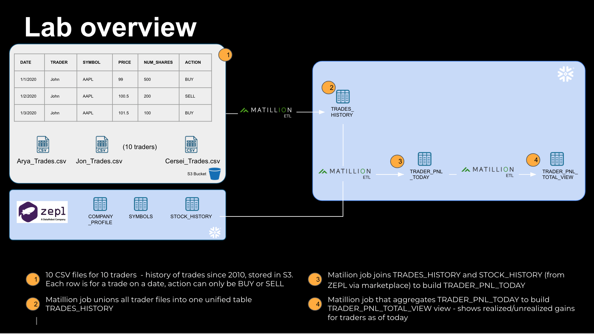


Sneak Peek of the orchestration job that will accomplish all this, nested with 2 transformation jobs within it:

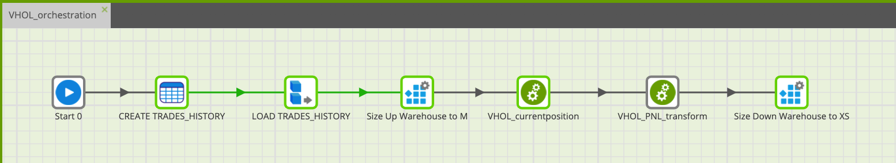

<!-- ------------------------ -->
## Let's Get Started With Snowflake
Duration: 10

Login to your snowflake account. For a detailed UI walkthrough, please refer [here](https://docs.snowflake.com/en/user-guide/ui-snowsight-gs.html#getting-started-with-snowsight).

As the `ACCOUNTADMIN` role, navigate to Marketplace, and search for “zepl”. Click on the tile.

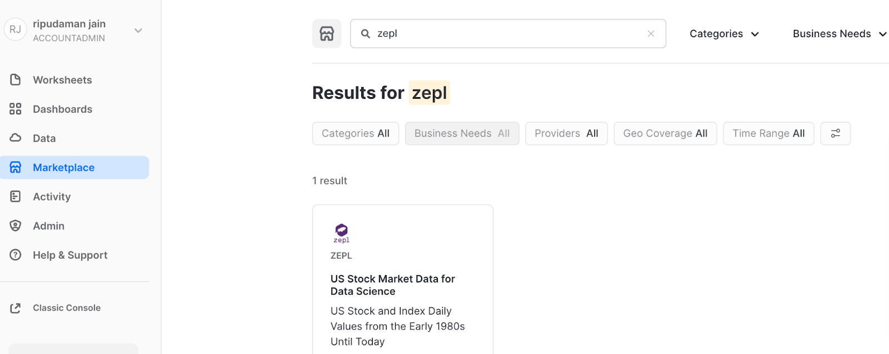

Next:
1. Click on “Get Data” on the right.
2. A pop-up screen opens: prefix the database name with “ZEPL_” so the name becomes `ZEPL_US_STOCKS_DAILY`
3. Click on “Get Data” in the center.

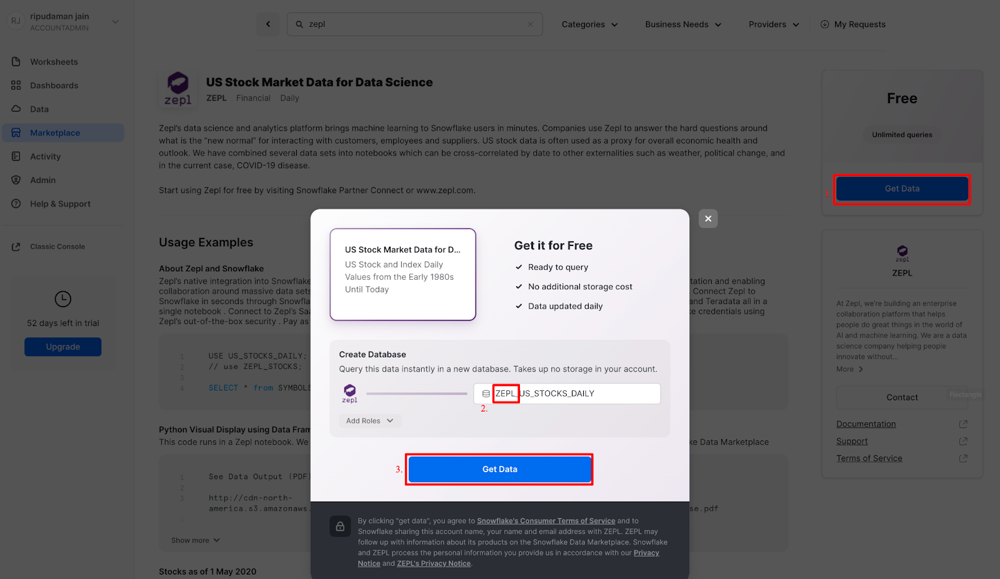

So what is happening here? Zepl has granted access to this data from their Snowflake account to yours. You're creating a new database in your account for this data to live - but the best part is that no data is going to move between accounts! When you query, you'll really be querying the data that lives in the Zepl account. If they change the data, you'll automatically see those changes. No need to define schemas, move data, or create a data pipeline either!

Click on Query Data to access the newly created database.

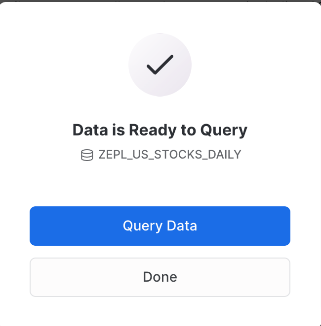

A new worksheet tab opens up, pre-populated with sample queries. The newly created database has 3 tables. Feel free to click on them and browse what their schema looks like, and preview the data they have.

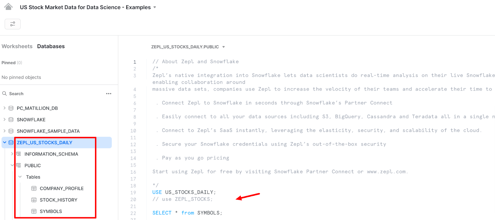

Congrats ! You now have decades worth of stock data acquired in minutes !

One more thing: we need to locate and note down our snowflake account information for subsequent steps.
To locate snowflake account information, navigate to **Admin → Accounts**, and click on the link icon next to the Account name to copy the account name URL to your clipboard (The **text that prefixes .snowflakecomputing.com** is the account information needed to connect Matillion to Snowflake).
Paste it in your worksheet, we will need it in section 5.

In the screenshot below, the account text we are look for is: `bjjihzu-ji91805`

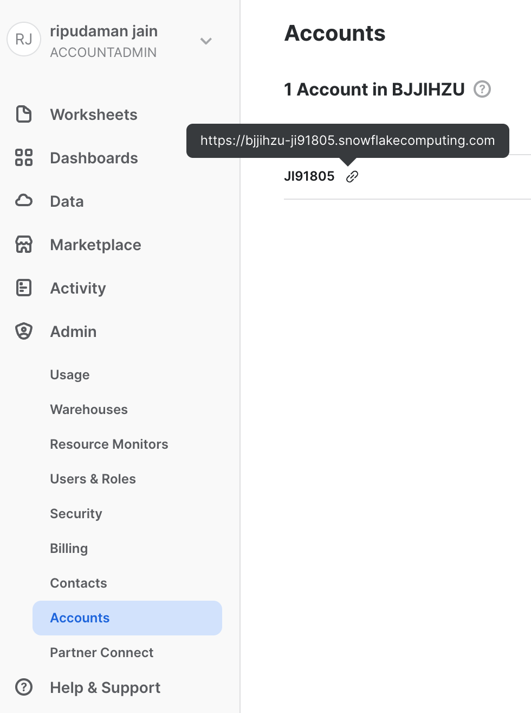


<!-- ------------------------ -->
## Launching Matillion ETL from Partner Connect
Duration: 5

1. Navigate to Admin --> Partner Connect, then click on the **"Matillion ETL"** tile

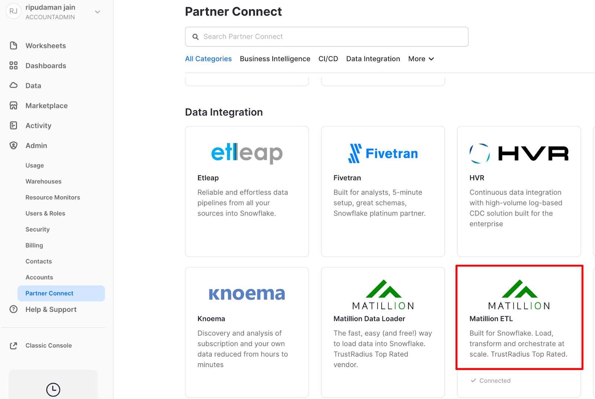

2. All fields are pre-populated, **give additional ‘Optional Grant’ to `ZEPL_US_STOCKS_DAILY` database** (created in previous section), then **click Connect**

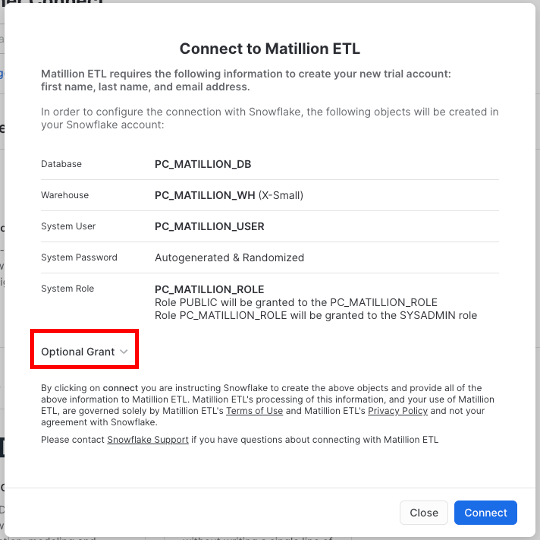

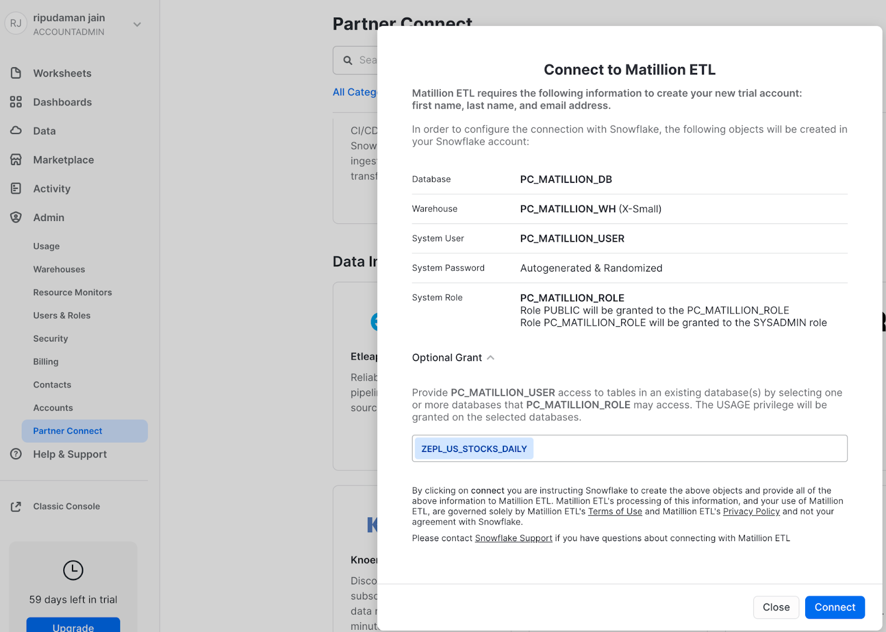

3. Once the partner account has been created, **Click Activate**

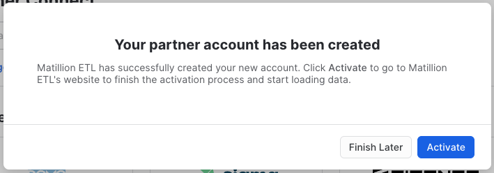

<!-- ------------------------ -->
## Matillion ETL- Creating a New Project
Duration: 10

You will be redirected to the Matillion ETL web console. Your username and password will be auto-generated and sent to the same email you provided to launch your Snowflake trial account.

1. Once logged in to Matillion, you will be prompted to join a project. Click **Create Project** to get started.

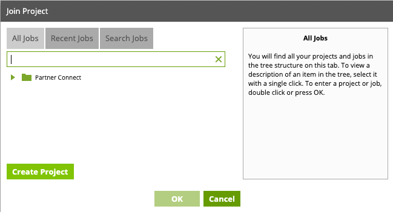

2. Within the **Project Group** dropdown select **“Partner Connect”**, add a new name for the project (for the purpose of this lab we will name it **“TraderPnL”**). You can leave Project Description blank, and the check-box’s with the default settings. Click **Next**

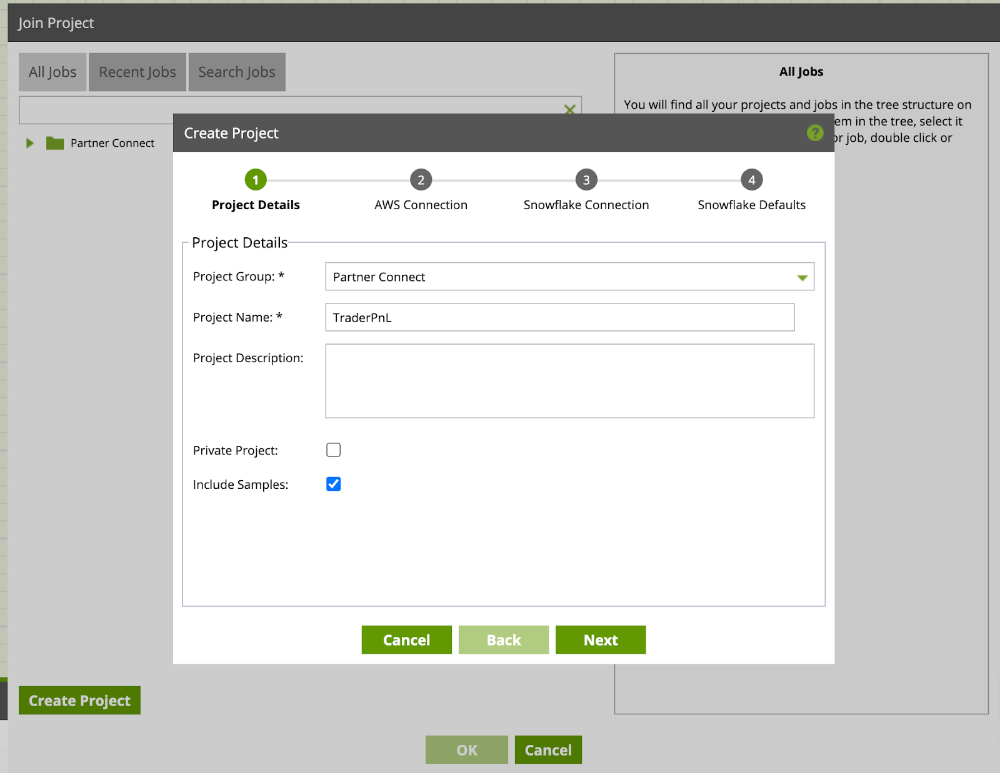

3. In the **AWS Connection** set the **“Environment Name”** (for the purpose of this lab we will name it **“Lab”**). Click Next

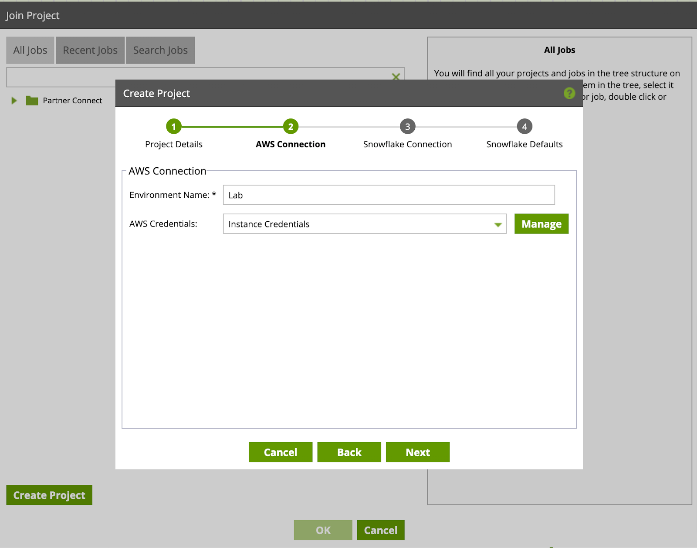

4. Enter your Snowflake Connection details here. The Account field is the same text you saved from Snowflake UI in section 3. Also enter your Snowflake account “Username” and “Password”. Click Next.

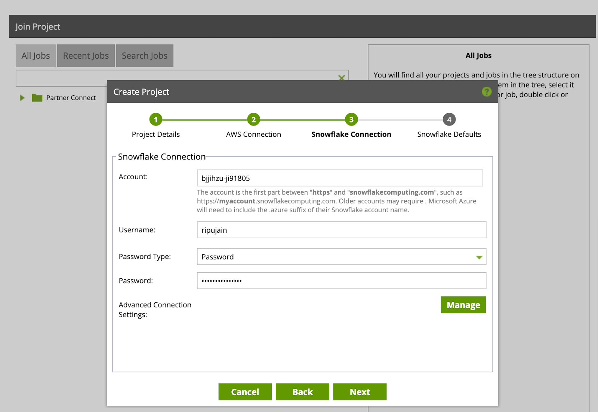

5. Now we will set the Snowflake Defaults. Select the following default values:  
Default Role:       `ACCOUNTADMIN`  
Default Warehouse:  `PC_MATILLION_WH`  
Default Database:   `PC_MATILLION_DB`  
Default Schema:     `PUBLIC`  

Click **Test**, to test and verify the connection. Once you receive **success** response, you are properly connected to Snowflake. Click **Finish**, and now the real fun begins!

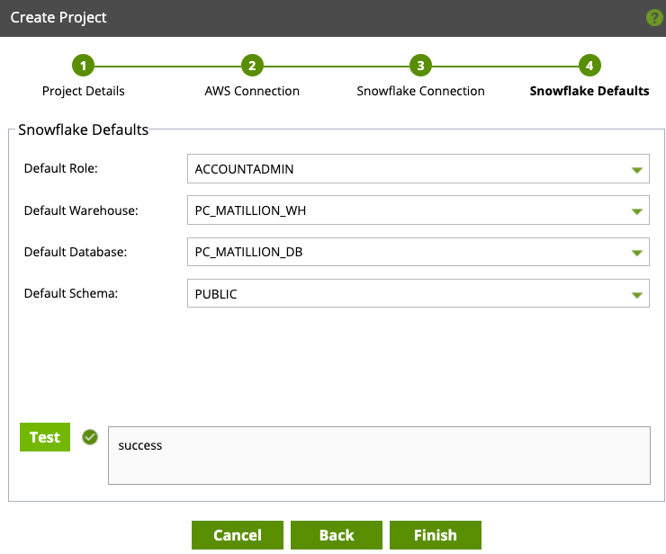

<!-- ------------------------ -->

## Creating an Orchestration Job
Duration: 20

We will now create our first orchestration job. The job will consist of first loading the trading history from AWS S3 to a single Snowflake table. To efficiently work with the data, we will modify the warehouse to the appropriate size using the Alter Warehouse component. We will then create two separate transformation jobs to perform complex calculations and joins and create new tables back in Snowflake. Finally, we will scale down our warehouse when job completes. By the end of it, the orchestration job should look like this:


Lets get started!!  

Within the Project Explorer on the left hand side, right-click and select **Add Orchestration Job**.

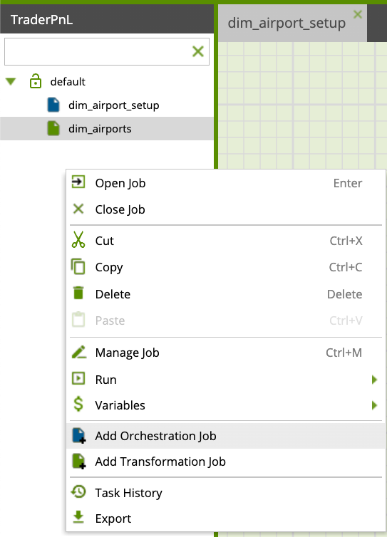

Name your job **“VHOL_orchestration”** and click “OK”. You will be prompted to switch to the new job, click **“Yes”**. You should now see a blank workspace (new tab)

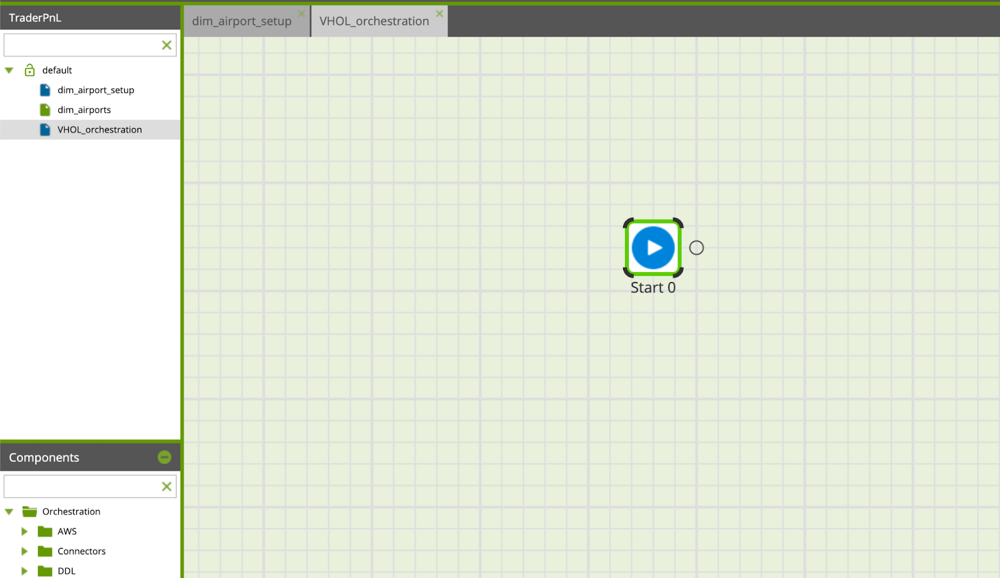

The following steps will walk through adding different components to the workspace to build our data pipeline. The first step is to load trading data from S3 using the **S3 Load Generator** component.  

### [S3 Load Generator](https://documentation.matillion.com/docs/6411982)

1. From the Components section on the left hand side, expand the Wizards folder. Find the S3 Load Generator component.

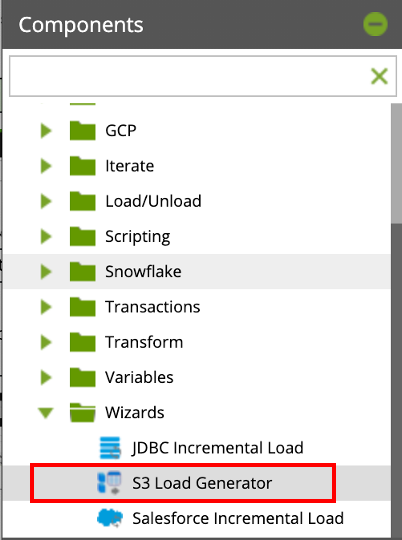

2. Drag and drop the S3 Load Generator component onto the workspace as the first step after the Start component.  

3. A S3 Load Generator menu will automatically pop up. Click the ... button to explore S3 bucket

4. Copy and paste the S3 bucket into the wizard: `s3://mtln-techworkshops/VHOL_Trades/`

Click **Go** to explore the contents of the bucket, you should see several CSV files - these are trade history data of 10 traders, trading in 10 different industries. Highlight the file name `ARYA_SWINFRA.csv` and click **Ok**.

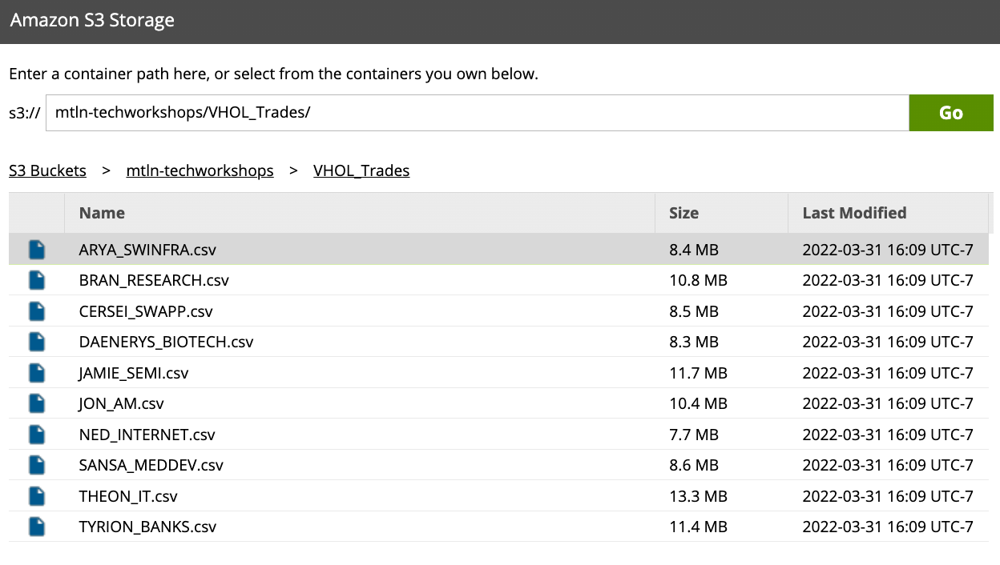

5. You can now sample the dataset by clicking **Get Sample**, it will return a 50 row sample of the dataset. Click **Next**.

6. Matillion will guess the schema on the dataset, you can make any modifications to the configuration. For the purpose of this lab, we will keep the configuration settings as **Default**. Click **Next**

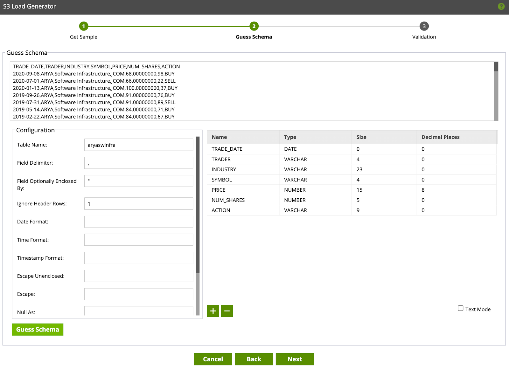

7. Click **Create & Run**, this will render two components on the VHOL_orchestration canvas (Create Table and S3 Load).

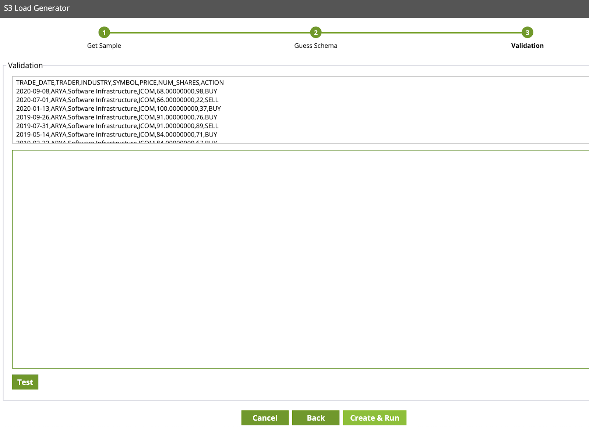

_Note if you click test you may receive a permission error on the S3 bucket. You can ignore this for the lab, and move on to the next step. Don’t worry about any errors at this point, we will resolve them in the upcoming steps._

8. Link the **Start** component to the **Create Table** component.

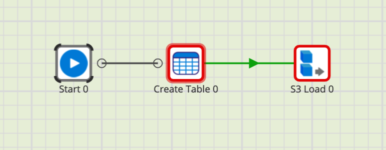

9. Click on the **Create Table** component, in the Properties Tab you will see several parameters. Note the **Create/Replace** parameter by default is set to Create. Click the ... button and change it to `Replace` from the dropdown menu.

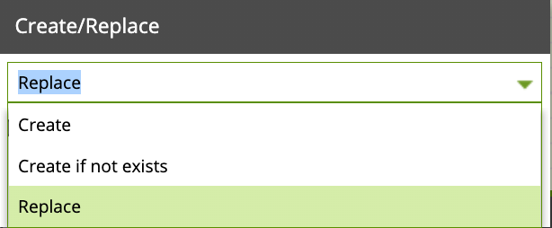

10. Now we will modify the size of each column. In the properties tab, click on the ... button for the **Columns** parameter. Update the Size for each Column name as shown in figure below, then click Ok.

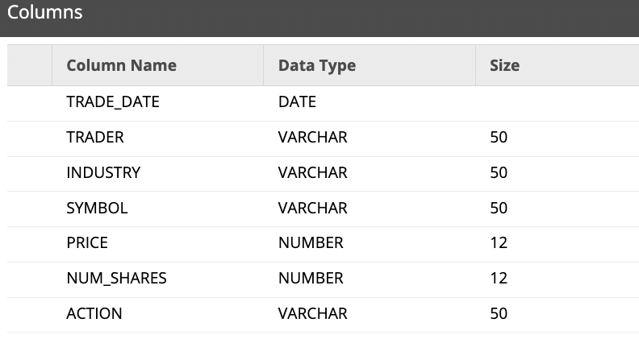

11. Change the component name and table name to `TRADES_HISTORY`, by clicking on the ... button in the Properties tab

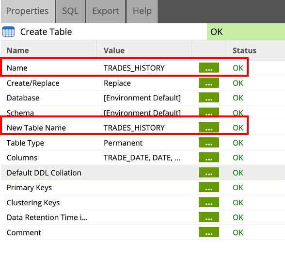

12. Right click on the TRADES_HISTORY component and select **Run Component**. This will create a new table in your Snowflake account !

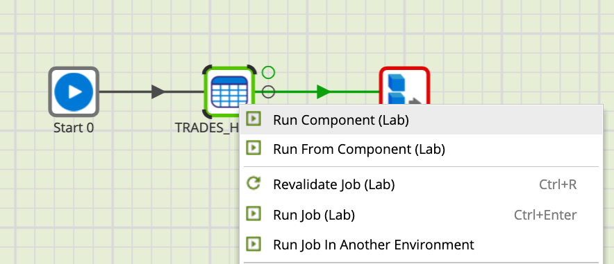

13. Next, Select the S3 Load component, and change the Name in the Properties tab to **LOAD TRADES_HISTORY**.  

14. Change the **S3 Object Prefix** by clicking on the ... button to select the VHOL_Trades directory, and then click OK.

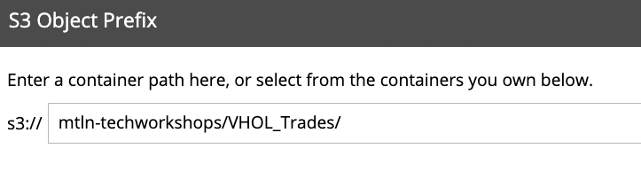

15. Change the **Pattern** parameter bu clicking on the ... button, and change to `.*`. Click OK.

16. Change the **Target Table** parameter by clicking on ... button, and select TRADES_HISTORY from the drop down, click OK.

17. The LOAD TRADE_HISTORY component Properties should now reflect as shown below, all other fields should be left as default.

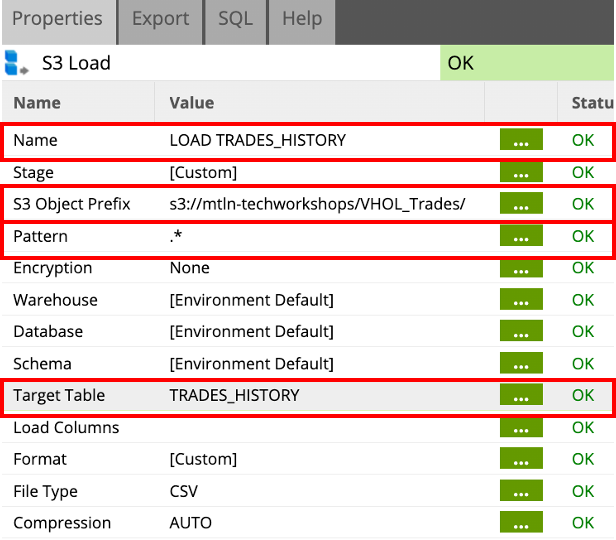

18. Right click on the LOAD TRADE_HISTORY component and run it by clicking **Run Component**.

19. Check back in your Snowflake console to confirm the TRADES_HISTORY table was created, and data loaded - 1.7 million rows, and compressed to < 10 MB !

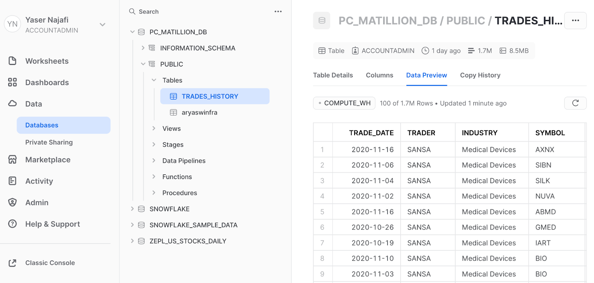

### [Alter Warehouse](https://documentation.matillion.com/docs/2800970)

The next step of the orchestration is to scale up Snowflake’s Virtual Warehouse to accommodate resource heavy transformation jobs.

1. Find the Alter Warehouse component from the Components pane.  
2. Drag and drop the component as the last step, connected to the LOAD TRADES_HISTORY component. Click on the component to edit its Properties.  
3. Rename of the component to `Size Up Warehouse to M`.  
4. Change the **Command Type** to Set.   
5. A new field will appear, edit Properties to add a new line with Property set to **WAREHOUSE_SIZE** and Value set to `MEDIUM`.  

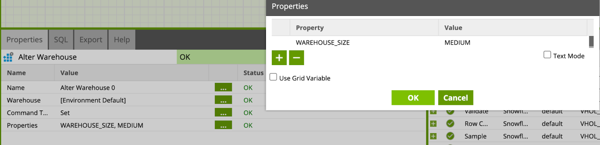

6. Your orchestration job should now look like this:

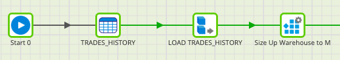

<!-- ------------------------ -->

## Creating a Transformation Job to determine the Current Position
Duration: 30

The trading history data from S3 gives a listing of ten traders with both BUY and SELL actions.  In this transformation job, the transactions will be aggregated to find out the number of shares bought/sold and for how much. With those figures, the net # of shares and value will be calculated, and a table will be created, enriched with each traders’ average price for each stock. The below figure shows the end product of the transformation pipeline we will create in this section:

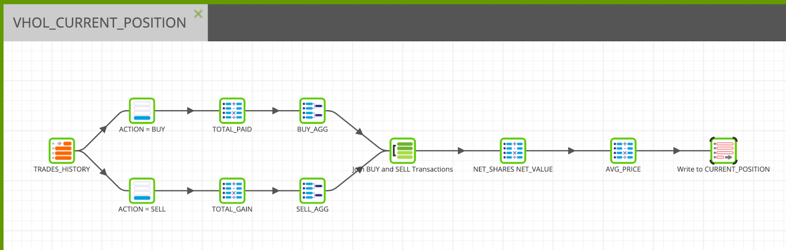

### Let's get started!

1. Within the Project Explorer, right-click and select **Add Transformation Job**.

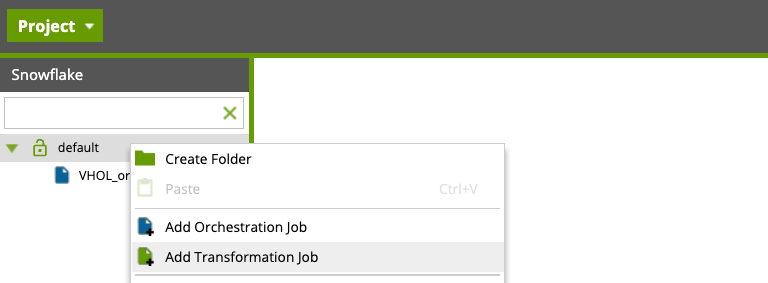

2. Set the title to `VHOL_CURRENT_POSITION`, and click Ok.

3. Next prompt will ask you to switch to the new job, click NO.

4. From the explorer, drop the newly created job as the next step after the Alter Warehouse component within the previously created orchestration job (VHOL_orchestration) and complete the connection, as shown below:

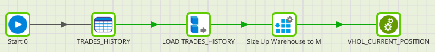

5. Double click the  new transformation job VHOL_CURRENT_POSITION. A new tab gets opened with a blank canvas. We will now build a transformation pipeline.

### [Table Input](https://documentation.matillion.com/docs/1991918) - Read TRADES_HISTORY

Find/search the **Table Input** component in the component palette under Data > Read folder and drop it on the blank canvas, then set it up with the appropriate properties below:  

Name: `TRADES_HISTORY`  
Database: [Environment Default]  
Schema: [Environment Default]  
Target Table: `TRADES_HISTORY`  
Column Names: Select all columns by clicking the ... button  

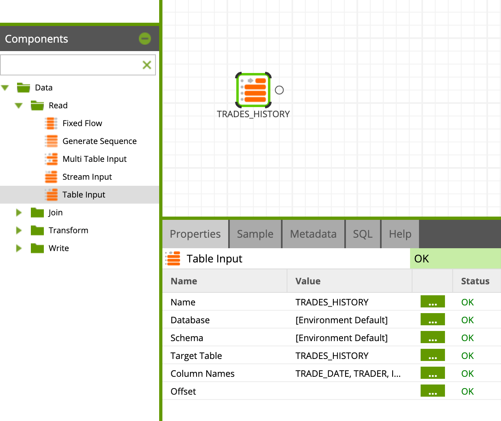

### [Filter](https://documentation.matillion.com/docs/1991641) - Filter Buy actions

Now, let’s add a second step to filter the data based on the type action.
1. Find/Search the Filter component in the component list under Data > Transform folder and drop it on the canvas, connect it to the TRADES_HISTORY component.
2. Click on the component and update the **Name** property to `ACTION = BUY`
3. Then use the Filter Conditions property wizard, add a line with the following settings:

Input Column: `ACTION`
Qualifier: `Is`
Comparator: `Equal to`
Value: `BUY`

Your Transformation Job should now look like this:

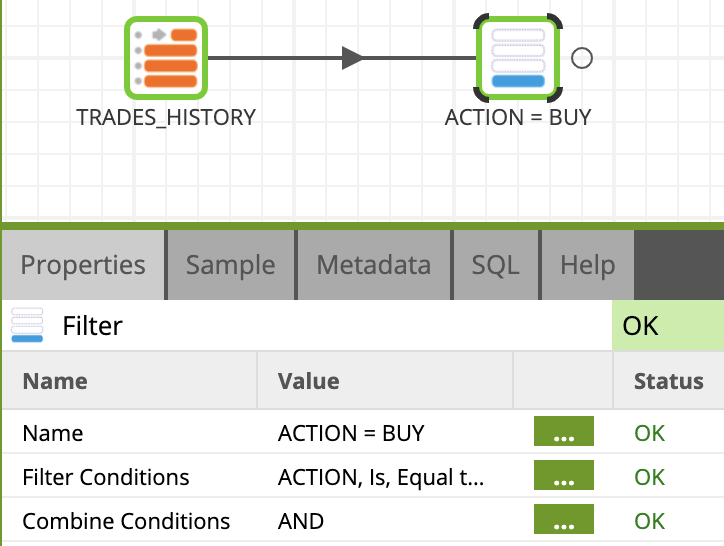

### [Calculator](https://documentation.matillion.com/docs/1991925)

Now we will add a calculator to calculate the amount of investment in each buy transaction:
1. Find/Search the CALCULATOR component under **Data > Transform** folder and link it to the ACTION = BUY component created in the previous step.
2. Click on the component and name it `TOTAL_PAID`
3. Edit the Calculations property and use the expression builder to create the calculation:
- Add a new field with “+” button, name it TOTAL_PAID
- Build the expression:  `-("NUM_SHARES" * "PRICE")`

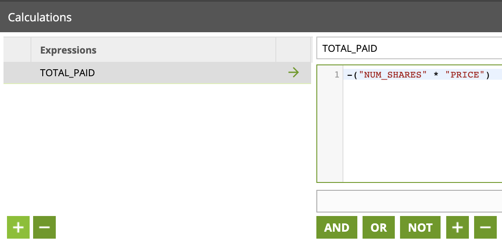

Clicl OK. Your transformation job should now look like this:

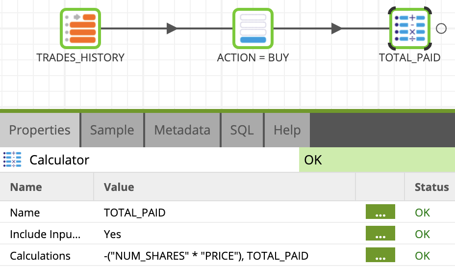

### [Aggregate](https://documentation.matillion.com/docs/1991880)

Next we will sum up the investments made in each stock by aggregating.
1. Let's add an Aggregate component from the palette under **Data > Transform** folder and link it to the previous Calculator component.
2. Click on the component to edit the Properties:  
Name: `BUY_AGG`  
Groupings: `TRADER, SYMBOL`  
3. Open the Aggregations field wizard and add 2 lines then configure them like this:  
**Source Column: Aggregation Type**  
TOTAL_PAID: `Sum`  
NUM_SHARES: `Sum`

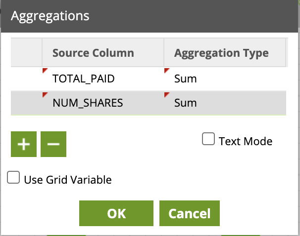

Clicl OK. Your transformation job should now look like this:

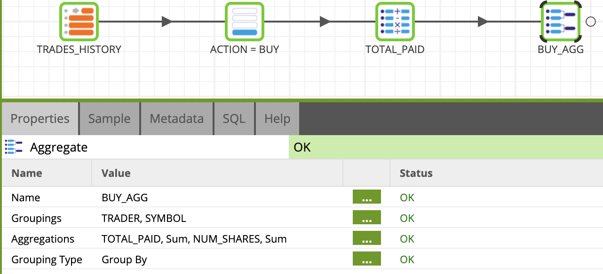

### We will now copy & paste the Filter, Calculator, and Aggregate components to create a similar pipeline, but for SELL filter.

1. Right-click on each of the components and select copy.
2. Paste the component by right clicking on a blank area in the canvas, and selecting paste. Connect the new components as shown below. Your Transformation Job show now looks like this:

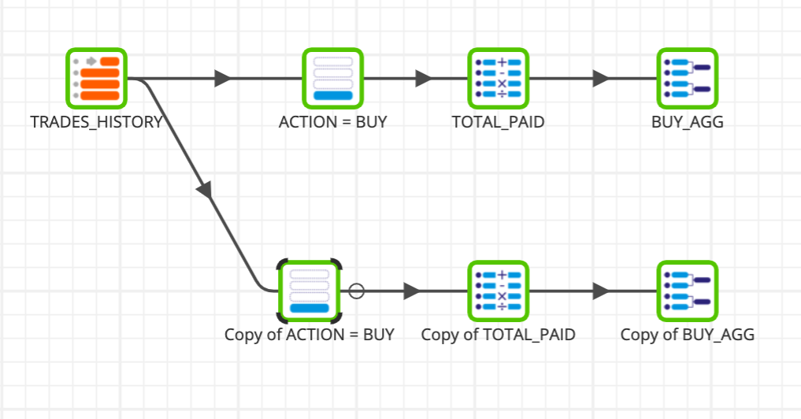

3. Update the properties of the new components with the information below:  
  3.1 Filter:  
  - Name: `ACTION = SELL`
  - Filter Conditions:  
    - Input Column: `ACTION`
    - Qualifier: `Is`
    - Comparator: `Equal to`
    - Value: `BUY`

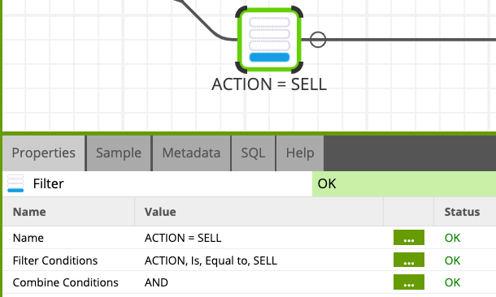

  3.2 Calculator:
  - Name: `TOTAL_GAIN`
  - Add a new field with “+” button, name it TOTAL_GAIN
  - Build the expression:  `("NUM_SHARES" * "PRICE")`

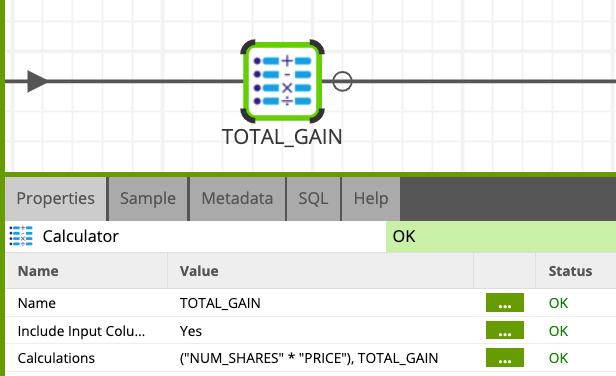

  3.3 Aggregate:  
  - Name: `SELL_AGG`  
  - Groupings: `TRADER, SYMBOL`  
  - Aggregations: `TOTAL_GAIN, Sum, NUM_SHARES, Sum`  

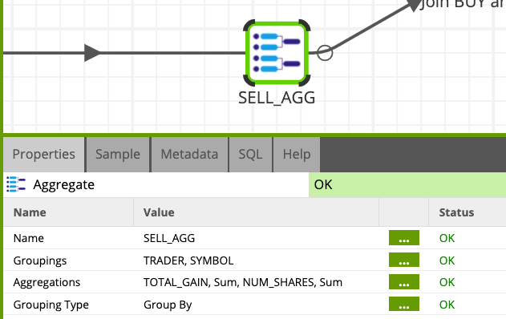

We are now going to join the 2 flows together.

### [Join](https://documentation.matillion.com/docs/1991923) - Join the BUY and SELL aggregations into a single dataset

1. Find/Search the Join component under Data > Join folder and drag and drop it as the last step of the job. Connect the Join component to both the BUY_AGG and SELL_AGG.
2. Click on the Join component to edit the Properties:  
- Name: `Join BUY and SELL Transactions`  
- Main Table: `BUY_AGG`  
- Main Table Alias: `buy`  
- Joins: `SELL_AGG, sell, Inner`  
- Join Expressions --> buy_Inner_sell: `"buy"."TRADER" = "sell"."TRADER" and "buy"."SYMBOL" = "sell"."SYMBOL"`  
- Output Columns:
  - buy.TRADER: `TRADER`  
  - buy.SYMBOL: `SYMBOL`  
  - buy.sum_TOTAL_PAID: `sum_INVESTMENT`  
  - buy.sum_NUM_SHARES: `sum_SHARESBOUGHT`  
  - sell.sum_TOTAL_GAIN: `sum_RETURN`  
  - sell.sum_NUM_SHARES: `sum_SHARESSOLD`  

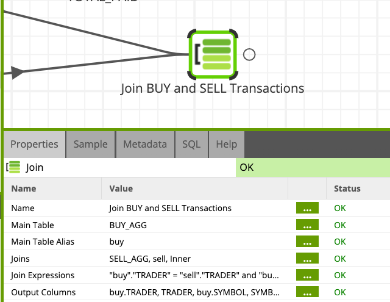

Your Transformation Job should now look like this.


### Calculate the amount of investment in each buy transaction

Add a new Calculator component to the canvas and set up with the below values (_use the same steps than in previous Calculator components to set up the expressions_).

- Name: `NET_SHARES NET_VALUE`  
- Include Input Columns: Yes
- Expressions:  
  - NET_SHARES: `"sum_SHARESBOUGHT" - "sum_SHARESSOLD"`  
  - NET_VALUE: `"sum_INVESTMENT" + "sum_RETURN"`  

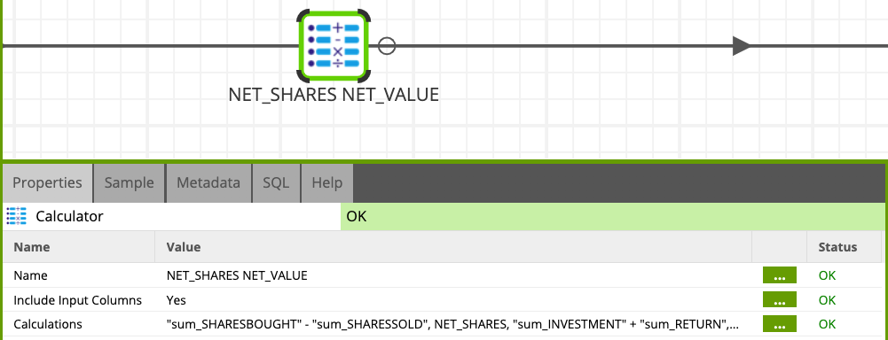

### Calculate the average price of stocks traded

Add another Calculator component to the job and configure it as follows.
- Name: `AVG_PRICE`  
- Include Input Columns: Yes
- Expressions:  
  - AVG_PRICE: `-("NET_VALUE" / "NET_SHARES")`  

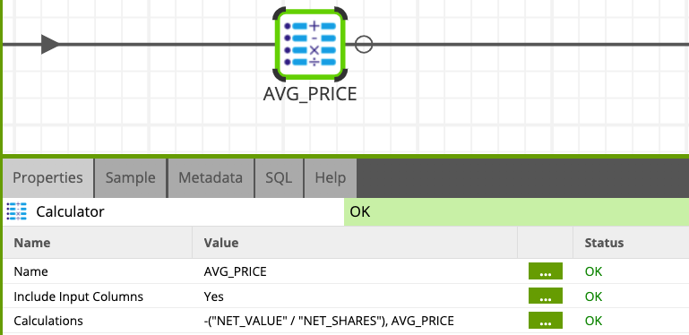

### [Rewrite Table](https://documentation.matillion.com/docs/1991941)

Add a last component to the job to write the result of the transformation to the CURRENT_POSITION table.

Find/Search the Rewrite Table component and drag and drop it as the last component in the flow. Connect to the AVG_PRICE calculator, and edit the properties as below:

- Target Table: `CURRENT_POSITION`  
- Warehouse: [Environment Default]  
- Database: [Environment Default]  
- Schema: [Environment Default]  
- Target Table: `CURRENT_POSITION`  

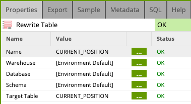

The job flow should look like this now:

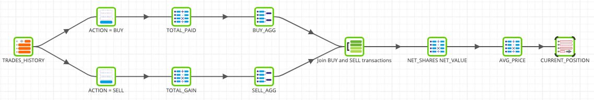

### Execute this job

Right click anywhere on the job and select **Run Job**.
To preview the result of the job:
- Click on the last component (Write to CURRENT_POSITION)
- Open the Sample tab
- Hit the **Data** button
- Data will be sampled and previewed in the pane below

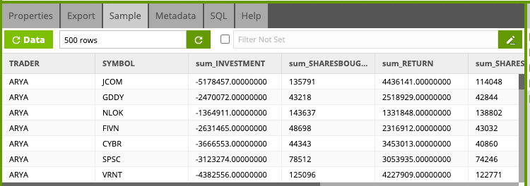

You can now go back and validate the CURRENT_POSITION table is generated in Snowflake:


Congratulations, you’re done with building and running the first transformation job!

<!-- ------------------------ -->

## Creating a Transformation Job: Profit & Loss Calculation
Duration: 41

The previous Transformation job provided a snapshot of every trader, based on the BUY and SELL transactions which took place. This job will take it a step further by calculating the profit or loss each trader is experiencing by stock, as well as the cumulative profit or loss, based on their entire portfolio. The below figure shows the end product of the transformation pipeline we will create in this section.

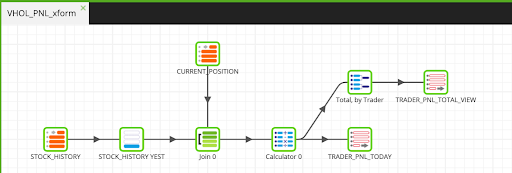

Let’s get started!

1. Within the Projects Explorer, right click and select **Add Transformation Job**, title it **VHOL_PNL_xform** and drop it as the last step step after the **VHOL_CURRENT_POSITION** transformation component in the VHOL_orchestration job.

2. Double click on the newly created **VHOL_PNL_xform** component to wwitch back to the new workspace to start building the job.

### [Table Input](https://documentation.matillion.com/docs/1991918) - Read **STOCK_HISTORY**

1. Find the Table Input component and drop it into the canvas. Click on the component to configure as per the table below.

Note that we are switching database to point to **ZEPL_US_STOCKS_DAILY** to get the **STOCK_HISTORY** table.

Name:           `STOCK_HISTORY`  
Database:       `ZEPL_US_STOCKS_DAILY`  
Target Table:   `STOCK_HISTORY`  
Column Names:   `Select all columns`  


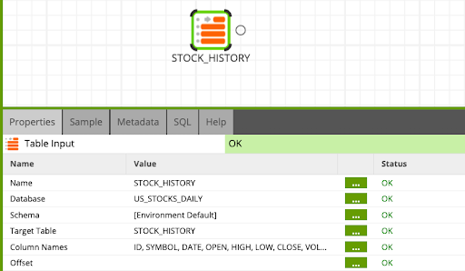  


### [Filter](https://documentation.matillion.com/docs/1991641) - Only include the most recent close date for the stock

We will filter to only include the most recent clost date for the stock.

1. Right-click on the canvas and select Manage Job Variables.


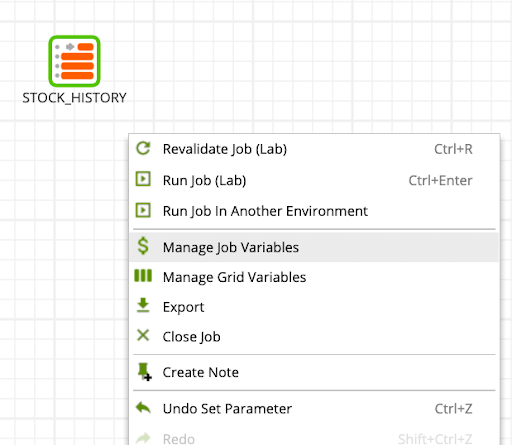  

2. Fill out the Manage Job Variables as follows, using the   to add a new variable as follows:

Name:       `yest_date`  
Type:       `DateTime`   
Behavior:   `Shared`   
Visibility: `Public`    
Value:      `1900-01-01`   

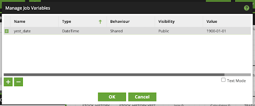

3. Click **Ok**

4. Drag and drop a filter component as the next step after the STOCK_HISTORY table input. Fill out the filter properties as follows:

Name: `FILTER ON YEST_DATE`  

5. Update the Filter Conditions and Combine Conditions as follows:

**FILTER CONDITIONS:**

Input Column:   `DATE`  
Qualifier:      `Is`  
Comparartor:    `Equal to`  
Value:          `${yest_date.now().add("days", -1).format("yyyy-MM-dd")} `  

**Note** If you are doing this lab offline (not on the webinar day), subtracting -1 days may or may not work. You basically have to subtract enough days so that the resultant date is a date when the stock market was open. So if you’re doing this lab on Monday, subtract -3 days so that the date becomes Friday (assuming the stock market was open on Friday)  

Combine Conditions: `AND`  

**Note** that we entered sets the variable yest_date to yesterday’s date, in a yyyy-mm-dd format.  


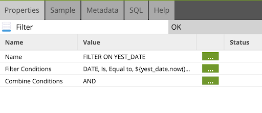  

6. **Sample** the data by switching to the Sample tab and clicking  to validate the filter is working correctly, with the DATE field reflecting yesterday’s date.  

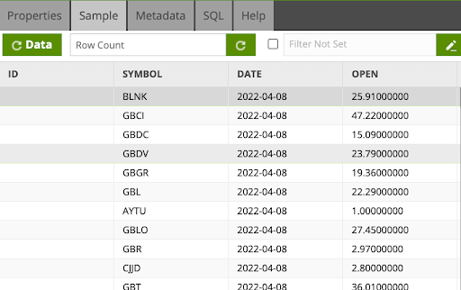  

7. Locate the Table Input component and drag and drop it to the above-right of the FILTER ON YEST_DATE Filter component. Click on the component and edit the Properties as follows:  

### [Table Input](https://documentation.matillion.com/docs/1991918) - Read CURRENT_POSITION  

Name:   `CURRENT_POSITION`  
Target Table:   `CURRENT_POSITION`  
Column Names:   `Select all columns`  

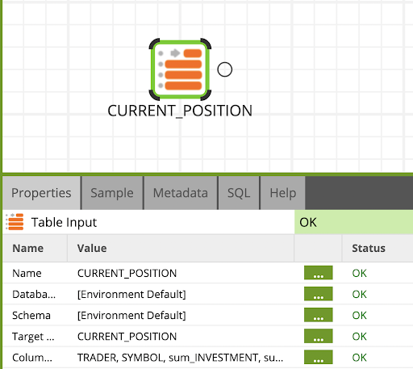

1. Locate the Join component, drag and drop into the workspace and connect the previous Filter and Table Input components. The flow should look like this:  

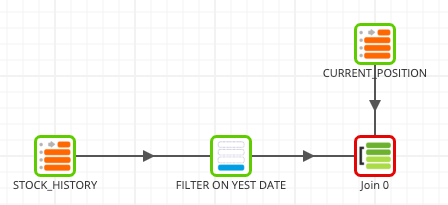  

### [Join](https://documentation.matillion.com/docs/1991923) - Join yestserday's stock close with the CURRENT_POSITION dataset  

1. Click on the Join component to edit its properties as follows:  

Name:   `Join CURRENT_POSITION and STOCK_HISTORY`  
Main Table:   `CURRENT_POSITION`  
Main Table Alias:   `current_position`  
Joins:    `FILTER ON YEST_DATE` , `stock_history` , `Left`  

2. Edit the Join Expressions property to add the following:

**Join Expressions:**  
current_position_Left_stock_history:    `"current_position"."SYMBOL" = "stock_history"."SYMBOL"`  

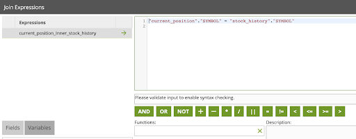  

3. Update the Output Columns property to add the following:  

**Output Columns:**  
current_position.TRADER:            `TRADER`  
current_position.SYMBOL:            `SYMBOL`  
current_position.sum_INVESTMENT:    `sum_INVESTMENT`  
current_position.sum_SHARESBOUGHT:  `sum_SHARESBOUGHT`  
current_position.sum_RETURN:        `sum_RETURN`  
current_position.sum_SHARESSOLD:    `NET_SHARES`  
current_position.NET_SHARES:        `NET_SHARES`  
current_position.NET_VALUE:         `NET_VALUE`  
current_position.AVG_PRICE:         `AVG_PRICE`  
stock_history.CLOSE:                `CLOSE`  

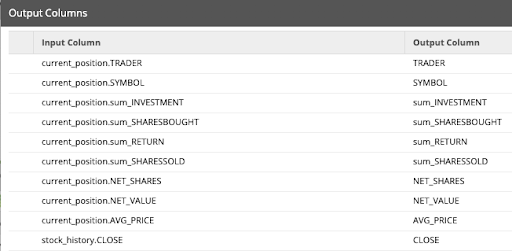  

4. Click **OK**  

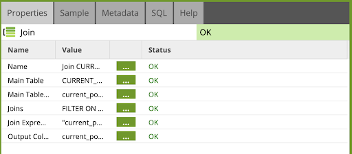  

The job flow now looks like this:  

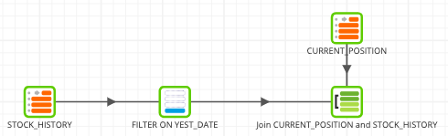  

Let's now calculate the realized and unrealized gains/losses for each trader.  

### [Calculator](https://documentation.matillion.com/docs/1991925) - Calculate Realized & Unrealized Gains

1. Locate the calculator component. Drag and drop it to the end of the flow and connect it to the Join component.


  

2. Click on the Calculator component and edit the Properties as follows:  


Name:                     `GAINS`  
Include Input Columns:    `Yes`  

3. Edit the Calculations property, and add the following expressions.  

**Expressions:**  
UNREAL_GAINS:         `("NET_SHARES" * "CLOSE") - ("NET_SHARES" * "AVG_PRICE")`  
REAL_GAINS:           `CASE WHEN "NET_SHARES" = 0 THEN "NET_VALUE" ELSE "sum_INVESTMENT" - ("sum_SHARESSOLD" * "AVG_PRICE") END`  

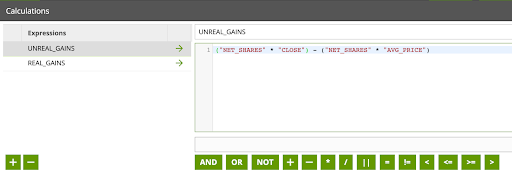  

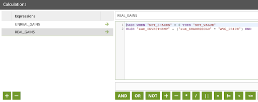  

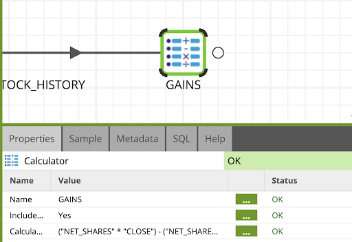  

The flow should now look like this:  

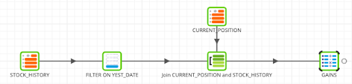  

4. Now, let’s write the results to a new table called TRADER_PNL_TODAY using the Rewrite Table component.  

### [Rewrite Table](https://documentation.matillion.com/docs/1991941)  

1. Locate the Rewrite Tablecomponent and drag and drop into the workspace. Link it to the GAINS calculator, and click to edit the Properties as follows:  

Name:           `TRADER_PNL_TODAY`  
Target Table:   `TRADER_PNL_TODAY`  

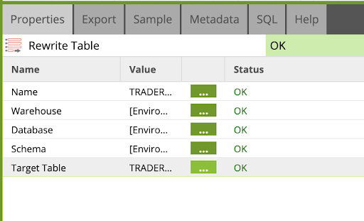  

The flow should now look like this:    

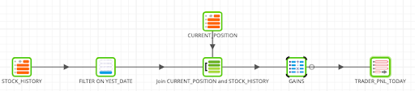  

2. Now, locate a Aggregate component to it connect to the Calculator GAINS component, creating a parallel flow.  

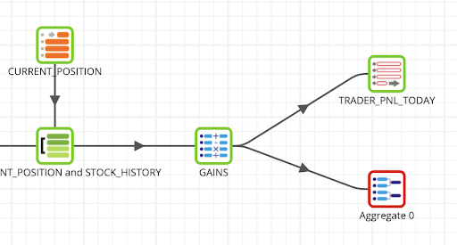  

### [Aggregate](https://documentation.matillion.com/docs/1991880) - Sum up the gains, both realized and unrealized by each trader  

1. Click on the Aggregate component and edit the Properties as follows:  

Name:               `SUM GAINS PER TRADER`  
Groupings:          `TRADER`  
Aggregations:       `UNREAL_GAINS, Sum` , `REAL_GAINS, Sum`  

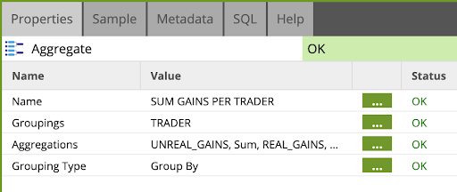  

The flow should now look like this:  

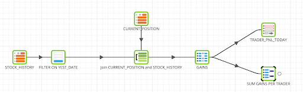  

Finally, we are going to create a view to store this last aggregation result.  


### [Create View](https://documentation.matillion.com/docs/2387025) - Write the trader and gains fields to a new view in Snowflake  

1. Locate the Rewrite Table component and drag and drop it to connect to the SUM GAINS PER TRADER Aggregate component.  
2. Click on the component and edit the Properties as follows:  

Name:                 `TRADER_PNL_TOTAL_VIEW`  
Target Table:         `TRADER_PNL_TOTAL_VIEW`  

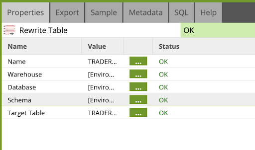  

The final flow of the job, should look like this:  

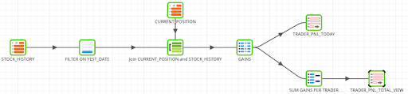  

You can check the datasets either with the Matillion sample function or go to Snowflake UI. There should be two tables created TRADER_PNL_TODAY and TRADER_PNL_TOTAL_VIEW.  


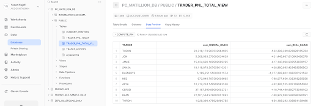  

### Completing the Orchestration Job:  

Return back to the VHOL_orchestration job, and drag and drop an **Alter Warehouse** component as the final step, linked to the VHOL_PNL_xform Transformation component.  

*Pro tip: you can also COPY and PASTE the other Alter Warehouse component to just edit it.*  

Edit the component to reflect as follows:  

| Name:      | `Size Down Warehouse to XS` |
| ----------- | ----------- |
| CommandType:      | `Set`       |
| Properties:   | `WAREHOUSE_SIZE XSMALL`        |


This will scale down your Virtual Warehouse after the orchestration job is completed.  

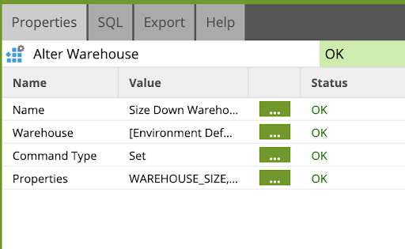  

Your final pipeline result should now look like this:  

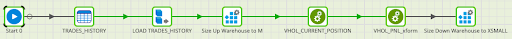  

Right click anywhere on the workspace click **Run Job** to run the job and enjoy seeing the data being loaded, transformed, while scaling up and down Snowflake warehouse dynamically!

<!-- ------------------------ -->

## BONUS - Daily Updates from Yahoo! Finance
Duration: 20

The portfolio manager wants up-to-date stock information to know exactly where their realized and unrealized gains stand. Utilizing Matillion’s Universal Connectivity feature they can pull real-time market prices and make the calculation.

1. Begin by right-clicking in the Project Explorer and select Add Orchestration job to create a new Orchestration job. Name it Yahoo_Orch.

2. Righ click on the canvas, and click Manage Grid Variables. 

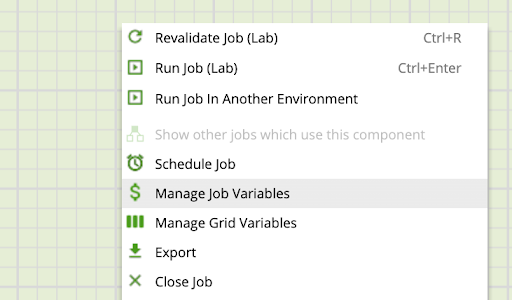

3. Create a [Grid Variable](https://documentation.matillion.com/docs/2917841) called `gv_tickers`, with a single column (`gvc_tickers`) populated with: AAPL and SBUX.

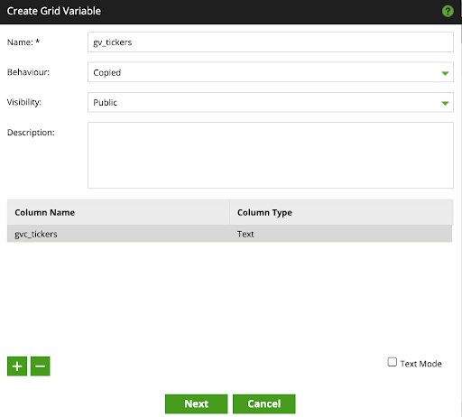

4. Click **Next** to add the columns AAPL and SBUX.

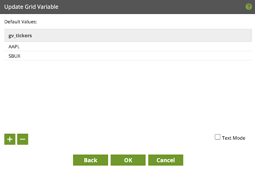

5. Click on **Project** dropdown and select **Manage Environment Variables**

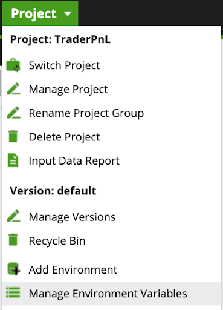

6. Create a [Environment Variable](https://documentation.matillion.com/docs/2943424) called `ev_tickerlist` using the following properties:

| Name:  |  `ev_tickerlist` |
|---|---|
| Type:  | `text`  |
| Behavior:  | `Copied`  |
|  Value: |  `AAPL%2CGOOG` |

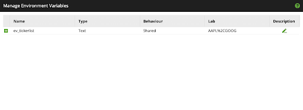

6. Drag and drop the **Query Result to Grid** component as the first  step in the flow. Fill out the component as follows:

|  Name:  | `Tickers to Grid`  |
|---|---|
| Basic/Advanced  | `Advanced` |
| SQL Query | `SELECT DISTINCT("SYMBOL") FROM "TRADES_HISTORY" WHERE "TRADER" = 'CERSEI' LIMIT 10` |
| Grid Variable  |  `gv_tickers` |
|  Grid Variable Mapping | `gvc_tickers: SYMBOL`  |

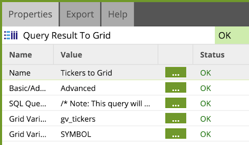

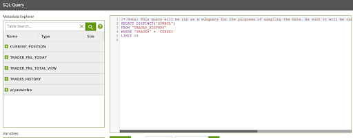

### [Python Script](https://documentation.matillion.com/docs/2234735)

We will incorporate a Python script to “unpack” the Grid Variable set in the next step. With the stock symbols saved to a variable called loc_TICKERS, a loop will be performed to reformat a query parameter needed for a call to the [Yahoo! Finance quote endpoint](https://www.yahoofinanceapi.com/). 

1. Locate the **Python Script** component and drop as the last step in the flow:

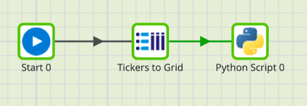

2. Update the Python Script component with the following:

**Script**:

```
print (context.getGridVariable('gv_tickers'))
loc_TICKERS = context.getGridVariable('gv_tickers')

api_param = ''

for layer1 in loc_TICKERS:
  for each in layer1:
    api_param = api_param + each + '%2C'
    #print(each) validate unpackaging of array
    
api_param = api_param[:-3]
print(api_param)

context.updateVariable('ev_tickerlist', api_param)

print(ev_tickerlist)

```
**Interpeter:** `Python 3`

### [API-Extract](https://documentation.matillion.com/docs/1959484) - Pull Current Stock Price Data

1. From the Projects drop down in the top left, select **Manage API Profiles** > **Manage Extract Profiles**.

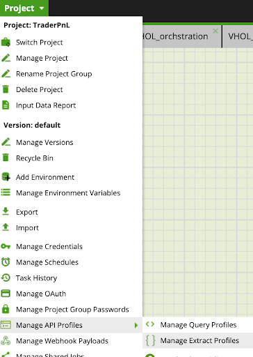

2. Add a new **Extract Profile** using the information below:

**Profile Name:** `YahooFinance`

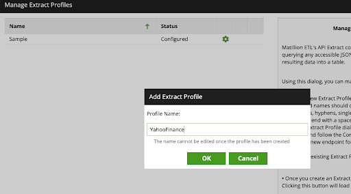

3. Click **Ok** and select **New Endpoint**, and update with the following information:

**Endpoint Name:** `QuotesByTicker`

4. Click **Next**. 

5. Set the Endpoint Configuration GET to the following URI: `https://yfapi.net/v6/finance/quote`

6. Select the **Params** tab and update with the following:

**Params:**

|   |   |   |
|---|---|---|
|  `lang` |  `en` | `Query`  |
|  `region` |  `US` | `Query`  |
|  `symbols` |  `AAPL,BTC-USD,EURUSD=X` | `Query`  |
|  `X-API-KEY` |  **`SEE NOTE BELOW`** | `Header`  |


**NOTE:** Your X-API-KEY must be obtained from Yahoo Finance API (This can be retrieved by following the instructions [HERE](https://www.yahoofinanceapi.com/tutorial))

7. Click **Next** and **Finish** to complete creating the Endpoint.

8. Locate the **API Extract** component and place is after the **Python Script** component. 

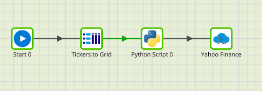

9. Update the component as follows:

|   |   |
|---|---|
| Profile  | `YahooFinance`  |
| Data Source  | `QuotesByTicker`  |
|  Query Params |  `lang - en`  |
|   |  `region - US`  |
|   |  `symbols - ${ev_tickerlist}`  |
|  Header Params |  **`YOUR API KEY`** |
| Location |  `Select the default S3 bucket provided by Partner Connect` |
| Table  | `VHOL_YAHOORAW`  |

10. Now we will create a new Transformation Job - Yahoo Transform - which will sit as the next step after the Yahoo Orchestration job just worked on.

### Transformation - Yahoo Transform

1. Within the Projects Explorer, right click and select **Add Transformation Job**.
Name it Yahoo_transform.

2. Create a new Table Input component and update as follows:

|   |   |   |
|---|---|---|
| Name  | `VHOL_YAHOORAW`  |
|  Target Table |  `VHOL_YAHOORAW` |
|  Column Names |  `Data Value` | 

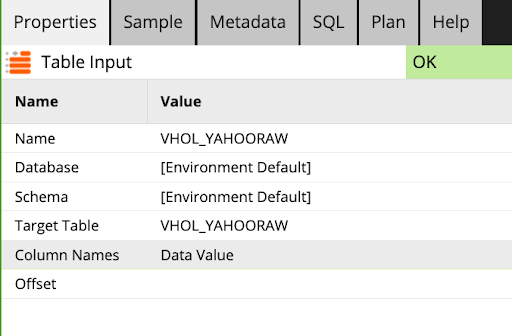

### [Extract Nested Data](https://documentation.matillion.com/docs/2978311) - We will flatten the semi structured format & extract the values needed

1. Find the **Extract Nested Data** Component and drag and drop it after the Table Input.

2. Update the component as follows:

|   |   |   |
|---|---|---|
| Name  |  `Extract Nested Data` |
| Include Input Column  | `No`  |

Columns: Select **Autofill**, to populate all the available columns and select the following values:

`displayName, regularMarketPrice, symbol`

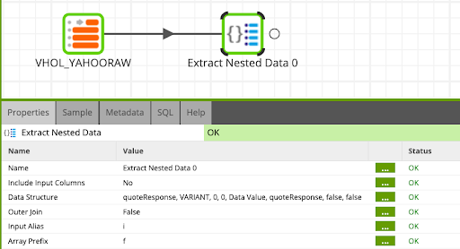

### We will now read TRADER_PNL_TODAY from our previous transformation job.

1. Locate the **Table Input** component and place is underneath the previous Table Input. And update the properties as follows:

|   |   |   |
|---|---|---|
| Name:  |  `TRADER_PNL_TODAY` |
| Target Table:  |  `TRADER_PNL_TODAY` |
|  Column Names: | Select all columns  |

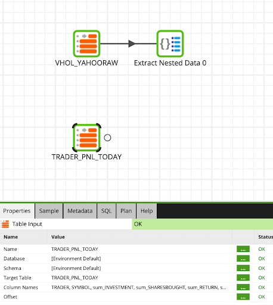

### Now we will only filter for Cersei’s trades by using the Filter component. 

1. Locate the **Filter** component and connect it to the table input from the previous step. And update the properties as follows:

|   |   |   |
|---|---|---|
|  Name:  |  `Cersei's Trades`  |
| Input Column:  | `Trader`  |
|  Qualifier: | `Is`  |   |
|  Comparator: |  `Value` |
|  Value:  |  `CERSEI`  |

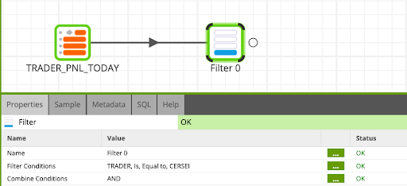

### Now we will join Cersei’s trades with the Yahoo API data using the Join component. 

1. Locate the **Join** component and connect to the Extract Nested Data and Cersei’s Trades, and update the properties as follows:

|   |   |   |
|---|---|---|
|  Name: | Join  |
| Main Table:  |  `Cersei's Trades` |
| Main Table Alias:  | `cersei`  |
| Joins: | `Joins Table - Extract Nested Data` |
|   |  `Join Alias - trades`  |
|   |  `Join Type - Inner`  |

**Join Expressions:**
|   |   |   |
|---|---|---|
|  cersei_inner_trades | `"cersei"."SYMBOL" = "trades"."symbol"`  |

**Output Columns:**
|   |   |   |
|---|---|---|
| `cersei.TRADER`  |  `TRADER` |
|  `cersei.SYMBOL` |  `SYMBOL` |
| `trades.regularMarketPrice`  |  `MARKETPRICE` |
|  `cersei.AVG_PRICE`  |  `AVG_PRICE`  |
|  `cersei.NET_SHAERES`  |  `# SHARES`  |

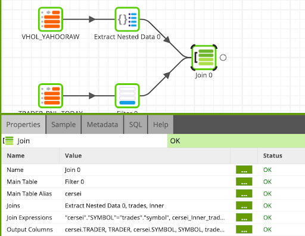

### Calculate the Win / Loss Logic

1. Drag and drop the Calculator component as the last step of the flow and update as follows:


|   |   |   |
|---|---|---|
|  Name: | `Calculator`  |

|  Expressions: |   |
|---|---|
| `MARKET_VALUE`  |  `"# SHARES" * "MARKETPLACE"` |
| `PORTFOLIO_VALUE`  |  `"AVG_PRICE" * "# SHARES"` |
|  `UNREALIZED_GAINS` |  `("AVG_PRICE" * "# SHARES") - ("# SHARES" * "MARKETPLACE")` |

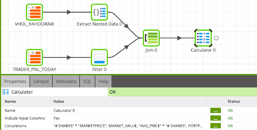

Finally, we will write Cersei’s profits back to Snowflake using the **Rewrite** component, and update as follows:

|   |   |
|---|---|
|  Name: | `CERSEI PROFITS`  |
| Target Table: |  `CERSEI PROFITS` |

Your final flow should now look like this:

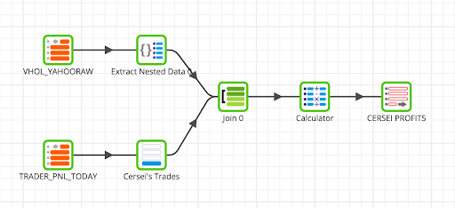

What this shows is the stock, quantity, and the real time average price of each stock. The resulting table is how much realized gains Cersei can expect based on the quantity of shares she owns. You can check the data in Snowflake to see that it was written correctly:

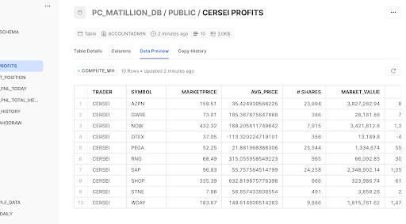

<!-- ------------------------ -->
## Conclusion
Duration: 1  

Congrats! You have successfully developed a well-orchestrated data engineering pipeline!  

### What we have covered
- Source 3rd party data from Snowflake data marketplace  
- Use Matillion’s GUI to build end-to-end transformation pipeline
- Leverage Matillion scale up/down Snowflake’s virtual warehouses  

Using Matillion ETL for Snowflake we were able to easily extract data from S3, perform complex joins, filter and aggregate through an intuitive, browser based, easy to use UI.  If we were to have used traditional ETL tools, it would have required a lot code, resources, and time to complete.   

Matillion ETL makes data engineering easier by allowing you to build your data pipelines more efficiently with a low-code/no-code platform built for the Data Cloud. We can build complex data pipelines to scale up and down within Snowflake based on your workload profile.

### Related Resources
- [Snowflake Docs](https://docs.snowflake.com/)
- [Matillion Docs](https://documentation.matillion.com/)
