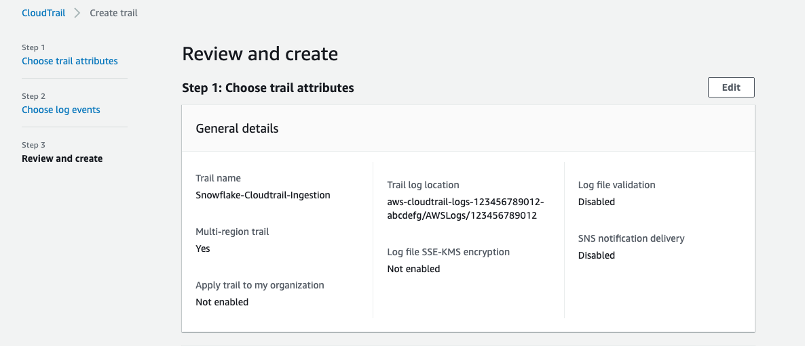
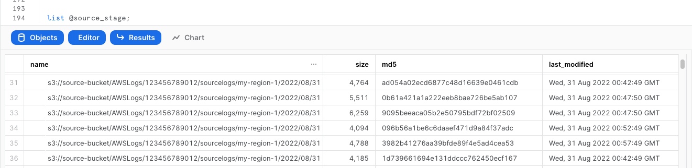
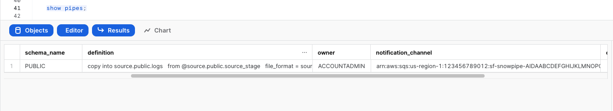
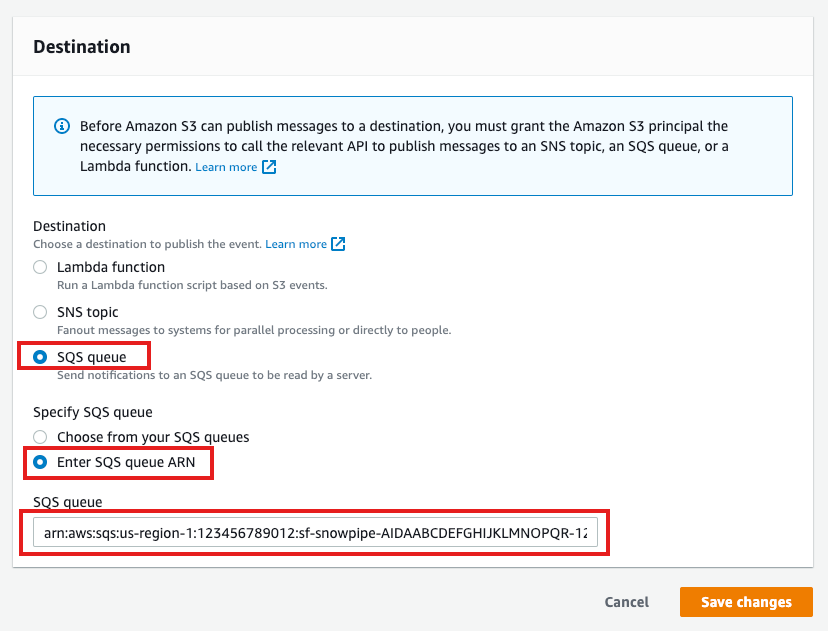

author: Jake Berkowsky
id: cloudtrail_log_ingestion
summary: This quickstart is a guide to ingesting and processing AWS CloudTrail events into snowflake. It provides detailed instructions for configuring an automated ingestion and processing pipeline as well as example queries for analytics, threat detection and posture management.
categories: Cybersecurity
environments: web
status: Published 
feedback link: https://github.com/Snowflake-Labs/sfguides/issues
tags: Cybersecurity, AWS

# AWS Cloudtrail Ingestion

## Overview 
Duration: 1

AWS CloudTrail is an AWS service that helps you enable operational and risk auditing, governance, and compliance of your AWS account. Actions taken by a user, role, or an AWS service are recorded as events in CloudTrail. Events include actions taken in the AWS Management Console, AWS Command Line Interface, and AWS SDKs and APIs.

This quickstart is a guide to ingesting and processing AWS CloudTrail events into snowflake. It provides detailed instructions for configuring an automated ingestion and processing pipeline as well as example queries for analytics, threat detection and posture management. More information about AWS CloudTrail can be found in the [AWS Cloudtrail User Guide](https://docs.aws.amazon.com/awscloudtrail/latest/userguide/cloudtrail-user-guide.html)


### Prerequisites
- AWS user with permission to create and manage IAM policies and roles
- Snowflake user with permission to create tables, stages and storage integrations as well as setup Snowpipe.
- An S3 Logging Bucket, preferably in the same region as your Snowflake target account.

### Architecture
![A diagram depicting the journey of Cloudtrail events to a snowflake database. The diagram is split between sections, AWS Cloud and Snowflake Cloud. The diagram begins on the AWS Cloud side where an arrow links the AWS Cloudtrail service to an S3 External stage, then to an SQS Queue with the description “Event Notification”. An arrow leads from the SQS queue to the Snowflake Cloud section of the diagram to an icon named Snowpipe. After Snowpipe the arrow leads back to S3 External stage with a description of “triggers”. Finally the path terminates on the Snowflake Cloud side at an icon named “Snowflake DB” with a description of “copy into”.](assets/cloudtrail_architecture_diagram.png)


## Enable CloudTrail
Duration: 5

For simplicity purposes, this quickstart will walk through configuring CloudTrail from a single account using default settings. 

If you have already configured CloudTrail or if you require an organization based or custom configuration please see the official documentation [here](https://docs.aws.amazon.com/awscloudtrail/latest/userguide/cloudtrail-create-and-update-a-trail.html) and skip to the next step.


1. Open the [CloudTrail console](https://console.aws.amazon.com/cloudtrail/)

1. On the dashboard page find and press `Create trail`

1. Configure Cloudtrail with the following settings

- **Trail name:** Choose a name for your trail. For example (Snowflake-Cloudtrail-Ingestion)
- **Storage location:**  We recommend creating a new S3 bucket. Take note of the name you choose
- **Log file SSE-KMS encryption** For the purposes of this lab we recommend you uncheck this box to use S3 managed encryption for easier ingest. If you choose to enable KMS encryption this will require additional IAM policies and configuration on the Snowflake side. More information on how to do this can be found [here](https://docs.snowflake.com/en/user-guide/data-load-s3-config-storage-integration.html)
- **Log file validation** For this lab we recommend you uncheck this box.

1. Press next and leave the default settings

1. Press next, review the details and press the create button



Note: Cloudtrail logging may take some time to start creating records. 


## Create a storage integration in Snowflake
Duration: 3

*Replace \<RoleName\> with the desired name of the role you’d like snowflake to use ( this role will be created in the next step).  Replace \<BUCKET_NAME\>/path/to/logs/ with the path to your CloudTrail logs as set in the previous step*

```sql
create STORAGE INTEGRATION s3_int_cloudtrail_logs
  TYPE = EXTERNAL_STAGE
  STORAGE_PROVIDER = S3
  ENABLED = TRUE
  STORAGE_AWS_ROLE_ARN = 'arn:aws:iam::<AWS_ACCOUNT_NUMBER>:role/<RoleName>'
  STORAGE_ALLOWED_LOCATIONS = ('s3://<BUCKET_NAME>/<PREFIX>/');

DESC INTEGRATION s3_int_cloudtrail_logs;
```
Take note of **STORAGE_AWS_IAM_USER_ARN** and **STORAGE_AWS_EXTERNAL_ID**


## Create role and policy in AWS
Duration: 5

*The following assumes a user with the ability to create and manage IAM logged into the AWS console or using the CLI.  A full explanation can be found in [this documentation](https://docs.snowflake.com/en/user-guide/data-load-s3-config.html)*

Open up Cloudshell in the AWS console by pressing the  icon on the right side of the top navigation bar or run the following commands in your terminal once configured to use the AWS CLI.

Export the following variables, replacing the values with your own

```bash
export BUCKET_NAME='<BUCKET_NAME>'
export PREFIX='<PREFIX>' # no leading or trailing slashes
export ROLE_NAME='<ROLE_NAME>'
export STORAGE_AWS_IAM_USER_ARN='<STORAGE_AWS_IAM_USER_ARN>'
export STORAGE_AWS_EXTERNAL_ID='<STORAGE_AWS_EXTERNAL_ID>'
```
Create a role for Snowflake to assume
```bash
aws iam create-role \
    --role-name "${ROLE_NAME}" \
    --assume-role-policy-document \
'{
    "Version": "2012-10-17",
    "Statement": [
        {
            "Sid": "",
            "Effect": "Allow",
            "Principal": {
                "AWS": "'${STORAGE_AWS_IAM_USER_ARN}'"
            },
            "Action": "sts:AssumeRole",
            "Condition": {
                "StringEquals": {
                    "sts:ExternalId": "'${STORAGE_AWS_EXTERNAL_ID}'"
                }
            }
        }
    ]
}'
```
Create an inline-policy to allow snowflake to add and remove files from S3

```bash
aws iam put-role-policy \
    --role-name "${ROLE_NAME}" \
    --policy-name "${ROLE_NAME}-inlinepolicy" \
    --policy-document \
'{
    "Version": "2012-10-17",
    "Statement": [
        {
            "Effect": "Allow",
            "Action": [
              "s3:PutObject",
              "s3:GetObject",
              "s3:GetObjectVersion",
              "s3:DeleteObject",
              "s3:DeleteObjectVersion"
            ],
            "Resource": "arn:aws:s3:::'${BUCKET_NAME}'/'${PREFIX}'/*"
        },
        {
            "Effect": "Allow",
            "Action": [
                "s3:ListBucket",
                "s3:GetBucketLocation"
            ],
            "Resource": "arn:aws:s3:::'${BUCKET_NAME}'",
            "Condition": {
                "StringLike": {
                    "s3:prefix": [
                        "'${PREFIX}'/*"
                    ]
                }
            }
        }
    ]
}'
```
You will now be able to see your role, policy and trust relationship in the console


## Prepare Snowflake to receive data
Duration: 6

This quickstart requires a warehouse to perform computation and ingestion. We recommend creating a separate warehouse for security related analytics if one does not exist. The following will create a medium sized single cluster warehouse that suspends after 1 minute of inactivity. For production workloads a larger warehouse will likely be required.

```sql
create warehouse security_quickstart with 
  WAREHOUSE_SIZE = MEDIUM 
  AUTO_SUSPEND = 60;
```


Create External Stage using the storage integration and test that snowflake can test files. Make sure you include the trailing slash if using a prefix.
```sql
create stage cloudtrail_logs_staging
  url = 's3://<BUCKET_NAME>/<PREFIX>/'
  storage_integration = s3_int_cloudtrail_logs
;

list @cloudtrail_logs_staging;
```


Create a table to store the raw logs
```sql
create table public.cloudtrail_raw(
  record VARIANT
);
```

Test importing logs from External Stage
```sql
copy into cloudtrail_raw FROM @cloudtrail_logs_staging FILE_FORMAT = (type = json);
```


Verify the logs were loaded properly
```sql
select * from public.cloudtrail_raw limit 5;
```

## Setup Snowpipe for continuous loading
Duration: 5

The following instructions depend on a Snowflake account running on AWS. Accounts running on other cloud providers may invoke snowpipe from a rest endpoint.
[https://docs.snowflake.com/en/user-guide/data-load-snowpipe-rest.html](https://docs.snowflake.com/en/user-guide/data-load-snowpipe-rest.html)


Configure the Snowflake snowpipe
```sql
create pipe public.cloudtrail_pipe auto_ingest=true as
copy into cloudtrail_raw 
FROM @cloudtrail_logs_staging  FILE_FORMAT = (type = json);
```

Show pipe to retrieve SQS queue ARN in the `notification_channel` column
```sql
show pipes;
```


Setup S3 bucket with following [AWS instructions](https://docs.aws.amazon.com/AmazonS3/latest/userguide/enable-event-notifications.html).

Target Bucket -> Properties -> Event notifications -> Create event notification


Fill out below items
- Name: Name of the event notification (e.g. Auto-ingest Snowflake).
- Prefix(Optional) :  if you receive notifications only when files are added to a specific folder (for example, logs/). 
- Events: Select "All object create events".
- Destination: Select “SQS Queue” from the dropdown list.
- SQS: Select “Add SQS queue ARN” from the dropdown list.
- SQS queue ARN: Paste the SQS queue name from the SHOW PIPES output.




Event notification has been created


Refresh Snowpipe to start the pipe and retrieve unloaded files
```sql
alter pipe cloudtrail_pipe refresh;
```


## Create a view to better query data
Duration: 3

To better make queries we will be creating a view using Snowflake's native JSON processing capabilities.

```sql
create view cloudtrail as
select 
    VALUE:eventTime::TIMESTAMP as eventTime, 
    VALUE:eventVersion::string as eventVersion,
    VALUE:userIdentity::variant as userIdentity,
    VALUE:eventSource::string as eventSource,
    VALUE:eventName::string as eventName,
    VALUE:awsRegion::string as awsRegion,
    VALUE:sourceIPAddress::string as sourceIPAddress,
    VALUE:userAgent::string as userAgent,
    VALUE:errorCode::string as errorCode,
    VALUE:errorMessage::string as errorMessage,
    VALUE:requestParameters::variant as requestParameters,
    VALUE:responseElements::variant as responseElements,
    VALUE:additionalEventData::variant as additionalEventData,
    VALUE:requestID::string as requestID,
    VALUE:eventID::string as eventID,
    VALUE:eventType::string as eventType,
    VALUE:apiVersion::string as apiVersion,
    VALUE:managementEvent::variant as managementEvent,
    VALUE:resources::variant as resources,
    VALUE:recipientAccountId::string as recipientAccountId,
    VALUE:serviceEventDetails::variant as serviceEventDetails,
    VALUE:sharedEventID::string as sharedEventID,
    VALUE:eventCategory::string as eventCategory,
    VALUE:vpcEndpointId::string as vpcEndpointId,
    VALUE:addendum::string as addendum,
    VALUE:sessionCredentialFromConsole::string as sessionCredentialFromConsole,
    VALUE:edgeDeviceDetails::string as edgeDeviceDetails,
    VALUE:tlsDetails::variant as tlsDetails,
    VALUE:insightDetails::variant as insightDetails
  from public.cloudtrail_raw , LATERAL FLATTEN(input => record:Records);
```

Note: Cloudtrail groups individual events in JSON arrays. This view uses a native `LATERAL FLATTEN` function to parse them into individual rows. Users should consider using a materialized view to improve query performance. More information about materialized views and their tradeoffs can be found [here](https://docs.snowflake.com/en/user-guide/views-materialized.html)


Preview the data
```sql
select * from cloudtrail limit 10;
```


## Query the data
Duration: 2

Create a workbook to query the new view. If desired, use the following to help get you started:

```sql
-- Console Login events Without MFA
select * from cloudtrail where eventName = 'ConsoleLogin'
and responseElements:ConsoleLogin = 'Success' 
and additionalEventData:MFAUsed = 'No'
and additionalEventData:SamlProviderArn is null;

-- Unauthorized API calls
select * from cloudtrail where errorCode in ('AccessDenied', 'UnauthorizedOperation')
and sourceIPAddress != 'delivery.logs.amazonaws.com'
and eventName != 'HeadBucket';

-- Updated S3 Bucket Policies
select * from cloudtrail where eventName in (
'PutBucketAcl',
'PutBucketPolicy',
'PutBucketCors',
'PutBucketLifecycle',
'PutBucketReplication',
'DeleteBucketPolicy',
'DeleteBucketCors',
'DeleteBucketLifestyle',
'DeleteBucketReplication'
);

-- Audit Root account activity
select * from cloudtrail 
where userIdentity:type = 'Root' 
and eventType != 'AwsServiceEvent'
and userIdentity:invokedBy is null;

-- Updated Security Group Rules
select * from cloudtrail where eventName in (
'AuthorizeSecurityGroupEgress',
'AuthorizeSecurityGroupIngress',
'CreateSecurityGroup',
'DeleteSecurityGroup',
'RevokeSecurityGroupEgress',
'RevokeSecurityGroupIngress'
);

```

## Conclusion & next steps
Duration: 0

Having completed this quickstart you have successfully:
- Configured AWS Cloudtrail
- Created and configured an external stage using S3
- Ingested Cloudtrail into Snowflake
- Created and configured a pipeline to automatically load data
- Created a scheduled task and function to automatically process data
- Explored sample queries to get insights out of your Cloudtrail logs

### Additional References
- [https://docs.snowflake.com/en/user-guide/data-load-s3-config.html](https://docs.snowflake.com/en/user-guide/data-load-s3-config.html)
- [https://docs.snowflake.com/en/user-guide/data-load-snowpipe-auto-s3.html#option-1-creating-a-new-s3-event-notification-to-automate-snowpipe](https://docs.snowflake.com/en/user-guide/data-load-snowpipe-auto-s3.html#option-1-creating-a-new-s3-event-notification-to-automate-snowpipe)
