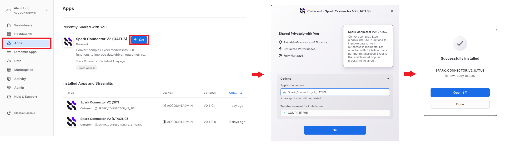
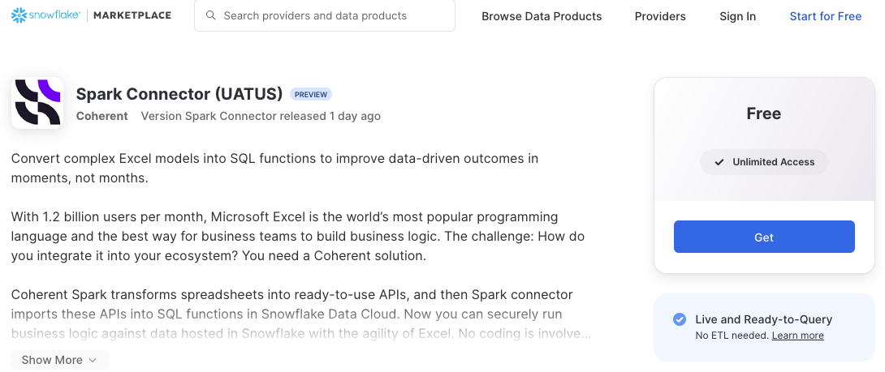
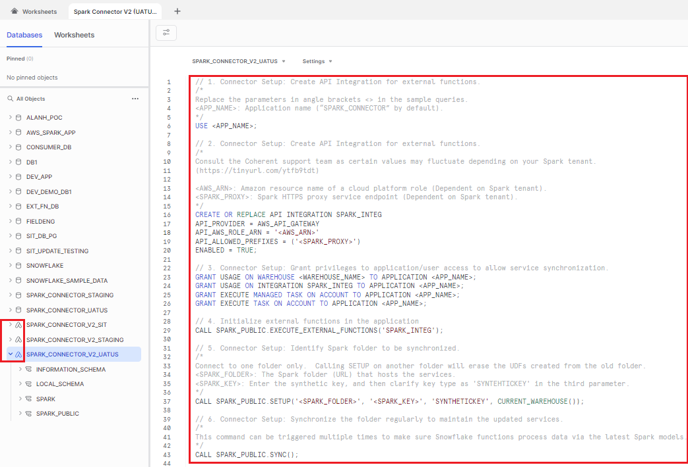
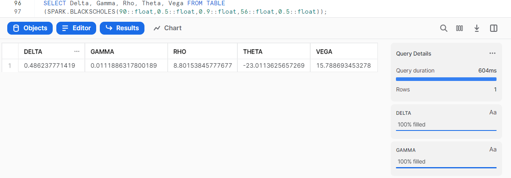
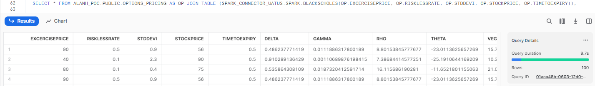
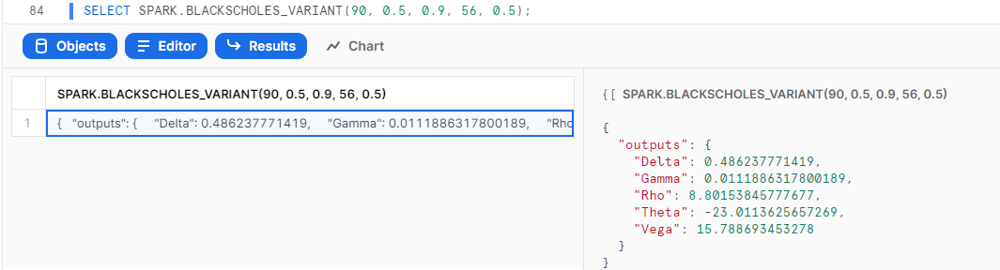

authors: Dustin Smith, Alan Hung
id: coherent_spark_connector
summary: Use business logic from Excel in Snowflake with Coherent Spark
categories: Getting-Started
environments: web
status: Published 
feedback link: https://github.com/Snowflake-Labs/sfguides/issues
tags: Getting Started, Coherent, Coherent Spark, Excel

# Coherent Spark Connector - use business logic from Excel spreadsheets in Snowflake
<!-- ------------------------ -->
## Overview 
Duration: 1

The Coherent Spark Connector transforms business logic designed in Microsoft Excel spreadsheets into reusable SQL functions that execute natively in the Snowflake Data Cloud. Joint customers can save significant time on development and testing, and hence roll out their products to the market quickly while the original dataset remains in the Snowflake environment. The entire workflow comes with enterprise-grade security and scalability.

Technically, once the logic is processed in the Spark server, Spark Connector imports the Spark APIs into Snowflake Data Cloud as a SQL function so Snowflake users can securely run business logic against the data hosted in Snowflake with the agility of Excel. No coding is involved in this process, leading to better, faster results.


### Benefits

- **Transform Excel logic into Snowflake functions** - Create SQL functions from your Excel spreadsheets within minutes so you can process consumer data on the Snowflake Data Cloud.
- **Effective governance** - Data can be maintained in the Snowflake environment and executed by the designed logic.
- **Get value faster** - Boost logic execution efficiency by leveraging batch process with Snowflake data.
- **Easy set up with sample queries -** Procedures are integrated into the application, which is accessible via private sharing or the public marketplace. No coding is required. Consumers can securely install and run directly in their Snowflake instance with just a few clicks. Sample queries are provided with the native connector for guidance.
- **Auto-sync to keep logic up to date** - The automatic synchronization ensures the SQL functions work with the latest Spark models.
- **Receive application updates instantly** - The development team rolls out regular updates to improve the application's quality.   Consumers who maintained an instance of the native application in their Snowflake platform will receive the update instantly without any work required.


### Prerequisites
- Familiarity with Snowflake and basic SQL queries

### What You’ll Learn 
By the end of this guide, you'll learn:
- how to install Spark Connector in your Snowflake environment.
- how to grant the needed permissions .
- how to synchronize your Spark services with Snowflake.
- how to use Spark services in Snowflake.

### What You’ll Need 
- A [Snowflake account](https://snowflake.com/) 
- Access to a [Coherent Spark](https://coherent.global) tenant, with at least one service uploaded

### What You’ll Build 
- A working installation of Spark Connector
- Database functions in Snowflake for each Spark Service in the folder you synchronize with

### Additional Technical Information
#### Naming convention

Make sure model names and Xparameter names meet the Snowflake identifier requirements, otherwise, the synchronization process might fail.

A name:

* can contain up to 128 characters.
* must begin with a letter (A-Z, a-z) or an underscore (`_`).
* contains only letters, underscores (`_`), decimal digits (0-9), and dollar signs (`$`).
* can't be a reserved word in Snowflake such as WHERE or VIEW.  For a complete list of reserved words, refer to the [Snowflake documentation](https://docs.snowflake.com/en/sql-reference/reserved-keywords).
* can't be the same as another Snowflake object of the same type.

#### Supported/Unsupported Xservices

This table defines the active Xservices which are supported or not supported in the Snowflake native connector.

Spark model(s) using any Xservices defined below as "Not supported", might fail to be imported as Snowflake UDFs in the synchronization process, or the imported Snowflake UDFs might fail to return correct results.

This connector aims to support all Xservices available in Spark and this table will be updated regularly when there are new releases.  It's always recommended to update the Snowflake native connector to the latest version.

Certain legacy Xservices are not included in this table and they will not be supported in the Snowflake connector unless further notice.


| Xservices                      | Supported |
| ------------------------------ | --------- |
| `xinput`                       | YES       |
| `xoutput`                      | YES       |
| `xparameter`                   | YES       |
| `subservices`                  | NO        |
| `xcall` (Insert `requestbody`) | YES       |
| `xcall` (Insert `requestdata`) | YES       |
| `xCSVinput`                    | NO        |
| `xCSVoutput`                   | NO        |
| `ximage` / `ximageoriginal`    | NO        |
| `xjinput`                      | NO        |
| `xjoutput`                     | NO        |
| `xreport`                      | NO        |
| `xrichoutput`                  | NO        |
| `xsolve`                       | NO        |
| `xvalidate`                    | NO        |

_Table last updated: 3rd June 2023._

<!-- ------------------------ -->
## Download the connector from Private Sharing or Public Marketplace
Duration: 1

### Download from Private Sharing

1. Sign into the Snowflake platform.
2. Go to "Apps" on the left panel and "Spark Connector' should appear under "Shared with you" if the Snowflake account is given access to the private application.  Click the application widget to visit the full information page.
3. Click "Get" to open the installation pop up.
4. Select your preferred installation options (database name, account role for access) and then click "Get" again.  Spark Connector will be installed in the consumer platform.
5. Once Spark Connector is successfully installed, click "Open" to begin.



### Download from Public Marketplace

1. Go to [our Marketplace listing](https://app.snowflake.com/marketplace/listing/GZSTZVB9C1I/coherent-spark-connector-uatus) or search for "Spark Connector" in the Marketplace.
2. Click "Get" to open the installation pop up.
3. Select your preferred installation options (database name, account role for access) and then click "Get" again.  Spark Connector will be installed in the consumer platform.
4. Once Spark Connector is successfully installed, click "Open" to begin.



### Review the installed application in the consumer platform

* Clicking "Get" will bring users into the SQL query layout, with the database/application list on the left panel.  Spark Connector is displayed in the database list, but it has a distinct icon that sets it apart from other databases or legacy native applications (V1).
* Snowflake will create a new worksheet with sample queries to help the user to operate with the Spark Connector.



<!-- ------------------------ -->
## Grant privileges to application/user access to allow service synchronization
Duration: 1


### 1. Specify the active application for the session.

Replace the parameters in the curly brackets `{ }` in the SQL queries, then execute in the Snowflake environment.

- `{APP_NAME}`: Application name ("SPARK_CONNECTOR" by default).

<pre class="language-sql"><code class="lang-sql"><strong>USE {APP_NAME};
</strong></code></pre>

### 2. Create API Integration for external functions.

Depending on which Spark server hosts the service, find the corresponding Spark Proxy Service from the table below.

#### `{AWS_ARN}`: Amazon resource name of a cloud platform role.

<table><thead><tr><th width="198">Server Environment</th><th>Amazon Resource Name</th></tr></thead><tbody><tr><td>DEV, SIT, STAGING</td><td>(Contact support team for more information)</td></tr><tr><td>UAT (US)</td><td>arn:aws:iam::533606394992:role/Snowflake-WASM-Server-Invoker</td></tr><tr><td>PROD (US)</td><td>arn:aws:iam::493603396830:role/Snowflake-WASM-Server-Invoker</td></tr></tbody></table>

#### `{SPARK_PROXY}`: Spark HTTPS proxy service endpoint.

<table><thead><tr><th width="198">Server Environment</th><th>Spark Proxy</th></tr></thead><tbody><tr><td>DEV, SIT, STAGING</td><td>(Contact support team for more information)</td></tr><tr><td>UAT (US)</td><td>https://ymeen1pkt6.execute-api.us-east-1.amazonaws.com</td></tr><tr><td>PROD (US)</td><td>https://yahx9ppboe.execute-api.us-east-1.amazonaws.com</td></tr></tbody></table>


```sql
CREATE OR REPLACE API INTEGRATION SPARK_INTEG
API_PROVIDER = AWS_API_GATEWAY
API_AWS_ROLE_ARN = '{AWS_ARN}'
API_ALLOWED_PREFIXES = ('{SPARK_PROXY}')
ENABLED = TRUE;
```

### 3. Grant privileges to application/user access to allow service synchronization.

```sql
GRANT USAGE ON WAREHOUSE {WAREHOUSE_NAME} TO APPLICATION {APP_NAME};
GRANT USAGE ON INTEGRATION SPARK_INTEG TO APPLICATION {APP_NAME};
GRANT EXECUTE MANAGED TASK ON ACCOUNT TO APPLICATION {APP_NAME};
GRANT EXECUTE TASK ON ACCOUNT TO APPLICATION {APP_NAME};
```

### 4. Initialize external functions in the application.

```sql
CALL SPARK_PUBLIC.EXECUTE_EXTERNAL_FUNCTIONS('SPARK_INTEG');
```

### 5. Identify the Spark folder to be synchronized.

> aside negative
> 
> Connect to one folder only. Calling SETUP on another folder will erase the UDFs created from the old folder.

`{SPARK_FOLDER}`: The Spark folder (URL) that hosts the services.

`{SPARK_KEY}`: Enter the synthetic key, and then clarify key type as 'SYNTHETICKEY' in the third parameter.

```sql
CALL SPARK_PUBLIC.SETUP('{SPARK_FOLDER}', '{SPARK_KEY}', 'SYNTHETICKEY', CURRENT_WAREHOUSE());
```

<!-- ------------------------ -->
## Synchronize folders and services
Duration: 1

### Synchronize the folder regularly to maintain the updated services.

> aside positive
> 
>  This command can be triggered multiple times to make sure Snowflake functions process data via the latest Spark models. Otherwise, the automatic synchronization mechanism built into this connector will update the Snowflake functions to the latest Spark service every 3 minutes.

```sql
CALL SPARK_PUBLIC.SYNC();
```

### Synchronize multiple versions of a single Spark service.

> aside negative
> 
> The automatic synchronization mechanism mentioned before doesn't keep track of all versions available in Spark. The following command needs to be triggered manually to make sure all available versions are imported into the Snowflake environment.

`{SERVICE_NAME}`: The service name as presented in the Spark platform.

```sql
CALL SPARK_PUBLIC.SYNC('{SERVICE_NAME}');
```

.png)

For each version of each service in a synchronized folder, you will see two database functions, one called `{SERVICE_NAME}` and one called `{SERVICE_NAME}_VARIANT`. You'll learn how to use these in the next step.

<!-- ------------------------ -->
## Use the functions in the Snowflake environment
Duration: 1


The two database functions operate in different modes:

### `{SERVICE_NAME}(Parameters)`: Returns results in a tabular format.

#### Query a single set of parameters
```sql
SELECT Delta, Gamma, Rho, Theta, Vega FROM TABLE
(SPARK.BLACKSCHOLES(90::float,0.5::float,0.9::float,56::float,0.5::float));
```



#### Process a table of data.

```sql
SELECT input.id,input.excercisePrice, input.risklessRate, input.stdDevi, input.stockPrice, input.timeToExpiry,output.* 
FROM {TABLE_NAME} input 
JOIN TABLE(SPARK.BLACKSCHOLES(
    input.excercisePrice, 
    input.risklessRate, 
    input.stdDevi, 
    input.stockPrice, 
    input.timeToExpiry)) outputQL
```



### `{SERVICE_NAME}_VARIANT(Parameters)`: Returns results in raw JSON format.

```sql
SELECT SPARK.BLACKSCHOLES_VARIANT(90, 0.5, 0.9, 56, 0.5);
```



<!-- ------------------------ -->
## Conclusion
Duration: 1

Congratulations, you're now all set up to use your Spark services inside your Snowflake environment! This means you can take business logic written in Excel, upload it to Spark, and immediately use it on all of your data in Snowflake, no coding needed!

You can find out more about Coherent Spark on our [homepage](https://coherent.global) or read up about other features in our [documentation](https://coherent.gitbook.io/spark/T1wG85lxdoEsRrNQJvPj/integrations/snowflake-connector).

### What we've covered

- Installing Spark Connector
- Adding permissions
- Synchronizing your services
- Using Spark services in Snowflake

### FAQs

### 1. Can I execute Spark functions against the data from another database?

Functions imported in the Spark synchronization process are ready for cross-database access.  Snowflake users can execute Spark functions against the data from another database in the same cloud warehouse when the query contains the full naming conversion (`database.schema.function-name` / `database.schema.procedure-name)`, e.g.

```sql
SELECT SPARK_CONNECTOR.SPARK.BLACKSCHOLES_VARIANT(90, 0.5, 0.9, 56, 0.5);
```

### 2. How is my Snowflake data kept safe when using the synchronized Spark functions?

The first version of the Spark connector relies on the Spark API endpoint, which means that data from Snowflake will be taken into the Spark server for processing. All UDFs generated from the Spark connector setup process follow the advice given by Snowflake to ensure the entire data transition is implemented in the secured environment. The UDF owner must grant callers appropriate privilege(s) on the UDF access and usage. Snowflake users need to provide subscription information (API key) when calling the Spark proxy service.  For more information, please refer to [Snowflake's documentation on external function security.](https://docs.snowflake.com/en/sql-reference/external-functions-security)


