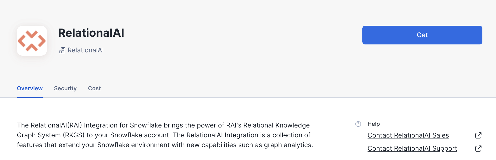
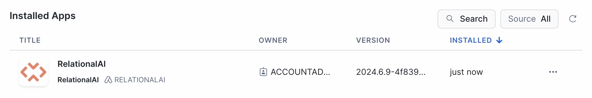

author: Patrick Lee, Steve Bertolani
id: community_detection_using_relationalai
summary: This guide shows how to use RelationalAI and Snowflake to create a social graph and detect customer communities from retail transaction data.
categories: data-science, graph-analysis, relationalai, community-detection
environments: web
status: Published 
feedback link: https://github.com/RelationalAI/rai-samples/issues
tags: Getting Started, Data Science, Data Engineering, Twitter 

# Community Detection using RelationalAI

## Overview 
Duration: 1

In this quickstart, we'll use RelationalAI — a Native App available in the Snowflake Marketplace — to run community detection algorithms. The sample data represent food-truck orders, and we'll use them to identify groups of customers who probably know each other. This allows us to build a social graph and interact with groups of related customers.

### What Is RelationalAI?

RelationalAI is a cloud-native platform that enables organizations to streamline and enhance decisions with intelligence. RelationalAI extends Snowflake with native support for an expanding set of AI workloads (e.g., graph analytics, rule-based reasoning, and optimization), all within your Snowflake account, offering the same ease of use, scalability, security, and governance.

Users can build a knowledge graph using Python and materialize it on top of their Snowflake data, which are shared with the RelationalAI app through Snowflake Streams. Insights can be written to Snowflake tables and shared across the organization.

### What You’ll Learn


- How to discover new insights by running a variety of graph algorithms on your Snowflake data
- How to complement your graph analytics with graph visualizations
- How — thanks to native applications with Snowpark Container Services — we can do all of this within the Snowflake Data Cloud

### What You’ll Need

- A [Snowflake](https://signup.snowflake.com/) Account on AWS in the US East (N. Virginia) region or the US West (Oregon) region.
- Basic knowledge of using a Snowflake SQL Worksheet
- [Snowflake privileges on your user to install a Native Application](https://other-docs.snowflake.com/en/native-apps/consumer-installing#set-up-required-privileges)
- Either:
    - Snowflake privileges to create databases and schemas in your Snowflake account, or
    - A Snowflake table called `RAI_DEMO.TASTYBYTES.ORDER` that contains the data used in this quickstart.
- The [RAI Community Detection Jupyter notebook](https://relational.ai/notebooks/community-detection.ipynb) used in this quickstart

### What You’ll Build

- A community detection analysis to find which food truck customers frequently eat together
- A visualization of this data

<!-- ------------------------ -->

## Install the RelationalAI Native App In Your Account
Duration: 7

### Installation Sequence

In the [Snowflake Marketplace](https://app.snowflake.com/marketplace), search for the ‘RelationalAI’ Native App and request it by clicking the “Request” button. When your request is approved by the RelationalAI team, you'll see the RelationalAI app under *Data Products > Apps*. Click the “Buy” button to install the app in your Snowflake account.



When the installation process is complete, you'll see RelationalAI in your list of installed apps:



Click on the RelationalAI app to open it. The first screen prompts you to grant the necessary privileges for the app to run:


The next button prompts you to activate the app:


The last screen in this sequence prompts you to launch the app, but you can skip that step.

Congratulations! The RelationalAI app is now available in your Snowflake account.

### Setup

Next, open a Snowsight SQL worksheet and run the SQL commands below from top to bottom. Note that this worksheet includes some appendices with commands that you may need later.

```sql
-- Main Script: Getting Started

-- Step 0: Use the ACCOUNTADMIN role for the following operations
USE ROLE ACCOUNTADMIN;

-- Step 1: Create an event table
CREATE DATABASE IF NOT EXISTS RAI_DEMO;
CREATE SCHEMA IF NOT EXISTS RAI_DEMO.SOURCE;
CREATE EVENT TABLE IF NOT EXISTS RAI_DEMO.SOURCE.EVENT_TABLE;
ALTER ACCOUNT SET EVENT_TABLE = 'RAI_DEMO.SOURCE.EVENT_TABLE';

-- Step 2: Enable telemetry sharing
ALTER APPLICATION relationalai SET SHARE_EVENTS_WITH_PROVIDER = TRUE;

-- Step 3: Create compute pools for the RAI service and engines
CREATE COMPUTE POOL IF NOT EXISTS rai_service_pool
      FOR APPLICATION relationalai
      MIN_NODES = 1
      MAX_NODES = 1
      AUTO_RESUME = TRUE
      AUTO_SUSPEND_SECS = 300
      INSTANCE_FAMILY = CPU_X64_S;
GRANT USAGE, MONITOR ON COMPUTE POOL rai_service_pool TO APPLICATION relationalai;

CREATE COMPUTE POOL IF NOT EXISTS rai_engine_pool_s
      FOR APPLICATION relationalai
      MIN_NODES = 1
      MAX_NODES = 10
      AUTO_RESUME = TRUE
      AUTO_SUSPEND_SECS = 300
      INSTANCE_FAMILY = HIGHMEM_X64_S;
GRANT USAGE, MONITOR ON COMPUTE POOL rai_engine_pool_s TO APPLICATION relationalai;

CREATE COMPUTE POOL IF NOT EXISTS rai_engine_pool_m
      FOR APPLICATION relationalai
      MIN_NODES = 1
      MAX_NODES = 10
      AUTO_RESUME = TRUE
      AUTO_SUSPEND_SECS = 300
      INSTANCE_FAMILY = HIGHMEM_X64_M;
GRANT USAGE, MONITOR ON COMPUTE POOL rai_engine_pool_m TO APPLICATION relationalai;

-- Step 4: Create a warehouse for the app to use
CREATE WAREHOUSE IF NOT EXISTS rai_warehouse WITH
      MAX_CONCURRENCY_LEVEL = 8
      WAREHOUSE_SIZE = 'X-SMALL'
      AUTO_SUSPEND = 180
      AUTO_RESUME = TRUE
      INITIALLY_SUSPENDED = TRUE;
GRANT USAGE ON WAREHOUSE rai_warehouse TO APPLICATION relationalai;

-- Step 5: Start the RAI service
-- use this command to poll the compute pool until its state is 'Active/Idle':
-- (this usually takes 1-2 minutes)
DESCRIBE COMPUTE POOL rai_service_pool;

-- ...then start the RAI service:
CALL RELATIONALAI.APP.START_SERVICE('rai_service_pool', 'rai_warehouse');

-- Step 6: Setting up CDC
-- create an engine for change-data-capture
-- (this command usually takes 3-4 minutes to run)
CALL RELATIONALAI.API.CREATE_ENGINE('cdc_engine', 'rai_engine_pool_s', 'HighMem|S');

-- set that engine to be the CDC engine
CALL RELATIONALAI.APP.SETUP_CDC('cdc_engine');

-- Congatulations! Your RelationalAI app is ready to use.

--------------------------------------------------------------------------------------

-- Appendix 1: Suspending the Service

-- If you aren't going to use the service for a while, suspend it to avoid incurring
-- unnecessary costs:

-- Suspend CDC
CALL RELATIONALAI.APP.SUSPEND_CDC();

-- Delete the CDC engine:
CALL RELATIONALAI.API.DELETE_ENGINE('cdc_engine', TRUE);

-- List the engines:
SELECT * FROM RELATIONALAI.API.ENGINES;

-- For each engine name in the output of the above `SELECT` statement (if any),
-- fill in the engine name in the following command and run it:
-- CALL RELATIONALAI.API.DELETE_ENGINE('<engine_name>', TRUE);

-- Suspend the service
CALL RELATIONALAI.APP.SUSPEND_SERVICE();

--------------------------------------------------------------------------------------

-- Appendix 2: Resuming the Service

-- Resume the service after suspending it:
CALL RELATIONALAI.APP.RESUME_SERVICE();

-- Recreate the engine if necessary:
CALL RELATIONALAI.API.CREATE_ENGINE('cdc_engine', 'rai_engine_pool_s', 'HighMem|S');

-- Resume CDC:
CALL RELATIONALAI.APP.RESUME_CDC();

--------------------------------------------------------------------------------------

-- Appendix 3: Defining a RelationalAI User Role

-- To create a role that can be granted to any users permitted to use this application

-- In your account, create a role specific for accessing the app
CREATE ROLE rai_user;

-- Link the app's user role to the created role. Note that you can create more fine-grained roles at a later point.
GRANT APPLICATION ROLE relationalai.all_admin TO ROLE rai_user;

-- Allow the role to see engine compute pools. This is needed for the RAI Python library to manage engines.
GRANT MONITOR ON COMPUTE POOL rai_engine_pool_s TO ROLE rai_user;
GRANT MONITOR ON COMPUTE POOL rai_engine_pool_m TO ROLE rai_user;
```

Refer to the [documentation](https://relational.ai/docs/native_app/installation) for full instructions and more details about how to use the RelationalAI Native App.

## Set Up Your Environment
Duration: 8

In addition to your Snowflake account setup, follow the steps below to set up a local installation of Python with Jupyter Lab and the RelationalAI Python library.

- Create a directory for this project and place the [demo notebook](https://relational.ai/notebooks/community-detection.ipynb) in it.
- Navigate to your project directory in your operating system's terminal application.
- Check your Python installation:
    - Run `python3 --version` from your terminal.
        - If your Python version starts with 3.10 or 3.11, it's compatible with the RelationalAI Python library.
        - Otherwise, you'll need to download and install Python:
            - Download the installer for your OS from the [Python 3.11 download page](https://www.python.org/downloads/release/python-3119/)
            - Run the installer.
            - Verify that Python 3.11 is available by running `python3.11 --version` from your terminal.
- Set up a virtual environment for the packages you'll install:
    ```bash
    python3.11 -m venv .venv # or python3 -m venv .venv, if you don't have a python3.11 executable
    source .venv/bin/activate  # Activate on Linux and macOS.
    # .venv\Scripts\activate  # Activate on Windows.
    python -m pip install jupyterlab relationalai
    ```

### RelationalAI Config File

After installing the `relationalai` package, you will need to set up a RAI configuration with the Snowflake credenrtials you want to use (similar to the configuration for Snowflake CLI).

Run `rai init` from your terminal and follow the prompts to enter your credentials and other configuration data:


1. Choose `Snowflake` as your host platform.
2. Select a profile from `~/.snowflake/connections.toml` if you have one, or enter your username, password, and Account ID otherwise. 
3. Select your role `rai_user` that you created earlier.
4. Select a Snowflake warehouse.
5. Select `[CREATE A NEW ENGINE]` to create a new engine. Enter any name you want for the engine, for example `rai_engine`. (Usually you would not want to select the same engine you created above for CDC.)
6. Select `HighMem|S` as the engine size.
7. Choose the compute pool `rai_compute_pool` that you created above.
8. Press `Enter` to accept the default profile name of `default`.

## Run the Notebook in Jupyter Lab
Duration: 15

1. Start Jupyter Lab with the following command:
   
    ```bash
    jupyter lab
    ```
    
    and visit the URL (something like `http://localhost:8888/lab?token=XXXX`) printed in the console output in your browser.

2. Open the `community-detection.ipynb` file in Jupyter lab. You should see the top of the notebook:


3. If you don't already have a Snowflake table called `RAI_DEMO.TASTYBYTES.ORDERS`, scroll down to the Appendix and run the cells in that section to insert the data for this demo into your Snowflake account.
   
4. The notebook will guide you through defining a knowledge graph!

---

## Conclusion & Resources
Duration: 1

Congratulations on completing the our Community Detection using RelationalAI guide! In this Quickstart you learned

- How to install the RelationalAI Native App from the Snowflake Marketplace
- How to build a knowledge graph on top of your Snowflake data without having to export your data from Snowflake
- How to run graph algorithms on your knowledge graph and visualize relationships in the graph

### Resources
- To learn about more about RelationalAI and view full documentation, visit [https://relational.ai](https://relational.ai)
- [Louvain community detection method](https://en.wikipedia.org/wiki/Louvain_method)
- [Snowflake Marketplace](https://app.snowflake.com/marketplace)
- More info on [Snowflake Native Apps](https://docs.snowflake.com/en/developer-guide/native-apps/native-apps-about)
