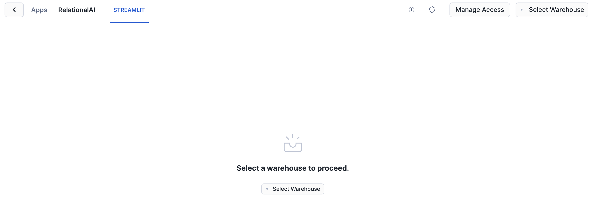
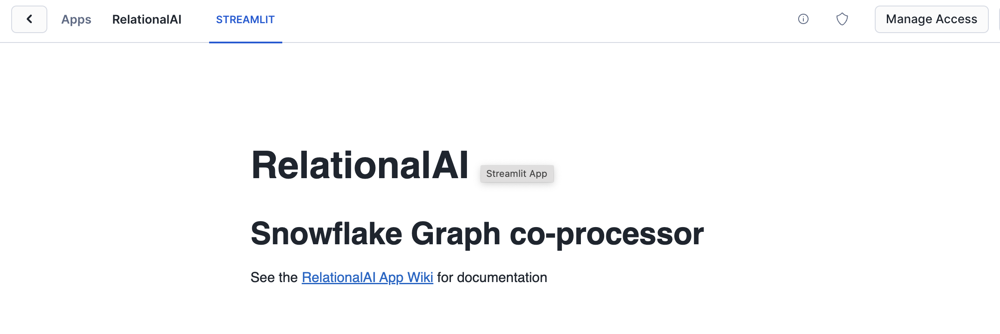
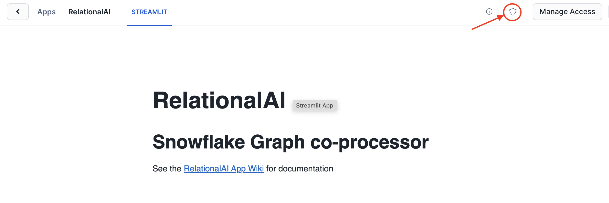
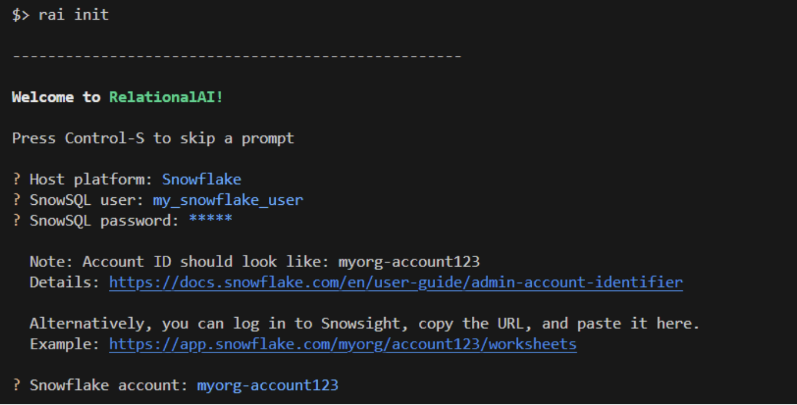
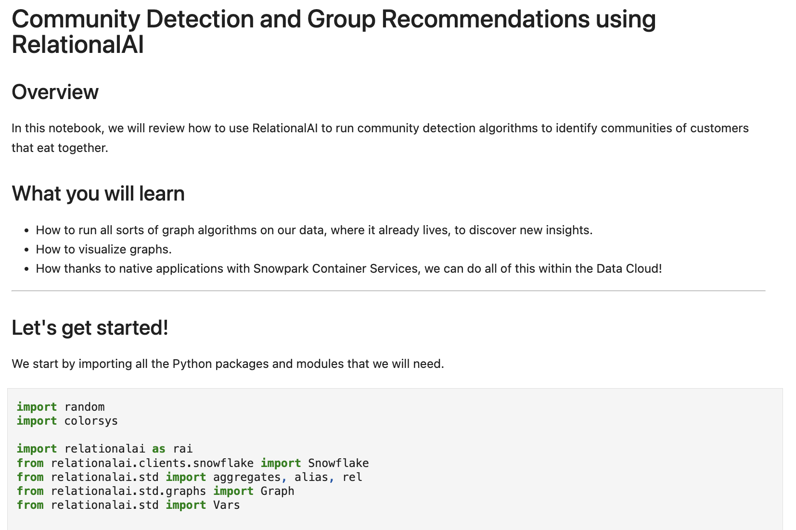
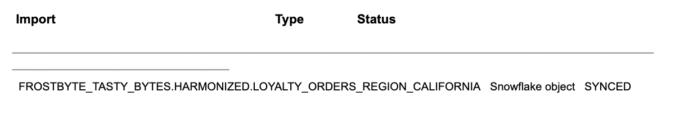
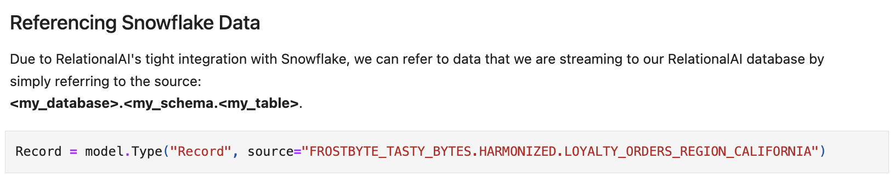
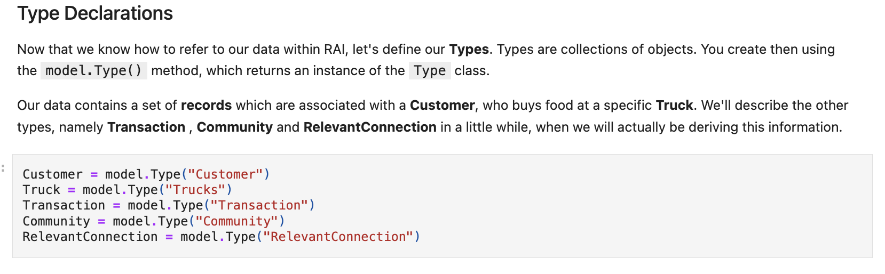
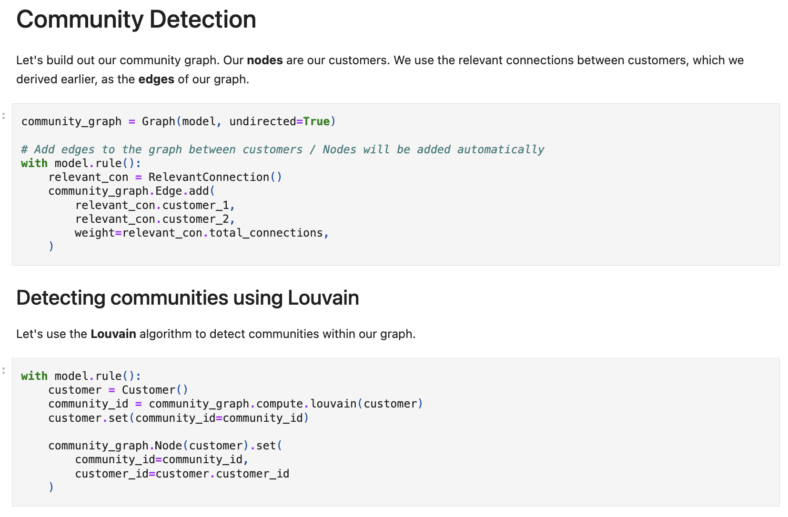

author: Patrick Lee, Steve Bertolani
id: community_detection_using_relationalai
summary: This guide shows how to use RelationalAI and Snowflake to create a social graph and detect customer communities from retail transaction data.
categories: data-science, graph-analysis, relationalai, community-detection
environments: web
status: Published 
feedback link: https://github.com/RelationalAI/rai-samples/issues
tags: Getting Started, Data Science, Data Engineering, Twitter 

# Community Detection using RelationalAI

## Overview 

In this quickstart, we will review how to use RelationalAI, a Native App available in the Snowflake Marketplace, to run community detection algorithms.  Community detection allows us to use our existing data, order records from various food trucks, and identify "communities", groups of customers that probably know each other, which allows us to build a social graph and interacts with groups of related customers.

### What Is RelationalAI?
RelationalAI is a cloud-native platform that enables organizations to streamline and enhance decisions with intelligence. RelationalAI extends Snowflake with native support for an expanding set of AI workloads (e.g., graph analytics, rule-based reasoning, and optimization), all within your Snowflake account, offering the same ease of use, scalability, security, and governance.
Users can build a knowledge graph using Python, and materialize it on top of their Snowflake data, shared with the RelationalAI app through Snowflake Streams.  Insights can be written to Snowflake tables and shared across the organization.

### What You’ll Learn 
- How to run all sorts of graph algorithms on your data, where it already lives, to discover new insights
- How to visualize graphs
- How, thanks to native applications with Snowpark Container Services, we can do all of this within the Data Cloud

### What You’ll Need 
- A [Snowflake](https://signup.snowflake.com/) Account
- Basic knowledge of using a Snowflake SQL Worksheet
- Snowflake privileges on your user to [Install a Native Application](https://other-docs.snowflake.com/en/native-apps/consumer-installing#set-up-required-privileges)
- A Database named `FROSTBYTE_TASTY_BYTES` with the "TastyBytes" demo data set. To get access to this data, please send an email request to `sales@relational.ai`, with your SF account identifier for us to share the data
- The [RAI Community Detection Jupyter notebook](https://github.com/RelationalAI/rai-samples/blob/main/samples/tastybytes-communities/community_detection_RelationalAI_0.3.ipynb) used in this quickstart

### What You’ll Build 
- A community detection algorithm to find which food truck customers frequently eat together
- A visualization of this data

<!-- ------------------------ -->
## Build a Harmonized Customer Loyalty Data
Duration: 5

The base TastyBytes data contains point-of-sale data. Before forming a graph on the data we're interested in, we will create a harmonized dataset that gives us individual customer loyalty data for each order. 

```sql
CREATE OR REPLACE TABLE FROSTBYTE_TASTY_BYTES.HARMONIZED.LOYALTY_ORDERS
	AS
SELECT
	oh.order_id,
	oh.truck_id,
	oh.order_ts,
	DATEDIFF(SECOND, TIMESTAMP '1970-01-01', oh.order_ts) AS ORDER_TS_SECONDS,
	od.order_detail_id,
	od.line_number,
	m.truck_brand_name,
	m.menu_type,
	t.primary_city,
	t.region,
	t.country,
	t.franchise_flag,
	t.franchise_id,
	f.first_name AS franchisee_first_name,
	f.last_name AS franchisee_last_name,
	l.location_id,
	cl.customer_id,
	cl.first_name,
	cl.last_name,
	cl.e_mail,
	cl.phone_number,
	cl.children_count,
	cl.gender,
	cl.marital_status,
	od.menu_item_id,
	m.menu_item_name,
	od.quantity,
	od.unit_price,
	od.price,
	oh.order_amount,
	oh.order_tax_amount,
	oh.order_discount_amount,
	oh.order_total
FROM frostbyte_tasty_bytes.raw_pos.order_detail od
JOIN frostbyte_tasty_bytes.raw_pos.order_header oh
	ON od.order_id = oh.order_id
JOIN frostbyte_tasty_bytes.raw_pos.truck t
	ON oh.truck_id = t.truck_id
JOIN frostbyte_tasty_bytes.raw_pos.menu m
	ON od.menu_item_id = m.menu_item_id
JOIN frostbyte_tasty_bytes.raw_pos.franchise f
	ON t.franchise_id = f.franchise_id
JOIN frostbyte_tasty_bytes.raw_pos.location l
	ON oh.location_id = l.location_id
LEFT JOIN frostbyte_tasty_bytes.raw_customer.customer_loyalty cl
	ON oh.customer_id = cl.customer_id;
```

Now we'll create a subset table for the California-based orders in which we're interested. 

```sql
CREATE OR REPLACE TABLE LOYALTY_ORDERS_REGION_CALIFORNIA AS
SELECT *
FROM LOYALTY_ORDERS
WHERE REGION='California';
```

## Install the RelationalAI Native App In Your Account
Duration: 5

In the [Snowflake Marketplace](https://app.snowflake.com/marketplace), search for the ‘RelationalAI’ Native App and install it in your account by clicking the “Get” button.  You will be prompted to accept permission granting, after which an installation dialog will run.  
You should see a screen like this prompting you to choose a warehouse:


After selecting a warehouse (any size will do, this is only for installation), a progress dialog will briefly show, followed by the Streamlit splash screen for the RelationalAI App.


The link provided contains the full initial setup guide as well as system documentation and a user guide.  First run through the initial setup guide, which involves setting up additional permissions using the Shield Icon:


At the end of the install guide you will start up the RelationalAI service using the SQL command:
```sql
CALL relationalai.app.start_service('rai_compute_pool','rai_warehouse');
```

Finally, you need to create a role that should be granted to any users permitted to use this application
```sql
-- In your account, create a role specific for accessing the app
CREATE ROLE rai_user;
-- Link the app's user role to the created role
GRANT APPLICATION ROLE relationalai.user TO ROLE rai_user;
```

Refer to the [initial setup](https://github.com/RelationalAI/rai-sf-app-docs/wiki/Guide-%E2%80%90-Initial-Setup)  for full instructions and the user guide.  

## Setup Your Environment
Duration: 5

Now with your Snowflake account is ready to go, to build a knowledge graph using RelationalAI from within your Snowflake account, we need to setup the local environment with Jupyter Lab and the RelationalAI Python library.  The easiest way to do this is using the miniconda installer:
Download the miniconda installer from https://conda.io/miniconda.html.


From the app folder, create conda environment. Then activate conda environment and install JupyterLab and RelationalAI package
```bash
conda create -n rai_communities python=3.11.8
conda activate rai_communities    
pip install jupyterlab==4.1.6
pip install relationalai==0.3.4
```

### RelationalAI Config File
After installing the `relationalai` package, you will need to setup an initial RAI configuration with the Snowflake credentials you want to use (similar to the configuration for Snowflake CLI):



## Run the Notebook in Jupyter Lab
Duration: 15

1) Copy the [RAI Community Detection Jupyter notebook](https://github.com/RelationalAI/rai-samples/blob/main/samples/tastybytes-communities/community_detection_RelationalAI_V1.ipynb) to your app directory
2) Start Jupyter Lab with the following command:
```bash
jupyter lab
```
and visit the url (something like 'locationhost:8888/lab?token=XXXX) printed in the console output in your browser

3) Open the `community_detection_RelationalAI_V1.ipynb` file in Jupyter lab.  You should see the top of the notebook:


The notebook will guide you through defining a knowledge graph based on your harmonized Snowflake table. 
Before proceeding, you need to stream data from the Snowflake table into the RelationalAI model by running the following command.
```bash
rai imports:stream --source frostbyte_tasty_bytes.harmonized.loyalty_orders_region_california --model LOYALTY_ORDERS_REGION_CALIFORNIA
```

- `--source`: This flag specifies the fully-qualified name of a Snowflake table or view.
- `--model`: This flag specifies the name of the model to which the data in the Snowflake table or view is streamed.

This command will also create a RelationalAI model named **LOYALTY_ORDERS_REGION_CALIFORNIA**, which will be used in the notebook.

> aside positive
> IMPORTANT: An import stream utilizes [change data capture](https://docs.snowflake.com/en/user-guide/streams)
to synchronize your Snowflake data with your RelationalAI model at an interval of once per minute. 

Creating a stream may take a few minutes (depending on the size of the database). You can check the status of the stream by running

```bash
rai imports:list --model LOYALTY_ORDERS_REGION_CALIFORNIA
```

This will show something like this.


Once the stream status is SYNCED, you can now run the notebook.

---

First we define a Record type from your Snowflake table



Then creating our other concepts in our knowledge graph, Customers, Trucks, Transactions, Connections and Communities


After defining how each of those types are derived, you'll learn how to create a community graph and run the Louvain graph algorithm to 
discover communities inside the graph, even visualizing them to aid in understanding the shape of your graph


## Conclusion & Resources
Duration: 1

Congratulations on completing the our Community Detection using RelationalAI guide! In this Quickstart you learned

- How to find and install the RelationalAI Native App from the Snowflake Marketplace
- How to build a knowledge graph on top of your Snowflake data without having to extract data from Snowflake
- How to run graph algorithms on your knowledge graph and visualize relationships in the graph

### Resources
- To learn about more about RelationalAI and view full documentation, visit [https://relational.ai](https://relational.ai)
- [Louvain community detection method](https://en.wikipedia.org/wiki/Louvain_method)
- [Snowflake Marketplace](https://app.snowflake.com/marketplace)
- More info on [Snowflake Native Apps](https://docs.snowflake.com/en/developer-guide/native-apps/native-apps-about)
