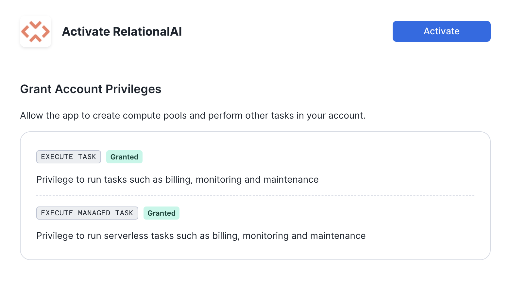

author: Patrick Lee, Steve Bertolani
id: community_detection_using_relationalai
summary: This guide shows how to use RelationalAI and Snowflake to create a social graph and detect customer communities from retail transaction data.
categories: data-science, graph-analysis, relationalai, community-detection
environments: web
status: Published 
feedback link: https://github.com/RelationalAI/rai-samples/issues
tags: Getting Started, Data Science, Data Engineering, Twitter 

# Community Detection using RelationalAI

## Overview 
Duration: 1

In this quickstart, we'll use RelationalAI — a Native App available in the Snowflake Marketplace — to run community detection algorithms. The sample data represent food-truck orders, and we'll use them to identify groups of customers who probably know each other. This allows us to build a social graph and interact with groups of related customers.

### What Is RelationalAI?

RelationalAI is a cloud-native platform that enables organizations to streamline and enhance decisions with intelligence. RelationalAI extends Snowflake with native support for an expanding set of AI workloads (e.g., graph analytics, rule-based reasoning, and optimization), all within your Snowflake account, offering the same ease of use, scalability, security, and governance.
Users can build a knowledge graph using Python and materialize it on top of their Snowflake data, which are shared with the RelationalAI app through Snowflake Streams. Insights can be written to Snowflake tables and shared across the organization.

### What You’ll Learn

In this quickstart, you'll learn:

- How to discover new insights by running a variety of graph algorithms on your Snowflake data
- How to complement your graph analytics with graph visualizations
- How — thanks to native applications with Snowpark Container Services — we can do all of this within the Snowflake Data Cloud

### What You’ll Need

- A [Snowflake](https://signup.snowflake.com/) Account on AWS in the US East (N. Virginia) region or the US West (Oregon) region.
- Basic knowledge of using a Snowflake SQL Worksheet
- [Snowflake privileges on your user to install a Native Application](https://other-docs.snowflake.com/en/native-apps/consumer-installing#set-up-required-privileges)
- Either:
    - Snowflake privileges to create databases and schemas in your Snowflake account, or
    - A Snowflake table called `RAI_DEMO.TASTYBYTES.ORDER` that contains the data used in this quickstart.
- The [RAI Community Detection Jupyter notebook](https://relational.ai/notebooks/community-detection.ipynb) used in this quickstart

### What You’ll Build

- A community detection analysis to find which food truck customers frequently eat together
- A visualization of this data

<!-- ------------------------ -->

## Install the RelationalAI Native App In Your Account
Duration: 7

### Installation Sequence

In the [Snowflake Marketplace](https://app.snowflake.com/marketplace), search for the ‘RelationalAI’ Native App and request it by clicking the “Request” button. When your request is approved by the RelationalAI team, you will receive an email with a link to install the app in your Snowflake account. Follow that link and click Get button to begin installing the app:


You should see a screen like this prompting you to choose a warehouse:


After selecting a warehouse (any size will do, this is only for installation), a progress dialog will show for a minute or two:


Next you'll get a button says “Configure”:


After you click that button, you'll be prompted to choose a warehouse for the app:


Select the warehouse you want to use. The next screen asks for permissions:


The next button prompts you to activate the app:



The last screen in this sequence prompts you to launch the app:


Congratulations! The RelationalAI app is now available in your Snowflake account. 

### Setup

Once the app is running, open a Snowsight SQL worksheet and run the following SQL commands one-by-one:

```sql
USE ROLE ACCOUNTADMIN;

-- Create a base compute pool for the application
CREATE COMPUTE POOL IF NOT EXISTS rai_compute_pool
    FOR APPLICATION RelationalAI
    MIN_NODES = 1
    MAX_NODES = 1
    AUTO_RESUME = TRUE
    AUTO_SUSPEND_SECS = 300
    INSTANCE_FAMILY = HIGHMEM_X64_S;
GRANT USAGE, MONITOR ON COMPUTE POOL rai_compute_pool TO APPLICATION RelationalAI;

-- create a medium size engine pool for users to start engines from
CREATE COMPUTE POOL IF NOT EXISTS m_engines
    FOR APPLICATION RelationalAI
    MIN_NODES = 1
    MAX_NODES = 10
    AUTO_RESUME = TRUE
    AUTO_SUSPEND_SECS = 300
    INSTANCE_FAMILY = HIGHMEM_X64_S;
GRANT USAGE, MONITOR ON COMPUTE POOL m_engines TO APPLICATION RelationalAI;

-- create a Snowflake Warehouse that the application can use
CREATE WAREHOUSE IF NOT EXISTS rai_warehouse WITH
    MAX_CONCURRENCY_LEVEL = 8
    WAREHOUSE_SIZE = 'X-SMALL'
    AUTO_SUSPEND = 180
    AUTO_RESUME = TRUE
    INITIALLY_SUSPENDED = TRUE;
GRANT USAGE ON WAREHOUSE rai_warehouse TO APPLICATION RelationalAI;

-- create the telemetry database
CREATE DATABASE IF NOT EXISTS DEMO;
CREATE SCHEMA IF NOT EXISTS DEMO.SOURCE;
CREATE EVENT TABLE IF NOT EXISTS DEMO.SOURCE.event_table;
ALTER ACCOUNT SET EVENT_TABLE = DEMO.SOURCE.event_table;
ALTER APPLICATION RelationalAI SET SHARE_EVENTS_WITH_PROVIDER = TRUE;

-- start the native application service
CALL relationalai.app.start_service('rai_compute_pool','rai_warehouse');

-- create a medium size engine from your compute pool
-- note that this command usually takes 2-3 minutes
CALL relationalai.api.create_engine('M_ENGINE', 'm_engines', 'HighMem|S');

-- set the engine you just created as the CDC engine
CALL relationalai.app.setup_cdc('M_ENGINE');
```


Finally, you need to create a role that should be granted to any users permitted to use this application
```sql
-- In your account, create a role specific for accessing the app
CREATE ROLE rai_user;
-- Link the app's user role to the created role
GRANT APPLICATION ROLE relationalai.user TO ROLE rai_user;
```

Refer to the [documentation](https://relational.ai/docs/native_app/installation) for full instructions and more details about how to use the RelationalAI Native App.

## Set Up Your Environment
Duration: 8

In addition to your Snowflake account setup, follow the steps below to set up a local installation of Python with Jupyter Lab and the RelationalAI Python library.

- Create a directory for this project and place the [demo notebook](https://relational.ai/notebooks/community-detection.ipynb) in it.
- Navigate to your project directory in your operating system's terminal application.
- Check your Python installation:
    - Run `python3 --version` from your terminal.
        - If your Python version starts with 3.10 or 3.11, it's compatible with the RelationalAI Python library.
        - Otherwise, you'll need to download and install Python:
            - Download the installer for your OS from the [Python 3.11 download page](https://www.python.org/downloads/release/python-3119/)
            - Run the installer.
            - Verify that Python 3.11 is available by running `python3.11 --version` from your terminal.
- Set up a virtual environment for the packages you'll install:
    ```bash
    python3.11 -m venv .venv # or python3 -m venv .venv, if you don't have a python3.11 executable
    source .venv/bin/activate  # Activate on Linux and macOS.
    # .venv\Scripts\activate  # Activate on Windows.
    python -m pip install jupyterlab relationalai
    ```

### RelationalAI Config File

After installing the `relationalai` package, you will need to set up a RAI configuration with the Snowflake credenrtials you want to use (similar to the configuration for Snowflake CLI).

Run `rai init` from your terminal and follow the prompts to enter your credentials and other configuration data:


1. Choose `Snowflake` as your host platform.
2. Select a profile from `~/.snowflake/connections.toml` if you have one, or enter your username, password, and Account ID otherwise. 
3. Select your role `rai_user` that you created earlier.
4. Select a Snowflake warehouse.
5. Select `[CREATE A NEW ENGINE]` to create a new engine. Enter any name you want for the engine, for example `rai_engine`. (Usually you would not want to select the same engine you created above for CDC.)
6. Select `HighMem|S` as the engine size.
7. Choose the compute pool `rai_compute_pool` that you created above.
8. Press `Enter` to accept the default profile name of `default`.

## Run the Notebook in Jupyter Lab
Duration: 15

1. Start Jupyter Lab with the following command:
   
    ```bash
    jupyter lab
    ```
    
    and visit the URL (something like `http://localhost:8888/lab?token=XXXX`) printed in the console output in your browser.

2. Open the `community-detection.ipynb` file in Jupyter lab. You should see the top of the notebook:


3. If you don't already have a Snowflake table called `RAI_DEMO.TASTYBYTES.ORDERS`, scroll down to the Appendix and run the cells in that section to insert the data for this demo into your Snowflake account.
   
4. The notebook will guide you through defining a knowledge graph!

---

## Conclusion & Resources
Duration: 1

Congratulations on completing the our Community Detection using RelationalAI guide! In this Quickstart you learned

- How to install the RelationalAI Native App from the Snowflake Marketplace
- How to build a knowledge graph on top of your Snowflake data without having to export your data from Snowflake
- How to run graph algorithms on your knowledge graph and visualize relationships in the graph

### Resources
- To learn about more about RelationalAI and view full documentation, visit [https://relational.ai](https://relational.ai)
- [Louvain community detection method](https://en.wikipedia.org/wiki/Louvain_method)
- [Snowflake Marketplace](https://app.snowflake.com/marketplace)
- More info on [Snowflake Native Apps](https://docs.snowflake.com/en/developer-guide/native-apps/native-apps-about)
