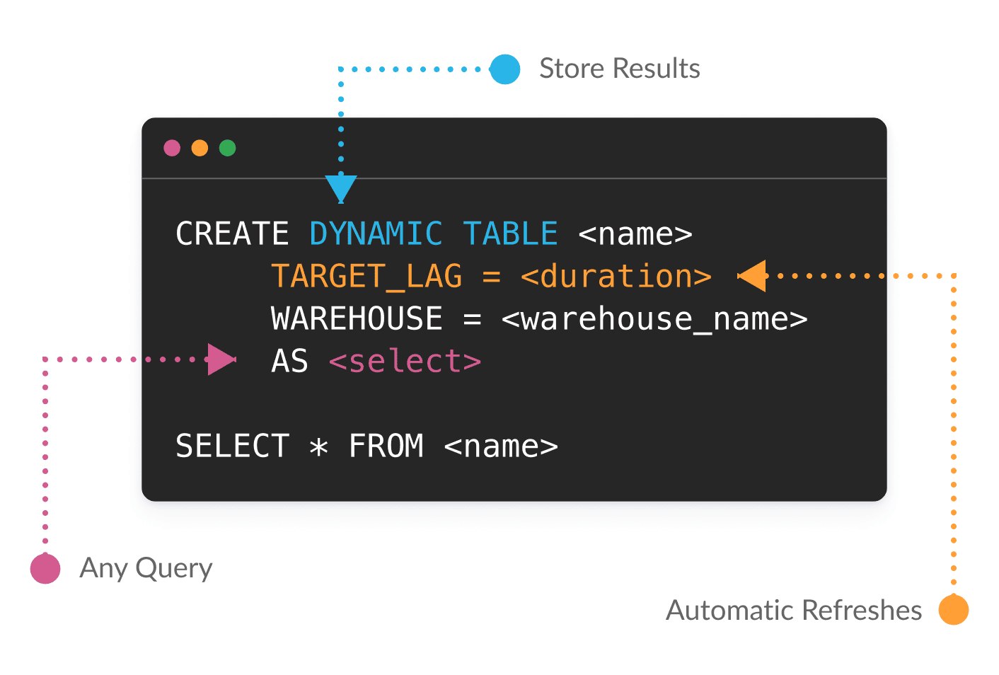
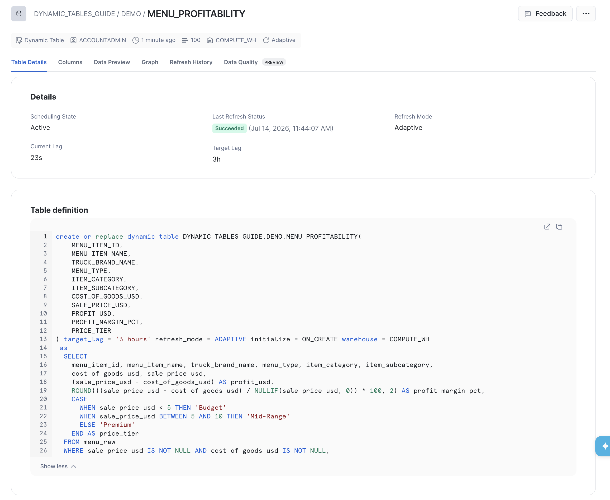
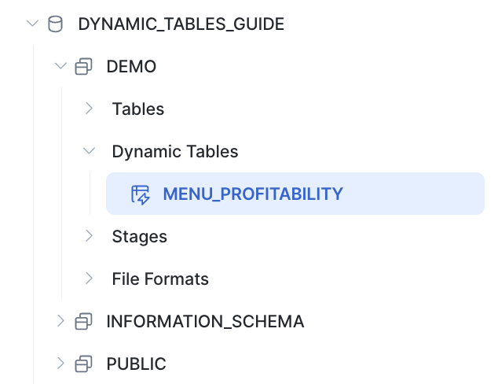
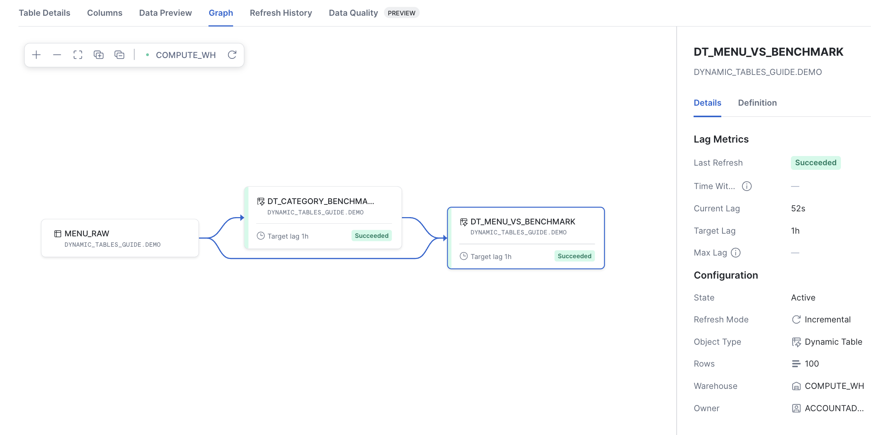
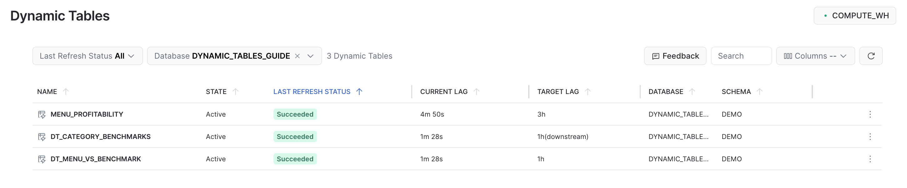
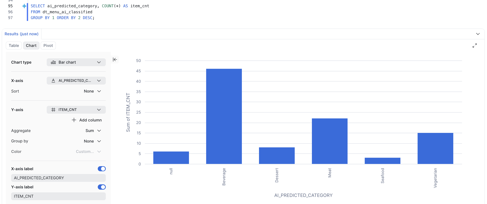

author: Yoav Ostrinsky
id: comprehensive-guide-to-dynamic-tables
summary: Build declarative, self-refreshing pipelines with Snowflake Dynamic Tables — including refresh modes, SCD Type 1 & 2, custom incremental (MERGE) logic, Dynamic Iceberg Tables, in-pipeline AI, and orchestration.
categories: snowflake-site:taxonomy/product/data-engineering,snowflake-site:taxonomy/snowflake-feature/dynamic-tables,snowflake-site:taxonomy/snowflake-feature/transformation
environments: web
status: Published
language: en
feedback link: https://github.com/Snowflake-Labs/sfguides/issues
tags: Getting Started, Dynamic Tables, Data Engineering, CDC, Iceberg, Cortex AI

# Comprehensive Guide to Snowflake Dynamic Tables
<!-- ------------------------ -->
## Overview

Building data pipelines usually means gluing together schedules, streams, tasks, and a quiet prayer that they all fire in the right order. Dynamic Tables throw out that whole toolbox.

You write a `SELECT`. You say how fresh you want the data. That's it. Snowflake works out the dependencies, processes only what actually changed, and keeps everything current while you get on with your life.

No orchestration code. No refresh babysitting. No "why didn't my task run?" at 2am.

And it's one model for **both batch and streaming**: the same Dynamic Table keeps its results current whether new data lands in nightly loads or a continuous feed.

This guide takes you from your very first Dynamic Table all the way to the good stuff — layered pipelines, custom `MERGE` logic, open Iceberg output, and even AI running right inside your pipeline. By the end you'll see why, if your logic fits a query, a Dynamic Table is simply the best way to run it.



> **Work smarter with Cortex Code (CoCo):** Snowflake's coding agent ships a `/dynamic-tables` skill that scaffolds, optimizes, and debugs Dynamic Table pipelines for you. Describe the pipeline you want and let CoCo drive — it's the fastest way to go from idea to a running Dynamic Table.

### What You'll Learn

- Keep data fresh with `TARGET_LAG` and incremental refresh — across **both batch and streaming** pipelines
- Build **multi-layer pipelines** with joins and dependent Dynamic Tables
- Choose the right **refresh mode** (`AUTO`, `INCREMENTAL`, `FULL`, `ADAPTIVE`) and monitor refreshes
- Build pipelines with fewer moving parts — **declarative** and **Custom Incremental** Dynamic Tables (`REFRESH USING`), and Dynamic Tables from Python with **Snowpark**
- Apply **common patterns**: stream-static joins, deduplication, and **SCD Type 1 & 2**
- Materialize output in open **Apache Iceberg™** format
- Enrich data in-pipeline with **Cortex AI** (`AI_CLASSIFY`)
- Operationalize with **orchestration** (Task DAGs, dbt) and **CI/CD** (DCM)

### Prerequisites

- A Snowflake account with `ACCOUNTADMIN` (or a role that can create schemas, warehouses, and dynamic tables)
- A warehouse named `COMPUTE_WH` (adjust as needed) — the guide creates its own database
- Familiarity with basic SQL

<!-- ------------------------ -->
## Load Sample Data

We use the Tasty Bytes menu dataset from a public S3 bucket. Every object is created in a dedicated `DYNAMIC_TABLES_GUIDE` database, so it's easy to find and to clean up at the end.

```sql
-- =============================================================================
-- LOAD DATA
-- =============================================================================
USE ROLE ACCOUNTADMIN;
USE WAREHOUSE COMPUTE_WH;

-- Create a dedicated database and schema for this guide
CREATE DATABASE IF NOT EXISTS DYNAMIC_TABLES_GUIDE;
CREATE SCHEMA IF NOT EXISTS DYNAMIC_TABLES_GUIDE.DEMO;
USE SCHEMA DYNAMIC_TABLES_GUIDE.DEMO;

CREATE OR REPLACE FILE FORMAT csv_ff TYPE = 'CSV';

CREATE OR REPLACE STAGE tasty_bytes_stage
  URL = 's3://sfquickstarts/tastybytes/'
  FILE_FORMAT = csv_ff;

CREATE OR REPLACE TABLE menu_raw (
  menu_id NUMBER(19,0), menu_type_id NUMBER(38,0), menu_type VARCHAR, truck_brand_name VARCHAR,
  menu_item_id NUMBER(38,0), menu_item_name VARCHAR, item_category VARCHAR, item_subcategory VARCHAR,
  cost_of_goods_usd NUMBER(38,4), sale_price_usd NUMBER(38,4), menu_item_health_metrics_obj VARIANT
);

COPY INTO menu_raw FROM @tasty_bytes_stage/raw_pos/menu/;

SELECT * FROM menu_raw LIMIT 10;
```

You should load **100** menu items across **4** item categories.

<!-- ------------------------ -->
## Your First Dynamic Table

A Dynamic Table declares *what* the data should look like and *how fresh* it must be. Snowflake handles the rest.

| Parameter | Purpose |
|:--|:--|
| `TARGET_LAG` | How fresh the data should be (e.g. `'10 minutes'`, `'1 hour'`, `'DOWNSTREAM'`) |
| `WAREHOUSE` | Compute used for refresh |
| `REFRESH_MODE` | `AUTO` (default), `INCREMENTAL`, `FULL`, or `ADAPTIVE` |
| `AS SELECT` | The query defining the contents |

```sql
CREATE OR REPLACE DYNAMIC TABLE menu_profitability
  TARGET_LAG = '3 hours'
  WAREHOUSE = COMPUTE_WH
  AS
  SELECT
    menu_item_id, menu_item_name, truck_brand_name, menu_type, item_category, item_subcategory,
    cost_of_goods_usd, sale_price_usd,
    (sale_price_usd - cost_of_goods_usd) AS profit_usd,
    ROUND(((sale_price_usd - cost_of_goods_usd) / NULLIF(sale_price_usd, 0)) * 100, 2) AS profit_margin_pct,
    CASE
      WHEN sale_price_usd < 5 THEN 'Budget'
      WHEN sale_price_usd BETWEEN 5 AND 10 THEN 'Mid-Range'
      ELSE 'Premium'
    END AS price_tier
  FROM menu_raw
  WHERE sale_price_usd IS NOT NULL AND cost_of_goods_usd IS NOT NULL;
```

Once created, your Dynamic Table shows up in the database object explorer alongside regular tables:



Query it like any other table:

```sql
SELECT truck_brand_name, menu_item_name, price_tier, profit_usd, profit_margin_pct
FROM menu_profitability
ORDER BY profit_margin_pct DESC
LIMIT 10;
```


<!-- TODO: screenshot of menu_profitability query result -->

<!-- ------------------------ -->
## Building a Pipeline: Layered Dynamic Tables

Real pipelines rarely stop at one table. Dynamic Tables can **read from other Dynamic Tables** and use **joins** — Snowflake infers the dependency graph and refreshes everything in order.

First, an aggregate Dynamic Table with the average price per category. Because it only feeds a downstream table, set `TARGET_LAG = 'DOWNSTREAM'` so it refreshes only when something below it needs fresh data:

```sql
CREATE OR REPLACE DYNAMIC TABLE dt_category_benchmarks
  TARGET_LAG = 'DOWNSTREAM'
  WAREHOUSE = COMPUTE_WH
  AS
  SELECT item_category, ROUND(AVG(sale_price_usd), 2) AS avg_category_price
  FROM menu_raw
  WHERE sale_price_usd IS NOT NULL
  GROUP BY item_category;
```

Next, a Dynamic Table that **joins** each menu item back to its category benchmark. It reads from both `dt_category_benchmarks` (a Dynamic Table) and `menu_raw` (a base table):

```sql
CREATE OR REPLACE DYNAMIC TABLE dt_menu_vs_benchmark
  TARGET_LAG = '1 hour'
  WAREHOUSE = COMPUTE_WH
  AS
  SELECT m.menu_item_name, m.item_category, m.sale_price_usd,
         b.avg_category_price,
         ROUND(m.sale_price_usd - b.avg_category_price, 2) AS price_vs_category_avg
  FROM menu_raw m
  JOIN dt_category_benchmarks b ON m.item_category = b.item_category
  WHERE m.sale_price_usd IS NOT NULL;

SELECT menu_item_name, item_category, sale_price_usd, avg_category_price, price_vs_category_avg
FROM dt_menu_vs_benchmark
ORDER BY price_vs_category_avg DESC
LIMIT 5;
```

Expected result — the priciest items relative to their category average:

| MENU_ITEM_NAME | ITEM_CATEGORY | SALE_PRICE_USD | AVG_CATEGORY_PRICE | PRICE_VS_CATEGORY_AVG |
|:--|:--|:--|:--|:--|
| Rack of Pork Ribs | Main | 21.0000 | 12.29 | 8.71 |
| The King Combo | Main | 20.0000 | 12.29 | 7.71 |
| Tandoori Mixed Grill | Main | 18.0000 | 12.29 | 5.71 |
| Spicy Miso Vegetable Ramen | Main | 17.2500 | 12.29 | 4.96 |

Snowflake maintains this as a pipeline: `menu_raw → dt_category_benchmarks → dt_menu_vs_benchmark`. When `menu_raw` changes, both Dynamic Tables refresh in dependency order — no orchestration code required.


<!-- TODO: screenshot of the Dynamic Table dependency graph in Snowsight -->

<!-- ------------------------ -->
## Incremental Refresh

Incremental refresh processes only the rows that changed since the last refresh, instead of recomputing the whole table. Let's generate new data and watch it work.

```sql
CREATE OR REPLACE PROCEDURE generate_menu_items(num_rows INTEGER)
RETURNS STRING
LANGUAGE SQL
AS
$$
DECLARE
  items_before INTEGER;
  items_after INTEGER;
BEGIN
  SELECT COUNT(*) INTO :items_before FROM menu_raw;
  INSERT INTO menu_raw
  SELECT
    (SELECT COALESCE(MAX(menu_id), 0) FROM menu_raw) + ROW_NUMBER() OVER (ORDER BY RANDOM()),
    menu_type_id, menu_type, truck_brand_name,
    (SELECT COALESCE(MAX(menu_item_id), 0) FROM menu_raw) + ROW_NUMBER() OVER (ORDER BY RANDOM()),
    'New Menu Item ' || ((SELECT COALESCE(MAX(menu_item_id), 0) FROM menu_raw) + ROW_NUMBER() OVER (ORDER BY RANDOM())),
    item_category, item_subcategory,
    cost_of_goods_usd * (0.8 + UNIFORM(0, 0.4, RANDOM())),
    sale_price_usd * (0.8 + UNIFORM(0, 0.4, RANDOM())),
    menu_item_health_metrics_obj
  FROM menu_raw WHERE menu_item_id IS NOT NULL
  ORDER BY RANDOM() LIMIT :num_rows;
  SELECT COUNT(*) INTO :items_after FROM menu_raw;
  RETURN 'Inserted ' || (:items_after - :items_before)::STRING || ' items. Total: ' || :items_after::STRING;
END;
$$;

CALL generate_menu_items(100);
```

Trigger a refresh now instead of waiting for the schedule. The `ALTER ... REFRESH` command returns a `statistics` column showing exactly how many rows were inserted, updated, or copied — proof that only the changed rows were processed:

```sql
ALTER DYNAMIC TABLE menu_profitability REFRESH;
```

Expected output — only the 100 new rows are processed, not the whole table:

| DT_NAME | STATISTICS | REFRESHED_DT_COUNT |
|:--|:--|:--|
| ...MENU_PROFITABILITY | {"insertedRows":100,"copiedRows":0,"deletedRows":0} | 1 |

Not every transformation can refresh incrementally. For the full list of supported constructs, see [Supported queries for dynamic tables](https://docs.snowflake.com/en/user-guide/dynamic-tables/supported-queries).

<!-- ------------------------ -->
## Refresh Modes

Every Dynamic Table has a **refresh mode** that controls how it updates. You set it with `REFRESH_MODE` at creation time.

| Mode | What it does | Use when |
|:--|:--|:--|
| `AUTO` (default) | Snowflake resolves to `INCREMENTAL` or `FULL` once at creation | Prototyping; verify the resolved mode with `SHOW DYNAMIC TABLES` |
| `INCREMENTAL` | Processes only changed rows and merges them in | The definition supports it and a small fraction of data changes per refresh |
| `FULL` | Re-runs the whole query and replaces the result | The definition can't incrementalize (e.g. `EXCEPT`, exact percentiles) or most rows change each cycle |
| `ADAPTIVE` | Refreshes incrementally, but auto-reinitializes when a large change makes a rebuild cheaper | Mostly-incremental workloads with occasional bulk loads |

> **ADAPTIVE is the mode to reach for on messy, real-world data.** It refreshes incrementally by default, but the moment a bulk load or large update would make incremental processing more expensive than a full rebuild, it reinitializes automatically — then drops right back to incremental on the next cycle. You get incremental economics on steady data *and* graceful handling of big swings, with no mode to babysit.

Verify the resolved mode after creation:

```sql
SHOW DYNAMIC TABLES LIKE 'menu_profitability';
-- Inspect the refresh_mode and refresh_mode_reason columns
```

<!-- ------------------------ -->
## Monitoring Refreshes

Every refresh is recorded in `INFORMATION_SCHEMA.DYNAMIC_TABLE_REFRESH_HISTORY`. Query it to see whether each refresh was `INCREMENTAL` or `FULL`, its state, and how long it took:

```sql
SELECT name, refresh_action, state,
       DATEDIFF('second', refresh_start_time, refresh_end_time) AS duration_seconds
FROM TABLE(INFORMATION_SCHEMA.DYNAMIC_TABLE_REFRESH_HISTORY())
WHERE name = 'MENU_PROFITABILITY'
ORDER BY refresh_start_time DESC
LIMIT 5;
```

The `refresh_action` column shows `INCREMENTAL` when Snowflake processed only the changed rows. You can also monitor refresh history, lag, and the dependency graph visually in Snowsight under **Monitoring » Dynamic Tables**.


<!-- TODO: screenshot of the Snowsight Dynamic Tables monitoring / refresh history UI -->

<!-- ------------------------ -->
## Simplified Pipelines

Two of the most common pipelines to modernize are Materialized Views and Streams + Tasks. A Dynamic Table can replace either with a single, self-refreshing object.

### Replacing a Materialized View

A Materialized View pre-computes and stores query results, but it comes with real limits: you can't control its refresh timing, it has no incremental-refresh guarantees, it can't chain into other materialized views, and it **can't use joins or many complex aggregations**. Dynamic Tables have hardly any of these restrictions — they support joins, complex aggregations, and window functions, and chain into multi-layer pipelines.

To migrate, you keep the same query and change the DDL header:

```sql
-- Materialized View:
CREATE OR REPLACE MATERIALIZED VIEW menu_summary_mv AS
SELECT
  truck_brand_name, menu_type, item_category,
  COUNT(*) AS item_count,
  ROUND(AVG(sale_price_usd - cost_of_goods_usd), 2) AS avg_profit_usd
FROM menu_raw
WHERE sale_price_usd IS NOT NULL AND cost_of_goods_usd IS NOT NULL
GROUP BY truck_brand_name, menu_type, item_category;
```

```sql
-- Becomes a Dynamic Table (same query, new header):
CREATE OR REPLACE DYNAMIC TABLE menu_summary_dt
  TARGET_LAG = '1 hour'
  WAREHOUSE = COMPUTE_WH
  AS
  SELECT
    truck_brand_name, menu_type, item_category,
    COUNT(*) AS item_count,
    ROUND(AVG(sale_price_usd - cost_of_goods_usd), 2) AS avg_profit_usd
  FROM menu_raw
  WHERE sale_price_usd IS NOT NULL AND cost_of_goods_usd IS NOT NULL
  GROUP BY truck_brand_name, menu_type, item_category;
```

You now control freshness with `TARGET_LAG`, get incremental refresh when possible, and can chain this table into downstream Dynamic Tables.

### Replacing Streams and Tasks

A classic CDC pipeline uses a **Stream** to capture changes and a **Task** to `MERGE` them into a target table. Dynamic Tables can replace that pattern with far fewer moving parts. We show two approaches.

#### The traditional Streams + Tasks pattern

```sql
CREATE OR REPLACE STREAM menu_changes_stream ON TABLE menu_raw;

CREATE OR REPLACE TABLE menu_profitability_cdc (
  menu_item_id NUMBER(38,0), menu_item_name VARCHAR, truck_brand_name VARCHAR,
  profit_usd NUMBER(38,4), profit_margin_pct NUMBER(38,2), updated_at TIMESTAMP_NTZ
);

CREATE OR REPLACE TASK update_menu_profitability
  WAREHOUSE = COMPUTE_WH
  SCHEDULE = '3 HOURS'
  WHEN SYSTEM$STREAM_HAS_DATA('menu_changes_stream')
  AS
  MERGE INTO menu_profitability_cdc t
  USING (
    SELECT menu_item_id, menu_item_name, truck_brand_name,
           sale_price_usd - cost_of_goods_usd AS profit_usd,
           ROUND(((sale_price_usd - cost_of_goods_usd) / NULLIF(sale_price_usd, 0)) * 100, 2) AS profit_margin_pct,
           METADATA$ACTION
    FROM menu_changes_stream
  ) s ON t.menu_item_id = s.menu_item_id
  WHEN MATCHED AND s.METADATA$ACTION = 'DELETE' THEN DELETE
  WHEN MATCHED THEN UPDATE SET t.profit_usd = s.profit_usd, t.profit_margin_pct = s.profit_margin_pct, t.updated_at = CURRENT_TIMESTAMP()
  WHEN NOT MATCHED THEN INSERT (menu_item_id, menu_item_name, truck_brand_name, profit_usd, profit_margin_pct, updated_at)
                        VALUES (s.menu_item_id, s.menu_item_name, s.truck_brand_name, s.profit_usd, s.profit_margin_pct, CURRENT_TIMESTAMP());
```

That's a stream, a task, a target table, and a schedule to manage.

#### Approach A: a declarative Dynamic Table

When the transformation is expressible as a `SELECT`, a single Dynamic Table replaces all of it:

```sql
CREATE OR REPLACE DYNAMIC TABLE menu_profitability_dt
  TARGET_LAG = '3 hours'
  WAREHOUSE = COMPUTE_WH
  AS
  SELECT menu_item_id, menu_item_name, truck_brand_name,
         (sale_price_usd - cost_of_goods_usd) AS profit_usd,
         ROUND(((sale_price_usd - cost_of_goods_usd) / NULLIF(sale_price_usd, 0)) * 100, 2) AS profit_margin_pct
  FROM menu_raw;
```

#### Approach B: a Custom Incremental Dynamic Table (`REFRESH USING`)

Sometimes your logic *isn't* a plain `SELECT` — you need explicit `MERGE`/`INSERT` control (per-row update vs. delete, stream-static joins, accumulators). **Custom incremental dynamic tables** let you write exactly the `MERGE` you'd have put in the task, but Snowflake still owns scheduling, retries, and dependency tracking. They're especially strong at **stream-static joins** — enriching a fast, append-only event stream against slowly-changing dimension tables — because `CHANGES()` feeds only the new events while the dimensions are read fresh on every refresh.

> The refresh logic is a single `MERGE` or `INSERT` statement inside `REFRESH USING`. `SELF` refers to the dynamic table itself, and `CHANGES(...)` streams the base table's changes automatically — no offsets to manage.

```sql
ALTER TABLE menu_raw SET CHANGE_TRACKING = TRUE;

CREATE OR REPLACE DYNAMIC TABLE menu_profitability_cidt (
  menu_item_id NUMBER(38,0), menu_item_name VARCHAR, truck_brand_name VARCHAR,
  profit_usd NUMBER(38,4), profit_margin_pct NUMBER(38,2), updated_at TIMESTAMP_NTZ
)
  TARGET_LAG = '3 hours'
  WAREHOUSE = COMPUTE_WH
  REFRESH USING (
    MERGE INTO SELF t USING (
      SELECT menu_item_id, menu_item_name, truck_brand_name,
             (sale_price_usd - cost_of_goods_usd) AS profit_usd,
             ROUND(((sale_price_usd - cost_of_goods_usd) / NULLIF(sale_price_usd, 0)) * 100, 2) AS profit_margin_pct,
             act
      FROM (
        SELECT menu_item_id, menu_item_name, truck_brand_name, sale_price_usd, cost_of_goods_usd,
               METADATA$ACTION AS act,
               ROW_NUMBER() OVER (PARTITION BY menu_item_id ORDER BY CASE WHEN METADATA$ACTION = 'INSERT' THEN 1 ELSE 0 END DESC) AS rn
        FROM menu_raw CHANGES(INFORMATION => DEFAULT)
      ) WHERE rn = 1
    ) s ON t.menu_item_id = s.menu_item_id
    WHEN MATCHED AND s.act = 'DELETE' THEN DELETE
    WHEN MATCHED THEN UPDATE SET menu_item_name = s.menu_item_name, truck_brand_name = s.truck_brand_name,
                                 profit_usd = s.profit_usd, profit_margin_pct = s.profit_margin_pct, updated_at = CURRENT_TIMESTAMP()
    WHEN NOT MATCHED AND s.act = 'INSERT' THEN
      INSERT (menu_item_id, menu_item_name, truck_brand_name, profit_usd, profit_margin_pct, updated_at)
      VALUES (s.menu_item_id, s.menu_item_name, s.truck_brand_name, s.profit_usd, s.profit_margin_pct, CURRENT_TIMESTAMP())
  );
```

Insert and update a row, refresh, and confirm the custom logic ran:

```sql
INSERT INTO menu_raw (menu_id, menu_type_id, menu_type, truck_brand_name, menu_item_id, menu_item_name, item_category, item_subcategory, cost_of_goods_usd, sale_price_usd, menu_item_health_metrics_obj)
VALUES (9999, 1, 'Snack', 'Test Truck', 9999, 'CIDT Test Taco', 'Main', 'Taco', 2.00, 8.00, NULL);
UPDATE menu_raw SET sale_price_usd = 99.00 WHERE menu_item_id = 9999;

ALTER DYNAMIC TABLE menu_profitability_cidt REFRESH;

SELECT menu_item_id, menu_item_name, profit_usd, profit_margin_pct
FROM menu_profitability_cidt WHERE menu_item_id = 9999;
```

Expected result — the insert and the update collapse to the final value:

| MENU_ITEM_ID | MENU_ITEM_NAME | PROFIT_USD | PROFIT_MARGIN_PCT |
|:--|:--|:--|:--|
| 9999 | CIDT Test Taco | 97.0000 | 97.98 |

#### When to use which

| | Streams + Tasks | Declarative Dynamic Table | Custom Incremental Dynamic Table |
|:--|:--|:--|:--|
| Objects to manage | Stream + Task + Table | One Dynamic Table | One Dynamic Table |
| Refresh control | Task schedule + `WHEN` | `TARGET_LAG` | `TARGET_LAG` |
| Transformation | Any DML | `SELECT` only | Single `MERGE`/`INSERT` |
| Best for | Legacy pipelines | Expressible as `SELECT` | Imperative logic, CDC with deletes, accumulators |

### From Python (Snowpark)

Prefer Python? Snowpark's DataFrame API creates Dynamic Tables directly with [`create_or_replace_dynamic_table`](https://docs.snowflake.com/en/developer-guide/snowpark/reference/python/latest/snowpark/api/snowflake.snowpark.DataFrame.create_or_replace_dynamic_table) — build the transformation as a DataFrame and materialize it as a self-refreshing table:

```python
from snowflake.snowpark import Session
from snowflake.snowpark.functions import col

session = Session.builder.getOrCreate()

df = (
    session.table("menu_raw")
    .filter(col("sale_price_usd").is_not_null())
    .select(
        col("menu_item_id"),
        col("menu_item_name"),
        col("truck_brand_name"),
        (col("sale_price_usd") - col("cost_of_goods_usd")).alias("profit_usd"),
    )
)

df.create_or_replace_dynamic_table(
    "menu_profitability_snowpark",
    warehouse="COMPUTE_WH",
    lag="1 hour",
    refresh_mode="INCREMENTAL",
)
```

Same `TARGET_LAG`, refresh, and incremental behavior — you just define the pipeline in Python.

<!-- ------------------------ -->
## Common Pipeline Patterns

A handful of patterns cover most real pipelines. Three you'll reach for constantly: enriching a live stream, deduplicating a change log, and tracking history — each just a few lines with a Dynamic Table.

### Stream processing: stream-static joins

Dynamic Tables are a natural fit for **stream processing**. Here an append-only `order_events` stream is enriched against the static `menu_raw` dimension — a classic stream-static join. A custom incremental table with `CHANGES(INFORMATION => APPEND_ONLY)` feeds only the new events; the menu dimension is read fresh on each refresh:

```sql
CREATE OR REPLACE TABLE order_events (
  order_id NUMBER, menu_item_id NUMBER, quantity NUMBER, event_ts TIMESTAMP_NTZ
) CHANGE_TRACKING = TRUE;

-- Two order events land in the stream
INSERT INTO order_events
  SELECT 1, menu_item_id, 2, '2026-06-17 12:00:00' FROM menu_raw WHERE menu_item_name = 'Ice Tea' LIMIT 1;
INSERT INTO order_events
  SELECT 2, menu_item_id, 1, '2026-06-17 12:01:00' FROM menu_raw WHERE menu_item_name = 'Lemonade' LIMIT 1;

CREATE OR REPLACE DYNAMIC TABLE enriched_order_events (
  order_id NUMBER, menu_item_id NUMBER, menu_item_name VARCHAR,
  quantity NUMBER, revenue_usd NUMBER(38,4), event_ts TIMESTAMP_NTZ
)
  TARGET_LAG = '1 minute'
  WAREHOUSE = COMPUTE_WH
  REFRESH USING (
    INSERT INTO SELF
    SELECT e.order_id, e.menu_item_id, m.menu_item_name, e.quantity,
           e.quantity * m.sale_price_usd AS revenue_usd, e.event_ts
    FROM order_events CHANGES(INFORMATION => APPEND_ONLY) AS e
    JOIN menu_raw AS m ON e.menu_item_id = m.menu_item_id
  );

SELECT order_id, menu_item_name, quantity, revenue_usd
FROM enriched_order_events ORDER BY order_id;
```

Each new order event is enriched with its menu details and revenue *as it arrives* — only the new events are processed, never the whole history:

| ORDER_ID | MENU_ITEM_NAME | QUANTITY | REVENUE_USD |
|:--|:--|:--|:--|
| 1 | Ice Tea | 2 | 6.0000 |
| 2 | Lemonade | 1 | 3.5000 |

### Deduplication & history (SCD Types 1 and 2)

A huge share of pipeline work is really just **deduplication** — collapsing a noisy change log down to the current row per key. That's SCD Type 1, and it's a one-liner with a Dynamic Table. Keeping the full version history (SCD Type 2) is nearly as easy. Both are plain `SELECT`s. Start with a small change log of price events:

```sql
CREATE OR REPLACE TABLE menu_item_history (
  menu_item_id NUMBER, menu_item_name VARCHAR, sale_price_usd NUMBER(38,4), event_ts TIMESTAMP_NTZ
);
INSERT INTO menu_item_history VALUES
  (1, 'Ice Tea', 3.00, '2026-06-01 09:00:00'),
  (1, 'Ice Tea', 3.50, '2026-06-10 09:00:00'),
  (1, 'Ice Tea', 4.25, '2026-06-17 09:00:00'),
  (2, 'Lemonade', 3.50, '2026-06-01 09:05:00');
```

#### SCD Type 1 — latest row per key

Deduplicate to the newest row per key with `QUALIFY ROW_NUMBER() ... = 1`:

```sql
CREATE OR REPLACE DYNAMIC TABLE dt_menu_scd1
  TARGET_LAG = '1 hour'
  WAREHOUSE = COMPUTE_WH
  AS
  SELECT menu_item_id, menu_item_name, sale_price_usd, event_ts AS last_updated
  FROM menu_item_history
  QUALIFY ROW_NUMBER() OVER (PARTITION BY menu_item_id ORDER BY event_ts DESC) = 1;
```

Expected result:

| MENU_ITEM_ID | SALE_PRICE_USD |
|:--|:--|
| 1 | 4.2500 |
| 2 | 3.5000 |

#### SCD Type 2 — full version history

Keep every version with validity ranges. `LEAD()` computes each version's `valid_to` from the next version's start:

```sql
CREATE OR REPLACE DYNAMIC TABLE dt_menu_scd2
  TARGET_LAG = '1 hour'
  WAREHOUSE = COMPUTE_WH
  AS
  SELECT menu_item_id, menu_item_name, sale_price_usd,
         event_ts AS valid_from,
         LEAD(event_ts) OVER (PARTITION BY menu_item_id ORDER BY event_ts) AS valid_to,
         LEAD(event_ts) OVER (PARTITION BY menu_item_id ORDER BY event_ts) IS NULL AS is_current
  FROM menu_item_history;
```

Expected result — item 1 retains all three versions; the open-ended row is current:

| MENU_ITEM_ID | SALE_PRICE_USD | VALID_FROM | IS_CURRENT |
|:--|:--|:--|:--|
| 1 | 3.0000 | 2026-06-01 09:00:00 | FALSE |
| 1 | 3.5000 | 2026-06-10 09:00:00 | FALSE |
| 1 | 4.2500 | 2026-06-17 09:00:00 | TRUE |
| 2 | 3.5000 | 2026-06-01 09:05:00 | TRUE |

> **What about partial updates?** The clean SCD Type 1 above assumes each change carries *all* columns. Real CDC feeds often send only the columns that changed, leaving the rest `NULL` — and a naive "latest row wins" would wipe good data. Custom incremental dynamic tables solve this by coalescing partial updates against the current state — for the full story, see [Managing Partial Updates in an SCD-1 Pipeline on Snowflake](https://www.snowflake.com/en/blog/engineering/snowflake-scd1-partial-updates/).

<!-- ------------------------ -->
## Dynamic Iceberg Tables

A **Dynamic Iceberg Table** stores its output in open Apache Iceberg™ format on Snowflake-managed storage, so external engines (Spark, Trino, etc.) can read it directly — while it still refreshes like any other Dynamic Table.

> Dynamic Iceberg Tables can read from both Iceberg v2 and v3 source tables, and materialize their output as either version — control it with `ICEBERG_VERSION` on the table (or the database-level `ICEBERG_VERSION_DEFAULT`).

```sql
CREATE OR REPLACE DYNAMIC ICEBERG TABLE dt_menu_profit_iceberg
  TARGET_LAG = '1 hour'
  WAREHOUSE = COMPUTE_WH
  REFRESH_MODE = INCREMENTAL
  ICEBERG_VERSION = 3
  AS
  SELECT menu_item_id, menu_item_name, truck_brand_name,
         (sale_price_usd - cost_of_goods_usd) AS profit_usd
  FROM menu_raw
  WHERE sale_price_usd IS NOT NULL AND cost_of_goods_usd IS NOT NULL;
```

Confirm it's stored as Iceberg with the `is_iceberg` flag:

```sql
SHOW DYNAMIC TABLES LIKE 'dt_menu_profit_iceberg';
```

The `is_iceberg` column reads `true`. Everything else — `TARGET_LAG`, incremental refresh, monitoring — behaves exactly as before.

> Want to go deeper on Iceberg — v3 features, external-engine interop, and catalog options? See the [Comprehensive Guide to Apache Iceberg™ v3 Tables](https://www.snowflake.com/en/developers/guides/iceberg-v3-tables-comprehensive-guide/).

<!-- ------------------------ -->
## AI Functions in Dynamic Tables

Because a Dynamic Table is just a query that stays fresh, you can embed **Cortex AI functions** directly in the definition and let the pipeline maintain AI-enriched columns automatically. Here we use `AI_CLASSIFY` to categorize each menu item.

`AI_CLASSIFY` returns an object; pull the label out of `:labels[0]`:

```sql
CREATE OR REPLACE DYNAMIC TABLE dt_menu_ai_classified
  TARGET_LAG = '1 hour'
  WAREHOUSE = COMPUTE_WH
  AS
  SELECT menu_item_id, menu_item_name, item_category AS source_category,
         AI_CLASSIFY(menu_item_name, ['Vegetarian','Meat','Seafood','Dessert','Beverage']):labels[0]::STRING AS ai_predicted_category
  FROM menu_raw
  WHERE menu_item_name IS NOT NULL;

SELECT ai_predicted_category, COUNT(*) AS item_cnt
FROM dt_menu_ai_classified
GROUP BY 1 ORDER BY 2 DESC;
```

Expected distribution (yours may vary slightly — model output isn't perfectly deterministic):

| AI_PREDICTED_CATEGORY | ITEM_CNT |
|:--|:--|
| Beverage | 46 |
| Meat | 23 |
| Vegetarian | 15 |
| Dessert | 8 |
| Seafood | 3 |

> AI functions are non-deterministic, but that doesn't stop you from using them in a Dynamic Table's `SELECT`. The table still refreshes **incrementally** — each new row is classified once as it arrives, and existing rows aren't re-scored on every refresh. You get AI enrichment that stays current while only paying to process new data.


<!-- TODO: screenshot of dt_menu_ai_classified distribution -->

<!-- ------------------------ -->
## Orchestration and DevOps

Dynamic Tables schedule themselves, but they also fit into broader orchestration and CI/CD practices.

### Coordinating with other work

Snowflake refreshes a pipeline of Dynamic Tables in dependency order automatically — you don't build a DAG for the refreshes themselves. When you need to coordinate Dynamic Tables with *other* steps (loads, exports, notifications), you have options:

- **Task graphs (DAGs):** Chain Tasks with predecessor relationships to run steps in order — for example, load a stage, then `EXECUTE TASK` to kick a manual refresh, then export results. Use a finalizer task for teardown/notification steps.
- **dbt:** If you manage transformations in dbt, you can define and orchestrate Dynamic Tables from dbt models. See [Dynamic Tables and dbt](https://docs.snowflake.com/en/user-guide/dynamic-tables/dbt).

### CI/CD with DCM

**Database Change Management (DCM)** projects let you define Dynamic Tables (and their upstream tables, roles, and grants) declaratively and deploy them with a plan/deploy workflow — infrastructure-as-code for Snowflake. Use `INITIALIZE = 'ON_SCHEDULE'` so a deployment returns immediately instead of blocking on the initial refresh.

For an end-to-end DCM pipeline built around Dynamic Tables, see the companion guide: [DCM Projects for Dynamic Tables](https://www.snowflake.com/en/developers/guides/dcm-projects-for-dynamic-tables/).

> DCM (and dbt) manage **declarative, SELECT-based** Dynamic Tables. **Custom incremental dynamic tables (`REFRESH USING`) are not currently supported by DCM or dbt** — manage those with direct SQL or `CREATE OR ALTER`.

<!-- ------------------------ -->
## Cleanup

Everything you created lives in one dedicated database, so cleanup is a single command:

```sql
DROP DATABASE IF EXISTS DYNAMIC_TABLES_GUIDE;
```

<!-- ------------------------ -->
## Conclusion and Resources

That's the whole journey — from a first `SELECT`-and-forget table to layered pipelines, custom `MERGE` logic, open Iceberg output, and AI right in the flow.

Here's the takeaway: almost anything you'd normally wire up with multiple tools or objects, a Dynamic Table can run with less code and far less to babysit. If your logic fits a query, this is the way to build your pipelines.

### What You Learned

- Built self-refreshing pipelines with `TARGET_LAG` and incremental refresh, for batch and streaming
- Layered Dynamic Tables with joins and dependencies
- Chose refresh modes and monitored refreshes
- Built pipelines with declarative and Custom Incremental Dynamic Tables, and from Python with Snowpark
- Applied stream-static joins, deduplication, and SCD Type 1 & 2
- Materialized output as open **Apache Iceberg™** tables
- Enriched data in-pipeline with **Cortex AI** (`AI_CLASSIFY`)
- Orchestrated with **Task DAGs / dbt** and deployed with **DCM**

### Additional Resources

- [Dynamic Tables Documentation](https://docs.snowflake.com/en/user-guide/dynamic-tables-about)
- [Dynamic Table Refresh Modes](https://docs.snowflake.com/en/user-guide/dynamic-tables/refresh-modes)
- [Custom Incrementalization](https://docs.snowflake.com/en/user-guide/dynamic-tables/custom-incrementalization)
- [Create a Dynamic Iceberg Table](https://docs.snowflake.com/en/user-guide/dynamic-tables/create-iceberg)
- [Managing Partial Updates in an SCD-1 Pipeline](https://www.snowflake.com/en/blog/engineering/snowflake-scd1-partial-updates/)
- [DCM Projects for Dynamic Tables](https://www.snowflake.com/en/developers/guides/dcm-projects-for-dynamic-tables/)
- [What's New in Dynamic Tables: Faster and More Flexible](https://www.snowflake.com/en/blog/whats-new-dynamic-tables-faster-flexible/)

---

No menu items — or late-night pipeline pages — were harmed in the making of this guide.
